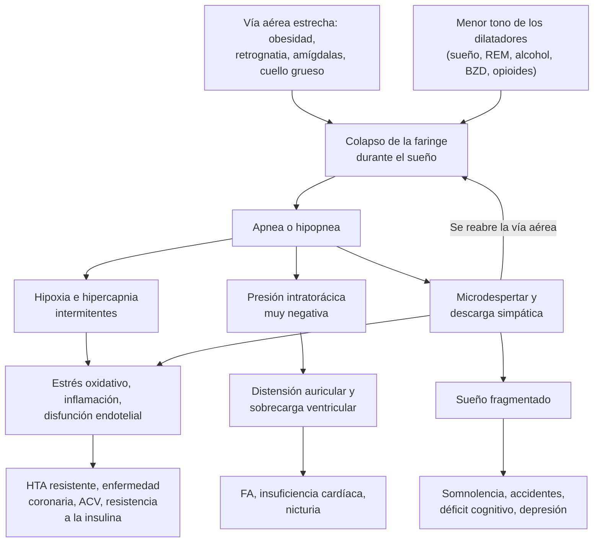

---
tags:
  - Respiratorio
  - Neurología
  - Frecuente en sala
---

# Apnea obstructiva del sueño y trastornos del sueño

**Subespecialidad**
Broncopulmonar · Neurología · Medicina del sueño · Otorrinolaringología · Atención primaria

**Guías principales**
AASM 2017: estudio diagnóstico de la apnea obstructiva del sueño · AASM 2019: tratamiento con presión positiva · AASM 2015: dispositivos orales · ATS 2019: síndrome de obesidad-hipoventilación · AASM 2017 y 2021: tratamiento farmacológico y conductual del insomnio · ACP 2016: insomnio crónico · AASM 2025: piernas inquietas · AASM 2021: hipersomnias centrales · AASM 2023: trastorno conductual del sueño REM

**Otras fuentes**
Prevalencia mundial de la apnea (Benjafield 2019) · Subestudios de la ENS 2016–2017 (Saldías 2019 y 2020) · Metaanálisis chileno (Vasconcello-Castillo 2026) · SAVE (2016) · SERVE-HF (2015) · SURMOUNT-OSA (2024) · Criterios de Beers 2023 · ICSD-3

**GES**
No es GES. El estudio del sueño y el CPAP dependen de la red de cada servicio de salud o de la cobertura del seguro.

**EUNACOM**
1.05.1.033 Síndrome de apnea del sueño (sospecha, inicial, derivar) · 1.10.1.027 Trastornos del sueño (sospecha, inicial, derivar)

**Revisado**
Octubre 2026

!!! abstract "Resumen en 60 segundos"
    - **Apnea obstructiva del sueño (AOS)**: colapso repetido de la faringe durante el sueño, con **hipoxia intermitente** y **microdespertares**.
        - Sospechar con **ronquido**, **pausas presenciadas**, **somnolencia diurna**, **obesidad**, cuello grueso, **HTA resistente** o **FA**.
        - Afecta a **~1000 millones** de personas en el mundo. En Chile, un subestudio de la ENS encontró apnea en el **49 %** de los adultos estudiados.
    - **Los cuestionarios orientan, pero no diagnostican**: **STOP-Bang ≥ 3** (riesgo intermedio o alto) y **Epworth > 10** (somnolencia excesiva).
    - **Diagnóstico**: **poligrafía domiciliaria** en el paciente sin comorbilidad importante y **polisomnografía** en los demás. Gravedad por el **IAH**: **leve 5–14**, **moderada 15–29**, **grave ≥ 30** eventos por hora.
    - **Tratamiento de la AOS**:
        - **Medidas para todos**: bajar de peso, evitar el alcohol y los sedantes, dormir de lado.
        - **CPAP**: si hay **somnolencia** (recomendación fuerte) o mala calidad de vida o HTA (condicional). Uso **≥ 4 h por noche**.
        - **Alternativas**: dispositivo de avance mandibular, cirugía, **tirzepatida** en la obesidad.
    - **Alerta**: obeso con **bicarbonato ≥ 27 mEq/L** o hipercapnia: **síndrome de obesidad-hipoventilación**.
    - **Insomnio crónico** (≥ 3 noches por semana, ≥ 3 meses):
        - **Primera línea**: **terapia cognitivo-conductual (TCC-I)**.
        - Fármacos solo por poco tiempo. **Evitar las benzodiacepinas y los hipnóticos Z en el adulto mayor** (caídas, delirium).
    - **Piernas inquietas**: pedir **ferritina** y dar **hierro si es ≤ 75 ng/mL**. Primera línea farmacológica: **gabapentina o pregabalina**. Evitar los agonistas dopaminérgicos de rutina (**aumento**).
    - **Narcolepsia** (somnolencia y **cataplejía**) y **trastorno conductual del sueño REM** (actúa sus sueños; anuncia **Parkinson**): **derivar**.

## Definición

| Concepto | Definición |
|---|---|
| **Apnea** | Caída del flujo aéreo **≥ 90 %** durante **≥ 10 segundos**. **Obstructiva** si persiste el esfuerzo respiratorio; **central** si no lo hay |
| **Hipopnea** | Caída del flujo **≥ 30 %** durante **≥ 10 segundos**, con una desaturación **≥ 3 %** o un microdespertar (regla recomendada por la AASM; otras definiciones exigen una desaturación ≥ 4 %) |
| **IAH** (índice de apnea-hipopnea) | Número de apneas e hipopneas **por hora de sueño** (polisomnografía). En la poligrafía se calcula por hora de registro (**IER**, índice de eventos respiratorios), lo que puede **subestimar** la gravedad |
| **Apnea obstructiva del sueño** (ICSD-3) | **IAH ≥ 5** con síntomas (somnolencia, sueño no reparador, ronquido, pausas, despertares con ahogo) o comorbilidad (HTA, FA, insuficiencia cardíaca, enfermedad coronaria, ACV, DM2, trastornos del ánimo o cognitivos); o **IAH ≥ 15** aunque no haya síntomas |
| **Apnea central del sueño** | Predominan los eventos **sin esfuerzo respiratorio**. Ejemplo: **respiración de Cheyne-Stokes** en la insuficiencia cardíaca |
| **Síndrome de obesidad-hipoventilación** | **IMC ≥ 30** con **hipercapnia en vigilia** (**PaCO2 ≥ 45 mmHg**), sin otra causa de hipoventilación. El 90 % tiene además una AOS |
| **Insomnio crónico** | Dificultad para **iniciar o mantener el sueño**, o **despertar precoz**, pese a una oportunidad adecuada de dormir, con **repercusión diurna**, **≥ 3 noches por semana** durante **≥ 3 meses** |
| **Somnolencia diurna excesiva** | Tendencia a **quedarse dormido** en situaciones en que se debería estar despierto. No es lo mismo que la **fatiga** (cansancio sin tendencia a dormirse) |
| **Narcolepsia** | Hipersomnia central con somnolencia diurna crónica y entrada precoz en REM. **Tipo 1**: con **cataplejía** o hipocretina baja en el LCR. **Tipo 2**: sin ellas |
| **Síndrome de piernas inquietas** (enfermedad de Willis-Ekbom) | **Urgencia de mover las piernas**, que **empeora en reposo** y en la **tarde o la noche** y **se alivia al moverse** |
| **Parasomnias** | Conductas o experiencias anormales durante el sueño. **NREM**: sonambulismo, terrores nocturnos, despertares confusionales. **REM**: **trastorno conductual del sueño REM**, pesadillas, parálisis del sueño |
| **Trastornos del ritmo circadiano** | El horario del sueño no coincide con el deseado o el exigido: fase retrasada (adolescentes), fase adelantada (adultos mayores), trabajo por turnos, *jet lag* |

## Epidemiología

- **Apnea obstructiva del sueño**:
    - En el mundo, se estima que **936 millones** de adultos de **30 a 69 años** tienen una AOS leve o mayor y **425 millones** una moderada o grave (Benjafield 2019). **La mayoría no está diagnosticada**.
    - Es **más frecuente en los hombres**, aumenta con la **edad** y la **obesidad**, y en las mujeres aumenta después de la **menopausia**.
    - Es muy frecuente en los pacientes con **HTA resistente**, **FA**, **insuficiencia cardíaca**, **ACV**, **DM2** y obesidad mórbida.
- **Insomnio**: los **síntomas** ocasionales afectan a un tercio de los adultos; el **trastorno de insomnio crónico**, a **~10 %**. Es más frecuente en las mujeres, los adultos mayores y las personas con depresión, ansiedad o dolor crónico.
- **Piernas inquietas**: frecuente en la población de origen europeo; en **~2–3 %** los síntomas requieren tratamiento. Es más frecuente en el **embarazo**, la **ferropenia** y la **ERC** en diálisis.
- **Narcolepsia**: rara (cerca de **1 en 2000–4000** personas). Suele comenzar en la adolescencia o la adultez joven y tarda años en diagnosticarse.
- **Trastorno conductual del sueño REM**: cerca del **1 %** de los adultos mayores. Predomina en los **hombres mayores de 50 años**. Es un marcador precoz de **sinucleinopatía**: en una cohorte multicéntrica, la conversión a Parkinson, demencia con cuerpos de Lewy o atrofia multisistémica fue de **6,3 % por año** y de **73,5 % a los 12 años** (Postuma 2019).

!!! chile "Datos nacionales"
    - **Prevalencia de la AOS**: subestudio de la **ENS 2016–2017** con **poligrafía domiciliaria** en **205 adultos** de 18 a 84 años de la Región Metropolitana (Saldías 2020).
        - **AOS (IAH ≥ 5)**: **49 %** (**62 %** de los hombres y **31 %** de las mujeres).
        - **AOS moderada o grave**: **~16 %**.
    - **Cuestionarios en población chilena** (Saldías 2019, misma muestra): el **STOP-Bang** tuvo la mayor **sensibilidad** (**89 %**) y la escala de **Epworth** la mayor **especificidad** (**91 %**). Sirven para seleccionar a quién estudiar.
    - **Metaanálisis chileno** (Vasconcello-Castillo 2026; 15 estudios, 13 157 participantes): el **25 %** tiene un riesgo moderado o alto de AOS (STOP-Bang > 3). Solo **3 estudios** usaron poligrafía: faltan datos objetivos.
    - **Obesidad**: el **74 %** de los adultos tiene sobrepeso u obesidad (ENS 2016–2017), el principal factor de riesgo modificable de la AOS ([ver obesidad](../endocrinologia/obesidad-y-sindrome-metabolico.md)).
    - **Altura geográfica**: en las faenas mineras del norte, la hipoxia de la altura produce **respiración periódica** y **apnea central** del sueño.
    - **No es GES**. El acceso a la polisomnografía y al CPAP en el sistema público es limitado: **seleccionar bien a quién derivar**.

## Etiología

| Trastorno | Causas y factores de riesgo |
|---|---|
| **Apnea obstructiva** | **Obesidad** (sobre todo central y del cuello), **sexo masculino**, **edad**, menopausia, **retrognatia** o micrognatia, **hipertrofia amigdalina**, macroglosia, obstrucción nasal; **alcohol**, **benzodiacepinas** y **opioides** en la noche; **hipotiroidismo**, **acromegalia**, embarazo; insuficiencia cardíaca e insuficiencia renal (desplazamiento nocturno de líquidos al cuello) |
| **Apnea central** | **Insuficiencia cardíaca** (Cheyne-Stokes), **ACV**, **opioides**, **altura**, ERC; apnea central emergente con el CPAP |
| **Hipoventilación** | **Obesidad**, enfermedades **neuromusculares** (ELA, miastenia, distrofias), deformidad de la caja torácica (cifoescoliosis), EPOC grave, opioides |
| **Insomnio** | **Modelo de las 3 P**: factores **predisponentes** (sexo femenino, rasgos ansiosos), **precipitantes** (duelo, estrés, hospitalización, dolor) y **perpetuantes** (siestas, pasar mucho tiempo en la cama, preocupación por dormir, alcohol, hipnóticos). Comorbilidad: **depresión**, **ansiedad**, **dolor**, **nicturia**, **reflujo**, **AOS**, **piernas inquietas**, hipertiroidismo, **fármacos** (corticoides, β-agonistas, **ISRS** activadores, bupropión, diuréticos en la noche, descongestionantes) y sustancias (cafeína, nicotina, alcohol, estimulantes) |
| **Somnolencia diurna** | **Sueño insuficiente** (la causa más frecuente), **AOS**, **fármacos sedantes** (BZD, antihistamínicos, antipsicóticos, opioides, gabapentinoides), depresión, **hipotiroidismo**, trastornos circadianos, narcolepsia, hipersomnia idiopática, TEC, tumores hipotalámicos, encefalopatías |
| **Piernas inquietas** | **Primaria** (familiar, inicio joven) o **secundaria**: **ferropenia**, **embarazo**, **ERC**, neuropatía periférica; **fármacos** que la empeoran: **antihistamínicos** sedantes, **antidepresivos serotoninérgicos** y mirtazapina, **antipsicóticos**, **metoclopramida** |
| **Trastorno conductual del sueño REM** | **Idiopático** (en realidad, una sinucleinopatía prodrómica) o asociado a **Parkinson**, demencia con cuerpos de Lewy, atrofia multisistémica; inducido por **antidepresivos** (ISRS, IRSN, tricíclicos) |

## Fisiopatología

- **Arquitectura normal del sueño**: ciclos de **~90 minutos** de sueño **NREM** (N1, N2 y N3 o sueño profundo) y **REM** (~20–25 % del total, con atonía muscular y sueños vívidos).
    - El **N3 predomina en la primera mitad** de la noche: allí aparecen las **parasomnias NREM**.
    - El **REM predomina en la segunda mitad**: allí aparecen el **trastorno conductual del sueño REM** y las **apneas más graves** (por la atonía).
- **Apnea obstructiva**: durante el sueño cae el **tono de los músculos dilatadores de la faringe** (geniogloso). Si la vía aérea es **anatómicamente estrecha**, colapsa (figura 1).
    - Influyen cuatro rasgos: **anatomía** colapsable, **respuesta muscular** insuficiente, **umbral de despertar bajo** (fragmenta el sueño) y un **control ventilatorio inestable** (alta ganancia del asa).
    - Cada evento produce **hipoxia e hipercapnia intermitentes**, una **presión intratorácica muy negativa** (esfuerzo contra la vía cerrada) y un **microdespertar** con descarga **simpática**.
    - **Consecuencias**:
        - **Cardiovasculares**: HTA (sobre todo nocturna y resistente), FA, insuficiencia cardíaca, enfermedad coronaria, ACV, hipertensión pulmonar (figura 2). Median la activación simpática, el estrés oxidativo, la inflamación y la disfunción endotelial.
        - **Metabólicas**: resistencia a la insulina.
        - **Neurocognitivas**: somnolencia, déficit de atención, accidentes, depresión (por la **fragmentación del sueño**).
        - **Nicturia**: por la liberación de **péptido natriurético auricular** al distenderse la aurícula.
- **Obesidad-hipoventilación**: la carga mecánica de la obesidad, la **menor respuesta del centro respiratorio** al CO2 (resistencia a la leptina) y la AOS producen retención de CO2. El riñón compensa con **bicarbonato alto**.
- **Insomnio**: modelo de **hiperactivación** (*hyperarousal*): mayor actividad cognitiva, cortical y del eje simpático y adrenal, de día y de noche. Las conductas para "compensar" (siestas, quedarse en la cama, alcohol) **lo perpetúan**.
- **Narcolepsia tipo 1**: pérdida de las neuronas de **hipocretina (orexina)** del hipotálamo lateral, probablemente **autoinmune** (asociada al **HLA-DQB1\*06:02**). La intrusión de fenómenos REM en la vigilia explica la **cataplejía**, la **parálisis del sueño** y las **alucinaciones** al dormirse o despertar.
- **Piernas inquietas**: **déficit de hierro cerebral** (aun con ferritina sérica "normal") y disfunción **dopaminérgica**. Por eso el hierro mejora los síntomas y los agonistas dopaminérgicos, al principio eficaces, terminan produciendo **aumento** (síntomas más precoces e intensos).
- **Trastorno conductual del sueño REM**: falla la **atonía del REM** por degeneración de núcleos del **tronco encefálico** (depósito de **α-sinucleína**). El paciente "actúa" sus sueños, a menudo violentos.

*Figura 1. Fisiopatología de la apnea obstructiva del sueño: el ciclo de colapso, hipoxia y microdespertar y sus consecuencias. Esquema propio.*

<figure markdown>
![Diagrama con un recuadro central gris que dice remodelamiento estructural cardiovascular, rodeado de seis recuadros celestes con los factores de la apnea obstructiva del sueño: 1, factores anatómicos (exceso de tejido blando en amígdalas, paladar blando y lengua; estructura del cráneo con mandíbula pequeña o retraída; adenoides grandes o congestión nasal); 2, tono muscular (relajación excesiva de la vía aérea superior que la colapsa o estrecha); 3, aumento de la presión intratorácica (efecto de vacío que aumenta la colapsabilidad de los tejidos blandos); 4, hipoxia e hipercapnia intermitentes (la obstrucción del flujo produce oxígeno bajo y CO2 alto); 5, activación simpática (aumento de la frecuencia cardíaca y vasoconstricción periférica); 6, control neurológico (disfunción de los centros respiratorios, respuestas reflejas alteradas y cambios de serotonina y noradrenalina). Del centro bajan flechas a cinco consecuencias: arritmias, insuficiencia cardíaca, hipertensión sistémica, hipertensión pulmonar y enfermedad coronaria](../assets/figuras/sueno/consecuencias-cv-apnea-dicaro-2024.jpg){ loading=lazy }
<figcaption>Figura 2. Consecuencias cardiovasculares de la apnea obstructiva del sueño: los factores anatómicos, el tono muscular, la presión intratorácica, la hipoxia e hipercapnia intermitentes, la activación simpática y el control neurológico llevan a un remodelamiento cardiovascular, con arritmias, insuficiencia cardíaca, hipertensión sistémica y pulmonar y enfermedad coronaria. Fuente: DiCaro MV, Lei K, Yee B, Tak T. The effects of obstructive sleep apnea on the cardiovascular system: a comprehensive review. <em>J Clin Med.</em> 2024;13(11):3223, figura 1. Licencia <a href="https://creativecommons.org/licenses/by/4.0/">CC BY 4.0</a>.</figcaption>
</figure>

## Clasificación

**Clasificación Internacional de los Trastornos del Sueño (ICSD-3, revisada en 2023)**:

| Grupo | Ejemplos | Para el internado |
|---|---|---|
| **Insomnio** | Insomnio crónico, insomnio de corta duración | El más frecuente; TCC-I |
| **Trastornos respiratorios del sueño** | **Apnea obstructiva**, apnea central (Cheyne-Stokes, por opioides, por altura), **hipoventilación** (obesidad-hipoventilación), hipoxemia del sueño | El más importante por su repercusión cardiovascular |
| **Hipersomnias centrales** | **Narcolepsia** tipo 1 y 2, hipersomnia idiopática, síndrome de Kleine-Levin, hipersomnia por enfermedad o fármacos, **sueño insuficiente** | Somnolencia con estudio respiratorio normal |
| **Trastornos del ritmo circadiano** | Fase retrasada, fase adelantada, ritmo irregular (demencia, hospitalización), **trabajo por turnos**, *jet lag* | Horarios de sueño "corridos" |
| **Parasomnias** | NREM: sonambulismo, terrores nocturnos, despertares confusionales, trastorno alimentario del sueño. REM: **trastorno conductual del sueño REM**, pesadillas, parálisis del sueño aislada | Seguridad del paciente y de la pareja |
| **Trastornos del movimiento** | **Piernas inquietas**, movimientos periódicos de las extremidades, **bruxismo**, calambres nocturnos | Ferritina |

**Gravedad de la AOS según el IAH**:

| IAH (eventos por hora) | Gravedad |
|---|---|
| **< 5** | Normal |
| **5–14** | **Leve** |
| **15–29** | **Moderada** |
| **≥ 30** | **Grave** |

- La gravedad también considera la **desaturación** (tiempo con SpO2 < 90 %, nadir) y la **somnolencia**. El IAH por sí solo predice mal los síntomas.

## Clínica

- **Apnea obstructiva**:
    - **Nocturna**: **ronquido** fuerte y habitual, **pausas presenciadas** por el compañero de cama, **despertares con ahogo**, sueño inquieto, **nicturia**, sudoración, reflujo.
    - **Diurna**: **somnolencia** (se duerme al leer, ver televisión, en reuniones, **al manejar**), sueño **no reparador**, **cefalea matinal**, irritabilidad, problemas de concentración y memoria, baja de libido.
    - **Las mujeres** consultan más por insomnio, fatiga, cefalea o ánimo bajo que por ronquido: se subdiagnostica.
    - **Examen**: **IMC**, **perímetro de cuello** (> 40 cm), **Mallampati** alto, amígdalas grandes, **retrognatia**, obstrucción nasal; **presión arterial**, ritmo cardíaco (FA), signos de insuficiencia cardíaca o hipertensión pulmonar (edema, ingurgitación yugular, P2 aumentado).
- **Obesidad-hipoventilación**: obesidad mórbida, **somnolencia**, **disnea**, **edema** e insuficiencia cardíaca derecha (cor pulmonale), **SpO2 baja en vigilia**, **policitemia**. A menudo debuta como **insuficiencia respiratoria hipercápnica** aguda en el servicio de urgencia, que se confunde con una EPOC.
- **Insomnio**: tarda **> 30 minutos** en dormirse, despierta varias veces (vigilia **> 30 minutos**) o despierta **muy temprano**; de día, cansancio, irritabilidad, problemas de memoria y ánimo. **Rara vez se duerme sin querer** de día (si lo hace, buscar otro trastorno).
- **Piernas inquietas**: sensación desagradable y "difícil de describir" (hormigueo, corriente, "bichos") en las piernas, con **urgencia de moverlas**, al estar sentado o acostado en la **tarde o la noche**; **se alivia al caminar**. Dificulta el inicio del sueño. El 80 % tiene, además, **movimientos periódicos** de las piernas durante el sueño.
- **Narcolepsia**:
    - **Somnolencia diurna** crónica, con **siestas cortas y reparadoras**.
    - **Cataplejía** (tipo 1): pérdida **brusca y breve del tono muscular** con la **conciencia conservada**, gatillada por **emociones**, sobre todo la **risa** (caída de la mandíbula, de la cabeza o de las rodillas).
    - **Parálisis del sueño** y **alucinaciones** hipnagógicas (al dormirse) o hipnopómpicas (al despertar).
    - **Sueño nocturno fragmentado**.
- **Parasomnias**:
    - **NREM**: **niños y adultos jóvenes**; en el **primer tercio** de la noche; ojos abiertos, conducta automática, **difícil de despertar** y **sin recuerdo** al día siguiente.
    - **Trastorno conductual del sueño REM**: **hombre mayor de 50 años**; en la **segunda mitad** de la noche; **habla, grita, golpea o patea** "defendiéndose" en un sueño; **despierta rápido** y **recuerda el sueño**; lesiones a sí mismo o a la pareja. Puede tener **hiposmia**, **constipación**, disautonomía o depresión (otros signos prodrómicos de sinucleinopatía).
- **Trastorno de ritmo irregular**: frecuente en la **demencia** y en los pacientes **hospitalizados** o institucionalizados (sin luz de día, ruido, controles nocturnos). Se asocia a **delirium** ([ver delirium](../geriatria/delirium.md)).

!!! alarma "Signos de alarma"
    - **Somnolencia al manejar**, accidente o "casi accidente" por quedarse dormido; **conductor profesional** u operador de maquinaria con sospecha de AOS: **estudio preferente** y no conducir mientras tenga somnolencia.
    - **Hipercapnia**, **SpO2 < 90 % en vigilia**, **bicarbonato ≥ 27 mEq/L**, policitemia o **cor pulmonale** en un obeso: **síndrome de obesidad-hipoventilación**. Si llega con acidosis respiratoria: **VMNI** ([ver insuficiencia respiratoria aguda](insuficiencia-respiratoria-aguda.md)).
    - **Paciente con AOS conocida o probable** que se va a **operar** o recibe **opioides** o **sedantes**: riesgo de **depresión respiratoria** y de **vía aérea difícil**. Usar su CPAP en el hospital y monitorizar la SpO2.
    - **Conductas violentas durante el sueño** (lesiones a sí mismo o a la pareja).
    - **Ronquido con pausas en un paciente con insuficiencia cardíaca, ACV o FA**: buscar y tratar la apnea.
    - **Somnolencia nueva** con cefalea, alteraciones visuales o signos neurológicos: lesión hipotalámica o hipertensión endocraneana ([ver tumores del SNC](../neurologia/tumores-del-snc.md)).
    - **Insomnio con ideación suicida** o depresión grave: evaluar el riesgo y derivar a psiquiatría.

## Diagnóstico

<figure markdown>
![Esquema del enfoque de los trastornos del sueño según el motivo de consulta, a partir de una historia del sueño idealmente con el compañero de cama. Cuatro columnas. Primera, "no puedo dormir": insomnio, definido como dificultad para iniciar o mantener el sueño o despertar precoz con repercusión diurna, crónico si ocurre 3 o más noches por semana por 3 o más meses; buscar depresión, ansiedad, dolor, nicturia, reflujo, alcohol, cafeína, fármacos como corticoides, beta agonistas e ISRS, piernas inquietas y apnea; tratamiento con terapia cognitivo-conductual como primera línea, fármaco solo por poco tiempo y evitar benzodiacepinas en adultos mayores. Segunda, "me duermo de día": hipersomnia, somnolencia diurna excesiva con Epworth mayor de 10, distinta de la fatiga; buscar sueño insuficiente si duerme menos de 7 horas, apnea si hay ronquido, pausas y obesidad, narcolepsia si hay cataplejía y parálisis del sueño, sedantes e hipotiroidismo; estudiar la apnea con STOP-Bang y poligrafía o polisomnografía, y la narcolepsia con polisomnografía y test de latencias múltiples. Tercera, "hago cosas de noche": parasomnias NREM en el primer tercio de la noche, como sonambulismo y terrores sin recuerdo, y REM en la segunda mitad, en que actúa sus sueños y se golpea o golpea a otros; el trastorno conductual del sueño REM afecta a hombres mayores de 50 años y anuncia Parkinson o demencia con cuerpos de Lewy; descartar crisis nocturnas; seguridad del dormitorio, polisomnografía con video si es violento o atípico, melatonina o clonazepam. Cuarta, "mis piernas no se quedan quietas": piernas inquietas, urgencia de mover las piernas que empeora en reposo y en la tarde o noche y alivia al moverse, de diagnóstico clínico; pedir ferritina y saturación de transferrina y buscar embarazo, ERC, neuropatía y fármacos como antihistamínicos, ISRS, antipsicóticos y metoclopramida; hierro si la ferritina es 75 o menos o la saturación menor de 20 %, gabapentina o pregabalina, sin dopaminérgicos de rutina. Abajo, cuándo derivar a la unidad de sueño: sospecha de apnea, hipoventilación, narcolepsia, parasomnia violenta o trastorno conductual del sueño REM, insomnio que no responde a la terapia cognitivo-conductual y piernas inquietas con aumento por dopaminérgicos](../assets/figuras/sueno/enfoque-trastornos-del-sueno.svg){ loading=lazy }
<figcaption>Figura 3. Enfoque de los trastornos del sueño según el motivo de consulta. Esquema propio basado en la ICSD-3, AASM 2021 (insomnio), AASM 2025 (piernas inquietas), AASM 2021 (hipersomnias centrales) y AASM 2023 (trastorno conductual del sueño REM).</figcaption>
</figure>

- **Historia del sueño**: horario de acostarse y levantarse, latencia del sueño, despertares, siestas, **ronquido y pausas** (preguntar al **compañero de cama**), conductas nocturnas, piernas, turnos de trabajo, cafeína, alcohol, **fármacos**, ánimo.
- **Diario de sueño** de **1–2 semanas**: base del estudio del insomnio y de los trastornos circadianos. La **actigrafía** (sensor de movimiento en la muñeca) lo complementa.
- **Escala de somnolencia de Epworth**: probabilidad de dormirse (0 a 3 puntos) en **8 situaciones** cotidianas (leer, ver televisión, de pasajero en un auto, conversando, detenido en el tráfico, etc.). **> 10 puntos** (de 24): somnolencia excesiva.
- **STOP-Bang** (1 punto cada uno; Chung 2016):

| Letra | Pregunta |
|---|---|
| **S** (*snoring*) | ¿Ronca fuerte (se escucha a través de una puerta cerrada o el compañero lo codea)? |
| **T** (*tired*) | ¿Se siente cansado o somnoliento de día? |
| **O** (*observed*) | ¿Alguien lo ha visto dejar de respirar o ahogarse mientras duerme? |
| **P** (*pressure*) | ¿Tiene o se trata por presión alta? |
| **B** (*BMI*) | **IMC > 35** |
| **A** (*age*) | **Edad > 50 años** |
| **N** (*neck*) | **Cuello > 40 cm** |
| **G** (*gender*) | **Sexo masculino** |

- **Interpretación del STOP-Bang**: **0–2** riesgo bajo; **3–4** intermedio; **5–8** alto.

!!! guia "Estudio diagnóstico de la apnea obstructiva (AASM 2017)"
    - **Los cuestionarios, las escalas y los modelos de predicción no deben usarse solos para diagnosticar** la AOS (sin un estudio del sueño).
    - **Polisomnografía** o **poligrafía domiciliaria técnicamente adecuada** en el adulto **sin complicaciones** con sospecha de AOS **moderada o grave** (somnolencia más dos de: ronquido, pausas o ahogo presenciados, o HTA).
    - Si la poligrafía es **negativa, no concluyente o técnicamente inadecuada**: **polisomnografía**.
    - **Polisomnografía en lugar de la poligrafía** si hay:
        - enfermedad **cardiorrespiratoria** importante;
        - debilidad respiratoria por enfermedad **neuromuscular**;
        - sospecha de **hipoventilación** en vigilia o durante el sueño;
        - uso crónico de **opioides**;
        - antecedente de **ACV**;
        - **insomnio grave**.
    - Si se hace una polisomnografía, se sugiere el protocolo de **noche dividida** cuando sea apropiado: diagnóstico en la primera mitad y titulación del CPAP en la segunda.

- **Polisomnografía** (estudio de referencia, en el laboratorio de sueño): **EEG**, electrooculograma y electromiograma (etapas del sueño), flujo aéreo, esfuerzo torácico y abdominal, **SpO2**, ECG, movimientos de las piernas, posición y video. Permite calcular el **IAH real** y diagnosticar los otros trastornos del sueño.
- **Poligrafía respiratoria domiciliaria** (nivel III): flujo, esfuerzo, SpO2 y pulso, **sin EEG**. Más barata y accesible; puede **subestimar** el IAH.
- **Test de latencias múltiples del sueño** (TLMS): 4–5 siestas diurnas tras una polisomnografía. **Narcolepsia**: latencia media **≤ 8 minutos** con **≥ 2 inicios de sueño en REM**.
- **Insomnio**: el diagnóstico es **clínico** (historia y diario de sueño). **No** se necesita una polisomnografía salvo que se sospeche una AOS, movimientos periódicos o una parasomnia, o si no responde al tratamiento.
- **Piernas inquietas**: diagnóstico **clínico** con los **5 criterios**: urgencia de mover las piernas, que empieza o empeora en reposo, se alivia con el movimiento, empeora en la tarde o la noche y no se explica por otra causa (calambres, dolor articular, estasis venosa, acatisia).

<figure markdown>
![Algoritmo de la apnea obstructiva del sueño en cinco pasos. Paso 1, sospecha clínica: ronquido habitual, pausas presenciadas, despertares con ahogo, somnolencia diurna, cefalea matinal y nicturia; obesidad, cuello mayor de 40 cm, retrognatia; HTA resistente, FA, insuficiencia cardíaca, ACV, DM2; conductor profesional. Paso 2, cuestionarios que orientan pero no diagnostican: STOP-Bang de 3 o más indica riesgo intermedio o alto y de 5 o más alto; Epworth mayor de 10 indica somnolencia excesiva. Paso 3, estudio del sueño: poligrafía domiciliaria si se sospecha apnea moderada o grave sin comorbilidad importante, con polisomnografía si es negativa o no concluyente y la sospecha persiste; polisomnografía en el laboratorio si hay enfermedad cardiopulmonar grave, neuromuscular, hipoventilación, opioides, ACV, insomnio grave o sospecha de otros trastornos del sueño. Paso 4, gravedad según el índice de apnea-hipopnea: menor de 5 normal, 5 a 14 leve, 15 a 29 moderada, 30 o más grave; el índice orienta pero la indicación depende de los síntomas y la comorbilidad. Paso 5, tratamiento en cuatro recuadros: medidas para todos (bajar de peso, evitar alcohol nocturno y sedantes, dormir de lado si es posicional, no conducir con somnolencia); CPAP o APAP (somnolencia excesiva con recomendación fuerte; mala calidad de vida o HTA con recomendación condicional; uso de 4 o más horas por noche, educación y seguimiento); alternativas (dispositivo de avance mandibular en la leve a moderada o si no tolera el CPAP, cirugía de la vía aérea, estimulador del hipogloso); obesidad (tirzepatida en la apnea moderada o grave, con reducción del índice de 20 a 24 eventos por hora frente a placebo en SURMOUNT-OSA, y cirugía bariátrica). Abajo, alerta de hipoventilación por obesidad: obeso con bicarbonato de 27 mEq/L o más, SpO2 baja en vigilia o PaCO2 de 45 mmHg o más requiere gases arteriales y derivación para CPAP o VMNI](../assets/figuras/sueno/algoritmo-apnea-obstructiva.svg){ loading=lazy }
<figcaption>Figura 4. Apnea obstructiva del sueño: de la sospecha al tratamiento. Esquema propio basado en AASM 2017 (Kapur), AASM 2019 (Patil), AASM 2015 (Ramar), ATS 2019 (Mokhlesi) y SURMOUNT-OSA (Malhotra 2024).</figcaption>
</figure>

## Laboratorio

| Examen | Cuándo y para qué |
|---|---|
| **Bicarbonato venoso** | Obeso con AOS: **< 27 mEq/L** hace improbable la obesidad-hipoventilación; **≥ 27**: pedir **gases arteriales** (ATS 2019) |
| **Gases arteriales** | Sospecha de hipoventilación: **PaCO2 ≥ 45 mmHg** en vigilia |
| **Hemograma** | **Policitemia** (hipoxemia crónica); anemia (ferropenia en las piernas inquietas) |
| **Ferritina y saturación de transferrina** | **Piernas inquietas**: en **todos** (en ayunas, sin hierro reciente). Tratar si la ferritina es **≤ 75 ng/mL** o la saturación **< 20 %** |
| **TSH** | Somnolencia, fatiga o AOS con sospecha de **hipotiroidismo**; insomnio con sospecha de **hipertiroidismo** |
| **Glicemia o HbA1c, perfil lipídico, creatinina** | Riesgo cardiometabólico asociado a la AOS; ERC en las piernas inquietas |
| **IGF-1** | Rasgos de **acromegalia** (macroglosia, prognatismo) |
| **Hipocretina en el LCR** | **Narcolepsia tipo 1**: **≤ 110 pg/mL** (lo pide el especialista) |

## Imágenes

- **No se necesitan imágenes** para diagnosticar la AOS ni el insomnio.
- **Radiografía de tórax y ecocardiograma**: si hay signos de **insuficiencia cardíaca**, **hipertensión pulmonar** o cor pulmonale (obesidad-hipoventilación, AOS grave).
- **Evaluación de la vía aérea superior** por otorrinolaringología (nasofibroscopía, endoscopía bajo sueño inducido, cefalometría): en los candidatos a **cirugía** o a dispositivos.
- **RM de cerebro**: en la **apnea central** sin causa clara, la **somnolencia** con signos neurológicos o de inicio tardío (lesión hipotalámica o del tronco) y en el **trastorno conductual del sueño REM** atípico (inicio joven, signos focales).

## Diagnóstico diferencial

| Pista | Pensar en |
|---|---|
| Duerme **< 7 h** en semana y "recupera" el fin de semana | **Sueño insuficiente** (la causa más frecuente de somnolencia) |
| Somnolencia con ronquido, pausas, obesidad, HTA | **Apnea obstructiva** |
| Somnolencia con **cataplejía** (cae al reírse) en un adolescente o adulto joven | **Narcolepsia tipo 1** |
| Somnolencia en un paciente con **benzodiacepinas, opioides, antihistamínicos o antipsicóticos** | **Somnolencia por fármacos** |
| Fatiga, desánimo, anhedonia, despertar precoz | **Depresión** (y el insomnio que la acompaña) |
| Fatiga, frío, constipación, aumento de peso | **Hipotiroidismo** ([ver tiroides](../endocrinologia/hipotiroidismo-e-hipertiroidismo.md)) |
| Obeso con **hipercapnia**, edema, SpO2 baja en vigilia | **Obesidad-hipoventilación** |
| Respiración que crece y decrece con pausas, en la **insuficiencia cardíaca** | **Cheyne-Stokes** (apnea central) |
| No logra dormirse antes de las 2–3 AM y despierta tarde, **sin problemas** si se le deja dormir a su horario | **Fase de sueño retrasada** (adolescentes, adultos jóvenes) |
| Adulto mayor que se duerme a las 19–20 h y despierta a las 3–4 AM | **Fase de sueño adelantada** |
| Molestia en las piernas que **alivia al moverse**, peor en la noche | **Piernas inquietas** |
| Inquietud de todo el cuerpo, **sin** patrón vespertino, con un **antipsicótico** o metoclopramida | **Acatisia** ([ver trastornos del movimiento por fármacos](../neurologia/trastornos-del-movimiento-por-farmacos.md)) |
| Dolor en las piernas con frío, sin urgencia de moverlas | **Neuropatía**, **calambres**, insuficiencia venosa, claudicación |
| Episodios nocturnos **estereotipados**, varias veces por noche, con mordedura de lengua o incontinencia | **Crisis epilépticas nocturnas** (del lóbulo frontal) ([ver epilepsia](../neurologia/crisis-epileptica-y-estado-epileptico.md)) |
| Hombre > 50 años que **actúa sus sueños** y los recuerda | **Trastorno conductual del sueño REM** |
| Adulto mayor que se confunde y agita en la noche, en el hospital | **Delirium** (no "insomnio") ([ver delirium](../geriatria/delirium.md)) |
| Despertares con **ahogo**, ortopnea, edema | **Insuficiencia cardíaca**, asma nocturna, reflujo, laringoespasmo |

## Tratamiento

### Apnea obstructiva del sueño

- **Medidas para todos**:
    - **Bajar de peso**: una baja del **10 %** reduce el IAH de forma importante. Considerar el **tratamiento farmacológico de la obesidad** o la **cirugía bariátrica** en los candidatos ([ver obesidad](../endocrinologia/obesidad-y-sindrome-metabolico.md)).
    - **Evitar el alcohol** en la noche y los **sedantes** (benzodiacepinas, hipnóticos, opioides).
    - **Dormir de lado** si la apnea es **posicional** (empeora en decúbito supino).
    - Tratar la **obstrucción nasal** (corticoide nasal), el **hipotiroidismo** y la **acromegalia**.
    - **No conducir** si tiene somnolencia hasta que esté tratado.
    - Controlar la **HTA**, la glicemia y los lípidos.

!!! guia "Tratamiento con presión positiva (AASM 2019)"
    - **CPAP** (u otra presión positiva) en la AOS con **somnolencia excesiva** (recomendación **fuerte**).
    - En la AOS con **deterioro de la calidad de vida** relacionado con el sueño o con **HTA** (recomendación **condicional**).
    - Iniciar con **CPAP autoajustable (APAP) en el domicilio** o con **titulación en el laboratorio**, en los pacientes sin comorbilidad importante (recomendación fuerte).
    - Preferir **CPAP o APAP** sobre la **BPAP** (bipresión) en la AOS sin hipoventilación (recomendación fuerte).
    - **Educación** al iniciar el tratamiento (recomendación fuerte), **apoyo conductual** y **telemonitoreo** del uso (condicionales).
    - **Mascarillas**: nasal u oronasal según la tolerancia; humidificador si hay sequedad.

- **CPAP**: mantiene abierta la faringe con una **presión positiva continua**.
    - **Mejora**: la **somnolencia**, la **calidad de vida**, el riesgo de **accidentes de tránsito** y, en forma **modesta**, la **presión arterial** (unos 2–3 mmHg; más en la HTA resistente).
    - **Adherencia**: el objetivo es usarlo **≥ 4 horas por noche** el **≥ 70 %** de las noches. Los problemas habituales son la fuga, la sequedad nasal, la claustrofobia y las lesiones por la mascarilla.
    - **Prevención cardiovascular**: en el ensayo **SAVE** (pacientes con AOS moderada o grave y enfermedad cardiovascular), el CPAP **no redujo los eventos cardiovasculares** (HR 1,10), con un uso promedio de solo **3,3 horas por noche**. **El CPAP se indica por los síntomas**, no solo para prevenir eventos.
- **Dispositivo de avance mandibular** (AASM 2015): adelanta la mandíbula y la lengua durante el sueño. Para los que **no toleran el CPAP** o lo prefieren, sobre todo con AOS **leve a moderada**. Lo hace un **odontólogo** con formación en sueño.
- **Tirzepatida** (agonista dual de GIP y GLP-1): en **SURMOUNT-OSA** (AOS moderada o grave con obesidad), redujo el IAH en **20 a 24 eventos por hora** más que el placebo a las 52 semanas, con una baja de peso de **~18–20 %**. Aprobada en EE. UU. para esta indicación.
- **Cirugía**:
    - **Amigdalectomía** si hay hipertrofia amigdalina marcada (sobre todo en jóvenes delgados).
    - **Cirugía nasal** para mejorar la tolerancia al CPAP.
    - **Estimulación del nervio hipogloso** (estudio STAR): en AOS moderada o grave que no tolera el CPAP, sin obesidad grave.
    - **Cirugía de avance maxilomandibular** en casos seleccionados.
    - **Cirugía bariátrica** en la obesidad grave.

### Síndrome de obesidad-hipoventilación (ATS 2019)

- **Sospechar** en el obeso con AOS y **bicarbonato ≥ 27 mEq/L**; confirmar con **gases arteriales** (PaCO2 ≥ 45 mmHg).
- **Estable con AOS grave** (la mayoría): **CPAP** como primera opción.
- **Sin AOS grave** o si no responde al CPAP: **ventilación no invasiva** (BPAP).
- **Hospitalizado por insuficiencia respiratoria hipercápnica**: **VMNI** y **alta con VMNI** hasta completar el estudio y la titulación (en los primeros 2–3 meses).
- **Bajar de peso**: se necesita una baja de **25–30 %** para resolver la hipoventilación (cirugía bariátrica en los candidatos).
- **Oxígeno solo, sin presión positiva, empeora la hipercapnia**: no indicarlo solo.

### Apnea central

- **Tratar la causa**: optimizar la **insuficiencia cardíaca** ([ver insuficiencia cardíaca](../cardiologia/insuficiencia-cardiaca.md)), reducir los **opioides**, descender de la altura.
- **CPAP** como primera opción en la apnea central de la insuficiencia cardíaca.
- **Servoventilación adaptativa**: **contraindicada** en la **insuficiencia cardíaca con FEVI ≤ 45 %** y apnea predominantemente central, porque **aumentó la mortalidad** en el ensayo **SERVE-HF**.

### Insomnio

!!! guia "Insomnio crónico: tratamiento (AASM 2021, AASM 2017, ACP 2016)"
    - **Primera línea**: **terapia cognitivo-conductual del insomnio (TCC-I)** multicomponente (recomendación **fuerte**). La ACP la recomienda como tratamiento inicial para **todos** los adultos con insomnio crónico.
    - **Componentes con evidencia** (condicionales): **control de estímulos**, **restricción del sueño**, **relajación** y terapias conductuales breves.
    - **La higiene del sueño sola no basta**: la AASM sugiere **no** usarla como único tratamiento.
    - **Fármacos** (AASM 2017, todas recomendaciones **débiles**):
        - **Se sugieren**: suvorexant, eszopiclona, zolpidem, zaleplón, triazolam, temazepam, ramelteón y doxepina en dosis bajas, según si el problema es iniciar o mantener el sueño.
        - **Se sugiere no usar**: **trazodona**, **difenhidramina**, **melatonina**, triptófano, valeriana y tiagabina.
    - **ACP**: si la TCC-I no basta, agregar un fármaco con **decisión compartida**, por **poco tiempo** (en general, **< 4–5 semanas**), sopesando los efectos adversos.

- **TCC-I en la práctica** (se puede iniciar en la APS):
    - **Control de estímulos**: usar la cama solo para dormir y para la actividad sexual. Acostarse **solo con sueño**. Si no se duerme en **~20 minutos**, levantarse a otra pieza y volver con sueño. **Levantarse a la misma hora** todos los días. **Sin siestas**.
    - **Restricción del sueño**: limitar el tiempo en la cama al tiempo que realmente duerme (según el diario, **nunca < 5 horas**) y ampliarlo de a 15–30 minutos cuando la eficiencia del sueño supera el 85–90 %.
    - **Reestructuración cognitiva**: cuestionar las creencias catastróficas ("si no duermo 8 horas, mañana todo saldrá mal").
    - **Relajación**: respiración, relajación muscular progresiva.
    - **Higiene del sueño** como complemento: evitar la cafeína después del almuerzo, el alcohol y las pantallas en la noche; ejercicio regular (no tarde en la noche); pieza oscura, silenciosa y fresca.
    - Existen versiones **digitales** y grupales, útiles donde falta un especialista.
- **Tratar la comorbilidad**: depresión y ansiedad, dolor, nicturia, reflujo, AOS, piernas inquietas; revisar los **fármacos** (pasar los diuréticos y los corticoides a la mañana).
- **Fármacos**: siempre **la menor dosis y por el menor tiempo**, como apoyo de la TCC-I.
    - **Hipnóticos Z** (zolpidem, zopiclona, eszopiclona): de primera elección cuando se necesita un fármaco. Riesgo de **conductas complejas durante el sueño** (sonambulismo, manejar dormido), caídas y tolerancia.
    - **Benzodiacepinas**: **evitarlas**, sobre todo en el adulto mayor. Producen tolerancia, dependencia, caídas, fracturas, deterioro cognitivo y depresión respiratoria en la AOS.
    - **Antagonistas de los receptores de orexina** (suvorexant, lemborexant, daridorexant): opción con menor tolerancia, donde estén disponibles.
    - **Antidepresivos sedantes** (trazodona, mirtazapina): útiles si hay **depresión** asociada. La AASM sugiere no usar la trazodona para el insomnio aislado.
    - **Melatonina**: efecto pequeño en el insomnio. Más útil en los **trastornos circadianos** y en el adulto mayor (liberación prolongada).
    - **No usar** antihistamínicos sedantes (difenhidramina, clorfenamina: anticolinérgicos) ni **quetiapina** en dosis bajas (riesgo metabólico, sin evidencia en el insomnio).

!!! guia "Hipnóticos en el adulto mayor (Criterios de Beers, AGS 2023)"
    - **Evitar las benzodiacepinas**: aumentan el deterioro cognitivo, el **delirium**, las **caídas**, las fracturas y los accidentes de tránsito.
    - **Evitar los hipnóticos Z** (zolpidem, zopiclona, eszopiclona): efectos adversos similares a los de las benzodiacepinas, con una mejoría **mínima** de la latencia y la duración del sueño.
    - **Evitar los antihistamínicos de primera generación** (efecto anticolinérgico).
    - Preferir la **TCC-I** y tratar las causas ([ver caídas](../geriatria/caidas-hipotension-ortostatica-y-fractura-de-cadera.md)).

- **Insomnio en el paciente hospitalizado**:
    - **Primero, medidas no farmacológicas**: luz de día, menos ruido y luz en la noche, **agrupar los controles** para no despertarlo, tratar el dolor, evitar las siestas largas y la cafeína en la tarde.
    - **Descartar el delirium**, la abstinencia (alcohol, BZD) y los fármacos (corticoides).
    - **Evitar iniciar benzodiacepinas** o hipnóticos Z en los adultos mayores: se van de alta con ellos y aumentan el riesgo de delirium y caídas.
    - **No suspender bruscamente** las benzodiacepinas que usa en forma crónica (abstinencia).

### Piernas inquietas (AASM 2025)

- **Medidas**: suspender o reducir los fármacos que la empeoran (antihistamínicos, antidepresivos serotoninérgicos, antipsicóticos, metoclopramida), evitar el alcohol y la cafeína en la tarde, actividad física moderada, masajes, baños tibios.
- **Hierro**: medir **ferritina y saturación de transferrina** en todos.
    - **Hierro oral** si la **ferritina es ≤ 75 ng/mL** o la **saturación < 20 %**.
    - **Hierro IV** (carboximaltosa férrica, recomendación fuerte) si la ferritina es **≤ 100 ng/mL**, si no tolera el oral o si no responde. Entre 75 y 100 ng/mL, solo el IV ha mostrado beneficio.
- **Fármacos** (si los síntomas son molestos y frecuentes):
    - **Primera línea**: **gabapentina**, **pregabalina** o gabapentina enacarbil (recomendación **fuerte**).
    - **Agonistas dopaminérgicos** (pramipexol, ropinirol, rotigotina) y **levodopa**: la AASM sugiere **no** usarlos de rutina, por el riesgo de **aumento** (síntomas más tempranos, más intensos y que se extienden a los brazos). Solo en casos seleccionados, en dosis bajas y por poco tiempo.
    - **Cabergolina**: **no usar** (recomendación fuerte).
    - **Casos refractarios** (por el especialista): opioides de liberación prolongada en dosis bajas, dipiridamol, estimulación neural tibial bilateral.
- **Embarazo**: hierro si hay ferropenia; los síntomas suelen desaparecer después del parto.
- **ERC en diálisis**: hierro IV si hay ferropenia; gabapentina en dosis ajustada; mejora con el trasplante.

### Narcolepsia e hipersomnias (AASM 2021)

- **Derivar a neurología o a la unidad de sueño** para confirmar con polisomnografía y TLMS.
- **Medidas**: horario regular de sueño, **siestas programadas** cortas (15–20 minutos), evitar el alcohol y los sedantes, precaución al manejar.
- **Fármacos con recomendación fuerte** en la narcolepsia: **modafinilo**, **pitolisant**, **oxibato de sodio** y **solriamfetol**. El oxibato y el pitolisant también tratan la cataplejía.
- **Sueño insuficiente**: **extender el sueño** a ≥ 7 horas; no requiere fármacos.

### Parasomnias y trastorno conductual del sueño REM (AASM 2023)

- **Seguridad del dormitorio** en todos: retirar los objetos peligrosos y los cortantes, poner el colchón en el suelo, almohadas en las esquinas, cerrar las ventanas, dormir separados de la pareja si hay agresiones.
- **Parasomnias NREM**: tranquilizar, **asegurar el entorno**, evitar la **privación de sueño** y el alcohol (gatillantes). No despertar bruscamente al paciente.
- **Trastorno conductual del sueño REM**:
    - **Melatonina de liberación inmediata** o **clonazepam** en dosis bajas al acostarse (recomendaciones **condicionales**). El clonazepam puede empeorar la AOS, las caídas y la cognición en el adulto mayor.
    - **Revisar los antidepresivos** que lo inducen.
    - **Informar con tacto** el riesgo de una enfermedad neurodegenerativa y **seguir** con neurología (examen motor, cognición, olfato) ([ver Parkinson](../neurologia/parkinson-temblor-y-trastornos-de-la-marcha.md) y [demencia](../neurologia/demencia-y-deterioro-cognitivo.md)).

### Trastornos del ritmo circadiano

- **Fase retrasada**: horario fijo de levantarse, **luz brillante en la mañana**, **melatonina en dosis bajas en la tarde** (varias horas antes de acostarse), evitar las pantallas y la luz en la noche.
- **Fase adelantada** (adulto mayor): **luz brillante en la tarde**, retrasar la hora de acostarse.
- **Trabajo por turnos**: siestas programadas antes del turno, luz brillante durante el turno de noche, lentes oscuros al volver a casa, pieza oscura para dormir de día. Si hay somnolencia excesiva, buscar también una AOS.
- **Ritmo irregular** (demencia, institucionalizados): luz de día y actividad durante el día, rutinas fijas, menos siestas.

!!! dosis "Dosis de referencia (adulto)"
    | Fármaco | Dosis | Comentario |
    |---|---|---|
    | **CPAP autoajustable (APAP)** | Rango **4–20 cmH2O** por 1–2 semanas; luego presión fija según el registro (percentil 90–95) | AOS sin comorbilidad importante. Controlar el uso, la fuga y el IAH residual |
    | **Tirzepatida** | **2,5 mg SC semanal**; subir 2,5 mg cada 4 semanas hasta **10–15 mg** semanales | AOS moderada o grave con obesidad. Náuseas, vómitos; contraindicada en el embarazo y con cáncer medular de tiroides o MEN2 |
    | **Zolpidem** | **5 mg** al acostarse (mujeres y adultos mayores); **5–10 mg** en los hombres | Solo si puede dormir 7–8 horas. Conductas complejas del sueño, somnolencia matinal |
    | **Zopiclona** | **3,75–7,5 mg** al acostarse (adulto mayor: 3,75 mg) | Sabor metálico. Uso corto |
    | **Eszopiclona** | **1–3 mg** al acostarse (adulto mayor: 1–2 mg) | Inicio y mantenimiento del sueño |
    | **Trazodona** | **25–100 mg** al acostarse | Si hay depresión asociada. Ortostatismo, priapismo (raro) |
    | **Melatonina de liberación prolongada** | **2 mg** 1–2 horas antes de acostarse | Adultos mayores de 55 años; efecto modesto |
    | **Sulfato ferroso** | **325 mg** (65 mg de hierro elemental) 1 vez al día o en días alternos, con vitamina C | Piernas inquietas con ferritina ≤ 75 ng/mL. Controlar la ferritina en 3 meses |
    | **Carboximaltosa férrica IV** | **1000 mg** en total (en 1 o 2 dosis) | Piernas inquietas con ferritina ≤ 100 ng/mL o que no tolera el oral. Hipofosfemia |
    | **Gabapentina** | Iniciar **300 mg** 1–3 horas antes de los síntomas; subir hasta **900–1800 mg/día** | Piernas inquietas. Somnolencia, mareo; ajustar a la función renal |
    | **Pregabalina** | Iniciar **75 mg** en la tarde; subir hasta **150–300 mg/día** | Piernas inquietas. Somnolencia, edema, aumento de peso; ajustar a la función renal |
    | **Melatonina de liberación inmediata** | **3–12 mg** al acostarse | Trastorno conductual del sueño REM. Bien tolerada |
    | **Clonazepam** | **0,25–1 mg** al acostarse | Trastorno conductual del sueño REM. Caídas, somnolencia, empeora la AOS |
    | **Modafinilo** | **100–200 mg** en la mañana (hasta 400 mg) | Narcolepsia (lo indica el especialista). Cefalea, ansiedad; reduce el efecto de los anticonceptivos orales |

## Complicaciones

| Complicación | Comentario |
|---|---|
| **HTA** (sobre todo resistente y nocturna, patrón *non-dipper*) | La AOS es una **causa secundaria frecuente** de HTA resistente ([ver HTA](../cardiologia/hipertension-arterial.md)) |
| **Fibrilación auricular** | La AOS no tratada aumenta las recurrencias tras la cardioversión o la ablación ([ver FA](../cardiologia/fibrilacion-auricular.md)) |
| **Insuficiencia cardíaca**, enfermedad coronaria, **ACV** | Por hipoxia, activación simpática y presión intratorácica negativa |
| **Hipertensión pulmonar** y cor pulmonale | Sobre todo con obesidad-hipoventilación o EPOC asociada (síndrome de superposición) |
| **Insuficiencia respiratoria hipercápnica** | Obesidad-hipoventilación, a menudo gatillada por infecciones, sedantes u oxígeno sin control |
| **Resistencia a la insulina, DM2, MASLD** | Asociación bidireccional con la obesidad |
| **Accidentes de tránsito y laborales** | Por somnolencia; disminuyen con el CPAP |
| **Complicaciones perioperatorias** | Vía aérea difícil, desaturación y depresión respiratoria con opioides y sedantes |
| **Deterioro cognitivo, depresión** | Por la fragmentación del sueño y la hipoxia |
| **Efectos adversos de los hipnóticos** | **Caídas**, **fractura de cadera**, **delirium**, dependencia, abstinencia, conductas complejas del sueño |
| **Aumento** en las piernas inquietas | Por los agonistas dopaminérgicos y la levodopa; se trata reduciéndolos o cambiándolos por gabapentinoides, y con hierro |
| **Lesiones** en el trastorno conductual del sueño REM | Fracturas, hematomas subdurales, lesiones de la pareja |

## Pronóstico y seguimiento

- **AOS**:
    - Con un buen uso del CPAP mejoran la **somnolencia**, la calidad de vida y el riesgo de accidentes en **días a semanas**.
    - **Controlar** al mes y luego en forma periódica: **adherencia** (horas de uso que registra el equipo), fuga, IAH residual, **Epworth**, **presión arterial** y **peso**.
    - **Reevaluar o volver a titular** si cambia mucho el peso (baja o sube **≥ 10 %**), reaparecen los síntomas o se agrega una enfermedad cardiorrespiratoria.
    - Sin tratamiento, la AOS grave se asocia a una **mayor mortalidad cardiovascular**.
- **Insomnio**: la TCC-I tiene un efecto **duradero** (meses a años), a diferencia de los fármacos, que pierden el efecto al suspenderlos. El insomnio tiende a recurrir con el estrés: **reforzar las técnicas**. Retirar los hipnóticos **en forma gradual**, idealmente acompañando con TCC-I.
- **Piernas inquietas**: controlar la **ferritina** cada **3–6 meses** mientras recibe hierro; vigilar el **aumento** en los que usan dopaminérgicos.
- **Trastorno conductual del sueño REM**: **seguimiento** con neurología para detectar precozmente un Parkinson o una demencia.
- **Narcolepsia**: enfermedad **crónica**; buena calidad de vida con tratamiento.
- **Derivar a la unidad de sueño** (broncopulmonar o neurología):
    - para el **estudio** de una sospecha de AOS y para indicar el **CPAP**;
    - sospecha de **hipoventilación** o de **apnea central**;
    - **narcolepsia** u otra hipersomnia central;
    - **parasomnias violentas** o **trastorno conductual del sueño REM**;
    - **insomnio** que no responde a la TCC-I y al tratamiento de las comorbilidades;
    - **piernas inquietas** refractarias o con aumento.
- **Derivar a otorrinolaringología** si hay una obstrucción anatómica (amígdalas, desviación septal) o se evalúa una cirugía; a **odontología** para el dispositivo de avance mandibular.

## Perlas para el internado

!!! perla "Para recordar en la sala"
    - **Pregunta al compañero de cama**: el paciente no sabe que ronca ni que deja de respirar.
    - **HTA resistente, FA que recurre o insuficiencia cardíaca en un obeso: busca una apnea**. STOP-Bang en 1 minuto.
    - **Los cuestionarios no diagnostican la AOS**: hay que pedir una poligrafía o una polisomnografía.
    - **Obeso con bicarbonato ≥ 27 mEq/L o hipercapnia = obesidad-hipoventilación**. No le des oxígeno a ciegas: necesita **presión positiva**.
    - **El paciente con AOS que se hospitaliza trae su CPAP**. Cuidado con los opioides, las benzodiacepinas y la sedación.
    - **Insomnio: TCC-I antes que pastillas**. El control de estímulos y la restricción del sueño se enseñan en una consulta.
    - **En el adulto mayor, no inicies benzodiacepinas ni zolpidem**: caídas, fractura de cadera y delirium. La "pastilla para dormir" en el hospital suele ser un **delirium** que comienza.
    - **No uses quetiapina ni clorfenamina para dormir**.
    - **Piernas inquietas: pide ferritina** y da hierro si es ≤ 75 ng/mL. Si usa pramipexol y empeora, piensa en **aumento**.
    - **Se cae al reírse y se duerme de día = narcolepsia**. **Golpea a su pareja soñando = trastorno conductual del sueño REM** (anuncia Parkinson).
    - **Somnolencia al manejar** es una urgencia de salud pública: indícale no conducir hasta tratarse.

## Preguntas de repaso

??? repaso "1. Hombre de 54 años, IMC 34, cuello de 44 cm, hipertenso con 3 fármacos y PA 152/94 mmHg. Su esposa refiere ronquido fuerte y pausas respiratorias. Se duerme viendo televisión y una vez se durmió manejando. ¿Qué sospecha y cómo procede?"
    - **Apnea obstructiva del sueño** con **HTA resistente** y **somnolencia al conducir**.
    - **STOP-Bang**: ronquido, cansancio, pausas, presión, edad > 50, cuello > 40 cm, sexo masculino = **7 puntos** (riesgo alto). El cuestionario no confirma el diagnóstico.
    - **Estudio**: **poligrafía domiciliaria** (o polisomnografía si tiene comorbilidad cardiorrespiratoria importante), con derivación **preferente** por la somnolencia al manejar.
    - **Mientras tanto**: **no conducir** con somnolencia, bajar de peso, evitar el alcohol nocturno y los sedantes. Pedir bicarbonato o gases si hay sospecha de hipoventilación.
    - Si se confirma: **CPAP** (somnolencia: recomendación fuerte), que además baja la presión arterial.

??? repaso "2. Mujer de 49 años con IMC 46 que llega a urgencias por somnolencia y edema. Gases arteriales: pH 7,31, PaCO2 62 mmHg, HCO3 31 mEq/L. Sin EPOC ni enfermedad neuromuscular. ¿Qué tiene y cómo la maneja?"
    - **Síndrome de obesidad-hipoventilación** descompensado: **acidosis respiratoria aguda sobre una crónica** (bicarbonato alto).
    - **VMNI** (BPAP) en un lugar con monitoreo; oxígeno **solo** para una SpO2 de 88–92 % (el oxígeno excesivo sin presión positiva empeora la hipercapnia).
    - Buscar el **gatillante**: infección, sedantes, insuficiencia cardíaca.
    - **Alta con VMNI** y estudio del sueño con titulación en los 2–3 meses siguientes. **Bajar de peso** (se necesita un 25–30 %; evaluar cirugía bariátrica).

??? repaso "3. Mujer de 42 años con dificultad para dormirse casi todas las noches desde hace 8 meses, tras un problema laboral. Se acuesta temprano, mira el celular en la cama y duerme siesta. Está cansada y le cuesta concentrarse. No ronca. ¿Qué tiene y qué le indica?"
    - **Insomnio crónico** (≥ 3 noches por semana, > 3 meses, con repercusión diurna), con factores **perpetuantes** (tiempo excesivo en la cama, pantallas, siestas).
    - **Descartar** depresión, ansiedad, fármacos y sustancias (cafeína, alcohol), piernas inquietas.
    - **Primera línea: TCC-I**:
        - **control de estímulos** (cama solo para dormir, levantarse si no se duerme en ~20 minutos, misma hora de levantarse, sin siestas);
        - **restricción del sueño** según el diario de sueño;
        - reestructuración cognitiva y relajación, con higiene del sueño como complemento.
    - Un **fármaco** (por ejemplo, un hipnótico Z en dosis baja) solo como apoyo, por poco tiempo y con decisión compartida.

??? repaso "4. Adulta mayor de 81 años hospitalizada por una neumonía. En la noche está inquieta y no duerme, y la enfermera solicita \"algo para dormir\". ¿Qué hace?"
    - **Evaluar antes de sedar**: buscar un **delirium** (inicio agudo, atención fluctuante; CAM), dolor, retención urinaria, fecaloma, hipoxemia, abstinencia y fármacos.
    - **Medidas no farmacológicas**: orientación, luz de día y oscuridad en la noche, menos ruido, **agrupar los controles**, lentes y audífonos, familiar acompañante.
    - **Evitar benzodiacepinas e hipnóticos Z** (Beers 2023): aumentan el delirium y las caídas. Tampoco antihistamínicos.
    - Si hay un delirium con agitación peligrosa, manejar según la guía de delirium.

??? repaso "5. Mujer de 58 años con ERC etapa 4 que describe una sensación desagradable en las piernas al acostarse, con necesidad de moverlas, que mejora al caminar. Ferritina 45 ng/mL. ¿Qué tiene y cómo la trata?"
    - **Síndrome de piernas inquietas** secundario (ERC y **ferropenia**). El diagnóstico es **clínico**.
    - **Hierro**: la ferritina es ≤ 75 ng/mL. En la ERC, preferir el **hierro IV** si no tolera o no responde al oral.
    - **Revisar los fármacos** que la empeoran (antihistamínicos, ISRS, antipsicóticos, metoclopramida).
    - Si persiste: **gabapentina** o **pregabalina** en **dosis ajustada** a la función renal.
    - **Evitar** los agonistas dopaminérgicos de rutina por el riesgo de **aumento**.

??? repaso "6. Hombre de 67 años cuya esposa relata que hace un año grita y lanza golpes mientras duerme, en la madrugada. Al despertarlo, cuenta que soñaba que lo atacaban. Refiere constipación y menor olfato. ¿Qué sospecha y cuál es la implicancia?"
    - **Trastorno conductual del sueño REM**: actúa sus sueños en la segunda mitad de la noche, despierta orientado y recuerda el sueño.
    - **Implicancia**: es un marcador **prodrómico de sinucleinopatía** (Parkinson, demencia con cuerpos de Lewy, atrofia multisistémica): ~**6 % por año** y **~74 % a los 12 años**. La constipación y la hiposmia apoyan el diagnóstico.
    - **Manejo**:
        - **Seguridad del dormitorio**.
        - Revisar los **antidepresivos**.
        - **Melatonina** o **clonazepam** en dosis bajas (cuidado con las caídas y la AOS).
        - **Derivar a neurología** para confirmar con polisomnografía con video y hacer seguimiento.

## Referencias

1. Kapur VK, Auckley DH, Chowdhuri S, et al. Clinical practice guideline for diagnostic testing for adult obstructive sleep apnea: an American Academy of Sleep Medicine clinical practice guideline. *J Clin Sleep Med.* 2017;13(3):479–504. doi:[10.5664/jcsm.6506](https://doi.org/10.5664/jcsm.6506)
2. Patil SP, Ayappa IA, Caples SM, et al. Treatment of adult obstructive sleep apnea with positive airway pressure: an American Academy of Sleep Medicine clinical practice guideline. *J Clin Sleep Med.* 2019;15(2):335–343. doi:[10.5664/jcsm.7640](https://doi.org/10.5664/jcsm.7640)
3. Ramar K, Dort LC, Katz SG, et al. Clinical practice guideline for the treatment of obstructive sleep apnea and snoring with oral appliance therapy: an update for 2015. *J Clin Sleep Med.* 2015;11(7):773–827. doi:[10.5664/jcsm.4858](https://doi.org/10.5664/jcsm.4858)
4. Mokhlesi B, Masa JF, Brozek JL, et al. Evaluation and management of obesity hypoventilation syndrome. An official American Thoracic Society clinical practice guideline. *Am J Respir Crit Care Med.* 2019;200(3):e6–e24. doi:[10.1164/rccm.201905-1071ST](https://doi.org/10.1164/rccm.201905-1071ST)
5. Edinger JD, Arnedt JT, Bertisch SM, et al. Behavioral and psychological treatments for chronic insomnia disorder in adults: an American Academy of Sleep Medicine clinical practice guideline. *J Clin Sleep Med.* 2021;17(2):255–262. doi:[10.5664/jcsm.8986](https://doi.org/10.5664/jcsm.8986)
6. Sateia MJ, Buysse DJ, Krystal AD, Neubauer DN, Heald JL. Clinical practice guideline for the pharmacologic treatment of chronic insomnia in adults: an American Academy of Sleep Medicine clinical practice guideline. *J Clin Sleep Med.* 2017;13(2):307–349. doi:[10.5664/jcsm.6470](https://doi.org/10.5664/jcsm.6470)
7. Qaseem A, Kansagara D, Forciea MA, et al. Management of chronic insomnia disorder in adults: a clinical practice guideline from the American College of Physicians. *Ann Intern Med.* 2016;165(2):125–133. doi:[10.7326/M15-2175](https://doi.org/10.7326/M15-2175)
8. Winkelman JW, Berkowski JA, DelRosso LM, et al. Treatment of restless legs syndrome and periodic limb movement disorder: an American Academy of Sleep Medicine clinical practice guideline. *J Clin Sleep Med.* 2025;21(1):137–152. doi:[10.5664/jcsm.11390](https://doi.org/10.5664/jcsm.11390)
9. Maski K, Trotti LM, Kotagal S, et al. Treatment of central disorders of hypersomnolence: an American Academy of Sleep Medicine clinical practice guideline. *J Clin Sleep Med.* 2021;17(9):1881–1893. doi:[10.5664/jcsm.9328](https://doi.org/10.5664/jcsm.9328)
10. Howell M, Avidan AY, Foldvary-Schaefer N, et al. Management of REM sleep behavior disorder: an American Academy of Sleep Medicine clinical practice guideline. *J Clin Sleep Med.* 2023;19(4):759–768. doi:[10.5664/jcsm.10424](https://doi.org/10.5664/jcsm.10424)
11. Sateia MJ. International classification of sleep disorders-third edition: highlights and modifications. *Chest.* 2014;146(5):1387–1394. doi:[10.1378/chest.14-0970](https://doi.org/10.1378/chest.14-0970)
12. Benjafield AV, Ayas NT, Eastwood PR, et al. Estimation of the global prevalence and burden of obstructive sleep apnoea: a literature-based analysis. *Lancet Respir Med.* 2019;7(8):687–698. doi:[10.1016/S2213-2600(19)30198-5](https://doi.org/10.1016/S2213-2600(19)30198-5)
13. Chung F, Abdullah HR, Liao P. STOP-Bang questionnaire: a practical approach to screen for obstructive sleep apnea. *Chest.* 2016;149(3):631–638. doi:[10.1378/chest.15-0903](https://doi.org/10.1378/chest.15-0903)
14. Johns MW. A new method for measuring daytime sleepiness: the Epworth sleepiness scale. *Sleep.* 1991;14(6):540–545. doi:[10.1093/sleep/14.6.540](https://doi.org/10.1093/sleep/14.6.540)
15. McEvoy RD, Antic NA, Heeley E, et al. CPAP for prevention of cardiovascular events in obstructive sleep apnea. *N Engl J Med.* 2016;375(10):919–931. doi:[10.1056/NEJMoa1606599](https://doi.org/10.1056/NEJMoa1606599)
16. Cowie MR, Woehrle H, Wegscheider K, et al. Adaptive servo-ventilation for central sleep apnea in systolic heart failure. *N Engl J Med.* 2015;373(12):1095–1105. doi:[10.1056/NEJMoa1506459](https://doi.org/10.1056/NEJMoa1506459)
17. Malhotra A, Grunstein RR, Fietze I, et al. Tirzepatide for the treatment of obstructive sleep apnea and obesity. *N Engl J Med.* 2024;391(13):1193–1205. doi:[10.1056/NEJMoa2404881](https://doi.org/10.1056/NEJMoa2404881)
18. Strollo PJ Jr, Soose RJ, Maurer JT, et al. Upper-airway stimulation for obstructive sleep apnea. *N Engl J Med.* 2014;370(2):139–149. doi:[10.1056/NEJMoa1308659](https://doi.org/10.1056/NEJMoa1308659)
19. Morin CM, Buysse DJ. Management of insomnia. *N Engl J Med.* 2024;391(3):247–258. doi:[10.1056/NEJMcp2305655](https://doi.org/10.1056/NEJMcp2305655)
20. Postuma RB, Iranzo A, Hu M, et al. Risk and predictors of dementia and parkinsonism in idiopathic REM sleep behaviour disorder: a multicentre study. *Brain.* 2019;142(3):744–759. doi:[10.1093/brain/awz030](https://doi.org/10.1093/brain/awz030)
21. By the 2023 American Geriatrics Society Beers Criteria Update Expert Panel. American Geriatrics Society 2023 updated AGS Beers Criteria for potentially inappropriate medication use in older adults. *J Am Geriatr Soc.* 2023;71(7):2052–2081. doi:[10.1111/jgs.18372](https://doi.org/10.1111/jgs.18372)
22. DiCaro MV, Lei K, Yee B, Tak T. The effects of obstructive sleep apnea on the cardiovascular system: a comprehensive review. *J Clin Med.* 2024;13(11):3223. doi:[10.3390/jcm13113223](https://doi.org/10.3390/jcm13113223)
23. Saldías Peñafiel F, Brockmann Veloso P, Santín Martínez J, Fuentes-López E, Leiva Rodríguez I, Valdivia Cabrera G. Estudio de prevalencia de síndrome de apneas obstructivas del sueño en la población adulta chilena. Subestudio de la Encuesta Nacional de Salud, 2016/17. *Rev Med Chil.* 2020;148(7):895–905. doi:[10.4067/S0034-98872020000700895](https://doi.org/10.4067/S0034-98872020000700895)
24. Saldías Peñafiel F, Brockmann Veloso P, Santín Martínez J, Fuentes-López E, Valdivia Cabrera G. Rendimiento de los cuestionarios de sueño en el diagnóstico de síndrome de apneas obstructivas del sueño en población chilena. Subestudio de la Encuesta Nacional de Salud, 2016/17. *Rev Med Chil.* 2019;147(12):1543–1552. doi:[10.4067/S0034-98872019001201543](https://doi.org/10.4067/S0034-98872019001201543)
25. Vasconcello-Castillo L, Torres-Castro R, Otto-Yáñez M, et al. Epidemiología de la apnea obstructiva del sueño en Chile: una revisión sistemática y metaanálisis. *Rev Med Chil.* 2026;154(6):922–938. doi:[10.4067/s0034-98872026000600922](https://doi.org/10.4067/s0034-98872026000600922)
26. Ministerio de Salud de Chile. Encuesta Nacional de Salud 2016–2017. [epi.minsal.cl](http://epi.minsal.cl/encuesta-ens/)
