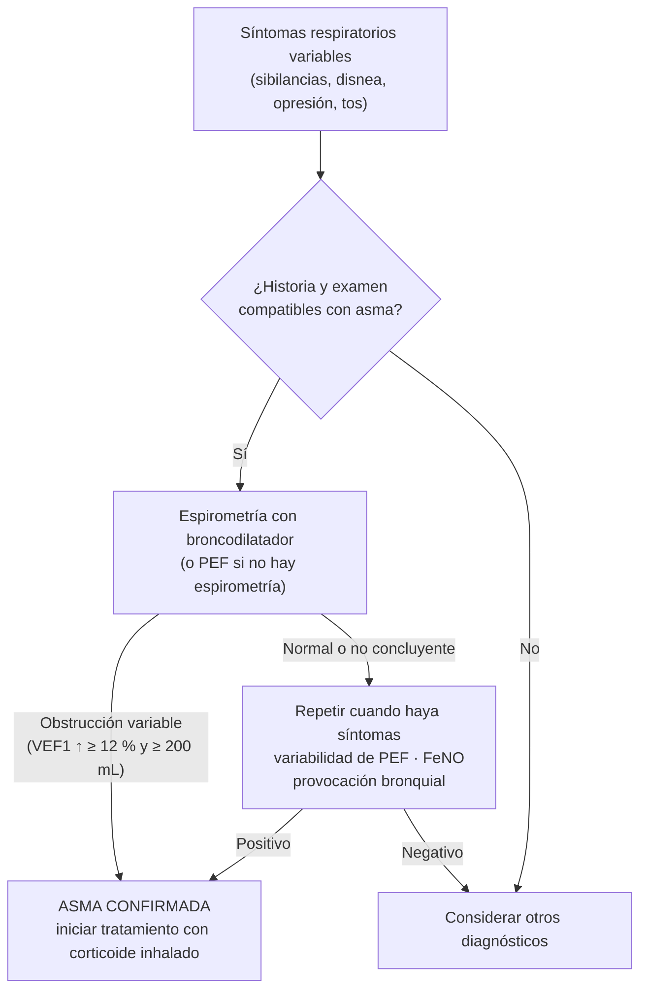
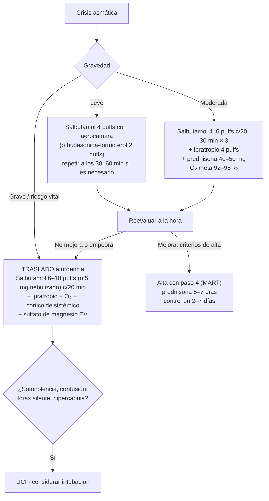

---
tags:
  - Respiratorio
  - GES
  - Urgencia
  - Frecuente en sala
---

# Asma bronquial

**Subespecialidad**
Enfermedades respiratorias

**Guía principal**
GINA 2026 (Global Initiative for Asthma, informe y guía resumida, mayo–julio 2026)

**Otras fuentes**
Guía GES MINSAL asma bronquial en personas de 15 años y más · ENS 2016–2017

**GES**
Sí: asma bronquial en personas de 15 años y más (y asma moderada y grave en menores de 15 años)

**Revisado**
Septiembre 2026

!!! abstract "Resumen en 60 segundos"
    - Enfermedad **heterogénea** con **inflamación crónica** de la vía aérea, **síntomas variables** (sibilancias, disnea, opresión torácica, tos) y **obstrucción variable** del flujo aéreo.
    - **Diagnóstico**: síntomas típicos + **variabilidad demostrada**: prueba broncodilatadora positiva (**VEF1 ↑ ≥ 12 % y ≥ 200 mL**) o variabilidad del flujo espiratorio máximo.
    - **GINA 2026**: **no tratar con SABA solo**. Todo adulto o adolescente con asma debe recibir **corticoide inhalado**.
    - **Vía 1 (preferida)**: **budesonida-formoterol en dosis baja según necesidad** (pasos 1–2, "AIR") y como **mantención y rescate (MART)** en los pasos 3–4. Reduce las crisis graves ~ 2/3 respecto de SABA solo.
    - **Crisis**: **salbutamol** (± ipratropio) con aerocámara, **O₂ con meta 92–95 %**, **prednisona 40–50 mg por 5–7 días**. **Sulfato de magnesio EV** en crisis graves. Tórax silente, somnolencia o confusión: **UCI**.
    - Al alta de una crisis: **paso 4 con MART**, técnica inhalatoria, plan de acción escrito y control en **2–7 días**.

## Definición

!!! guia "Definición GINA"
    El asma es una **enfermedad heterogénea**, habitualmente caracterizada por **inflamación crónica de la vía aérea**. Se define por una historia de **síntomas respiratorios** (sibilancias, disnea, opresión torácica y tos) que **varían en el tiempo y en intensidad**, junto con una **limitación variable del flujo aéreo espiratorio**, que puede llegar a ser persistente.

- La variabilidad es la clave: los síntomas empeoran de noche o de madrugada, con virus, ejercicio, alérgenos, irritantes, cambios de temperatura o risa.
- La **hiperreactividad bronquial** y la inflamación suelen persistir aunque no haya síntomas.

## Epidemiología

### Mundial

- Afecta a **~ 260–300 millones** de personas y causa **~ 450.000 muertes al año** (GBD), la mayoría evitables.
- Es la enfermedad crónica más frecuente en la infancia.
- Las muertes se concentran en pacientes que **no usan corticoides inhalados**, usan **SABA en exceso** (≥ 3 inhaladores al año se asocia a más crisis y ≥ 12 al año a más mortalidad) o no tienen un plan de acción.

### Chile

!!! chile "Datos nacionales"
    - **ENS 2016–2017**: **5,4 %** de los adultos refiere un diagnóstico de asma. Chile está entre los países con **mayor prevalencia de síntomas asmáticos** de Latinoamérica.
    - La **mortalidad por asma** en adultos disminuyó de forma significativa entre 1992 y 2017, en paralelo con el **Programa ERA** (Enfermedades Respiratorias del Adulto, desde 2001) y el **GES**.
    - **GES**: garantiza diagnóstico y tratamiento del **asma bronquial en personas de 15 años y más** (y del asma moderada y grave en menores de 15), con acceso a **corticoides inhalados** y **broncodilatadores de acción prolongada**.
    - La **contaminación intradomiciliaria por leña** y la contaminación ambiental invernal del centro-sur son gatillantes frecuentes.

## Etiología y factores de riesgo

- **Atopia** (rinitis alérgica, dermatitis atópica) y antecedente familiar.
- **Alérgenos**: ácaros, pólenes, epitelio de animales, hongos, cucarachas.
- **Infecciones virales** (rinovirus, VRS, influenza): el gatillante más frecuente de crisis.
- **Tabaco** (activo y pasivo), **humo de leña**, contaminación ambiental, exposición laboral (**asma ocupacional**: panaderos, pintores con isocianatos, trabajadores de la salud con látex, peluqueros).
- **Obesidad**.
- **Fármacos**: **AINE y aspirina** (enfermedad respiratoria exacerbada por aspirina: asma + pólipos nasales + intolerancia a AINE), **betabloqueadores** (incluidos colirios de timolol).
- **Reflujo gastroesofágico**, rinosinusitis crónica, estrés, ejercicio y aire frío.

### Factores de riesgo de asma fatal

!!! alarma "Riesgo de muerte por asma"
    - Antecedente de **asma casi fatal** con intubación o ingreso a UCI.
    - **Hospitalización o consulta de urgencia** por asma en el último año.
    - **Uso actual o reciente de corticoides orales**.
    - **No usar corticoides inhalados**.
    - **Uso excesivo de SABA** (más de 1 inhalador al mes).
    - Enfermedad psiquiátrica, problemas psicosociales, mala adherencia.
    - Alergia alimentaria.

## Fisiopatología

- **Inflamación tipo 2 ("T2-alta")**, el mecanismo más frecuente: la exposición a alérgenos, virus o contaminantes lleva al epitelio a liberar **alarminas** (TSLP, IL-33, IL-25) que activan linfocitos **Th2** y células linfoides innatas tipo 2 (**ILC2**). Estas producen **IL-4, IL-5 e IL-13**, que causan síntesis de **IgE**, **eosinofilia**, hipersecreción mucosa e hiperreactividad del músculo liso.
- **Asma T2-baja** (neutrofílica o paucigranulocítica): se asocia a obesidad, tabaco y a menor respuesta a corticoides.
- **Obstrucción**: **broncoconstricción** del músculo liso, **edema** de la mucosa, **tapones de moco** e infiltrado inflamatorio. Es reversible, pero con los años puede producir **remodelado** (fibrosis subepitelial, hipertrofia del músculo liso) y obstrucción fija.

<figure markdown>
{ loading=lazy width="720" }
<figcaption>Figura 1. Inflamación tipo 2 en el asma y dianas de los biológicos: <strong>tezepelumab</strong> (anti-TSLP), <strong>omalizumab</strong> (anti-IgE), <strong>mepolizumab y reslizumab</strong> (anti-IL-5), <strong>benralizumab</strong> (anti-receptor de IL-5) y <strong>dupilumab</strong> (anti-receptor IL-4α, bloquea IL-4 e IL-13). El FeNO y los eosinófilos en sangre son biomarcadores de esta vía. Fuente: Howell I, Howell A, Pavord ID. Type 2 inflammation and biological therapies in asthma: Targeted medicine taking flight. <em>J Exp Med</em>. 2023;220:e20221212. Licencia <a href="https://creativecommons.org/licenses/by/4.0/">CC BY 4.0</a>. Texto de la figura en inglés.</figcaption>
</figure>

## Clasificación

### Control de los síntomas (GINA, últimas 4 semanas)

| Pregunta | Sí / No |
|---|---|
| ¿Síntomas diurnos más de 2 veces por semana? | |
| ¿Despertares nocturnos por asma? | |
| ¿Uso de rescate (SABA) más de 2 veces por semana? | |
| ¿Limitación de actividades por asma? | |

**Ninguno: bien controlada · 1–2: parcialmente controlada · 3–4: no controlada.**

Además del control de síntomas, siempre evaluar el **riesgo futuro** de crisis (factores de riesgo, VEF1 bajo, eosinofilia, crisis previas).

### Gravedad

Se define **retrospectivamente** según el tratamiento necesario para controlarla:

- **Leve**: controlada con pasos 1–2.
- **Moderada**: controlada con el paso 3.
- **Grave**: requiere paso 4–5 (dosis altas o biológicos) o no se controla pese a ellos, tras corregir técnica, adherencia y comorbilidades.

### Gravedad de la crisis (GINA 2026)

| | **Leve** | **Moderada** | **Grave o con riesgo vital** |
|---|---|---|---|
| **Habla** | En frases completas | En frases cortas | **No puede hablar**, beber ni acostarse |
| **Posición** | Puede acostarse | Prefiere sentado | Inclinado hacia adelante |
| **Frecuencia respiratoria** | Normal o levemente aumentada | Aumentada, ≤ 30/min | **> 30/min** |
| **Músculos accesorios** | No o leve | Sí | Sí |
| **Sibilancias / entrada de aire** | Leves / normal | Espiratorias / disminuida | **Tórax silente** o muy disminuido |
| **SatO₂ ambiental** | ≥ 94 % | ≥ 92 % | **< 92 %** |
| **PEF** | > 70 % | 50–70 % | **< 50 %** |

**Riesgo vital inmediato**: **somnolencia, confusión, cianosis**, tórax silente, bradicardia, hipotensión, agotamiento; PaCO₂ normal o alta (en una crisis debería estar baja).

## Clínica

- **Sibilancias**, **disnea**, **opresión torácica** y **tos** (a veces solo tos seca nocturna: "asma tusígena").
- Síntomas **variables**, **nocturnos o matinales**, desencadenados por virus, ejercicio, alérgenos, irritantes, frío, risa o AINE.
- Mejoran con broncodilatadores o corticoides inhalados.
- **Examen físico**: con frecuencia **normal** entre crisis. En crisis: taquipnea, sibilancias espiratorias difusas, espiración prolongada, uso de musculatura accesoria, pulso paradójico.
- Buscar **comorbilidades**: rinitis alérgica, rinosinusitis con pólipos nasales, reflujo, obesidad, apnea del sueño, ansiedad y depresión.

!!! perla "Síntomas que hacen menos probable el asma"
    Tos aislada sin otros síntomas, expectoración crónica, disnea con mareo o parestesias (hiperventilación), dolor torácico, disnea de esfuerzo con **estridor inspiratorio** (obstrucción laríngea inducible).

## Diagnóstico

!!! guia "Criterios diagnósticos (GINA 2026, adultos)"
    **1. Historia de síntomas respiratorios variables** (típicamente más de uno).

    **2. Limitación variable del flujo aéreo espiratorio confirmada**, con al menos uno de:

    - **Prueba broncodilatadora positiva**: **VEF1 o CVF ↑ ≥ 12 % y ≥ 200 mL** respecto del basal (o PEF ↑ ≥ 20 %).
    - **Variabilidad diaria del PEF** > 10 % en promedio durante 2 semanas.
    - Aumento del VEF1 ≥ 12 % y ≥ 200 mL tras **4 semanas de tratamiento** antiinflamatorio.
    - **Prueba de ejercicio** positiva (caída del VEF1 > 10 % y > 200 mL).
    - **Prueba de provocación bronquial** positiva (metacolina).
    - Variación del VEF1 entre visitas ≥ 12 % y ≥ 200 mL.

    Idealmente, documentar la obstrucción (VEF1/CVF reducido) al menos una vez cuando el VEF1 está bajo. Si no hay espirometría o es normal, un **FeNO elevado** apoya el diagnóstico en pacientes con síntomas típicos.

*Figura 2. Enfoque diagnóstico del asma en adultos. Esquema propio basado en GINA 2026.*

## Laboratorio

- **Eosinófilos en sangre**: ≥ 150–300/µL indican inflamación tipo 2 (predicen respuesta a corticoides y a biológicos).
- **IgE total y específica** (o prick test cutáneo): identificar alérgenos relevantes.
- **FeNO** (óxido nítrico exhalado): > 50 ppb en adultos apoya inflamación eosinofílica y respuesta a corticoides inhalados.
- **Gases arteriales** solo en crisis graves (buscar **hipercapnia**: signo de agotamiento).
- En asma grave: hemograma, IgE, eosinófilos, anticuerpos anti-*Aspergillus* (aspergilosis broncopulmonar alérgica), ANCA si se sospecha granulomatosis eosinofílica con poliangeítis.

## Imágenes

- **Radiografía de tórax**: **no** se pide de rutina en la crisis. Indicada si se sospecha **neumotórax**, **neumonía**, falta de respuesta al tratamiento o en el primer episodio con dudas diagnósticas. Puede mostrar hiperinsuflación.
- **TC de tórax**: asma grave o atípica (bronquiectasias, aspergilosis broncopulmonar alérgica, tapones mucosos).
- **TC de senos paranasales**: rinosinusitis con pólipos.

## Diagnóstico diferencial

| Enfermedad | Claves |
|---|---|
| **EPOC** | > 40 años, fumador o exposición a leña, obstrucción **persistente** post-broncodilatador; pueden coexistir |
| **Obstrucción laríngea inducible** (disfunción de cuerdas vocales) | Estridor **inspiratorio**, síntomas bruscos, curva flujo-volumen con aplanamiento inspiratorio |
| **IC** ("asma cardíaca") | Edad, cardiopatía, crépitos, BNP elevado |
| **TEP** | Disnea súbita, factores de riesgo de trombosis |
| **Cuerpo extraño**, tumor de vía aérea central | Sibilancias localizadas o unilaterales |
| **Bronquiectasias** | Expectoración purulenta crónica |
| **Tos por IECA**, reflujo, goteo retronasal | Tos sin obstrucción |
| **Hiperventilación y ansiedad** | Parestesias, mareo, espirometría normal |
| **Anafilaxia** | Urticaria, hipotensión, exposición a alérgeno: **adrenalina IM primero** |

## Tratamiento de mantención

### Principios

- **Todo adulto o adolescente con asma debe recibir un corticoide inhalado** (en forma regular o como parte del rescate).
- **No usar SABA solo** (sin corticoide inhalado): aumenta el riesgo de crisis graves y muerte.
- Tratamiento **escalonado** según el control y el riesgo; revisar en **2–3 meses** y subir o bajar de paso.
- Antes de subir de paso: revisar la **técnica inhalatoria**, la **adherencia**, la exposición a gatillantes y las **comorbilidades**.

### Pasos de tratamiento en adultos y adolescentes (GINA 2026)

| Paso | **Vía 1 (preferida)**: rescate con budesonida-formoterol | **Vía 2 (alternativa)**: rescate con ICS-SABA o SABA |
|---|---|---|
| **1–2** | **Budesonida-formoterol en dosis baja según necesidad** ("AIR", sin mantención) | **Paso 1**: ICS-SABA según necesidad (o ICS cada vez que use SABA). **Paso 2**: **ICS en dosis baja diaria** |
| **3** | **MART** con budesonida-formoterol en **dosis baja** | **ICS-LABA en dosis baja** diaria |
| **4** | **MART** con budesonida-formoterol en **dosis media** | **ICS-LABA en dosis media** diaria |
| **5** | Agregar **LAMA** (tiotropio); derivar a especialista para **fenotipificar**; considerar dosis alta de ICS-formoterol o **biológicos** | Agregar LAMA; derivar; considerar dosis alta de ICS-LABA o biológicos |

!!! dosis "Ejemplo de la vía 1 con budesonida-formoterol 160/4,5 µg (o beclometasona-formoterol 100/6 µg)"
    - **Pasos 1–2 (AIR)**: **1 inhalación cuando tenga síntomas**.
    - **Paso 3 (MART dosis baja)**: **1 inhalación en la mañana y 1 en la noche**, más **1 inhalación cuando tenga síntomas**.
    - **Paso 4 (MART dosis media)**: **2 inhalaciones en la mañana y 2 en la noche**, más 1 cuando tenga síntomas.
    - **Máximo**: **12 inhalaciones totales en 24 horas** (formoterol 54 µg liberados). Si necesita más, debe consultar.
    - Solo los inhaladores con **formoterol** sirven como rescate (su efecto es rápido). Un ICS-LABA con salmeterol o vilanterol **no** sirve como MART.

**Dosis diarias de corticoides inhalados en adultos (µg)**

| Corticoide | Dosis baja | Dosis media | Dosis alta |
|---|---|---|---|
| **Budesonida** (inhalador de polvo) | 200–400 | > 400–800 | > 800 |
| **Beclometasona** (partícula extrafina, aerosol) | 100–200 | > 200–400 | > 400 |
| **Fluticasona propionato** | 100–250 | > 250–500 | > 500 |
| **Fluticasona furoato** | 100 | — | 200 |

### Asma grave (paso 5)

- Confirmar el diagnóstico, corregir técnica, adherencia, comorbilidades y exposiciones.
- **Fenotipificar**: eosinófilos, FeNO, IgE, alergia.
- **Biológicos** (derivar a especialista):
    - **Omalizumab** (anti-IgE): asma alérgica.
    - **Mepolizumab, reslizumab** (anti-IL-5) y **benralizumab** (anti-receptor de IL-5): asma **eosinofílica**.
    - **Dupilumab** (anti-IL-4Rα): asma eosinofílica o con FeNO elevado; también rinosinusitis con pólipos y dermatitis atópica.
    - **Tezepelumab** (anti-TSLP): asma grave, también en fenotipos T2-bajos.
- **Azitromicina** (3 veces por semana) en pacientes seleccionados; evitar los corticoides orales de mantención (muchos efectos adversos).

### Medidas no farmacológicas

- **Cese del tabaco** y evitar el humo de leña y otros irritantes.
- **Educación y plan de acción escrito** para todos.
- **Técnica inhalatoria** (con **aerocámara** para inhaladores presurizados).
- **Vacunas**: influenza, COVID-19, neumococo, VRS según edad.
- Actividad física, baja de peso en obesos, tratamiento de la rinitis y el reflujo sintomático.
- Evitar AINE si hay enfermedad respiratoria exacerbada por aspirina; evitar betabloqueadores no selectivos.

## Tratamiento de la crisis asmática

*Figura 3. Manejo de la crisis asmática. Esquema propio basado en GINA 2026.*

!!! dosis "Fármacos en la crisis"
    - **Salbutamol** (100 µg/puff) con aerocámara, **1 puff a la vez** (agitar antes de cada puff): **4–6 puffs** c/20–30 min × 3 en la crisis moderada; **6–10 puffs** (o **5 mg nebulizado**) en la grave.
    - **Bromuro de ipratropio** (20 µg/puff): **4 puffs** con cada dosis de salbutamol, hasta 3 veces (crisis moderada o grave).
    - **Corticoides sistémicos**: **prednisona o prednisolona 40–50 mg/día por 5–7 días** (no es necesario disminuir la dosis). En crisis grave o si no tolera la vía oral: **hidrocortisona 100–200 mg EV** o metilprednisolona.
    - **Oxígeno**: meta **SatO₂ 92–95 %**.
    - **Sulfato de magnesio 2 g EV en 20 minutos**: crisis grave que no responde al tratamiento inicial.
    - **Adrenalina IM** (0,5 mg) **primero** si hay anafilaxia.
    - **No usar**: sedantes, antibióticos de rutina (solo si hay neumonía), radiografía ni gases de rutina, metilxantinas de rutina.

**Criterios de alta**: síntomas y signos de crisis leve al menos 1–2 horas después del último salbutamol, **SatO₂ ≥ 92 %** con aire ambiental, **PEF > 70 %** del mejor personal o predicho, y recursos adecuados en casa.

**Antes del alta**: iniciar o subir el tratamiento con corticoide inhalado (idealmente **MART en paso 4**), rescate solo según necesidad, revisar la técnica, **plan de acción escrito** y **control en 2–7 días**. Derivar al especialista si tuvo más de 1 curso de corticoides orales en el último año.

## Complicaciones

- **Crisis grave**, insuficiencia respiratoria, **paro respiratorio** y muerte.
- **Neumotórax** y neumomediastino.
- **Atelectasias** por tapones mucosos.
- **Remodelado** de la vía aérea con obstrucción fija.
- **Efectos adversos de los corticoides orales repetidos**: osteoporosis, diabetes, cataratas, supresión suprarrenal, aumento de peso.
- Efectos locales de los corticoides inhalados: **candidiasis oral** (enjuagarse la boca), disfonía.

## Pronóstico y seguimiento

- Con tratamiento adecuado, la mayoría de los pacientes logra un **buen control** y una vida normal.
- **Control a los 1–3 meses** tras iniciar o cambiar el tratamiento, y luego cada 3–12 meses; **2–7 días** después de una crisis.
- En cada control: **síntomas** (cuestionario GINA o ACT), **crisis**, **uso de rescate**, **técnica inhalatoria**, **adherencia**, **efectos adversos**, **espirometría** (al inicio, a los 3–6 meses y luego periódicamente) y **plan de acción**.
- Si el asma está **bien controlada por ≥ 3 meses**, considerar **bajar de paso** (sin suspender el corticoide inhalado).

## Perlas para el internado

!!! perla "Para la sala y el turno"
    - Un asmático **"tranquilo" con tórax silente** está en **riesgo vital**: la ausencia de sibilancias puede significar que no entra aire.
    - En una crisis, una **PaCO₂ normal o alta es un signo de agotamiento** (debería estar baja por la taquipnea).
    - Los **inhaladores con aerocámara** son tan eficaces como la nebulización en la mayoría de las crisis.
    - **Nunca des de alta a un asmático con solo salbutamol**: siempre con corticoide inhalado y plan de acción.
    - Pregunta cuántos **inhaladores de salbutamol** usa al mes: más de 1 al mes es señal de mal control y riesgo.
    - Revisa la **técnica inhalatoria** antes de subir de paso: es la causa más frecuente de "falta de respuesta".
    - Asma + **pólipos nasales** + crisis con **AINE**: enfermedad respiratoria exacerbada por aspirina. Evita AINE.
    - En una **embarazada con asma**, mantén el tratamiento: la crisis es más peligrosa para el feto que los fármacos.

## Preguntas de repaso

??? repaso "1. Mujer de 25 años con sibilancias y tos nocturna 3 veces por semana. Espirometría: VEF1 78 % que sube 15 % y 280 mL post-broncodilatador. ¿Diagnóstico y tratamiento según GINA 2026?"
    **Asma** (síntomas variables + prueba broncodilatadora positiva). Tratamiento preferido (**vía 1**): **budesonida-formoterol en dosis baja según necesidad** (pasos 1–2). Si los síntomas son casi diarios o tiene crisis, **MART** en dosis baja. No indicar SABA solo.

??? repaso "2. Paciente en urgencia por crisis asmática: habla con palabras sueltas, FR 34/min, SatO₂ 89 %, PEF 35 %. ¿Cómo la manejas?"
    **Crisis grave**: **salbutamol** 6–10 puffs con aerocámara (o 5 mg nebulizado) c/20 min + **ipratropio**, **O₂ con meta 92–95 %**, **corticoide sistémico** (prednisona 40–50 mg o hidrocortisona EV) y **sulfato de magnesio 2 g EV** si no responde. Monitorizar; UCI si hay somnolencia, confusión, tórax silente o hipercapnia.

??? repaso "3. ¿Qué es la terapia MART y quién puede usarla?"
    **Mantención y rescate con el mismo inhalador de ICS-formoterol** (budesonida-formoterol o beclometasona-formoterol): dosis fija diaria más inhalaciones adicionales según síntomas (máximo 12 al día). Es el tratamiento preferido en los **pasos 3–5 de la vía 1** en adultos y adolescentes. No se puede hacer con ICS-LABA que no contengan formoterol.

??? repaso "4. ¿Qué criterios debe cumplir un paciente para irse de alta después de una crisis?"
    Síntomas leves al menos 1–2 horas después del último salbutamol, **SatO₂ ≥ 92 %** con aire ambiental, **PEF > 70 %**, y recursos adecuados en casa. Se va con **corticoide inhalado** (idealmente MART), **prednisona 5–7 días**, plan de acción y control en 2–7 días.

??? repaso "5. ¿Qué biológico elegirías en un asmático grave con eosinófilos de 600/µL y pólipos nasales?"
    Asma grave **eosinofílica** con rinosinusitis con pólipos: **dupilumab** (anti-IL-4Rα) o **mepolizumab/benralizumab** (anti-IL-5/5R). La elección la hace el especialista según los biomarcadores, las comorbilidades y la disponibilidad.

## Referencias

1. Global Initiative for Asthma. *Global Strategy for Asthma Management and Prevention, 2026 update.* [ginasthma.org](https://ginasthma.org/2026-gina-strategy-report/)
2. Global Initiative for Asthma. *Summary Guide for Asthma Management and Prevention 2026.* [PDF](https://ginasthma.org/wp-content/uploads/2026/07/GINA-Summary-Guide-2026-WEB-WMS.pdf)
3. Ministerio de Salud de Chile. *Guía Clínica GES: Asma bronquial en personas de 15 años y más.* [diprece.minsal.cl](https://diprece.minsal.cl/wrdprss_minsal/wp-content/uploads/2014/12/Asma-Bronquial-Adultos.pdf)
4. Prevalencia y tratamiento del asma en adultos: análisis descriptivo de la Encuesta Nacional de Salud de Chile 2016–2017. *Rev Chil Enferm Respir.* 2023. [SciELO](https://www.scielo.cl/scielo.php?script=sci_arttext&pid=S0717-73482023000300233)
5. Asma en Chile: tendencia de la mortalidad 1992–2017. *Rev Chil Enferm Respir.* 2021. [SciELO](https://www.scielo.cl/scielo.php?pid=S0717-73482021000200125&script=sci_arttext)
6. Howell I, Howell A, Pavord ID. Type 2 inflammation and biological therapies in asthma: Targeted medicine taking flight. *J Exp Med.* 2023;220:e20221212.
7. O'Byrne PM, et al. Inhaled Combined Budesonide–Formoterol as Needed in Mild Asthma (SYGMA 1). *N Engl J Med.* 2018;378:1865–1876.
8. Beasley R, et al. Controlled Trial of Budesonide–Formoterol as Needed for Mild Asthma (Novel START). *N Engl J Med.* 2019;380:2020–2030.
