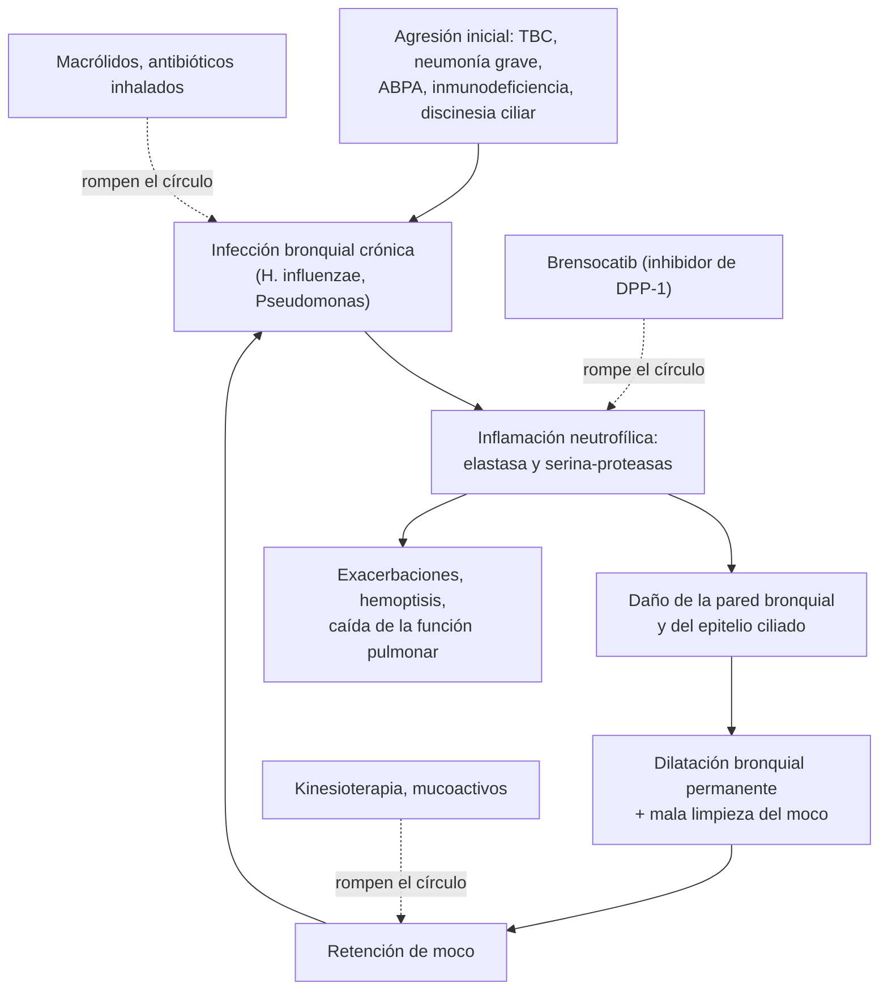
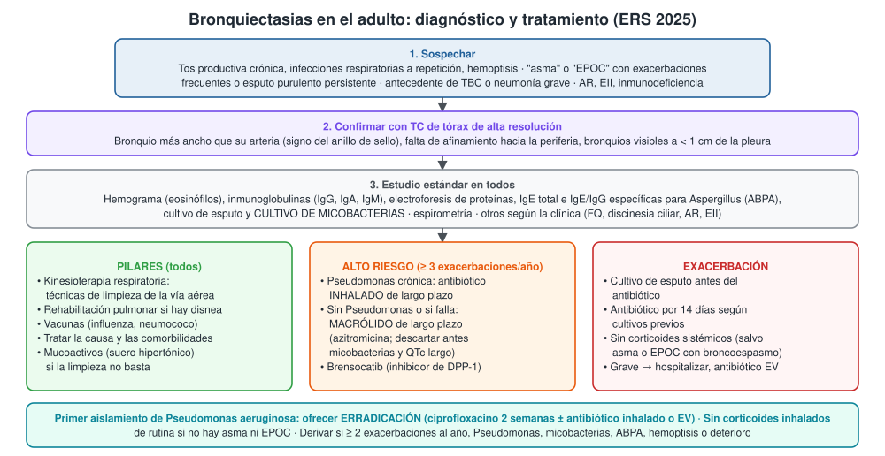
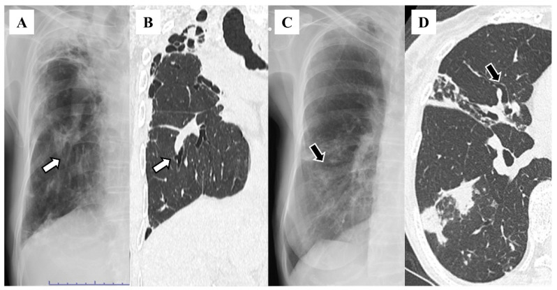

---
tags:
  - Respiratorio
  - Frecuente en sala
---

# Bronquiectasias

**Subespecialidad**
Broncopulmonar · Medicina interna · Kinesiología respiratoria · Atención primaria

**Guías principales**
ERS 2025: manejo de las bronquiectasias del adulto (actualiza la de 2017) · BTS 2019: bronquiectasias en adultos

**Otras fuentes**
Resumen de la guía ERS 2025 para atención primaria (2026) · ASPEN (brensocatib, *N Engl J Med* 2025) · Serie chilena del Hospital Regional de Concepción (*Rev Chil Enf Respir* 2005)

**GES**
No. Las exacerbaciones que se presentan como neumonía se manejan según la guía de neumonía adquirida en la comunidad (GES de neumonía en mayores de 65 años).

**EUNACOM**
1.05.1.004 Bronquiectasias (sospecha, inicial, completo)

**Revisado**
Octubre 2026

!!! abstract "Resumen en 60 segundos"
    - **Bronquiectasias**: dilatación **permanente** de los bronquios con **tos productiva crónica** e **infecciones respiratorias a repetición**. Afectan a ~ **1 de cada 200 adultos**; son la tercera enfermedad respiratoria crónica más frecuente, después del asma y la EPOC.
    - **Círculo vicioso**: infección → **inflamación neutrofílica** → daño de la pared bronquial → mala limpieza del moco → más infección.
    - **Causas**: **postinfecciosas** (en Chile, sobre todo **tuberculosis** y neumonía), **idiopáticas** (20–40 %), ABPA, inmunodeficiencias, AR y EII, EPOC y asma graves, discinesia ciliar, fibrosis quística, micobacterias no tuberculosas.
    - **Sospechar** en el "asmático" o "EPOC" con **esputo purulento diario** o exacerbaciones frecuentes. **Diagnóstico**: **TC de tórax de alta resolución** (bronquio más ancho que su arteria, "signo del anillo de sello").
    - **Estudio estándar** (ERS 2025): hemograma, **inmunoglobulinas**, electroforesis, **IgE y serología de Aspergillus**, **cultivo de esputo** y **cultivo de micobacterias**.
    - **Tratamiento**:
        - **Kinesioterapia respiratoria** (limpieza de la vía aérea) para todos; rehabilitación pulmonar; vacunas.
        - **Exacerbación**: cultivo de esputo y **antibiótico por 14 días**; **sin corticoides** salvo asma o EPOC.
        - **Alto riesgo de exacerbaciones**: **macrólido** de largo plazo (azitromicina) o **antibiótico inhalado** si hay *Pseudomonas*. **Brensocatib** (inhibidor de DPP-1) es el primer fármaco específico (ASPEN 2025).
        - **Primer aislamiento de *Pseudomonas***: intentar **erradicarla**.
        - **No** usar corticoides inhalados si no hay asma ni EPOC.

## Definición

- **Bronquiectasias**: enfermedad respiratoria crónica con **dilatación anormal y permanente de los bronquios** en la TC, asociada a un **síndrome clínico** de tos, expectoración e infecciones respiratorias recurrentes.
- El término incluye la imagen y la clínica: una dilatación bronquial en la TC **sin** síntomas no basta para el diagnóstico de la enfermedad.
- Esta página trata las bronquiectasias **no relacionadas con la fibrosis quística**, cuyo manejo es distinto.
- **Exacerbación** (ERS 2025): empeoramiento de los síntomas que supera la variación diaria y obliga a cambiar el tratamiento. Síntomas centrales: más tos, más volumen o consistencia del esputo, **más purulencia**, disnea o menor tolerancia al ejercicio, cansancio o malestar, y **hemoptisis**.

## Epidemiología

### Mundial

- Afectan a ~ **1 de cada 200 adultos**; las hospitalizaciones y la mortalidad aumentan ~ **4 % al año**.
- El **retraso diagnóstico** es grande: **1 de cada 4** pacientes espera más de **10 años**. Muchos reciben antes un diagnóstico erróneo de asma, EPOC o bronquitis.
- Los pacientes tienen en promedio **3–4 comorbilidades**: enfermedad cardiovascular, osteoporosis, reflujo, rinosinusitis, ansiedad y depresión.
- **Microbiología**: hasta **70 %** tiene infección bronquial crónica; ***Pseudomonas aeruginosa*** se aísla en ~ **22 %** en Europa y se asocia a **3 veces** más mortalidad y **7 veces** más hospitalizaciones.
- **Causa idiopática**: 20–40 %, según la extensión del estudio etiológico.

### Chile

!!! chile "Datos nacionales"
    - **Serie del Hospital Regional de Concepción** (Cereceda 2005, 18 adultos con TC entre 1998 y 2003):
        - Edad media de **44 años**.
        - Causas más frecuentes: **tuberculosis pulmonar (44 %)** y **neumonía aguda (39 %)**.
        - Síntomas: **tos crónica (89 %)**, expectoración persistente (78 %) y **hemoptisis (44 %)**.
        - Compromiso **bilobar** en 72 %.
        - Gérmenes: *H. influenzae* (17 %), *S. pneumoniae* (15 %), *Moraxella catarrhalis* (15 %), ***P. aeruginosa* (13 %)**.
    - A diferencia de Europa (donde predominan las idiopáticas), en Chile y Latinoamérica tienen gran peso las **secuelas de tuberculosis y de infecciones graves de la infancia**.
    - Centros chilenos participaron en el ensayo **ASPEN** de brensocatib (2025).
    - **No es GES**; el diagnóstico y el seguimiento se hacen en broncopulmonar del nivel secundario, y las exacerbaciones leves se tratan en la APS.

## Etiología y factores de riesgo

| Grupo | Causas | Pistas |
|---|---|---|
| **Postinfecciosas** | **Tuberculosis**, neumonía grave, tos convulsiva o sarampión en la infancia | Antecedente claro; lóbulos superiores en la TBC |
| **Idiopáticas** | Sin causa tras el estudio (20–40 %) | Diagnóstico de exclusión |
| **ABPA** (aspergilosis broncopulmonar alérgica) | Hipersensibilidad a *Aspergillus*; ~ 10 % | **Asma**, esputo muy espeso con tapones, eosinofilia, **IgE muy alta**; bronquiectasias **centrales** |
| **Inmunodeficiencias** | Inmunodeficiencia común variable, déficit de IgG o de subclases, **VIH**, hipogammaglobulinemia secundaria (LLC, mieloma, rituximab) | Infecciones sinopulmonares recurrentes desde joven; **inmunoglobulinas bajas** |
| **Enfermedades inflamatorias** | **Artritis reumatoide**, **enfermedad inflamatoria intestinal**, Sjögren, otras mesenquimopatías | 5–10 % de los pacientes con AR o EII tienen bronquiectasias |
| **Enfermedad de la vía aérea** | **EPOC** y **asma** graves | Coexisten y empeoran el pronóstico |
| **Micobacterias no tuberculosas** | *M. avium* complex | Mujer delgada y alta, tos seca, baja de peso; **cultivo de micobacterias** |
| **Discinesia ciliar primaria** | Genética | Desde la infancia; **sinusitis crónica**, otitis, infertilidad, **situs inversus** (síndrome de Kartagener) |
| **Fibrosis quística** | Genética | Diagnóstico en la infancia o adultos jóvenes con formas leves; test del sudor |
| **Obstrucción bronquial** | Cuerpo extraño, tumor, adenopatía | Bronquiectasias **localizadas** |
| **Otras** | Aspiración crónica, reflujo, déficit de α1-antitripsina, síndrome de las uñas amarillas | Según la clínica |

## Fisiopatología

- **Círculo vicioso** (Cole):
    1. **Infección** bronquial crónica (*H. influenzae*, *P. aeruginosa*, *S. aureus*, *M. catarrhalis*).
    2. **Inflamación neutrofílica**: los neutrófilos liberan **elastasa** y otras serina-proteasas.
    3. **Daño** de la pared bronquial (elastina, cartílago) y del epitelio ciliado → dilatación.
    4. **Mala limpieza mucociliar** → retención de moco → más infección.
- Cualquier "puerta de entrada" (infección grave, inmunodeficiencia, ABPA, discinesia ciliar) puede iniciar el círculo.
- **Brensocatib** actúa en el paso 2: inhibe la **dipeptidil peptidasa 1 (DPP-1)**, que activa las serina-proteasas de los neutrófilos en la médula ósea.
- La ***Pseudomonas*** forma **biopelículas** que la protegen de los antibióticos: una vez instalada, es muy difícil de erradicar.

*Figura 1. Círculo vicioso de las bronquiectasias y puntos de acción del tratamiento. Esquema propio basado en la guía ERS 2025 y el ensayo ASPEN.*

## Clasificación

**Según la forma en la TC**

| Tipo | Imagen | Comentario |
|---|---|---|
| **Cilíndricas** | Dilatación uniforme | Las más frecuentes y leves |
| **Varicosas** | Dilatación irregular, en rosario | Intermedias |
| **Quísticas** (saculares) | Sacos con niveles hidroaéreos | Las más graves; muy productivas |

**Según la distribución**: **localizadas** (obstrucción, secuela de neumonía o de TBC) o **difusas** (causas sistémicas). Las **centrales** sugieren ABPA; las de **lóbulos superiores**, TBC o fibrosis quística; las del **lóbulo medio y la língula**, micobacterias no tuberculosas.

**Gravedad**: puntajes **BSI** (*Bronchiectasis Severity Index*) y **FACED** o **E-FACED**. Combinan el VEF1, la edad, la colonización por *Pseudomonas*, la extensión radiológica, la disnea y las exacerbaciones; predicen hospitalización y mortalidad.

## Clínica

- **Tos crónica productiva**, diaria, con esputo **mucopurulento o purulento**, a veces abundante (> 30 mL/día en las formas graves).
- **Infecciones respiratorias a repetición** y "bronquitis" que no se resuelven.
- **Disnea**, sibilancias, cansancio, **dolor torácico** pleurítico.
- **Hemoptisis**: desde estrías de sangre hasta hemoptisis masiva (arterias bronquiales hipertróficas).
- **Rinosinusitis crónica** (discinesia ciliar, fibrosis quística, inmunodeficiencia).
- **Examen**: **crépitos** gruesos inspiratorios, roncus, sibilancias; **hipocratismo digital** en las formas graves; en la enfermedad avanzada, cianosis y cor pulmonale.
- **Exacerbación grave** (requiere hospitalización o antibiótico EV): taquipnea, insuficiencia respiratoria aguda o crónica agudizada, caída importante de la saturación, hipercapnia, hemoptisis, cianosis nueva, signos de cor pulmonale, inestabilidad hemodinámica o compromiso de conciencia.

!!! alarma "Signos de alarma: hospitalizar o derivar con urgencia"
    - **Hemoptisis** abundante o recurrente (ver [hemoptisis](insuficiencia-respiratoria-aguda.md)).
    - **Insuficiencia respiratoria**, hipercapnia, cianosis nueva, inestabilidad hemodinámica o confusión.
    - Falta de respuesta al antibiótico oral en 48–72 horas.
    - **Primer aislamiento de *Pseudomonas aeruginosa*** (derivar para intentar erradicarla; nunca "esperar y ver").
    - **Deterioro**: más exacerbaciones o más graves, empeoramiento de los síntomas basales o caída rápida de la función pulmonar.
    - Baja de peso, fiebre y sudoración nocturna: descartar **tuberculosis** y **micobacterias no tuberculosas**.

## Diagnóstico

!!! guia "Diagnóstico y estudio (ERS 2025)"
    - **Sospechar** en:
        - Tos productiva crónica o infecciones respiratorias recurrentes.
        - Pacientes con diagnóstico de **asma o EPOC** con exacerbaciones frecuentes o **esputo purulento** persistente pese a un tratamiento óptimo (revisar si el diagnóstico de asma o EPOC fue confirmado con pruebas objetivas).
        - Enfermedades asociadas: AR, EII, inmunodeficiencia, antecedente de TBC.
    - **Confirmar** con **TC de tórax de alta resolución** (cortes finos, sin contraste).
    - **Estudio estándar en todos** para buscar la causa y los "rasgos tratables":
        - **Hemograma** (eosinofilia).
        - **Inmunoglobulinas** (IgG, IgA, IgM) y **electroforesis de proteínas**.
        - **IgE total** e **IgE e IgG específicas para *Aspergillus*** (ABPA).
        - **Cultivo de esputo** y **cultivo de micobacterias** (las no tuberculosas no crecen en el cultivo habitual).
    - **Otros** según la clínica: test del sudor o genética (fibrosis quística), estudio de discinesia ciliar, α1-antitripsina, serología reumatológica, VIH.
    - **Espirometría**: puede ser normal, obstructiva (la más frecuente), restrictiva o mixta. El VEF1 forma parte de los puntajes de gravedad.
    - **Evaluar la gravedad** (BSI, FACED), la actividad (exacerbaciones al año) y las **comorbilidades** (cardiovascular, osteoporosis, reflujo, ánimo).

<figure markdown>
{ loading=lazy }
<figcaption>Figura 2. Diagnóstico y tratamiento de las bronquiectasias del adulto. Esquema propio basado en la guía ERS 2025 y en su resumen para atención primaria (Mosgrove 2026).</figcaption>
</figure>

## Laboratorio

| Examen | Interpretación |
|---|---|
| **Cultivo de esputo** | *H. influenzae*, *P. aeruginosa*, *S. aureus*, *M. catarrhalis*, *S. pneumoniae*. Un cultivo positivo **sin** deterioro clínico **no** obliga a dar antibióticos |
| **Cultivo de micobacterias** (baciloscopia y cultivo) | TBC y **micobacterias no tuberculosas**; **antes de iniciar macrólidos** de largo plazo (riesgo de resistencia) |
| **Hemograma** | Eosinofilia (ABPA), anemia de enfermedad crónica, linfopenia |
| **Inmunoglobulinas, electroforesis** | Inmunodeficiencia primaria o secundaria (LLC, mieloma) |
| **IgE total, IgE e IgG para *Aspergillus*** | **ABPA**: IgE total muy alta (> 500 UI/mL) con sensibilización a *Aspergillus* |
| **PCR** | Sube en las exacerbaciones; útil para seguir la respuesta |
| **Gases arteriales** | Exacerbación grave, enfermedad avanzada |
| **ECG** | **QTc** antes de los macrólidos de largo plazo |
| **Pruebas hepáticas, audiometría** (si hay síntomas) | Control de los macrólidos |

## Imágenes

- **Radiografía de tórax**: poco sensible; puede ser normal. Signos: engrosamiento de las paredes bronquiales en **"vías de tren"**, **imágenes en anillo**, opacidades nodulares o granulares, pérdida de nitidez del borde cardíaco.
- **TC de alta resolución** (examen diagnóstico):
    - **Diámetro del bronquio mayor que el de su arteria** acompañante (relación broncoarterial > 1): **signo del anillo de sello**.
    - **Falta de afinamiento** del bronquio hacia la periferia.
    - Bronquios visibles a **< 1 cm de la pleura**.
    - Signos asociados: engrosamiento de la pared, tapones mucosos, **árbol en brote**, atrapamiento aéreo (patrón en mosaico).
- **TC en la hemoptisis**: localiza el sangrado; la **angio-TC** muestra las arterias bronquiales para la embolización.

<figure markdown>
{ loading=lazy }
<figcaption>Figura 3. Bronquiectasias en la radiografía de tórax y en la TC de alta resolución. (A, B) Imagen en "vías de tren" (flechas blancas). (C, D) Signo del anillo (flechas negras). Las flechas señalan las mismas lesiones en cada paciente. Tomada de Sawada H, Kudoh R, Yokoyama A, et al. <em>Chest X-ray features in 130 patients with bronchiectasis.</em> Diseases. 2024;12(12):323 (figura 3). Licencia CC BY 4.0.</figcaption>
</figure>

## Diagnóstico diferencial

| Cuadro | Claves para diferenciar |
|---|---|
| **EPOC** | Tabaquismo ≥ 10 paquetes-año, obstrucción fija; pueden coexistir (criterios ROSE) |
| **Asma** | Síntomas variables, reversibilidad, eosinofilia; esputo mucoso, no purulento diario |
| **Tuberculosis** | Fiebre, sudoración nocturna, baja de peso; baciloscopia y cultivo |
| **Micobacterias no tuberculosas** | Lóbulo medio y língula, nódulos y árbol en brote; cultivo de micobacterias repetido |
| **Bronquitis bacteriana prolongada** | Tos húmeda que responde a antibióticos, TC sin bronquiectasias (más en niños) |
| **Cáncer pulmonar** | Hemoptisis o tos nueva en fumador mayor; masa en la TC |
| **Cuerpo extraño o tumor endobronquial** | Bronquiectasias localizadas distales a la obstrucción; broncoscopia |
| **Fibrosis pulmonar** | Bronquiectasias **por tracción** dentro de la fibrosis; crépitos finos tipo velcro |
| **Rinosinusitis crónica con goteo posnasal** | Tos con esputo de origen nasal; TC de senos |

## Tratamiento

### Medidas generales (todos)

- **Tratar la causa**: inmunoglobulina en la inmunodeficiencia humoral, corticoides orales o antifúngicos en la ABPA, tratamiento de la micobacteria, de la AR o de la EII.
- **Kinesioterapia respiratoria**: enseñar **técnicas de limpieza de la vía aérea** (ciclo activo de la respiración, drenaje autógeno, dispositivos de presión espiratoria positiva oscilante), en general 1–2 veces al día. Recomendación **fuerte** de la ERS 2025. Mantener una buena **hidratación**.
- **Rehabilitación pulmonar** si hay disnea o menor capacidad de ejercicio (recomendación fuerte).
- **Vacunas**: influenza anual y neumococo.
- **Mucoactivos** (suero salino **hipertónico** nebulizado, otros) si la limpieza de la vía aérea no basta; dar un broncodilatador antes (puede producir broncoespasmo). **No** usar DNasa recombinante (empeora las bronquiectasias no fibroquísticas).
- **Broncodilatadores**: LABA/LAMA si hay disnea importante u obstrucción.
- **Corticoides inhalados**: **no** de rutina si no hay asma ni EPOC asociados (más neumonías e infecciones por micobacterias).
- Dejar de fumar; manejar las comorbilidades (reflujo, rinosinusitis, ánimo, hueso, riesgo cardiovascular).

### Exacerbación

- **Cultivo de esputo** antes del antibiótico (y repetirlo si no hay respuesta).
- **Antibiótico** guiado por los **cultivos previos**, la susceptibilidad local y la gravedad. Duración habitual: **14 días**; más corta si la enfermedad es leve, el germen muy sensible y la respuesta rápida.
    - Sin cultivos previos: amoxicilina (o claritromicina si hay alergia).
    - Con ***Pseudomonas*** previa: **ciprofloxacino** oral; si es grave, antibiótico EV antipseudomónico (por ejemplo, ceftazidima o piperacilina-tazobactam, a veces combinado).
- **Sin corticoides sistémicos**, salvo asma o EPOC con broncoespasmo.
- Intensificar la kinesioterapia.
- **Hospitalizar** si es grave, si hay hemoptisis importante o si falla el tratamiento oral.
- **Plan de autocuidado** con un esquema de antibiótico de reserva en casa ("rescue pack") para pacientes seleccionados.

### Prevención de exacerbaciones (alto riesgo: ≥ 3 al año pese al manejo estándar)

- ***Pseudomonas aeruginosa* crónica**: **antibiótico inhalado** de largo plazo (colistina, tobramicina, gentamicina) (recomendación fuerte).
- **Sin *Pseudomonas*** o si el inhalado no se tolera o falla: **macrólido** de largo plazo (recomendación fuerte). Reduce las exacerbaciones ~ **50 %**.
    - **Antes**: descartar **micobacterias no tuberculosas** (cultivo), **QTc largo** (ECG) y revisar interacciones; pruebas hepáticas.
    - **Efectos adversos**: diarrea (hasta 1 de cada 5), **hipoacusia y tinnitus** (suspender), QT largo, hepatotoxicidad rara, resistencia bacteriana.
- **Antibiótico inhalado en otros gérmenes**: sugerido en alto riesgo con infección crónica distinta de *Pseudomonas*.
- **No** usar antibióticos orales no macrólidos de largo plazo como primera línea.
- **Brensocatib** (inhibidor de DPP-1, oral, una vez al día): en **ASPEN** (1.721 pacientes) redujo la tasa anual de exacerbaciones **~ 20 %** (1,02 y 1,04 frente a 1,29 con placebo) y la dosis de 25 mg redujo la caída del VEF1. Efecto adverso típico: **hiperqueratosis** (piel de manos y pies). Lo indica el especialista.

### Erradicación de *Pseudomonas aeruginosa*

- **Primer aislamiento**: repetir el cultivo y **ofrecer erradicación** (ERS 2025): **ciprofloxacino 500–750 mg cada 12 horas por 2 semanas**, a veces con antibiótico inhalado o EV.
- Nunca "esperar y ver": su presencia marca un **punto de inflexión** de la enfermedad.

### Hemoptisis

- Leve: antibiótico como exacerbación. Masiva: estabilizar, decúbito lateral sobre el lado sangrante, **ácido tranexámico**, angio-TC y **embolización de arterias bronquiales**; cirugía si fracasa (ver [hemoptisis](insuficiencia-respiratoria-aguda.md)).

### Cirugía

- **Resección** de bronquiectasias **localizadas** con síntomas o hemoptisis que no se controlan con el tratamiento médico.
- **Trasplante pulmonar** en la enfermedad terminal.

!!! dosis "Dosis de referencia (adultos)"
    | Fármaco | Dosis | Uso |
    |---|---|---|
    | **Amoxicilina** | 500 mg–1 g cada 8 horas VO por 14 días | Exacerbación sin *Pseudomonas* |
    | **Amoxicilina-ácido clavulánico** | 875/125 mg cada 12 horas VO por 14 días | *H. influenzae* productor de betalactamasa |
    | **Claritromicina** | 500 mg cada 12 horas VO por 14 días | Alergia a la penicilina |
    | **Ciprofloxacino** | **500–750 mg cada 12 horas** VO por 14 días | Exacerbación con *Pseudomonas*; erradicación (2 semanas) |
    | **Ceftazidima** | 2 g cada 8 horas EV | Exacerbación grave con *Pseudomonas* |
    | **Azitromicina** (largo plazo) | **250 mg 3 veces por semana** a 250 mg/día | Prevención; preferir días alternos (menos efectos adversos) |
    | **Eritromicina** (largo plazo) | 250 mg cada 12 horas | Alternativa |
    | **Colistina inhalada** | 1 millón de UI cada 12 horas | *Pseudomonas* crónica (especialista) |
    | **Suero salino hipertónico** (6–7 %) | 4–5 mL nebulizado 1–2 veces al día | Con salbutamol previo |
    | **Brensocatib** | 10 o 25 mg/día VO | Alto riesgo de exacerbaciones (especialista) |

## Complicaciones

- **Exacerbaciones** frecuentes y hospitalizaciones.
- **Hemoptisis**, incluso masiva.
- **Insuficiencia respiratoria crónica** e **hipertensión pulmonar** (cor pulmonale).
- Infección crónica por ***Pseudomonas*** o **micobacterias no tuberculosas**.
- **Empiema**, absceso pulmonar, neumonía.
- **Amiloidosis AA** (rara, en la supuración crónica).
- Deterioro de la calidad de vida, ansiedad, depresión.

## Pronóstico y seguimiento

- La evolución es **variable**: muchos pacientes se mantienen estables años y otros se deterioran rápido.
- **Peor pronóstico**: ≥ 2 exacerbaciones al año, hospitalizaciones, ***Pseudomonas***, VEF1 bajo, enfermedad extensa, causas de alto riesgo (AR, discinesia ciliar, EPOC, micobacterias, ABPA). Los puntajes **BSI** y **FACED** ayudan a estimarlo.
- **Seguimiento** (broncopulmonar, con la APS):
    - Exacerbaciones al año, síntomas y calidad de vida.
    - **Cultivo de esputo** periódico (al menos anual) y de **micobacterias**.
    - Espirometría y saturación.
    - Control de los efectos adversos de los tratamientos de largo plazo.
    - **Derivar** de nuevo ante cualquier deterioro.

## Perlas para el internado

!!! perla "Para recordar en la sala"
    - **Esputo purulento todos los días no es normal**: en un "asmático" o "EPOC" que no mejora, piense en bronquiectasias y pida una **TC**.
    - En Chile, pregunte por **tuberculosis** previa y neumonías graves en la infancia.
    - A todo paciente con bronquiectasias: **cultivo de micobacterias**, inmunoglobulinas y serología de *Aspergillus*.
    - **Exacerbación**: cultivo antes del antibiótico y **14 días** de tratamiento; **sin corticoides** si no hay asma ni EPOC.
    - **Primera *Pseudomonas***: intente erradicarla; nunca la ignore.
    - Antes de la **azitromicina** de largo plazo: **descartar micobacterias** y medir el **QTc**.
    - Un cultivo positivo en un paciente **estable** no se trata con antibióticos.
    - La **kinesioterapia** diaria es tan importante como los fármacos.
    - **Hemoptisis** masiva: decúbito sobre el lado que sangra, ácido tranexámico y **embolización** de las arterias bronquiales.

## Preguntas de repaso

??? repaso "1. Mujer de 58 años con \"asma\" diagnosticada hace 15 años, sin espirometría. Tiene tos con esputo amarillo-verdoso todos los días y 4 \"bronquitis\" al año pese a budesonida/formoterol en dosis altas. Tuvo tuberculosis a los 20 años. ¿Qué sospecha y qué pide?"
    - **Bronquiectasias** (probablemente **post-TBC**): esputo purulento diario, infecciones repetidas y mala respuesta al "tratamiento del asma".
    - **TC de tórax de alta resolución** para confirmar.
    - **Estudio estándar**: hemograma, inmunoglobulinas, electroforesis, IgE y serología de *Aspergillus*, **cultivo de esputo** y **de micobacterias**.
    - **Espirometría** con broncodilatador para reevaluar el diagnóstico de asma. Si no hay asma, **reducir y suspender** el corticoide inhalado.
    - **Kinesioterapia respiratoria** y derivación a broncopulmonar.

??? repaso "2. Hombre de 62 años con bronquiectasias consulta por más tos, esputo más purulento y abundante y más disnea desde hace 4 días. SatO₂ 94 %, afebril, sin hemoptisis. En su último cultivo creció *Haemophilus influenzae* sensible a la amoxicilina. ¿Qué hace?"
    - **Exacerbación no grave** de bronquiectasias.
    - Tomar **cultivo de esputo** antes de empezar.
    - **Amoxicilina** (guiada por el cultivo previo) por **14 días**.
    - **No** dar corticoides sistémicos (no tiene asma ni EPOC).
    - **Intensificar la kinesioterapia**; control en 48–72 horas. Hospitalizar si empeora o no responde.

??? repaso "3. Al mismo paciente le informan *Pseudomonas aeruginosa* en el cultivo, por primera vez. ¿Qué conducta corresponde?"
    - **Primer aislamiento de *Pseudomonas***: es un **punto de inflexión** (más mortalidad y hospitalizaciones).
    - **Repetir el cultivo** y **ofrecer erradicación**: **ciprofloxacino 500–750 mg cada 12 horas por 2 semanas**, a veces seguido de antibiótico inhalado o EV, en coordinación con broncopulmonar.
    - Nunca "esperar y ver".

??? repaso "4. Mujer de 55 años con bronquiectasias idiopáticas, sin *Pseudomonas*, con 4 exacerbaciones el último año pese a la kinesioterapia diaria. ¿Qué tratamiento preventivo indica y qué evalúa antes?"
    - **Alto riesgo de exacerbaciones** → **macrólido** de largo plazo: **azitromicina 250 mg 3 veces por semana** (o diaria).
    - **Antes**: **cultivo de micobacterias** (evitar resistencia a los macrólidos en una micobacteria no tuberculosa), **ECG con QTc**, revisar interacciones, pruebas hepáticas.
    - **Controlar**: diarrea, **audición** (tinnitus o hipoacusia → suspender), QTc.
    - Alternativa nueva: **brensocatib** (especialista).

??? repaso "5. Paciente de 40 años con asma de difícil control, esputo espeso con tapones café, eosinofilia de 1.800/µL e IgE total 2.400 UI/mL. La TC muestra bronquiectasias centrales. ¿Diagnóstico?"
    - **Aspergilosis broncopulmonar alérgica (ABPA)**: asma + IgE muy alta + eosinofilia + **bronquiectasias centrales** + tapones mucosos.
    - Confirmar con **IgE e IgG específicas para *Aspergillus***.
    - **Tratamiento** (especialista): **corticoides orales** y/o **antifúngicos** (itraconazol); en casos seleccionados, biológicos. No basta con antibióticos.

??? repaso "6. Hombre de 50 años con bronquiectasias y hemoptisis de ~ 300 mL en 24 horas. ¿Qué hace?"
    - **Hemoptisis masiva**: riesgo vital por **asfixia** más que por pérdida de sangre.
    - **Proteger la vía aérea**, oxígeno, decúbito lateral **sobre el lado que sangra**, dos vías venosas, grupo y pruebas de coagulación; **ácido tranexámico**.
    - **Angio-TC** de tórax y **embolización de las arterias bronquiales**; broncoscopia según la disponibilidad; cirugía si fracasa.
    - Antibiótico como en una exacerbación.

## Referencias

1. Chalmers JD, Haworth CS, Flume P, et al. European Respiratory Society clinical practice guideline for the management of adult bronchiectasis. *Eur Respir J.* 2025;66(6):2501126. doi:[10.1183/13993003.01126-2025](https://doi.org/10.1183/13993003.01126-2025)
2. Mosgrove F, Kocks JW, Kompatsiari E, et al. The European Respiratory Society guideline for adult bronchiectasis 2025: summary and implementation guide for primary care. *NPJ Prim Care Respir Med.* 2026;36(1):62. doi:[10.1038/s41533-026-00528-z](https://doi.org/10.1038/s41533-026-00528-z)
3. Hill AT, Sullivan AL, Chalmers JD, et al. British Thoracic Society guideline for bronchiectasis in adults. *Thorax.* 2019;74(Suppl 1):1–69. doi:[10.1136/thoraxjnl-2018-212463](https://doi.org/10.1136/thoraxjnl-2018-212463)
4. Chalmers JD, Burgel PR, Daley CL, et al. Phase 3 trial of the DPP-1 inhibitor brensocatib in bronchiectasis. *N Engl J Med.* 2025;392(16):1569–1581. doi:[10.1056/NEJMoa2411664](https://doi.org/10.1056/NEJMoa2411664)
5. Cereceda J, Samso C, Segura A, Sanhueza P. Evaluación retrospectiva de las características de las bronquiectasias en adultos en un hospital general chileno: experiencia de 5 años (1998–2003). *Rev Chil Enf Respir.* 2005;21(3):171–178. [revchilenfermrespir.cl](https://revchilenfermrespir.cl/index.php/RChER/article/view/653)
6. Sawada H, Kudoh R, Yokoyama A, et al. Chest X-ray features in 130 patients with bronchiectasis. *Diseases.* 2024;12(12):323. doi:[10.3390/diseases12120323](https://doi.org/10.3390/diseases12120323)
