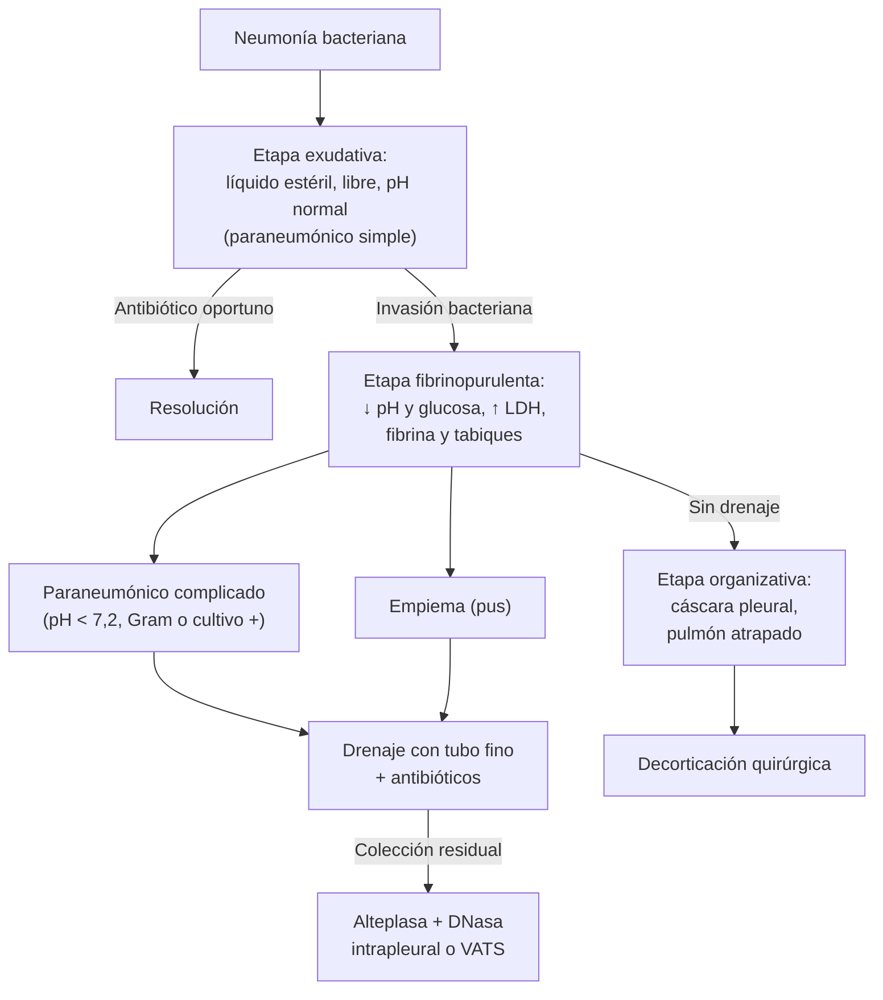
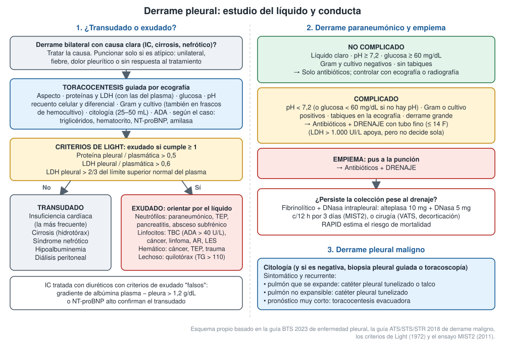

---
tags:
  - Respiratorio
  - Frecuente en sala
---

# Derrame pleural: paraneumónico, empiema, neoplásico y enfoque diagnóstico

**Subespecialidad**
Enfermedades respiratorias · Cirugía de tórax · Oncología

**Guías principales**
BTS 2023: enfermedad pleural · ATS/STS/STR 2018: derrame pleural maligno · AATS 2017: empiema · Criterios de Light (1972)

**Otras fuentes**
Ensayo MIST2 (alteplasa y DNasa intrapleural, 2011) · Puntaje RAPID (2014) · Etiología en más de 3.000 toracocentesis (Porcel 2014) · Enfoque diagnóstico del derrame pleural (Oyonarte, *Rev Med Clin Condes* 2024)

**GES**
No como tal. Sí lo son algunas de sus causas: **cáncer de pulmón**, **cáncer de mama**, **linfoma** y **NAC ambulatoria en ≥ 65 años**. La tuberculosis se trata gratis en el PROCET.

**EUNACOM**
1.05.1.012 Derrame pleural paraneumónico simple (específico, completo, completo) · 1.05.1.011 Derrame pleural paraneumónico complicado (específico, inicial, derivar) · 1.05.1.010 Derrame pleural neoplásico (específico, inicial, derivar) · 1.05.1.013 Derrame pleural por tuberculosis (específico, completo, completo)

**Revisado**
Septiembre 2026

!!! abstract "Resumen en 60 segundos"
    - **Cuatro causas** explican ~ **75 %** de los derrames que se puncionan: **cáncer** (27 %), **insuficiencia cardíaca** (21 %), **neumonía** (19 %) y **tuberculosis** (9 %). En Chile, la TBC pleural es frecuente en los **jóvenes** (Porcel 2014).
    - **Toracocentesis guiada por ecografía** en todo derrame **unilateral**, con **fiebre** o **sin causa clara**. Si hay una IC evidente con derrame bilateral, primero se tratan con diuréticos.
    - **Criterios de Light**: es **exudado** si cumple **≥ 1**:
        - Proteína pleural/plasmática **> 0,5**.
        - LDH pleural/plasmática **> 0,6**.
        - LDH pleural **> 2/3** del límite superior normal del plasma.
        - En la IC con diuréticos, un gradiente de albúmina **> 1,2 g/dL** o un **NT-proBNP** alto confirman el **transudado**.
    - **Derrame paraneumónico**:
        - **Simple**: pH ≥ 7,2, Gram y cultivo negativos, sin tabiques. Se trata **solo con antibióticos**.
        - **Complicado**: **pH < 7,2** (o glucosa < 60 mg/dL), Gram o cultivo **positivos**, **tabiques**. Requiere **drenaje** con tubo fino.
        - **Empiema**: **pus**. Requiere **drenaje**.
        - Si la colección persiste: **alteplasa + DNasa** intrapleurales (MIST2) o **cirugía** (VATS).
        - Cubrir los **anaerobios**. Más del **30 %** de las infecciones pleurales terminan en muerte o cirugía.
    - **Derrame neoplásico**: pulmón y mama son las causas más frecuentes. La **citología** es positiva en ~ 60 % (menos en el mesotelioma); si es negativa, **biopsia pleural**. Si es **sintomático y recurrente**: **catéter pleural tunelizado** o **pleurodesis con talco** (esta solo si el pulmón se expande).
    - **TBC pleural**: exudado **linfocítico** con **ADA > 40 U/L**; se trata con el esquema antituberculoso.

## Definición

| Término | Definición |
|---|---|
| **Derrame pleural** | Acumulación anormal de líquido en el espacio pleural (normalmente hay ~ 0,1–0,3 mL/kg) |
| **Transudado** | Líquido pobre en proteínas por un desequilibrio de las **presiones** hidrostática u oncótica, con pleura **sana** |
| **Exudado** | Líquido rico en proteínas y LDH por **inflamación**, infección, neoplasia o alteración del drenaje linfático de la **pleura** |
| **Derrame paraneumónico simple (no complicado)** | Exudado estéril, libre, asociado a una neumonía; **pH ≥ 7,2**, glucosa ≥ 60 mg/dL, Gram y cultivo negativos |
| **Derrame paraneumónico complicado** | Invasión bacteriana del espacio pleural: **pH < 7,2**, glucosa < 60 mg/dL, LDH > 1.000 UI/L, Gram o cultivo positivos o tabiques, **sin pus** |
| **Empiema** | **Pus** en el espacio pleural (aspecto purulento), con o sin Gram o cultivo positivo |
| **Derrame pleural maligno** | Derrame con **células neoplásicas** en el líquido o en la pleura. Los derrames **paramalignos** acompañan al cáncer sin invadir la pleura (obstrucción linfática, atelectasia, TEP, fármacos) |
| **Pulmón no expansible (atrapado)** | Pulmón que **no se expande** tras evacuar el líquido, por una capa visceral engrosada, una obstrucción bronquial o una fibrosis. Contraindica la pleurodesis |
| **Hemotórax** | Hematocrito del líquido pleural **> 50 %** del sanguíneo |
| **Quilotórax** | Linfa en la pleura por lesión o bloqueo del conducto torácico: **triglicéridos > 110 mg/dL**, quilomicrones |

## Epidemiología

### Mundial

- En **3.077** pacientes con derrame que requirió una toracocentesis diagnóstica (Porcel 2014):
    - **Causas**: **cáncer 27 %**, **insuficiencia cardíaca 21 %**, **neumonía 19 %**, **tuberculosis 9 %**, cirugía abdominal 4 %, enfermedades pericárdicas 4 % y cirrosis 3 %.
    - La **TBC** fue la primera causa en menores de 34 años (**52 %**). La **IC** predominó en los octogenarios (**45 %**).
    - Los tumores primarios más frecuentes del derrame maligno fueron el **pulmón (37 %)** y la **mama (16 %)**.
    - La **citología** acertó en el **59 %** de los derrames malignos, pero solo en el 27 % de los mesoteliomas y en el 25 % de los carcinomas escamosos de pulmón.
    - Solo el **30 %** de los derrames infecciosos tuvo **cultivo positivo** (66 % en los empiemas).
- El **derrame paraneumónico** aparece en hasta ~ 40 % de las neumonías bacterianas hospitalizadas. Ver [NAC](neumonia-adquirida-en-la-comunidad.md).
- **Infección pleural**: **más del 30 %** de los pacientes muere o requiere cirugía (MIST2). Los estreptococos del grupo *viridans* (*S. anginosus*/*milleri*), los **anaerobios**, *S. aureus* y los gramnegativos son los agentes más frecuentes. El **neumococo** es menos frecuente como causa de empiema de lo que se piensa.

!!! chile "Datos nacionales"
    - Las cuatro causas principales (IC, derrame maligno, paraneumónico y TBC) explican ~ 75 % de los derrames. La **TBC pleural** conserva un peso importante por la incidencia de tuberculosis en **aumento** en Chile (Oyonarte 2024).
        - La TBC pleural es una de las formas **extrapulmonares** más frecuentes.
        - El diagnóstico se apoya en la **ADA** del líquido: **sensibilidad 92 %** y **especificidad 90 %**. Con **< 30 U/L**, el valor predictivo negativo es **98,9 %**.
        - Ver [tuberculosis](tuberculosis.md).
    - El **cáncer de pulmón** es una de las principales causas de muerte por cáncer en Chile. Su **GES** incluye la confirmación, la etapificación y el tratamiento. El **derrame maligno** marca una enfermedad **avanzada** (estadio M1a).
    - El **empiema** por neumonía es frecuente en los adultos con comorbilidades (alcoholismo, diabetes, mala higiene dental, aspiración).

## Etiología

| Tipo | Causas |
|---|---|
| **Transudados** | **Insuficiencia cardíaca** (la más frecuente, bilateral o derecha), **cirrosis con ascitis** (hidrotórax hepático, habitualmente derecho), **síndrome nefrótico**, hipoalbuminemia, **diálisis peritoneal**, atelectasia, hipotiroidismo, urinotórax |
| **Exudados infecciosos** | **Paraneumónico** y **empiema**, **tuberculosis**, abscesos subfrénicos o hepáticos, virus, hongos |
| **Exudados neoplásicos** | **Pulmón**, **mama**, **linfoma**, ovario, estómago, **mesotelioma** (exposición a asbesto) |
| **Otros exudados** | **TEP** (puede ser transudado o exudado), **pancreatitis**, rotura esofágica, **síndrome poslesión cardíaca** (poscirugía, post-IAM), **artritis reumatoide**, **LES**, uremia, **fármacos** (amiodarona, nitrofurantoína, metotrexato, dasatinib), asbesto benigno, síndrome de Meigs, quilotórax, hemotórax |

## Fisiopatología

- El líquido pleural se **forma** en la pleura parietal (capilares sistémicos) y se **reabsorbe** por los **linfáticos** de la pleura parietal. El derrame aparece si aumenta la formación o disminuye la reabsorción.
- **Transudado**: aumento de la **presión hidrostática** (IC), baja de la **presión oncótica** (hipoalbuminemia) o paso de líquido desde el abdomen por defectos del diafragma (cirrosis, diálisis peritoneal).
- **Exudado**: aumento de la **permeabilidad** capilar por inflamación, o **obstrucción linfática** (cáncer).
- **Evolución de la infección pleural** (3 etapas):
    1. **Exudativa**: líquido estéril, libre, pH normal.
    2. **Fibrinopurulenta**: invasión bacteriana, metabolismo de bacterias y neutrófilos con consumo de glucosa y producción de ácido (**pH y glucosa bajan, LDH sube**) y depósito de **fibrina** con **tabiques**.
    3. **Organizativa**: los fibroblastos forman una **cáscara** pleural que **atrapa** el pulmón (fibrotórax).
- Por eso el **pH < 7,2** identifica a los derrames que **no se resolverán solo con antibióticos** y necesitan **drenaje**.

## Clasificación

- **Por el líquido**: **transudado** o **exudado** (criterios de Light).
- **Derrame paraneumónico**:

| Categoría | Hallazgos | Conducta |
|---|---|---|
| **Simple (no complicado)** | Líquido claro, **pH ≥ 7,2**, glucosa ≥ 60 mg/dL, Gram y cultivo **negativos**, sin tabiques | **Antibióticos** |
| **Complicado** | **pH < 7,2** (o glucosa < 60 mg/dL si no hay pH), LDH > 1.000 UI/L, Gram o cultivo **positivos**, **tabiques** en la ecografía, derrame grande | Antibióticos + **drenaje pleural** |
| **Empiema** | **Pus** | Antibióticos + **drenaje pleural** |

- **Por tamaño** en la radiografía: pequeño, moderado, **masivo** (todo el hemitórax).
    - Un derrame masivo que **desplaza el mediastino al lado contrario** sugiere cáncer.
    - Si **no lo desplaza** (o lo atrae), sugiere una **obstrucción bronquial** con atelectasia o un mediastino fijo por tumor.

## Clínica

- **Síntomas**:
    - **Disnea** (según el volumen y la reserva pulmonar).
    - **Dolor pleurítico**: puntada que aumenta con la inspiración y la tos. Es típico de la fase inicial inflamatoria y **disminuye** al acumularse el líquido.
    - Tos seca.
    - Los de la **causa**: fiebre y expectoración (neumonía), baja de peso (cáncer, TBC), ortopnea y edema (IC).
- **Examen físico** (derrame > 300 mL):
    - **Matidez** a la percusión y **disminución o abolición del murmullo pulmonar** y de las **vibraciones vocales**.
    - **Egofonía** y **soplo pleurítico** en el borde superior.
    - Frote pleural (fase seca).
    - En el derrame masivo: abombamiento de los espacios intercostales y desviación de la tráquea.
- **Pistas de la causa**:
    - **Infección pleural** si una neumonía **no responde** a los antibióticos o recae con fiebre.
    - **Cáncer** si hay un derrame que **recurre rápido**, baja de peso o antecedente oncológico.
    - **TBC** si es un joven con fiebre, sudoración y un derrame linfocítico.
    - **TEP** si hay disnea desproporcionada.

## Diagnóstico

!!! guia "Estudio del derrame pleural unilateral (BTS 2023)"
    - **Ecografía torácica** antes de puncionar: confirma el líquido, estima el volumen, muestra los **tabiques** y guía el sitio de punción (reduce el neumotórax).
    - **Toracocentesis diagnóstica** en todo derrame **unilateral**, **febril**, **doloroso**, asimétrico o sin causa clara.
    - En la **IC** con derrame **bilateral** y cuadro típico: tratar primero con **diuréticos** y puncionar si no responde o hay atipías.
    - **Qué pedir**:
        - Aspecto; proteínas y **LDH** (con **proteínas y LDH del plasma** del mismo día); **glucosa**.
        - **pH** (en jeringa heparinizada y en máquina de gases; **sin aire**) si se sospecha infección.
        - **Recuento celular** y diferencial.
        - **Gram y cultivo**, también en **frascos de hemocultivo**.
        - **Citología** (**25–50 mL**).
        - **ADA**.
        - Según el caso: triglicéridos, colesterol, hematocrito, amilasa, **NT-proBNP**.
    - **Criterios de Light**: exudado si **≥ 1**:
        - Proteína pleural/plasmática > 0,5.
        - LDH pleural/plasmática > 0,6.
        - LDH pleural > 2/3 del límite superior normal del plasma.
    - **Pseudoexudado cardíaco** (IC tratada con diuréticos): gradiente de **albúmina** plasma − pleura **> 1,2 g/dL** (o de proteínas > 3,1 g/dL), o **NT-proBNP** alto en el suero o en la pleura.
    - Citología **negativa** con sospecha de cáncer: repetir una vez. Si sigue negativa: **biopsia pleural guiada por imágenes** o **toracoscopía**. La **biopsia pleural a ciegas** se evita.

| Hallazgo en el líquido | Orienta a |
|---|---|
| **Pus** o fetidez | **Empiema** (anaerobios) |
| **Hemático** (Hto > 50 % del sanguíneo = hemotórax) | Trauma, **cáncer**, **TEP**, poslesión cardíaca |
| **Lechoso** | **Quilotórax** (TG > 110 mg/dL) o seudoquilotórax (colesterol > 200 mg/dL, cristales) |
| **Neutrófilos** predominantes | **Paraneumónico**, TEP, pancreatitis, absceso subfrénico, TBC precoz |
| **Linfocitos** > 50 % | **TBC**, **cáncer**, **linfoma**, derrame crónico, AR, quilotórax, poscirugía cardíaca |
| **Eosinófilos** > 10 % | Aire o sangre en la pleura (tras punciones), fármacos, parásitos, asbesto benigno; no descarta el cáncer |
| **pH < 7,2** | **Derrame complicado o empiema**, **rotura esofágica**, AR, TBC, cáncer avanzado (mal pronóstico) |
| **Glucosa < 60 mg/dL** | **Empiema**, **artritis reumatoide** (muy baja), TBC, cáncer |
| **ADA > 40 U/L** | **Tuberculosis** (falsos positivos: empiema, AR, linfoma) |
| **Amilasa alta** | **Pancreatitis**, **rotura esofágica** (amilasa salival), cáncer |

<figure markdown>
{ loading=lazy }
<figcaption>Figura 1. Estudio del líquido pleural (criterios de Light, orientación del exudado) y conducta en el derrame paraneumónico, el empiema y el derrame maligno. Esquema propio basado en la guía BTS 2023 de enfermedad pleural, la guía ATS/STS/STR 2018 de derrame maligno, los criterios de Light (1972) y el ensayo MIST2 (2011).</figcaption>
</figure>

## Laboratorio

- **Plasma** (el mismo día de la punción): **proteínas totales**, **LDH**, **glucosa**, albúmina, hemograma, **PCR**, creatinina, pruebas de coagulación (si se va a instalar un drenaje), **NT-proBNP** si se sospecha IC.
- **Líquido pleural**: ver el recuadro. El **pH** se mide en una **máquina de gases**. Las tiras reactivas no sirven, y el aire o la lidocaína en la jeringa alteran el resultado.
- **Microbiología**:
    - **Hemocultivos** en toda sospecha de infección pleural.
    - Líquido en **frascos de hemocultivo** (aumenta el rendimiento).
    - **Baciloscopía, cultivo y PCR para *M. tuberculosis*** si se sospecha TBC (el rendimiento en el líquido es **bajo**).
- **Puntaje RAPID** (pronóstico de la infección pleural; 0–7 puntos):

| Variable | 0 | 1 | 2 |
|---|---|---|---|
| **R**enal: urea en plasma | < 5 mmol/L (BUN < 14 mg/dL) | 5–8 mmol/L (BUN 14–22) | > 8 mmol/L (BUN > 22) |
| **A**ge (edad) | < 50 años | 50–70 | > 70 |
| **P**urulencia del líquido | Purulento | **No purulento** | — |
| **I**nfección: origen | Comunidad | **Hospitalario** | — |
| **D**ieta: albúmina | ≥ 2,7 g/dL | < 2,7 g/dL | — |

- Riesgo **bajo** (0–2), **medio** (3–4) o **alto** (5–7) de mortalidad a 3 meses. En la derivación del puntaje, el riesgo medio y el alto se asociaron a un OR de 24 y 192 de muerte respecto del bajo. No define por sí solo el tratamiento.

## Imágenes

- **Radiografía de tórax**:
    - Borramiento del **ángulo costofrénico** (en la PA se necesitan ~ 200 mL; en la lateral, menos).
    - **Menisco** (curva cóncava hacia arriba), opacidad homogénea sin broncograma.
    - Derrame **subpulmonar** (hemidiafragma "elevado" con el vértice desplazado hacia lateral).
    - En **decúbito lateral**, un derrame **> 10 mm** es puncionable.
- **Ecografía torácica** (la mejor para la cabecera):
    - Detecta volúmenes pequeños.
    - Muestra los **tabiques** (sugieren derrame **complicado**), el contenido **ecogénico** (exudado, pus, sangre) y los **nódulos pleurales** o el engrosamiento diafragmático (sugieren **cáncer**).
    - Guía la punción y el drenaje.
- **TC de tórax con contraste**:
    - **Signo de la pleura dividida** (*split pleura*): realce de ambas hojas pleurales en el **empiema**.
    - Engrosamiento pleural **nodular**, **circunferencial**, **mediastínico** o > 1 cm: sugiere **cáncer** o mesotelioma.
    - Absceso pulmonar, masas y adenopatías.
- **PET-CT**: etapificación oncológica, no para el diagnóstico inicial del derrame.

## Diagnóstico diferencial

| Condición | Claves |
|---|---|
| **Consolidación o atelectasia** | Broncograma aéreo, pérdida de volumen con desplazamiento **hacia** el lado afectado; la ecografía distingue el líquido del parénquima |
| **Absceso pulmonar** | Nivel hidroaéreo esférico y de paredes gruesas, con ángulos agudos con la pared. Ver [absceso pulmonar](../infectologia/flegmon-cervical-absceso-pulmonar-y-cerebral.md) |
| **Engrosamiento pleural o fibrotórax** | Sin líquido en la ecografía |
| **Elevación del hemidiafragma** | Parálisis frénica, masa subfrénica; la ecografía muestra el diafragma |
| **Masa o mesotelioma** | Engrosamiento nodular en la TC |
| **Neumotórax con nivel (hidroneumotórax)** | Nivel **horizontal** recto (no menisco): aire + líquido (trauma, rotura esofágica, fístula broncopleural) |

## Tratamiento

### Derrame paraneumónico simple (manejo completo del médico general)

- **Antibióticos de la neumonía** según su gravedad y la guía local (ver [NAC](neumonia-adquirida-en-la-comunidad.md)).
- **Toracocentesis diagnóstica** para confirmar que es simple (pH ≥ 7,2, Gram y cultivo negativos). Puede ser también **evacuadora** si produce disnea.
- **Control clínico y ecográfico o radiológico** a las 48–72 horas. Si persiste la fiebre, aumenta el derrame o aparecen tabiques: **repetir la punción** (puede evolucionar a complicado).

### Derrame paraneumónico complicado y empiema (iniciar y derivar)

!!! dosis "Infección pleural: antibióticos y drenaje (BTS 2023, AATS 2017)"
    | Situación | Esquema |
    |---|---|
    | **Adquirida en la comunidad** | **Ampicilina-sulbactam 3 g c/6 h EV** o **amoxicilina-ácido clavulánico 1 g c/8 h EV**; o **ceftriaxona 2 g/día EV + metronidazol 500 mg c/8 h** (EV o VO). Alérgicos: clindamicina + ciprofloxacino, según la guía local |
    | **Nosocomial**, posquirúrgica o postrauma | **Piperacilina-tazobactam 4,5 g c/6 h EV** o **meropenem 1 g c/8 h**; agregar **vancomicina** si hay riesgo de **SARM** |
    | **Paso a la vía oral** | **Amoxicilina-ácido clavulánico 875/125 mg c/12 h** VO (o según el cultivo) al mejorar |
    | **Duración** | No está bien establecida. Habitualmente **2–6 semanas**, según la evolución clínica, radiológica y de la PCR |

    - **Siempre cubrir los anaerobios**, aunque el cultivo sea negativo.
    - **Evitar los aminoglucósidos**: penetran mal y se inactivan en el pus ácido. Los macrólidos no se indican salvo por neumonía atípica.
    - **Drenaje**: **tubo fino (≤ 14 F)** guiado por ecografía, con **lavados** con suero fisiológico según el protocolo local.
    - **Si persiste una colección** pese al drenaje:
        - **Alteplasa 10 mg + DNasa 5 mg intrapleurales c/12 h por 3 días** (MIST2).
        - **Juntos**: cada uno por separado **no sirve**, y la DNasa sola aumentó la cirugía.
        - La combinación mejoró el drenaje y **redujo la derivación a cirugía** (4 % vs 16 %) y la **estadía** (−6,7 días).
    - **Cirugía** (VATS: debridamiento o decorticación) si falla lo anterior o hay **sepsis** que no se controla.

- **Otras medidas**: nutrición (hipoalbuminemia), **tromboprofilaxis**, control del dolor, kinesiología respiratoria.
- **Derivar o interconsultar** a broncopulmonar o cirugía de tórax: derrame **complicado** o **empiema**, colección que persiste, pulmón atrapado.

### Derrame pleural maligno (iniciar y derivar)

- **Asintomático**: **no** intervenir la pleura (ATS/STS/STR 2018). Tratar el cáncer.
- **Sintomático**:
    - **Toracocentesis evacuadora de gran volumen**: alivia y muestra si el pulmón **se expande**.
    - Evacuar hasta **1,5 L** por vez o hasta que aparezcan tos, opresión torácica o dolor (riesgo de **edema de reexpansión**).
- **Recurrente y sintomático**:
    - **Pulmón que se expande**: **catéter pleural tunelizado** (drenaje en el domicilio) o **pleurodesis con talco** (por el tubo o por toracoscopía). Se elige según las **preferencias** del paciente.
    - **Pulmón no expansible** o pleurodesis fallida: **catéter pleural tunelizado**.
    - **Pronóstico muy corto**: **toracocentesis evacuadoras** repetidas.
    - La infección del catéter se trata con **antibióticos** sin retirarlo (ATS/STS/STR 2018).
- **Tratar el cáncer** (quimioterapia, terapias dirigidas, inmunoterapia). En el **linfoma** y el cáncer de pulmón de células pequeñas, la quimioterapia puede controlar el derrame.
- **Cuidados paliativos**: opioides en dosis bajas para la disnea, oxígeno si hay hipoxemia.

### Derrame pleural tuberculoso

- **Esquema antituberculoso estándar** (ver [tuberculosis](tuberculosis.md)), notificación y estudio de contactos.
- La evacuación alivia los síntomas. Los **corticoides no** se recomiendan de rutina.

### Transudados

- **Tratar la causa**: diuréticos en la IC, manejo de la ascitis en la cirrosis (el hidrotórax hepático **no** se drena con un tubo: riesgo de pérdida masiva de proteínas, infección y falla renal) y del síndrome nefrótico.
- **Toracocentesis evacuadora** solo si hay disnea importante.

### Técnica y seguridad de la toracocentesis

- **Guiada por ecografía**, en el borde **superior** de la costilla (el paquete vasculonervioso va por el borde inferior), en la línea axilar media a posterior.
- **No** es necesario corregir alteraciones leves de la coagulación para una punción diagnóstica con aguja fina. En los pacientes **anticoagulados** se evalúa caso a caso.
- **Complicaciones**:
    - **Neumotórax** (menos con ecografía).
    - Hemotórax, reacción vasovagal, infección.
    - **Edema de reexpansión**: evacuar ≤ 1,5 L y detener si hay tos, opresión o dolor.
    - Lesión hepática o esplénica en punciones bajas.

## Complicaciones

- **Empiema no drenado**: sepsis, **pulmón atrapado** (fibrotórax) con restricción permanente, **fístula broncopleural**, *empyema necessitatis* (fístula a la pared).
- **Derrame maligno**: disnea recurrente, pérdida funcional, **pulmón no expansible**, infección del catéter.
- **De los procedimientos**: neumotórax, hemotórax, edema de reexpansión, infección, dolor, desplazamiento u obstrucción del drenaje, sangrado con los fibrinolíticos.
- **TBC pleural no tratada**: TBC pulmonar o extrapulmonar posterior, engrosamiento pleural residual.

## Pronóstico y seguimiento

- **Paraneumónico simple**: excelente con antibióticos.
- **Infección pleural**: morbimortalidad **alta**. El puntaje **RAPID** identifica a los de mayor riesgo, en quienes se discute más precozmente el manejo intensivo. Controlar con ecografía o radiografía y PCR hasta la resolución. El engrosamiento pleural residual es frecuente y habitualmente mejora en meses.
- **Derrame maligno**: indica enfermedad **avanzada**, con sobrevida limitada que varía según el tumor y el estado funcional. El objetivo es **aliviar la disnea** con el menor número de procedimientos y días de hospitalización.
- **TBC pleural**: buena respuesta al tratamiento. Control en el PROCET.
- **Seguimiento de un derrame sin diagnóstico**: repetir la evaluación. Una **citología negativa no descarta el cáncer**. Algunos casos terminan siendo un mesotelioma o un linfoma en el seguimiento.

## Perlas para el internado

!!! perla "Para la sala y el turno"
    - Neumonía que **no responde** a los 3 días o vuelve la fiebre: busca un **derrame** con ecografía y **puncionalo**.
    - Pide siempre las **proteínas y la LDH del plasma** el mismo día de la punción; sin ellas no puedes aplicar Light.
    - Mide el **pH** en la **máquina de gases**, en jeringa heparinizada y **sin aire**. **pH < 7,2 = drenaje**.
    - Manda líquido en **frascos de hemocultivo**: sube el rendimiento del cultivo.
    - **Pus = drenaje**, sin esperar el pH.
    - En el empiema, **cubre anaerobios** y evita los aminoglucósidos.
    - Derrame **linfocítico** en un **joven** en Chile: pide **ADA** (> 40 U/L = TBC).
    - Derrame **masivo sin desplazamiento del mediastino**: piensa en un **cáncer de pulmón** con obstrucción bronquial. Pide una broncoscopía.
    - No drenes con tubo el **hidrotórax hepático**: se trata la ascitis.
    - Al evacuar, **no pases de 1,5 L** y detente si el paciente tose o siente opresión.

## Preguntas de repaso

??? repaso "1. Hombre de 55 años con NAC en tratamiento con amoxicilina-ácido clavulánico, que al tercer día sigue febril. La ecografía muestra un derrame derecho moderado, libre, anecogénico. Toracocentesis: líquido amarillo claro, pH 7,34, glucosa 90 mg/dL, LDH 350 UI/L, Gram negativo. ¿Qué es y qué haces?"
    **Derrame paraneumónico simple (no complicado)**: pH ≥ 7,2, glucosa normal, Gram negativo, sin tabiques.

    - **Continuar los antibióticos**. Revisar que la cobertura y la dosis sean adecuadas y esperar el cultivo.
    - La punción puede ser también **evacuadora** si hay disnea.
    - **Controlar** clínica, PCR y ecografía en 48–72 horas.
    - Si persiste la fiebre, crece el derrame o aparecen **tabiques**: **repetir la punción** (puede evolucionar a complicado).

??? repaso "2. Mujer de 62 años, alcohólica, con mala dentadura, fiebre de 10 días, tos y dolor pleurítico izquierdo. La ecografía muestra un derrame tabicado. La punción obtiene líquido turbio y fétido: pH 6,9, glucosa 20 mg/dL, LDH 3.200 UI/L. ¿Diagnóstico y manejo?"
    **Empiema** (líquido purulento y fétido, pH < 7,2, glucosa muy baja, LDH alta, tabiques), probablemente **polimicrobiano con anaerobios** (aspiración, mala dentadura, alcohol).

    - **Hospitalizar**. **Hemocultivos** y cultivo del líquido (también en frascos de hemocultivo).
    - **Antibióticos EV** con cobertura de **anaerobios**: ampicilina-sulbactam 3 g c/6 h EV, o ceftriaxona + metronidazol.
    - **Drenaje pleural** con tubo fino guiado por ecografía, con **lavados**.
    - Interconsulta a **broncopulmonar o cirugía de tórax**. Si la colección persiste: **alteplasa 10 mg + DNasa 5 mg c/12 h por 3 días**, o **VATS**.
    - Nutrición, tromboprofilaxis, manejo de la abstinencia alcohólica (**tiamina**).

??? repaso "3. Hombre de 72 años, fumador, con baja de peso de 8 kg y disnea progresiva. La radiografía muestra un derrame izquierdo masivo con el mediastino desplazado a la derecha. Toracocentesis: líquido hemático, linfocítico, exudado por Light, pH 7,32, ADA 18 U/L. ¿Qué sospechas y qué haces?"
    **Derrame pleural maligno** (probable cáncer de pulmón): fumador, baja de peso, derrame **masivo**, hemático, linfocítico, **ADA baja** (hace improbable la TBC).

    - **Toracocentesis evacuadora** (hasta 1,5 L o hasta que aparezcan síntomas) para aliviar y ver si el pulmón se expande.
    - **Citología** (25–50 mL). Si es negativa, repetir y, si sigue negativa, **biopsia pleural** guiada o **toracoscopía**.
    - **TC de tórax y abdomen con contraste**: masa, adenopatías, metástasis.
    - Derivar a broncopulmonar y oncología (**GES cáncer de pulmón**).
    - Si recurre y es sintomático: **catéter pleural tunelizado** o **pleurodesis con talco**, esta última solo si el pulmón se expande.

??? repaso "4. Hombre de 24 años, peruano, con 3 semanas de fiebre vespertina, sudoración nocturna y dolor pleurítico derecho. Derrame derecho moderado. Líquido: exudado, 85 % linfocitos, glucosa 70 mg/dL, ADA 78 U/L, baciloscopía negativa. ¿Diagnóstico y conducta?"
    **Derrame pleural tuberculoso**: joven, síntomas subagudos, **exudado linfocítico** con **ADA > 40 U/L**. La baciloscopía y el cultivo del líquido suelen ser negativos (pocos bacilos).

    - Buscar TBC pulmonar: **baciloscopía y cultivo de expectoración** (o esputo inducido), **radiografía o TC**. Pedir **VIH**.
    - La **biopsia pleural** (granulomas con necrosis caseosa, cultivo) confirma si hay dudas.
    - **Esquema antituberculoso** del PROCET, notificación y estudio de contactos.
    - La evacuación alivia los síntomas. No dar corticoides de rutina.

??? repaso "5. Mujer de 81 años con IC con FE reducida en tratamiento con furosemida, con derrame pleural bilateral mayor a derecha. Toracocentesis derecha: proteína pleural 3,1 g/dL (plasma 6,0), LDH pleural 180 UI/L (plasma 220; límite superior normal 250). Albúmina pleural 1,6 g/dL (plasma 3,0). ¿Es un exudado?"
    Por **Light** cumple los **tres** criterios de exudado:

    - Proteína pleural/plasmática = 3,1/6,0 = **0,52** (> 0,5).
    - LDH pleural/plasmática = 180/220 = **0,82** (> 0,6).
    - LDH pleural 180 > 2/3 de 250 (= **167**).

    Sin embargo, el **gradiente de albúmina** plasma − pleura es **1,4 g/dL** (> 1,2): es un **transudado cardíaco** "falsamente exudado" por el efecto concentrador de los **diuréticos**.

    - Confirmar con **NT-proBNP** (en el plasma o en la pleura).
    - Conducta: **optimizar el tratamiento de la IC**. Evacuar solo si hay disnea importante. Estudiar si el derrame persiste, es muy asimétrico o hay fiebre.

??? repaso "6. Hombre de 68 años con cáncer de pulmón metastásico y derrame maligno derecho que se reproduce cada 10 días pese a las punciones. En la última evacuación de 1,2 L, la radiografía mostró que el pulmón no se reexpandió (neumotórax *ex vacuo*). ¿Qué ofreces?"
    Tiene un **derrame maligno recurrente y sintomático** con **pulmón no expansible** (atrapado).

    - La **pleurodesis con talco no sirve**, porque las pleuras no se pueden juntar.
    - **Catéter pleural tunelizado**: permite drenar en el domicilio según los síntomas, con menos hospitalización (ATS/STS/STR 2018; BTS 2023).
    - Si el pronóstico es de pocas semanas: toracocentesis evacuadoras según los síntomas.
    - Manejo paliativo de la disnea (opioides en dosis bajas) y coordinación con oncología.

## Referencias

1. Roberts ME, Rahman NM, Maskell NA, et al. British Thoracic Society guideline for pleural disease. *Thorax.* 2023;78(Suppl 3):s1–s42. doi:[10.1136/thorax-2022-219784](https://doi.org/10.1136/thorax-2022-219784)
2. Feller-Kopman DJ, Reddy CB, DeCamp MM, et al. Management of malignant pleural effusions. An official ATS/STS/STR clinical practice guideline. *Am J Respir Crit Care Med.* 2018;198(7):839–849. doi:[10.1164/rccm.201807-1415ST](https://doi.org/10.1164/rccm.201807-1415ST)
3. Shen KR, Bribriesco A, Crabtree T, et al. The American Association for Thoracic Surgery consensus guidelines for the management of empyema. *J Thorac Cardiovasc Surg.* 2017;153(6):e129–e146. doi:[10.1016/j.jtcvs.2017.01.030](https://doi.org/10.1016/j.jtcvs.2017.01.030)
4. Light RW, Macgregor MI, Luchsinger PC, Ball WC Jr. Pleural effusions: the diagnostic separation of transudates and exudates. *Ann Intern Med.* 1972;77(4):507–513. doi:[10.7326/0003-4819-77-4-507](https://doi.org/10.7326/0003-4819-77-4-507)
5. Rahman NM, Maskell NA, West A, et al. Intrapleural use of tissue plasminogen activator and DNase in pleural infection. *N Engl J Med.* 2011;365(6):518–526. doi:[10.1056/NEJMoa1012740](https://doi.org/10.1056/NEJMoa1012740)
6. Rahman NM, Kahan BC, Miller RF, et al. A clinical score (RAPID) to identify those at risk for poor outcome at presentation in patients with pleural infection. *Chest.* 2014;145(4):848–855. doi:[10.1378/chest.13-1558](https://doi.org/10.1378/chest.13-1558)
7. Porcel JM, Esquerda A, Vives M, Bielsa S. Etiology of pleural effusions: analysis of more than 3,000 consecutive thoracenteses. *Arch Bronconeumol.* 2014;50(5):161–165. doi:[10.1016/j.arbres.2013.11.007](https://doi.org/10.1016/j.arbres.2013.11.007)
8. Oyonarte WM. Enfoque diagnóstico en el paciente con derrame pleural. *Rev Med Clin Condes.* 2024;35:299–308. doi:[10.1016/j.rmclc.2024.05.010](https://doi.org/10.1016/j.rmclc.2024.05.010)
