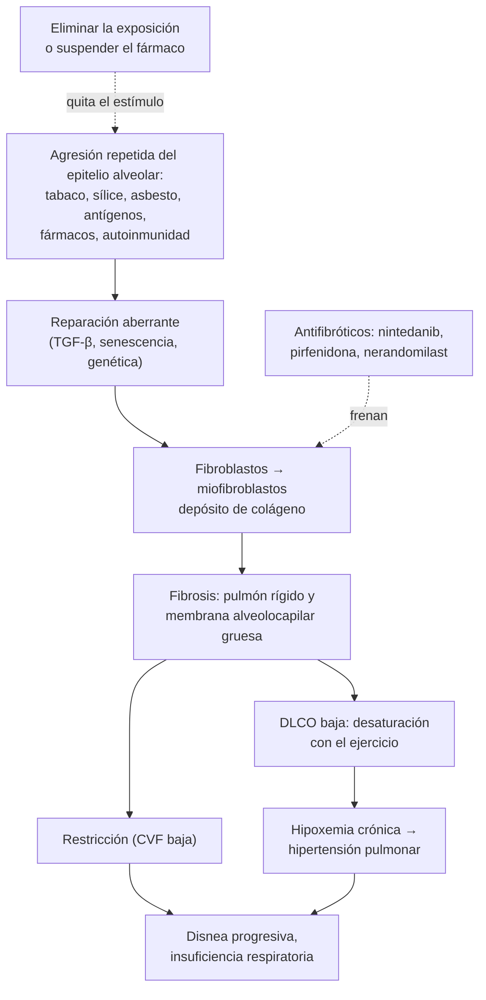
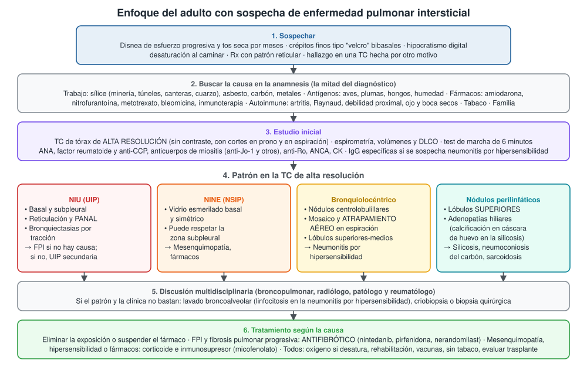
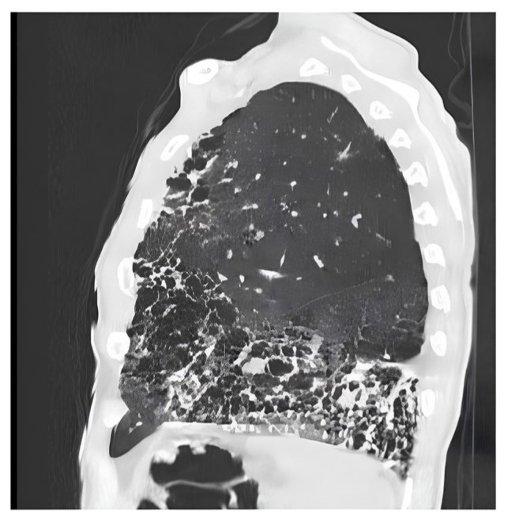
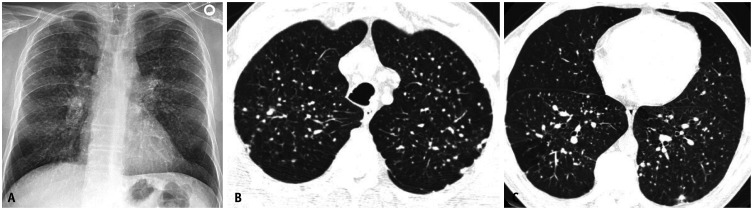

---
tags:
  - Respiratorio
---

# Enfermedades pulmonares intersticiales, daño pulmonar por fármacos y neumoconiosis

**Subespecialidad**
Broncopulmonar · Reumatología · Radiología torácica · Salud ocupacional

**Guías principales**
ATS/ERS/JRS/ALAT 2022: fibrosis pulmonar idiopática (actualización) y fibrosis pulmonar progresiva · ATS/JRS/ALAT 2020: diagnóstico de la neumonitis por hipersensibilidad · ERS/ATS 2025: clasificación de las neumonías intersticiales · ACR/CHEST 2023: tamizaje y tratamiento de la EPI en enfermedades reumáticas autoinmunes

**Otras fuentes**
FIBRONEER-IPF y FIBRONEER-ILD (nerandomilast, *N Engl J Med* 2025) · INBUILD (nintedanib, *N Engl J Med* 2019) · Grupo internacional de exacerbación aguda (*Am J Respir Crit Care Med* 2026) · Protocolo MINSAL de vigilancia de trabajadores expuestos a sílice (2015) y Plan Nacional de Erradicación de la Silicosis (PLANESI) · Registro latinoamericano de FPI (REFIPI, 2022)

**GES**
No. La silicosis, la asbestosis y las demás neumoconiosis son **enfermedades profesionales** cubiertas por el seguro de la **Ley 16.744** (mutualidades e ISL).

**EUNACOM**
1.05.1.018 Enfermedades del intersticio pulmonar (sospecha, inicial, derivar) · 1.05.1.009 Daño pulmonar secundario a drogas (sospecha, inicial, derivar) · 1.05.1.026 Neumoconiosis (sospecha, inicial, derivar)

**Revisado**
Octubre 2026

!!! abstract "Resumen en 60 segundos"
    - **Enfermedades pulmonares intersticiales (EPI)**: más de 200 enfermedades que inflaman o cicatrizan (**fibrosis**) la pared alveolar. Producen **restricción**, **DLCO baja** e **hipoxemia de esfuerzo**.
    - **Sospechar** en el adulto con **disnea de esfuerzo progresiva**, **tos seca**, **crépitos finos tipo "velcro"** en ambas bases e hipocratismo digital.
    - **La anamnesis encuentra la causa**: **trabajo** (sílice, asbesto, carbón), **antígenos** (aves, hongos), **fármacos** (amiodarona, nitrofurantoína, metotrexato, quimioterapia, inmunoterapia) y **autoinmunidad** (artritis reumatoide, esclerosis sistémica, miositis).
    - **Examen clave**: **TC de tórax de alta resolución**. El patrón **NIU (UIP)** (basal, subpleural, con **panal**) sin causa identificable es **fibrosis pulmonar idiopática (FPI)**.
    - **Tratamiento**:
        - Siempre: **eliminar la exposición** o **suspender el fármaco**.
        - **FPI** y **fibrosis pulmonar progresiva**: **antifibrótico** (nintedanib, pirfenidona y, desde 2025, **nerandomilast**). **No corticoides** en la FPI.
        - **Mesenquimopatías, hipersensibilidad y fármacos**: corticoide e **inmunosupresor** (micofenolato).
        - Para todos: oxígeno si desatura, rehabilitación, vacunas, dejar de fumar y evaluar **trasplante pulmonar**.
    - **Neumoconiosis**: la **silicosis** es la más importante en Chile (minería, túneles, canteras). No tiene cura: se **previene**. Aumenta el riesgo de **tuberculosis** y de **cáncer pulmonar**.

## Definición

- **Enfermedad pulmonar intersticial (EPI)**: grupo heterogéneo de enfermedades con **inflamación y/o fibrosis** del parénquima pulmonar, sobre todo del intersticio alveolar, de distribución **difusa**.
- **Fibrosis pulmonar idiopática (FPI)**: neumonía intersticial fibrosante crónica y progresiva, de **causa desconocida**, limitada al pulmón, propia del **adulto mayor**. Se asocia al patrón **NIU** (neumonía intersticial usual, en inglés UIP) en la TC o en la biopsia.
- **Fibrosis pulmonar progresiva (FPP)** (ATS/ERS/JRS/ALAT 2022): en una EPI **distinta de la FPI**, con fibrosis en la TC, se cumplen **2 de 3 criterios** en el último año sin otra explicación:
    1. **Empeoramiento de los síntomas** respiratorios.
    2. **Progresión funcional**: caída absoluta de la **CVF ≥ 5 %** del valor teórico **o** de la **DLCO ≥ 10 %** del teórico en 1 año.
    3. **Progresión radiológica**: más extensión de la reticulación, de las bronquiectasias por tracción o del panal.
- **Neumonitis por hipersensibilidad (NH)**: EPI inmunomediada por la **inhalación repetida de un antígeno** en una persona susceptible. Se divide en **no fibrótica** y **fibrótica** (ATS 2020).
- **Daño pulmonar por fármacos**: compromiso del parénquima (y a veces de la pleura, la vía aérea o los vasos) causado por un medicamento. Es un **diagnóstico de exclusión** basado en la **relación temporal**.
- **Neumoconiosis**: enfermedad pulmonar por **inhalación y depósito de polvo mineral** con reacción del tejido, en general **fibrosis**. Las principales son la **silicosis** (sílice cristalina), la **asbestosis** (asbesto) y la **neumoconiosis de los trabajadores del carbón**.
- **Exacerbación aguda** (grupo internacional, 2026): empeoramiento respiratorio agudo con **daño alveolar difuso** en la TC o la biopsia, en un paciente con EPI fibrosante conocida o recién diagnosticada.

## Epidemiología

### Mundial

- **FPI**: incidencia de **0,09–1,30 por 10.000 personas** al año y prevalencia de **0,33–4,51 por 10.000** según el país (Maher 2021). Es una **enfermedad rara**.
- La FPI predomina en **hombres > 60 años**, fumadores o exfumadores.
- La **mediana de supervivencia** de la FPI es de **3–5 años** desde el diagnóstico: peor que la de muchos cánceres.
- **Neumonitis por inhibidores de PD-1** (metaanálisis de Nishino 2016): **2,7 %** de cualquier grado y **0,8 %** de grado ≥ 3. Más frecuente en el **cáncer pulmonar** (**4,1 %**).
- **Toxicidad pulmonar por amiodarona**: **1–17 %** de los tratados según la serie.
- **Silicosis**: enfermedad fibrosante **sin tratamiento curativo**. Progresa incluso después de terminar la exposición y se asocia a **tuberculosis**, obstrucción bronquial y **cáncer pulmonar** (Leung 2012).

### Chile

!!! chile "Datos nacionales"
    - **Registro latinoamericano de FPI (REFIPI)**, 14 países, entre ellos Chile; 761 pacientes:
        - **74,7 % hombres**; edad media **72 años**.
        - **Retraso diagnóstico** de **1 año** (mediana) desde los síntomas.
        - Al diagnóstico: **CVF 71 %** y **DLCO 54 %** del teórico, en promedio.
        - **72 %** recibió antifibrótico; **11,2 %** tuvo una **exacerbación aguda** y **45 %** de ellos murió por esa causa.
    - **Sílice**:
        - El **ISP** estimó que el **5,4 % de la fuerza de trabajo** (~ **325.000 personas**) tiene **alta probabilidad de exposición a sílice**.
        - Rubros: minería, túneles, canteras, construcción, cerámica, fundiciones y arenado.
    - **PLANESI** (2009–2030): busca que **desde 2030 no haya casos nuevos** de silicosis.
    - **Protocolo MINSAL de vigilancia de expuestos a sílice** (Res. Exenta 268, 2015):
        - Evaluación de salud con cuestionario y **radiografía de tórax con técnica OIT**.
        - Periodicidad según la exposición: desde **cada 4 años** hasta **anual**.
        - La vigilancia **sigue después de terminar la exposición**.
    - **Límite permisible ponderado** (DS 594): **cuarzo 0,08 mg/m³** de fracción respirable.
    - **Mineros y exmineros con silicosis** en un programa de vigilancia (Farmer-Aldunce 2025): **96 %** mayores de 60 años y **37 %** con silicosis moderada o grave.
    - **Asbesto**: prohibido en Chile desde **2001** (DS 656). Todavía se ven asbestosis, placas pleurales y mesoteliomas por exposiciones antiguas: la latencia es de décadas.
    - **Neumonía en organización** en el Instituto Nacional del Tórax (Lolas 2024; 69 casos):
        - **54 %** criptogénica.
        - **17 % por fármacos** y **16 %** por mesenquimopatías.
    - **Síndrome antisintetasa** en Chile (Campos Benavente 2026; 60 pacientes): la **EPI** fue la manifestación más frecuente (**73 %**); el **micofenolato** fue el inmunosupresor más usado.
    - **Cobertura**:
        - La FPI **no es GES**.
        - Los antifibróticos son de **alto costo**: las agrupaciones de pacientes han pedido incluirlos en la **Ley Ricarte Soto**.
        - La **silicosis** y las demás neumoconiosis se denuncian como **enfermedad profesional** (Ley 16.744).

## Etiología y factores de riesgo

| Grupo | Ejemplos | Pistas |
|---|---|---|
| **Exposiciones ocupacionales (neumoconiosis)** | **Sílice** (minería, túneles, canteras, arenado, cuarzo artificial), **asbesto** (construcción, frenos, astilleros), **carbón**, berilio | Historia laboral **detallada**; latencia de años o décadas |
| **Antígenos inhalados (NH)** | **Aves** (palomas, loros, plumas de almohadas y plumones), **hongos** (humedad, heno, granjas, humidificadores), isocianatos | Síntomas que mejoran lejos de la exposición |
| **Fármacos y radiación** | **Amiodarona**, **nitrofurantoína**, **metotrexato**, **bleomicina**, inmunoterapia (anti-PD-1), trastuzumab deruxtecán, inhibidores de tirosina quinasa, **radioterapia** | Relación temporal; mejoría al suspender |
| **Enfermedades autoinmunes** | **Esclerosis sistémica**, **artritis reumatoide**, **miositis** (síndrome antisintetasa), Sjögren, enfermedad mixta del tejido conectivo | Raynaud, artritis, debilidad, "manos de mecánico", ojo y boca secos |
| **Tabaco** | Bronquiolitis respiratoria, neumonía de macrófagos alveolares (antes "descamativa"), histiocitosis de células de Langerhans | Fumador activo |
| **Granulomatosas** | **Sarcoidosis**, beriliosis | Adenopatías hiliares bilaterales |
| **Idiopáticas** | **FPI**, NINE idiopática, neumonía en organización criptogénica | Diagnóstico de **exclusión** |

- **Factores de riesgo de FPI**: edad > 60 años, sexo masculino, **tabaco**, reflujo gastroesofágico, exposición a polvos de metal y madera, **antecedentes familiares** (mutaciones de genes de los **telómeros** y del surfactante; polimorfismo del promotor de **MUC5B**).

## Fisiopatología

- **Modelo de la FPI** (aplica a otras fibrosis):
    1. **Microlesiones repetidas** del epitelio alveolar (tabaco, polvos, reflujo, virus) en un pulmón **envejecido** y genéticamente susceptible.
    2. **Reparación aberrante**: el epitelio libera mediadores profibróticos (**TGF-β**).
    3. Los **fibroblastos** proliferan, se transforman en **miofibroblastos** y depositan colágeno (**focos fibroblásticos**).
    4. La fibrosis **endurece** el pulmón (baja la distensibilidad) y **engrosa** la membrana alveolocapilar.
- **Consecuencias funcionales**:
    - Volúmenes pulmonares bajos: **restricción**.
    - **DLCO baja**: peor intercambio de gases.
    - **Desaturación con el ejercicio**: el tránsito capilar es más rápido y no alcanza el equilibrio.
    - Con el tiempo: **hipertensión pulmonar** e insuficiencia respiratoria crónica.
- **Silicosis**: los **macrófagos fagocitan la sílice**. Su lisosoma se rompe, se activa el **inflamasoma NALP3** y se liberan citoquinas que reclutan fibroblastos. El macrófago muere y libera la sílice, que es fagocitada de nuevo: un **ciclo que no se detiene** aunque cese la exposición.
- **Neumonitis por hipersensibilidad**: inflamación **linfocitaria** (hipersensibilidad tipo III y IV) centrada en los **bronquiolos**, con **granulomas** mal formados. Si la exposición sigue, evoluciona a fibrosis.
- **Fármacos**: toxicidad directa (bleomicina, amiodarona) o reacción inmunológica (nitrofurantoína, metotrexato, inmunoterapia).

*Figura 1. Fisiopatología común de las enfermedades intersticiales fibrosantes y puntos de acción del tratamiento. Esquema propio basado en la guía ATS/ERS/JRS/ALAT 2022 y en Leung 2012 (silicosis).*

## Clasificación

**Clasificación clínica práctica** (pensar en la causa):

| Grupo | Enfermedades |
|---|---|
| **Causa conocida** | Neumoconiosis, neumonitis por hipersensibilidad, fármacos y radiación, enfermedades autoinmunes, tabaco |
| **Idiopáticas** | FPI, NINE idiopática, neumonía en organización criptogénica, daño alveolar difuso idiopático (antes "neumonía intersticial aguda") |
| **Granulomatosas** | Sarcoidosis |
| **Otras** | Linfangioleiomiomatosis, proteinosis alveolar, histiocitosis de Langerhans, neumonía eosinofílica |

**Patrones de la clasificación ERS/ATS 2025** (se aplican a causas idiopáticas y secundarias):

| Tipo | Patrón | Causas típicas |
|---|---|---|
| **Intersticial fibrótico o no fibrótico** | **NIU (UIP)** | FPI; también AR, NH crónica, asbestosis, fármacos |
| | **NINE (NSIP)** | **Esclerosis sistémica**, miositis, fármacos; NINE idiopática |
| | **Bronquiolocéntrico** (nuevo en 2025) | **Neumonitis por hipersensibilidad**, aspiración, inhalaciones |
| **De ocupación alveolar** | **Neumonía en organización** | Criptogénica, fármacos, mesenquimopatías, infecciones |
| | **Daño alveolar difuso** | SDRA, exacerbación aguda, fármacos (bleomicina, inmunoterapia) |
| | **Neumonía de macrófagos alveolares** (antes "descamativa") | Tabaco |

- La clasificación de 2025 también pide informar el **grado de confianza** del diagnóstico (seguro, probable, posible).

**Neumoconiosis**:

| Neumoconiosis | Exposición | Imagen | Particularidades |
|---|---|---|---|
| **Silicosis crónica simple** | > **10 años** de exposición a sílice | **Nódulos pequeños en los lóbulos superiores**; adenopatías hiliares con **calcificación en "cáscara de huevo"** | La más frecuente; puede ser asintomática |
| **Silicosis complicada (fibrosis masiva progresiva)** | Exposición prolongada | Nódulos que confluyen en **masas > 1 cm** en los lóbulos superiores | Disnea, insuficiencia respiratoria |
| **Silicosis acelerada** | Exposición intensa por **5–10 años** | Como la crónica, pero más rápida | Mayor riesgo de autoinmunidad |
| **Silicosis aguda (silicoproteinosis)** | Exposición **masiva**: semanas a 5 años (arenado) | Vidrio esmerilado y "crazy paving" | Insuficiencia respiratoria y muerte |
| **Asbestosis** | Asbesto; latencia > **15–20 años** | Fibrosis **basal subpleural** (similar a la NIU) + **placas pleurales** calcificadas | Riesgo de **mesotelioma** y cáncer pulmonar |
| **Neumoconiosis del carbón** | Minería del carbón | Nódulos en los lóbulos superiores; fibrosis masiva progresiva | **Síndrome de Caplan** (con AR: nódulos grandes) |

## Clínica

- **Síntomas**:
    - **Disnea de esfuerzo progresiva** por meses o años. Es el síntoma principal; el paciente suele atribuirla a la edad.
    - **Tos seca** persistente.
    - Fatiga y baja de peso.
- **Examen físico**:
    - **Crépitos finos inspiratorios tipo "velcro"** en ambas bases: muy sugerentes de fibrosis.
    - **Hipocratismo digital** (sobre todo FPI y asbestosis).
    - **Desaturación al caminar**.
    - Signos de **hipertensión pulmonar** en la etapa avanzada: segundo ruido pulmonar aumentado, edema, ingurgitación yugular.
- **Pistas de enfermedad autoinmune** (buscarlas siempre):
    - **Raynaud**, esclerodactilia, telangiectasias, úlceras digitales (esclerosis sistémica).
    - **Artritis** (AR).
    - **Debilidad proximal**, **"manos de mecánico"**, pápulas de Gottron (miositis, síndrome antisintetasa).
    - Ojo y boca secos (Sjögren).
- **Neumonitis por hipersensibilidad**:
    - **No fibrótica**: fiebre, tos y disnea **horas después** de la exposición (por ejemplo, al limpiar el palomar), que **mejoran lejos de ella**. Pueden aparecer "chirridos" inspiratorios.
    - **Fibrótica**: indistinguible de la FPI si no se pregunta por la exposición.
- **Daño por fármacos**:
    - **Agudo**: fiebre, disnea y opacidades en días o semanas (nitrofurantoína, metotrexato, inmunoterapia).
    - **Crónico**: fibrosis insidiosa en meses o años (nitrofurantoína en profilaxis prolongada, amiodarona).
- **Silicosis**: puede ser **asintomática** y detectarse en la radiografía de vigilancia. La disnea aparece con la enfermedad complicada.
- **Exacerbación aguda**: empeoramiento de la disnea en **< 1 mes** con opacidades nuevas en vidrio esmerilado. Descartar **infección**, insuficiencia cardíaca y TEP.

## Diagnóstico

!!! guia "Diagnóstico de la FPI (ATS/ERS/JRS/ALAT 2022)"
    1. **Descartar causas conocidas**: exposiciones (ambientales, ocupacionales, aves, hongos), fármacos y enfermedades autoinmunes (clínica y serología).
    2. **TC de alta resolución**:
        - Patrón **NIU** o **NIU probable** en el contexto clínico adecuado → **diagnóstico de FPI sin biopsia**.
        - Patrón **indeterminado** o sugerente de **otro diagnóstico** → considerar lavado broncoalveolar y **biopsia** (criobiopsia transbronquial o quirúrgica).
    3. **Discusión multidisciplinaria** (broncopulmonar, radiólogo y patólogo) en los casos dudosos.

- **Patrones de la TC en la FPI**:

| Patrón | Hallazgos |
|---|---|
| **NIU (UIP)** | Predominio **basal y subpleural**, heterogéneo; **panal** (quistes subpleurales en capas), con o sin bronquiectasias por tracción |
| **NIU probable** | Igual, **sin panal**, con **bronquiectasias por tracción** |
| **Indeterminado** | Fibrosis con rasgos que no calzan con NIU ni con otro diagnóstico |
| **Sugerente de otro diagnóstico** | Predominio superior o peribroncovascular, **vidrio esmerilado extenso**, **atrapamiento aéreo** (NH), nódulos, consolidación, quistes, placas pleurales (asbesto), dilatación esofágica (esclerosis sistémica) |

- **Neumonitis por hipersensibilidad** (ATS 2020): el diagnóstico combina tres elementos:
    1. **Exposición** identificada (anamnesis dirigida, IgG específicas).
    2. **TC compatible**: nódulos centrolobulillares, **atenuación en mosaico** y **atrapamiento aéreo** en espiración.
    3. **Linfocitosis en el lavado broncoalveolar** y/o histología compatible.
- **Daño por fármacos**: cuatro elementos:
    1. Exposición a un fármaco **conocido** por causar daño pulmonar (consultar [pneumotox.com](https://www.pneumotox.com)).
    2. **Relación temporal** compatible.
    3. **Exclusión** de infección, progresión del cáncer, edema pulmonar y otras causas.
    4. **Mejoría al suspender** el fármaco.
- **Neumoconiosis**:
    1. **Historia de exposición** documentada (tipo de trabajo, años, protección).
    2. **Radiografía** compatible, leída con la **clasificación OIT**, o TC.
    3. **Exclusión** de otros diagnósticos (TBC, sarcoidosis, cáncer).
    - La biopsia rara vez es necesaria.
- **EPI en enfermedades autoinmunes** (ACR/CHEST 2023):
    - **Tamizaje** con **espirometría, DLCO y TC de alta resolución** en los pacientes con mayor riesgo: esclerosis sistémica, AR con factores de riesgo, miopatías inflamatorias, enfermedad mixta y Sjögren.
    - **No** tamizar con radiografía de tórax ni con test de marcha.

<figure markdown>
{ loading=lazy }
<figcaption>Figura 2. Enfoque del adulto con sospecha de enfermedad pulmonar intersticial. Esquema propio basado en las guías ATS/ERS/JRS/ALAT 2022, ATS/JRS/ALAT 2020, ACR/CHEST 2023 y la clasificación ERS/ATS 2025.</figcaption>
</figure>

## Laboratorio

| Examen | Interpretación |
|---|---|
| **Espirometría** | **Restrictiva**: CVF baja con VEF1/CVF **normal o alto**. Puede ser **mixta** en la silicosis, el tabaco o la NH. La CVF es el parámetro de **seguimiento** |
| **Volúmenes pulmonares** | **Capacidad pulmonar total baja** (< 80 %): confirma la restricción |
| **DLCO** | **Baja** desde etapas precoces; la más sensible. DLCO muy baja con espirometría casi normal → pensar en **hipertensión pulmonar** o enfisema asociado |
| **Test de marcha de 6 minutos** | Distancia y **desaturación**; pronóstico y necesidad de oxígeno |
| **Gases arteriales** | Hipoxemia con gradiente alvéolo-arterial aumentado, primero solo con el esfuerzo |
| **ANA, FR, anti-CCP** | Autoinmunidad; las guías de FPI recomiendan serología en toda EPI de causa no aclarada |
| **Anticuerpos de miositis** (anti-Jo-1 y otros antisintetasa, anti-MDA5), **anti-Ro52**, **CK** | **Síndrome antisintetasa**; anti-MDA5: EPI **rápidamente progresiva** |
| **Anti-Scl-70 (antitopoisomerasa), anticentrómero** | Esclerosis sistémica |
| **ANCA** | Vasculitis asociada a ANCA (puede dar fibrosis tipo NIU) |
| **IgG específicas** (aves, hongos) | Apoyan la **exposición** en la NH; no la diagnostican por sí solas |
| **Hemograma con eosinófilos** | Eosinofilia: fármacos, neumonía eosinofílica |
| **Pro-BNP, ecocardiograma** | Descartar insuficiencia cardíaca; detectar **hipertensión pulmonar** |
| **Lavado broncoalveolar** | **Linfocitosis**: NH, sarcoidosis, fármacos. **Eosinofilia**: neumonía eosinofílica, fármacos. Descarta **infección** |
| **Baciloscopia y cultivo de Koch** | En la **silicosis** con síntomas nuevos: **silicotuberculosis** |

## Imágenes

- **Radiografía de tórax**: puede ser **normal** en la enfermedad precoz. Muestra reticulación basal (FPI, asbestosis), nódulos de los lóbulos superiores (silicosis, carbón), placas pleurales (asbesto) y pérdida de volumen.
- **TC de alta resolución** (examen central):
    - Cortes finos **sin contraste**, con imágenes en **espiración** (atrapamiento aéreo) y en **prono** (diferencia el edema de declive de la fibrosis).
    - Define el **patrón**, la **extensión** y la **progresión**.
- **Hallazgos típicos**:
    - **FPI**: reticulación **basal y subpleural**, **panal**, **bronquiectasias por tracción**.
    - **NINE**: **vidrio esmerilado** basal y simétrico, a veces con respeto de la zona subpleural.
    - **NH**: nódulos centrolobulillares en vidrio esmerilado, **mosaico** y **atrapamiento aéreo** ("signo del queso de cabeza" o de los tres densidades).
    - **Silicosis**: **nódulos** centrolobulillares y subpleurales en los **lóbulos superiores**, adenopatías con **calcificación en cáscara de huevo**, conglomerados.
    - **Asbestosis**: fibrosis basal subpleural + **placas pleurales** (marcadoras de la exposición).
    - **Amiodarona**: consolidaciones de **alta densidad** (yodo), junto a hígado y bazo hiperdensos.
- **Ecocardiograma**: presión sistólica de la arteria pulmonar estimada para pesquisar **hipertensión pulmonar**.

<figure markdown>
{ loading=lazy }
<figcaption>Figura 3. Patrón NIU (UIP) definido en la TC de tórax (corte sagital). Predominio basal y subpleural, con panal extenso (quistes de pared gruesa en varias capas), reticulación y bronquiectasias por tracción. Tomada de Senhaji L, Senhaji N, Abbassi M, et al. <em>Idiopathic pulmonary fibrosis: a comprehensive review of risk factors, genetics, diagnosis, and therapeutic approaches.</em> Biomedicines. 2026;14(1):90 (figura 3). Licencia CC BY 4.0.</figcaption>
</figure>

<figure markdown>
{ loading=lazy }
<figcaption>Figura 4. Silicosis simple. (A) Radiografía de tórax con nodulillos difusos de predominio en los campos superiores y medios, que respetan relativamente las bases. (B, C) TC sin contraste: nódulos más numerosos en los lóbulos superiores, agrupados en las regiones centrolobulillares y subpleurales. Tomada de Matyga AW, Chelala L, Chung JH. <em>Occupational lung diseases: spectrum of common imaging manifestations.</em> Korean J Radiol. 2023;24(8):795–806 (figura 8). Licencia CC BY-NC 4.0.</figcaption>
</figure>

## Diagnóstico diferencial

| Diagnóstico | Diferencias |
|---|---|
| **Insuficiencia cardíaca** (edema intersticial) | Ortopnea, cardiomegalia, líneas B de Kerley, derrame bilateral; **mejora con diuréticos**; pro-BNP alto |
| **EPOC** | Obstrucción (VEF1/CVF < 0,7); crépitos gruesos o ausentes. Ojo: **enfisema + fibrosis** (combinados) dan espirometría casi normal con **DLCO muy baja** |
| **Neumonía atípica o viral** | Curso agudo, fiebre, PCR alta; se resuelve |
| **Neumonía por *Pneumocystis*** | Inmunosuprimido (VIH, corticoides); vidrio esmerilado difuso, LDH alta |
| **Tuberculosis miliar** | Nódulos difusos de 1–3 mm, fiebre; descartar en la **silicosis** |
| **Linfangitis carcinomatosa** | Engrosamiento nodular de los septos; cáncer conocido |
| **Sarcoidosis** | Adenopatías hiliares bilaterales simétricas, nódulos perilinfáticos; eritema nudoso, uveítis |
| **Hipertensión pulmonar** | Disnea con DLCO baja y parénquima normal en la TC |
| **Obesidad o debilidad muscular** | Restricción **sin** DLCO baja (pulmón sano) |

## Tratamiento

### Medidas generales (todas las EPI)

- **Eliminar la exposición**: dejar el trabajo con sílice (con la mutualidad), sacar las aves, corregir la humedad, **suspender el fármaco**. En la NH es la medida más eficaz.
- **Dejar de fumar**.
- **Oxígeno** si hay hipoxemia en reposo (SatO₂ ≤ 88 %) o desaturación significativa con el esfuerzo.
- **Rehabilitación pulmonar**.
- **Vacunas**: influenza, neumococo y COVID-19.
- **Tratar las comorbilidades**: reflujo sintomático, apnea del sueño, hipertensión pulmonar, ánimo.
- **Derivar precozmente a trasplante pulmonar** a los pacientes con fibrosis progresiva candidatos.
- **Cuidados paliativos**: opioides en dosis bajas para la disnea refractaria y la tos.

### FPI y fibrosis pulmonar progresiva: antifibróticos

!!! dosis "Antifibróticos (indica el especialista)"
    | Fármaco | Dosis | Efectos adversos |
    |---|---|---|
    | **Nintedanib** (inhibidor de tirosina quinasas) | **150 mg cada 12 horas** (100 mg cada 12 horas si no se tolera) | **Diarrea** (la mayoría), náuseas, **transaminasas** altas; precaución con anticoagulantes |
    | **Pirfenidona** | Titular hasta **801 mg cada 8 horas** (2.403 mg/día) con las comidas | Náuseas, anorexia, **fotosensibilidad** (protector solar), transaminasas altas |
    | **Nerandomilast** (inhibidor preferente de la PDE4B; FDA 2025) | **18 mg cada 12 horas** (9 mg cada 12 horas si no se tolera, **salvo** si se usa con pirfenidona) | Diarrea |

    - **Controlar las pruebas hepáticas** al inicio y periódicamente con nintedanib y pirfenidona.

- **FPI**:
    - **Nintedanib** (INPULSIS 2014) y **pirfenidona** (ASCEND 2014) **reducen a la mitad** la caída anual de la CVF. No mejoran la función perdida: el objetivo es **frenar**.
    - **Nerandomilast** (FIBRONEER-IPF 2025, 1.177 pacientes, 78 % con otro antifibrótico de base):
        - A las 52 semanas, la CVF cayó **115 mL** con 18 mg cada 12 horas frente a **184 mL** con placebo.
        - Diferencia: **69 mL**.
- **Fibrosis pulmonar progresiva** de otras causas (NH, mesenquimopatías, neumoconiosis, NINE):
    - **Nintedanib** (INBUILD 2019): la CVF cayó **81 mL/año** frente a **188 mL/año** con placebo. La guía ATS 2022 lo recomienda (recomendación condicional).
    - **Nerandomilast** (FIBRONEER-ILD 2025): la CVF cayó **99 mL** frente a **166 mL** con placebo a las 52 semanas.
    - El análisis combinado de los dos FIBRONEER (2026) sugiere **menos mortalidad** con 18 mg cada 12 horas (HR 0,57).

!!! alarma "Lo que NO se hace en la FPI"
    - **No dar corticoides ni inmunosupresores** de mantención. En el ensayo **PANTHER** (2012), la combinación de **prednisona, azatioprina y N-acetilcisteína aumentó la mortalidad** y las hospitalizaciones.
    - No usar antiácidos ni cirugía antirreflujo con el solo fin de mejorar la función pulmonar (ATS 2022). Sí tratar el reflujo **sintomático**.
    - No diagnosticar FPI sin **descartar** antes exposiciones, fármacos y autoinmunidad: cambia el tratamiento.

### EPI asociada a enfermedades autoinmunes (ACR/CHEST 2023)

- **Primera línea**: **micofenolato** (preferido en todas), rituximab, ciclofosfamida o azatioprina.
- **Esclerosis sistémica**: **no usar corticoides** (recomendación **fuerte** en contra). Además de los anteriores, sirve **tocilizumab**.
- **Otras enfermedades** (AR, miositis, Sjögren): **corticoide** como parte del tratamiento inicial.
- **Progresión pese al tratamiento**: agregar **nintedanib** o cambiar de inmunosupresor.
- **EPI rápidamente progresiva** (anti-MDA5): pulsos de metilprednisolona y terapia combinada; hospitalizar.

### Neumonitis por hipersensibilidad

- **Evitar el antígeno**: es el tratamiento principal.
- **Corticoide** en la enfermedad sintomática o con compromiso funcional: prednisona **0,5 mg/kg/día** con disminución gradual en semanas a meses (pauta del especialista).
- **Micofenolato o azatioprina** como ahorradores de corticoide.
- **Fibrótica y progresiva**: **antifibrótico** (nintedanib).

### Daño pulmonar por fármacos

!!! dosis "Manejo del daño pulmonar por fármacos"
    1. **Suspender el fármaco sospechoso**: es la medida principal. Evitar reintroducirlo si el cuadro fue grave.
    2. **Descartar infección** (cultivos, panel viral, lavado broncoalveolar si es posible) y progresión tumoral.
    3. **Corticoide** si hay síntomas o compromiso extenso:
        - Prednisona **0,5–1 mg/kg/día** en los cuadros leves a moderados.
        - **Metilprednisolona 1–2 mg/kg/día EV** en los graves.
        - Disminuir en **semanas** según la respuesta.
    4. **Neumonitis por inmunoterapia** (grados CTCAE):
        - **Grado 1** (solo imagen): suspender temporalmente y observar.
        - **Grado 2** (síntomas sin limitar las actividades diarias): suspender y dar prednisona 1–2 mg/kg/día.
        - **Grado 3–4** (limita las actividades, requiere oxígeno o ventilación): **suspender definitivamente**, hospitalizar y dar metilprednisolona 1–2 mg/kg/día; inmunosupresión adicional si no responde.

| Fármaco | Cuadro típico | Claves |
|---|---|---|
| **Amiodarona** | Neumonitis subaguda o fibrosis; consolidaciones de **alta densidad** | Más riesgo con dosis altas y uso prolongado; **vida media muy larga** (persiste semanas tras suspender) |
| **Nitrofurantoína** | **Aguda** (días a semanas: fiebre, disnea, eosinofilia) o **crónica** (fibrosis tras meses o años) | **Mujeres mayores** con **profilaxis** urinaria prolongada |
| **Metotrexato** | Neumonitis por hipersensibilidad subaguda, en general en el **primer año** | No depende de la dosis; diferenciar de infección oportunista y de la EPI de la propia AR |
| **Bleomicina** | Neumonitis y fibrosis; daño alveolar difuso | Depende de la **dosis acumulada**; empeora con **FiO₂ alta** (usar la menor FiO₂ que mantenga la saturación) |
| **Inmunoterapia** (anti-PD-1, anti-PD-L1, anti-CTLA-4) | Neumonía en organización, NINE, NH, daño alveolar difuso | Cualquier momento del tratamiento; más en cáncer pulmonar y en terapia combinada |
| **Otros** | Trastuzumab deruxtecán, inhibidores de EGFR y mTOR, busulfán, ciclofosfamida, **radioterapia** (neumonitis 1–6 meses después) | Revisar [pneumotox.com](https://www.pneumotox.com) |

### Neumoconiosis

- **No hay tratamiento que revierta** la silicosis ni la asbestosis.
- **Retirar al trabajador** de la exposición: denuncia de **enfermedad profesional** (DIEP) a la mutualidad o al ISL (Ley 16.744).
- **Dejar de fumar**: el tabaco multiplica el riesgo de cáncer con el asbesto.
- **Buscar tuberculosis** (la silicosis la favorece): tratar la TBC activa y evaluar la **infección latente**.
- **Vacunas**, rehabilitación y oxígeno según la necesidad.
- **Silicosis aguda**: lavado pulmonar total en centros especializados.
- **Fibrosis progresiva**: considerar **nintedanib** (incluida en INBUILD) y derivar a **trasplante**.
- **Prevención** (lo que realmente funciona): control del polvo con humectación y ventilación, protección respiratoria y **vigilancia periódica** con radiografía OIT.

### Exacerbación aguda de la EPI fibrosante

- **Hospitalizar**. Descartar **infección**, **insuficiencia cardíaca**, **TEP** y neumotórax: son el "empeoramiento respiratorio agudo" no debido a daño alveolar difuso.
- **Oxígeno** (cánula de alto flujo).
- **Antibióticos** de amplio espectro mientras se descarta la infección.
- **Corticoides en dosis altas**: práctica habitual, con **evidencia débil**.
- Mal pronóstico: **conversar precozmente** los límites del esfuerzo terapéutico. La ventilación mecánica rara vez cambia el desenlace si no hay opción de trasplante.

## Complicaciones

- **Insuficiencia respiratoria crónica** con necesidad de oxígeno.
- **Hipertensión pulmonar** del grupo 3 y **cor pulmonale**.
- **Exacerbación aguda**: incidencia anual de **5–20 %** en la FPI, con mortalidad de hasta **80 %**.
- **Cáncer pulmonar**: más frecuente en la FPI, la silicosis (la sílice es **cancerígeno del grupo 1** de la IARC) y la asbestosis.
- **Mesotelioma pleural** (asbesto, latencia de 30–40 años).
- **Tuberculosis** en la silicosis (**silicotuberculosis**).
- **Enfermedades autoinmunes** asociadas a la sílice: esclerosis sistémica (síndrome de Erasmus), AR (síndrome de Caplan), vasculitis ANCA.
- **Neumotórax** y neumomediastino.
- **TEP** y enfermedad cardiovascular.
- Efectos adversos de los antifibróticos (diarrea, hepatotoxicidad) y de los inmunosupresores (infecciones, *Pneumocystis*).

## Pronóstico y seguimiento

- **FPI**:
    - Mediana de supervivencia de **3–5 años** sin tratamiento.
    - Curso variable: algunos estables por años, otros con caída rápida o exacerbaciones.
    - Peor pronóstico: **CVF y DLCO bajas**, **caída de la CVF ≥ 10 %** en 6–12 meses, desaturación en la marcha, hipertensión pulmonar.
- **NINE, NH no fibrótica, neumonía en organización y daño por fármacos**: mejor pronóstico si se elimina la causa y se trata a tiempo.
- **NH fibrótica**: pronóstico parecido a la FPI si no se identifica el antígeno.
- **Daño por fármacos**: peor en el **daño alveolar difuso**; mejor en la neumonía en organización y la NINE.
- **Silicosis**: progresa aunque cese la exposición; la **fibrosis masiva progresiva** acorta la sobrevida.
- **Seguimiento** (especialista):
    - **Espirometría y DLCO cada 3–6 meses**.
    - **Test de marcha** y saturación de esfuerzo.
    - **TC** si hay sospecha de progresión.
    - Pruebas hepáticas con antifibróticos.
    - Pesquisa de hipertensión pulmonar y de cáncer.
- **Trabajador expuesto a sílice**: vigilancia según el protocolo MINSAL, que continúa **después** de terminar la exposición.

## Perlas para el internado

!!! perla "Para recordar en la sala"
    - **Crépitos tipo "velcro" en las bases + disnea de meses** = EPI hasta demostrar lo contrario. Pida una **TC de alta resolución** (no un angio-TC).
    - La anamnesis vale más que cualquier examen: pregunte por el **trabajo** (minería, túneles, canteras, construcción), las **aves** y la **humedad**, los **fármacos** (amiodarona, nitrofurantoína, metotrexato, quimioterapia) y los síntomas **reumatológicos**.
    - **Espirometría restrictiva + DLCO baja** = enfermedad del parénquima. Restricción **con DLCO normal** = pared torácica, obesidad o músculos.
    - La **FPI** es de **exclusión**. **No corticoides** en la FPI.
    - **Nitrofurantoína** en profilaxis por años en una mujer mayor con disnea: piense en toxicidad pulmonar.
    - Paciente con **inmunoterapia** y disnea nueva: descarte **neumonitis** (y avise al oncólogo) además de infección y TEP.
    - **Bleomicina** previa: use la **menor FiO₂** que mantenga la saturación (incluso en pabellón).
    - **Silicosis + fiebre o baja de peso** = **tuberculosis** hasta demostrar lo contrario.
    - La silicosis es **enfermedad profesional**: haga la denuncia (DIEP) para que el paciente reciba la cobertura de la Ley 16.744.
    - Exacerbación aguda de FPI: **descarte infección, insuficiencia cardíaca y TEP** antes de etiquetarla.

## Preguntas de repaso

??? repaso "1. Hombre de 71 años, exfumador, con disnea de esfuerzo progresiva y tos seca de 1 año. Tiene crépitos finos tipo \"velcro\" en ambas bases e hipocratismo digital. No tiene exposiciones laborales ni aves, no usa fármacos neumotóxicos y no tiene síntomas reumatológicos. ¿Qué sospecha y cómo lo estudia?"
    - Sospecha de **fibrosis pulmonar idiopática**.
    - **TC de tórax de alta resolución** (sin contraste, con espiración y prono).
    - **Espirometría, volúmenes y DLCO** (restricción y DLCO baja) y **test de marcha** con saturación.
    - **Serología**: ANA, FR, anti-CCP, anticuerpos de miositis y ANCA, para descartar una enfermedad autoinmune.
    - Si la TC muestra **NIU** (basal, subpleural, con panal) → FPI **sin biopsia**. Derivar a broncopulmonar para **antifibrótico** (nintedanib, pirfenidona o nerandomilast).
    - **No** dar corticoides.

??? repaso "2. Mujer de 54 años con disnea y tos seca de 6 meses. Cría palomas en su patio. Los síntomas empeoran al limpiar el palomar y mejoran cuando viaja. La TC muestra nódulos centrolobulillares en vidrio esmerilado, atenuación en mosaico y atrapamiento aéreo en espiración. ¿Diagnóstico y conducta?"
    - **Neumonitis por hipersensibilidad** (pulmón del cuidador de aves), probablemente **no fibrótica**.
    - Tres elementos del diagnóstico (ATS 2020): **exposición** (aves; IgG específicas), **TC compatible** y **linfocitosis en el lavado broncoalveolar**.
    - **Tratamiento**: **eliminar el antígeno** (sacar las aves, no usar plumones). Es la medida más importante.
    - **Corticoide** si hay síntomas o compromiso funcional. Derivar a broncopulmonar.

??? repaso "3. Mujer de 78 años con infecciones urinarias recurrentes, en profilaxis con nitrofurantoína desde hace 3 años. Consulta por disnea progresiva y tos seca. Tiene crépitos bibasales y la TC muestra opacidades reticulares y en vidrio esmerilado bilaterales. ¿Qué sospecha y qué hace?"
    - **Toxicidad pulmonar crónica por nitrofurantoína**.
    - **Suspender la nitrofurantoína** (y no volver a usarla).
    - Descartar **infección** e **insuficiencia cardíaca**.
    - **Corticoide** si el compromiso es significativo o no mejora al suspender; derivar a broncopulmonar.
    - Cambiar la estrategia de prevención de las ITU.

??? repaso "4. Hombre de 62 años, minero subterráneo por 25 años. La radiografía de vigilancia muestra nódulos pequeños en ambos campos superiores y adenopatías hiliares con calcificación en cáscara de huevo. Desde hace 2 meses tiene fiebre vespertina, tos y baja de 5 kg. ¿Qué diagnósticos plantea y qué hace?"
    - **Silicosis crónica** por exposición a sílice.
    - Los síntomas sistémicos sugieren **silicotuberculosis**: pedir **baciloscopias y cultivo de Koch** (y TC).
    - Considerar también **cáncer pulmonar** (la sílice es cancerígena).
    - Tratar la TBC según el programa nacional.
    - **Denuncia de enfermedad profesional** (Ley 16.744), retiro de la exposición, dejar de fumar y vacunas.

??? repaso "5. Paciente de 66 años con cáncer pulmonar en tratamiento con pembrolizumab desde hace 3 meses. Consulta por disnea progresiva y tos; SatO₂ 89 % ambiental. La TC muestra opacidades en vidrio esmerilado y consolidaciones periféricas nuevas. ¿Qué sospecha y cómo maneja?"
    - **Neumonitis por inhibidor de PD-1** (grado 3: requiere oxígeno).
    - Descartar **infección** (cultivos, panel viral, lavado broncoalveolar), **TEP** y progresión tumoral.
    - **Hospitalizar**, oxígeno y **suspender definitivamente** el pembrolizumab.
    - **Metilprednisolona 1–2 mg/kg/día EV**; inmunosupresión adicional si no responde en 48–72 horas. Avisar al oncólogo.

??? repaso "6. Paciente con FPI en tratamiento con nintedanib consulta por disnea mucho mayor desde hace 10 días. La TC muestra vidrio esmerilado bilateral nuevo sobre la fibrosis previa. ¿Qué hace?"
    - Sospecha de **exacerbación aguda de la FPI**.
    - **Hospitalizar** y dar **oxígeno** (alto flujo).
    - Descartar causas tratables: **infección** (cultivos, panel viral, procalcitonina), **insuficiencia cardíaca** (pro-BNP, ecocardiograma) y **TEP** (angio-TC).
    - **Antibióticos** empíricos y **corticoides en dosis altas** (evidencia débil).
    - Pronóstico grave (mortalidad hospitalaria muy alta): conversar con el paciente y su familia los **objetivos del tratamiento**.

## Referencias

1. Raghu G, Remy-Jardin M, Richeldi L, et al. Idiopathic pulmonary fibrosis (an update) and progressive pulmonary fibrosis in adults: an official ATS/ERS/JRS/ALAT clinical practice guideline. *Am J Respir Crit Care Med.* 2022;205(9):e18–e47. doi:[10.1164/rccm.202202-0399ST](https://doi.org/10.1164/rccm.202202-0399ST)
2. Raghu G, Remy-Jardin M, Ryerson CJ, et al. Diagnosis of hypersensitivity pneumonitis in adults: an official ATS/JRS/ALAT clinical practice guideline. *Am J Respir Crit Care Med.* 2020;202(3):e36–e69. doi:[10.1164/rccm.202005-2032ST](https://doi.org/10.1164/rccm.202005-2032ST)
3. Ryerson CJ, Adegunsoye A, Piciucchi S, et al. Update of the international multidisciplinary classification of the interstitial pneumonias: an ERS/ATS statement. *Eur Respir J.* 2025;66(6):2500158. doi:[10.1183/13993003.00158-2025](https://doi.org/10.1183/13993003.00158-2025)
4. Johnson SR, Bernstein EJ, Bolster MB, et al. 2023 American College of Rheumatology (ACR)/American College of Chest Physicians (CHEST) guideline for the treatment of interstitial lung disease in people with systemic autoimmune rheumatic diseases. *Arthritis Rheumatol.* 2024;76(8):1182–1200. doi:[10.1002/art.42861](https://doi.org/10.1002/art.42861)
5. Johnson SR, Bernstein EJ, Bolster MB, et al. 2023 American College of Rheumatology (ACR)/American College of Chest Physicians (CHEST) guideline for the screening and monitoring of interstitial lung disease in people with systemic autoimmune rheumatic diseases. *Arthritis Rheumatol.* 2024;76(8):1201–1213. doi:[10.1002/art.42860](https://doi.org/10.1002/art.42860)
6. Richeldi L, Azuma A, Cottin V, et al. Nerandomilast in patients with idiopathic pulmonary fibrosis. *N Engl J Med.* 2025;392(22):2193–2202. doi:[10.1056/NEJMoa2414108](https://doi.org/10.1056/NEJMoa2414108)
7. Maher TM, Assassi S, Azuma A, et al. Nerandomilast in patients with progressive pulmonary fibrosis. *N Engl J Med.* 2025;392(22):2203–2214. doi:[10.1056/NEJMoa2503643](https://doi.org/10.1056/NEJMoa2503643)
8. Oldham JM, Assassi S, Azuma A, et al. Effect of nerandomilast on survival in patients with pulmonary fibrosis. *Eur Respir J.* 2026. doi:[10.1183/13993003.00338-2026](https://doi.org/10.1183/13993003.00338-2026)
9. Flaherty KR, Wells AU, Cottin V, et al. Nintedanib in progressive fibrosing interstitial lung diseases. *N Engl J Med.* 2019;381(18):1718–1727. doi:[10.1056/NEJMoa1908681](https://doi.org/10.1056/NEJMoa1908681)
10. Richeldi L, du Bois RM, Raghu G, et al. Efficacy and safety of nintedanib in idiopathic pulmonary fibrosis. *N Engl J Med.* 2014;370(22):2071–2082. doi:[10.1056/NEJMoa1402584](https://doi.org/10.1056/NEJMoa1402584)
11. King TE Jr, Bradford WZ, Castro-Bernardini S, et al. A phase 3 trial of pirfenidone in patients with idiopathic pulmonary fibrosis. *N Engl J Med.* 2014;370(22):2083–2092. doi:[10.1056/NEJMoa1402582](https://doi.org/10.1056/NEJMoa1402582)
12. Idiopathic Pulmonary Fibrosis Clinical Research Network; Raghu G, Anstrom KJ, et al. Prednisone, azathioprine, and N-acetylcysteine for pulmonary fibrosis. *N Engl J Med.* 2012;366(21):1968–1977. doi:[10.1056/NEJMoa1113354](https://doi.org/10.1056/NEJMoa1113354)
13. Khor YH, Luppi F, Adegunsoye A, et al. Acute exacerbation in fibrotic interstitial lung disease: an international working group report. *Am J Respir Crit Care Med.* 2026;212(10):2358–2385. doi:[10.1093/ajrccm/aamag363](https://doi.org/10.1093/ajrccm/aamag363)
14. Maher TM, Bendstrup E, Dron L, et al. Global incidence and prevalence of idiopathic pulmonary fibrosis. *Respir Res.* 2021;22(1):197. doi:[10.1186/s12931-021-01791-z](https://doi.org/10.1186/s12931-021-01791-z)
15. Senhaji L, Senhaji N, Abbassi M, et al. Idiopathic pulmonary fibrosis: a comprehensive review of risk factors, genetics, diagnosis, and therapeutic approaches. *Biomedicines.* 2026;14(1):90. doi:[10.3390/biomedicines14010090](https://doi.org/10.3390/biomedicines14010090)
16. Caro F, Buendía-Roldán I, Noriega-Aguirre L, et al. Latin American Registry of Idiopathic Pulmonary Fibrosis (REFIPI): clinical characteristics, evolution and treatment. *Arch Bronconeumol.* 2022;58(12):794–801. doi:[10.1016/j.arbres.2022.04.007](https://doi.org/10.1016/j.arbres.2022.04.007)
17. Salinas M, Florenzano M, Wolff V, et al. Enfermedades pulmonares intersticiales. Una perspectiva actual. *Rev Med Chil.* 2019;147(11):1458–1467. doi:[10.4067/S0034-98872019001101458](https://doi.org/10.4067/S0034-98872019001101458)
18. Lolas M, Cuevas JP, Salinas M. Neumonía en organización: análisis de los casos registrados entre 2013 y 2022 en un centro chileno. *Rev Med Chil.* 2024;152(10):1060–1066. doi:[10.4067/s0034-98872024001001060](https://doi.org/10.4067/s0034-98872024001001060)
19. Campos Benavente S, Prieto-González S, Neira Quiroga Ó, et al. Antisynthetase syndrome in Chile: experience from a clinical cohort. *Reumatol Clin (Engl Ed).* 2026;22(7):502216. doi:[10.1016/j.reumae.2026.502216](https://doi.org/10.1016/j.reumae.2026.502216)
20. Nishino M, Giobbie-Hurder A, Hatabu H, et al. Incidence of programmed cell death 1 inhibitor-related pneumonitis in patients with advanced cancer: a systematic review and meta-analysis. *JAMA Oncol.* 2016;2(12):1607–1616. doi:[10.1001/jamaoncol.2016.2453](https://doi.org/10.1001/jamaoncol.2016.2453)
21. Poveda JJR, Tamayo MH, Huizi JJZ, et al. Drug-induced pulmonary toxicity in the era of immunotherapy and biologics: a narrative review of mechanism, diagnosis, and management. *Pulm Ther.* 2026;12(1):99–116. doi:[10.1007/s41030-025-00338-7](https://doi.org/10.1007/s41030-025-00338-7)
22. Ufuk F, Bayraktaroğlu S, Rüksan Ütebey A. Drug-induced lung disease: a brief update for radiologists. *Diagn Interv Radiol.* 2023;29(1):80–90. doi:[10.5152/dir.2022.21614](https://doi.org/10.5152/dir.2022.21614)
23. Leung CC, Yu IT, Chen W. Silicosis. *Lancet.* 2012;379(9830):2008–2018. doi:[10.1016/S0140-6736(12)60235-9](https://doi.org/10.1016/S0140-6736(12)60235-9)
24. Matyga AW, Chelala L, Chung JH. Occupational lung diseases: spectrum of common imaging manifestations. *Korean J Radiol.* 2023;24(8):795–806. doi:[10.3348/kjr.2023.0274](https://doi.org/10.3348/kjr.2023.0274)
25. Farmer-Aldunce LG, Salazar Bugueño AM, Concha-Barrientos M, et al. Characteristics of covid-19 in miners and former miners with a history of silicosis. *Rev Peru Med Exp Salud Publica.* 2025;42(3):318–322. doi:[10.17843/rpmesp.2025.423.14698](https://doi.org/10.17843/rpmesp.2025.423.14698)
26. Ministerio de Salud de Chile. Protocolo de vigilancia del ambiente de trabajo y de la salud de los trabajadores con exposición a sílice (Res. Exenta 268). 2015. [minsal.cl](https://www.minsal.cl/salud-ocupacional/)
27. Ministerio de Salud de Chile. Plan Nacional de Erradicación de la Silicosis 2009–2030 (PLANESI). [minsal.cl](https://www.minsal.cl/salud-ocupacional/)
