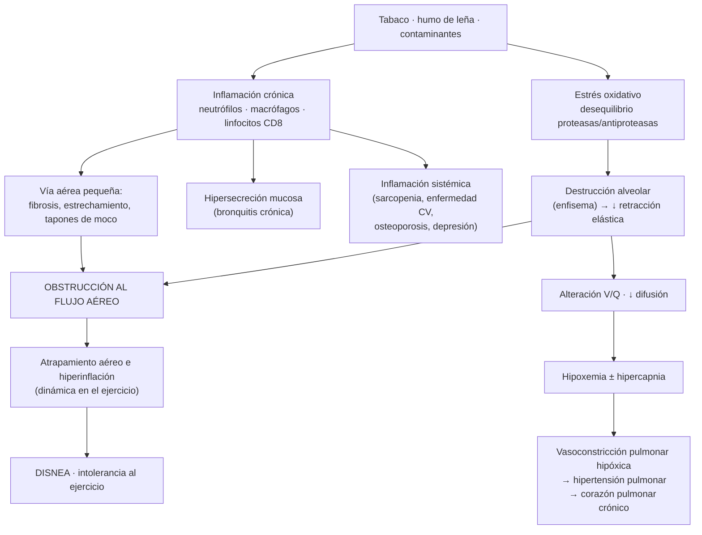
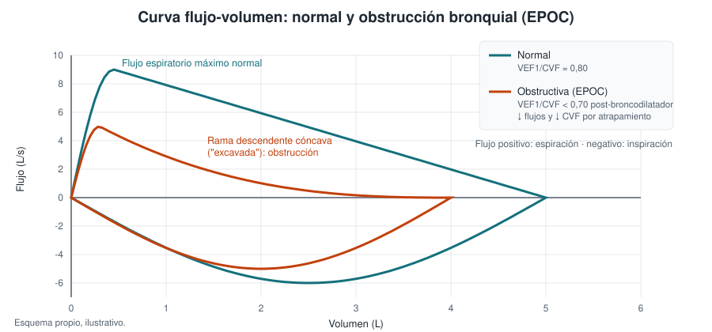
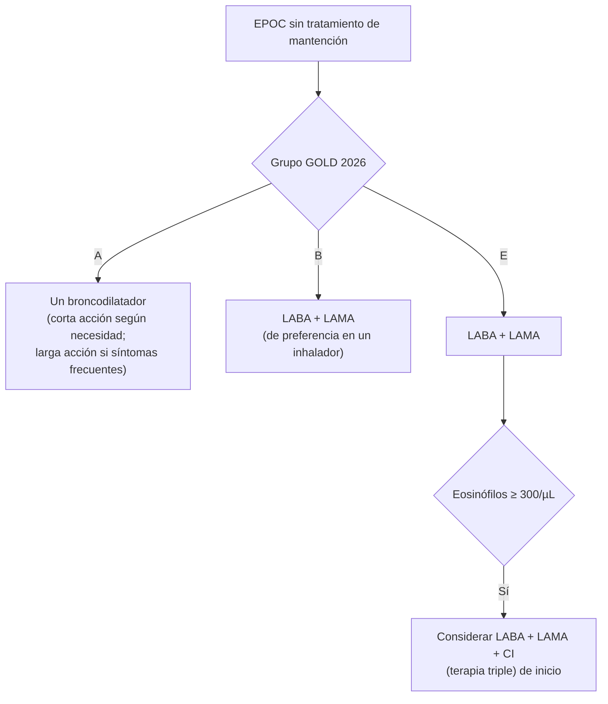
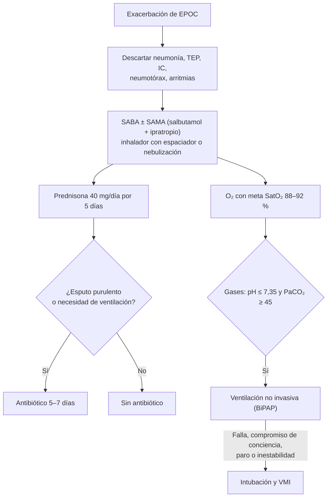

---
tags:
  - Respiratorio
  - GES
  - Frecuente en sala
  - Urgencia
---

# Enfermedad pulmonar obstructiva crónica (EPOC)

**Subespecialidad**
Enfermedades respiratorias

**Guía principal**
GOLD 2026 (Global Initiative for Chronic Obstructive Lung Disease, noviembre 2025)

**Otras fuentes**
Propuesta de Roma para exacerbaciones (2021) · ERS/ATS 2017 (manejo de exacerbaciones) · Guía GES MINSAL EPOC · Estudio PLATINO

**GES**
Sí: EPOC de tratamiento ambulatorio

**Revisado**
Septiembre 2026

!!! abstract "Resumen en 60 segundos"
    - Enfermedad pulmonar **heterogénea** con síntomas respiratorios crónicos (disnea, tos, expectoración) por alteración de la vía aérea y/o los alvéolos, con **obstrucción persistente**: **VEF1/CVF < 0,70 post-broncodilatador**.
    - Causa principal: **tabaco**; en Chile también el **humo de leña** (biomasa), sobre todo en el sur, y las secuelas de tuberculosis.
    - **GOLD 2026**: clasificación **ABE**. Basta **1 exacerbación moderada o grave** en el último año para ser **grupo E**.
    - Tratamiento inicial: **A**: un broncodilatador; **B y E**: **LABA + LAMA**. Agregar **corticoide inhalado (terapia triple)** si hay exacerbaciones y **eosinófilos ≥ 300** (considerar desde ≥ 100). **No usar LABA + corticoide inhalado** sin asma.
    - Lo que reduce mortalidad: **dejar de fumar**, **oxígeno domiciliario** en hipoxemia grave, **rehabilitación pulmonar** tras una exacerbación, **ventilación no invasiva** en hipercápnicos y terapia triple en pacientes seleccionados.
    - **Exacerbación**: broncodilatadores de acción corta, **prednisona 40 mg por 5 días**, **antibiótico** si hay esputo purulento, **O₂ con meta 88–92 %** y **VMNI** si hay acidosis respiratoria.

## Definición

!!! guia "Definición GOLD"
    La EPOC es una **enfermedad pulmonar heterogénea**, caracterizada por **síntomas respiratorios crónicos** (disnea, tos, expectoración, exacerbaciones) debidos a anomalías de las **vías aéreas** (bronquitis, bronquiolitis) y/o de los **alvéolos** (enfisema), que causan una **obstrucción persistente**, a menudo progresiva, del flujo aéreo.

    **Diagnóstico espirométrico**: **VEF1/CVF < 0,70 después de broncodilatador**, en un paciente con síntomas y/o exposición a factores de riesgo.

**Conceptos relacionados**

- **Bronquitis crónica** (definición clínica): tos con expectoración al menos **3 meses al año por 2 años consecutivos**. Puede existir con o sin obstrucción.
- **Enfisema** (definición anatómica): destrucción de las paredes alveolares con agrandamiento de los espacios aéreos distales al bronquiolo terminal.
- **Pre-EPOC**: síntomas o alteraciones estructurales o funcionales **sin obstrucción** (VEF1/CVF ≥ 0,70).
- **PRISm** (*preserved ratio impaired spirometry*): VEF1/CVF ≥ 0,70 con VEF1 < 80 %. Muchos evolucionan a EPOC.

## Epidemiología

### Mundial

- Afecta a **~ 10 % de los adultos ≥ 40 años** (cerca de 400 millones de personas).
- Es la **tercera o cuarta causa de muerte en el mundo** (~ 3,5 millones de muertes al año, GBD).
- **70–80 % no está diagnosticada**.
- Alrededor de la mitad de los casos en países de ingresos bajos y medios se relaciona con **exposición a biomasa y contaminación**, no con tabaco.

### Chile

!!! chile "Datos nacionales"
    - **Estudio PLATINO** (Santiago, ≥ 40 años, espirometría): prevalencia de **~ 15–17 %**, con **~ 87 % de subdiagnóstico**.
    - La prevalencia **autorreportada** en la ENS 2016–2017 fue de solo ~ 3 %, lo que refleja el subdiagnóstico.
    - **Tabaquismo**: ~ 33 % de la población (ENS 2016–2017), uno de los más altos de la región.
    - **Humo de leña**: combustible de calefacción y cocina muy usado en el **centro-sur y sur de Chile**; causa EPOC, sobre todo en **mujeres** no fumadoras.
    - Mortalidad: ~ **21 por 100.000 habitantes** (2019); es una de las principales causas de muerte en adultos mayores.
    - **GES**: garantiza el diagnóstico y tratamiento de la **EPOC de tratamiento ambulatorio**. Se maneja en la APS en el **Programa de Enfermedades Respiratorias del Adulto (ERA)**.
    - El GES de **cesación del consumo de tabaco** se incorporó en el decreto GES de diciembre de 2025.

## Etiología y factores de riesgo

GOLD propone clasificar la EPOC por su causa predominante (**etiotipos**):

| Etiotipo | Ejemplos |
|---|---|
| **Tabaco y cannabis** | La causa más frecuente; riesgo proporcional al índice paquete-año (IPA) |
| **Biomasa y contaminación** | **Humo de leña**, carbón, contaminación ambiental, exposición laboral (polvos, gases, humos) |
| **Genética** | **Déficit de alfa-1 antitripsina** (enfisema panlobulillar de predominio basal en jóvenes, con o sin daño hepático) |
| **Desarrollo pulmonar anormal** | Prematurez, bajo peso al nacer, infecciones respiratorias en la infancia |
| **Infecciones** | **Tuberculosis** (secuelas), VIH |
| **Asma** | Asma de larga evolución con remodelado |

**IPA (índice paquete-año)** = cigarrillos al día / 20 × años fumando. Un IPA ≥ 10–20 aumenta mucho el riesgo.

## Fisiopatología

*Figura 1. Fisiopatología de la EPOC. Esquema propio basado en GOLD 2026.*

## Clasificación

### Gravedad de la obstrucción (VEF1 post-broncodilatador, con VEF1/CVF < 0,70)

| GOLD | Gravedad | VEF1 (% del predicho) |
|---|---|---|
| **1** | Leve | **≥ 80 %** |
| **2** | Moderada | **50–79 %** |
| **3** | Grave | **30–49 %** |
| **4** | Muy grave | **< 30 %** |

### Síntomas

- **mMRC** (escala de disnea): **0** disnea solo con ejercicio intenso; **1** al caminar rápido o subir una pendiente; **2** camina más lento que personas de su edad o debe detenerse al caminar a su ritmo; **3** se detiene tras ~ 100 m o pocos minutos; **4** no sale de casa por disnea o disnea al vestirse.
- **CAAT** (antes CAT, 8 preguntas, 0–40 puntos): **≥ 10** indica síntomas importantes.

### Grupos ABE (GOLD 2026)

| Grupo | Exacerbaciones en el último año | Síntomas |
|---|---|---|
| **A** | **Ninguna** moderada o grave | mMRC 0–1 y CAAT < 10 |
| **B** | **Ninguna** moderada o grave | **mMRC ≥ 2 o CAAT ≥ 10** |
| **E** | **≥ 1 moderada o grave** (antes: ≥ 2 moderadas o ≥ 1 con hospitalización) | Cualquiera |

**Gravedad de las exacerbaciones**: **leve** (solo broncodilatadores de acción corta), **moderada** (requiere corticoides orales y/o antibióticos), **grave** (requiere hospitalización o consulta de urgencia).

## Clínica

- **Disnea** progresiva y persistente, peor con el ejercicio (el síntoma más incapacitante).
- **Tos crónica**, con o sin expectoración.
- **Sibilancias** y opresión torácica.
- **Exacerbaciones** recurrentes (sobre todo en invierno).
- **Examen físico** (en etapas avanzadas): tórax en tonel, **espiración prolongada**, murmullo pulmonar disminuido, sibilancias, uso de musculatura accesoria, respiración con labios fruncidos, posición de trípode, cianosis, baja de peso, **signos de corazón pulmonar** (ingurgitación yugular, edema, hepatomegalia, segundo ruido pulmonar aumentado).
- **Fenotipos clásicos** (útiles para el examen, poco usados hoy): "abotagado azul" (predominio de bronquitis crónica, hipoxemia, cor pulmonale) y "soplador rosado" (predominio de enfisema, delgado, disnea marcada).

!!! perla "Sospecha EPOC"
    Todo paciente **≥ 40 años** con **disnea, tos crónica o expectoración** y **exposición a tabaco, leña o polvos** debe tener una **espirometría**.

## Diagnóstico

<figure markdown>
{ loading=lazy }
<figcaption>Figura 2. Curva flujo-volumen normal y obstructiva. En la EPOC, la rama espiratoria es cóncava ("excavada") y el VEF1/CVF post-broncodilatador es < 0,70. Esquema propio.</figcaption>
</figure>

- **Espirometría con broncodilatador** (salbutamol 400 µg): **VEF1/CVF < 0,70** post-broncodilatador confirma la obstrucción persistente. Si el valor está cerca del límite, repetirla.
- La **respuesta al broncodilatador** no distingue EPOC de asma de forma confiable; una respuesta muy grande (> 400 mL en VEF1) orienta a asma.
- **Tamizaje de déficit de alfa-1 antitripsina** una vez en todo paciente con EPOC (sobre todo jóvenes o con enfisema basal).
- **Recuento de eosinófilos en sangre**: guía el uso de corticoides inhalados.
- **Oximetría** en reposo y, si es < 92 %, **gases arteriales**; evaluar desaturación con el ejercicio (test de marcha de 6 minutos).

## Laboratorio

- **Hemograma**: **eosinófilos** (≥ 300/µL predice buena respuesta a corticoides inhalados; < 100/µL, poca respuesta), **poliglobulia** (hipoxemia crónica) o anemia.
- **Gases arteriales**: hipoxemia, hipercapnia crónica (bicarbonato elevado por compensación).
- **Nivel de alfa-1 antitripsina**.
- **BNP o NT-proBNP** si se sospecha IC concomitante.
- **Cultivo de esputo** en exacerbaciones frecuentes, graves o con falla del antibiótico.

## Imágenes

- **Radiografía de tórax**: no diagnostica la EPOC, pero descarta otras causas. Hallazgos: **hiperinsuflación** (diafragmas aplanados, > 10 arcos costales posteriores, aumento del espacio retroesternal), hiperlucidez, bulas, corazón en gota, arterias pulmonares prominentes (hipertensión pulmonar).
- **TC de tórax**: enfisema (distribución y tipo), **bronquiectasias**, **tamizaje de cáncer pulmonar** en fumadores de alto riesgo (TC de baja dosis), candidatos a reducción de volumen.
- **Ecocardiograma**: hipertensión pulmonar, disfunción del VD (cor pulmonale), IC concomitante.

## Diagnóstico diferencial

| Enfermedad | Claves |
|---|---|
| **Asma** | Inicio en la infancia o juventud, atopia, síntomas variables, obstrucción **reversible**. Pueden coexistir |
| **IC** | Crépitos, ortopnea, cardiomegalia, BNP elevado, restricción en la espirometría |
| **Bronquiectasias** | Expectoración abundante y purulenta, infecciones recurrentes, TC con bronquios dilatados |
| **Tuberculosis** | Tos crónica, baja de peso, sudoración nocturna, lesiones apicales |
| **Bronquiolitis obliterante** | Trasplante, exposición a humo, artritis reumatoide; TC con atrapamiento aéreo en espiración |
| **Cáncer pulmonar** | Fumador con cambio en la tos, hemoptisis, baja de peso |
| **Obstrucción de vía aérea central** | Estridor, curva flujo-volumen aplanada |

## Tratamiento de la EPOC estable

### Medidas no farmacológicas

- **Dejar de fumar**: la intervención más importante (única, junto con el oxígeno, que cambia la historia natural). Consejería + **vareniclina**, **terapia de reemplazo de nicotina** o **bupropión**.
- **Evitar el humo de leña** y otros contaminantes.
- **Vacunas**: **influenza** anual, **neumococo**, **COVID-19**, **virus respiratorio sincicial (VRS)** en ≥ 60 años, dTpa y herpes zóster.
- **Rehabilitación pulmonar**: mejora disnea, capacidad de ejercicio y calidad de vida; **iniciada dentro de 4 semanas tras una hospitalización reduce la mortalidad y los reingresos**.
- **Actividad física** regular, **nutrición** (evitar desnutrición y sarcopenia), **educación** y plan de acción escrito.
- **Técnica inhalatoria**: revisarla en cada control (la causa más frecuente de "falla" del tratamiento).

### Tratamiento farmacológico inicial (sin tratamiento previo)

*Figura 3. Tratamiento farmacológico inicial de la EPOC. Esquema propio basado en GOLD 2026. LABA: agonista β2 de larga acción; LAMA: antimuscarínico de larga acción; CI: corticoide inhalado.*

!!! guia "Puntos clave GOLD 2026"
    - **LABA + LAMA** es el tratamiento inicial por defecto en los grupos **B y E**; la monoterapia queda como opción secundaria (costo, acceso, tolerancia).
    - **No se recomienda iniciar LABA + corticoide inhalado** en EPOC sin asma: previene menos las exacerbaciones y aumenta el riesgo de **neumonía**.
    - Cuando está indicado el corticoide inhalado, pasar directamente a **terapia triple** (LABA + LAMA + CI).
    - Medir los **eosinófilos 2–3 veces** en fase estable antes de indicar un corticoide inhalado (varían mucho).
    - Meta del tratamiento: **"baja actividad de la enfermedad"**, es decir, **cero exacerbaciones**. Una sola exacerbación moderada ya justifica escalar.

### Seguimiento: ajustar según el problema predominante

| Problema persistente | Conducta |
|---|---|
| **Disnea** con un broncodilatador | Pasar a **LABA + LAMA**; revisar técnica, comorbilidades (IC, anemia, obesidad, desacondicionamiento) y rehabilitación. **Ensifentrina** (nebulizada) es una opción adicional donde está disponible |
| **Exacerbaciones** con LABA + LAMA y **eosinófilos ≥ 100/µL** | Agregar **corticoide inhalado** (terapia triple) |
| Exacerbaciones con LABA + LAMA y eosinófilos < 100/µL | **Roflumilast** (VEF1 < 50 % y bronquitis crónica) o **azitromicina** 250 mg/día o 500 mg 3 veces por semana (sobre todo exfumadores; vigilar QT, audición y resistencia) |
| Exacerbaciones con terapia triple y **eosinófilos ≥ 300/µL** | **Biológicos**: **dupilumab** (con bronquitis crónica) o **mepolizumab** (evidencia A en poblaciones seleccionadas) |
| Neumonías recurrentes u otros efectos adversos con corticoide inhalado | **Retirar el corticoide inhalado** (sobre todo si eosinófilos < 100/µL) |

!!! dosis "Inhaladores más usados"
    | Clase | Ejemplos |
    |---|---|
    | **SABA** (agonista β2 de corta acción) | **Salbutamol** 100–200 µg c/4–6 h según necesidad |
    | **SAMA** (antimuscarínico de corta acción) | **Bromuro de ipratropio** 40–80 µg c/6–8 h |
    | **LABA** | Salmeterol, formoterol, indacaterol, olodaterol, vilanterol |
    | **LAMA** | **Tiotropio** 18 µg/día (polvo) o 5 µg/día (Respimat), umeclidinio, glicopirronio, aclidinio |
    | **LABA + LAMA** | Indacaterol/glicopirronio, vilanterol/umeclidinio, olodaterol/tiotropio, formoterol/aclidinio |
    | **Terapia triple** en un inhalador | Fluticasona furoato/umeclidinio/vilanterol, budesonida/glicopirronio/formoterol, beclometasona/formoterol/glicopirronio |

    Efectos adversos: taquicardia y temblor (β2-agonistas); sequedad bucal y retención urinaria (antimuscarínicos); **candidiasis oral, disfonía y neumonía** (corticoides inhalados).

### Oxigenoterapia domiciliaria y soporte ventilatorio

!!! guia "Oxígeno domiciliario (≥ 15 horas al día, reduce la mortalidad)"
    Indicado en reposo, con el paciente estable y con tratamiento óptimo, si:

    - **PaO₂ ≤ 55 mmHg** o **SaO₂ ≤ 88 %**, confirmado dos veces en 3 semanas.
    - **PaO₂ 55–60 mmHg** o SaO₂ 88 % con **hipertensión pulmonar**, **edema periférico** (IC derecha) o **poliglobulia** (hematocrito > 55 %).

    Meta: **SaO₂ ≥ 90 %** en reposo. Reevaluar a los 60–90 días.

- **Ventilación no invasiva domiciliaria**: en pacientes con **hipercapnia crónica grave** (PaCO₂ ≥ 52 mmHg) y hospitalizaciones recientes por insuficiencia respiratoria; reduce reingresos y mortalidad.
- **Intervenciones**: reducción de volumen pulmonar quirúrgica o endoscópica (válvulas) en enfisema heterogéneo de lóbulos superiores; **trasplante pulmonar** en enfermedad muy avanzada.
- **Cuidados paliativos**: disnea refractaria (opioides en dosis bajas), planificación anticipada.

## Exacerbación de la EPOC

**Definición**: empeoramiento agudo de la disnea y/o la tos y expectoración en **< 14 días**, con taquipnea y/o taquicardia, habitualmente asociado a inflamación local y sistémica por **infección** (virus o bacterias), **contaminación** u otra agresión.

**Causas**: **virus respiratorios** (rinovirus, influenza, VRS, SARS-CoV-2), **bacterias** (*H. influenzae*, *S. pneumoniae*, *M. catarrhalis*; *Pseudomonas* en EPOC grave), contaminación. **Descartar diagnósticos que la imitan**: **neumonía**, **TEP**, **IC descompensada**, **neumotórax**, **arritmias**, derrame pleural.

### Gravedad (propuesta de Roma, adoptada por GOLD)

| Gravedad | Criterios |
|---|---|
| **Leve** | Disnea EVA < 5, FR < 24, FC < 95, SatO₂ ≥ 92 % en reposo y PCR < 10 mg/L |
| **Moderada** | ≥ 3 de: **disnea EVA ≥ 5**, **FR ≥ 24/min**, **FC ≥ 95 lpm**, **SatO₂ < 92 %** (o caída > 3 %), **PCR ≥ 10 mg/L** (± hipoxemia o hipercapnia sin acidosis) |
| **Grave** | **Hipercapnia con acidosis**: **PaCO₂ > 45 mmHg y pH < 7,35** |

### Tratamiento

*Figura 4. Manejo de la exacerbación de la EPOC. Esquema propio basado en GOLD 2026.*

!!! dosis "Exacerbación: fármacos y soporte"
    - **Broncodilatadores**: **salbutamol** 4–8 puffs (100 µg) con espaciador o 2,5–5 mg nebulizado c/20 min × 3 y luego c/4–6 h, **+ ipratropio** 4–8 puffs o 0,5 mg nebulizado c/6–8 h. Nebulizar con aire comprimido (no con O₂ a alto flujo) en hipercápnicos.
    - **Corticoides sistémicos**: **prednisona 40 mg/día por 5 días** (estudio REDUCE). Aceleran la recuperación y reducen la falla del tratamiento; los **eosinófilos bajos** (< 100–300) predicen menor beneficio.
    - **Antibióticos** si hay **aumento de la purulencia del esputo** más aumento de la disnea o del volumen del esputo (criterios de **Anthonisen**), o si requiere ventilación: **amoxicilina/ácido clavulánico**, **macrólido** o **doxiciclina**; en EPOC grave o con factores de riesgo de *Pseudomonas*, cubrirla (levofloxacino o ciprofloxacino, o betalactámico antipseudomónico en hospitalizados). Duración **5–7 días**.
    - **Oxígeno**: meta **SatO₂ 88–92 %** (hiperoxia → hipercapnia por alteración V/Q y efecto Haldane). Controlar gases a los 30–60 min.
    - **Cánula nasal de alto flujo**: en hipoxemia sin acidosis grave o con intolerancia a la VMNI.
    - **VMNI** (BiPAP): **pH ≤ 7,35 y PaCO₂ ≥ 45 mmHg**, o disnea grave con fatiga muscular. **Reduce la intubación y la mortalidad**.
    - **Intubación**: falla o intolerancia de la VMNI, paro respiratorio, compromiso de conciencia, aspiración, inestabilidad hemodinámica, arritmias graves.
    - **Profilaxis de ETV** en hospitalizados.

**Criterios de hospitalización**: síntomas graves (disnea de reposo, taquipnea, desaturación, confusión), insuficiencia respiratoria aguda, signos nuevos (cianosis, edema), falla del tratamiento inicial, comorbilidades graves (IC, arritmias), apoyo domiciliario insuficiente.

**Al alta**: revisar la técnica inhalatoria, **optimizar el tratamiento de mantención** (la exacerbación lo pasa al grupo E), plan de acción, derivar a **rehabilitación pulmonar dentro de 4 semanas**, vacunas y **control en 1–4 semanas**.

## Complicaciones

- **Insuficiencia respiratoria** aguda o crónica (hipoxemia ± hipercapnia).
- **Hipertensión pulmonar y corazón pulmonar crónico**: IC derecha por hipoxemia crónica. Clínica: ingurgitación yugular, edema, hepatomegalia, segundo ruido pulmonar aumentado. ECG: desviación del eje a derecha, P pulmonar, bloqueo de rama derecha. Tratamiento: **oxígeno** (la medida principal), diuréticos para la congestión, tratar la EPOC.
- **Poliglobulia secundaria**.
- **Neumotórax** (rotura de bulas).
- **Cáncer pulmonar** (riesgo muy aumentado).
- **Enfermedad cardiovascular** (cardiopatía coronaria, IC, FA), **osteoporosis**, **sarcopenia** y desnutrición, **ansiedad y depresión**, reflujo, apnea del sueño.
- **Bronquiectasias** asociadas.

## Pronóstico y seguimiento

- Las **exacerbaciones**, sobre todo las hospitalizadas, aceleran la caída de la función pulmonar y aumentan la mortalidad (~ 25 % al año después de una hospitalización).
- Índices pronósticos: **BODE** (IMC, obstrucción, disnea y capacidad de ejercicio) y ADO.
- **Intervenciones que reducen la mortalidad**: cese del tabaco, oxígeno domiciliario (hipoxemia grave), VMNI domiciliaria (hipercapnia), rehabilitación pulmonar precoz post-exacerbación, terapia triple en pacientes con exacerbaciones, cirugía de reducción de volumen en seleccionados.
- **Control**: síntomas (mMRC, CAAT), exacerbaciones, **técnica inhalatoria** y adherencia, tabaquismo, espirometría anual, oximetría, eosinófilos, comorbilidades.

## Perlas para el internado

!!! perla "Para la sala y el turno"
    - En el paciente con EPOC hipercápnico, la meta de saturación es **88–92 %**: el **oxígeno en exceso empeora la hipercapnia** y puede llevar a narcosis.
    - Pide **gases arteriales** a toda exacerbación que requiera hospitalización; el **pH** decide la VMNI, no la PaCO₂ sola.
    - La **prednisona por 5 días** es suficiente; no hace falta disminuir la dosis gradualmente.
    - Antes de "subir" inhaladores, **revisa la técnica** con el paciente.
    - Una **exacerbación que no mejora** puede ser un **TEP**, una **IC** o una **neumonía**: pide imágenes y exámenes dirigidos.
    - Los **betabloqueadores cardioselectivos** (bisoprolol, metoprolol) **no están contraindicados** en la EPOC si tienen indicación (IC, cardiopatía coronaria).
    - Evita los **sedantes** (benzodiazepinas, opioides en dosis altas) en hipercápnicos.
    - Todo paciente con EPOC hospitalizado debe salir con indicación de **rehabilitación pulmonar**, **vacunas** y **cese del tabaco**.

## Preguntas de repaso

??? repaso "1. Hombre de 62 años, fumador de 40 paquetes-año, con disnea mMRC 2, sin exacerbaciones. Espirometría: VEF1/CVF 0,58 y VEF1 62 % post-broncodilatador. ¿Cómo lo clasificas y qué tratamiento indicas?"
    **EPOC GOLD 2** (obstrucción moderada), **grupo B** (sin exacerbaciones, mMRC ≥ 2). Tratamiento: **LABA + LAMA**, cese del tabaco con apoyo farmacológico, vacunas, rehabilitación pulmonar y SABA de rescate.

??? repaso "2. Paciente con EPOC en tratamiento con LABA + LAMA que tuvo una exacerbación tratada con prednisona el último año. Eosinófilos de 350/µL. ¿Qué agregas?"
    Tiene exacerbaciones pese a LABA + LAMA y eosinófilos ≥ 100 (≥ 300 predice mejor respuesta): **agregar corticoide inhalado (terapia triple)**, idealmente en un solo inhalador, además de revisar la técnica y la adherencia.

??? repaso "3. Paciente con exacerbación de EPOC: FR 28/min, SatO₂ 86 %, gases con pH 7,29, PaCO₂ 68 mmHg. ¿Cuál es el manejo ventilatorio?"
    **Acidosis respiratoria**: indicación de **ventilación no invasiva (BiPAP)**, además de O₂ titulado a **SatO₂ 88–92 %**, broncodilatadores, prednisona y antibiótico. Si falla la VMNI o hay compromiso de conciencia, **intubación**.

??? repaso "4. ¿Cuándo indicas oxígeno domiciliario en la EPOC?"
    En reposo, estable y con tratamiento óptimo: **PaO₂ ≤ 55 mmHg o SaO₂ ≤ 88 %**, o **PaO₂ 55–60 mmHg** con **hipertensión pulmonar, edema periférico o hematocrito > 55 %**. Uso **≥ 15 horas al día** (reduce la mortalidad).

??? repaso "5. ¿Qué criterios indican antibiótico en una exacerbación de EPOC?"
    **Aumento de la purulencia del esputo** más aumento de la disnea o del volumen del esputo (Anthonisen), o necesidad de **ventilación mecánica** (invasiva o no invasiva). Duración 5–7 días.

## Referencias

1. Global Initiative for Chronic Obstructive Lung Disease. *Global Strategy for the Prevention, Diagnosis and Management of COPD: 2026 Report.* [goldcopd.org](https://goldcopd.org/2026-gold-report-and-pocket-guide/)
2. Global Initiative for Chronic Obstructive Lung Disease. *GOLD Report 2026: Key Changes Summary.* Noviembre 2025. [PDF](https://goldcopd.org/wp-content/uploads/2025/11/KEY-CHANGES-GOLD-2026-10Nov2025.pdf)
3. Celli BR, et al. An Updated Definition and Severity Classification of Chronic Obstructive Pulmonary Disease Exacerbations: The Rome Proposal. *Am J Respir Crit Care Med.* 2021;204:1251–1258.
4. Wedzicha JA, et al. Management of COPD exacerbations: a European Respiratory Society/American Thoracic Society guideline. *Eur Respir J.* 2017;49:1600791.
5. Leuppi JD, et al. Short-term vs conventional glucocorticoid therapy in acute exacerbations of chronic obstructive pulmonary disease (REDUCE). *JAMA.* 2013;309:2223–2231.
6. Menezes AMB, et al. Chronic obstructive pulmonary disease in five Latin American cities (the PLATINO study): a prevalence study. *Lancet.* 2005;366:1875–1881.
7. Ministerio de Salud de Chile. *Guía Clínica GES: Enfermedad pulmonar obstructiva crónica de tratamiento ambulatorio.*
8. Prevalencia y tratamiento de la enfermedad pulmonar obstructiva crónica en adultos: análisis de datos de la Encuesta Nacional de Salud de Chile. *Rev Chil Enferm Respir.* 2024. [SciELO](https://www.scielo.cl/scielo.php?script=sci_arttext&pid=S0717-73482024000400234)
