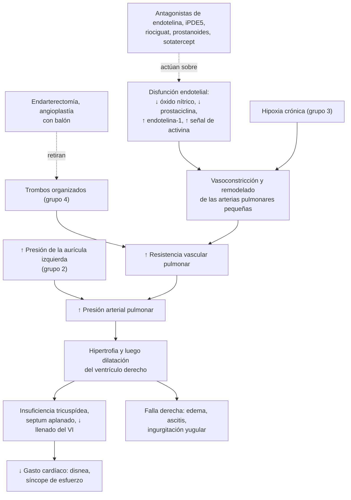
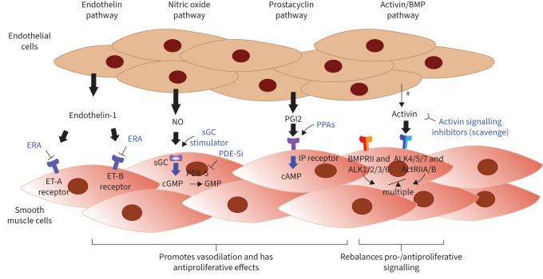
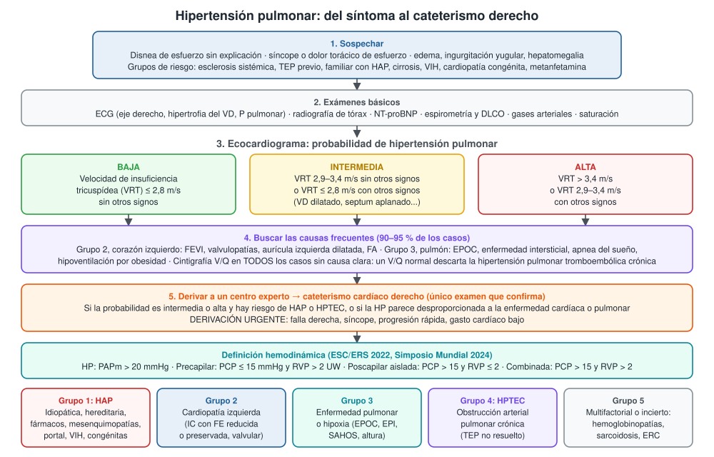
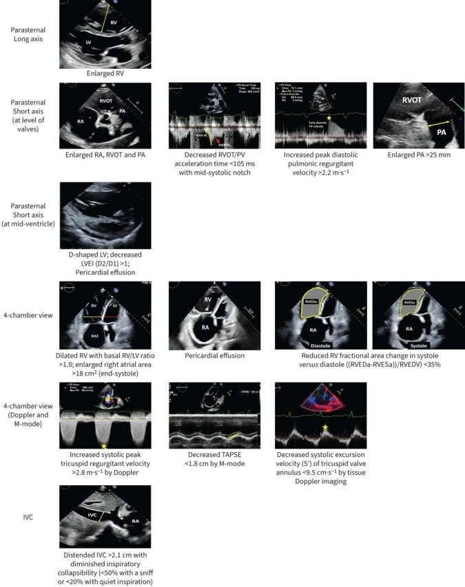

---
tags:
  - Respiratorio
  - Cardiología
---

# Hipertensión pulmonar

**Subespecialidad**
Broncopulmonar · Cardiología · Centros de hipertensión pulmonar

**Guías principales**
ESC/ERS 2022: diagnóstico y tratamiento de la hipertensión pulmonar · 7.º Simposio Mundial de Hipertensión Pulmonar (2024): definición, clasificación y algoritmo de tratamiento · ERS 2026: actualización del tratamiento de la HAP (sotatercept)

**Otras fuentes**
STELLAR (2023), ZENITH y HYPERION (2025) con sotatercept · INCREASE (treprostinil inhalado en HP por enfermedad intersticial, 2021) · Metaanálisis LATAM-PAH (2026) · Registro chileno de angioplastía pulmonar con balón (2021)

**GES**
No. La **hipertensión arterial pulmonar del grupo 1** tiene cobertura de la **Ley Ricarte Soto**: cateterismo cardíaco para confirmar e **iloprost inhalado, ambrisentán o bosentán**.

**EUNACOM**
1.05.1.021 Hipertensión pulmonar (específico, inicial, derivar)

**Revisado**
Octubre 2026

!!! abstract "Resumen en 60 segundos"
    - **Hipertensión pulmonar (HP)**: **presión arterial pulmonar media > 20 mmHg** medida por **cateterismo cardíaco derecho** (umbral bajado desde 25 mmHg en 2022).
    - Afecta a ~ **1 % de la población**. El **90–95 %** se debe a **cardiopatía izquierda** (grupo 2) o **enfermedad pulmonar o hipoxia** (grupo 3).
    - **Hipertensión arterial pulmonar (HAP, grupo 1)**: rara (~ 4 por 100.000). Afecta a **mujeres jóvenes** y se asocia a esclerosis sistémica, fármacos, VIH, hipertensión portal y cardiopatías congénitas.
    - **Clínica**: **disnea de esfuerzo** inexplicada y progresiva. Tardíamente: **síncope de esfuerzo**, angina y **falla derecha**.
    - **Examen de tamizaje**: **ecocardiograma** (velocidad de insuficiencia tricuspídea > 2,8 m/s y signos de sobrecarga del VD). Siempre buscar la causa: corazón izquierdo, pulmón y **cintigrafía V/Q** (HP tromboembólica crónica).
    - **Tratamiento según el grupo**:
        - **Grupos 2 y 3**: tratar la enfermedad de base y dar oxígeno si hay hipoxemia. Los vasodilatadores pulmonares **no** están indicados.
        - **Grupo 1 (HAP)**: centro experto. **Terapia combinada inicial** (antagonista de endotelina + inhibidor de PDE5); **prostaciclina parenteral** si el riesgo es alto; **sotatercept** si no se alcanza el bajo riesgo.
        - **Grupo 4 (HPTEC)**: **anticoagulación de por vida** y **endarterectomía pulmonar** (potencialmente curativa).
    - **Contraindicado** el **embarazo** en la HAP: mortalidad materna muy alta.

## Definición

- **Hipertensión pulmonar** (ESC/ERS 2022; Simposio Mundial 2024): **presión arterial pulmonar media (PAPm) > 20 mmHg** en reposo, medida por **cateterismo cardíaco derecho**.
- **Perfiles hemodinámicos**:

| Perfil | PCP (presión de enclavamiento) | RVP (resistencia vascular pulmonar) | Ejemplos |
|---|---|---|---|
| **Precapilar** | **≤ 15 mmHg** | **> 2 UW** | Grupos 1, 3, 4 y 5 |
| **Poscapilar aislada** | **> 15 mmHg** | ≤ 2 UW | Grupo 2 |
| **Poscapilar combinada** (pre y poscapilar) | > 15 mmHg | > 2 UW | Grupo 2 avanzado |

- **HP de ejercicio**: PAPm normal en reposo, con un aumento anormal durante el esfuerzo (pendiente PAPm/gasto cardíaco > 3 mmHg/L/min).
- **Hipertensión arterial pulmonar (HAP)**: HP **precapilar** del grupo 1, sin enfermedad pulmonar, cardíaca izquierda ni tromboembólica que la explique. Es una enfermedad de las **arterias pulmonares pequeñas**.
- **Hipertensión pulmonar tromboembólica crónica (HPTEC)**: HP precapilar con obstrucción de las arterias pulmonares por **trombos organizados**, persistente tras **≥ 3 meses de anticoagulación**.
- **UW** (unidades Wood) = mmHg/L/min; 1 UW = 80 dyn·s·cm⁻⁵.

## Epidemiología

### Mundial

- La HP afecta a ~ **1 %** de la población mundial (Simposio Mundial 2024) y es más frecuente en los mayores de 65 años.
- **Grupos 2 y 3** explican el **90–95 %** de los casos.
- **HAP** confirmada por cateterismo: prevalencia media de **3,7 por 100.000** habitantes.
- La HAP es hoy más frecuente que antes en **adultos mayores con comorbilidades** (obesidad, diabetes, HTA, cardiopatía coronaria).
- **HPTEC**: incidencia de **5–6 por millón** al año, que sube a **13 por millón** cuando se sigue sistemáticamente a los pacientes después de un TEP.
- **HAP idiopática sin tratamiento** (registro de los NIH, década de 1980): mediana de supervivencia de **2,8 años**. Con los tratamientos actuales, la mayoría sobrevive más de 5 años.

### Chile

!!! chile "Datos nacionales"
    - **Metaanálisis LATAM-PAH** (2026; 16 estudios de 8 países, 2.553 pacientes con HAP confirmada):
        - Edad media **44 años** y **82 % mujeres** (más jóvenes que en los registros europeos).
        - Causas: **idiopática 40 %**, **cardiopatías congénitas 26 %** y **mesenquimopatías 21 %**.
        - Al diagnóstico, el **51 %** estaba en clase funcional III–IV; en **Chile** y Argentina, **> 60 %**.
        - Test de marcha promedio de **406 m** (**363 m** en las series chilenas).
        - Tratamiento: **monoterapia 56 %** y terapia doble 33 %.
        - Supervivencia: **94 % a 1 año** y **83 % a 3 años**.
    - **Ley Ricarte Soto** (HAP del grupo 1):
        - Garantiza el **cateterismo cardíaco** de confirmación.
        - Cubre **iloprost inhalado**, **ambrisentán** o **bosentán**, sin costo para el beneficiario.
        - La solicitud la hace un **broncopulmonar o cardiólogo** en la plataforma de Fonasa.
    - **Trabajo en altura**: en 120 mineros chilenos que trabajaban por turnos a **4.400–4.800 m** durante más de 5 años, el **9 %** tenía hipertensión pulmonar de altura en el ecocardiograma (Brito 2018). La minería en gran altura es una causa del **grupo 3** propia de Chile.
    - **HPTEC**: un registro chileno de **angioplastía pulmonar con balón** (22 pacientes inoperables, 2016–2019) mostró:
        - PAPm **17 % menor** después del procedimiento.
        - Test de marcha **135 m mejor**.
        - **Sin mortalidad** asociada al procedimiento.

## Etiología y factores de riesgo

**Clasificación clínica** (Simposio Mundial 2024):

| Grupo | Causas | Comentario |
|---|---|---|
| **1. Hipertensión arterial pulmonar** | **Idiopática**, **hereditaria** (BMPR2), **fármacos y tóxicos**, **mesenquimopatías** (sobre todo **esclerosis sistémica**), **hipertensión portal** (portopulmonar), **VIH**, **cardiopatías congénitas** (Eisenmenger), esquistosomiasis | Incluye a los **respondedores a largo plazo a los bloqueadores de calcio** |
| **2. Cardiopatía izquierda** | **Insuficiencia cardíaca** con FE reducida o **preservada**, **valvulopatías** (mitral, aórtica), cardiopatías congénitas poscapilares | **La causa más frecuente** |
| **3. Enfermedad pulmonar o hipoxia** | **EPOC**, enfisema, **enfermedad intersticial**, enfisema + fibrosis, **apnea del sueño**, **hipoventilación por obesidad**, **altura** | La segunda causa |
| **4. Obstrucción arterial pulmonar** | **HPTEC**; tumores (sarcoma de la arteria pulmonar), arteritis | Potencialmente **curable** |
| **5. Mecanismo multifactorial o incierto** | Hemoglobinopatías (anemia falciforme), **sarcoidosis**, mieloproliferativos, **ERC en diálisis**, cardiopatías congénitas complejas | |

- **Fármacos y tóxicos con asociación definida con HAP**: anorexígenos (aminorex, fenfluramina, benfluorex), **metanfetamina**, **dasatinib**, aceite de colza tóxico y, desde 2024, **mitomicina C** y **carfilzomib**.
- **Factores de riesgo de HPTEC**: **TEP** previo (sobre todo recurrente, grande o no provocado), **síndrome antifosfolípidos**, esplenectomía, catéteres o marcapasos infectados, cáncer, enfermedad inflamatoria intestinal.

## Fisiopatología

- **HAP (grupo 1)**:
    1. **Disfunción endotelial**: falta de vasodilatadores (**óxido nítrico**, **prostaciclina**) y exceso de vasoconstrictores (**endotelina-1**).
    2. **Remodelado vascular**: proliferación de músculo liso y endotelio, fibrosis de la íntima, lesiones plexiformes, trombosis in situ. Participa el desequilibrio de la vía **activina/BMP** (blanco del sotatercept).
    3. La **RVP sube**: el **ventrículo derecho** (VD), de pared delgada, se hipertrofia y luego se **dilata**.
    4. **Falla del VD**: insuficiencia tricuspídea, bajo gasto, congestión sistémica. El VD dilatado **comprime al VI** (septum aplanado, "VI en forma de D").
    5. **Isquemia del VD** y arritmias: **síncope** y **muerte súbita**.
- **Grupo 2**: la presión elevada de la aurícula izquierda se transmite hacia atrás (poscapilar). Con el tiempo puede agregarse un componente precapilar (combinado).
- **Grupo 3**: **vasoconstricción pulmonar hipóxica** y destrucción del lecho capilar (enfisema, fibrosis).
- **Grupo 4**: obstrucción mecánica por trombos organizados + vasculopatía de los vasos pequeños no obstruidos.
- **Muere el ventrículo derecho, no el pulmón**: el pronóstico depende de la función del VD.

*Figura 1. Fisiopatología de la hipertensión pulmonar y puntos de acción del tratamiento. Esquema propio basado en la guía ESC/ERS 2022 y el Simposio Mundial 2024.*

<figure markdown>
{ loading=lazy }
<figcaption>Figura 2. Las cuatro vías de tratamiento de la HAP. Vía de la endotelina: antagonistas del receptor de endotelina (ERA). Vía del óxido nítrico: inhibidores de la fosfodiesterasa 5 (PDE-5i) y estimuladores de la guanilato ciclasa soluble (sGC). Vía de la prostaciclina: análogos y agonistas del receptor IP (PPA). Vía de la activina/BMP: inhibidores de la señal de activina (sotatercept). Tomada de Chin KM, Gaine SP, Gerges C, et al. <em>Treatment algorithm for pulmonary arterial hypertension.</em> Eur Respir J. 2024;64(4):2401325 (figura 2). Licencia CC BY-NC 4.0.</figcaption>
</figure>

## Clasificación

**Clase funcional de la OMS** (adaptada de la NYHA):

| Clase | Descripción |
|---|---|
| **I** | Sin limitación de la actividad física habitual |
| **II** | Limitación leve: la actividad habitual produce disnea, fatiga, dolor torácico o presíncope |
| **III** | Limitación marcada: actividades menores que las habituales producen síntomas |
| **IV** | Síntomas con cualquier actividad o en reposo; **signos de falla derecha** o **síncope** |

**Estratificación de riesgo en el seguimiento de la HAP** (ESC/ERS 2022, modelo de 4 estratos; mortalidad estimada a 1 año):

| Variable | Riesgo bajo | Intermedio-bajo | Intermedio-alto | Alto |
|---|---|---|---|---|
| **Clase funcional OMS** | I–II | — | III | IV |
| **Test de marcha de 6 min** | > 440 m | 320–440 m | 165–319 m | < 165 m |
| **NT-proBNP** (ng/L) | < 300 | 300–649 | 650–1.100 | > 1.100 |
| **Mortalidad a 1 año** | 0–3 % | 2–7 % | 9–19 % | 20 % o más |

- En el **diagnóstico** se usa un modelo de **3 estratos** (bajo < 5 %, intermedio 5–20 %, alto > 20 % de mortalidad al año), que incluye además ecocardiograma, hemodinamia y signos clínicos.
- **Objetivo del tratamiento**: alcanzar y mantener el **riesgo bajo**.

## Clínica

- **Síntomas** (inespecíficos; por eso el diagnóstico suele retrasarse):
    - **Disnea de esfuerzo** progresiva: el síntoma principal.
    - **Fatiga**, debilidad.
    - **Dolor torácico** de esfuerzo (isquemia del VD).
    - **Síncope o presíncope de esfuerzo**: signo de **gravedad** (gasto cardíaco fijo).
    - **Hemoptisis** (rara; en HAP congénita y HPTEC).
    - Disfonía por compresión del nervio laríngeo recurrente por la arteria pulmonar dilatada (síndrome de Ortner).
- **Examen físico**:
    - **Segundo ruido pulmonar aumentado** (P2 fuerte).
    - **Soplo de insuficiencia tricuspídea** (aumenta en inspiración), latido paraesternal izquierdo del VD.
    - **Falla derecha**: **ingurgitación yugular**, **hepatomegalia**, **ascitis**, **edema** de extremidades inferiores.
    - Cianosis (cortocircuito derecha-izquierda, hipoxemia grave).
- **Pistas de la causa**:
    - **Esclerodactilia, Raynaud, telangiectasias** → esclerosis sistémica.
    - **Estigmas de daño hepático crónico** → portopulmonar.
    - **Hipocratismo** → cardiopatía congénita cianótica, enfermedad intersticial.
    - **Crépitos** → intersticial; **sibilancias**, tórax en tonel → EPOC.
    - **Obesidad**, ronquido, somnolencia → apnea del sueño, hipoventilación.
    - **TEP previo** o trombosis venosa profunda → HPTEC.

## Diagnóstico

!!! guia "Diagnóstico escalonado (ESC/ERS 2022; Simposio Mundial 2024)"
    1. **Sospecha clínica**: síntomas o grupo de riesgo.
    2. **Exámenes básicos**: ECG, radiografía de tórax, **NT-proBNP**, espirometría con DLCO, gases arteriales.
    3. **Ecocardiograma**: define la **probabilidad** de HP. Estudio de corazón izquierdo y pulmón (TC de tórax).
    4. **Cintigrafía de ventilación/perfusión (V/Q)** en toda HP sin causa clara: un V/Q **normal descarta la HPTEC**.
    5. **Derivar a un centro experto** para el **cateterismo cardíaco derecho** si la probabilidad es intermedia o alta y se sospecha HAP o HPTEC.
        - **Derivación urgente** si hay signos de falla derecha, síncope o progresión rápida.

**Probabilidad ecocardiográfica**:

| Velocidad máxima de insuficiencia tricuspídea (VRT) | Otros signos de HP | Probabilidad |
|---|---|---|
| **≤ 2,8 m/s** o no medible | No | **Baja** |
| ≤ 2,8 m/s | Sí | Intermedia |
| **2,9–3,4 m/s** | No | Intermedia |
| 2,9–3,4 m/s | Sí | **Alta** |
| **> 3,4 m/s** | No necesarios | **Alta** |

- **Otros signos de HP en el ecocardiograma**: VD dilatado (relación VD/VI > 1), **septum aplanado** (VI en "D"), **TAPSE < 1,8 cm**, arteria pulmonar > 25 mm, vena cava inferior dilatada que no colapsa, derrame pericárdico.
- **Cateterismo cardíaco derecho**: confirma el diagnóstico, distingue precapilar de poscapilar y da el pronóstico.
    - En la HAP **idiopática, hereditaria o por fármacos**: **test de vasorreactividad** (óxido nítrico inhalado). Es **positivo** si la PAPm baja **≥ 10 mmHg** hasta **< 40 mmHg** sin caída del gasto cardíaco.
- **Tamizaje en grupos de riesgo**:
    - **Esclerosis sistémica**: evaluación **anual** (ecocardiograma, DLCO, NT-proBNP; algoritmo DETECT).
    - **Candidatos a trasplante hepático**: ecocardiograma (portopulmonar).
    - **Familiares de HAP hereditaria**.
    - **Pacientes con TEP** que siguen con disnea a los **3 meses**.

<figure markdown>
{ loading=lazy }
<figcaption>Figura 3. Enfoque diagnóstico de la hipertensión pulmonar. Esquema propio basado en la guía ESC/ERS 2022 y en el 7.º Simposio Mundial de Hipertensión Pulmonar (Kovacs 2024).</figcaption>
</figure>

## Laboratorio

| Examen | Interpretación |
|---|---|
| **NT-proBNP / BNP** | Elevado por sobrecarga del VD; **estratifica el riesgo** y sigue la respuesta. Normal no descarta HP leve |
| **Gases arteriales** | Hipoxemia; **hipocapnia** en la HAP (hiperventilación). **Hipercapnia** → hipoventilación (obesidad, neuromuscular, EPOC) |
| **Espirometría, volúmenes y DLCO** | Enfermedad pulmonar (grupo 3). En la HAP la espirometría es casi normal con **DLCO baja**; una DLCO **muy baja** (< 45 %) sugiere enfermedad venooclusiva, esclerosis sistémica o enfisema/fibrosis |
| **Hemograma, ferritina, saturación de transferrina** | **Ferropenia** (frecuente; empeora la capacidad de ejercicio); policitemia por hipoxemia |
| **Pruebas hepáticas** | Hipertensión portal; congestión hepática; control de los antagonistas de endotelina |
| **Función renal, electrolitos** | Uso de diuréticos |
| **TSH** | Hipo e hipertiroidismo empeoran la HP |
| **ANA, anticentrómero, anti-Scl-70**, anti-RNP | Mesenquimopatías |
| **VIH, serología de hepatitis B y C** | HAP asociada |
| **Anticoagulante lúpico, anticardiolipinas, anti-β2-glicoproteína I** | **Síndrome antifosfolípidos** en la HPTEC |
| **Drogas en orina** | En la HAP "idiopática": **metanfetamina** |
| **Oximetría nocturna o polisomnografía** | Apnea del sueño, hipoventilación |

## Imágenes

- **ECG**: **desviación del eje a la derecha**, **hipertrofia del VD** (R alta en V1), sobrecarga del VD (T negativas en V1–V4), **P pulmonar** (P > 2,5 mm en DII), bloqueo de rama derecha. Un ECG **normal no descarta** la HP.
- **Radiografía de tórax**: **arterias pulmonares centrales prominentes** con "poda" periférica, crecimiento del VD (ocupa el espacio retroesternal en la lateral), signos de la causa (enfisema, fibrosis, congestión).
- **Ecocardiograma transtorácico**: examen de tamizaje; estima la presión sistólica pulmonar, evalúa el VD y busca cardiopatía izquierda, valvulopatías y cortocircuitos (ecocardiograma con burbujas).
- **Cintigrafía V/Q**: **el mejor examen para descartar HPTEC** (más sensible que el angio-TC). Defectos de perfusión segmentarios con ventilación normal.
- **Angio-TC de tórax**: trombos crónicos (excéntricos, bandas, redes), arteria pulmonar dilatada (más ancha que la aorta), parénquima (enfisema, fibrosis), mosaico de perfusión.
- **TC de alta resolución**: enfermedad intersticial; nódulos centrolobulillares y septos engrosados en la **enfermedad venooclusiva**.
- **Resonancia cardíaca**: volumen y función del VD; pronóstico.
- **Angiografía pulmonar**: confirma la HPTEC y define si es operable.

<figure markdown>
{ loading=lazy }
<figcaption>Figura 4. Principales signos de hipertensión pulmonar en el ecocardiograma: VD, AD y arteria pulmonar dilatados; tiempo de aceleración pulmonar &lt; 105 ms; VI en "D" (índice de excentricidad &gt; 1); derrame pericárdico; relación VD/VI &gt; 1; velocidad de insuficiencia tricuspídea &gt; 2,8 m/s; TAPSE &lt; 1,8 cm; onda S' tricuspídea &lt; 9,5 cm/s; vena cava inferior &gt; 2,1 cm con colapso inspiratorio reducido. Tomada de Kovacs G, Bartolome S, Denton CP, et al. <em>Definition, classification and diagnosis of pulmonary hypertension.</em> Eur Respir J. 2024;64(4):2401324 (figura 2). Licencia CC BY-NC 4.0.</figcaption>
</figure>

## Diagnóstico diferencial

| Diagnóstico | Diferencias |
|---|---|
| **Insuficiencia cardíaca izquierda** | Ortopnea, DPN, crépitos, FEVI baja o disfunción diastólica, aurícula izquierda dilatada; PCP > 15 mmHg (grupo 2) |
| **EPOC y enfermedad intersticial** | Obstrucción o restricción importante, hipoxemia; la HP suele ser leve (grupo 3) |
| **TEP agudo** | Inicio brusco; VD dilatado sin hipertrofia (el VD "sano" no genera PAP sistólica > 60 mmHg) |
| **Estenosis mitral** | Soplo diastólico, chasquido de apertura, AI muy grande |
| **Cardiopatías congénitas** (CIA, CIV, ductus) | Soplo, cortocircuito en el ecocardiograma con burbujas; Eisenmenger: cianosis e hipocratismo |
| **Pericarditis constrictiva** | Signo de Kussmaul, calcificación pericárdica, fisiología de interdependencia |
| **Enfermedad coronaria** | Angina típica, alteraciones del VI; la angina de la HP se debe a isquemia del VD |
| **Anemia, desacondicionamiento, obesidad** | Disnea sin signos de sobrecarga del VD |

## Tratamiento

### Medidas generales (todos los grupos)

- **Tratar la causa**: optimizar la insuficiencia cardíaca y las valvulopatías (grupo 2), la EPOC, la enfermedad intersticial y la apnea del sueño (grupo 3).
- **Oxígeno** si la **PaO₂ < 60 mmHg** (SatO₂ < 90 %) en reposo; considerarlo en el esfuerzo y en vuelos en avión.
- **Diuréticos** (furosemida, espironolactona) si hay falla derecha con congestión.
- **Ferropenia**: corregirla (hierro EV si no se absorbe por vía oral).
- **Rehabilitación supervisada** en pacientes estables. Evitar el esfuerzo intenso que provoca síntomas.
- **Vacunas**: influenza, neumococo y COVID-19.
- **Evitar el embarazo** en la HAP (mortalidad materna alta): **anticoncepción eficaz**; los antagonistas de endotelina son **teratogénicos**.
- **Oxígeno en los vuelos en avión y en la altura** si hay hipoxemia.
- **Apoyo psicosocial** y cuidados paliativos en la etapa avanzada.

### Hipertensión arterial pulmonar (grupo 1): centro experto

!!! dosis "Fármacos de la HAP (los indica el especialista)"
    | Vía | Fármaco | Dosis habitual | Efectos adversos |
    |---|---|---|---|
    | **Bloqueadores de calcio** (solo **vasorreactivos**, ~ 10 % de la HAP idiopática) | Nifedipino, diltiazem, amlodipino | **Dosis altas**: nifedipino hasta 120–240 mg/día, diltiazem 240–720 mg/día | Hipotensión, edema |
    | **Antagonistas del receptor de endotelina** | **Ambrisentán** | 5–10 mg/día | Edema, anemia, **teratogénico** |
    | | **Bosentán** | 62,5 mg cada 12 horas por 4 semanas, luego **125 mg cada 12 horas** | **Hepatotoxicidad** (transaminasas **mensuales**), teratogénico |
    | | **Macitentán** | 10 mg/día | Anemia, teratogénico |
    | **Óxido nítrico** | **Sildenafil** (iPDE5) | 20 mg cada 8 horas | Cefalea, rubor, epistaxis; **contraindicado con nitratos** |
    | | **Tadalafil** (iPDE5) | 40 mg/día | Igual |
    | | **Riociguat** (estimulador de la guanilato ciclasa) | Titular hasta 2,5 mg cada 8 horas | Hipotensión; **no combinar con iPDE5** |
    | **Prostaciclina** | **Iloprost inhalado** | 2,5–5 µg 6–9 veces al día | Tos, rubor, dolor mandibular |
    | | **Selexipag** (oral) | Titular de 200 µg a 1.600 µg cada 12 horas | Cefalea, diarrea, dolor mandibular |
    | | **Epoprostenol** EV continuo; **treprostinil** SC o EV | Bomba de infusión | Infección del catéter; el corte brusco provoca **rebote grave** |
    | **Activina** | **Sotatercept** | 0,3 mg/kg SC, luego **0,7 mg/kg SC cada 3 semanas** | **Epistaxis**, **telangiectasias**, **↑ hemoglobina**, **trombocitopenia**, derrame pericárdico |

- **Estrategia** (ESC/ERS 2022; Simposio Mundial 2024; ERS 2026):
    1. **Vasorreactivos** (HAP idiopática, hereditaria o por fármacos): **bloqueadores de calcio en dosis altas**. Reevaluar a los 3–6 meses.
    2. **No vasorreactivos, riesgo bajo o intermedio, sin comorbilidades cardiopulmonares**: **terapia combinada inicial** con un **antagonista de endotelina + iPDE5** (ambrisentán + tadalafil, o macitentán + tadalafil).
    3. **Riesgo alto**: **triple terapia inicial** con **prostaciclina parenteral** (epoprostenol o treprostinil) y derivación a **trasplante**.
    4. **Con comorbilidades cardiopulmonares** (HAP del adulto mayor con obesidad, diabetes, HTA, cardiopatía coronaria): empezar con **monoterapia** (iPDE5 o antagonista de endotelina) e individualizar.
    5. **Seguimiento cada 3–6 meses** con el modelo de 4 estratos:
        - **Riesgo intermedio-bajo**: agregar **selexipag** o cambiar el iPDE5 por **riociguat**.
        - **Riesgo intermedio-alto o alto**: agregar **prostaciclina parenteral** y evaluar trasplante.
        - **Sotatercept** como terapia agregada en los pacientes en tratamiento que **no están en riesgo bajo** (ERS 2026, evidencia de alta certeza).
- **Evidencia del sotatercept**:
    - **STELLAR** (2023): mejoró el test de marcha en **41 m** frente a placebo.
    - **ZENITH** (2025, pacientes de **alto riesgo**): muerte, trasplante u hospitalización en **17 %** frente a **55 %** con placebo (HR 0,24).
    - **HYPERION** (2025, **primer año** desde el diagnóstico): empeoramiento clínico en **11 %** frente a **37 %** (HR 0,24).
- **Anticoagulación**: **no** se recomienda de rutina en la HAP (sí en la HPTEC).
- **Trasplante pulmonar** (o cardiopulmonar): riesgo intermedio-alto o alto pese al tratamiento máximo.

### HP por cardiopatía izquierda (grupo 2) y por enfermedad pulmonar (grupo 3)

- **Tratar la enfermedad de base**: es lo único que ha demostrado beneficio.
- **Grupo 2**: **no usar** vasodilatadores pulmonares (pueden causar **edema pulmonar** y empeorar la evolución).
- **Grupo 3**:
    - **Oxígeno** si hay hipoxemia. CPAP o ventilación no invasiva en la apnea del sueño o la hipoventilación.
    - En la **HP por enfermedad intersticial**: **treprostinil inhalado** mejoró el test de marcha (**31 m**) en el estudio **INCREASE** (2021).
    - En la HP **grave** por enfermedad pulmonar: derivar a un centro experto.
- **Trabajadores en altura** con HP sintomática: evaluar el retiro de la exposición.

### HP tromboembólica crónica (grupo 4)

- **Anticoagulación de por vida** (antagonistas de la vitamina K de preferencia si hay **síndrome antifosfolípidos**).
- **Endarterectomía pulmonar**: tratamiento de elección en la enfermedad **operable**; es **potencialmente curativa**.
- **Angioplastía pulmonar con balón**: enfermedad inoperable o HP residual. En Chile se realiza desde 2016.
- **Riociguat**: HPTEC inoperable o persistente después de la cirugía.
- Todo paciente con HPTEC debe evaluarse en un centro con experiencia en endarterectomía.

### Descompensación con falla derecha aguda

!!! alarma "Falla aguda del ventrículo derecho"
    - **Hospitalizar** en una unidad de paciente crítico: alta mortalidad.
    - **Buscar el gatillante**: infección, arritmia (FA o flutter: **restaurar el ritmo sinusal**), suspensión de fármacos, TEP, anemia, embarazo.
    - **Optimizar la volemia**: **diuréticos** si hay congestión. **Evitar la sobrecarga de volumen** (dilata el VD y comprime el VI).
    - **Mantener la presión arterial sistémica** (noradrenalina) para perfundir la coronaria derecha. Inótropos (dobutamina) si el gasto es bajo.
    - **Oxígeno** para evitar la hipoxemia (vasoconstricción pulmonar).
    - **Evitar la intubación** si es posible: la inducción anestésica y la ventilación con presión positiva pueden causar **colapso hemodinámico**.
    - Considerar **prostaciclina EV** u óxido nítrico inhalado y ECMO como puente al trasplante en centros expertos.

## Complicaciones

- **Falla del ventrículo derecho**: la principal causa de muerte.
- **Arritmias**: **flutter y FA** (mal tolerados: el VD depende de la contracción auricular), **muerte súbita**.
- **Hemoptisis** (dilatación de las arterias bronquiales).
- **Compresión por la arteria pulmonar dilatada**: del **tronco de la coronaria izquierda** (angina), del nervio laríngeo recurrente (disfonía) o de la vía aérea.
- **Disección o rotura de la arteria pulmonar** (rara).
- **Trombosis in situ**, embolia paradójica (foramen oval permeable).
- **Congestión hepática**, ascitis, desnutrición.
- **Embarazo**: mortalidad materna muy alta.
- **Efectos adversos** de los fármacos: hepatotoxicidad (bosentán), infecciones del catéter (prostanoides EV), sangrado y telangiectasias (sotatercept).

## Pronóstico y seguimiento

- **HAP**:
    - Sin tratamiento (era previa a los fármacos específicos): mediana de **2,8 años**.
    - En LATAM-PAH: supervivencia de **94 % a 1 año** y **83 % a 3 años**.
    - **Peor pronóstico**: clase funcional III–IV, test de marcha < 165 m, NT-proBNP > 1.100 ng/L, presión de AD alta, índice cardíaco bajo, derrame pericárdico, **síncope**.
    - **Mejor pronóstico**: **vasorreactivos** con buena respuesta a los bloqueadores de calcio y pacientes que alcanzan el **riesgo bajo**.
- **Grupos 2 y 3**: el pronóstico lo determina la enfermedad de base; la HP lo empeora claramente.
- **HPTEC operada**: muchos pacientes **normalizan** la hemodinamia.
- **Seguimiento en el centro experto cada 3–6 meses**:
    - Clase funcional, test de marcha y **NT-proBNP** (modelo de 4 estratos).
    - Ecocardiograma y, según el caso, cateterismo derecho.
    - Pruebas hepáticas (antagonistas de endotelina), hemoglobina y plaquetas (sotatercept).

## Perlas para el internado

!!! perla "Para recordar en la sala"
    - **Disnea de esfuerzo inexplicada con DLCO baja** y espirometría casi normal: piense en HP o en enfermedad vascular pulmonar.
    - La HP del internado suele ser **secundaria**: busque la **insuficiencia cardíaca** (sobre todo con FE preservada), la **EPOC** y la **apnea del sueño** antes de pensar en HAP.
    - El ecocardiograma **estima**, el **cateterismo derecho confirma**. La PSAP del ecocardiograma no basta para iniciar fármacos de HAP.
    - **TEP** con disnea persistente a los **3 meses**: pida una **cintigrafía V/Q** (HPTEC, potencialmente curable).
    - **Síncope de esfuerzo** en un paciente con HP = enfermedad grave: derivación **urgente**.
    - **No** indique sildenafil ni otros vasodilatadores pulmonares en la HP por insuficiencia cardíaca izquierda.
    - **Sildenafil + nitratos** = hipotensión grave. **Riociguat + iPDE5**: contraindicado.
    - Paciente con HAP descompensado: **cuidado con los fluidos** y con la **intubación**; nunca suspenda bruscamente una **prostaciclina EV** (rebote fatal).
    - Mujer con HAP: **anticoncepción eficaz**; el embarazo está contraindicado.
    - En Chile, la HAP del grupo 1 tiene cobertura de la **Ley Ricarte Soto**.

## Preguntas de repaso

??? repaso "1. Mujer de 32 años con disnea de esfuerzo progresiva de 1 año y dos episodios de presíncope al subir escaleras. Tiene P2 aumentado, soplo holosistólico en el borde esternal izquierdo bajo que aumenta en inspiración y edema leve de tobillos. ECG: eje a la derecha y R alta en V1. ¿Qué sospecha y cómo la estudia?"
    - **Hipertensión pulmonar**, probablemente **HAP** (mujer joven, sin cardiopatía izquierda ni enfermedad pulmonar evidente), con **presíncope de esfuerzo** (signo de gravedad).
    - **Ecocardiograma**: velocidad de insuficiencia tricuspídea, VD dilatado, septum aplanado; descartar cardiopatía izquierda y cortocircuitos.
    - **NT-proBNP**, espirometría con DLCO, gases, **cintigrafía V/Q**, ANA y anticuerpos de esclerosis sistémica, VIH, pruebas hepáticas, TSH y drogas en orina.
    - **Derivación urgente** a un centro de HP para el **cateterismo cardíaco derecho** con test de vasorreactividad.

??? repaso "2. Hombre de 74 años con HTA, diabetes, obesidad y FA. Disnea de esfuerzo. El ecocardiograma muestra FEVI 60 %, aurícula izquierda muy dilatada, hipertrofia concéntrica del VI y PSAP estimada de 50 mmHg. ¿Qué tipo de HP es y cómo la trata?"
    - **HP del grupo 2** por **insuficiencia cardíaca con FE preservada** (la causa más frecuente de HP).
    - **Tratar la enfermedad de base**: diuréticos, control de la presión arterial y de la frecuencia de la FA, iSGLT2, bajar de peso, descartar apnea del sueño.
    - **No** indicar sildenafil ni otros vasodilatadores pulmonares: pueden causar edema pulmonar.
    - Derivar si la HP parece **desproporcionada** a la cardiopatía izquierda.

??? repaso "3. Mujer de 58 años tuvo un TEP extenso hace 6 meses, tratado con rivaroxabán. Persiste con disnea de esfuerzo. El ecocardiograma muestra una velocidad de insuficiencia tricuspídea de 3,6 m/s con VD dilatado. ¿Qué sospecha y qué examen pide?"
    - **Hipertensión pulmonar tromboembólica crónica (HPTEC)**: disnea persistente tras ≥ 3 meses de anticoagulación.
    - **Cintigrafía V/Q**: si muestra defectos de perfusión, se confirma con **angio-TC**, **cateterismo derecho** y **angiografía pulmonar** en un centro experto.
    - **Anticoagulación de por vida**.
    - Evaluar la **endarterectomía pulmonar** (potencialmente curativa). Si es inoperable: **angioplastía con balón** y/o **riociguat**.

??? repaso "4. Mujer de 50 años con esclerosis sistémica limitada de 10 años, con disnea progresiva. La espirometría es normal y la DLCO es 38 % del teórico. La TC no muestra enfermedad intersticial. ¿Qué sospecha?"
    - **HAP asociada a esclerosis sistémica** (grupo 1): **DLCO aislada muy baja** con espirometría y TC normales.
    - Ecocardiograma, NT-proBNP y derivación a un centro de HP para el **cateterismo derecho**.
    - Los pacientes con esclerosis sistémica deben tener un **tamizaje anual** de HP.
    - Tratamiento: **terapia combinada inicial** (antagonista de endotelina + iPDE5), cubierta en parte por la **Ley Ricarte Soto**.

??? repaso "5. Paciente con HAP idiopática en tratamiento con macitentán y tadalafil. A los 6 meses está en clase funcional III, camina 300 m en el test de marcha y su NT-proBNP es 800 ng/L. ¿En qué riesgo está y qué opciones hay?"
    - **Riesgo intermedio-alto** (clase III, marcha 165–319 m, NT-proBNP 650–1.100 ng/L) en el modelo de 4 estratos.
    - El objetivo no se cumplió (riesgo bajo): **escalar** el tratamiento.
    - Opciones: agregar **sotatercept** (recomendado por la ERS 2026 en pacientes que no están en riesgo bajo) y/o una **prostaciclina parenteral**, y **evaluar trasplante pulmonar**.

??? repaso "6. Paciente con HAP grave en tratamiento con epoprostenol EV llega a urgencia porque la bomba de infusión se desconectó hace 1 hora. Está hipotenso y con mucha disnea. ¿Qué hace?"
    - **Rebote** por la suspensión brusca de la prostaciclina EV: **emergencia vital**.
    - **Reiniciar la infusión de inmediato** (por cualquier vía venosa periférica si el catéter falló) y avisar al centro de HP.
    - **Oxígeno**, monitorización, **noradrenalina** si persiste la hipotensión; evitar la sobrecarga de volumen y la intubación si es posible.

## Referencias

1. Humbert M, Kovacs G, Hoeper MM, et al. 2022 ESC/ERS Guidelines for the diagnosis and treatment of pulmonary hypertension. *Eur Heart J.* 2022;43(38):3618–3731. doi:[10.1093/eurheartj/ehac237](https://doi.org/10.1093/eurheartj/ehac237)
2. Kovacs G, Bartolome S, Denton CP, et al. Definition, classification and diagnosis of pulmonary hypertension. *Eur Respir J.* 2024;64(4):2401324. doi:[10.1183/13993003.01324-2024](https://doi.org/10.1183/13993003.01324-2024)
3. Chin KM, Gaine SP, Gerges C, et al. Treatment algorithm for pulmonary arterial hypertension. *Eur Respir J.* 2024;64(4):2401325. doi:[10.1183/13993003.01325-2024](https://doi.org/10.1183/13993003.01325-2024)
4. Kovacs G, Zeder K, Humbert M, et al. European Respiratory Society clinical practice guidelines update for the treatment of pulmonary arterial hypertension. *Eur Respir J.* 2026. doi:[10.1183/13993003.01178-2026](https://doi.org/10.1183/13993003.01178-2026)
5. Maron BA, Bortman G, De Marco T, et al. Pulmonary hypertension associated with left heart disease. *Eur Respir J.* 2024;64(4):2401344. doi:[10.1183/13993003.01344-2024](https://doi.org/10.1183/13993003.01344-2024)
6. Kim NH, D'Armini AM, Delcroix M, et al. Chronic thromboembolic pulmonary disease. *Eur Respir J.* 2024;64(4):2401294. doi:[10.1183/13993003.01294-2024](https://doi.org/10.1183/13993003.01294-2024)
7. Hoeper MM, Badesch DB, Ghofrani HA, et al. Phase 3 trial of sotatercept for treatment of pulmonary arterial hypertension. *N Engl J Med.* 2023;388(16):1478–1490. doi:[10.1056/NEJMoa2213558](https://doi.org/10.1056/NEJMoa2213558)
8. Humbert M, McLaughlin VV, Badesch DB, et al. Sotatercept in patients with pulmonary arterial hypertension at high risk for death. *N Engl J Med.* 2025;392(20):1987–2000. doi:[10.1056/NEJMoa2415160](https://doi.org/10.1056/NEJMoa2415160)
9. McLaughlin VV, Hoeper MM, Badesch DB, et al. Sotatercept for pulmonary arterial hypertension within the first year after diagnosis. *N Engl J Med.* 2025;393(16):1599–1611. doi:[10.1056/NEJMoa2508170](https://doi.org/10.1056/NEJMoa2508170)
10. Waxman A, Restrepo-Jaramillo R, Thenappan T, et al. Inhaled treprostinil in pulmonary hypertension due to interstitial lung disease. *N Engl J Med.* 2021;384(4):325–334. doi:[10.1056/NEJMoa2008470](https://doi.org/10.1056/NEJMoa2008470)
11. Fernandes Garcia MV, Julian K, Fernández Pérez ER, et al. Pulmonary arterial hypertension in Latin America: characteristics, treatment, and survival from the LATAM-PAH meta-analysis and systematic review. *Pulm Circ.* 2026;16(3):e70403. doi:[10.1002/pul2.70403](https://doi.org/10.1002/pul2.70403)
12. Brito J, Siques P, López R, et al. Long-term intermittent work at high altitude: right heart functional and morphological status and associated cardiometabolic factors. *Front Physiol.* 2018;9:248. doi:[10.3389/fphys.2018.00248](https://doi.org/10.3389/fphys.2018.00248)
13. Sepúlveda P, Hameau R, Backhouse C, et al. Mid-term follow-up of balloon pulmonary angioplasty for inoperable chronic thromboembolic pulmonary hypertension: an experience in Latin America. *Catheter Cardiovasc Interv.* 2021;97(6):E748–E757. doi:[10.1002/ccd.29322](https://doi.org/10.1002/ccd.29322)
14. Superintendencia de Salud. Hipertensión arterial pulmonar grupo I (Ley Ricarte Soto). [superdesalud.gob.cl](https://www.superdesalud.gob.cl/orientacion-en-salud/hipertension-arterial-pulmonar-grupo-i/)
