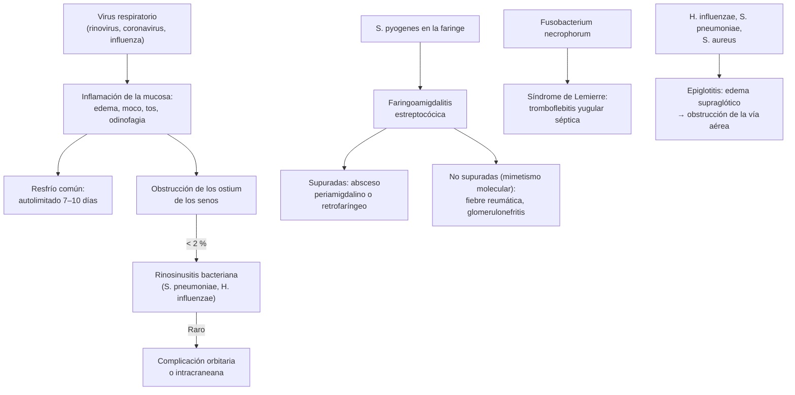

---
tags:
  - Respiratorio
  - Infectología
---

# Infecciones de las vías aéreas superiores

**Subespecialidad**
Infectología · Otorrinolaringología · Atención primaria

**Guías principales**
ACP/CDC 2016: uso apropiado de antibióticos en la infección respiratoria aguda del adulto · IDSA 2012: faringitis por estreptococo grupo A · AAO-HNS 2025: sinusitis del adulto (actualización) · IDSA 2012: rinosinusitis bacteriana aguda · AAO-HNS 2014: otitis externa aguda · AAO-HNS 2018: disfonía

**Otras fuentes**
Puntajes de Centor (1981) y McIsaac (1998) · Vigilancia de *S. pyogenes* del ISP (2024) · Programas de optimización de antimicrobianos en Chile (Acuña 2026) · Epiglotitis aguda en el adulto (Correa 2025)

**GES**
No es GES en el adulto.

**EUNACOM**
1.05.1.022 Infecciones de las vías aéreas superiores (específico, completo, completo)

**Revisado**
Octubre 2026

!!! abstract "Resumen en 60 segundos"
    - Incluyen el **resfrío común**, la **faringoamigdalitis**, la **rinosinusitis aguda**, la **otitis** (media y externa), la **laringitis** y la **epiglotitis**. Son la **primera causa de consulta** y de **prescripción innecesaria de antibióticos** en los adultos.
    - **La gran mayoría son virales** y se resuelven solas en 7–10 días: **no requieren antibióticos** (ACP/CDC 2016).
    - **Faringoamigdalitis**:
        - Solo el **5–15 %** de los adultos tiene ***S. pyogenes*** (estreptococo grupo A).
        - Usar el **puntaje de Centor/McIsaac**; con **2 o más** puntos, **test rápido** (o cultivo).
        - **Antibiótico solo si se confirma**: **penicilina benzatina 1,2 millones UI IM** o **amoxicilina** o penicilina V por **10 días**.
        - En Chile, *S. pyogenes* es **100 % sensible a la penicilina**, pero **~27 % resistente a la azitromicina**.
    - **Rinosinusitis**:
        - Sospechar una bacteria si: **≥ 10 días sin mejoría**, **inicio grave** (≥ 39 °C con rinorrea purulenta o dolor facial ≥ 3–4 días) o **doble empeoramiento**.
        - Aun así, se puede ofrecer la **espera vigilada**. Si se trata: **amoxicilina ± clavulánico 5–7 días** (AAO-HNS 2025).
    - **Resfrío y bronquitis aguda**: **sin antibióticos**; manejo sintomático.
    - **No pasar por alto**:
        - **Epiglotitis**: odinofagia intensa con examen faríngeo normal, voz apagada, babeo, estridor. Asegurar la vía aérea.
        - **Absceso periamigdalino**: trismo, voz "de papa caliente", úvula desviada.
        - **Síndrome de Lemierre**.
        - **Complicaciones orbitarias o intracraneanas** de la sinusitis.
        - **Otitis externa maligna** en el adulto mayor diabético.

## Definición

| Cuadro | Definición |
|---|---|
| **Resfrío común** (rinofaringitis aguda) | Infección **viral** autolimitada de la nariz y la faringe: rinorrea, congestión, estornudos, odinofagia leve, tos, sin fiebre alta |
| **Faringoamigdalitis aguda** | Inflamación de la faringe y las amígdalas: odinofagia, con o sin fiebre ni exudado. Viral en la mayoría; bacteriana sobre todo por ***S. pyogenes*** |
| **Rinosinusitis aguda** | Inflamación de la mucosa nasal y de los senos paranasales **< 4 semanas**, con **rinorrea purulenta** más **obstrucción nasal** y/o **dolor o presión facial**. Viral (la mayoría) o **bacteriana** (rinosinusitis bacteriana aguda) |
| **Rinosinusitis crónica** | Síntomas por **≥ 12 semanas**, con evidencia objetiva (endoscopía o TC); con o sin pólipos |
| **Otitis media aguda** | Infección del oído medio: otalgia, fiebre, **membrana timpánica abombada**; más frecuente en niños |
| **Otitis externa aguda** | Infección difusa del **conducto auditivo externo** (*Pseudomonas*, *S. aureus*): otalgia, **dolor al traccionar el pabellón**, edema del conducto |
| **Otitis externa maligna** (necrotizante) | Osteomielitis de la base del cráneo desde el conducto auditivo; casi siempre en **diabéticos mayores** o inmunosuprimidos, por ***Pseudomonas aeruginosa*** |
| **Laringitis aguda** | Inflamación de la laringe, habitualmente **viral**: **disfonía**, tos, carraspera |
| **Epiglotitis** (supraglotitis) | Infección **bacteriana** de la epiglotis y las estructuras supraglóticas con riesgo de **obstrucción de la vía aérea** |

## Epidemiología

- **Las infecciones respiratorias agudas** son la **causa más frecuente de prescripción de antibióticos** en los adultos, y gran parte de esas prescripciones es **innecesaria**.
- **Faringitis**:
    - ***S. pyogenes*** causa el **5–15 %** de las faringitis del adulto y el 20–30 % de las de los niños.
    - El resto son **virales** (rinovirus, coronavirus, adenovirus, influenza, VEB, VIH agudo) o por otras bacterias (estreptococos C y G, *Fusobacterium necrophorum*, *N. gonorrhoeae*).
- **Rinosinusitis**: casi todas son virales. **Menos del 2 %** de las rinosinusitis virales se complica con una infección bacteriana.
- **Epiglotitis**:
    - En los niños **disminuyó** con la vacuna contra *H. influenzae* tipo b.
    - En los adultos su incidencia es de **1–4 por 100 000**, predomina en los **hombres** (2:1) y se asocia a hipertensión, diabetes y apnea del sueño.
    - La mortalidad descrita va del **1 al 20 %**.

!!! chile "Datos nacionales"
    - ***S. pyogenes*** (vigilancia del ISP):
        - **100 % sensible a la penicilina** y a la cefotaxima.
        - **91 % sensible a la clindamicina**.
        - **26,8 % resistente a la azitromicina** (2023).
        - Los **macrólidos no son una buena alternativa empírica** en Chile.
    - Desde **fines de 2023** aumentaron los casos de **enfermedad invasora por *S. pyogenes***, más aún en 2024. El MINSAL emitió una **alerta** y lineamientos de manejo (junio 2024) ([ver infecciones de piel](../infectologia/infecciones-piel-partes-blandas.md)).
    - **Venta de antimicrobianos solo con receta médica** desde fines de los **años 90**. Fue la base de los programas nacionales de uso racional y de optimización de antimicrobianos.
    - La **fiebre reumática** es hoy **poco frecuente** en Chile ([ver valvulopatías](../cardiologia/valvulopatias-y-soplos.md)).
    - La **vacunación anual contra la influenza** (Programa Nacional de Inmunizaciones) previene una parte de las infecciones respiratorias de invierno en los grupos de riesgo ([ver influenza](../infectologia/influenza-y-covid-19.md)).

## Etiología

| Cuadro | Agentes |
|---|---|
| **Resfrío común** | **Rinovirus** (el más frecuente), coronavirus estacionales, VRS, parainfluenza, adenovirus, metapneumovirus, influenza, SARS-CoV-2 |
| **Faringoamigdalitis** | **Virales** (la mayoría): rinovirus, adenovirus (fiebre faringoconjuntival), influenza, VEB (mononucleosis), VIH agudo, VHS. **Bacterianas**: ***S. pyogenes***; estreptococos C y G; *Fusobacterium necrophorum* (adolescentes y adultos jóvenes); *N. gonorrhoeae* (sexo oral); *C. diphtheriae* (excepcional) |
| **Rinosinusitis bacteriana aguda** | ***S. pneumoniae***, ***H. influenzae*** no tipificable, *M. catarrhalis*; de origen **dental** (anaerobios) en la sinusitis maxilar |
| **Otitis media aguda** | Virus; *S. pneumoniae*, *H. influenzae*, *M. catarrhalis* |
| **Otitis externa aguda** | ***Pseudomonas aeruginosa***, ***S. aureus***; hongos (*Aspergillus*, *Candida*) tras el uso prolongado de gotas antibióticas |
| **Laringitis** | Virus; también reflujo, abuso vocal, tabaco |
| **Epiglotitis del adulto** | *H. influenzae*, *S. pneumoniae*, *S. aureus*, otros estreptococos |

## Fisiopatología

- **Virus respiratorios**:
    1. Infectan el epitelio de la nariz y la faringe y desencadenan una **respuesta inflamatoria**: vasodilatación, edema, secreción de moco y estímulo de las terminaciones nerviosas (odinofagia, tos).
    2. **La secreción se vuelve purulenta** (amarilla o verde) por los neutrófilos y sus enzimas, **no** por bacterias: el color **no** distingue viral de bacteriana.
- **Rinosinusitis**:
    1. El edema viral **obstruye los ostium** de drenaje de los senos.
    2. La secreción se estanca, el aclaramiento mucociliar se altera y cae la presión de oxígeno.
    3. En una minoría hay **sobreinfección bacteriana**.
    - Las complicaciones aparecen por **extensión directa** a la **órbita** (a través de la lámina papirácea, desde el etmoides) o al **SNC** (venas sin válvulas, hueso frontal).
- **Faringitis por *S. pyogenes***:
    - Invade la mucosa faríngea y produce toxinas (exantema escarlatiniforme).
    - **Complicaciones supuradas** por extensión local: **absceso periamigdalino**, absceso retrofaríngeo, otitis, sinusitis.
    - **Complicaciones no supuradas** por **mimetismo molecular** (anticuerpos contra el estreptococo que reaccionan con tejidos propios): **fiebre reumática** (que el tratamiento antibiótico **previene**) y **glomerulonefritis postestreptocócica** (que el tratamiento **no** previene).
- **Síndrome de Lemierre**: *F. necrophorum* invade desde la faringe la **vena yugular interna** (tromboflebitis séptica), con **émbolos sépticos** pulmonares.
- **Epiglotitis**: la inflamación bacteriana produce un **edema supraglótico** rápido que puede **cerrar la vía aérea**, a veces con mínimas manifestaciones en la faringe visible.
- **Otitis externa maligna**: en el diabético, *Pseudomonas* invade el cartílago y el hueso temporal (osteomielitis de la base del cráneo) y compromete los **pares craneanos** (VII, IX–XII).

*Figura 1. Fisiopatología de las infecciones de las vías aéreas superiores y sus complicaciones. Esquema propio.*

## Clasificación

- **Por localización**: nariz (resfrío, rinitis), senos paranasales (rinosinusitis), faringe y amígdalas (faringoamigdalitis), oído (otitis media o externa), laringe (laringitis) y supraglotis (epiglotitis).
- **Por agente**: **viral** (la mayoría) o **bacteriana** (minoría que se beneficia de antibióticos).
- **Rinosinusitis por duración**:
    - **Aguda**: < 4 semanas.
    - **Subaguda**: 4–12 semanas.
    - **Crónica**: ≥ 12 semanas.
    - **Aguda recurrente**: ≥ 4 episodios al año con resolución entre ellos.
- **Por gravedad**: **no complicadas** (manejo ambulatorio) o **complicadas** (absceso periamigdalino, complicación orbitaria o intracraneana, epiglotitis, otitis externa maligna, Lemierre): derivación o urgencia.

## Clínica

| Cuadro | Hallazgos que orientan |
|---|---|
| **Resfrío** | Rinorrea (clara y luego purulenta), congestión, estornudos, odinofagia leve el primer día, tos; fiebre baja o ausente; mejora en **7–10 días** (la tos puede durar 2–3 semanas) |
| **Faringitis viral** | **Tos**, **rinorrea**, **disfonía**, conjuntivitis, **úlceras orales** o vesículas, diarrea |
| **Faringitis estreptocócica** | Inicio **brusco**, **fiebre**, odinofagia intensa, **exudado** amigdalino, **adenopatías cervicales anteriores dolorosas**, petequias en el paladar, **sin tos**; a veces exantema escarlatiniforme ("en piel de lija") |
| **Rinosinusitis aguda** | Rinorrea purulenta, **obstrucción nasal**, **dolor o presión facial** que aumenta al inclinarse, hiposmia, tos, otalgia o dolor dental |
| **Otitis media del adulto** | Otalgia, hipoacusia, fiebre; membrana timpánica **roja y abombada**; a veces otorrea |
| **Otitis externa** | Otalgia intensa con **dolor al traccionar el pabellón o presionar el trago**, prurito, otorrea, conducto edematoso; tímpano normal si se logra ver |
| **Laringitis** | **Disfonía** de pocos días, tos, carraspera, a veces tras un resfrío |
| **Epiglotitis del adulto** | **Odinofagia intensa** y **disfagia** **desproporcionadas** a un examen faríngeo casi **normal**, voz apagada ("de papa caliente"), **babeo**, **estridor**, el paciente se sienta inclinado hacia adelante |

!!! alarma "Banderas rojas: no es un resfrío común"
    - **Epiglotitis**: disfagia intensa, babeo, estridor, voz apagada con faringe "normal". **No examinar la faringe con baja lengua de forma forzada**; mantener al paciente sentado y llamar a **otorrino y anestesia**.
    - **Absceso periamigdalino**: odinofagia unilateral intensa, **trismo**, **úvula desviada**, voz "de papa caliente" ([ver flegmón cervical](../infectologia/flegmon-cervical-absceso-pulmonar-y-cerebral.md)).
    - **Síndrome de Lemierre**: faringitis seguida a los pocos días de **fiebre alta**, dolor y aumento de volumen cervical lateral, **disnea** y nódulos pulmonares (émbolos sépticos).
    - **Sinusitis complicada**: **edema o eritema periorbitario**, **diplopía**, **proptosis**, dolor al mover los ojos, **baja de visión**; **cefalea intensa**, rigidez de nuca o compromiso de conciencia (meningitis, absceso, trombosis de los senos venosos).
    - **Otitis externa en un diabético mayor** con **dolor intenso nocturno**, otorrea persistente, tejido de granulación en el conducto o **parálisis facial**: **otitis externa maligna**.
    - **Disfonía de más de 4 semanas** (o antes si es fumador o hay disfagia, hemoptisis o masa cervical): **laringoscopía** para descartar un **cáncer de laringe**.
    - **Disnea, taquipnea, desaturación o crepitaciones**: no es una infección alta; buscar una **neumonía** ([ver NAC](neumonia-adquirida-en-la-comunidad.md)).

## Diagnóstico

!!! guia "Uso apropiado de antibióticos en la infección respiratoria aguda del adulto (ACP/CDC 2016)"
    1. **Bronquitis aguda**: no hacer exámenes ni dar antibióticos, salvo sospecha de **neumonía**.
    2. **Faringitis**: hacer el **test rápido de antígeno** y/o el **cultivo** solo si los síntomas sugieren *S. pyogenes* (fiebre persistente, adenitis cervical anterior, exudado amigdalino u otra combinación). **Dar antibióticos solo si se confirma**.
    3. **Rinosinusitis**: reservar el antibiótico para:
        - **síntomas persistentes por más de 10 días**;
        - **inicio grave** (fiebre > 39 °C con rinorrea purulenta o dolor facial **por al menos 3 días seguidos**);
        - **empeoramiento** después de un cuadro viral típico de 5 días que estaba mejorando (**doble empeoramiento**).
    4. **Resfrío común**: **no prescribir antibióticos**.

- **Puntaje de Centor (con la corrección por edad de McIsaac)**: 1 punto por cada uno de los siguientes.
    - Fiebre > 38 °C.
    - Exudado o aumento de volumen amigdalino.
    - Adenopatías cervicales anteriores dolorosas.
    - **Ausencia de tos**.
    - Edad: +1 si tiene 3–14 años; 0 si tiene 15–44; **−1 si tiene ≥ 45**.
    - **Uso**: con 0–1 punto, no testear. Con **≥ 2**, **test rápido** (o cultivo) (figura 2).
- **IDSA 2012 (faringitis)**:
    - **No testear** si hay rasgos virales evidentes (rinorrea, tos, úlceras orales, disfonía).
    - En el adulto, un **test rápido negativo no requiere cultivo** de confirmación (el riesgo de fiebre reumática es muy bajo).
    - **No** hacer cultivos de control ni estudiar a los contactos asintomáticos; **no tratar a los portadores**.
- **Rinosinusitis**: el diagnóstico es **clínico**. **No pedir radiografía ni TC** en la rinosinusitis aguda no complicada. La TC (o RM) solo si se sospecha una **complicación** o en la rinosinusitis crónica o recurrente.
- **Otitis externa**: diagnóstico clínico (otoscopía).
    - En el **diabético o inmunosuprimido** con dolor intenso, pedir **VHS o PCR** y **TC o RM** si se sospecha una otitis externa maligna.
- **Epiglotitis**: diagnóstico por **nasofibrolaringoscopía**, realizada por el especialista en un ambiente preparado para manejar la vía aérea (figura 3). La radiografía lateral de cuello (signo del "pulgar") y la TC tienen un rol limitado: **no deben retrasar** el manejo de la vía aérea.
- **Sospecha de VIH agudo, mononucleosis o gonorrea faríngea**: ver los resúmenes respectivos ([síndrome mononucleósico](../infectologia/sindrome-mononucleosico-y-adenitis.md), [ITS](../infectologia/infecciones-de-transmision-sexual-y-sifilis.md)).

<figure markdown>
![Dos paneles. A la izquierda, en rojo, la faringoamigdalitis con el puntaje de Centor modificado por McIsaac: fiebre mayor de 38 grados, exudado o aumento de volumen amigdalino, adenopatías cervicales anteriores dolorosas y ausencia de tos suman 1 punto cada uno; la edad de 3 a 14 años suma 1, de 15 a 44 suma 0 y de 45 o más resta 1. Con 0 a 1 punto es probablemente viral, sin test ni antibiótico; con 2 a 3, test rápido de antígeno o cultivo y antibiótico solo si es positivo; con 4 o más, test rápido o, si no hay test, considerar tratar. Los rasgos virales como rinorrea, tos, disfonía o úlceras orales no se testean, y si se trata, penicilina o amoxicilina por 10 días o penicilina benzatina intramuscular. A la derecha, en azul, la rinosinusitis aguda: casi todas son virales y mejoran en 7 a 10 días; se sospecha bacteria con persistencia de 10 días o más sin mejoría, inicio grave con fiebre de 39 o más y rinorrea purulenta o dolor facial por 3 a 4 días, o doble empeoramiento tras un resfrío que mejoraba. Sin complicaciones se ofrece espera vigilada y, si no mejora, amoxicilina con o sin clavulánico por 5 a 7 días, con alivio sintomático. Se deriva de urgencia si hay signos orbitarios o del sistema nervioso central. El color de la secreción no distingue viral de bacteriana. Al pie: no dar antibióticos en el resfrío común ni en la bronquitis aguda](../assets/figuras/ivas/faringitis-y-sinusitis-cuando-antibiotico.svg){ loading=lazy }
<figcaption>Figura 2. Cuándo pensar en una causa bacteriana y dar antibiótico en la faringoamigdalitis y la rinosinusitis aguda. Esquema propio basado en Centor 1981, McIsaac 1998, IDSA 2012, ACP/CDC 2016 y AAO-HNS 2025.</figcaption>
</figure>

## Laboratorio

| Examen | Indicación |
|---|---|
| **Test rápido de antígeno de *S. pyogenes*** | Faringitis con Centor/McIsaac ≥ 2 sin rasgos virales. Especificidad alta; en el adulto, el negativo no requiere cultivo |
| **Cultivo faríngeo** | Si no hay test rápido; sospecha de otros agentes (*F. necrophorum*, gonococo: cultivo o PCR específicos) |
| **Hemograma, PCR** | No de rutina. Útiles si se sospecha una complicación (absceso, Lemierre, epiglotitis) o una mononucleosis (linfocitos atípicos) |
| **Anticuerpos heterófilos, VIH** | Faringitis con adenopatías generalizadas, esplenomegalia o exantema |
| **Panel viral (PCR) e influenza** | Si cambia el manejo: antiviral en los grupos de riesgo, aislamiento, brotes |
| **Hemocultivos** | Sospecha de Lemierre, epiglotitis o sepsis |
| **VHS, PCR y glicemia** | Sospecha de otitis externa maligna en el diabético |
| **ASO y anti-DNasa B** | **No** sirven para diagnosticar una faringitis aguda; se usan para demostrar una infección previa en la fiebre reumática o la glomerulonefritis |

## Imágenes

- **No se requieren** en el resfrío, la faringitis, la rinosinusitis aguda no complicada ni la otitis.
- **TC de senos paranasales y órbitas con contraste** (y RM de cerebro): si se sospecha una **complicación** orbitaria o intracraneana de la sinusitis, o en la rinosinusitis crónica o recurrente antes de una cirugía.
- **TC de cuello con contraste**: absceso periamigdalino dudoso, absceso parafaríngeo o retrofaríngeo, **síndrome de Lemierre** (trombosis de la yugular interna).
- **TC o RM del hueso temporal**: otitis externa maligna.
- **Radiografía o TC de tórax**: Lemierre (nódulos cavitados); sospecha de neumonía.
- **Nasofibrolaringoscopía**: epiglotitis; disfonía persistente.

<figure markdown>
{ loading=lazy }
<figcaption>Figura 3. Evolución laringoscópica de una epiglotitis aguda en una paciente de 64 años tratada con ceftriaxona y corticoides EV: edema epiglótico intenso el día 1 y resolución progresiva hasta el día 40. Fuente: Correa EJ, Caballero AS, Ordóñez CA, et al. Acute epiglottitis in an older patient: a case report and review of the literature. <em>J Med Case Rep.</em> 2025;19(1):539, figura 1. Licencia <a href="https://creativecommons.org/licenses/by/4.0/">CC BY 4.0</a>.</figcaption>
</figure>

## Diagnóstico diferencial

| Cuadro | Diferenciales |
|---|---|
| **Odinofagia intensa** | Faringitis viral o estreptocócica, **mononucleosis**, **VIH agudo**, **absceso periamigdalino**, **epiglotitis**, gonorrea faríngea, candidiasis (inmunosupresión, corticoides inhalados), aftas, cuerpo extraño, tiroiditis subaguda (dolor cervical anterior), **síndrome coronario agudo** (dolor "en la garganta") |
| **Rinorrea y congestión** | Resfrío, **rinitis alérgica** (prurito, estornudos, estacional), rinitis vasomotora o medicamentosa (abuso de descongestionantes), influenza (fiebre alta, mialgias) |
| **Dolor facial** | Sinusitis, **dolor dental**, migraña o cefalea en racimos, neuralgia del trigémino, disfunción temporomandibular, arteritis de células gigantes (> 50 años) |
| **Otalgia** | Otitis media o externa, otalgia **referida** (dental, faringe, temporomandibular, **cáncer de faringe o laringe** en el fumador), herpes zóster ótico (vesículas, parálisis facial) |
| **Disfonía** | Laringitis viral, reflujo, abuso vocal, **parálisis de cuerda vocal**, **cáncer de laringe**, hipotiroidismo |
| **Tos persistente tras un resfrío** | Tos posviral (hasta 3–8 semanas), coqueluche, asma, goteo posnasal, reflujo |

## Tratamiento

!!! guia "Principios"
    - **Manejo sintomático** en todos:
        - **Paracetamol** o **AINE** para el dolor y la fiebre.
        - **Hidratación**; lavado nasal con **suero fisiológico**.
        - Pastillas o gárgaras para el dolor de garganta.
        - Miel para la tos (no en lactantes).
        - Los **descongestionantes** orales o nasales por pocos días (≤ 3–5 días los tópicos, por la rinitis de rebote), con cautela en la **hipertensión**.
        - Los **antihistamínicos** no sirven solos en el resfrío; sí en la rinitis alérgica.
    - **Explicar** la evolución esperada (resfrío 7–10 días, tos hasta 3 semanas) y los **signos de alarma**.
    - La **prescripción diferida** (receta para usar solo si no mejora en algunos días) reduce el uso de antibióticos sin empeorar los resultados.

- **Faringoamigdalitis estreptocócica confirmada** (IDSA 2012):
    - **Penicilina** o **amoxicilina** por **10 días**, o **penicilina benzatina** IM en dosis única (útil si no se asegura la adherencia).
    - El objetivo es **prevenir la fiebre reumática** y las complicaciones supuradas, acortar los síntomas y reducir el contagio.
    - En la **alergia a la penicilina**: cefalosporina de primera generación (si la alergia no fue grave ni inmediata), **clindamicina** o un macrólido (con ~27 % de resistencia en Chile, solo si no hay otra opción).
    - **No usar corticoides** de rutina.
    - **No** se indica la amigdalectomía solo para reducir los episodios.
- **Rinosinusitis bacteriana aguda** (AAO-HNS 2025; IDSA 2012):
    - **Espera vigilada** (sin antibiótico) en el adulto con una sinusitis no complicada, si se puede asegurar el control.
    - Si no mejora en 7 días o empeora: **amoxicilina con o sin clavulánico** por **5–7 días**.
    - **Amoxicilina/clavulánico** si hay mayor riesgo (antibiótico reciente, > 65 años, comorbilidad, hospitalización reciente).
    - En la alergia: **doxiciclina** o una fluoroquinolona respiratoria (levofloxacino), esta última solo si no hay alternativa.
    - **Corticoide intranasal** y **lavado salino** para los síntomas.
    - **Falla** a los 7 días de antibiótico: cambiar de esquema y considerar una complicación o un diagnóstico alternativo.
- **Otitis media aguda del adulto**: **amoxicilina** (o amoxicilina/clavulánico) por 5–7 días, más analgesia. Controlar que la membrana se normalice (un derrame persistente unilateral en el adulto obliga a descartar un **tumor de rinofaringe**).
- **Otitis externa aguda** (AAO-HNS 2014):
    - **Analgesia** y **gotas óticas** con antibiótico (por ejemplo, **ciprofloxacino**, con o sin corticoide) por **7 días**.
    - Limpiar el conducto; usar una mecha si está muy edematoso.
    - **Sin antibióticos orales**, salvo extensión fuera del conducto, diabetes o inmunosupresión.
    - Mantener el oído seco.
- **Otitis externa maligna**: **hospitalizar**; antibiótico **antipseudomónico** prolongado (semanas), control de la glicemia, otorrinolaringología.
- **Laringitis aguda**: **reposo vocal**, hidratación y humidificación. **Sin antibióticos ni corticoides** de rutina. Si dura **> 4 semanas**, **laringoscopía**.
- **Epiglotitis**:
    - **Asegurar la vía aérea**: monitorización en una unidad de paciente crítico. Intubación con fibroscopio o vía aérea quirúrgica si progresa.
    - **Ceftriaxona EV** (agregar **vancomicina** si es grave o hay riesgo de SAMR).
    - **Corticoides EV** con frecuencia, aunque la evidencia es limitada.
- **Absceso periamigdalino**: **drenaje** (punción o incisión) más antibiótico (amoxicilina/clavulánico o clindamicina) ([ver flegmón cervical](../infectologia/flegmon-cervical-absceso-pulmonar-y-cerebral.md)).
- **Síndrome de Lemierre**: hospitalizar; antibiótico EV con cobertura de **anaerobios** (por ejemplo, ampicilina/sulbactam o metronidazol más ceftriaxona) por semanas; drenaje de los abscesos.

!!! dosis "Antibióticos (adulto)"
    | Cuadro | Primera línea | Alternativas |
    |---|---|---|
    | **Faringitis por *S. pyogenes*** | **Penicilina benzatina 1 200 000 UI IM**, dosis única · **Amoxicilina 500 mg cada 12 h** o **1 g cada 24 h** por **10 días** · **Penicilina V 500 mg cada 12 h** (o 250 mg cada 6 h) por **10 días** | Alergia no grave: **cefadroxilo 1 g cada 24 h** o **cefalexina 500 mg cada 12 h** por 10 días. Alergia grave: **clindamicina 300 mg cada 8 h** por 10 días; azitromicina 500 mg/día por 5 días (alta resistencia en Chile) |
    | **Rinosinusitis bacteriana aguda** | **Amoxicilina 500 mg cada 8 h** o **875 mg cada 12 h** · **Amoxicilina/clavulánico 875/125 mg cada 12 h** (o 500/125 mg cada 8 h), por **5–7 días** | **Doxiciclina 100 mg cada 12 h**; levofloxacino 500 mg/día (reserva) |
    | **Otitis media aguda del adulto** | **Amoxicilina** o **amoxicilina/clavulánico** (dosis como en la sinusitis) por 5–7 días | Doxiciclina; cefalosporina |
    | **Otitis externa aguda** | **Gotas de ciprofloxacino** (con o sin corticoide) 2 veces al día por **7 días** | Otras gotas antibióticas no ototóxicas si hay perforación timpánica |
    | **Epiglotitis** | **Ceftriaxona 2 g EV cada 24 h** (± vancomicina si es grave) | Según los cultivos |

## Complicaciones

| Cuadro | Complicaciones |
|---|---|
| **Faringitis estreptocócica** | **Supuradas**: absceso periamigdalino, retrofaríngeo o parafaríngeo, otitis media, sinusitis, adenitis cervical. **No supuradas**: **fiebre reumática** (2–4 semanas después; prevenible con el tratamiento) y **glomerulonefritis postestreptocócica** (1–3 semanas; no prevenible) ([ver síndromes glomerulares](../nefrologia/sindromes-glomerulares.md)). Escarlatina, síndrome de shock tóxico, enfermedad invasora |
| **Faringitis por *F. necrophorum*** | **Síndrome de Lemierre** |
| **Rinosinusitis** | **Orbitarias**: celulitis preseptal y orbitaria, absceso subperióstico. **Intracraneanas**: meningitis, absceso epidural o cerebral, trombosis del seno cavernoso. **Óseas**: osteomielitis frontal (tumor inflamatorio de Pott) |
| **Otitis media** | Mastoiditis, parálisis facial, meningitis, absceso cerebral |
| **Otitis externa** | Celulitis del pabellón, **otitis externa maligna** (osteomielitis de la base del cráneo) |
| **Epiglotitis** | **Obstrucción de la vía aérea**, absceso epiglótico, muerte |
| **Resfrío** | Exacerbación de **asma** o **EPOC**, otitis media, sinusitis bacteriana, neumonía (sobre todo con influenza) |

## Pronóstico y seguimiento

- **Excelente** en la gran mayoría: el resfrío se resuelve en 7–10 días; la tos puede durar hasta 3 semanas. La faringitis estreptocócica mejora en 3–5 días (antes con antibiótico).
- **Control** solo si no hay mejoría en el plazo esperado, si aparecen signos de alarma o en los pacientes de riesgo (EPOC, asma, inmunosupresión, edad avanzada).
- **No** se requiere un cultivo de control tras tratar una faringitis estreptocócica.
- **Sinusitis recurrente o crónica**, otitis media persistente en el adulto, **disfonía > 4 semanas** o **adenopatía cervical persistente** en un fumador: **derivar a otorrinolaringología** (descartar tumores de cabeza y cuello).
- **Prevención**:
    - **Lavado de manos**; cubrirse al toser.
    - **Vacunas**: **influenza anual** y **neumocócica** en los grupos de riesgo; **COVID-19** según el calendario vigente.
    - **No fumar**.

## Perlas para el internado

!!! perla "Para recordar en la sala"
    - **El color del moco no indica bacterias**: la secreción purulenta es normal en el resfrío.
    - **Faringitis con tos, rinorrea o disfonía = viral**: no testear ni dar antibióticos.
    - **Centor/McIsaac ≥ 2 → test rápido**; antibiótico **solo si es positivo**.
    - ***S. pyogenes* sigue 100 % sensible a la penicilina**: la penicilina benzatina o la amoxicilina son de elección. Evita la azitromicina en Chile (~27 % de resistencia).
    - **Sinusitis bacteriana = 10 días, inicio grave o doble empeoramiento**; aun así, la espera vigilada es válida. Si tratas: **5–7 días**, no 10–14.
    - **Odinofagia brutal con faringe casi normal** = **epiglotitis** hasta demostrar lo contrario. No fuerces el baja lengua; asegura la vía aérea.
    - **Diabético mayor con otitis externa que no mejora y dolor nocturno** = otitis externa maligna.
    - **Disfonía > 4 semanas en un fumador** = laringoscopía.
    - **El ASO no diagnostica una faringitis aguda**.

## Preguntas de repaso

??? repaso "1. Mujer de 30 años con 2 días de odinofagia, rinorrea, tos seca y disfonía, sin fiebre. Faringe eritematosa sin exudado. Pide \"un antibiótico para no empeorar\". ¿Qué hace?"
    - **Faringitis viral en el contexto de un resfrío**: tos, rinorrea y disfonía son rasgos virales (Centor/McIsaac 0–1).
    - **No testear ni dar antibióticos** (ACP/CDC 2016, IDSA 2012).
    - **Manejo sintomático**: paracetamol o AINE, hidratación, lavado nasal.
    - **Educar**: evolución de 7–10 días, tos hasta 3 semanas, y consultar si hay fiebre alta persistente, disnea, dificultad para tragar o empeoramiento después de mejorar.

??? repaso "2. Hombre de 24 años con fiebre de 38,8 °C, odinofagia intensa de inicio brusco, exudado amigdalino bilateral y adenopatías cervicales anteriores dolorosas, sin tos. ¿Puntaje, estudio y tratamiento?"
    - **Centor/McIsaac de 4 puntos** (fiebre, exudado, adenopatías anteriores, sin tos; edad 15–44 años = 0).
    - **Test rápido** de *S. pyogenes* (o cultivo).
    - Si es positivo: **penicilina benzatina 1 200 000 UI IM** en dosis única, o **amoxicilina** 500 mg cada 12 h (o 1 g/día) por **10 días**. Analgesia.
    - Si es negativo: no dar antibióticos. Considerar la **mononucleosis** (adenopatías posteriores, esplenomegalia) y el VIH agudo si hay factores de riesgo.

??? repaso "3. Mujer de 45 años con rinorrea purulenta, obstrucción nasal y presión facial maxilar desde hace 12 días, sin mejoría y sin fiebre. Sin signos de alarma. ¿Diagnóstico y manejo?"
    - **Rinosinusitis aguda con probable causa bacteriana**: síntomas **≥ 10 días sin mejoría**.
    - **Opciones (AAO-HNS 2025)**:
        - **Espera vigilada** con control asegurado y tratamiento sintomático (lavado salino, corticoide intranasal, analgesia).
        - O **amoxicilina** (± clavulánico) por **5–7 días**.
    - **No pedir imágenes**.
    - **Reevaluar** si no mejora a los 7 días o empeora; derivar de urgencia si aparecen signos orbitarios o neurológicos.

??? repaso "4. Hombre de 52 años con odinofagia muy intensa, imposibilidad de tragar la saliva, voz apagada y fiebre. Al examen, la faringe se ve casi normal. Está sentado e inclinado hacia adelante. ¿Qué sospecha y qué hace?"
    - **Epiglotitis aguda del adulto**: odinofagia y disfagia **desproporcionadas** a una faringe normal, voz apagada, babeo y posición en trípode.
    - **Manejo**:
        - **No forzar el examen** de la faringe y mantenerlo sentado.
        - Oxígeno, monitorización.
        - Llamar de inmediato a **otorrinolaringología y anestesia**: **nasofibrolaringoscopía** en un ambiente preparado para la vía aérea difícil (intubación con fibroscopio o vía aérea quirúrgica).
        - **Ceftriaxona EV** (± vancomicina si es grave), corticoides EV con frecuencia, hemocultivos.
        - Hospitalizar en una unidad de paciente crítico.

??? repaso "5. Hombre de 74 años, diabético con mal control, con otalgia derecha intensa de predominio nocturno y otorrea desde hace 4 semanas, pese a gotas antibióticas. Tiene tejido de granulación en el conducto auditivo y una leve asimetría facial. ¿Qué sospecha?"
    - **Otitis externa maligna** (necrotizante): osteomielitis de la base del cráneo por ***Pseudomonas aeruginosa*** en un diabético mayor, con compromiso del **nervio facial**.
    - **Estudio**: VHS y PCR, glicemia, cultivo de la secreción y **TC o RM** del hueso temporal.
    - **Manejo**: **hospitalizar**, antibiótico **antipseudomónico** EV prolongado (semanas), control de la glicemia y otorrinolaringología. Puede requerir biopsia para descartar un cáncer.

??? repaso "6. Fumador de 61 años con disfonía de 6 semanas, sin otros síntomas, que ya recibió dos cursos de antibióticos \"por laringitis\". ¿Qué corresponde?"
    - Una **disfonía de más de 4 semanas**, sobre todo en un **fumador**, no es una laringitis viral.
    - Requiere una **laringoscopía** (AAO-HNS 2018) para descartar un **cáncer de laringe**, una parálisis de cuerda vocal (por ejemplo, por un tumor pulmonar o mediastínico que comprime el nervio laríngeo recurrente) u otras lesiones.
    - **No dar más antibióticos**. Derivar a otorrinolaringología.

## Referencias

1. Harris AM, Hicks LA, Qaseem A. Appropriate antibiotic use for acute respiratory tract infection in adults: advice for high-value care from the American College of Physicians and the Centers for Disease Control and Prevention. *Ann Intern Med.* 2016;164(6):425–434. doi:[10.7326/M15-1840](https://doi.org/10.7326/M15-1840)
2. Shulman ST, Bisno AL, Clegg HW, et al. Clinical practice guideline for the diagnosis and management of group A streptococcal pharyngitis: 2012 update by the Infectious Diseases Society of America. *Clin Infect Dis.* 2012;55(10):e86–e102. doi:[10.1093/cid/cis629](https://doi.org/10.1093/cid/cis629)
3. Payne SC, McKenna M, Buckley J, et al. Clinical practice guideline: adult sinusitis update. *Otolaryngol Head Neck Surg.* 2025;173(Suppl 1):S1–S56. doi:[10.1002/ohn.1344](https://doi.org/10.1002/ohn.1344)
4. Chow AW, Benninger MS, Brook I, et al. IDSA clinical practice guideline for acute bacterial rhinosinusitis in children and adults. *Clin Infect Dis.* 2012;54(8):e72–e112. doi:[10.1093/cid/cir1043](https://doi.org/10.1093/cid/cir1043)
5. Rosenfeld RM, Schwartz SR, Cannon CR, et al. Clinical practice guideline: acute otitis externa. *Otolaryngol Head Neck Surg.* 2014;150(1 Suppl):S1–S24. doi:[10.1177/0194599813517083](https://doi.org/10.1177/0194599813517083)
6. Stachler RJ, Francis DO, Schwartz SR, et al. Clinical practice guideline: hoarseness (dysphonia) (update). *Otolaryngol Head Neck Surg.* 2018;158(1 Suppl):S1–S42. doi:[10.1177/0194599817751030](https://doi.org/10.1177/0194599817751030)
7. Centor RM, Witherspoon JM, Dalton HP, et al. The diagnosis of strep throat in adults in the emergency room. *Med Decis Making.* 1981;1(3):239–246. doi:[10.1177/0272989X8100100304](https://doi.org/10.1177/0272989X8100100304)
8. McIsaac WJ, White D, Tannenbaum D, et al. A clinical score to reduce unnecessary antibiotic use in patients with sore throat. *CMAJ.* 1998;158(1):75–83. [PMC1228750](https://www.ncbi.nlm.nih.gov/pmc/articles/PMC1228750/)
9. Correa EJ, Caballero AS, Ordóñez CA, et al. Acute epiglottitis in an older patient: a case report and review of the literature. *J Med Case Rep.* 2025;19(1):539. doi:[10.1186/s13256-025-05363-3](https://doi.org/10.1186/s13256-025-05363-3)
10. Instituto de Salud Pública de Chile. Informe de vigilancia de laboratorio de enfermedad invasora por *Streptococcus pyogenes*, Chile. *Rev Chilena Infectol.* 2024;41(4). [scielo.cl](https://www.scielo.cl/scielo.php?pid=S0716-10182024000400480&script=sci_arttext)
11. Acuña M, Herrera T, Benadof D, et al. Antimicrobial stewardship programs in Chile: a historical overview. *Antibiotics (Basel).* 2026;15(3):247. doi:[10.3390/antibiotics15030247](https://doi.org/10.3390/antibiotics15030247)
