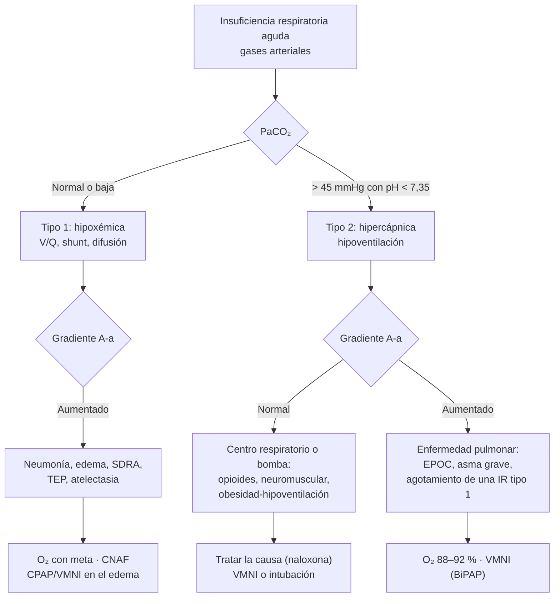

---
tags:
  - Respiratorio
  - Medicina intensiva
  - Urgencia
  - Frecuente en sala
---

# Insuficiencia respiratoria aguda, soporte no invasivo, SDRA y hemoptisis

**Subespecialidad**
Enfermedades respiratorias · Medicina intensiva · Medicina de urgencia

**Guías principales**
ATS 2026: soporte respiratorio no invasivo en la insuficiencia respiratoria aguda (*Am J Respir Crit Care Med*) · ERS/ATS 2017: ventilación no invasiva · ERS 2022: cánula nasal de alto flujo · BTS 2017: oxígeno en adultos · BTS/ICS 2016: insuficiencia respiratoria hipercápnica · Definición global del SDRA 2024 · ESICM 2023 y ATS 2024: SDRA

**Otras fuentes**
Ensayo SOHO (cánula de alto flujo, *N Engl J Med* 2026) · Revisión de la hemoptisis masiva (*Chest* 2020)

**GES**
No como problema propio. Sus causas (EPOC, neumonía en el adulto mayor, asma) tienen GES

**EUNACOM**
1.05.2.008 Insuficiencia respiratoria que requiere ventilación mecánica (específico, inicial, derivar) · 1.05.2.009 Insuficiencia respiratoria que no requiere ventilación mecánica (específico, completo, completo) · 1.05.2.007 Hemoptisis moderada, severa y masiva (sospecha, inicial, derivar) · 1.05.1.019 Hemoptisis leve y mediana · 1.05.1.014 Edema pulmonar no cardiogénico

**Revisado**
Septiembre 2026

!!! abstract "Resumen en 60 segundos"
    - **Insuficiencia respiratoria (IR)**: falla del intercambio gaseoso.
        - **Tipo 1 (hipoxémica)**: PaO₂ **< 60 mmHg**.
        - **Tipo 2 (hipercápnica)**: PaCO₂ **> 45 mmHg** con pH **< 7,35**.
    - **Pedir gases arteriales** y calcular la **PaO₂/FiO₂** (normal > 400). Buscar la **causa**: neumonía, edema pulmonar, TEP, EPOC, asma, SDRA, neumotórax, depresión del centro respiratorio, debilidad muscular.
    - **Oxígeno con meta**: SpO₂ **92–96 %**, o **88–92 %** si hay riesgo de hipercapnia (EPOC, obesidad, enfermedad neuromuscular). **Evitar la hiperoxia**.
    - **Soporte no invasivo** (ATS 2026):
        - **IR hipoxémica**: **cánula nasal de alto flujo (CNAF)**, recomendación fuerte porque reduce la intubación. La VMNI o la CPAP son alternativas condicionales. En el ensayo SOHO (2026), la CNAF redujo la intubación sin cambiar la mortalidad.
        - **IR hipercápnica** (EPOC con **pH < 7,35**): **VMNI (BiPAP)**, que reduce la mortalidad y la intubación.
        - **Edema pulmonar cardiogénico**: **CPAP** o VMNI.
    - **No retrasar la intubación** si hay agotamiento, compromiso de conciencia, inestabilidad o falla del soporte no invasivo. La **intubación tardía aumenta la mortalidad**.
    - **SDRA**: hipoxemia aguda con infiltrados bilaterales no explicados por el corazón. Se maneja con **volumen corriente bajo (6 mL/kg de peso predicho)**, **presión meseta < 30 cmH₂O** y **prono** si la PaO₂/FiO₂ es < 150.
    - **Hemoptisis masiva**: vía aérea, **decúbito lateral sobre el pulmón que sangra**, **ácido tranexámico**, angio-TC, **broncoscopía** y **embolización** de las arterias bronquiales.

## Definición

- **Insuficiencia respiratoria**: incapacidad del sistema respiratorio para mantener un intercambio gaseoso adecuado.
    - **Tipo 1 (hipoxémica)**: **PaO₂ < 60 mmHg** (SpO₂ < 90 %) respirando aire ambiental, con PaCO₂ normal o baja.
    - **Tipo 2 (hipercápnica o ventilatoria)**: **PaCO₂ > 45 mmHg**. Es **aguda** si el **pH < 7,35** (acidosis respiratoria), y **crónica reagudizada** si hay un bicarbonato alto previo con un pH que cae.
- **Relación PaO₂/FiO₂ (PaFi)**: > 400 normal; < 300 alteración moderada; < 200 grave; < 100 muy grave.
- **Síndrome de distrés respiratorio agudo (SDRA)** (definición global, 2024):
    - Factor de riesgo y **inicio agudo** (< 1 semana).
    - **Opacidades bilaterales** en la radiografía, la TC o la **ecografía pulmonar**.
    - Hipoxemia **no explicada por completo** por la insuficiencia cardíaca o la sobrecarga de volumen.
    - **PaFi ≤ 300** (o SpO₂/FiO₂ ≤ 315 con SpO₂ ≤ 97 %). Incluye a los pacientes **no intubados** con CNAF ≥ 30 L/min o VMNI con PEEP ≥ 5.
    - **Gravedad** en los intubados: leve (PaFi 201–300), moderado (101–200), grave (≤ 100).
- **Hemoptisis**: expectoración de sangre desde la vía aérea inferior.
    - **Masiva o amenazante**: > **100–600 mL en 24 h** según la definición, o **cualquier volumen** que comprometa la **vía aérea**, la **oxigenación** o la **hemodinamia**. Lo que mata es la **asfixia**, no la anemia.

## Epidemiología

### Mundial

- La insuficiencia respiratoria aguda es una de las **causas más frecuentes de ingreso a la UCI** y de ventilación mecánica.
- **SDRA**: ~ **10 %** de los ingresos a la UCI y ~ **23 %** de los pacientes ventilados. Mortalidad hospitalaria de **~ 35–45 %**, mayor en los casos graves. La pandemia de **COVID-19** aumentó mucho su frecuencia y popularizó la **CNAF** y el **prono vigil**.
- **Causas más frecuentes de IR aguda**: **neumonía**, **exacerbación de EPOC**, **edema pulmonar cardiogénico**, **sepsis**, **asma**, **TEP**.
- **Hemoptisis masiva**: **~ 5 %** de las hemoptisis, con mortalidad de hasta **~ 30–50 %** sin tratamiento. **~ 90 %** de las hemoptisis masivas provienen de las **arterias bronquiales** (circulación sistémica, de alta presión).

### Chile

!!! chile "Contexto nacional"
    - La **neumonía**, la **influenza** y el **virus respiratorio sincicial** producen un **alza invernal** de la insuficiencia respiratoria. El MINSAL organiza la **Campaña de Invierno**, que incluye el aumento de camas críticas, la vigilancia de los virus respiratorios (ISP) y la vacunación.
    - La pandemia de COVID-19 obligó a una **gran expansión de las camas UCI** y a introducir la **CNAF** en las salas y urgencias del país, lo que dejó capacidad instalada y experiencia.
    - En las **causas de hemoptisis** en Chile pesan las **bronquiectasias**, la **tuberculosis** (activa o sus secuelas; ver [tuberculosis](tuberculosis.md)), el **cáncer pulmonar** y, en ciertas zonas, la **hidatidosis pulmonar**.
    - La **EPOC** y el **asma** tienen GES, e incluyen el manejo de sus exacerbaciones.

## Etiología y factores de riesgo

| Tipo | Mecanismo | Causas |
|---|---|---|
| **Tipo 1 (hipoxémica)** | **Alteración V/Q** (la más frecuente) · **Cortocircuito (shunt)** · Alteración de la difusión | **Neumonía**, **edema pulmonar** cardiogénico, **SDRA**, **TEP**, atelectasia, exacerbación de EPOC o asma, enfermedad intersticial, **hemorragia alveolar**, neumotórax |
| **Tipo 2 (hipercápnica)** | **Hipoventilación alveolar**: falla del centro respiratorio, de la bomba ventilatoria o aumento del espacio muerto | **EPOC** y **asma grave**, **obesidad-hipoventilación**, **fármacos** (opioides, benzodiacepinas, alcohol), ACV de tronco, **enfermedades neuromusculares** (Guillain-Barré, miastenia, ELA), deformidad de la caja torácica, **agotamiento** de cualquier IR tipo 1 |

**Causas del SDRA**:

- **Directas (pulmonares)**: **neumonía** (la más frecuente), **aspiración**, contusión pulmonar, inhalación de tóxicos, ahogamiento.
- **Indirectas**: **sepsis** extrapulmonar, **pancreatitis**, politransfusión (TRALI), politraumatismo, quemaduras, bypass cardiopulmonar.

**Causas de hemoptisis**:

- **Infecciosas**: **bronquitis** (la más frecuente en la hemoptisis leve), **bronquiectasias**, **tuberculosis**, **aspergiloma** en cavidades, absceso, neumonía necrotizante, hidatidosis.
- **Neoplásicas**: **cáncer pulmonar** (considerar en > 40 años fumadores), metástasis, carcinoide.
- **Cardiovasculares**: **estenosis mitral**, **TEP con infarto pulmonar**, malformaciones arteriovenosas, insuficiencia cardíaca.
- **Hemorragia alveolar**: vasculitis ANCA, Goodpasture, lupus.
- **Coagulopatía** y **anticoagulantes**, cocaína, trauma, iatrogenia (biopsias).

## Fisiopatología

- **Alteración V/Q**: zonas mal ventiladas pero perfundidas. La hipoxemia **mejora con oxígeno**.
- **Shunt**: sangre que pasa por alvéolos **colapsados o llenos** (neumonía, SDRA, edema). La hipoxemia **responde poco al oxígeno** y sí a la **presión positiva (PEEP)**, que recluta alvéolos.
- **Hipoventilación**: la PaCO₂ sube en proporción inversa a la ventilación alveolar. El gradiente alvéolo-arterial es **normal** si el pulmón es sano (por ejemplo, en una sobredosis de opioides).
- **Gradiente alvéolo-arterial de O₂**: PAO₂ − PaO₂, con PAO₂ = FiO₂ × (760 − 47) − PaCO₂/0,8.
    - Normal ~ 10–15 mmHg (aumenta con la edad).
    - **Aumentado** en las alteraciones V/Q, el shunt y la difusión.
    - **Normal** en la hipoventilación pura.
- **Hipercapnia y oxígeno**: en la EPOC, el **exceso de oxígeno** empeora la hipercapnia (efecto Haldane y liberación de la vasoconstricción hipóxica, más que la pérdida del estímulo hipóxico). Por eso la meta es **88–92 %**.
- **SDRA**:
    1. La inflamación daña el **endotelio** y el **epitelio alveolar** y aumenta la permeabilidad.
    2. Se produce un **edema rico en proteínas** y se pierde el surfactante.
    3. Aparecen **colapso alveolar**, shunt y un pulmón "pequeño" (*baby lung*).
    4. La ventilación con volúmenes altos lo daña más (**volutrauma**, barotrauma, atelectrauma). Por eso se usa la **ventilación protectora**.
- **Esfuerzo respiratorio excesivo**: en la IR hipoxémica, un esfuerzo inspiratorio muy intenso puede producir una lesión pulmonar autoinfligida (P-SILI). Es una razón para **no prolongar** un soporte no invasivo que fracasa.

*Figura 1. Clasificación y enfoque de la insuficiencia respiratoria aguda. Esquema propio.*

## Clasificación

- **Por el mecanismo**: tipo 1 (hipoxémica), tipo 2 (hipercápnica); también tipo 3 (perioperatoria, por atelectasias) y tipo 4 (shock).
- **Por el tiempo**: aguda, crónica, crónica reagudizada.
- **SDRA** (en los intubados): leve, moderado o grave según la PaFi con PEEP ≥ 5.
- **Hemoptisis**: leve (estrías, < 20–30 mL/día), moderada y masiva o amenazante.

## Clínica

- **Hipoxemia**: disnea, **taquipnea**, taquicardia, **cianosis**, agitación, confusión, arritmias. Muchos pacientes (sobre todo adultos mayores) tienen poca disnea: la **SpO₂ y la frecuencia respiratoria** son claves.
- **Hipercapnia**: **somnolencia**, cefalea, confusión, **asterixis**, sudoración, vasodilatación (piel caliente), coma ("narcosis por CO₂").
- **Signos de trabajo respiratorio aumentado y de fatiga**:
    - **Frecuencia respiratoria > 30/min**.
    - **Uso de músculos accesorios**, tiraje.
    - **Respiración paradójica** (el abdomen se hunde en la inspiración).
    - Incapacidad de hablar frases completas.
    - **Compromiso de conciencia**.
- **Buscar la causa**: crépitos (neumonía, edema), sibilancias (asma, EPOC), ingurgitación yugular y edema (insuficiencia cardíaca), asimetría del murmullo (neumotórax, derrame), TVP (TEP), pupilas mióticas (opioides), debilidad (neuromuscular).
- **Hemoptisis**: diferenciarla de la **hematemesis** (sangre oscura, con restos alimentarios, pH ácido) y de la **epistaxis** o el sangrado de la vía aérea superior (examen de la nariz y la faringe). En la hemoptisis la sangre es **roja, espumosa**, con tos y pH alcalino.

!!! alarma "Criterios de intubación (no retrasarla)"
    - **Paro respiratorio**, **apnea** o respiración agónica.
    - **Compromiso de conciencia** (Glasgow ≤ 8) o incapacidad de proteger la vía aérea (vómitos, secreciones, hemoptisis masiva).
    - **Inestabilidad hemodinámica** grave o arritmias.
    - **Agotamiento**: frecuencia respiratoria > 35, respiración paradójica.
    - **Falla del soporte no invasivo**:
        - Sin mejoría en 1–2 horas (pH, PaCO₂, frecuencia respiratoria, SpO₂).
        - **Índice ROX** bajo en la CNAF.
        - Volúmenes corrientes muy altos en la VMNI.
    - **Hipoxemia refractaria**: SpO₂ < 88–90 % con FiO₂ alta.

## Diagnóstico

**Paso 1. Evaluación inmediata**: ABC, **SpO₂**, frecuencia respiratoria, nivel de conciencia, PA. **Oxígeno** con meta mientras se evalúa.

**Paso 2. Gases arteriales**:

- PaO₂, **PaCO₂**, **pH**, bicarbonato y **lactato**.
- Calcular la **PaFi** y el **gradiente A-a**.
- Distinguir la hipercapnia **aguda** de la **crónica reagudizada**:
    - **Aguda**: el pH baja ~ 0,08 por cada 10 mmHg de PaCO₂.
    - **Crónica**: el pH baja ~ 0,03, con bicarbonato alto.
- Los **gases venosos** sirven para el pH y la PaCO₂ (para descartar hipercapnia), pero **no** para la oxigenación.

**Paso 3. Imagen**:

- **Radiografía de tórax**.
- **Ecografía pulmonar** en el punto de atención:
    - **Líneas B** bilaterales: edema o SDRA.
    - **Consolidación**: neumonía.
    - **Ausencia de deslizamiento pleural**: neumotórax.
    - **Derrame**.
    - Con la ecocardiografía y la ecografía venosa, se evalúa el TEP.
- **Angio-TC** si se sospecha un TEP.

**Paso 4. Laboratorio según la causa**:

- Hemograma, PCR, procalcitonina.
- **NT-proBNP**, troponina.
- ECG.
- Hemocultivos.
- Panel viral respiratorio.
- Tóxicos.
- Pruebas de coagulación.

**Paso 5. Hemoptisis**:

- Cuantificar el volumen y evaluar la **vía aérea**.
- **Hemograma**, **coagulación**, grupo y Rh, función renal, orina completa (hemorragia alveolar con glomerulonefritis).
- **Angio-TC de tórax**: localiza el sangrado y su causa, y planifica la embolización.
- **Broncoscopía**: localiza y trata.
- Baciloscopía y prueba molecular de TB.

## Laboratorio

| Examen | Uso |
|---|---|
| **Gases arteriales** | Tipo de IR, PaFi, gradiente A-a, pH (agudo vs. crónico), lactato |
| **Gases venosos** | pH y PaCO₂ (seguimiento de la hipercapnia) |
| **Hemograma, PCR, procalcitonina** | Infección |
| **NT-proBNP, troponina, ECG** | Edema cardiogénico, IAM |
| **Dímero D** | Probabilidad clínica baja o intermedia de TEP |
| **Hemocultivos, panel viral** (influenza, SARS-CoV-2, VRS) | Neumonía, SDRA |
| **Coagulación, grupo y Rh** | Hemoptisis |
| **Orina completa, creatinina, ANCA, anti-MBG** | Hemorragia alveolar con glomerulonefritis (síndrome pulmón-riñón) |
| **Tóxicos** | Hipoventilación por fármacos |

## Imágenes

- **Radiografía de tórax**: la primera imagen. El SDRA muestra opacidades bilaterales; el edema cardiogénico, cardiomegalia, redistribución y derrames.
- **Ecografía pulmonar**: rápida, al lado de la cama; muy útil para diferenciar las causas (protocolo BLUE).
- **TC de tórax y angio-TC**: TEP, hemoptisis (origen y causa), enfermedad intersticial, complicaciones del SDRA.
- **Ecocardiograma**: función ventricular, dilatación del VD (TEP), taponamiento.

<figure markdown>
{ loading=lazy }
<figcaption>Figura 2. Dispositivos de oxigenoterapia y FiO₂ aproximada. Esquema propio.</figcaption>
</figure>

## Diagnóstico diferencial

| Cuadro | Claves |
|---|---|
| **Edema pulmonar cardiogénico vs. SDRA** | Cardiopatía, galope, ingurgitación yugular, NT-proBNP alto, derrames, ecocardiograma con disfunción; responde a los diuréticos y a la CPAP |
| **Neumonía** | Fiebre, consolidación, leucocitosis |
| **TEP** | Factores de riesgo, TVP, radiografía poco llamativa con hipoxemia marcada, VD dilatado |
| **Exacerbación de EPOC o asma** | Sibilancias, antecedentes, hipercapnia |
| **Neumotórax** | Dolor súbito, murmullo abolido, sin deslizamiento pleural en la ecografía |
| **Acidosis metabólica** | Taquipnea (respiración de Kussmaul) **sin** hipoxemia: el pulmón está sano |
| **Ansiedad o hiperventilación** | Hipocapnia con PaO₂ normal y gradiente A-a normal; diagnóstico de exclusión |
| **Anemia, metahemoglobinemia, intoxicación por CO** | SpO₂ engañosa: medir la carboxihemoglobina y la metahemoglobina en los gases (cooximetría) |

## Tratamiento

!!! guia "ATS 2026, ERS/ATS 2017, ERS 2022 y BTS 2017"
    - **Oxígeno con meta**: SpO₂ **92–96 %**, y **88–92 %** en los pacientes con riesgo de hipercapnia. Evitar la hiperoxia (SpO₂ > 96 %).
    - **IR hipoxémica**:
        - **CNAF** (recomendación **fuerte**, ATS 2026): reduce la necesidad de intubación frente al oxígeno convencional. **VMNI o CPAP** como alternativa (condicional), con **monitoreo estrecho** y escalamiento oportuno.
        - En el ensayo SOHO (2026; PaFi ≤ 200 con infiltrados), la CNAF redujo la intubación (42 % vs. 48 %), sin diferencia en la mortalidad a 28 días (14,6 % en ambos grupos).
    - **IR hipercápnica** (exacerbación de EPOC con **pH < 7,35** y PaCO₂ > 45): **VMNI** (recomendación **fuerte**): reduce la mortalidad y la intubación. La CNAF sólo en casos seleccionados con acidosis leve (pH > 7,25) y monitoreo estrecho (condicional).
    - **Edema pulmonar cardiogénico**: **CPAP o VMNI**.
    - **Preoxigenación para la intubación**: **CNAF o VMNI** (recomendación fuerte).
    - **Posextubación**: CNAF en los de bajo riesgo y VMNI en los de alto riesgo de reintubación.
    - La VMNI **no** se recomienda de rutina en la IR hipoxémica *de novo* grave sin experiencia ni monitoreo (riesgo de intubación tardía).

!!! dosis "Parámetros iniciales del soporte respiratorio"
    - **Oxígeno convencional**: naricera 1–6 L/min, mascarilla Venturi (24–60 %), mascarilla con reservorio 10–15 L/min (figura 2).
    - **CNAF**:
        - Flujo **50–60 L/min**, temperatura 34–37 °C, FiO₂ para la meta de SpO₂.
        - **Índice ROX** = (SpO₂/FiO₂) / frecuencia respiratoria. **≥ 4,88** a las 2, 6 o 12 h predice el éxito; valores bajos y que no mejoran (por ejemplo, **< 3,85 a las 12 h**) predicen la falla: considerar la intubación.
    - **VMNI (BiPAP)** en la EPOC hipercápnica:
        - **IPAP 10–12 cmH₂O**, subiendo 2–5 cmH₂O hasta **~ 20** según la tolerancia, el volumen corriente y la PaCO₂.
        - **EPAP 4–5 cmH₂O**.
        - FiO₂ para una SpO₂ de 88–92 %.
        - **Gases de control a la 1–2 h**: si el pH y la frecuencia respiratoria no mejoran, considerar la intubación.
    - **CPAP** en el edema pulmonar: **5–10 cmH₂O**.
    - **Contraindicaciones de la VMNI**:
        - Paro respiratorio.
        - Incapacidad de proteger la vía aérea.
        - Vómitos, hemorragia digestiva alta.
        - Trauma o cirugía facial.
        - Inestabilidad hemodinámica grave.
        - Obstrucción de la vía aérea superior.
        - Agitación que impide cooperar.
        - Neumotórax no drenado.

### Ventilación mecánica y SDRA (manejo en la UCI)

!!! dosis "Ventilación protectora en el SDRA (ESICM 2023, ATS 2024)"
    - **Volumen corriente 4–8 mL/kg de peso corporal predicho** (inicio en **6 mL/kg**).
        - Peso predicho: hombres = 50 + 0,91 × (talla en cm − 152,4); mujeres = 45,5 + 0,91 × (talla en cm − 152,4).
    - **Presión meseta < 30 cmH₂O**; **driving pressure** (meseta − PEEP) idealmente **< 15 cmH₂O**.
    - **PEEP** según la tabla PEEP/FiO₂ o la mecánica, con una PEEP más alta en el SDRA moderado a grave.
    - **Metas**: SpO₂ 88–95 % (PaO₂ 55–80 mmHg); se tolera la hipercapnia (**pH > 7,20–7,25**).
    - **Prono ≥ 12–16 h al día** si la **PaFi < 150** (reduce la mortalidad).
    - **Bloqueo neuromuscular**: no de rutina (condicional en los casos graves y tempranos, ATS 2024).
    - **Corticoides** en el SDRA (condicional, ATS 2024), y **ECMO venovenosa** en los casos graves refractarios, en centros con experiencia.
    - **Balance hídrico conservador** una vez resuelto el shock.
    - **No** se recomiendan las maniobras de reclutamiento prolongadas de rutina.

### Hemoptisis

!!! dosis "Hemoptisis masiva o amenazante"
    1. **Vía aérea y oxígeno**. Posición en **decúbito lateral sobre el lado que sangra** (para proteger el pulmón sano).
    2. **Intubación** si hay compromiso respiratorio, con un **tubo de gran calibre** (≥ 8), que permite la broncoscopía. Se puede intubar selectivamente el bronquio del pulmón sano.
    3. **Dos vías venosas gruesas**, volumen, grupo y Rh, transfusión según la necesidad.
    4. **Corregir la coagulopatía** y suspender los anticoagulantes y antiagregantes.
    5. **Ácido tranexámico**: 1 g EV cada 8 h, o **nebulizado** 500 mg cada 8 h (reduce el sangrado).
    6. **Angio-TC de tórax** si el paciente está estable, para localizar el sangrado.
    7. **Broncoscopía**: localiza, aspira y controla transitoriamente (suero frío, adrenalina tópica, bloqueador bronquial).
    8. **Embolización de las arterias bronquiales**: el **tratamiento de elección** para detener el sangrado (éxito inmediato de ~ 80–90 %).
    9. **Cirugía** (resección): sangrado refractario o lesiones localizadas (aspergiloma, trauma).
    10. Tratar la causa: antibióticos (bronquiectasias, TB), tratamiento antituberculoso.

- **Hemoptisis leve** (estrías de sangre): buscar la causa en forma ambulatoria.
    - Radiografía de tórax.
    - **TC de tórax** si hay factores de riesgo de cáncer (> 40 años, fumador) o si la radiografía es anormal.
    - Baciloscopía.
    - Broncoscopía según el caso.
    - Tratar la bronquitis o las bronquiectasias.

## Complicaciones

- **De la hipoxemia y la hipercapnia**: arritmias, isquemia miocárdica, encefalopatía, **paro cardiorrespiratorio**.
- **De la VMNI**: lesiones por presión en la nariz, distensión gástrica, aspiración, intolerancia; **retraso de la intubación**.
- **De la ventilación mecánica**:
    - **Neumonía asociada al ventilador**.
    - **Barotrauma** (neumotórax).
    - Lesión pulmonar inducida por el ventilador.
    - Debilidad adquirida en la UCI, **delirium**.
    - TVP, úlceras por estrés, disfunción diafragmática.
- **SDRA**: fibrosis pulmonar, secuelas funcionales, cognitivas y psicológicas (**síndrome post-UCI**).
- **Hemoptisis**: **asfixia** (la principal causa de muerte), anemia, recurrencia.

## Pronóstico y seguimiento

- Depende de la **causa** y de su reversibilidad: el edema pulmonar cardiogénico y la sobredosis de opioides tienen buen pronóstico; el SDRA grave y la neumonía del inmunosuprimido, peor.
- **VMNI en la EPOC**: éxito en ~ 70–80 %. Si falla y se intuba tarde, la mortalidad es alta.
- **SDRA**: mortalidad de ~ 35–45 %. Muchos sobrevivientes tienen secuelas prolongadas.
- **Perfil EUNACOM**:
    - **IR que no requiere ventilación mecánica**: diagnóstico específico, **tratamiento completo** (oxígeno con meta, tratamiento de la causa) y **seguimiento completo**.
    - **IR que requiere ventilación mecánica**: diagnóstico específico, tratamiento inicial (estabilización, VMNI o intubación, oxígeno) y **derivación a la UCI**.
    - **Hemoptisis masiva**: sospecha, tratamiento inicial y derivación.
- **Seguimiento**: tratar la enfermedad de base (EPOC, insuficiencia cardíaca), rehabilitación pulmonar, evaluación de la oxigenoterapia domiciliaria y de la VMNI domiciliaria (EPOC hipercápnica crónica, obesidad-hipoventilación).

## Perlas para el internado

!!! perla "Para la sala y el turno"
    - **La frecuencia respiratoria es el signo vital más olvidado y más predictivo**: cuéntala tú.
    - **Oxígeno con meta, no "a todo"**: 92–96 %, y 88–92 % en el EPOC. Usa **Venturi** en el paciente con hipercapnia.
    - **Un EPOC somnoliento con mascarilla de reservorio** = pide **gases**: probable narcosis por CO₂.
    - **La SpO₂ normal no descarta una hipercapnia** ni una intoxicación por CO (el oxímetro lee la carboxihemoglobina como oxihemoglobina).
    - **Acidosis respiratoria en la EPOC (pH < 7,35)** = **VMNI** precoz. Controla los gases en 1–2 horas.
    - Calcula el **ROX** en los pacientes con CNAF; **no esperes el agotamiento** para llamar a la UCI.
    - **Hipoxemia que no mejora con oxígeno** = **shunt** (neumonía extensa, SDRA, edema): necesita **presión positiva**.
    - **Hemoptisis masiva**: el paciente **se ahoga antes de desangrarse**. Acuéstalo **sobre el lado que sangra**.
    - Distingue la **hemoptisis** de la **hematemesis** y de la epistaxis posterior antes de pedir estudios.

## Preguntas de repaso

??? repaso "1. Hombre de 70 años con EPOC grave, somnoliento, con frecuencia respiratoria de 28/min, SpO₂ 94 % con mascarilla de reservorio. Gases: pH 7,26, PaCO₂ 78 mmHg, HCO₃ 34 mEq/L, PaO₂ 75 mmHg. ¿Qué tiene y qué haces?"
    **IR hipercápnica crónica reagudizada** (acidosis respiratoria con bicarbonato alto), agravada por el **exceso de oxígeno**.

    1. **Bajar la FiO₂**: mascarilla **Venturi** con meta de SpO₂ **88–92 %**.
    2. **VMNI (BiPAP)**: IPAP 10–12 subiendo hasta ~ 20, EPAP 4–5.
    3. Tratamiento de la exacerbación: broncodilatadores, corticoides, antibióticos si corresponde.
    4. **Gases de control en 1–2 h**.
    5. Si el pH no mejora, empeora la conciencia o no tolera: **intubación**.

??? repaso "2. Mujer de 55 años con neumonía bilateral por influenza, frecuencia respiratoria de 32/min, SpO₂ 88 % con reservorio 15 L/min. PaFi 110. Conciente y hemodinámicamente estable. ¿Qué soporte indicas?"
    **IR hipoxémica grave** (probable SDRA no intubado por la definición global, si los infiltrados son bilaterales y no cardiogénicos).

    - **CNAF** 50–60 L/min con FiO₂ para una SpO₂ de 92–96 % (recomendación fuerte de la ATS 2026).
    - Monitoreo estrecho con el **índice ROX** a las 2, 6 y 12 h.
    - Considerar el **prono vigil**.
    - **Avisar a la UCI**.
    - **Intubar sin demora** si hay agotamiento, ROX bajo, deterioro de conciencia o inestabilidad.
    - Oseltamivir y el tratamiento de la neumonía.

??? repaso "3. ¿Qué parámetros usas para ventilar a un paciente intubado con SDRA de 1,70 m de talla (hombre)?"
    - **Peso predicho**: 50 + 0,91 × (170 − 152,4) ≈ **66 kg**.
    - **Volumen corriente 6 mL/kg** ≈ **400 mL**.
    - **Presión meseta < 30 cmH₂O** y driving pressure < 15.
    - **PEEP** según la tabla PEEP/FiO₂ o la mecánica, más alta en el SDRA moderado a grave.
    - Metas: SpO₂ 88–95 %; se tolera la **hipercapnia permisiva** (pH > 7,20–7,25).
    - **Prono** ≥ 12–16 h/día si la PaFi es < 150.
    - Balance hídrico conservador cuando esté estable.

??? repaso "4. Hombre de 60 años con secuela de TB y una cavidad en el lóbulo superior izquierdo, que expectora 300 mL de sangre en 2 horas. SpO₂ 89 %. ¿Qué haces?"
    **Hemoptisis masiva** (probable aspergiloma o sangrado de arterias bronquiales en una cavidad tuberculosa).

    1. **Decúbito lateral izquierdo** (sobre el lado que sangra).
    2. Oxígeno y **dos vías venosas gruesas**.
    3. Grupo, hemograma y coagulación. Corregir la coagulopatía.
    4. **Ácido tranexámico**.
    5. **Intubación** con un tubo de gran calibre si empeora la oxigenación.
    6. **Angio-TC** si está estable.
    7. **Broncoscopía** y **embolización de las arterias bronquiales**.
    8. Considerar la **cirugía** si es refractaria.
    9. Estudiar la TB activa.

??? repaso "5. ¿Cuándo prefieres la VMNI y cuándo la cánula nasal de alto flujo?"
    - **VMNI (BiPAP)**: IR **hipercápnica** con acidosis (**EPOC** con pH < 7,35), **edema pulmonar cardiogénico** (CPAP o VMNI), preoxigenación y posextubación de alto riesgo. En la EPOC hipercápnica reduce la mortalidad (recomendación fuerte).
    - **CNAF**: IR **hipoxémica** *de novo* (neumonía, SDRA no intubado): reduce la intubación (recomendación fuerte de la ATS 2026). También en la preoxigenación y la posextubación de bajo riesgo, y en la hipercapnia **leve** (pH > 7,25) seleccionada con monitoreo estrecho.
    - En ambos casos: **monitoreo estrecho** y **no retrasar la intubación** si falla.

## Referencias

1. Goel NN, Ferreyro BL, Pitre T, et al. Noninvasive respiratory support for adult patients with acute respiratory failure: an official American Thoracic Society Clinical Practice Guideline. *Am J Respir Crit Care Med.* 2026;212(9):2135–2158. doi:[10.1093/ajrccm/aamag302](https://doi.org/10.1093/ajrccm/aamag302)
2. Rochwerg B, Brochard L, Elliott MW, et al. Official ERS/ATS clinical practice guidelines: noninvasive ventilation for acute respiratory failure. *Eur Respir J.* 2017;50:1602426. doi:[10.1183/13993003.02426-2016](https://doi.org/10.1183/13993003.02426-2016)
3. Oczkowski S, Ergan B, Bos L, et al. ERS clinical practice guidelines: high-flow nasal cannula in acute respiratory failure. *Eur Respir J.* 2022;59:2101574. doi:[10.1183/13993003.01574-2021](https://doi.org/10.1183/13993003.01574-2021)
4. O'Driscoll BR, Howard LS, Earis J, Mak V. BTS guideline for oxygen use in adults in healthcare and emergency settings. *Thorax.* 2017;72(Suppl 1):ii1–ii90. doi:[10.1136/thoraxjnl-2016-209729](https://doi.org/10.1136/thoraxjnl-2016-209729)
5. Davidson AC, Banham S, Elliott M, et al. BTS/ICS guideline for the ventilatory management of acute hypercapnic respiratory failure in adults. *Thorax.* 2016;71(Suppl 2):ii1–ii35. doi:[10.1136/thoraxjnl-2015-208209](https://doi.org/10.1136/thoraxjnl-2015-208209)
6. Matthay MA, Arabi Y, Arroliga AC, et al. A New Global Definition of Acute Respiratory Distress Syndrome. *Am J Respir Crit Care Med.* 2024;209:37–47. doi:[10.1164/rccm.202303-0558WS](https://doi.org/10.1164/rccm.202303-0558WS)
7. Grasselli G, Calfee CS, Camporota L, et al. ESICM guidelines on acute respiratory distress syndrome: definition, phenotyping and respiratory support strategies. *Intensive Care Med.* 2023;49:727–759. doi:[10.1007/s00134-023-07050-7](https://doi.org/10.1007/s00134-023-07050-7)
8. Qadir N, Sahetya S, Munshi L, et al. An Update on Management of Adult Patients with Acute Respiratory Distress Syndrome: An Official American Thoracic Society Clinical Practice Guideline. *Am J Respir Crit Care Med.* 2024;209:24–36. doi:[10.1164/rccm.202311-2011ST](https://doi.org/10.1164/rccm.202311-2011ST)
9. Frat JP, Quenot JP, Guitton C, et al. High-Flow or Standard Oxygen in Acute Hypoxemic Respiratory Failure (SOHO). *N Engl J Med.* 2026;394:2095–2106. doi:[10.1056/NEJMoa2516087](https://doi.org/10.1056/NEJMoa2516087)
10. Davidson K, Shojaee S. Managing Massive Hemoptysis. *Chest.* 2020;157:77–88. doi:[10.1016/j.chest.2019.07.012](https://doi.org/10.1016/j.chest.2019.07.012)
