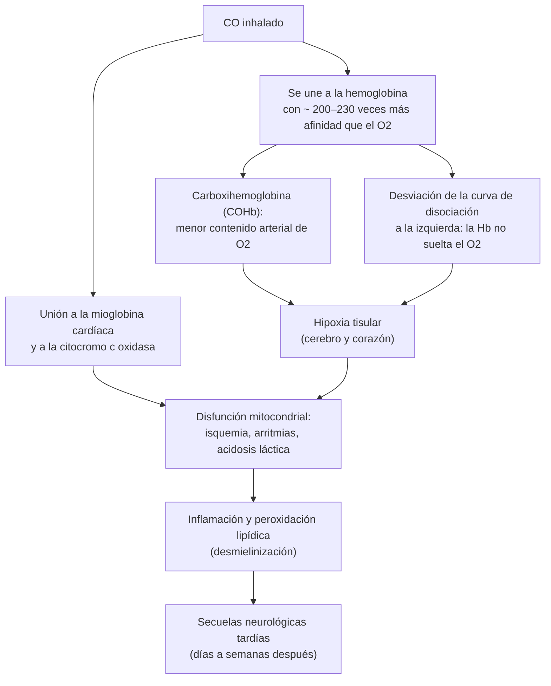
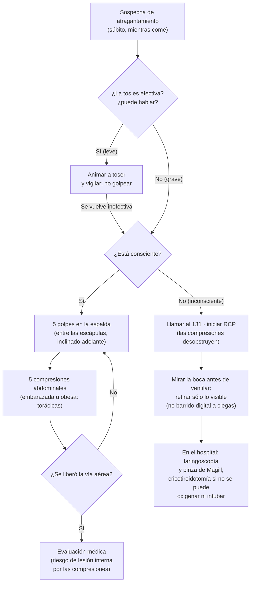

---
tags:
  - Respiratorio
  - Urgencia
---

# Intoxicación por monóxido de carbono, ahogamiento y cuerpo extraño en la vía aérea

**Subespecialidad**
Respiratorio · Toxicología · Medicina de urgencia

**Guías principales**
ACEP 2025: oxígeno hiperbárico en la intoxicación por CO · AHA 2025, parte 10 (circunstancias especiales) y AHA/AAP 2024 (ahogamiento) · ERC 2025: circunstancias especiales, soporte vital básico y primeros auxilios (atragantamiento) · AHA 2025, parte 7 (soporte vital básico del adulto)

**Otras fuentes**
Recomendaciones de Hampson et al. (*Am J Respir Crit Care Med* 2012) · Ensayo de Weaver (*NEJM* 2002) · Revisión Cochrane 2011 · Clasificación de Szpilman (*Chest* 1997) · Serie de cuerpos extraños de Sehgal (*Respir Care* 2015) · Poblete et al., Urgencia UC (*Rev Chil Med Intensiva* 2005)

**GES**
No

**EUNACOM**
1.05.1.024 Intoxicación leve por CO y otros gases (específico, completo, completo) · 1.05.2.010 Intoxicación por monóxido de carbono (específico, completo, completo) · 1.05.2.001 Asfixia por inmersión (específico, completo, completo) · 1.05.2.002 Aspiración de cuerpo extraño con asfixia (específico, completo, completo) · 1.05.2.003 Aspiración de cuerpo extraño sin asfixia (específico, inicial, derivar)

**Revisado**
Septiembre 2026

!!! abstract "Resumen en 60 segundos"
    - **Monóxido de carbono (CO)**: gas **incoloro e inodoro** de la combustión incompleta (**braseros**, estufas, **calefont** mal ventilado, incendios). Es "**el gran simulador**".
        - Se presenta con **cefalea**, mareo, náuseas y compromiso de conciencia, a menudo en **varias personas (o mascotas) de la misma casa**, en **invierno**.
        - El **oxímetro de pulso marca normal**: el diagnóstico es con la **carboxihemoglobina (COHb)** por **co-oximetría**.
        - Tratamiento: **oxígeno al 100 %** con mascarilla con reservorio **de inmediato**, sin esperar el examen (baja la vida media de la COHb de **~ 320 a ~ 80 min**).
        - **Cámara hiperbárica** en casos graves seleccionados (pérdida de conciencia, déficit neurológico, isquemia cardíaca, acidosis, COHb > 25 %, embarazo), según la **disponibilidad** (ACEP 2025).
        - Pedir **ECG y troponina** y controlar las **secuelas neurológicas tardías**.
    - **Ahogamiento**: el paro es **hipóxico**, así que la **ventilación es la prioridad**.
        - Dar **5 ventilaciones iniciales** (con O2 al 100 % si está disponible) y luego RCP estándar (ERC 2025). **No** intentar "sacar el agua" de los pulmones.
        - Todo paciente que requirió **cualquier** maniobra de reanimación va al **servicio de urgencia**.
        - La **clasificación de Szpilman** (grados 1–6) orienta el manejo y el pronóstico.
    - **Atragantamiento (obstrucción de la vía aérea por cuerpo extraño)**:
        - **Tos efectiva**: animar a toser.
        - **Grave y consciente**: **5 golpes en la espalda + 5 compresiones abdominales**, alternando (ERC 2025 y, desde 2025, también la AHA).
        - **Inconsciente**: **RCP**. **No hacer barrido digital a ciegas.**
    - **Cuerpo extraño sin asfixia**: sospecharlo ante tos persistente, **sibilancia localizada** o **neumonía que no resuelve** tras un atoro. Se extrae por **broncoscopía** (derivar).

## Definición

- **Intoxicación por monóxido de carbono**: síntomas y daño tisular por inhalar CO, un gas **incoloro, inodoro e insípido** que se produce en la **combustión incompleta** de materiales con carbono.
- **Otros gases**:
    - **Irritantes**: cloro, amoníaco, cloraminas, humo. Dañan la vía aérea y el pulmón.
    - **Asfixiantes químicos**: CO, **cianuro** (incendios). Impiden el transporte o el uso del oxígeno.
    - **Asfixiantes simples**: desplazan el oxígeno del aire (por ejemplo, gas en espacios confinados).
- **Ahogamiento**: **proceso** de sufrir un **deterioro respiratorio** por **sumersión o inmersión en un líquido**. Su desenlace puede ser la muerte, la morbilidad o la recuperación sin secuelas (definición de consenso de la OMS y el estilo Utstein).
    - Ya **no se usan** los términos "casi ahogamiento", "ahogamiento seco o húmedo" ni "ahogamiento secundario".
- **Obstrucción de la vía aérea por cuerpo extraño (OVACE)**:
    - **Leve**: el paciente **tose en forma efectiva** y puede hablar.
    - **Grave**: **no puede hablar**, la tos es **inefectiva** o ausente, se toma el cuello con las manos y aparece **cianosis**.
- **Aspiración de cuerpo extraño sin asfixia**: el objeto pasa la glotis y se aloja en un **bronquio**, habitualmente del lado **derecho**.

## Epidemiología

### Mundial

- **CO**: es una causa principal de muerte por intoxicación **involuntaria** (en Estados Unidos, ~ 40 000 consultas al año). Hasta **un tercio** de los casos **no se diagnostica**, porque los síntomas son inespecíficos.
    - En la intoxicación **moderada a grave**, el **37 %** tiene **daño miocárdico** (Henry, 2006).
- **Ahogamiento** (OMS, 2026):
    - **~ 300 000 muertes al año**; el **92 %** en países de ingresos bajos y medios.
    - Los **menores de 5 años** son casi **un cuarto** de las muertes; los **hombres** se ahogan **más del doble** que las mujeres.
    - Factores de riesgo: **alcohol**, pobreza, no saber nadar, trabajo en el agua (pesca), inundaciones.
- **Cuerpo extraño en el adulto**: es **poco frecuente** (~ **0,24 %** de las broncoscopías flexibles; Sehgal, 2015).
    - Cerca de **4 de cada 10** pacientes tienen una **alteración de los reflejos protectores de la vía aérea**: enfermedad neurológica, trauma con pérdida de conciencia, sedantes o alcohol (Limper, 1990).

### Chile

!!! chile "Contexto nacional"
    - **CO**: su incidencia real en Chile **se desconoce** por el subregistro (Poblete, Urgencia UC, 2005). Predomina en **otoño e invierno**.
        - Fuentes típicas: **braseros**, estufas a gas o parafina, **calefont** en baños sin ventilación y cocinas a leña.
        - En **Magallanes** se registraron **113 accidentes** por CO entre **1986 y 2017**, con **182 lesionados** y **29 fallecidos** (SEREMI de Salud y SEC, 2017).
    - **Ahogamiento en adolescentes (10–19 años), 1997–2017**: **1339 muertes** (tasa media **1,98 por 100 000**) (Godoy Veas, 2024).
        - Razón hombre:mujer de **6:1**; **2,6 veces** más frecuente en zonas **rurales**.
        - El **77,8 %** ocurrió entre **noviembre y febrero**.
        - Tasas más altas en **Aysén** (11,87), **Los Lagos** (5,66) y **La Araucanía** (3,89) por 100 000, lo que refleja el peso de **ríos y lagos**.
    - **CITUC** (Centro de Información Toxicológica UC) atiende consultas toxicológicas **gratuitas las 24 horas**: **+56 2 2635 3800**. En 2023 recibió **32 731** casos de intoxicación.
    - El **SAMU** se llama al **131**.

## Etiología y factores de riesgo

| Cuadro | Causas y factores de riesgo |
|---|---|
| **CO** | **Braseros** y estufas en piezas cerradas; **calefont** mal instalado o en el baño; generadores y motores en espacios cerrados (garaje); **incendios** (junto con **cianuro**); intento suicida. Mayor riesgo en **embarazadas** (el feto), cardiópatas, niños y adultos mayores |
| **Otros gases** | Mezclar **cloro doméstico** (hipoclorito) con **ácidos** (ácido muriático, limpiadores de baño), que libera **cloro gaseoso**, o con **amoníaco**, que libera **cloraminas**; accidentes industriales; **humo** |
| **Ahogamiento** | **Alcohol** y drogas; no saber nadar; falta de supervisión de niños; **epilepsia**; arritmias (QT largo) o síncope en el agua; **clavados** en aguas poco profundas (trauma cervical); hipotermia; ríos, lagos, piscinas y mar |
| **Cuerpo extraño** | **Trastorno de la deglución** (ACV, Parkinson, demencia); **alcohol y sedantes**; edad avanzada; prótesis dentales; comer rápido y hablar (el bolo de **carne** es el clásico del adulto); procedimientos dentales; sostener alfileres o clavos con la boca |

## Fisiopatología

*Figura 1. Fisiopatología de la intoxicación por monóxido de carbono. Esquema propio.*

- **CO**:
    - La **PaO2 es normal** (el CO no altera el O2 disuelto). El **oxímetro de pulso convencional** lee la COHb como si fuera oxihemoglobina, así que **marca normal**.
    - El nivel de COHb **no se correlaciona bien** con la gravedad ni con las secuelas: depende del tiempo desde la exposición y del oxígeno recibido en el traslado.
- **Ahogamiento**:
    - Al sumergirse, la víctima **contiene la respiración** hasta que **aspira** agua. El agua **lava el surfactante**, produce alveolitis y **edema pulmonar**, colapso alveolar y **shunt**.
    - El resultado es **hipoxemia**, que lleva a bradicardia, **paro hipóxico** y daño cerebral.
    - La diferencia entre agua **dulce y salada** **no tiene importancia clínica** (se aspiran volúmenes pequeños).
    - El **agua muy fría** puede proteger el cerebro (la hipotermia baja el consumo de oxígeno), por lo que la reanimación puede ser exitosa tras sumersiones prolongadas.
- **Cuerpo extraño**:
    - Si obstruye la **laringe o la tráquea**, produce **asfixia** en minutos.
    - Si pasa a un **bronquio** (el **derecho**, más vertical y ancho), produce **atelectasia**, atrapamiento aéreo, **neumonía postobstructiva** y, si se prolonga, **bronquiectasias**.

## Clasificación

**Intoxicación por CO (según la clínica, no según la COHb)**

| Gravedad | Hallazgos |
|---|---|
| **Leve** | Cefalea, mareo, náuseas, vómitos, fatiga; examen neurológico normal |
| **Moderada** | Confusión, **ataxia**, letargia, síncope, dolor torácico, disnea, taquicardia |
| **Grave** | **Pérdida de conciencia**, coma, **convulsiones**, déficit focal, **isquemia miocárdica** o arritmias, **acidosis metabólica**, hipotensión, edema pulmonar |

**Ahogamiento: clasificación de Szpilman** (1831 víctimas rescatadas en el mar de Río de Janeiro)

| Grado | Hallazgo en el rescate | Mortalidad (1997) | Conducta |
|---|---|---|---|
| **Rescate** | Sin tos, espuma ni disnea | 0 % | Evaluar y dar de alta en el lugar |
| **1** | **Tos** con auscultación **normal** | 0 % | Reposo y abrigo; alta si no hay otro problema |
| **2** | **Crepitaciones** en algunos campos | 0,6 % | O2 en bajo flujo y **observación** en la urgencia |
| **3** | **Edema pulmonar** sin hipotensión | 5,2 % | O2 en alto flujo, VMNI o intubación; **UCI** |
| **4** | **Edema pulmonar con hipotensión** | 19,4 % | Lo anterior más volumen y vasoactivos; **UCI** |
| **5** | **Paro respiratorio** aislado (con pulso) | 44 % | **Ventilar** de inmediato; UCI |
| **6** | **Paro cardiorrespiratorio** | 93 % | **RCP** (ventilación primero); UCI |

En una serie francesa más reciente, con rescate precoz y atención especializada (Markarian, 2020), la mortalidad de los grados 2 a 5 fue muy baja y la del **grado 6** fue de **54 %**. El paro sigue siendo el principal factor pronóstico.

**Obstrucción de la vía aérea por cuerpo extraño**

| Tipo | Signos | Conducta |
|---|---|---|
| **Leve** | Tose con fuerza, puede hablar, respira | **Animar a toser**; vigilar; no golpear |
| **Grave, consciente** | No puede hablar, **tos inefectiva**, estridor o silencio, cianosis | **5 golpes en la espalda + 5 compresiones abdominales**, alternando |
| **Grave, inconsciente** | No responde | **RCP**; llamar al **131** |

## Clínica

- **Intoxicación por CO**:
    - **Cefalea** (el síntoma más frecuente), **mareo**, **náuseas y vómitos**, fatiga, **somnolencia**, síncope, dificultad para concentrarse.
        - Sólo **~ 6 %** consulta con compromiso de conciencia, pero **~ 43 %** tiene confusión o dificultad para concentrarse (Poblete, 2005).
    - Grave: **convulsiones**, coma, **dolor torácico**, arritmias, hipotensión.
    - **Claves epidemiológicas**:
        - **Varios afectados** en la misma casa, incluidas las **mascotas**.
        - Síntomas que **mejoran al salir** de la casa y reaparecen al volver.
        - **Invierno**, uso de brasero, estufa o calefont.
        - El "cuadro viral" o la "intoxicación alimentaria" de toda la familia.
    - El color **"rojo cereza"** de la piel es **raro y tardío**: no sirve para descartar.
    - **Secuelas neurológicas tardías**: aparecen **días a semanas** después, tras un período de mejoría.
        - Se manifiestan como **deterioro cognitivo**, cambios de personalidad, **parkinsonismo**, incontinencia o trastornos de la marcha.
        - Sin cámara hiperbárica, el **42 %** tuvo secuelas cognitivas a las **6 semanas** (Weaver, 2007).
- **Otros gases irritantes** (cloro, amoníaco):
    - Síntomas inmediatos: ardor de ojos y garganta, **tos**, disfonía, **broncoespasmo**, disnea.
    - Los gases **poco solubles** (fosgeno, óxidos de nitrógeno) dan pocos síntomas iniciales y **edema pulmonar diferido** (horas).
- **Ahogamiento**:
    - Tos, disnea, **crepitaciones**, espuma en la boca, **hipoxemia**, vómitos (frecuentes durante la reanimación), compromiso de conciencia, **hipotermia**, paro.
    - Buscar la **causa** del ahogamiento (crisis epiléptica, síncope, arritmia, hipoglicemia, alcohol, **trauma cervical**).
- **Cuerpo extraño con asfixia**:
    - Inicio **súbito** mientras **come** (o en un niño que juega).
    - **No puede hablar** ni toser en forma efectiva; se toma el cuello; estridor o silencio; **cianosis**; luego pérdida de conciencia.
- **Cuerpo extraño sin asfixia** (bronquial):
    - Episodio de **atoro** o tos brusca (que el paciente puede **no recordar**, sobre todo si es un adulto mayor o tiene un trastorno neurológico).
    - Luego **tos persistente**, **sibilancia localizada** (unilateral), disminución del murmullo.
    - **Neumonía recurrente o que no resuelve** en el **mismo lóbulo**, atelectasia o hemoptisis.

!!! alarma "Signos de alarma"
    - **Compromiso de conciencia**, convulsiones o **déficit neurológico** en un intoxicado por CO.
    - **Dolor torácico**, cambios en el ECG, **troponina elevada** o arritmias.
    - **Embarazada** expuesta a CO, aunque tenga pocos síntomas.
    - Víctima de un **incendio** con compromiso de conciencia, hipotensión o **lactato muy elevado**: sospechar **cianuro**.
    - Quemaduras faciales, hollín en la boca, **estridor** o disfonía tras un incendio: **vía aérea en riesgo** (intubar precozmente).
    - Ahogamiento con **crepitaciones, hipoxemia** o edema pulmonar (grado ≥ 3), o cualquier víctima que requirió **reanimación**.
    - Atragantamiento con **tos inefectiva**, incapacidad de hablar o **cianosis**: actuar **ya**.

## Diagnóstico

- **Intoxicación por CO**:
    - Se sospecha por la **historia de exposición** y se confirma con la **COHb** por **co-oximetría** (gases venosos o arteriales).
    - COHb basal: **2–3 %** en no fumadores y más alta en fumadores. Un nivel elevado **confirma la exposición**, pero **no mide la gravedad**.
    - El **oxímetro de pulso convencional no sirve**: marca normal. En la co-oximetría, la saturación medida es baja aunque la **PaO2 sea normal**.
- **Ahogamiento**: el diagnóstico es clínico. Lo importante es **clasificar la gravedad** (Szpilman) y buscar causas y lesiones asociadas.
- **Cuerpo extraño**:
    - **Con asfixia**: diagnóstico **clínico**, sin exámenes.
    - **Sin asfixia**:
        - **Radiografía de tórax**: la mayoría de los cuerpos extraños orgánicos son **radiolúcidos**. Buscar signos indirectos (atelectasia, **atrapamiento aéreo**, consolidación).
        - **TC de tórax**, más sensible.
        - La **broncoscopía** confirma y extrae.

!!! guia "¿Cuándo considerar el oxígeno hiperbárico?"
    - **ACEP 2025** (recomendación de nivel C): en la intoxicación **sintomática** por CO, **pacientes seleccionados pueden beneficiarse** del oxígeno hiperbárico según la **gravedad** de los síntomas y su **disponibilidad** (distancia y tiempo).
    - **Criterios de intoxicación grave** (Hampson et al., 2012): **pérdida de conciencia**, **cambios isquémicos cardíacos**, **déficit neurológico**, **acidosis metabólica significativa** o **COHb > 25 %**.
    - **Factores de riesgo de secuelas cognitivas** (Weaver, 2007): **edad ≥ 36 años**, **exposición ≥ 24 horas**, pérdida de conciencia y COHb ≥ 25 %.
    - **Embarazo**: umbral más bajo, porque el feto es más vulnerable.
    - La evidencia es **discutida**:
        - El ensayo de **Weaver (2002)** mostró menos secuelas cognitivas a 6 semanas con **3 sesiones en 24 h** (**25 % vs. 46 %**).
        - La **revisión Cochrane (2011)** no encontró un beneficio significativo (OR 0,78; IC 95 % 0,54–1,12), por ensayos heterogéneos y con sesgos.
    - En la práctica: iniciar **O2 al 100 %** de inmediato y **consultar** con el centro hiperbárico de referencia y con **CITUC**. No retrasar la estabilización por el traslado.

## Laboratorio

- **Intoxicación por CO**:
    - **COHb** (co-oximetría).
    - **Gases y lactato**: acidosis láctica en los casos graves.
    - **ECG y troponina** en la intoxicación moderada a grave: el daño miocárdico se asoció a **el doble de mortalidad a largo plazo** (38 % vs. 15 %; Henry, 2006).
    - **CK** (rabdomiólisis), electrolitos, función renal, glicemia.
    - **β-hCG** en mujeres en edad fértil.
    - **Screening toxicológico** y **alcoholemia** si es un intento suicida (coingestión).
- **Ahogamiento**:
    - **Gases arteriales** (hipoxemia, acidosis), lactato.
    - **Glicemia**, electrolitos (las alteraciones importantes son raras), alcoholemia.
    - **Temperatura central**.
    - **ECG** (arritmia o QT largo como causa) y troponina.
- **Gases irritantes**: gases arteriales si hay disnea; radiografía si hay hipoxemia o crepitaciones.

## Imágenes

- **CO grave**: la **TC o la RM de cerebro** pueden mostrar lesiones bilaterales del **globo pálido** y, en las secuelas tardías, **leucoencefalopatía** de la sustancia blanca. No sirven para el diagnóstico agudo.
- **Ahogamiento**:
    - **Radiografía de tórax**: infiltrados bilaterales (edema) o normal. Puede empeorar en las primeras horas.
    - **TC de columna cervical** si hubo **clavado**, caída o signos de trauma.
- **Cuerpo extraño sin asfixia**:
    - **Radiografía** en inspiración y espiración (atrapamiento aéreo del lado afectado).
    - **TC de tórax**, que muestra el objeto, la atelectasia o la neumonía.

<figure markdown>
{ loading=lazy }
<figcaption>Figura 2. Eliminación de la carboxihemoglobina con aire ambiente (vida media ~ 320 min), oxígeno al 100 % normobárico (~ 80 min) y oxígeno hiperbárico a 2–3 ATA (~ 23 min). Esquema propio basado en las vidas medias citadas por Poblete et al. (2005).</figcaption>
</figure>

## Diagnóstico diferencial

| Diagnóstico | Qué lo distingue |
|---|---|
| **Cuadro viral o gastroenteritis** | Fiebre, contagio progresivo (no simultáneo); sin fuente de combustión; COHb normal |
| **Migraña o cefalea tensional** | Historia previa similar; un solo afectado; no mejora al salir de la casa |
| **Intoxicación por cianuro** (incendios) | **Lactato muy alto**, shock, coma; puede coexistir con el CO |
| **Metahemoglobinemia** | SpO2 ~ 85 % que **no sube con O2**, sangre "color chocolate"; antecedente de fármacos (dapsona, anestésicos locales, nitritos) |
| **Otras intoxicaciones** (alcohol, benzodiazepinas, opioides) | Antecedente; miosis o toxidrome; COHb normal |
| **ACV, hipoglicemia, crisis epiléptica** | Déficit focal, glicemia baja, TC; considerar además que pueden **causar** un ahogamiento |
| **Asma o anafilaxia** (vs. cuerpo extraño) | Sibilancias **difusas** y bilaterales; urticaria o angioedema en la anafilaxia |
| **Neumonía o tumor endobronquial** (vs. cuerpo extraño) | Sin antecedente de atoro; la broncoscopía los distingue |

## Tratamiento

### Intoxicación por CO

1. **Sacar al paciente de la fuente** (con la seguridad del rescatador primero: ventilar el lugar, no entrar sin protección).
2. **Oxígeno al 100 %** con **mascarilla con reservorio a 15 L/min** (o por tubo si está intubado), **de inmediato** y **sin esperar** la COHb.
    - Mantenerlo hasta que los **síntomas desaparezcan** y la **COHb sea normal** (habitualmente varias horas).
3. **ABC**: intubar si hay coma o no protege la vía aérea; tratar las **convulsiones** con benzodiazepinas.
4. **ECG, troponina y monitorización**. Tratar la isquemia y las arritmias.
5. **Oxígeno hiperbárico** en los casos graves seleccionados (ver el recuadro de diagnóstico), si se puede hacer en forma **oportuna** y segura.
6. **Víctima de un incendio** con compromiso de conciencia, shock o lactato muy alto: **hidroxocobalamina** empírica por el **cianuro**.
7. **Embarazada**: O2 al 100 % por **más tiempo** (la COHb fetal se elimina más lento), umbral bajo para la cámara hiperbárica y evaluación obstétrica.
8. **Alta** (intoxicación leve): con el paciente **asintomático** y con la **fuente de CO eliminada**.
    - **No volver** a la casa hasta que se revise la instalación (técnico autorizado por la SEC).
    - Educación a la familia; **evaluar a los demás convivientes**.
    - **Control a las 4–6 semanas** para pesquisar las secuelas neurológicas tardías.
    - Si fue un **intento suicida**: evaluación por **psiquiatría** antes del alta.

### Otros gases irritantes

- Retirar de la exposición y **descontaminar**: quitar la ropa, lavar la piel y **irrigar los ojos**.
- **Oxígeno humidificado** si hay disnea o hipoxemia.
- **Broncodilatadores**: salbutamol, con o sin ipratropio.
- **Observar** a los expuestos a gases poco solubles por el riesgo de **edema pulmonar diferido**.
- Los **antibióticos profilácticos no sirven**. El papel de los **corticoides** es incierto (Huynh Tuong, 2019).
- Educar: **nunca mezclar cloro** con ácidos (limpiadores de baño, ácido muriático) ni con **amoníaco**.

### Ahogamiento (ERC 2025, AHA 2025 y AHA/AAP 2024)

- **Seguridad del rescatador**: lanzar un elemento de flotación y no entrar al agua sin entrenamiento.
- **Inmovilización cervical sólo si hay sospecha de trauma** (clavado, caída, signos de lesión). **No debe retrasar** la extracción ni la reanimación.
- **Si no respira normalmente**:
    - **5 ventilaciones iniciales** (con **O2 al 100 %** si está disponible).
    - Luego **RCP estándar** 30:2 y **DEA** (secar el tórax antes de poner los parches).
    - Con bolsa-mascarilla, usar presiones bajas para no insuflar el estómago.
- **No hacer compresiones abdominales** ni maniobras para "drenar el agua": retrasan la ventilación y favorecen el vómito y la aspiración.
- Si **vomita**: lateralizar y aspirar.
- **Todo paciente que requirió cualquier reanimación**, aunque sólo hayan sido ventilaciones, se **traslada al servicio de urgencia** (AHA/AAP 2024).
- **En el hospital**:
    - **O2** según la saturación. En el edema pulmonar (grados 3–4): **CPAP o VMNI** o **intubación** con **PEEP**, con ventilación protectora como en el **SDRA**.
    - **Hipotermia**: recalentar. En el **paro con hipotermia**, considerar **ECMO venoarterial** (ECPR) según los protocolos locales.
    - **Antibióticos** sólo si hay **neumonía** (no en forma profiláctica).
    - Buscar y tratar la **causa** (alcohol, crisis, arritmia, trauma).
- **Grado 1** (sólo tos, auscultación normal): puede irse de alta tras la evaluación. **Grado 2**: observar en la urgencia. **Grado ≥ 3**: hospitalizar en la **UCI**.

### Obstrucción de la vía aérea por cuerpo extraño

*Figura 3. Manejo de la obstrucción de la vía aérea por cuerpo extraño en el adulto. Esquema propio basado en las guías ERC 2025 y AHA 2025.*

- **AHA 2025**: por primera vez recomienda para el adulto **alternar 5 golpes en la espalda y 5 compresiones abdominales**, igual que el ERC. Antes, la AHA indicaba sólo compresiones abdominales.
- Toda persona tratada con **compresiones abdominales** o torácicas debe ser **evaluada por un médico**: pueden causar lesiones viscerales.

### Cuerpo extraño sin asfixia

- Paciente **estable**: **no hacer maniobras** de desobstrucción (pueden movilizar el objeto a la tráquea).
- Oxígeno si lo requiere; radiografía y **TC**.
- **Derivar** para una **broncoscopía**:
    - La **flexible** es el procedimiento inicial preferido en el adulto (éxito de **~ 90 %** en la revisión de Sehgal, 2015).
    - La **rígida** se usa si falla la flexible o si el objeto es grande o está impactado (éxito en 43 de 44 casos en la serie de Limper, 1990).
    - La **cirugía** es excepcional.
- **Antibióticos** si hay neumonía postobstructiva.

!!! dosis "Dosis y parámetros"
    - **Oxígeno al 100 %**: mascarilla con **reservorio** a **15 L/min** (FiO2 alta, aunque menor de 1,0) o FiO2 1,0 por el tubo endotraqueal.
    - **Oxígeno hiperbárico** (si está indicado): sesiones a **2–3 ATA**. En el ensayo de Weaver se hicieron **3 sesiones en 24 h**.
    - **Hidroxocobalamina** (sospecha de cianuro en un incendio): **5 g EV en 15 min** (niños: 70 mg/kg). Se puede repetir una segunda dosis de 5 g según la respuesta. Tiñe de rojo la piel y la orina e interfiere con algunos exámenes, incluida la co-oximetría.
    - **Convulsiones**: lorazepam 4 mg EV o midazolam 10 mg IM (ver el resumen de crisis epilépticas).
    - **Broncoespasmo por gases irritantes**: salbutamol 4–8 inhalaciones (100 µg c/u) con aerocámara, o nebulizado, c/20 min por 3 veces; se puede agregar bromuro de ipratropio.

## Complicaciones

- **CO**:
    - **Secuelas neurológicas tardías** (cognitivas, afectivas, **parkinsonismo**).
    - **Daño miocárdico** y arritmias.
    - **Rabdomiólisis** y lesión renal aguda.
    - **Neumonía aspirativa**.
    - **Muerte fetal** o daño fetal.
- **Gases irritantes**: **SDRA**, síndrome de disfunción reactiva de la vía aérea (asma inducida por irritantes), bronquiolitis obliterante.
- **Ahogamiento**:
    - **SDRA** y **neumonía** (sobre todo con agua contaminada).
    - **Encefalopatía hipóxico-isquémica**.
    - Arritmias, **hipotermia**.
    - **Lesión medular cervical** (clavados).
    - Lesión renal aguda.
- **Cuerpo extraño**:
    - **Neumonía postobstructiva**, atelectasia, absceso pulmonar, **bronquiectasias** (impactación prolongada).
    - Paro hipóxico.
    - Lesiones por las maniobras (fracturas costales, lesión visceral por las compresiones abdominales).

## Pronóstico y seguimiento

- **CO**:
    - La mayoría de las intoxicaciones leves se recupera **sin secuelas** con O2 normobárico.
    - El riesgo de **secuelas cognitivas** es mayor con **edad ≥ 36 años**, **exposición ≥ 24 h**, **pérdida de conciencia** y **COHb ≥ 25 %** (Weaver, 2007).
    - El **daño miocárdico** duplica la mortalidad a largo plazo (HR ajustado **2,1**; Henry, 2006).
    - **Control a las 4–6 semanas** con evaluación cognitiva (y derivar a **neurología** si hay secuelas).
- **Ahogamiento**:
    - El pronóstico depende del **tiempo de sumersión** (peor si es **> 10 minutos**, ERC 2025), de la **rapidez de la ventilación**, de la **temperatura del agua** y del **grado de Szpilman**.
    - El **paro** (grado 6) es el principal factor de mal pronóstico.
- **Cuerpo extraño**: con una broncoscopía oportuna, el pronóstico es **excelente**.
    - Tras la extracción, **evaluar la deglución** (fonoaudiología) en el adulto mayor o el paciente neurológico, para **prevenir** un nuevo episodio.
- **Prevención** (la intervención más eficaz en los tres cuadros):
    - **CO**: mantención anual de los artefactos a gas; **no usar braseros ni estufas en piezas cerradas**; no instalar el calefont en el baño; **detectores de CO**.
    - **Ahogamiento**: **supervisión** de los niños, cercado de piscinas, **chaleco salvavidas**, no bañarse con alcohol, enseñar a nadar.
    - **Cuerpo extraño**: dieta adaptada y supervisión de la alimentación en pacientes con disfagia.

## Perlas para el internado

!!! perla "Para la sala y el turno"
    - **Una SpO2 de 99 % no descarta el CO.** Si sospechas CO, pide **COHb** en los gases (co-oximetría) y pon **O2 al 100 %** de inmediato.
    - "**Toda la familia con cefalea y vómitos en invierno**" (o la mascota decaída) = CO hasta demostrar lo contrario. Pregunta por el **brasero, la estufa y el calefont**.
    - Una **COHb baja** en un paciente que llegó tras 1 hora con O2 **no descarta** una intoxicación grave: **manda la clínica**.
    - En el **CO moderado o grave**, pide **ECG y troponina**, y en la mujer joven, **β-hCG**.
    - Un paciente con **CO grave y compromiso de conciencia** no se da de alta sin evaluar el oxígeno hiperbárico y sin coordinar con **CITUC** (+56 2 2635 3800).
    - En el **ahogamiento**, primero **ventilar** (5 ventilaciones), después comprimir. **No** se "saca el agua" de los pulmones.
    - Si el ahogado estuvo en **aguas muy frías**, **no suspendas la reanimación** hasta recalentar ("nadie está muerto hasta que esté caliente y muerto").
    - Atragantamiento: **si tose bien, no lo toques**; si no puede toser ni hablar, **5 golpes en la espalda + 5 compresiones abdominales**.
    - En el adulto mayor con **neumonía del lóbulo inferior derecho que no resuelve**, pregunta por un **atoro** y piensa en un **cuerpo extraño**.
    - **Nunca mezclar cloro con ácido muriático ni con amoníaco**: es una consulta frecuente por "intoxicación con gases" en el hogar.

## Preguntas de repaso

??? repaso "1. Una madre y sus dos hijos consultan en julio por cefalea, mareo y vómitos desde la mañana. El perro también está decaído. Anoche usaron un brasero en el dormitorio. La SpO2 es de 98 % en todos. ¿Qué haces?"
    **Sospecha de intoxicación por CO en un grupo familiar.**

    - **O2 al 100 %** con mascarilla con reservorio a 15 L/min a **los tres, de inmediato**, sin esperar exámenes.
    - **COHb por co-oximetría** (la **SpO2 normal no descarta**: el oxímetro lee la COHb como oxihemoglobina).
    - Examen neurológico; **ECG y troponina** si hay dolor torácico o la intoxicación es moderada a grave; **β-hCG** a la madre.
    - Evaluar los criterios de **cámara hiperbárica** (pérdida de conciencia, déficit neurológico, isquemia, acidosis, COHb > 25 %, embarazo).
    - **Alta** sólo asintomáticos, **sin volver a usar el brasero** en una pieza cerrada; **control** por las secuelas tardías.

??? repaso "2. Hombre de 45 años rescatado de un incendio en su casa. Está somnoliento, con hollín en la nariz y la boca, disfonía, PA 85/50 y lactato de 12 mmol/L. ¿Qué te preocupa y qué haces?"
    **Inhalación de humo** con riesgo de la vía aérea y posible **intoxicación combinada por CO y cianuro**.

    - **Vía aérea**: la disfonía y el hollín sugieren una **lesión térmica de la vía aérea**; **intubación precoz** antes de que el edema la cierre.
    - **O2 al 100 %** (FiO2 1,0).
    - **Hidroxocobalamina 5 g EV** en 15 min, **empírica**: el shock y el lactato muy elevado sugieren **cianuro**.
    - **COHb**, ECG, troponina, CK.
    - Evaluar el **oxígeno hiperbárico** una vez estabilizado, si es factible.

??? repaso "3. En un restaurante, un hombre de 70 años se lleva las manos al cuello mientras come carne. No puede hablar ni toser y está cianótico. ¿Qué haces?"
    **Obstrucción grave de la vía aérea por cuerpo extraño, consciente.**

    1. Pedir ayuda (**131**).
    2. **5 golpes en la espalda** entre las escápulas, con el paciente inclinado hacia adelante.
    3. Si no se resuelve, **5 compresiones abdominales** (Heimlich).
    4. **Alternar** 5 y 5 hasta que se libere o pierda la conciencia (ERC 2025 y AHA 2025).
    5. Si **pierde la conciencia**: acostarlo e **iniciar RCP**. Antes de ventilar, mirar la boca y retirar sólo lo visible (**no barrido a ciegas**).
    6. Si se resuelve: **evaluación médica** (las compresiones abdominales pueden causar lesiones internas).

??? repaso "4. Joven de 19 años sacado de un río tras 3 minutos sumergido. Respira, tiene tos, FR 28, SatO2 89 % y crepitaciones bilaterales, sin hipotensión. ¿Qué grado de Szpilman es y cómo lo manejas?"
    **Grado 3** (edema pulmonar sin hipotensión).

    - **O2 en alto flujo**; si no mejora, **CPAP o VMNI**, o **intubación con PEEP** (ventilación protectora).
    - Hospitalizar en la **UCI**.
    - Gases, lactato, glicemia, electrolitos, **alcoholemia**, temperatura; ECG.
    - **TC cervical** si hubo **clavado** o trauma.
    - **Sin antibióticos profilácticos** (sólo si aparece neumonía).
    - Buscar la causa (alcohol, crisis, arritmia).
    - Mortalidad histórica del grado 3: **~ 5 %**.

??? repaso "5. Mujer de 78 años con enfermedad de Parkinson, con su tercera neumonía del lóbulo inferior derecho en 6 meses. La familia recuerda un episodio de atoro con una prótesis dental. ¿Qué sospechas y qué haces?"
    **Cuerpo extraño bronquial sin asfixia** (bronquio derecho), con **neumonía postobstructiva recurrente**, en una paciente con **trastorno de la deglución**.

    - **TC de tórax** (el objeto puede ser radiolúcido o verse sólo por signos indirectos).
    - **Derivar** para una **broncoscopía** (flexible primero; rígida si falla).
    - **Antibióticos** para la neumonía.
    - **Evaluación de la deglución** por fonoaudiología para prevenir nuevas aspiraciones.

??? repaso "6. Una dueña de casa consulta por tos, ardor ocular y opresión torácica tras limpiar el baño mezclando cloro con un limpiador ácido. SatO2 96 %, sibilancias leves. ¿Qué haces?"
    **Inhalación de cloro gaseoso** (intoxicación leve por gases irritantes).

    - Retirar de la exposición, **quitar la ropa** e **irrigar los ojos** con abundante agua.
    - **Oxígeno humidificado** si hay hipoxemia; **salbutamol** inhalado (con o sin ipratropio).
    - **Observar** unas horas; radiografía si hay hipoxemia o crepitaciones.
    - **Alta** asintomática, con **educación**: nunca mezclar cloro con ácidos ni con amoníaco.
    - Ante dudas, consultar a **CITUC**.

## Referencias

1. American College of Emergency Physicians Clinical Policies Subcommittee on Carbon Monoxide Poisoning; Shih RD, Tomaszewski CA, et al. A critical issue in the management of adult patients presenting to the emergency department with acute carbon monoxide poisoning. *Ann Emerg Med.* 2025;85(4):e45–e59. doi:[10.1016/j.annemergmed.2024.12.005](https://doi.org/10.1016/j.annemergmed.2024.12.005)
2. Hampson NB, Piantadosi CA, Thom SR, Weaver LK. Practice recommendations in the diagnosis, management, and prevention of carbon monoxide poisoning. *Am J Respir Crit Care Med.* 2012;186:1095–1101. doi:[10.1164/rccm.201207-1284CI](https://doi.org/10.1164/rccm.201207-1284CI)
3. Weaver LK, Hopkins RO, Chan KJ, et al. Hyperbaric oxygen for acute carbon monoxide poisoning. *N Engl J Med.* 2002;347:1057–1067. doi:[10.1056/NEJMoa013121](https://doi.org/10.1056/NEJMoa013121)
4. Weaver LK, Valentine KJ, Hopkins RO. Carbon monoxide poisoning: risk factors for cognitive sequelae and the role of hyperbaric oxygen. *Am J Respir Crit Care Med.* 2007;176:491–497. doi:[10.1164/rccm.200701-026OC](https://doi.org/10.1164/rccm.200701-026OC)
5. Buckley NA, Juurlink DN, Isbister G, et al. Hyperbaric oxygen for carbon monoxide poisoning. *Cochrane Database Syst Rev.* 2011;(4):CD002041. doi:[10.1002/14651858.CD002041.pub3](https://doi.org/10.1002/14651858.CD002041.pub3)
6. Henry CR, Satran D, Lindgren B, et al. Myocardial injury and long-term mortality following moderate to severe carbon monoxide poisoning. *JAMA.* 2006;295:398–402. doi:[10.1001/jama.295.4.398](https://doi.org/10.1001/jama.295.4.398)
7. Poblete R, Alvizú S, Bellolio F, Mardónez JM, Saldías F. Series clínicas de medicina de urgencia: intoxicación por monóxido de carbono, el gran simulador. *Rev Chil Med Intensiva.* 2005;20(1):34–37. [urgencia.uc.cl](https://urgencia.uc.cl/htdocs/content/uploads/2021/04/intoxicacion-monoxido-de-carbono-series-clinicas-urgencia-uc-articulo-2005.pdf)
8. Cao D, Arens AM, Chow SL, et al. Part 10: Adult and pediatric special circumstances of resuscitation: 2025 American Heart Association Guidelines for Cardiopulmonary Resuscitation and Emergency Cardiovascular Care. *Circulation.* 2025;152(16 Suppl 2):S578–S672. doi:[10.1161/CIR.0000000000001380](https://doi.org/10.1161/CIR.0000000000001380)
9. Dezfulian C, McCallin TE, Bierens J, et al. 2024 American Heart Association and American Academy of Pediatrics focused update on special circumstances: resuscitation following drowning. *Circulation.* 2024;150:e501–e516. doi:[10.1161/CIR.0000000000001274](https://doi.org/10.1161/CIR.0000000000001274)
10. Lott C, Karageorgos V, Abelairas-Gomez C, et al. European Resuscitation Council Guidelines 2025 special circumstances in resuscitation. *Resuscitation.* 2025;215(Suppl 1):110753. doi:[10.1016/j.resuscitation.2025.110753](https://doi.org/10.1016/j.resuscitation.2025.110753)
11. Smyth MA, van Goor S, Hansen CM, et al. European Resuscitation Council Guidelines 2025 adult basic life support. *Resuscitation.* 2025;215(Suppl 1):110771. doi:[10.1016/j.resuscitation.2025.110771](https://doi.org/10.1016/j.resuscitation.2025.110771)
12. Resuscitation Council UK. First aid guidelines 2025 (atragantamiento) y special circumstances guidelines 2025. [resus.org.uk](https://www.resus.org.uk/professional-library/2025-resuscitation-guidelines/first-aid-guidelines)
13. Kleinman ME, Buick JE, Huber N, et al. Part 7: Adult basic life support: 2025 American Heart Association Guidelines for Cardiopulmonary Resuscitation and Emergency Cardiovascular Care. *Circulation.* 2025;152(16 Suppl 2):S448–S478. doi:[10.1161/CIR.0000000000001369](https://doi.org/10.1161/CIR.0000000000001369)
14. Szpilman D. Near-drowning and drowning classification: a proposal to stratify mortality based on the analysis of 1,831 cases. *Chest.* 1997;112:660–665. doi:[10.1378/chest.112.3.660](https://doi.org/10.1378/chest.112.3.660)
15. Markarian T, Loundou A, Heyer V, et al. Drowning classification: a reappraisal of clinical presentation and prognosis for severe cases. *Chest.* 2020;158:596–602. doi:[10.1016/j.chest.2020.01.035](https://doi.org/10.1016/j.chest.2020.01.035)
16. Szpilman D, Bierens JJ, Handley AJ, Orlowski JP. Drowning. *N Engl J Med.* 2012;366:2102–2110. doi:[10.1056/NEJMra1013317](https://doi.org/10.1056/NEJMra1013317)
17. Organización Mundial de la Salud. Ahogamientos: nota descriptiva (mayo de 2026). [who.int](https://www.who.int/news-room/fact-sheets/detail/drowning)
18. Godoy Veas P, Hatton De Heeckeren M, Espinoza Farías RA, Villalón Calderón MA. Mortalidad por ahogamiento y sumersión no intencional de adolescentes en Chile entre 1997 y 2017 (resumen de congreso). *Medwave.* 2024. [medwave.cl](https://www.medwave.cl/resumenescongreso/SP2024/SP136.html)
19. Ministerio de Salud de Chile. Magallanes: autoridades entregaron recomendaciones para evitar intoxicaciones por monóxido de carbono (mayo de 2017). [minsal.cl](https://www.minsal.cl/magallanes-autoridades-entregaron-recomendaciones-para-evitar-intoxicaciones-por-monoxido-de-carbono/)
20. Sehgal IS, Dhooria S, Ram B, et al. Foreign body inhalation in the adult population: experience of 25,998 bronchoscopies and systematic review of the literature. *Respir Care.* 2015;60:1438–1448. doi:[10.4187/respcare.03976](https://doi.org/10.4187/respcare.03976)
21. Limper AH, Prakash UB. Tracheobronchial foreign bodies in adults. *Ann Intern Med.* 1990;112:604–609. doi:[10.7326/0003-4819-112-8-604](https://doi.org/10.7326/0003-4819-112-8-604)
22. Huynh Tuong A, Despréaux T, Loeb T, et al. Emergency management of chlorine gas exposure: a systematic review. *Clin Toxicol (Phila).* 2019;57:77–98. doi:[10.1080/15563650.2018.1519193](https://doi.org/10.1080/15563650.2018.1519193)
23. Centro de Información Toxicológica UC (CITUC). Reporte anual abreviado 2023. [cituc.uc.cl](https://cituc.uc.cl/reporte-anual-abreviado-cituc-2023/)
