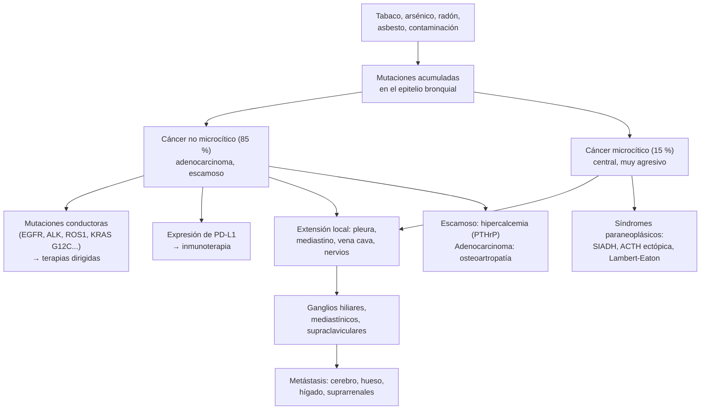
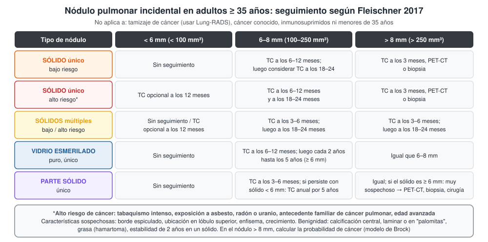
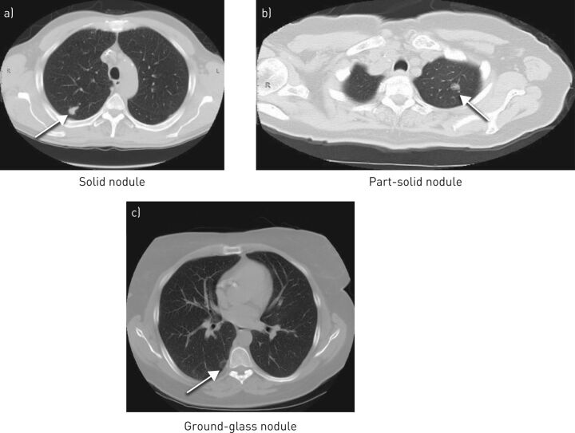

---
tags:
  - Respiratorio
  - GES
---

# Nódulo pulmonar, cáncer pulmonar y metástasis pulmonares

**Subespecialidad**
Broncopulmonar · Oncología · Cirugía de tórax · Radiología · Medicina interna

**Guías principales**
Sociedad Fleischner 2017: nódulos pulmonares incidentales · IASLC 2024: 9.ª edición de la clasificación TNM · USPSTF 2021: tamizaje del cáncer pulmonar · GES n.º 81: cáncer de pulmón en personas de 15 años y más

**Otras fuentes**
NLST (2011) y NELSON (2020): tamizaje con TC de baja dosis · Datos chilenos: arsénico en Antofagasta (Smith 2018), mutaciones de EGFR (Gejman 2019), serie del Hospital Guillermo Grant Benavente (González 2022)

**GES**
Sí: **cáncer de pulmón en personas de 15 años y más (n.º 81)**, con garantías de confirmación diagnóstica, etapificación, tratamiento y seguimiento.

**EUNACOM**
1.05.1.038 Nódulos pulmonares (específico, inicial, derivar) · 1.05.1.007 Cáncer bronquial primario (sospecha, inicial, derivar) · 1.05.1.025 Metástasis pulmonares (sospecha, inicial, derivar)

**Revisado**
Octubre 2026

!!! abstract "Resumen en 60 segundos"
    - **Nódulo pulmonar**: opacidad redondeada **≤ 3 cm** rodeada de pulmón. Más de 3 cm es una **masa** (cáncer hasta demostrar lo contrario).
        - La mayoría de los nódulos incidentales son **benignos**.
        - Manejo según **Fleischner 2017** (adultos ≥ 35 años, sin cáncer conocido): sólido **< 6 mm** de bajo riesgo → **sin seguimiento**; **6–8 mm** → TC a los 6–12 meses; **> 8 mm** → TC a los 3 meses, **PET-CT** o biopsia.
        - El **componente sólido** de un nódulo en vidrio esmerilado es lo que más pesa.
    - **Cáncer pulmonar**: la **segunda causa de muerte por cáncer en Chile** (> 3.000 muertes al año).
        - Factores de riesgo: **tabaco** (~ 85 %), arsénico en el agua (norte de Chile), radón, asbesto, contaminación, EPOC.
        - **No microcítico (85 %)**: adenocarcinoma (el más frecuente), escamoso, células grandes. **Microcítico (15 %)**: central, muy agresivo, en fumadores.
        - En Chile se diagnostica sobre todo en **etapa IV** (70 % en una serie pública).
    - **Sospechar**: tos nueva o que cambia, **hemoptisis**, baja de peso, disnea, dolor torácico, disfonía, síndromes paraneoplásicos, neumonía que no se resuelve en un fumador.
    - **Estudio**: TC de tórax y abdomen superior con contraste → **PET-CT** → **muestra** (broncoscopia, EBUS, punción guiada por TC) → **estudio molecular** (EGFR, ALK y otros) y **PD-L1** → RM cerebral. Etapificar con el **TNM 9.ª edición**.
    - **Tratamiento**:
        - Etapas I–II: **cirugía**, o radioterapia estereotáctica si no se puede operar.
        - Etapa III: tratamiento multimodal.
        - Etapa IV: **terapias dirigidas** o **inmunoterapia** ± quimioterapia.
    - **Tamizaje** (USPSTF 2021): TC de baja dosis anual entre los **50 y 80 años** con **≥ 20 paquetes-año** (fumadores actuales o que dejaron hace < 15 años). Reduce la mortalidad por cáncer pulmonar **20–24 %**.
    - **Metástasis pulmonares**: nódulos **múltiples**, redondos, periféricos y basales, de distinto tamaño ("en suelta de globos"). Primarios frecuentes: colon y recto, mama, riñón, melanoma, sarcomas, cabeza y cuello, testículo, tiroides.

## Definición

- **Nódulo pulmonar**: opacidad redondeada, bien o mal definida, de **≤ 3 cm**, rodeada de parénquima pulmonar.
    - **Sólido**: oculta los vasos y los bronquios.
    - **Subsólido**: en **vidrio esmerilado puro** (no oculta los vasos) o **parte sólido** (mixto).
    - **Micronódulo**: < 3 mm.
- **Masa pulmonar**: lesión **> 3 cm**; la mayoría son malignas.
- **Nódulo incidental**: hallado en una imagen pedida por otro motivo (se maneja según Fleischner). El nódulo hallado en el **tamizaje** de cáncer se maneja con **Lung-RADS**.
- **Cáncer pulmonar** (carcinoma broncogénico): tumor maligno del epitelio bronquial o alveolar.
    - **Cáncer no microcítico** (no células pequeñas): adenocarcinoma, carcinoma escamoso, carcinoma de células grandes.
    - **Cáncer microcítico** (células pequeñas): neuroendocrino de alto grado.
- **Metástasis pulmonares**: implantes en el pulmón de un tumor de otro órgano (vía hematógena o linfática).

## Epidemiología

### Mundial

- El cáncer pulmonar es la **primera causa de muerte por cáncer** en el mundo.
- **Tabaco**: responsable de la gran mayoría de los casos; el riesgo aumenta con los paquetes-año y baja lentamente tras dejar de fumar.
- Proporción creciente de **adenocarcinoma**, de **mujeres** y de **no fumadores** (con más mutaciones de *EGFR*, en especial en asiáticos).
- **Nódulos incidentales**: muy frecuentes en las TC de tórax; la gran mayoría son **benignos** (granulomas, ganglios intrapulmonares, hamartomas). La probabilidad de cáncer aumenta con el **tamaño**, el componente sólido, el borde espiculado y la ubicación en el lóbulo superior.
- **Tamizaje con TC de baja dosis**:
    - **NLST (2011)**: **20 %** menos mortalidad por cáncer pulmonar y **6,7 %** menos mortalidad total frente a la radiografía. El **96 %** de los resultados positivos fueron falsos positivos.
    - **NELSON (2020)**: razón de mortalidad por cáncer pulmonar de **0,76** a 10 años en hombres (0,67 en mujeres).

### Chile

!!! chile "Datos nacionales"
    - El cáncer pulmonar es la **segunda causa de muerte por cáncer** en Chile, con **más de 3.000 muertes al año** (Gejman 2019).
    - **Arsénico en el agua potable** (Región de Antofagasta): la ciudad tuvo concentraciones muy altas entre 1958 y 1970. Entre 2001 y 2010, **40 años** después de reducir la exposición, la mortalidad por cáncer pulmonar seguía **3,4 veces** mayor en los hombres y **2,4 veces** en las mujeres que en el resto del país (Smith 2018). Es una de las latencias más largas conocidas para un carcinógeno.
    - **Mutaciones de *EGFR***: **21,7 %** de 1.381 pacientes de un centro de Santiago, sobre todo **mujeres**, **adenocarcinomas** y **no fumadores o fumadores leves**. La más frecuente fue la deleción del **exón 19** (Gejman 2019).
    - **Diagnóstico tardío** (González 2022, Hospital Guillermo Grant Benavente, Concepción, 551 casos entre 2010 y 2019):
        - **70 %** de los no microcíticos estaba en **etapa IV** y solo 10 % en etapa I.
        - Sobrevida global a 5 años: **18 %**; **88 %** en la etapa I.
        - La cirugía con intención curativa subió de 7 % a 20 % entre 2010–2014 y 2015–2019.
    - **GES n.º 81** (desde 2019): cubre la confirmación diagnóstica, la etapificación, el tratamiento y el seguimiento desde los 15 años.
    - Chile aún no tiene un programa nacional de tamizaje con TC de baja dosis.

## Etiología y factores de riesgo

| Factor | Comentario |
|---|---|
| **Tabaquismo** | El más importante; también el tabaquismo pasivo. Riesgo según los **paquetes-año** (cigarrillos al día × años / 20) |
| **Arsénico** | Agua potable en el **norte de Chile** (Antofagasta); latencia de décadas |
| **Radón** | Segunda causa en no fumadores en muchos países |
| **Exposición laboral** | **Asbesto** (sinérgico con el tabaco), sílice, cromo, níquel, uranio, diésel |
| **Contaminación del aire** | Material particulado fino; leña |
| **Enfermedad pulmonar previa** | **EPOC**, fibrosis pulmonar, cicatrices de tuberculosis |
| **Antecedente familiar** | Riesgo mayor, también en no fumadores |
| **VIH**, radioterapia torácica previa | |

**Causas de nódulo pulmonar**

| Benignas | Malignas |
|---|---|
| **Granuloma** (tuberculosis, hongos) | **Cáncer pulmonar primario** |
| **Hamartoma** (grasa, calcificación en "palomitas") | **Metástasis** |
| Ganglio intrapulmonar | **Carcinoide** |
| Nódulo reumatoideo, granulomatosis con poliangeítis | Linfoma |
| Absceso, neumonía redonda, **quiste hidatídico** | |
| Malformación arteriovenosa, infarto pulmonar | |

## Fisiopatología

- Los **carcinógenos** del humo del tabaco (y el arsénico, el radón, el asbesto) producen **mutaciones** acumuladas en el epitelio respiratorio ("cancerización de campo"): *TP53*, *KRAS*, *STK11* en fumadores; *EGFR*, *ALK*, *ROS1* y otros en no fumadores.
- Algunas son **mutaciones conductoras**: el tumor depende de ellas y responde a fármacos dirigidos contra ellas (**inhibidores de tirosina quinasa**).
- El tumor evade al sistema inmune expresando **PD-L1**, que frena a los linfocitos T: es la base de la **inmunoterapia** (anti-PD-1/PD-L1).
- **Diseminación**: local (pleura, pared, mediastino, nervios), **linfática** (ganglios hiliares, mediastínicos, supraclaviculares) y **hematógena** (**cerebro**, **hueso**, **hígado**, **suprarrenales**).
- **Síndromes paraneoplásicos** por hormonas o anticuerpos (ver [síndromes paraneoplásicos](../hematologia/sindromes-paraneoplasicos.md)).
- **Metástasis pulmonares**: el pulmón filtra toda la sangre venosa → las células tumorales quedan atrapadas en los capilares, sobre todo en las **bases** y la **periferia** (más flujo). La **linfangitis carcinomatosa** es la invasión de los linfáticos pulmonares (mama, estómago, pulmón, páncreas).

*Figura 1. Desarrollo y diseminación del cáncer pulmonar. Esquema propio.*

## Clasificación

**Tipos histológicos**

| Tipo | Frecuencia | Características |
|---|---|---|
| **Adenocarcinoma** | El más frecuente (~ 40–50 %) | **Periférico**; también en no fumadores y mujeres; mutaciones de *EGFR*, *ALK*, *ROS1*; osteoartropatía hipertrófica |
| **Carcinoma escamoso** | ~ 25 % | **Central**, en fumadores; puede cavitarse; **hipercalcemia** por PTHrP |
| **Carcinoma de células grandes** | < 10 % | Periférico, indiferenciado |
| **Carcinoma microcítico** (células pequeñas) | ~ 15 % | **Central**, casi solo en fumadores; crecimiento rápido, metástasis precoces; **SIADH**, ACTH ectópica, **Lambert-Eaton**; muy sensible a la quimioterapia al inicio |
| **Carcinoide** | Raro | Bajo grado, endobronquial; hemoptisis, obstrucción |

**TNM 9.ª edición (IASLC 2024), simplificado**

| | Definición |
|---|---|
| **T1** | ≤ 3 cm (T1a ≤ 1 cm; T1b > 1–2 cm; T1c > 2–3 cm) |
| **T2** | > 3–5 cm, o compromiso del bronquio principal, de la pleura visceral, o atelectasia hasta el hilio |
| **T3** | > 5–7 cm, o invasión de la pared torácica, el nervio frénico o el pericardio, o nódulos en el **mismo lóbulo** |
| **T4** | > 7 cm, o invasión del mediastino, el corazón, los grandes vasos, la tráquea, el esófago, la columna o la carina, o nódulos en **otro lóbulo** del mismo pulmón |
| **N1** | Ganglios **hiliares** o peribronquiales ipsilaterales |
| **N2a** | **Una** estación ganglionar mediastínica o subcarinal ipsilateral (**nuevo** en la 9.ª edición) |
| **N2b** | **Varias** estaciones mediastínicas ipsilaterales (**nuevo**) |
| **N3** | Mediastínicos o hiliares **contralaterales**, **supraclaviculares** o escalenos |
| **M1a** | Nódulos en el pulmón **contralateral**, **derrame pleural o pericárdico maligno** |
| **M1b** | **Una** metástasis extratorácica |
| **M1c1** | Varias metástasis extratorácicas en **un** sistema de órganos (**nuevo**) |
| **M1c2** | Varias metástasis extratorácicas en **varios** sistemas de órganos (**nuevo**) |

- **Etapas**: I y II (localizadas, potencialmente operables), III (localmente avanzadas, con ganglios mediastínicos o T4), IV (metastásicas: M1). En la 9.ª edición, T1N1 pasa a IIA, T1N2a a IIB y T3N2a a IIIA.
- **Microcítico**: además se usa la clasificación práctica en **limitado** (cabe en un campo de radioterapia) o **extendido**.

## Clínica

- **Nódulo pulmonar**: casi siempre **asintomático**; se encuentra en una TC por otro motivo.
- **Cáncer pulmonar**: la mayoría consulta con enfermedad **avanzada**.
    - **Tumor primario**: **tos** nueva o que cambia, **hemoptisis**, disnea, dolor torácico, sibilancias localizadas, **neumonía que no se resuelve** o que recurre en el mismo lugar.
    - **Extensión intratorácica**:
        - **Disfonía** (nervio laríngeo recurrente izquierdo).
        - **Parálisis diafragmática** (nervio frénico).
        - **Síndrome de vena cava superior** (ver [urgencias oncológicas](../hematologia/urgencias-oncologicas.md)).
        - **Tumor de Pancoast** (vértice): dolor de hombro y brazo (plexo braquial) y **síndrome de Horner** (ptosis, miosis, anhidrosis).
        - **Derrame pleural** maligno (ver [derrame pleural](derrame-pleural.md)), derrame pericárdico.
        - Disfagia (compresión esofágica).
    - **Metástasis**: cefalea, convulsiones o déficit focal (**cerebro**); dolor óseo, fracturas, **compresión medular** (hueso); hepatomegalia, ictericia; adenopatías supraclaviculares.
    - **Síntomas generales**: **baja de peso**, anorexia, cansancio.
    - **Síndromes paraneoplásicos**: hipercalcemia (escamoso), **SIADH** con hiponatremia (microcítico), **Cushing ectópico** (microcítico, carcinoide), **Lambert-Eaton** (microcítico), osteoartropatía hipertrófica e **hipocratismo digital**, trombosis venosa (Trousseau).
- **Metástasis pulmonares**: a menudo **asintomáticas**; tos, disnea (sobre todo en la linfangitis carcinomatosa), hemoptisis, derrame, neumotórax (sarcomas).

!!! alarma "Signos de alarma: derivar con prioridad (vía GES) o hospitalizar"
    - **Hemoptisis** en un fumador o exfumador > 40 años, o hemoptisis masiva.
    - **Síndrome de vena cava superior**: edema de la cara y los brazos, circulación colateral, disnea, estridor.
    - **Compresión medular** (dolor dorsal con debilidad o alteración de esfínteres) o **metástasis cerebral** con déficit, convulsiones o hipertensión endocraneana.
    - **Hipercalcemia** o **hiponatremia** sintomáticas.
    - **Obstrucción de la vía aérea central** (estridor, disnea progresiva).
    - Masa > 3 cm, nódulo que **crece** o nódulo sólido > 8 mm con alta probabilidad de cáncer.

## Diagnóstico

!!! guia "Nódulo pulmonar incidental (Fleischner 2017)"
    - Se aplica a adultos **≥ 35 años** con un nódulo incidental. **No** se aplica al tamizaje de cáncer (Lung-RADS), a pacientes con **cáncer conocido**, a **inmunosuprimidos** ni a menores de 35 años.
    - **Sólido único**:
        - **< 6 mm**: bajo riesgo **sin seguimiento**; alto riesgo, TC opcional a los 12 meses.
        - **6–8 mm**: TC a los **6–12 meses** y luego a los 18–24 meses según el riesgo.
        - **> 8 mm**: TC a los **3 meses**, **PET-CT** o **biopsia**.
    - **Vidrio esmerilado puro ≥ 6 mm**: TC a los 6–12 meses y luego **cada 2 años hasta los 5 años**.
    - **Parte sólido ≥ 6 mm**: TC a los 3–6 meses; si persiste con un componente sólido < 6 mm, TC **anual por 5 años**. Si el componente sólido mide **≥ 6 mm**, es **muy sospechoso**.
    - **Benignidad**: calcificación **difusa, central, laminar o en "palomitas"**; **grasa** en el nódulo (hamartoma); estabilidad de **2 años** en un nódulo sólido.
    - Comparar siempre con **imágenes antiguas**.

<figure markdown>
{ loading=lazy }
<figcaption>Figura 2. Seguimiento del nódulo pulmonar incidental. Esquema propio basado en las recomendaciones de la Sociedad Fleischner 2017 (MacMahon 2017).</figcaption>
</figure>

!!! guia "Sospecha de cáncer pulmonar"
    1. **TC de tórax con contraste** que incluya el abdomen superior (hígado y suprarrenales).
    2. **PET-CT**: etapificación ganglionar y a distancia en los candidatos a tratamiento curativo; caracteriza nódulos sólidos > 8 mm.
    3. **Confirmación histológica**, por la vía que dé el diagnóstico **y la etapa más alta** a la vez:
        - **Broncoscopia** con biopsia (tumores centrales).
        - **EBUS-TBNA** (punción de ganglios mediastínicos guiada por ultrasonido endobronquial): diagnostica y etapifica el mediastino.
        - **Punción transtorácica guiada por TC** (lesiones periféricas).
        - **Toracocentesis** con citología (derrame) o biopsia de una metástasis accesible (ganglio supraclavicular, hígado).
    4. **Estudio molecular** en todo adenocarcinoma avanzado (y en el escamoso de no fumadores): ***EGFR***, ***ALK***, ***ROS1***, ***BRAF***, ***KRAS* G12C**, ***MET*** (exón 14), ***RET***, ***NTRK***, ***HER2***; e **inmunohistoquímica de PD-L1**.
    5. **RM de cerebro** en las etapas II–IV o si hay síntomas neurológicos.
    6. **Evaluación funcional** antes de la cirugía: espirometría y **DLCO**; prueba de esfuerzo si están alteradas.
    7. **Comité oncológico** multidisciplinario.
    - **Tamizaje** (USPSTF 2021): TC de baja dosis **anual** entre los **50 y 80 años** con **≥ 20 paquetes-año**, si fuma o dejó de fumar hace **< 15 años**; suspender tras 15 años sin fumar o si la expectativa de vida o la posibilidad de cirugía son limitadas.

## Laboratorio

| Examen | Utilidad |
|---|---|
| **Hemograma** | Anemia, trombocitosis (paraneoplásica) |
| **Calcio** | Hipercalcemia (PTHrP en el escamoso, metástasis óseas) |
| **Sodio** | Hiponatremia por SIADH (microcítico) |
| **Pruebas hepáticas, fosfatasa alcalina, LDH** | Metástasis hepáticas u óseas; LDH alta = peor pronóstico |
| **Función renal** | Antes del contraste y de la quimioterapia |
| **Citología del esputo** | Poco sensible; tumores centrales |
| **Estudio molecular** (tejido o "biopsia líquida" de ADN tumoral circulante) | Elegir la terapia dirigida |
| **PD-L1** | Elegir la inmunoterapia (≥ 50 % = expresión alta) |
| **Marcadores tumorales** (CEA, CYFRA 21-1, NSE) | **No** sirven para el diagnóstico ni el tamizaje |
| **Espirometría y DLCO** | Operabilidad |

## Imágenes

- **Radiografía de tórax**: puede mostrar una masa, un nódulo, atelectasia, ensanchamiento hiliar o mediastínico, derrame. Una radiografía **normal no descarta** el cáncer.
- **TC de tórax**: tamaño, densidad (sólido, subsólido), bordes (**espiculado** = sospechoso), calcificaciones, grasa, cavitación, ganglios, invasión.
- **TC de baja dosis**: tamizaje.
- **PET-CT con FDG**: alta sensibilidad en nódulos sólidos > 8 mm. **Falsos negativos**: adenocarcinoma de crecimiento lepídico (vidrio esmerilado), carcinoide, nódulos < 8 mm. **Falsos positivos**: infecciones y granulomas (**tuberculosis**, hongos), sarcoidosis, nódulos reumatoideos.
- **RM de cerebro**: metástasis cerebrales.
- **Metástasis pulmonares**: nódulos **múltiples**, redondos, bien definidos, de tamaños distintos, **periféricos y basales**; pueden cavitarse (escamosos de cabeza y cuello, cuello uterino) o calcificarse (osteosarcoma, tiroides). La **linfangitis carcinomatosa** se ve como engrosamiento nodular de los septos interlobulillares.

<figure markdown>
{ loading=lazy }
<figcaption>Figura 3. TC de distintos tipos de nódulo pulmonar solitario (flechas): (a) sólido; (b) parte sólido; (c) en vidrio esmerilado. Tomada de Fernandes S, Williams G, Williams E, et al. <em>Solitary pulmonary nodule imaging approaches and the role of optical fibre-based technologies.</em> Eur Respir J. 2021;57(3):2002537 (figura 1). Licencia CC BY 4.0.</figcaption>
</figure>

## Diagnóstico diferencial

| Cuadro | Claves |
|---|---|
| **Granuloma** (TBC, hongos) | Calcificación central o difusa; estable; antecedente de TBC |
| **Hamartoma** | Grasa y calcificación en "palomitas" en la TC |
| **Neumonía redonda, absceso** | Fiebre, leucocitosis; se resuelve con antibióticos (controlar la imagen a las 6–8 semanas en fumadores) |
| **Tuberculosis** | Lóbulos superiores, cavitación, baciloscopia y cultivo |
| **Quiste hidatídico** | Zonas rurales; imagen quística, signos del "camalote" (ver [hidatidosis](../infectologia/triquinosis-e-hidatidosis.md)) |
| **Nódulos reumatoideos, granulomatosis con poliangeítis** | Enfermedad sistémica; ANCA; cavitación |
| **Malformación arteriovenosa** | Vaso nutricio y de drenaje en la TC con contraste |
| **Sarcoidosis** | Adenopatías hiliares bilaterales simétricas, eritema nodoso |
| **Metástasis** | Cáncer conocido; nódulos múltiples, periféricos |
| **Linfoma** | Adenopatías mediastínicas, síntomas B |

## Tratamiento

### Nódulo pulmonar

- **Seguimiento con TC** según Fleischner, comparando con imágenes previas.
- **Nódulo sólido > 8 mm**: estimar la **probabilidad de cáncer** (modelo de Brock: edad, sexo, antecedente familiar, enfisema, tamaño, tipo, ubicación en el lóbulo superior, número de nódulos, espiculación).
    - **Baja**: seguimiento con TC.
    - **Intermedia**: **PET-CT** y/o **biopsia**.
    - **Alta**: **resección quirúrgica** (diagnóstica y terapéutica) si el paciente es operable.
- **Derivar** a broncopulmonar o al comité de nódulos.

### Cáncer pulmonar no microcítico

- **Etapas I–II**:
    - **Cirugía**: **lobectomía** con disección ganglionar (segmentectomía en tumores periféricos pequeños ≤ 2 cm).
    - **Radioterapia estereotáctica** (SBRT) si no es operable.
    - **Tratamiento perioperatorio** en las etapas II–III: quimioterapia ± **inmunoterapia**; **osimertinib** adyuvante si hay mutación de *EGFR*.
- **Etapa III**:
    - Resecable: tratamiento perioperatorio (quimioinmunoterapia) y cirugía.
    - No resecable: **quimiorradioterapia** seguida de **durvalumab** (u **osimertinib** si hay *EGFR*).
- **Etapa IV**:
    - **Mutación conductora**: **terapia dirigida** oral (por ejemplo, **osimertinib** en *EGFR*; **alectinib** o **lorlatinib** en *ALK*).
    - **Sin mutación**: **inmunoterapia** (anti-PD-1/PD-L1, como pembrolizumab) sola si el PD-L1 es ≥ 50 %, o combinada con quimioterapia con platino.
    - **Cuidados paliativos precoces**; radioterapia paliativa (metástasis óseas o cerebrales, hemoptisis, obstrucción).

### Cáncer pulmonar microcítico

- **Limitado**: **quimioterapia** (platino + etopósido) con **radioterapia** torácica concurrente; consolidación con inmunoterapia; RM cerebral de control o irradiación craneal profiláctica.
- **Extendido**: platino + etopósido + **inmunoterapia** (atezolizumab o durvalumab); radioterapia paliativa.
- Responde bien al inicio, pero **recae** con frecuencia.

### Metástasis pulmonares

- **Tratar el tumor primario** (quimioterapia, terapia dirigida, inmunoterapia, hormonoterapia).
- **Metastasectomía** en casos seleccionados: primario **controlado**, metástasis **limitadas** y **resecables** por completo, sin otras metástasis, con reserva pulmonar suficiente (sarcomas, colorrectal, tumores germinales, riñón). Alternativa: radioterapia estereotáctica o ablación.

### Medidas generales

- **Dejar de fumar** (mejora la respuesta y la sobrevida, incluso tras el diagnóstico).
- **Tromboprofilaxis** y tratamiento de la trombosis asociada al cáncer.
- Manejo de las **urgencias oncológicas** (vena cava superior, compresión medular, hipercalcemia).
- **Cuidados paliativos** integrados desde el diagnóstico en la enfermedad avanzada.

!!! dosis "Referencias de tratamiento (indicación del oncólogo)"
    | Situación | Esquema habitual |
    |---|---|
    | No microcítico etapa IV con *EGFR* (deleción del exón 19 o L858R) | **Osimertinib** 80 mg/día VO |
    | No microcítico etapa IV con *ALK* | **Alectinib** o **lorlatinib** VO |
    | No microcítico etapa IV sin mutación, PD-L1 ≥ 50 % | **Pembrolizumab** cada 3 semanas EV |
    | No microcítico etapa IV sin mutación, PD-L1 < 50 % | Quimioterapia con platino + inmunoterapia |
    | Etapa III no resecable | Quimiorradioterapia → **durvalumab** por 1 año |
    | Microcítico extendido | Carboplatino + etopósido + atezolizumab o durvalumab |
    | Efectos adversos de la inmunoterapia | Neumonitis, colitis, hepatitis, tiroiditis, hipofisitis, insuficiencia suprarrenal: **corticoides** según el grado |

## Complicaciones

- **Locales**: hemoptisis, obstrucción bronquial con atelectasia y **neumonía postobstructiva**, derrame pleural, síndrome de vena cava superior, parálisis del recurrente o del frénico.
- **Metastásicas**: cerebrales, óseas (fracturas, **compresión medular**), hepáticas, suprarrenales (rara vez insuficiencia suprarrenal).
- **Paraneoplásicas**: hipercalcemia, SIADH, Cushing ectópico, Lambert-Eaton, encefalitis límbica, **tromboembolismo**.
- **Del tratamiento**: neutropenia febril (quimioterapia), **neumonitis** (radioterapia, inmunoterapia), efectos inmunomediados, toxicidad de las terapias dirigidas (diarrea, exantema, enfermedad pulmonar intersticial).
- **Del nódulo**: ansiedad y procedimientos innecesarios por falsos positivos; neumotórax tras la punción transtorácica.

## Pronóstico y seguimiento

- La sobrevida depende sobre todo de la **etapa**:
    - Etapa I resecada: **> 80 %** a 5 años (88 % en la serie de Concepción).
    - Etapa IV: históricamente < 10 % a 5 años. Hoy mejora en forma importante con terapias dirigidas e inmunoterapia en los pacientes seleccionados.
- **Microcítico**: mal pronóstico, sobre todo el extendido.
- **Seguimiento después de la cirugía o de la radioterapia curativa**: TC de tórax periódica (por ejemplo, cada 6 meses por 2–3 años y luego anual) para detectar recidivas y **segundos primarios**.
- **Nódulo**: completar el seguimiento indicado; un nódulo sólido estable 2 años se considera benigno.

## Perlas para el internado

!!! perla "Para recordar en la sala"
    - **Nódulo sólido < 6 mm** en una persona de bajo riesgo: **no requiere seguimiento**. No pidas TC innecesarias.
    - **Nódulo > 8 mm** o que **crece**: PET-CT, biopsia o cirugía, y derivar.
    - El nódulo en **vidrio esmerilado** puede ser un adenocarcinoma de crecimiento lento: lo que manda es el **componente sólido**.
    - Antes de pedir más exámenes, **busca imágenes antiguas**: la estabilidad de 2 años es el mejor criterio de benignidad en un nódulo sólido.
    - **Neumonía que no se resuelve** en un fumador: control radiológico a las 6–8 semanas; si persiste, TC.
    - **Hemoptisis en fumador > 40 años**: cáncer hasta demostrar lo contrario (TC y broncoscopia).
    - En el **norte de Chile**, el **arsénico** es un factor de riesgo importante, incluso en no fumadores.
    - El cáncer pulmonar es **GES**: notifica la sospecha.
    - Toda muestra de adenocarcinoma avanzado necesita **estudio molecular y PD-L1** antes de decidir el tratamiento.
    - **Hiponatremia** en un fumador con una masa central: microcítico con **SIADH**. **Hipercalcemia** con una masa cavitada: escamoso.

## Preguntas de repaso

??? repaso "1. Mujer de 52 años, nunca fumadora, con una TC de abdomen por cólico renal que muestra un nódulo sólido de 4 mm en el lóbulo inferior derecho. ¿Qué hace?"
    - Nódulo sólido **< 6 mm** en una paciente de **bajo riesgo** (no fumadora, sin otros factores): **no requiere seguimiento** (Fleischner 2017).
    - Revisar si hay imágenes antiguas y explicarle a la paciente que el riesgo de cáncer es muy bajo.

??? repaso "2. Hombre de 66 años, fumador de 40 paquetes-año, con un nódulo sólido de 14 mm, espiculado, en el lóbulo superior derecho. No tiene imágenes previas. ¿Qué hace?"
    - Nódulo **> 8 mm** con características **sospechosas** (espiculado, lóbulo superior) en un paciente de **alto riesgo**: probabilidad de cáncer **alta**.
    - **PET-CT** para caracterizarlo y etapificar; **muestra** (punción guiada por TC o broncoscopia) o **resección quirúrgica** directa si es operable.
    - Espirometría y DLCO; derivación por **GES n.º 81**; consejería para dejar de fumar.

??? repaso "3. Mujer de 58 años, exfumadora, con un nódulo en vidrio esmerilado puro de 9 mm. ¿Cómo lo sigue?"
    - Nódulo **subsólido en vidrio esmerilado puro ≥ 6 mm**: **TC a los 6–12 meses** para confirmar que persiste y luego **cada 2 años hasta los 5 años**.
    - Si aparece un **componente sólido** o crece, es sospechoso de **adenocarcinoma** y debe evaluarse para cirugía.
    - El PET-CT tiene poco rendimiento en los nódulos en vidrio esmerilado.

??? repaso "4. Hombre de 70 años, fumador, con disfonía de 2 meses, baja de peso de 6 kg y hemoptisis. La radiografía muestra una masa hiliar izquierda. ¿Qué sospecha y cómo lo estudia?"
    - **Cáncer pulmonar central** con probable compromiso del **nervio laríngeo recurrente izquierdo** (disfonía): sugiere enfermedad **localmente avanzada** (T4 o N2).
    - **TC de tórax y abdomen superior con contraste**, **PET-CT**, **broncoscopia** y/o **EBUS-TBNA** para diagnosticar y etapificar el mediastino en un solo procedimiento; **RM de cerebro**.
    - Si es no microcítico: **estudio molecular y PD-L1**.
    - Calcio, sodio, función hepática; derivación GES.

??? repaso "5. Hombre de 62 años, fumador, con confusión y un sodio de 118 mEq/L. Está euvolémico, con osmolalidad plasmática baja y orina concentrada. La TC muestra una masa central con grandes adenopatías mediastínicas. ¿Cuál es el diagnóstico más probable?"
    - **Cáncer pulmonar microcítico** con **SIADH** (síndrome paraneoplásico).
    - Manejo de la hiponatremia **sintomática** con suero hipertónico, sin corregir más de 8–10 mEq/L en 24 horas (ver [sodio](../nefrologia/trastornos-del-sodio.md)).
    - Confirmar con biopsia (EBUS); etapificar (limitado o extendido); la **quimioterapia** suele corregir el SIADH.

??? repaso "6. Mujer de 55 años operada de un cáncer de colon hace 2 años, con 3 nódulos pulmonares nuevos, redondos y periféricos en las bases. El CEA subió. ¿Qué sospecha y qué opciones hay?"
    - **Metástasis pulmonares** de cáncer colorrectal: nódulos múltiples, redondos, periféricos y basales, con un primario conocido y un CEA en ascenso.
    - Etapificar (TC de tórax, abdomen y pelvis, PET-CT); confirmar con biopsia si hay dudas.
    - **Comité oncológico**: si el primario está controlado y las metástasis son **pocas y resecables**, sin enfermedad en otros órganos, se puede plantear la **metastasectomía** o la radioterapia estereotáctica, además de la quimioterapia.

## Referencias

1. MacMahon H, Naidich DP, Goo JM, et al. Guidelines for management of incidental pulmonary nodules detected on CT images: from the Fleischner Society 2017. *Radiology.* 2017;284(1):228–243. doi:[10.1148/radiol.2017161659](https://doi.org/10.1148/radiol.2017161659)
2. Rami-Porta R, Nishimura KK, Giroux DJ, et al. The International Association for the Study of Lung Cancer Lung Cancer Staging Project: proposals for revision of the TNM stage groups in the forthcoming (ninth) edition of the TNM classification for lung cancer. *J Thorac Oncol.* 2024;19(7):1007–1027. doi:[10.1016/j.jtho.2024.02.011](https://doi.org/10.1016/j.jtho.2024.02.011)
3. US Preventive Services Task Force; Krist AH, Davidson KW, et al. Screening for lung cancer: US Preventive Services Task Force recommendation statement. *JAMA.* 2021;325(10):962–970. doi:[10.1001/jama.2021.1117](https://doi.org/10.1001/jama.2021.1117)
4. National Lung Screening Trial Research Team. Reduced lung-cancer mortality with low-dose computed tomographic screening. *N Engl J Med.* 2011;365(5):395–409. doi:[10.1056/NEJMoa1102873](https://doi.org/10.1056/NEJMoa1102873)
5. de Koning HJ, van der Aalst CM, de Jong PA, et al. Reduced lung-cancer mortality with volume CT screening in a randomized trial. *N Engl J Med.* 2020;382(6):503–513. doi:[10.1056/NEJMoa1911793](https://doi.org/10.1056/NEJMoa1911793)
6. Smith AH, Marshall G, Roh T, et al. Lung, bladder, and kidney cancer mortality 40 years after arsenic exposure reduction. *J Natl Cancer Inst.* 2018;110(3):241–249. doi:[10.1093/jnci/djx201](https://doi.org/10.1093/jnci/djx201)
7. Gejman R, González S, Muñoz-Medel M, et al. Prevalence of EGFR mutations and clinico-pathological characteristics of Chilean lung cancer patients. *Asian Pac J Cancer Prev.* 2019;20(1):1–4. doi:[10.31557/APJCP.2019.20.1.1](https://doi.org/10.31557/APJCP.2019.20.1.1)
8. González R, Barra S, Riquelme A, et al. Cáncer pulmonar: caracterización, estadificación y supervivencia en una cohorte de una década en un hospital del sistema público de salud de Chile. *Rev Med Chil.* 2022;150(1):7–16. doi:[10.4067/S0034-98872022000100007](https://doi.org/10.4067/S0034-98872022000100007)
9. Fernandes S, Williams G, Williams E, et al. Solitary pulmonary nodule imaging approaches and the role of optical fibre-based technologies. *Eur Respir J.* 2021;57(3):2002537. doi:[10.1183/13993003.02537-2020](https://doi.org/10.1183/13993003.02537-2020)
