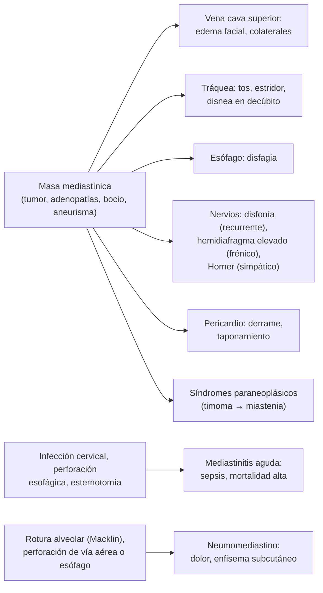
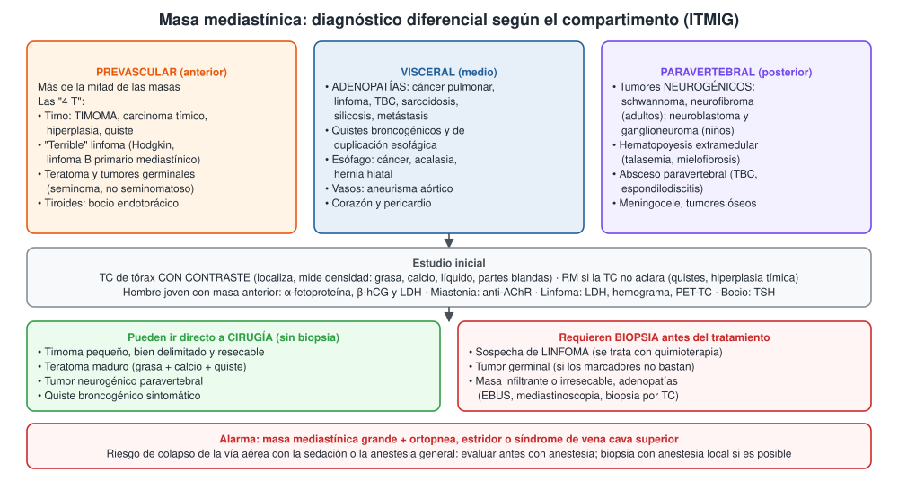
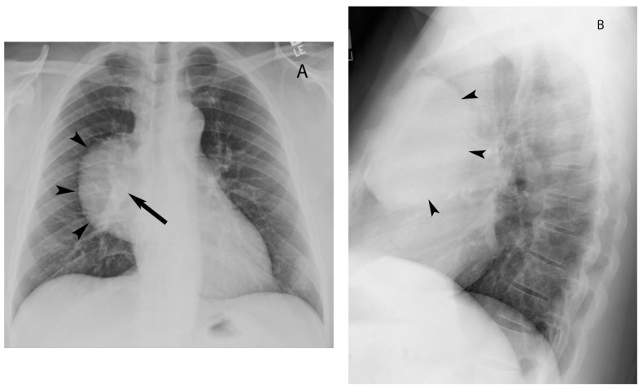

---
tags:
  - Respiratorio
---

# Síndromes mediastínicos: masas, mediastinitis y neumomediastino

**Subespecialidad**
Broncopulmonar · Cirugía de tórax · Oncología y hematología · Radiología torácica

**Guías principales**
ITMIG 2014: definición de los compartimentos del mediastino por TC · NCCN 2025: timomas y carcinomas tímicos

**Otras fuentes**
Revisión de imágenes de masas mediastínicas (Ahuja, *Diagnostics* 2023) · Tumores germinales mediastínicos primarios (Ozgun, *Biomedicines* 2023) · Mediastinitis necrotizante descendente (revisión de alcance, *Medicina* 2025) · Serie chilena de neumomediastino espontáneo (*Rev Med Chil* 2009)

**GES**
No como tal. Son GES varias causas de masa mediastínica: el **linfoma** en personas de 15 años y más, el **cáncer de testículo** y el **cáncer pulmonar**.

**EUNACOM**
1.05.1.034 Síndromes mediastínicos (sospecha, inicial, derivar)

**Revisado**
Octubre 2026

!!! abstract "Resumen en 60 segundos"
    - **Síndrome mediastínico**: síntomas por **compresión o invasión** de las estructuras del mediastino: **vena cava superior** (edema facial), **tráquea** (estridor, tos), **esófago** (disfagia), **nervio laríngeo recurrente** (disfonía), **frénico** (hemidiafragma elevado), **simpático** (Horner) y pericardio.
    - **Compartimentos (ITMIG)**: **prevascular** (anterior), **visceral** (medio) y **paravertebral** (posterior). La ubicación orienta el diagnóstico.
    - **Masa prevascular, las "4 T"**: **timoma**, **linfoma** ("terrible"), **teratoma** y tumores germinales, y **tiroides** (bocio endotorácico).
    - **Visceral**: **adenopatías** (cáncer pulmonar, linfoma, **TBC**, sarcoidosis) y quistes. **Paravertebral**: tumores **neurogénicos**.
    - **Estudio**:
        - **TC de tórax con contraste**.
        - **Hombre joven con masa anterior**: **α-fetoproteína, β-hCG y LDH** (tumor germinal).
        - **Miastenia** → buscar **timoma**.
    - **Masa grande con ortopnea o estridor**: riesgo de **colapso de la vía aérea con la anestesia**.
    - **Mediastinitis aguda**: emergencia (perforación esofágica, infección cervical descendente, post-esternotomía). Antibióticos de amplio espectro y **drenaje quirúrgico** precoz.
    - **Neumomediastino espontáneo**: hombre joven con **dolor torácico** y **enfisema subcutáneo**; benigno. Descartar **perforación esofágica** si hubo vómitos.

## Definición

- **Mediastino**: espacio central del tórax entre ambas pleuras, desde la entrada torácica hasta el diafragma. Contiene el corazón, los grandes vasos, la tráquea, el esófago, el timo, ganglios linfáticos y nervios.
- **Síndrome mediastínico**: conjunto de síntomas y signos por **compresión, invasión o inflamación** de las estructuras mediastínicas, cualquiera sea su causa (tumoral, infecciosa, vascular o aérea).
- **Masa mediastínica**: lesión ocupante del mediastino detectada en la imagen, con o sin síntomas.
- **Mediastinitis aguda**: infección del tejido conectivo del mediastino. Es grave y de alta mortalidad.
- **Mediastinitis fibrosante** (crónica): proliferación de tejido fibroso que comprime vasos y vía aérea, por lo general secundaria a granulomatosis (TBC, histoplasmosis).
- **Neumomediastino**: aire libre en el mediastino. Es **espontáneo** (sin causa evidente) o **secundario** (trauma, perforación esofágica o de la vía aérea, procedimientos).

## Epidemiología

### Mundial

- **Más de la mitad** de las masas mediastínicas se ubican en el compartimento **prevascular**.
- **Linfoma**: el tumor mediastínico más frecuente; explica **50–60 %** de las neoplasias malignas del mediastino. Los linfomas **primarios** del mediastino son solo ~ **1 %** de todos los linfomas (sobre todo **Hodgkin** y **linfoma B difuso de células grandes primario mediastínico**).
- **Timoma**: la neoplasia **primaria** más frecuente del mediastino prevascular, en general en **adultos de 40–60 años**.
- **Tumores germinales**: hasta **15 %** de los tumores mediastínicos; el mediastino prevascular es su sitio extragonadal más frecuente. Afectan sobre todo a **hombres jóvenes**.
    - **Teratoma maduro**: el tipo más frecuente (63 % de los teratomas mediastínicos).
    - Los **no seminomatosos** se asocian al **síndrome de Klinefelter**.
- **Paravertebral**: la mayoría son **neurogénicos** (schwannoma y neurofibroma en el adulto; neuroblastoma y ganglioneuroma en el niño).
- **Mediastinitis necrotizante descendente**: complica ~ **3 %** de las infecciones cervicales profundas, con mortalidad de **hasta 50 %**. El origen más frecuente es **dental** y amigdalino.

### Chile

!!! chile "Datos nacionales"
    - **Miastenia gravis y timoma** (Cea 2018; encuesta nacional de 405 pacientes):
        - **Timoma en 13,3 %** de los pacientes con miastenia.
        - El timoma fue más frecuente en quienes vivían en **comunas mineras**.
    - **Neumomediastino espontáneo** (Hospital público de Santiago, 2002–2007; 8 pacientes):
        - **16–41 años**; 5 hombres.
        - Síntoma más frecuente: **dolor torácico**. Signo más frecuente: **enfisema subcutáneo**.
        - Todos con **manejo conservador** (oxígeno, analgesia, reposo) y buena evolución; ninguno requirió cirugía.
    - **Adenopatías mediastínicas**:
        - En Chile siguen siendo importantes la **tuberculosis** y la **silicosis** (minería), además del cáncer pulmonar y el linfoma.
        - La **hidatidosis** puede, rara vez, comprometer el mediastino.
    - **GES relacionados**: **linfoma en personas de 15 años y más**, **cáncer de testículo** y **cáncer pulmonar**.

## Etiología y factores de riesgo

| Compartimento (ITMIG) | Límites | Lesiones típicas |
|---|---|---|
| **Prevascular** (anterior) | Detrás del esternón, delante del pericardio y los grandes vasos | **Timoma**, carcinoma tímico, **hiperplasia tímica**, quiste tímico, **linfoma**, **teratoma** y tumores germinales, **bocio endotorácico**, adenopatías, lipoma, quiste pericárdico (ángulo cardiofrénico) |
| **Visceral** (medio) | Corazón, grandes vasos, tráquea y esófago | **Adenopatías** (cáncer pulmonar, linfoma, **TBC**, sarcoidosis, silicosis, metástasis), **quiste broncogénico** y de duplicación, **tumores esofágicos**, **hernia hiatal**, **aneurisma aórtico**, paraganglioma, enfermedad de Castleman |
| **Paravertebral** (posterior) | Por detrás de la tráquea y el esófago, junto a la columna | **Tumores neurogénicos** (schwannoma, neurofibroma, ganglioneuroma, neuroblastoma), **hematopoyesis extramedular** (talasemia, mielofibrosis), **absceso paravertebral** (TBC, espondilodiscitis), meningocele, tumores óseos |

- **Causas de mediastinitis aguda**:
    - **Perforación esofágica**: **síndrome de Boerhaave** (vómitos intensos), iatrogénica (endoscopia, dilatación), **cuerpo extraño**, cáncer.
    - **Mediastinitis necrotizante descendente**: infección **odontogénica**, amigdalina o faríngea que baja por los planos del cuello.
    - **Post-esternotomía** (cirugía cardíaca): factores de riesgo: diabetes, obesidad, EPOC, uso de ambas arterias mamarias.
    - Extensión de una neumonía, un empiema o una osteomielitis vertebral.
- **Causas de neumomediastino**:
    - **Espontáneo**: **asma**, **tos**, **vómitos**, Valsalva, ejercicio intenso, **inhalación de drogas** (marihuana, cocaína), COVID-19.
    - **Secundario**: trauma torácico, **perforación esofágica o traqueal**, ventilación mecánica, procedimientos dentales o endoscópicos.

## Fisiopatología

- El mediastino es un **espacio cerrado** con estructuras **muy compresibles** (venas, tráquea en el niño, esófago) y otras rígidas (columna, esternón).
- **Masa que crece** → comprime primero las estructuras de baja presión:
    - **Vena cava superior** → edema en esclavina y circulación colateral.
    - **Tráquea y bronquios** → tos, estridor, atelectasias.
    - **Esófago** → disfagia.
    - **Nervios**: laríngeo recurrente izquierdo (**disfonía**), frénico (**parálisis diafragmática**), cadena simpática (**Horner**), plexo braquial.
    - **Corazón y pericardio** → derrame, taponamiento.
- **Anestesia y masa anterior grande**: en decúbito supino y con relajación muscular se pierde el tono que mantiene abierta la vía aérea, y la masa comprime la tráquea y los grandes vasos → **colapso respiratorio o circulatorio**.
- **Síndromes paraneoplásicos del timo**: el timo tumoral genera **linfocitos T autorreactivos** → miastenia gravis, aplasia pura de serie roja, hipogammaglobulinemia (síndrome de Good), enfermedades autoinmunes.
- **Mediastinitis descendente**: los **espacios fasciales del cuello** (retrofaríngeo, pretraqueal, perivascular) comunican con el mediastino; la gravedad y la presión negativa intratorácica facilitan la bajada de la infección.
- **Neumomediastino espontáneo** (efecto Macklin): un aumento de la presión alveolar rompe alvéolos; el aire diseca por las **vainas broncovasculares** hacia el hilio y el mediastino, y de ahí al cuello (enfisema subcutáneo).

*Figura 1. Mecanismos de los síndromes mediastínicos. Esquema propio basado en Carter 2017 (ITMIG) y Ahuja 2023.*

## Clasificación

**Por compartimento** (ITMIG, por TC): **prevascular**, **visceral** y **paravertebral** (ver la tabla de etiología y la figura 3). Reemplaza la división clásica en anterior, medio y posterior basada en la radiografía lateral.

**Timoma** (estadificación de **Masaoka-Koga**, simplificada):

| Estadio | Descripción |
|---|---|
| **I** | Encapsulado |
| **II** | Invasión microscópica (IIA) o macroscópica (IIB) de la cápsula o la grasa vecina |
| **III** | Invasión de órganos vecinos (pericardio, grandes vasos, pulmón) |
| **IV** | Diseminación **pleural o pericárdica** (IVA) o metástasis linfáticas o hematógenas (IVB) |

- **Histología (OMS)**: timomas tipo **A, AB, B1, B2, B3** (agresividad creciente) y **carcinoma tímico** (más agresivo, no se asocia a miastenia).

**Tumores germinales mediastínicos**:

| Tipo | Marcadores | Pronóstico |
|---|---|---|
| **Teratoma maduro** | Normales | **Benigno**; cirugía curativa |
| **Seminoma** | AFP **normal**; β-hCG alta en ~ 10 % | Muy buen pronóstico: supervivencia a 5 años **> 90 %** con quimioterapia |
| **No seminomatoso** (saco vitelino, coriocarcinoma, embrionario, mixto) | **AFP y/o β-hCG altas** en ~ 90 % | **Malo**: supervivencia a 5 años de **40–50 %** pese a quimioterapia y cirugía |

- Una **AFP elevada** excluye un seminoma puro.

## Clínica

- **Asintomáticos** (hallazgo en una radiografía o TC): frecuente en los timomas, los teratomas, los quistes y los tumores neurogénicos.
- **Síntomas por compresión o invasión** (sugieren malignidad):
    - **Tos**, **disnea**, **estridor**, **disnea u ortopnea al acostarse** (compresión traqueal).
    - **Dolor torácico** retroesternal.
    - **Síndrome de vena cava superior**: edema de cara, cuello y brazos ("en esclavina"), circulación colateral en el tórax, cefalea que empeora al agacharse. Ver [Urgencias oncológicas](../hematologia/urgencias-oncologicas.md).
    - **Disfagia**.
    - **Disfonía** (nervio laríngeo recurrente izquierdo), **hipo** o hemidiafragma elevado (frénico), **síndrome de Horner** (ptosis, miosis, anhidrosis).
- **Síntomas sistémicos**: fiebre, sudoración nocturna, baja de peso (**síntomas B** del linfoma), **prurito** (Hodgkin), dolor con el alcohol (Hodgkin, raro).
- **Síndromes paraneoplásicos**:
    - **Timoma**: **miastenia gravis** (el más frecuente): ptosis, diplopía, debilidad fatigable. También aplasia pura de serie roja e hipogammaglobulinemia. Ver [miastenia](../neurologia/debilidad-miastenia-y-miopatias.md).
    - **Tumores germinales**: ginecomastia (β-hCG), hipertiroidismo (β-hCG).
- **Mediastinitis aguda**:
    - **Fiebre**, **sepsis**, **dolor retroesternal** intenso, disnea.
    - **Mediastinitis descendente**: infección dental o faríngea días antes, aumento de volumen cervical, trismus, disfagia, crépitos subcutáneos.
    - **Perforación esofágica** (Boerhaave): **vómitos intensos** seguidos de **dolor torácico** brusco, **enfisema subcutáneo** y shock (tríada de Mackler: vómitos, dolor torácico, enfisema subcutáneo).
    - **Post-esternotomía**: fiebre, secreción y **inestabilidad del esternón** en las 2 semanas siguientes a la cirugía cardíaca.
- **Neumomediastino espontáneo**:
    - **Hombre joven** con **dolor torácico** retroesternal, disnea leve, dolor cervical, **disfonía** u odinofagia.
    - **Enfisema subcutáneo** (crépitos en el cuello).
    - **Signo de Hamman**: crujido sincrónico con el latido cardíaco.

## Diagnóstico

1. **Radiografía de tórax** (PA y lateral): ensanchamiento mediastínico; la **lateral** ubica la masa.
    - **Signo de la superposición hiliar**: si los vasos hiliares se ven a través de la masa, esta está **delante o detrás** del hilio, no en él.
    - **Signo cérvico-torácico**: una masa que se borra por encima de las clavículas está en el mediastino **anterior**; si se ve nítida por encima, es **posterior**.
2. **TC de tórax con contraste**: examen principal. Localiza la masa en su compartimento y caracteriza su contenido:
    - **Grasa** → teratoma, lipoma, timolipoma, hernia.
    - **Calcio** → teratoma, bocio, granuloma, timoma.
    - **Líquido** → quiste tímico, broncogénico, pericárdico.
    - **Partes blandas** → timoma, linfoma, germinal, adenopatías.
3. **Laboratorio orientado**:
    - **Hombre de 15–40 años con masa prevascular**: **AFP, β-hCG y LDH** y **ecografía testicular**.
    - **Sospecha de linfoma**: hemograma, **LDH**, VHS, VIH, hepatitis B y C.
    - **Sospecha de timoma**: **anticuerpos antirreceptor de acetilcolina** (aunque no haya síntomas: la miastenia puede descompensarse en la anestesia).
    - **Bocio**: TSH, T4 libre.
4. **RM**: distingue **quistes** de lesiones sólidas y la **hiperplasia tímica** (caída de señal en la secuencia de desplazamiento químico) del timoma; evalúa la extensión al canal raquídeo de los tumores neurogénicos.
5. **PET-TC**: linfoma (etapificación), cáncer pulmonar.
6. **Biopsia** (si el tratamiento no es la cirugía directa):
    - **Punción guiada por TC** (masa anterior), **EBUS** (ecobroncoscopía; adenopatías visceral), **mediastinoscopia**, cirugía torácica videoasistida.
    - El **linfoma** necesita una muestra **adecuada** (biopsia con aguja gruesa o quirúrgica), no solo citología.
    - El **timoma** pequeño y resecable **no se biopsia** (riesgo de diseminación pleural): se reseca.

- **Mediastinitis**: **TC de cuello y tórax con contraste** (colecciones, gas, extensión). **Esofagograma con contraste hidrosoluble** o TC con contraste oral si se sospecha perforación esofágica.
- **Neumomediastino**: radiografía (línea de aire que delimita el mediastino, "signo del diafragma continuo") y **TC** si hay dudas. Esofagograma o TC con contraste oral si hubo **vómitos**, fiebre o derrame pleural.

<figure markdown>
{ loading=lazy }
<figcaption>Figura 2. Diagnóstico diferencial y estudio de la masa mediastínica según el compartimento. Esquema propio basado en la clasificación ITMIG (Carter 2014 y 2017) y en Ahuja 2023.</figcaption>
</figure>

## Laboratorio

| Examen | Interpretación |
|---|---|
| **α-fetoproteína (AFP)** | Alta: tumor germinal **no seminomatoso** (saco vitelino); **excluye seminoma puro** |
| **β-hCG** | Alta: coriocarcinoma, no seminomatoso; leve en ~ 10 % de los seminomas |
| **LDH** | Alta: linfoma, tumores germinales (masa tumoral y pronóstico) |
| **Hemograma, VHS** | Citopenias, linfocitosis (linfoma); **aplasia pura de serie roja** (timoma) |
| **Anticuerpos anti-AChR** | Miastenia asociada a timoma |
| **Inmunoglobulinas** | Hipogammaglobulinemia (síndrome de Good, timoma) |
| **TSH, T4 libre** | Bocio endotorácico |
| **Metanefrinas** | Paraganglioma mediastínico (raro) |
| **ADA y cultivo de Koch**, IGRA | Adenopatías por **TBC** |
| **Hemocultivos**, PCR, procalcitonina | Mediastinitis |
| **Amilasa y pH del líquido pleural** | **Amilasa alta y pH bajo**: perforación esofágica |

## Imágenes

- **Radiografía de tórax**: ensanchamiento mediastínico, borramiento de contornos, desplazamiento de la tráquea, signo de la superposición hiliar, aire mediastínico.
- **TC de tórax con contraste**: compartimento, densidad (grasa, calcio, líquido), invasión de estructuras, adenopatías y metástasis.
- **Hallazgos característicos**:
    - **Timoma**: masa prevascular **bien delimitada y homogénea**, a veces con calcificaciones; implantes **pleurales** ("en gota") si está avanzado.
    - **Linfoma**: masa prevascular **lobulada y grande**, que rodea los vasos sin invadirlos, con adenopatías en otras regiones.
    - **Teratoma maduro**: masa con **grasa, calcio y quiste**.
    - **No seminomatoso**: masa grande y **heterogénea**, con necrosis.
    - **Bocio**: masa en continuidad con la tiroides cervical, con calcificaciones; desplaza la tráquea.
    - **Tumor neurogénico**: masa paravertebral redonda que puede ensanchar el agujero de conjunción ("en reloj de arena").
    - **Mediastinitis**: aumento de densidad de la grasa, **colecciones** y **burbujas de gas**, derrame pleural y pericárdico.
- **RM**: quistes, hiperplasia tímica, extensión intrarraquídea.
- **PET-TC**: linfoma, carcinoma tímico.

<figure markdown>
{ loading=lazy }
<figcaption>Figura 3. Signo de la superposición hiliar. (A) Radiografía frontal: masa bien delimitada sobre el hilio derecho (puntas de flecha); los vasos hiliares (flecha) se ven a través de ella, por lo que la masa está delante o detrás del hilio. (B) Radiografía lateral: confirma la ubicación anterior (puntas de flecha). Tomada de Ahuja J, Strange CD, Agrawal R, et al. <em>Approach to imaging of mediastinal masses.</em> Diagnostics. 2023;13(20):3171 (figura 2). Licencia CC BY 4.0.</figcaption>
</figure>

## Diagnóstico diferencial

| Diagnóstico | Diferencias |
|---|---|
| **Aneurisma o disección aórtica** | Ensanchamiento mediastínico con dolor brusco; **angio-TC** antes de cualquier punción |
| **Hiperplasia tímica de rebote** | Tras quimioterapia, corticoides o estrés; timo agrandado con forma conservada; disminuye en la TC de control a 2–3 meses o cae la señal en la RM |
| **Timo normal** en jóvenes | Forma triangular, sin efecto de masa |
| **Lipomatosis mediastínica** | Grasa homogénea; Cushing o uso de corticoides, obesidad |
| **Hernia hiatal** | Nivel hidroaéreo retrocardíaco; contiene estómago |
| **Acalasia** | Esófago dilatado con nivel, disfagia de larga data |
| **Pericarditis o derrame pericárdico** | Silueta cardíaca "en botellón"; ecocardiograma |
| **Neumotórax** (vs neumomediastino) | Línea pleural visceral, sin aire alrededor del corazón |
| **SCA, TEP, pericarditis** (vs neumomediastino espontáneo) | ECG, troponina, angio-TC |

## Tratamiento

### Masa mediastínica (manejo inicial y derivación)

- **Derivar** a **broncopulmonar o cirugía de tórax** (o hematología si es linfoma) para confirmar el diagnóstico.
- **Antes de cualquier sedación o anestesia** en una masa **grande prevascular**: evaluar **síntomas posturales** (ortopnea, estridor, síncope) y la compresión de la vía aérea y de los grandes vasos en la TC.
    - Preferir la biopsia con **anestesia local**.
    - Mantener la **ventilación espontánea**; tener lista la broncoscopía rígida.
- **Síndrome de vena cava superior**: cabecera elevada y **biopsia antes de los corticoides** si se sospecha linfoma. El manejo detallado está en [Urgencias oncológicas](../hematologia/urgencias-oncologicas.md).
- **Según la causa** (especialista):

| Lesión | Tratamiento |
|---|---|
| **Timoma** | **Timectomía completa** (resección R0); radioterapia en los estadios avanzados o con resección incompleta; quimioterapia en los irresecables |
| **Linfoma** | **Quimioterapia** (± radioterapia); ver [Linfomas](../hematologia/linfomas.md) |
| **Seminoma** | Quimioterapia basada en **cisplatino** (muy quimiosensible) |
| **No seminomatoso** | Quimioterapia con **cisplatino** y luego **resección** de la masa residual |
| **Teratoma maduro** | **Resección quirúrgica** |
| **Bocio endotorácico** | **Tiroidectomía** (casi siempre por vía cervical); ver [Bocio](../endocrinologia/bocio-nodulo-y-cancer-de-tiroides.md) |
| **Tumor neurogénico** | **Resección** (videotoracoscopía) |
| **Quistes** | Observación si son asintomáticos; resección si dan síntomas o crecen |
| **Adenopatías** | Según la causa: TBC, sarcoidosis, cáncer pulmonar, linfoma |

!!! alarma "Masa mediastínica anterior y anestesia"
    - **Ortopnea**, estridor, síncope o síndrome de vena cava superior en un paciente con masa prevascular grande = **riesgo de colapso cardiorrespiratorio** al sedarlo o anestesiarlo.
    - **No** acostar plano ni sedar profundamente; avisar a anestesia antes de cualquier procedimiento.
    - Posición **semisentada** o en la que el paciente respire mejor.

### Mediastinitis aguda

!!! dosis "Manejo inicial de la mediastinitis aguda"
    1. **Hospitalizar** en una unidad de paciente crítico; manejo de la **sepsis** (fluidos, cultivos).
    2. **Asegurar la vía aérea** si hay compromiso cervical (intubación difícil: experto, considerar vía aérea quirúrgica).
    3. **Antibióticos EV de amplio espectro** que cubran aerobios y **anaerobios** de la flora oral y digestiva:
        - **Piperacilina/tazobactam 4,5 g EV cada 6 horas**, o
        - **Meropenem 1 g EV cada 8 horas**.
        - Agregar **vancomicina** (*S. aureus* resistente) en la post-esternotomía.
        - Agregar un **antifúngico** en la perforación esofágica grave.
    4. **Drenaje quirúrgico precoz** de todas las colecciones (cervical, torácico por videotoracoscopía, toracotomía o esternotomía según la extensión).
    5. **Perforación esofágica**: **régimen cero**, sonda, nutrición, inhibidor de bomba de protones EV; **reparación quirúrgica**, stent o manejo endoscópico según el tamaño, el tiempo de evolución y el estado del paciente.
    6. **Post-esternotomía**: debridamiento, retiro del material, terapia de presión negativa, reconstrucción.

- La **demora en el diagnóstico** y el **drenaje insuficiente** son las principales causas de muerte en la mediastinitis descendente.

### Neumomediastino espontáneo

- **Manejo conservador**: **reposo**, **analgesia**, **oxígeno** (acelera la reabsorción del aire), evitar el Valsalva.
- Tratar el gatillante (crisis asmática, vómitos, tos).
- **Observación breve** (horas a 1 día) si hay síntomas importantes o dudas diagnósticas.
- **No** requiere antibióticos ni cirugía, salvo que exista **perforación esofágica o traqueal**.
- Recurrencia rara.

## Complicaciones

- **Masas mediastínicas**:
    - **Síndrome de vena cava superior**.
    - **Obstrucción de la vía aérea**, atelectasias, neumonía obstructiva.
    - **Derrame pericárdico y taponamiento**.
    - **Colapso cardiorrespiratorio en la anestesia**.
    - **Crisis miasténica** perioperatoria (timoma).
    - **Diseminación pleural** del timoma.
    - **Síndrome de lisis tumoral** al iniciar la quimioterapia de un linfoma voluminoso.
    - Neoplasias hematológicas asociadas a los tumores germinales no seminomatosos.
- **Mediastinitis**: shock séptico, **empiema**, pericarditis purulenta, erosión de grandes vasos, falla multiorgánica, muerte.
- **Neumomediastino**: muy rara vez neumotórax, neumopericardio o neumomediastino a tensión (compromiso hemodinámico, sobre todo en ventilación mecánica).

## Pronóstico y seguimiento

- **Timoma**: pronóstico bueno en los estadios I–II con resección completa; el carcinoma tímico es más agresivo. Requiere **seguimiento prolongado con TC**, porque puede recurrir años después de la cirugía.
- **Linfoma mediastínico**: altas tasas de curación con quimioterapia (Hodgkin y linfoma B primario mediastínico).
- **Tumores germinales**: **seminoma** con supervivencia a 5 años **> 90 %**; **no seminomatoso** de **40–50 %**. Seguimiento con **marcadores** (AFP, β-hCG) y TC.
- **Lesiones benignas resecadas** (teratoma, schwannoma, quistes): curación.
- **Mediastinitis descendente**: mortalidad de **hasta 50 %**; mejora con diagnóstico y drenaje precoces.
- **Neumomediastino espontáneo**: excelente pronóstico; se reabsorbe en días.

## Perlas para el internado

!!! perla "Para recordar en la sala"
    - Masa **prevascular** = las **"4 T"**: timoma, "terrible" linfoma, teratoma (germinales) y tiroides.
    - **Hombre joven con masa mediastínica anterior**: pida **AFP, β-hCG y LDH** y examine los **testículos**.
    - **Miastenia** → TC de tórax para buscar **timoma**. **Timoma** → buscar **miastenia** (anti-AChR) antes de operar.
    - **No biopsiar** un timoma pequeño resecable (diseminación pleural).
    - **Masa grande + ortopnea o estridor**: avise a anestesia antes de sedar; nunca acostar plano.
    - **Sospecha de linfoma con vena cava superior**: **biopsia antes de los corticoides** (si la urgencia lo permite).
    - **Vómitos intensos + dolor torácico + enfisema subcutáneo** = **Boerhaave** hasta demostrar lo contrario: TC con contraste oral y cirugía.
    - **Flegmón dental o faríngeo que empeora con dolor torácico**: piense en **mediastinitis descendente** y pida **TC de cuello y tórax**.
    - **Neumomediastino espontáneo** en un joven asmático o tras inhalar drogas: reposo, analgesia y oxígeno; buscar perforación solo si hubo vómitos o signos de infección.

## Preguntas de repaso

??? repaso "1. Hombre de 24 años consulta por tos y dolor torácico de 1 mes. La radiografía muestra un ensanchamiento mediastínico y la TC una masa prevascular de 9 cm, heterogénea, con necrosis. ¿Qué exámenes pide primero y por qué?"
    - En un **hombre joven** con masa **prevascular**, sospechar un **tumor germinal** (y linfoma).
    - **α-fetoproteína, β-hCG y LDH**: si la AFP o la β-hCG están **muy altas**, se puede diagnosticar un **no seminomatoso** e iniciar quimioterapia con cisplatino **sin biopsia**.
    - **Ecografía testicular** (descartar primario gonadal).
    - Hemograma y LDH para el linfoma; biopsia si los marcadores no son diagnósticos.
    - Evaluar síntomas posturales antes de cualquier procedimiento con sedación.

??? repaso "2. Mujer de 52 años con ptosis y diplopía que empeoran en la tarde. Los anticuerpos antirreceptor de acetilcolina son positivos. ¿Qué examen de imagen pide y qué buscaría?"
    - **Miastenia gravis**: pedir **TC de tórax con contraste** (o RM) para buscar un **timoma** (10–15 % de los pacientes con miastenia; 13 % en Chile).
    - Si hay un timoma: **timectomía**, que además puede mejorar la miastenia.
    - Preparar la cirugía con la miastenia compensada (riesgo de crisis miasténica).

??? repaso "3. Hombre de 30 años con linfoma de Hodgkin sospechado por una masa prevascular de 12 cm. Está programado para una biopsia con anestesia general. Al examen tiene ortopnea y estridor leve al acostarse. ¿Qué riesgo existe y cómo lo maneja?"
    - **Riesgo de colapso de la vía aérea y cardiovascular** con la inducción anestésica (masa mediastínica anterior grande con síntomas posturales).
    - Avisar a **anestesia**; revisar en la TC la compresión de la tráquea y los grandes vasos.
    - Preferir una **biopsia con anestesia local** (punción guiada por TC o de una adenopatía periférica), mantener la ventilación espontánea y la posición semisentada.
    - No dar corticoides antes de la biopsia si es posible (pueden impedir el diagnóstico del linfoma).

??? repaso "4. Hombre de 45 años, con consumo de alcohol, consulta por dolor torácico intenso y disnea tras vomitar varias veces. Tiene taquicardia, fiebre y crépitos subcutáneos en el cuello. ¿Qué sospecha y qué hace?"
    - **Síndrome de Boerhaave** (perforación esofágica espontánea) con **mediastinitis**: tríada de Mackler (vómitos, dolor torácico, enfisema subcutáneo).
    - **TC de tórax con contraste oral hidrosoluble** (o esofagograma).
    - **Régimen cero**, fluidos, **antibióticos de amplio espectro** (piperacilina/tazobactam), inhibidor de bomba de protones EV y considerar un antifúngico.
    - **Cirugía de tórax urgente**: reparación, drenaje o manejo endoscópico según el caso.

??? repaso "5. Hombre de 38 años con un absceso dental tratado hace 5 días consulta por aumento de volumen cervical, trismus, fiebre de 39 °C y dolor retroesternal. ¿Qué sospecha y cuál es la conducta?"
    - **Mediastinitis necrotizante descendente** a partir de una infección **odontogénica** (mortalidad de hasta 50 %).
    - **TC de cuello y tórax con contraste**.
    - **Asegurar la vía aérea** (puede ser difícil), **antibióticos EV** que cubran anaerobios (piperacilina/tazobactam o meropenem) y **drenaje quirúrgico** precoz del cuello y del mediastino.
    - Manejo en una unidad de paciente crítico.

??? repaso "6. Hombre de 19 años, asmático, consulta por dolor retroesternal y dolor cervical tras una crisis de tos. Está estable. Al palpar el cuello hay crépitos, y se ausculta un crujido sincrónico con el latido. La radiografía muestra aire alrededor del mediastino. ¿Diagnóstico y manejo?"
    - **Neumomediastino espontáneo** (efecto Macklin) con **signo de Hamman**.
    - Descartar neumotórax; ECG para descartar otras causas de dolor torácico.
    - **Manejo conservador**: reposo, analgesia, **oxígeno**, tratar el asma.
    - No requiere antibióticos ni cirugía. Buscar una perforación esofágica solo si hubo vómitos, fiebre o derrame pleural.

## Referencias

1. Carter BW, Tomiyama N, Bhora FY, et al. A modern definition of mediastinal compartments. *J Thorac Oncol.* 2014;9(9 Suppl 2):S97–S101. doi:[10.1097/JTO.0000000000000292](https://doi.org/10.1097/JTO.0000000000000292)
2. Carter BW, Benveniste MF, Madan R, et al. ITMIG classification of mediastinal compartments and multidisciplinary approach to mediastinal masses. *Radiographics.* 2017;37(2):413–436. doi:[10.1148/rg.2017160095](https://doi.org/10.1148/rg.2017160095)
3. Ahuja J, Strange CD, Agrawal R, et al. Approach to imaging of mediastinal masses. *Diagnostics (Basel).* 2023;13(20):3171. doi:[10.3390/diagnostics13203171](https://doi.org/10.3390/diagnostics13203171)
4. Riely GJ, Wood DE, Loo BW Jr, et al. Thymomas and thymic carcinomas, version 2.2025, NCCN Clinical Practice Guidelines in Oncology. *J Natl Compr Canc Netw.* 2025;23(6):255–269. doi:[10.6004/jnccn.2025.0027](https://doi.org/10.6004/jnccn.2025.0027)
5. Ozgun G, Nappi L. Primary mediastinal germ cell tumors: a thorough literature review. *Biomedicines.* 2023;11(2):487. doi:[10.3390/biomedicines11020487](https://doi.org/10.3390/biomedicines11020487)
6. Cobzeanu BM, Moisii L, Palade OD, et al. Management of deep neck infection associated with descending necrotizing mediastinitis: a scoping review. *Medicina (Kaunas).* 2025;61(2):325. doi:[10.3390/medicina61020325](https://doi.org/10.3390/medicina61020325)
7. Cea G, Martinez D, Salinas R, et al. Clinical and epidemiological features of myasthenia gravis in Chilean population. *Acta Neurol Scand.* 2018;138(4):338–343. doi:[10.1111/ane.12967](https://doi.org/10.1111/ane.12967)
8. Alvarez Z C, Jadue T A, Rojas R F, et al. Neumomediastino espontáneo (síndrome de Hamman): una enfermedad benigna mal diagnosticada. *Rev Med Chil.* 2009;137(8):1045–1050. [PubMed](https://pubmed.ncbi.nlm.nih.gov/19915768/)
