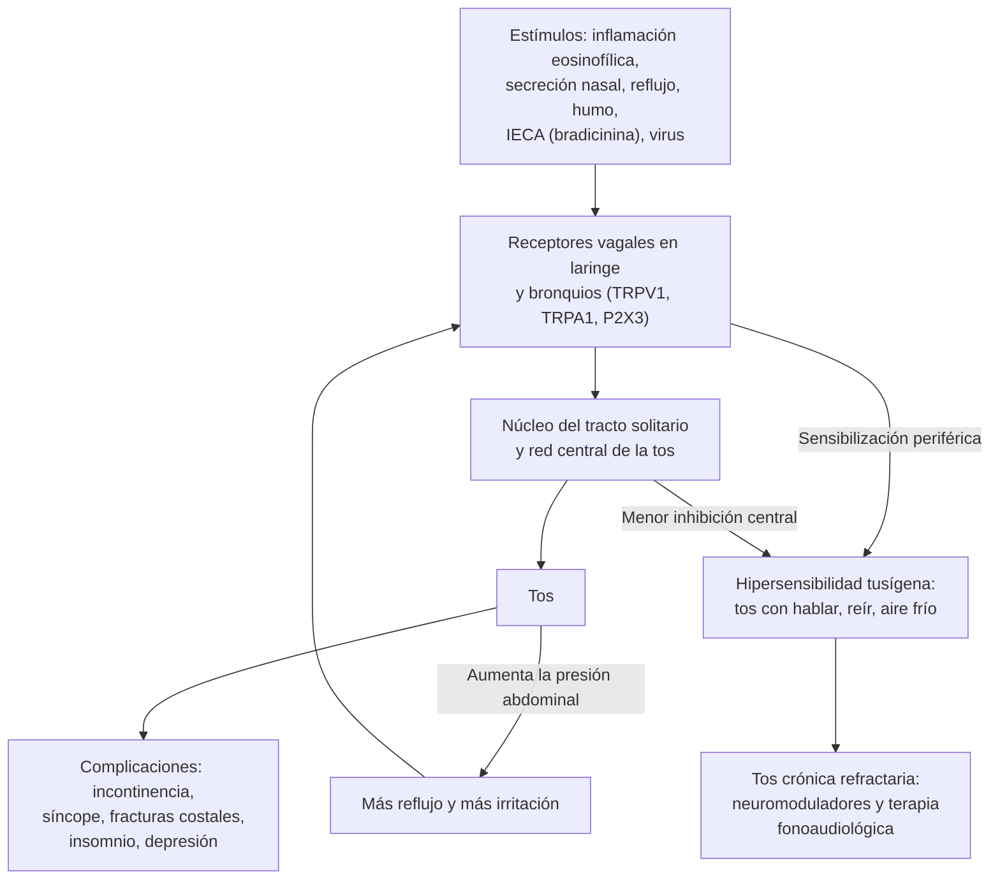

---
tags:
  - Respiratorio
---

# Tos crónica

**Subespecialidad**
Broncopulmonar · Otorrinolaringología · Gastroenterología · Atención primaria

**Guías principales**
ERS 2020: diagnóstico y tratamiento de la tos crónica · CHEST 2018: clasificación de la tos y algoritmos de manejo en el adulto · CHEST 2016: tratamiento de la tos crónica inexplicada · ACCP 2006: tos por IECA

**Otras fuentes**
Epidemiología mundial de la tos crónica (Song 2015) · Revisión de *N Engl J Med* sobre la tos crónica refractaria (Irwin y Madison 2025) · Mecanismos fisiológicos de la tos crónica (Brown 2026) · Ensayo de gabapentina (Ryan 2012) · ENS 2016–2017 (tabaquismo)

**GES**
No es GES. Algunas causas sí: **EPOC**, **asma** (desde los 15 años), **cáncer de pulmón**; la **tuberculosis** tiene un programa nacional.

**EUNACOM**
1.05.1.035 Tos crónica (específico, completo, completo)

**Revisado**
Octubre 2026

!!! abstract "Resumen en 60 segundos"
    - **Clasificación por duración** (adulto): **aguda** < 3 semanas, **subaguda** 3–8 semanas, **crónica** > 8 semanas.
    - Afecta a **~10 %** de los adultos. Deteriora la calidad de vida (incontinencia urinaria, insomnio, síncope, aislamiento).
    - **Primer paso**:
        - **Signos de alarma** (hemoptisis, baja de peso, fiebre, disnea, disfonía o disfagia, Rx anormal, fumador con tos nueva o que cambia).
        - **Fármacos** (**IECA**: tos en el 5–35 %).
        - **Tabaco**.
        - **Radiografía de tórax** y **espirometría**.
    - **Causas tratables más frecuentes** con la radiografía normal:
        - **Asma** (incluida la tos como variante de asma) y **bronquitis eosinofílica**.
        - Enfermedades de la **vía aérea superior** (rinitis, rinosinusitis, "goteo posnasal").
        - **Reflujo** gastroesofágico.
        - **IECA**.
        - **Bronquitis crónica** del fumador.
    - **Tratamiento por pasos**:
        1. **Suspender el IECA** (cambiar a ARA-II) y **dejar de fumar**.
        2. **Prueba de corticoide inhalado** 2–4 semanas si hay rasgos de asma o eosinofilia.
        3. **Corticoide nasal** si hay síntomas nasales.
        4. **IBP solo si hay síntomas de reflujo** (no a ciegas).
    - **Tos crónica refractaria** (hipersensibilidad tusígena): **terapia fonoaudiológica**, **gabapentina o pregabalina**, **morfina en dosis bajas**.
    - **En Chile**:
        - Toda tos con expectoración **≥ 2 semanas** es un **sintomático respiratorio**: pedir **baciloscopías** (TBC).
        - El tabaquismo es alto (~33 %), al igual que el humo de leña y el uso de **enalapril**.

## Definición

| Concepto | Definición |
|---|---|
| **Tos aguda** | **< 3 semanas**. Casi siempre una infección viral de la vía aérea |
| **Tos subaguda** | **3–8 semanas**. Sobre todo **posinfecciosa** (incluida la coqueluche); también exacerbación de asma o EPOC |
| **Tos crónica** | **> 8 semanas** en el adulto (> 4 semanas en el niño) |
| **Tos crónica refractaria** | Persiste pese al estudio y al **tratamiento adecuado** de las causas encontradas |
| **Tos crónica inexplicada** | No se encuentra una causa tras un estudio completo |
| **Síndrome de hipersensibilidad tusígena** | Tos crónica gatillada por **estímulos de baja intensidad** (aire frío, perfumes, humo, hablar, reír, comer), con sensación de **picor o cosquilleo laríngeo**, por **hipersensibilidad de las vías nerviosas** de la tos (ERS 2020) |
| **Síndrome de tos de la vía aérea superior** | Tos asociada a rinitis o rinosinusitis (antes "goteo posnasal") |
| **Tos como variante de asma** | Asma cuya manifestación principal o única es la tos, con **hiperreactividad bronquial** |
| **Bronquitis eosinofílica no asmática** | Tos con **eosinofilia en el esputo** (> 3 %) **sin** obstrucción variable ni hiperreactividad; responde a los corticoides inhalados |

## Epidemiología

- **Prevalencia mundial** (metaanálisis, 576 839 adultos): **9,6 %**.
    - Mayor en **Oceanía** (18,1 %), **Europa** (12,7 %) y **EE. UU.** (11 %); menor en Asia (4,4 %) y África (2,3 %).
    - En las consultas especializadas predominan las **mujeres** de edad media.
- Es una de las **causas más frecuentes de consulta** en APS y broncopulmonar.
- **Tos por IECA**: **5–35 %** de los tratados. Puede aparecer en horas o meses después de iniciar el fármaco. Con los **ARA-II**, la frecuencia es similar a la del placebo.

!!! chile "Datos nacionales"
    - **Tabaquismo**: ~**33 %** de la población (ENS 2016–2017), uno de los más altos de la región. Es la principal causa de bronquitis crónica y EPOC ([ver EPOC](epoc.md)).
    - **EPOC**: prevalencia de **~15–17 %** en los mayores de 40 años en Santiago (PLATINO), con **~87 % de subdiagnóstico**.
    - **Humo de leña**: combustible de calefacción y cocina muy usado en el **centro-sur y el sur**; causa bronquitis crónica y EPOC, sobre todo en mujeres no fumadoras.
    - **Tuberculosis**: el **sintomático respiratorio** (tos con expectoración **≥ 2 semanas**) debe estudiarse con **2 baciloscopías** según la norma nacional ([ver tuberculosis](tuberculosis.md)).
    - **IECA**: el **enalapril** es uno de los antihipertensivos más usados en la APS chilena; su tos seca es una causa frecuente y corregible ([ver HTA](../cardiologia/hipertension-arterial.md)).
    - **Coqueluche**: también afecta a adultos con inmunidad vacunal atenuada; la vacunación de las embarazadas protege a los lactantes ([ver influenza y bronquitis aguda](../infectologia/influenza-y-covid-19.md)).

## Etiología

| Grupo | Causas | Claves |
|---|---|---|
| **Vía aérea inferior** | **Asma** y tos como variante de asma, **bronquitis eosinofílica no asmática**, **EPOC** y bronquitis crónica, **bronquiectasias**, **TBC**, **cáncer pulmonar**, enfermedad pulmonar intersticial, cuerpo extraño | Sibilancias, atopia, VEF1 reversible; expectoración crónica; hemoptisis; crepitaciones "en velcro" |
| **Vía aérea superior** | **Rinitis** alérgica o no alérgica, **rinosinusitis crónica**, laringitis por reflujo, disfunción de cuerdas vocales | Rinorrea, congestión, necesidad de carraspear, "goteo" en la garganta |
| **Digestivas** | **Reflujo gastroesofágico** (ácido y no ácido), reflujo laringofaríngeo, aspiración (trastornos de la deglución) | Pirosis, regurgitación, tos al comer, al hablar o al acostarse |
| **Fármacos** | **IECA**; otros (betabloqueadores en asmáticos, metotrexato, amiodarona y nitrofurantoína por daño pulmonar) | Relación temporal (aunque puede aparecer meses después) |
| **Cardiovascular** | **Insuficiencia cardíaca**, estenosis mitral | Disnea, ortopnea, edema |
| **Posinfecciosa** | Tras una infección viral, ***Bordetella pertussis***, *Mycoplasma* | Inicio con un cuadro agudo; tos paroxística, "gallito", vómitos postusivos (coqueluche) |
| **Otras** | **Apnea obstructiva del sueño**, enfermedades del oído (cerumen, pelo en el conducto: reflejo de Arnold), tiroides grande o nódulo, tos psicógena o tic (diagnóstico de exclusión) | Ronquidos, somnolencia; tos que desaparece al dormir |

- **En el no fumador con radiografía normal que no usa IECA**: el asma (o la bronquitis eosinofílica), las enfermedades de la vía aérea superior y el reflujo explican la mayoría de los casos. Con frecuencia **coexisten varias**.

## Fisiopatología

- **Reflejo de la tos**: protege la vía aérea.
    - **Receptores**: terminaciones de fibras **vagales** (Aδ mecanosensibles y fibras **C** químicas) en la laringe, la tráquea y los bronquios. Responden a estímulos mecánicos (moco, cuerpo extraño) y químicos (ácido, capsaicina, humo) a través de canales como **TRPV1**, **TRPA1** y el receptor de ATP **P2X3**.
    - **Vía**: los ganglios **nodoso y yugular** llevan la señal al **núcleo del tracto solitario** en el bulbo y, desde ahí, a una red central que genera la tos y la sensación de "urgencia de toser".
    - **Control cortical**: la corteza puede suprimir la tos de forma voluntaria.
- **Hipersensibilidad tusígena** (figura 1): en la tos crónica, las vías aferentes se **sensibilizan** en la periferia (inflamación, reflujo, virus) y en el **sistema nervioso central** (menor inhibición descendente).
    - **Alotusia**: estímulos inocuos, como hablar, reír, el aire frío o los perfumes, gatillan la tos.
    - **Hipertusia**: los estímulos tusígenos producen más tos de lo normal.
    - Por eso **funcionan** fármacos que actúan sobre los nervios: **gabapentina**, **pregabalina**, **morfina en dosis bajas** y los antagonistas de **P2X3**.
- **IECA**: inhiben la degradación de la **bradicinina** y la **sustancia P**, que se acumulan en la vía aérea y sensibilizan los receptores de la tos. Los **ARA-II** no afectan esa vía.
- **Reflujo**: la tos se produce por un **reflejo esófago-traqueobronquial** (ácido o no ácido en el esófago distal) o por **microaspiración** laringofaríngea. Además, la tos aumenta la presión abdominal y favorece el reflujo: es un **círculo vicioso**.
- **Asma y bronquitis eosinofílica**: la **inflamación eosinofílica** sensibiliza los receptores. Responden a los **corticoides inhalados**.

<figure markdown>
![Ilustración en tres paneles. Panel a: silueta humana con la laringe, la tráquea y los pulmones; las fibras sensitivas del nervio vago llevan la señal desde la vía aérea a los ganglios nodoso y yugular y al núcleo del tracto solitario y el núcleo paratrigeminal en el bulbo; abajo, un corte del epitelio muestra las fibras A delta, mecanosensibles y rápidas, y las fibras C, mecano, termo y quimiosensibles y lentas. Panel b: terminación nerviosa con receptores termosensibles TRPM8 y TRPV4, purinérgicos P2X3 y P2X2/3 e irritantes TRPA1 y TRPV1, que generan un potencial de transducción y, a través de los canales de sodio NaV1.7, 1.8 y 1.9, un potencial de acción. Panel c: corte sagital del encéfalo con las vías ascendentes y descendentes de la tos y las alteraciones propuestas en la tos crónica: mayor aferencia desde nervios vagales hipersensibles, procesamiento alterado en el mesencéfalo, convergencia de las aferencias sensitivas, percepción sensitiva alterada y menor modulación inhibitoria descendente desde la corteza](../assets/figuras/tos/mecanismos-tos-cronica-brown-2026.jpg){ loading=lazy }
<figcaption>Figura 1. Mecanismos periféricos y centrales de la tos crónica: (a) fibras vagales Aδ y C de la vía aérea, que proyectan al núcleo del tracto solitario (nTS) y al núcleo paratrigeminal (Pa5); (b) receptores y canales de la terminación nerviosa (entre ellos P2X3, TRPV1 y TRPA1); (c) vías centrales y su procesamiento alterado en la tos crónica (PAG: sustancia gris periacueductal). Fuente: Brown JC, Rhatigan KL, Price OJ, Cho PSP, et al. Physiological mechanisms and therapeutic targets in chronic cough. <em>Physiol Rep.</em> 2026;14(15):e71036, figura 2 (creada con BioRender). Licencia <a href="https://creativecommons.org/licenses/by/4.0/">CC BY 4.0</a>.</figcaption>
</figure>

*Figura 2. Fisiopatología de la tos crónica: estímulos, reflejo y círculo vicioso de la hipersensibilidad. Esquema propio.*

## Clasificación

- **Por duración**: aguda (< 3 semanas), subaguda (3–8 semanas), **crónica** (> 8 semanas).
- **Por la radiografía de tórax**:
    - **Con radiografía anormal**: orienta a una causa pulmonar (cáncer, TBC, bronquiectasias, intersticio, insuficiencia cardíaca). Se estudia según el hallazgo.
    - **Con radiografía normal**: seguir el **enfoque de los rasgos tratables**.
- **Por el tipo de tos**:
    - **Seca**: IECA, asma, vía aérea superior, reflujo, intersticio, hipersensibilidad.
    - **Productiva**: bronquitis crónica, **bronquiectasias**, TBC, absceso.
    - El tipo de tos orienta, pero **no** define la causa.
- **Por la respuesta al tratamiento**: **explicada y respondedora**, **refractaria** (no responde pese a tratar las causas) o **inexplicada**.

## Clínica

- **Historia dirigida**:
    - **Duración** y **forma de inicio** (¿empezó con un resfrío?).
    - **Tos seca o productiva** (volumen, purulencia, **hemoptisis**).
    - **Gatillantes**: hablar, reír, aire frío, perfumes, comer, acostarse.
    - **Fármacos**: **IECA**, betabloqueadores, fármacos con toxicidad pulmonar.
    - **Tabaco** (IPA), **humo de leña**, exposición laboral.
    - **Contactos de TBC**, viajes, inmigración.
    - **Síntomas asociados**: sibilancias, disnea, síntomas **nasales**, **pirosis** o regurgitación, disfonía, disfagia, ronquidos.
    - **Síntomas generales**: baja de peso, fiebre, sudoración nocturna.
- **Impacto**: **incontinencia urinaria** de esfuerzo (frecuente en las mujeres), síncope tusígeno, dolor torácico, vómitos, insomnio, aislamiento social, ansiedad y depresión.
- **Examen físico**:
    - Nariz y faringe: rinitis, pólipos, "empedrado" faríngeo por el goteo posnasal.
    - Oídos.
    - Cuello: adenopatías, tiroides.
    - Pulmón: **sibilancias**, **crepitaciones "en velcro"** (intersticio), crepitaciones gruesas (bronquiectasias).
    - Corazón: signos de insuficiencia cardíaca.
    - **Hipocratismo digital** (cáncer, intersticio, bronquiectasias).
    - Estado nutricional.

!!! alarma "Signos de alarma: estudiar sin demora"
    - **Hemoptisis**.
    - **Baja de peso**, **fiebre**, sudoración nocturna.
    - **Disnea** progresiva, hipoxemia.
    - **Disfonía** persistente o **disfagia**.
    - **Fumador** (o exfumador) **mayor de 45 años** con una tos **nueva** o que **cambió** sus características: sospechar un **cáncer pulmonar**.
    - **Radiografía de tórax anormal**.
    - **Inmunosupresión** (TBC, infecciones oportunistas).
    - **Neumonías recurrentes** o tos al comer (aspiración).
    - **Exposición** a la tuberculosis o sintomático respiratorio ≥ 2 semanas.

## Diagnóstico

!!! guia "Evaluación del adulto con tos crónica (ERS 2020; CHEST 2018)"
    1. **Historia y examen** dirigidos. Buscar **signos de alarma**, el uso de **IECA** y el **tabaquismo**.
    2. **Radiografía de tórax** en todos.
    3. **Espirometría con prueba broncodilatadora** en todos los que puedan hacerla.
    4. Si la espirometría es normal y se sospecha asma: **prueba de provocación bronquial** (metacolina), o **FeNO** y **eosinófilos en sangre** (o en esputo) para detectar inflamación tipo 2.
    5. **Baciloscopías** si hay expectoración ≥ 2 semanas (norma chilena de TBC).
    6. **Suspender el IECA y el tabaco** antes de atribuir la tos a otra causa: la tos por IECA cede en **1–4 semanas** (hasta 3 meses).
    7. **Pruebas terapéuticas** dirigidas a los rasgos tratables, con dosis y duración adecuadas. Si no mejora, **reevaluar** la adherencia, la técnica inhalatoria y el diagnóstico.
    8. **TC de tórax** si la radiografía es anormal, hay signos de alarma o la tos persiste pese al tratamiento. Considerar la **broncoscopía** (cuerpo extraño, tumor endobronquial), la **nasofibrolaringoscopía** y la **pH-impedanciometría** esofágica en casos seleccionados.

<figure markdown>
![Algoritmo de la tos crónica del adulto de más de 8 semanas en cinco pasos. Paso 1: historia, examen y exámenes básicos: IECA, tabaco, radiografía de tórax y espirometría con broncodilatador. Paso 2: buscar signos de alarma como hemoptisis, baja de peso, fiebre, disnea, disfonía o disfagia, radiografía anormal, fumador mayor de 45 años con tos nueva o que cambia, o inmunosupresión; si los hay, estudiar con TC de tórax, baciloscopías y broncoscopía y derivar. Paso 3: si no hay signos de alarma, eliminar irritantes: suspender el IECA y dejar de fumar. Paso 4: tratar los rasgos tratables con prueba terapéutica: asma o bronquitis eosinofílica con corticoide inhalado por 2 a 4 semanas; vía aérea superior con corticoide nasal, antihistamínico en la rinitis alérgica o lavado nasal; reflujo con medidas e IBP solo si hay síntomas o reflujo demostrado; bronquitis crónica u otras causas como bronquiectasias, tuberculosis, coqueluche, insuficiencia cardíaca o fármacos, tratando la causa. Paso 5: si persiste pese a tratar todo, tos crónica refractaria o inexplicada por hipersensibilidad tusígena: terapia fonoaudiológica de supresión de la tos, gabapentina o pregabalina, morfina de liberación prolongada en dosis bajas y antagonistas P2X3 donde estén disponibles](../assets/figuras/tos/algoritmo-tos-cronica.svg){ loading=lazy }
<figcaption>Figura 3. Enfoque por pasos de la tos crónica del adulto. Esquema propio basado en ERS 2020 (Morice 2020), CHEST 2018 (Irwin 2018) y CHEST 2016 (Gibson 2016).</figcaption>
</figure>

## Laboratorio

| Examen | Utilidad |
|---|---|
| **Hemograma** | **Eosinofilia** (asma, bronquitis eosinofílica, parásitos, fármacos); anemia o leucocitosis (enfermedad sistémica) |
| **FeNO** (óxido nítrico exhalado) | Elevado en la **inflamación tipo 2** (asma, bronquitis eosinofílica): predice respuesta a los corticoides inhalados |
| **Eosinófilos en esputo** | > 3 %: bronquitis eosinofílica o asma |
| **Baciloscopías y cultivo de esputo** | Sintomático respiratorio (≥ 2 semanas con expectoración); bronquiectasias (bacterias, micobacterias) |
| **PCR para *B. pertussis*** | Tos paroxística subaguda o de menos de 3–4 semanas |
| **IgE total y específicas, test cutáneo** | Sospecha de rinitis alérgica o asma atópica |
| **NT-proBNP** | Sospecha de insuficiencia cardíaca |
| **Inmunoglobulinas, test del sudor** | Bronquiectasias de causa no aclarada |

## Imágenes

- **Radiografía de tórax**: en **todos** al inicio. Una radiografía normal no descarta bronquiectasias, enfermedad intersticial precoz ni tumores pequeños o centrales.
- **TC de tórax** (de alta resolución si se sospecha intersticio): si la radiografía es anormal, hay **signos de alarma**, el fumador tiene riesgo de cáncer o la tos es **refractaria** (bronquiectasias, intersticio, tumores).
- **TC de senos paranasales**: si se sospecha una rinosinusitis crónica que no responde al tratamiento.
- **Ecocardiograma**: si se sospecha insuficiencia cardíaca o valvulopatía.
- **Estudios endoscópicos**: **nasofibrolaringoscopía** (vía aérea superior, laringe, cuerdas vocales) y **broncoscopía** (cuerpo extraño, tumor, lavado broncoalveolar).

## Diagnóstico diferencial

| Pista | Pensar en |
|---|---|
| Tos seca, iniciada con un **IECA** (incluso meses después) | **Tos por IECA**: suspender y esperar 1–4 semanas |
| **Sibilancias**, atopia, tos nocturna o con el ejercicio, VEF1 reversible | **Asma** o tos como variante de asma ([ver asma](asma.md)) |
| Espirometría normal, **eosinófilos** o FeNO altos | **Bronquitis eosinofílica** |
| Rinorrea, congestión, **carraspeo**, sensación de secreción en la garganta | **Vía aérea superior** (rinitis, rinosinusitis) |
| **Pirosis**, regurgitación, tos al **comer**, al hablar o al acostarse | **Reflujo** ([ver ERGE](../gastroenterologia/reflujo-gastroesofagico.md)) |
| Fumador con **expectoración** matinal crónica | **Bronquitis crónica / EPOC** |
| **Expectoración abundante** purulenta diaria, infecciones a repetición | **Bronquiectasias** |
| Tos **paroxística** con "gallito" o vómitos tras toser | **Coqueluche** |
| Disnea progresiva, **crepitaciones en velcro**, hipocratismo | **Enfermedad pulmonar intersticial** |
| Fumador > 45 años, **hemoptisis**, baja de peso | **Cáncer pulmonar** |
| Expectoración ≥ 2 semanas, fiebre, sudoración, baja de peso | **Tuberculosis** |
| Ortopnea, edema, crepitaciones basales | **Insuficiencia cardíaca** |
| Tos al comer, adulto mayor con ACV o Parkinson | **Aspiración** por disfagia ([ver disfagia](../gastroenterologia/disfagia-y-afagia-aguda.md)) |

## Tratamiento

!!! guia "Tratamiento de la tos crónica (ERS 2020; CHEST 2016)"
    1. **Eliminar los irritantes**:
        - **Suspender el IECA** y cambiar a un **ARA-II**.
        - **Dejar de fumar** (consejería, apoyo farmacológico) y evitar el humo de leña y las exposiciones laborales.
    2. **Rasgos de asma o inflamación eosinofílica** (sibilancias, reversibilidad, FeNO o eosinófilos altos): **prueba de corticoide inhalado por 2–4 semanas** (ERS 2020). Si responde, manejar según la guía de asma. Los **antileucotrienos** son una alternativa.
    3. **Vía aérea superior**:
        - **Corticoide nasal** y **lavado nasal** con suero fisiológico.
        - **Antihistamínico** en la rinitis alérgica.
        - Tratar la rinosinusitis crónica.
    4. **Reflujo**:
        - **Medidas**: bajar de peso, cenar temprano, elevar la cabecera, evitar las comidas copiosas y el alcohol.
        - **IBP solo si hay síntomas de reflujo** (pirosis, regurgitación) o reflujo demostrado. Sin ellos, los IBP **no** son más eficaces que el placebo.
        - En el reflujo **no ácido**, los procinéticos tienen un papel limitado.
    5. **Bronquitis crónica**: dejar de fumar; en el fenotipo de bronquitis crónica que no responde, considerar una **prueba de 1 mes de macrólido** (azitromicina), sopesando la resistencia y el QT.
    6. **Tos crónica refractaria o inexplicada**:
        - **Terapia fonoaudiológica** de supresión de la tos (técnicas de control, higiene vocal).
        - **Gabapentina** o **pregabalina** (recomendación condicional, ERS 2020; gabapentina sugerida por CHEST 2016).
        - **Morfina de liberación prolongada en dosis bajas** (recomendación fuerte, ERS 2020).
        - Los **antagonistas del receptor P2X3** (gefapixant) están aprobados en algunos países; su efecto adverso típico es la **alteración del gusto**.
        - **No** se recomienda seguir aumentando los corticoides inhalados ni los IBP sin una indicación clara.

!!! dosis "Dosis de referencia (adulto)"
    | Fármaco | Dosis | Indicación |
    |---|---|---|
    | **Losartán** (en reemplazo del IECA) | **50 mg/día** (ajustar a la presión) | Tos por IECA |
    | **Budesonida inhalada** | **400 µg cada 12 h** (o equivalente en dosis media-alta) por **2–4 semanas** de prueba | Asma, tos como variante de asma, bronquitis eosinofílica |
    | **Montelukast** | **10 mg/día** | Alternativa o complemento en el asma |
    | **Mometasona nasal** | **2 aplicaciones (50 µg c/u) por fosa nasal 1 vez al día** | Rinitis, rinosinusitis crónica |
    | **Omeprazol** | **20–40 mg cada 12 h** por **8 semanas** | Solo con síntomas de reflujo |
    | **Gabapentina** | Iniciar **300 mg/día** y subir de forma gradual hasta un máximo de **1800 mg/día** (en 3 dosis) | Tos crónica refractaria (somnolencia, mareo; ajustar a la función renal) |
    | **Pregabalina** | Iniciar 75 mg/día y subir según la tolerancia (hasta ~300 mg/día) | Tos crónica refractaria (con terapia fonoaudiológica) |
    | **Morfina de liberación prolongada** | **5–10 mg cada 12 h** | Tos crónica refractaria (vigilar la constipación y la somnolencia) |

## Complicaciones

| Complicación | Comentario |
|---|---|
| **Incontinencia urinaria de esfuerzo** | Muy frecuente en las mujeres; limita la vida social ([ver incontinencia](../geriatria/incontinencia-urinaria.md)) |
| **Síncope tusígeno** | Por aumento de la presión intratorácica; riesgo al conducir |
| **Fracturas costales** | Sobre todo con osteoporosis |
| **Dolor torácico y abdominal**, hernias | Esfuerzo muscular repetido |
| **Vómitos**, hemorragias subconjuntivales | Paroxismos intensos |
| **Insomnio**, fatiga, disfonía | Alteran la calidad de vida |
| **Ansiedad, depresión**, aislamiento social | Frecuentes en la tos refractaria |
| **Efectos adversos del tratamiento** | Disfonía y candidiasis por los corticoides inhalados; somnolencia (gabapentinoides); constipación (morfina) |

## Pronóstico y seguimiento

- **La mayoría mejora** al suspender el IECA y dejar de fumar, y al tratar las causas tratables (asma, vía aérea superior, reflujo). Es frecuente que **coexistan varias**: tratarlas en forma secuencial o combinada.
- **Evaluar la respuesta** de cada prueba terapéutica en el plazo adecuado (2–4 semanas para los corticoides inhalados; hasta 8 semanas para el reflujo). Usar una escala simple (de 0 a 10 o visual análoga) para medir la severidad.
- **La tos refractaria** suele ser **crónica y fluctuante**. Se maneja mejor con un enfoque multidisciplinario: broncopulmonar, otorrinolaringología, fonoaudiología, gastroenterología.
- **Reevaluar** si aparecen signos de alarma o cambia la tos.
- **Derivar a broncopulmonar** si hay signos de alarma, la radiografía o la espirometría son anormales sin diagnóstico claro, o la tos no responde a las pruebas terapéuticas básicas.

## Perlas para el internado

!!! perla "Para recordar en la sala"
    - **Antes de cualquier examen: ¿toma un IECA? ¿fuma?** Suspende el enalapril (cambia a losartán) y espera 1–4 semanas.
    - **Tos con expectoración ≥ 2 semanas en Chile = baciloscopías**: es un sintomático respiratorio.
    - **Radiografía y espirometría para todos**; la radiografía normal no descarta bronquiectasias ni intersticio.
    - **Espirometría normal no descarta asma**: si hay sospecha, pide una provocación con metacolina o FeNO, o haz una prueba de corticoide inhalado.
    - **No des IBP a ciegas**: sin pirosis ni regurgitación, no son mejores que el placebo.
    - **Fumador > 45 años con tos que cambia o hemoptisis = descartar un cáncer pulmonar** (TC).
    - **Pregunta por la incontinencia urinaria**: muchas pacientes no lo cuentan.
    - **Tos refractaria = hipersensibilidad tusígena**: gabapentina, morfina en dosis bajas y fonoaudiología; no más corticoides ni IBP.

## Preguntas de repaso

??? repaso "1. Mujer de 58 años, hipertensa en tratamiento con enalapril desde hace 5 meses, con tos seca de 10 semanas, sin otros síntomas. Radiografía de tórax y espirometría normales. ¿Qué hace?"
    - **Tos crónica** (> 8 semanas) con una causa probable: el **IECA**. Puede aparecer incluso meses después de iniciarlo.
    - **Suspender el enalapril** y cambiar a un **ARA-II** (losartán), que no produce tos.
    - **Esperar 1–4 semanas** (hasta 3 meses) antes de estudiar otras causas.
    - Si no mejora, buscar los rasgos tratables: asma, vía aérea superior y reflujo.

??? repaso "2. Hombre de 35 años, no fumador, sin IECA, con tos seca de 3 meses que empeora de noche y con el aire frío. Radiografía normal, espirometría normal, FeNO elevado y eosinófilos en sangre de 450/mm³. ¿Qué sospecha y cómo lo trata?"
    - **Tos como variante de asma** o **bronquitis eosinofílica no asmática**: inflamación tipo 2 (FeNO y eosinófilos altos) con espirometría normal.
    - **Prueba de corticoide inhalado** (por ejemplo, budesonida 400 µg cada 12 h) por **2–4 semanas**. Si responde, manejar según la guía de asma.
    - Una **prueba de provocación con metacolina** distingue el asma (positiva) de la bronquitis eosinofílica (negativa).

??? repaso "3. Mujer de 50 años con tos crónica de 6 meses, sin pirosis ni regurgitación, en la que ya se suspendió el IECA, se trataron una rinitis y un asma descartada, y que recibió omeprazol 40 mg cada 12 h por 2 meses sin cambios. Tose al hablar y con los perfumes, con cosquilleo en la garganta. ¿Qué tiene y qué ofrece?"
    - **Tos crónica refractaria** con rasgos de **hipersensibilidad tusígena** (tos gatillada por estímulos leves y parestesia laríngea).
    - **Suspender** el IBP (sin síntomas de reflujo no aporta).
    - **Ofrecer**:
        - **Terapia fonoaudiológica** de supresión de la tos.
        - **Gabapentina** (iniciar 300 mg/día y subir hasta un máximo de 1800 mg/día) o **pregabalina**.
        - O **morfina de liberación prolongada** 5–10 mg cada 12 h.
    - Derivar a broncopulmonar si no responde.

??? repaso "4. Hombre de 64 años, fumador de 40 paquetes-año, con tos crónica que cambió de características en los últimos 2 meses y expectoración con estrías de sangre. Bajó 4 kg. ¿Qué corresponde?"
    - **Signos de alarma**: fumador > 45 años, tos que cambia, **hemoptisis** y **baja de peso**. Sospechar un **cáncer pulmonar** (también TBC).
    - **Estudio**:
        - **Radiografía y TC de tórax** con contraste.
        - **Baciloscopías** (sintomático respiratorio).
        - **Broncoscopía** según los hallazgos.
        - Derivación preferente a broncopulmonar.
    - **Dejar de fumar** en cualquier caso.

??? repaso "5. ¿Cuáles son las causas más frecuentes de tos crónica en un no fumador con radiografía de tórax normal que no usa IECA, y cómo se aborda?"
    - **Causas**:
        - **Asma** (o tos como variante de asma) y **bronquitis eosinofílica**.
        - **Enfermedades de la vía aérea superior** (rinitis, rinosinusitis).
        - **Reflujo gastroesofágico**.
        - Con frecuencia coexisten varias.
    - **Enfoque**: espirometría con broncodilatador (y metacolina o FeNO si es normal) y **pruebas terapéuticas** dirigidas:
        - corticoide inhalado si hay rasgos de asma o eosinofilia;
        - corticoide nasal si hay síntomas nasales;
        - IBP solo si hay síntomas de reflujo.
    - Si persiste: TC de tórax y manejo de la **tos refractaria**.

??? repaso "6. Mujer de 47 años con tos crónica que consulta, además, por escapes de orina cada vez que tose. ¿Cómo maneja ambos problemas?"
    - La **incontinencia urinaria de esfuerzo** es una complicación frecuente y subdiagnosticada de la tos crónica en las mujeres.
    - **Tratar la causa de la tos**: IECA, tabaco, asma, vía aérea superior, reflujo y, si es refractaria, neuromoduladores y fonoaudiología.
    - **Abordar la incontinencia**: **ejercicios del piso pélvico** supervisados, bajar de peso si corresponde y derivar a uroginecología si persiste.
    - Preguntar también por el impacto en el sueño, el ánimo y la vida social.

## Referencias

1. Morice AH, Millqvist E, Bieksiene K, et al. ERS guidelines on the diagnosis and treatment of chronic cough in adults and children. *Eur Respir J.* 2020;55(1):1901136. doi:[10.1183/13993003.01136-2019](https://doi.org/10.1183/13993003.01136-2019)
2. Irwin RS, French CL, Chang AB, et al. Classification of cough as a symptom in adults and management algorithms: CHEST guideline and expert panel report. *Chest.* 2018;153(1):196–209. doi:[10.1016/j.chest.2017.10.016](https://doi.org/10.1016/j.chest.2017.10.016)
3. Gibson P, Wang G, McGarvey L, et al. Treatment of unexplained chronic cough: CHEST guideline and expert panel report. *Chest.* 2016;149(1):27–44. doi:[10.1378/chest.15-1496](https://doi.org/10.1378/chest.15-1496)
4. Dicpinigaitis PV. Angiotensin-converting enzyme inhibitor-induced cough: ACCP evidence-based clinical practice guidelines. *Chest.* 2006;129(1 Suppl):169S–173S. doi:[10.1378/chest.129.1_suppl.169S](https://doi.org/10.1378/chest.129.1_suppl.169S)
5. Song WJ, Chang YS, Faruqi S, et al. The global epidemiology of chronic cough in adults: a systematic review and meta-analysis. *Eur Respir J.* 2015;45(5):1479–1481. doi:[10.1183/09031936.00218714](https://doi.org/10.1183/09031936.00218714)
6. Irwin RS, Madison JM. Unexplained or refractory chronic cough in adults. *N Engl J Med.* 2025;392(12):1203–1214. doi:[10.1056/NEJMra2309906](https://doi.org/10.1056/NEJMra2309906)
7. Brown JC, Rhatigan KL, Price OJ, Cho PSP, et al. Physiological mechanisms and therapeutic targets in chronic cough. *Physiol Rep.* 2026;14(15):e71036. doi:[10.14814/phy2.71036](https://doi.org/10.14814/phy2.71036)
8. Ryan NM, Birring SS, Gibson PG. Gabapentin for refractory chronic cough: a randomised, double-blind, placebo-controlled trial. *Lancet.* 2012;380(9853):1583–1589. doi:[10.1016/S0140-6736(12)60776-4](https://doi.org/10.1016/S0140-6736(12)60776-4)
9. Ministerio de Salud de Chile. Encuesta Nacional de Salud 2016–2017. [epi.minsal.cl](http://epi.minsal.cl/encuesta-ens/)
