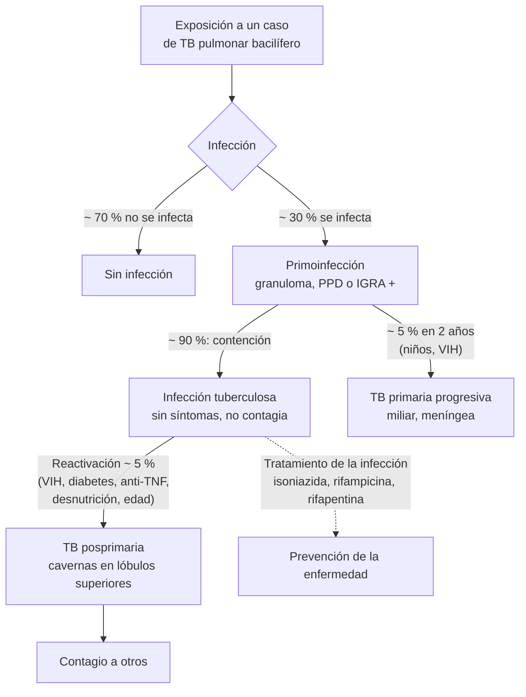

---
tags:
  - Respiratorio
  - Infectología
  - Frecuente en sala
---

# Tuberculosis

**Subespecialidad**
Enfermedades respiratorias · Infectología · Salud pública · APS

**Guías principales**
ATS/CDC/ERS/IDSA 2025: actualización del tratamiento de la tuberculosis sensible y resistente (*Am J Respir Crit Care Med*) · OMS: guías consolidadas de tuberculosis, módulo 4 (tratamiento) · MINSAL: Programa de Control y Eliminación de la Tuberculosis (PROCET) y su norma técnica

**Otras fuentes**
Informe mundial de tuberculosis OMS 2025 · Informe PROCET 2024 (MINSAL, 2026) · Ensayos TRUNCATE-TB (2023) y TB-PRACTECAL (2024)

**GES**
No es GES, pero el diagnóstico y el tratamiento son **gratuitos** para toda la población a través del PROCET, incluidas las personas extranjeras

**EUNACOM**
1.05.1.036 Tuberculosis pulmonar (específico, completo, completo) · 1.05.1.013 Derrame pleural por tuberculosis (específico, completo, completo) · 1.05.1.037 Fracaso de tratamiento (específico, inicial, derivar) · 1.04.1.028 Tuberculosis extrapulmonar (sospecha, inicial, derivar)

**Revisado**
Septiembre 2026

!!! abstract "Resumen en 60 segundos"
    - La **tuberculosis (TB)** volvió a ser la **infección más letal** del mundo: **10,7 millones** de enfermos y **1,23 millones** de muertes en 2024 (OMS).
    - **En Chile**:
        - Incidencia de **15,6 por 100.000** (3.138 casos en 2024), con **letalidad de 9,4 %**.
        - Está concentrada en el **norte** (Tarapacá: 46,8 por 100.000) y en **grupos vulnerables**: personas **extranjeras** (31 % de los casos), adultos mayores, consumo de drogas o alcohol, **VIH**, personas privadas de libertad y en **situación de calle**.
    - **Sospecharla** en todo **sintomático respiratorio** (**tos con expectoración ≥ 2 semanas**), sobre todo con **baja de peso**, fiebre, sudoración nocturna o hemoptisis.
    - **Diagnóstico**: **prueba molecular rápida** (Xpert MTB/RIF, que además detecta la **resistencia a rifampicina**), **baciloscopía** y **cultivo** de expectoración. **Radiografía de tórax**: infiltrados y **cavitaciones** en los lóbulos superiores. A **todo** caso se le ofrece el **examen de VIH**.
    - **Tratamiento de la TB sensible**: **2 meses de isoniazida, rifampicina, pirazinamida y etambutol (2HRZE)** seguidos de **4 meses de isoniazida y rifampicina (4HR)**, **supervisado**.
        - Alternativa (ATS 2025): **4 meses** de isoniazida, **rifapentina**, **moxifloxacino** y pirazinamida en los ≥ 12 años.
        - **TB resistente a rifampicina**: esquema oral de 6 meses **BPaLM** (bedaquilina, pretomanid, linezolid ± moxifloxacino).
    - **Vigilar la hepatotoxicidad** (isoniazida, rifampicina, pirazinamida), la neuropatía (dar **piridoxina**), la neuritis óptica (etambutol) y las **interacciones de la rifampicina**.
    - **Estudio de contactos** (tasa de TB de ~ 2.900 por 100.000 en los contactos domiciliarios en Chile) y **tratamiento de la infección tuberculosa** en los grupos de riesgo.

## Definición

- **Tuberculosis**: enfermedad infecciosa causada por ***Mycobacterium tuberculosis*** (complejo *M. tuberculosis*). Se transmite por **vía aérea**, por gotitas respiratorias (*droplet nuclei*) de personas con **TB pulmonar o laríngea** activa.
- **Infección tuberculosa (antes "TB latente")**: respuesta inmune persistente al bacilo (PPD o IGRA positivo) **sin enfermedad** clínica, radiológica ni bacteriológica. **No contagia**. Tiene riesgo de progresar a enfermedad (~ 5–10 % en la vida; mucho mayor en los inmunosuprimidos).
- **Tuberculosis activa (enfermedad)**: síntomas, imagen o bacteriología positiva.
    - **Pulmonar** (~ 80 % en Chile): la forma **contagiosa**.
    - **Extrapulmonar**: pleural, ganglionar, meníngea, osteoarticular (Pott), genitourinaria, abdominal, pericárdica, **miliar** (diseminada).
- **Caso nuevo**: nunca tratado, o tratado < 1 mes.
- **Recaída**: vuelve a enfermar tras un tratamiento exitoso.
- **Fracaso**: baciloscopía o cultivo **positivos al 4.º mes** o después.
- **Resistencias**:
    - **Monorresistente a isoniazida**.
    - **TB-RR** (resistente a rifampicina).
    - **TB-MDR** (resistente a isoniazida y rifampicina).
    - **Pre-XDR** (+ quinolonas).
    - **XDR** (+ quinolonas + bedaquilina o linezolid).

## Epidemiología

### Mundial

- **2024** (Informe mundial de tuberculosis OMS 2025):
    - **10,7 millones** de personas enfermaron de TB y **1,23 millones** murieron, 150.000 de ellas con VIH.
    - Entre 2015 y 2024, la incidencia bajó sólo **12 %** y las muertes **29 %**, lejos de las metas.
    - Sólo **78 %** de los enfermos fue diagnosticado y tratado.
    - El **éxito** del tratamiento de la TB sensible fue de **88 %**.
- **~ 1/4 de la población mundial** tiene infección tuberculosa.
- **Factores que impulsan la epidemia**: **desnutrición**, **VIH**, **consumo de alcohol**, **tabaquismo**, **diabetes**, pobreza y hacinamiento.
- La **TB resistente** es un problema creciente: ~ 400.000 casos de TB-RR/MDR al año.

### Chile

!!! chile "Datos nacionales (Informe PROCET 2024, MINSAL 2026)"
    - **Incidencia**: **15,6 por 100.000** (**3.138 casos**: 2.952 nuevos y 186 recaídas). La TB pulmonar con confirmación bacteriológica, la forma contagiosa, alcanzó **12,2 por 100.000**.
    - **Mortalidad**: **1,46 por 100.000** (294 muertes), **en alza**. **Letalidad**: **9,4 %**.
    - **Distribución**: las tasas más altas están en el **norte**. **Tarapacá** llega a **46,8 por 100.000** y sigue en alza desde 2020. Le siguen Arica y Parinacota, Antofagasta, la Región Metropolitana y el Biobío.
    - **El 81 % de los casos tiene al menos un factor de riesgo**:
        - **Personas extranjeras**: **31 %** de los casos (tasa de **60,5 por 100.000**, en alza).
        - **Mayores de 65 años**: 17,5 %.
        - **Drogadicción**: 16,9 %; **alcoholismo**: 13,5 %.
        - **Diabetes**: 10,4 %; **VIH**: 8,3 %.
        - **Personas privadas de libertad**: 6,9 % (tasa de 357 por 100.000).
        - **Situación de calle**: 5,3 % (tasa de **763 por 100.000**, ~ 50 veces la de la población general).
        - Los **contactos domiciliarios** tienen una tasa de ~ **2.900 por 100.000**.
    - **TB resistente**: **60 casos de TB-RR/MDR** en 2024 (5 pre-XDR y 1 XDR). **Dos tercios eran casos nuevos**, lo que indica **transmisión comunitaria** de cepas resistentes. Además, hubo 56 casos monorresistentes a isoniazida.
    - El **PROCET** entrega el diagnóstico y el tratamiento **gratuitos** y **supervisados**. La TB es una **enfermedad de notificación obligatoria**.

## Etiología y factores de riesgo

- ***Mycobacterium tuberculosis***: bacilo **ácido-alcohol resistente** (BAAR), aerobio y de **crecimiento lento** (el cultivo tarda 2–8 semanas). *M. bovis* es raro (leche no pasteurizada).
- **Riesgo de infección**: **contacto cercano y prolongado** con un caso pulmonar bacilífero, hacinamiento, ventilación deficiente, cárceles, hogares de larga estadía, personal de salud.
- **Riesgo de progresión a enfermedad**:
    - **VIH** (el mayor factor de riesgo).
    - **Infección reciente** (< 2 años).
    - **Inmunosupresores**: **anti-TNF**, corticoides en dosis altas, trasplante, quimioterapia.
    - **Diabetes**, **ERC en diálisis**, **silicosis**.
    - **Desnutrición**, **alcoholismo**, drogas, **tabaquismo**.
    - Gastrectomía, edad avanzada.

## Fisiopatología

1. Los bacilos inhalados llegan a los alvéolos y son fagocitados por los **macrófagos**, donde sobreviven y se multiplican.
2. **Primoinfección**: foco pulmonar (de Ghon) con diseminación a los ganglios hiliares (complejo de Ranke). A las 2–8 semanas se desarrolla la **inmunidad celular** (linfocitos T CD4, IFN-γ, TNF-α), y el PPD y el IGRA se positivizan.
3. La respuesta inmune forma **granulomas** con **necrosis caseosa** que contienen a los bacilos. En la mayoría (~ 90 %), la infección queda **contenida** (infección tuberculosa).
4. **Reactivación** (TB posprimaria, la forma habitual del adulto): cuando falla la inmunidad (VIH, diabetes, edad, fármacos), los bacilos se multiplican en los **segmentos apicales y posteriores de los lóbulos superiores** (alta tensión de oxígeno). La necrosis caseosa se licúa y drena al bronquio, formando **cavernas** con enorme cantidad de bacilos: **contagio**.
5. **Diseminación hematógena**: **TB miliar**, **meníngea**, ósea, renal. Es más frecuente en los niños y los inmunosuprimidos.
6. **TB pleural**: reacción de **hipersensibilidad** a unos pocos bacilos o antígenos que llegan a la pleura. El líquido tiene **pocos bacilos**, por eso el cultivo es poco sensible y se usa la **ADA**.
- **Resistencia**: surge por **mutaciones espontáneas** seleccionadas por un **tratamiento inadecuado** (monoterapia, abandono, dosis bajas), o por **contagio** de una cepa resistente. Por eso se usan **varios fármacos** a la vez y el tratamiento **supervisado**.

*Figura 1. Historia natural de la infección por* M. tuberculosis. *Esquema propio con proporciones aproximadas.*

## Clasificación

- **Por localización**: pulmonar (con o sin confirmación bacteriológica) o extrapulmonar.
- **Por antecedente de tratamiento**: caso nuevo, recaída, tratamiento tras pérdida de seguimiento, fracaso.
- **Por sensibilidad**: sensible, monorresistente a isoniazida, RR o MDR, pre-XDR, XDR.
- **Por condición de egreso** (resultado del tratamiento): curado, tratamiento terminado, fracaso, fallecido, pérdida de seguimiento, no evaluado.

## Clínica

- **TB pulmonar** (instalación **subaguda**, en semanas a meses):
    - **Tos** persistente, primero seca y luego **productiva**. Es el síntoma cardinal: el **sintomático respiratorio** (tos con expectoración **≥ 2 semanas**) debe estudiarse.
    - **Hemoptisis** (de estrías a masiva, por erosión de una arteria: aneurisma de Rasmussen).
    - **Fiebre** vespertina, **sudoración nocturna**.
    - **Baja de peso**, anorexia, astenia.
    - Dolor torácico pleurítico, disnea (enfermedad extensa o derrame).
    - El examen pulmonar puede ser **normal** o mostrar crépitos apicales.
- **TB pleural**:
    - Fiebre, dolor pleurítico, tos seca, disnea.
    - **Derrame unilateral**, habitualmente **exudado linfocitario** en adultos jóvenes.
- **TB miliar**: fiebre prolongada, compromiso del estado general, hepatoesplenomegalia, tubérculos coroideos en el fondo de ojo; radiografía con **micronódulos** difusos (figura 2).
- **TB meníngea**: cefalea y fiebre subagudas, compromiso de conciencia, **parálisis de pares craneanos** (VI), hidrocefalia; LCR con **linfocitos**, **glucosa muy baja** y **proteínas muy altas**.
- **TB ganglionar** (escrófula): adenopatías cervicales **indoloras** que se fistulizan. Es la forma extrapulmonar más frecuente en muchas series.
- **Otras**: **mal de Pott** (espondilodiscitis dorsal, con absceso paravertebral), **genitourinaria** (**piuria estéril**, hematuria), **peritoneal** (ascitis con ADA alta), **pericárdica** (constricción), **intestinal** (ileocecal).
- **En el VIH avanzado**: presentación **atípica** (lóbulos inferiores, sin cavernas, adenopatías, formas diseminadas), con baciloscopía más a menudo negativa.

!!! alarma "Situaciones de alarma"
    - **Hemoptisis masiva** (> 100–600 mL en 24 h según la definición, o con compromiso respiratorio): urgencia vital. Posición en decúbito lateral **sobre el pulmón que sangra**, vía aérea, broncoscopía y embolización.
    - **TB meníngea**: iniciar el tratamiento **empírico** sin esperar la confirmación, con **corticoides** (dexametasona).
    - **TB miliar** en un inmunosuprimido: alta mortalidad.
    - **Hepatitis por fármacos** (ictericia, transaminasas > 5 veces el límite superior, o > 3 veces con síntomas): **suspender** los fármacos hepatotóxicos.
    - **Sospecha de TB resistente** (contacto de un caso MDR, fracaso, abandono previo, migrante de un país con alta resistencia): prueba molecular y cultivo con **susceptibilidad** antes de tratar.

## Diagnóstico

**Paso 1. Sospecha**: sintomático respiratorio (tos ≥ 2 semanas), síntomas generales, grupos de riesgo, imagen sugerente. En los inmunosuprimidos, la sospecha debe ser más amplia.

**Paso 2. Muestras de expectoración** (**2 muestras**, idealmente una matinal; en Chile se pide al sintomático respiratorio):

- **Prueba molecular rápida** (**Xpert MTB/RIF Ultra** o equivalente):
    - La prueba de **primera línea** (OMS).
    - Detecta *M. tuberculosis* en ~ 2 horas, con mayor sensibilidad que la baciloscopía.
    - Detecta la **resistencia a rifampicina**.
- **Baciloscopía** (tinción de Ziehl-Neelsen): rápida y barata, pero **poco sensible** (~ 50–60 %). Indica la **contagiosidad** y sirve para el **seguimiento** del tratamiento.
- **Cultivo** (medio líquido MGIT o sólido Löwenstein-Jensen): el **estándar de referencia**. Es más sensible (detecta ~ 10–100 bacilos/mL), pero tarda semanas. Permite el **estudio de susceptibilidad** a los fármacos.
- Si no hay expectoración: **esputo inducido** con suero hipertónico, **aspirado gástrico** (niños) o **broncoscopía con lavado broncoalveolar**.

**Paso 3. Radiografía de tórax** (y TC en casos dudosos).

**Paso 4. Examen de VIH** a **todo** paciente con TB. También glicemia, función hepática y renal, y hemograma basales.

**Paso 5. TB extrapulmonar**:

- Muestras del sitio afectado (líquido pleural, LCR, orina, biopsia ganglionar o pleural) para **cultivo**, **PCR** y **histología** (**granulomas con necrosis caseosa**).
- **ADA** en los líquidos pleural, peritoneal y pericárdico.

**Paso 6. Infección tuberculosa** (en los contactos y los inmunosuprimidos):

- **PPD** (tuberculina; positivo ≥ 5 o ≥ 10 mm según el riesgo).
- **IGRA** (QuantiFERON): no se afecta por la vacuna BCG.
- **Ninguno de los dos distingue la infección de la enfermedad**. Antes de tratar la infección, **descartar la TB activa** (clínica y radiografía).

### Derrame pleural tuberculoso

| Parámetro | Hallazgo típico |
|---|---|
| **Aspecto** | Amarillo citrino; **exudado** (criterios de Light) |
| **Células** | **Predominio linfocitario** (> 50–75 %) (neutrófilos en los primeros días); **pocas células mesoteliales** (< 5 %) |
| **ADA** | **> 40 U/L** (alto valor predictivo en un país con prevalencia moderada como Chile; los falsos positivos son el empiema, la artritis reumatoide y los linfomas) |
| **Glucosa** | Normal o baja |
| **Baciloscopía / cultivo del líquido** | **Baja sensibilidad** (< 10 % / ~ 30 %) |
| **Biopsia pleural** | Granulomas con necrosis caseosa; cultivo de la biopsia (sensibilidad > 80 % en conjunto) |

## Laboratorio

| Examen | Uso |
|---|---|
| **Xpert MTB/RIF** (o prueba molecular equivalente) | Diagnóstico rápido y **resistencia a rifampicina** |
| **Baciloscopía** | Diagnóstico, contagiosidad y **seguimiento mensual** |
| **Cultivo y susceptibilidad** | Confirmación y estudio de **resistencia** |
| **VIH** | A **todo** caso de TB |
| **Pruebas hepáticas basales** (transaminasas, bilirrubina) | Hepatotoxicidad; repetir si hay síntomas o factores de riesgo (alcohol, hepatopatía, VIH, embarazo, adultos mayores) |
| **Creatinina, ácido úrico, glicemia, hemograma** | Ajuste de dosis (etambutol y pirazinamida en la ERC), diabetes asociada |
| **ADA en líquidos** | TB pleural, peritoneal y pericárdica |
| **Agudeza visual y visión de colores** | Basal y mensual con etambutol |
| **PPD o IGRA** | Infección tuberculosa (no para el diagnóstico de la enfermedad activa) |

## Imágenes

- **Radiografía de tórax**:
    - **TB posprimaria**: infiltrados y nódulos en los **segmentos apicales y posteriores de los lóbulos superiores** o el segmento superior del inferior; **cavernas**; diseminación broncógena (nódulos en "árbol en brote" en la TC); fibrosis y retracción en las secuelas.
    - **TB primaria**: adenopatías hiliares o mediastínicas, consolidación en cualquier lóbulo, derrame pleural.
    - **Miliar**: micronódulos difusos de 1–3 mm.
    - **Derrame pleural** unilateral.
- **TC de tórax**: más sensible (cavernas pequeñas, "árbol en brote", adenopatías con centro necrótico, miliar).
- **Ecografía**: derrames loculados, abscesos, adenopatías; guía de las punciones.

<figure markdown>
{ loading=lazy }
<figcaption>Figura 2. A y B: tuberculosis miliar en la TC (micronódulos en "grano de mijo" de distribución aleatoria) y en la ecografía pleural. C y D: absceso tuberculoso de la pared torácica. Fuente: Rea G, Sperandeo M, Lieto R, et al. Chest Imaging in the Diagnosis and Management of Pulmonary Tuberculosis: The Complementary Role of Thoraci Ultrasound. <em>Front Med (Lausanne).</em> 2021;8:753821, figura 2. Licencia <a href="https://creativecommons.org/licenses/by/4.0/">CC BY 4.0</a>.</figcaption>
</figure>

## Diagnóstico diferencial

| Cuadro | Claves |
|---|---|
| **Neumonía bacteriana** | Instalación aguda, responde a los antibióticos. **Evitar las quinolonas** si se sospecha una TB: pueden enmascararla y generar resistencia |
| **Cáncer pulmonar** | Fumador, masa, baja de peso, hemoptisis; pueden coexistir |
| **Micobacterias no tuberculosas** | *M. avium*, *M. kansasii*; bronquiectasias, mujeres mayores, EPOC; el cultivo las distingue |
| **Micosis** (histoplasmosis, paracoccidioidomicosis, aspergiloma) | Epidemiología; aspergiloma en una caverna antigua |
| **Absceso pulmonar** | Cavidad con nivel hidroaéreo, aspiración, anaerobios |
| **Granulomatosis con poliangeítis** | Nódulos cavitados, compromiso renal y sinusal, ANCA |
| **Sarcoidosis** | Adenopatías hiliares bilaterales; granulomas **sin** necrosis caseosa |
| **Derrame pleural linfocitario de otra causa** | Neoplásico (citología), linfoma, insuficiencia cardíaca (trasudado), artritis reumatoide |

## Tratamiento

!!! guia "OMS, ATS/CDC/ERS/IDSA 2025 y PROCET"
    - **Tratamiento supervisado** (observación directa de cada dosis, presencial o por video) para asegurar la adherencia y evitar la resistencia. En Chile lo entregan gratuitamente los establecimientos de APS.
    - **TB sensible**:
        - Esquema estándar de **6 meses**: **2HRZE / 4HR**.
        - Esquema de **4 meses** con **rifapentina y moxifloxacino** (2HPZM/2HPM) en los ≥ 12 años, como alternativa condicional (ATS 2025), según la disponibilidad.
    - **TB-RR/MDR** (sensible a quinolonas): **BPaLM** (bedaquilina + pretomanid + linezolid + moxifloxacino) por **6 meses**. **BPaL** si hay resistencia a quinolonas. Manejo por el equipo especializado.
    - **VIH**: iniciar la **terapia antirretroviral** en las primeras **2 semanas** tras el inicio del tratamiento de la TB, salvo en la **meningitis tuberculosa** (diferirla 4–8 semanas).
    - **TB meníngea y pericárdica**: agregar **corticoides** (en la meníngea, dexametasona por 6–8 semanas). En la meníngea, la fase de continuación se prolonga hasta completar **9–12 meses**.
    - **Estudio de contactos** y **tratamiento de la infección tuberculosa** en los contactos y los grupos de riesgo.

!!! dosis "Fármacos antituberculosos de primera línea (adultos, dosis diaria)"
    | Fármaco | Dosis | Efectos adversos principales |
    |---|---|---|
    | **Isoniazida (H)** | **5 mg/kg** (máximo **300 mg**) | **Hepatitis** (mayor con alcohol y edad), **neuropatía periférica** (prevenir con **piridoxina 25–50 mg/día**), exantema, síndrome lupus-like |
    | **Rifampicina (R)** | **10 mg/kg** (máximo **600 mg**) | Hepatitis (colestásica), **coloración anaranjada** de la orina, lágrimas y secreciones (lentes de contacto), síntomas gripales, trombocitopenia. **Potente inductor enzimático**: reduce el efecto de los **anticonceptivos**, **anticoagulantes** (warfarina, ACOD), antirretrovirales, corticoides, **metadona**, antiepilépticos e hipoglicemiantes |
    | **Pirazinamida (Z)** | **25 mg/kg** (máximo ~ 2 g) | **Hepatitis** (la más hepatotóxica), **hiperuricemia** y gota, artralgias |
    | **Etambutol (E)** | **15–20 mg/kg** | **Neuritis óptica** (baja de la agudeza visual, alteración de la **visión de colores**): control mensual; ajustar en la ERC |

    - **Esquema estándar**: **2 meses de HRZE diarios** (fase intensiva) + **4 meses de HR** (fase de continuación), en comprimidos de **dosis fijas combinadas** cuando están disponibles.
    - **Esquema de 4 meses (ATS 2025)**: isoniazida 300 mg + **rifapentina 1.200 mg** + **moxifloxacino 400 mg** diarios por 17 semanas, + pirazinamida por 8 semanas.
    - **Tratamiento de la infección tuberculosa**:
        - **Isoniazida** por 6–9 meses.
        - **Rifampicina** por 4 meses.
        - **Isoniazida + rifapentina semanal** por 3 meses (3HP).
        - Isoniazida + rifampicina por 3 meses.
    - **Hepatotoxicidad**:
        - **Suspender** los fármacos hepatotóxicos si las transaminasas son **> 5 veces** el límite superior, o **> 3 veces con síntomas** o ictericia.
        - Cuando se normalizan, **reintroducirlos uno a uno** (primero rifampicina, luego isoniazida), bajo control.
        - La pirazinamida a menudo no se reintroduce.

**Seguimiento del tratamiento**:

- **Baciloscopía y cultivo mensuales**, sobre todo al **2.º mes**. Si el cultivo sigue positivo al 2.º mes, estudiar la resistencia y la adherencia.
- **Fracaso**: baciloscopía o cultivo positivo al **4.º mes** o después. **Derivar** al especialista, con estudio de susceptibilidad. **Nunca agregar un solo fármaco** a un esquema que está fallando.
- Control clínico de los efectos adversos, del peso y de la adherencia.

## Complicaciones

- **Hemoptisis**, incluida la **masiva**.
- **Secuelas pulmonares**: fibrosis, **bronquiectasias**, cavidades residuales (con riesgo de **aspergiloma**), **EPOC** postuberculosa, hipertensión pulmonar.
- **Neumotórax**, **empiema** tuberculoso, fístula broncopleural.
- **Fibrotórax** y restricción tras el derrame pleural.
- **TB diseminada**, meningitis con secuelas neurológicas, pericarditis constrictiva, **mal de Pott** con compresión medular.
- **Insuficiencia suprarrenal** (TB suprarrenal).
- **Del tratamiento**: **hepatitis**, neuropatía, neuritis óptica, reacciones cutáneas graves, **síndrome inflamatorio de reconstitución inmune (IRIS)** en el VIH, **interacciones** de la rifampicina.
- **Resistencia** por el tratamiento irregular.

## Pronóstico y seguimiento

- La **TB sensible es curable** en **~ 90 %** con un tratamiento completo y supervisado. Sin tratamiento, la TB pulmonar bacilífera tiene una mortalidad de **~ 50 %** a 5 años.
- **Peor pronóstico**: VIH, edad avanzada, diagnóstico tardío, TB meníngea o miliar, **TB resistente**, alcoholismo, situación de calle y **abandono**.
- **Perfil EUNACOM**:
    - **TB pulmonar** y **derrame pleural tuberculoso**: diagnóstico específico, **tratamiento completo** (esquema primario supervisado) y **seguimiento completo** en la APS.
    - **Fracaso de tratamiento**: tratamiento inicial y **derivación**.
    - **TB extrapulmonar**: sospecha y derivación.
- **Salud pública**:
    - **Notificación** obligatoria.
    - **Estudio de contactos** (sobre todo los domiciliarios, los niños < 5 años y los inmunosuprimidos).
    - **Aislamiento respiratorio** (mascarilla N95 para el personal y mascarilla quirúrgica para el paciente) mientras sea bacilífero; habitualmente deja de ser contagioso tras **2 semanas** de tratamiento eficaz.
    - Vacuna **BCG** en los recién nacidos (protege de las formas graves en los niños).

## Perlas para el internado

!!! perla "Para la sala y el turno"
    - **Tos de más de 2 semanas** = pide **baciloscopía y prueba molecular** de expectoración (2 muestras), sobre todo en migrantes, personas en situación de calle, privadas de libertad, con alcoholismo, diabetes o VIH.
    - **No trates una "neumonía que no mejora" con quinolonas** sin descartar una TB.
    - **Paciente hospitalizado con sospecha de TB pulmonar**: **aislamiento respiratorio** y **N95** hasta descartar la TB.
    - A **todo** paciente con TB, **examen de VIH**. A todo paciente con VIH, busca la TB.
    - **Rifampicina = interacciones**: revisa los **anticonceptivos**, los **anticoagulantes**, los antirretrovirales, los corticoides y la metadona.
    - **Orina naranja** con rifampicina es normal (advierte al paciente).
    - Da **piridoxina** con la isoniazida a los diabéticos, alcohólicos, desnutridos, embarazadas, pacientes con VIH o ERC.
    - **Derrame pleural linfocitario con ADA > 40 U/L** en un adulto joven = TB pleural hasta demostrar lo contrario.
    - **Un PPD o IGRA negativo no descarta una TB activa**, y uno positivo no la confirma.

## Preguntas de repaso

??? repaso "1. Hombre de 38 años, migrante, con tos productiva de 6 semanas, fiebre vespertina, sudoración nocturna y baja de 7 kg. La radiografía muestra un infiltrado con una caverna en el lóbulo superior derecho. ¿Qué haces?"
    Sospecha de **TB pulmonar**, probablemente bacilífera (caverna).

    1. **Aislamiento respiratorio**.
    2. **2 muestras de expectoración** para **prueba molecular** (Xpert MTB/RIF: diagnóstico y resistencia a rifampicina), **baciloscopía** y **cultivo con susceptibilidad**.
    3. **Examen de VIH**, pruebas hepáticas, creatinina, glicemia, hemograma y agudeza visual.
    4. Si se confirma una TB sensible: **2HRZE / 4HR supervisado** (PROCET), con piridoxina si hay factores de riesgo.
    5. **Notificar** y hacer el **estudio de contactos**.

??? repaso "2. Mujer de 25 años con fiebre, dolor pleurítico y derrame pleural derecho. Líquido pleural: exudado, 85 % de linfocitos, ADA 78 U/L, baciloscopía negativa. ¿Cuál es el diagnóstico y el tratamiento?"
    **Derrame pleural tuberculoso** (exudado linfocitario con **ADA > 40 U/L** en una adulta joven). La baciloscopía del líquido suele ser negativa porque tiene pocos bacilos.

    - Se puede confirmar con cultivo o biopsia pleural, si hay dudas.
    - Enviar la **expectoración** para buscar una TB pulmonar asociada.
    - **Examen de VIH**.
    - Tratamiento: **esquema estándar 2HRZE / 4HR**. No se requiere drenaje completo del derrame, salvo por síntomas.

??? repaso "3. Paciente en la 4.ª semana de tratamiento antituberculoso con náuseas, ictericia y transaminasas 7 veces sobre el límite superior. ¿Qué haces?"
    **Hepatitis por fármacos antituberculosos**.

    1. **Suspender** la isoniazida, la rifampicina y la pirazinamida.
    2. Descartar otras causas (hepatitis virales, alcohol, otros fármacos).
    3. Si la TB es grave o muy contagiosa, mantener un **esquema no hepatotóxico** transitorio (etambutol + una quinolona ± un aminoglucósido) hasta la normalización.
    4. Cuando las transaminasas bajen a < 2 veces el límite superior, **reintroducir uno a uno** (rifampicina, luego isoniazida) con control estricto.
    5. Derivar al especialista del programa.

??? repaso "4. Paciente que al 4.º mes de tratamiento sigue con baciloscopía positiva. ¿Qué significa y qué no debes hacer?"
    Es un **fracaso de tratamiento**. Hay que sospechar una **TB resistente** o una mala adherencia.

    - Pedir **cultivo y prueba de susceptibilidad** (molecular y fenotípica).
    - Revisar la **adherencia** (¿el tratamiento fue supervisado?) y la absorción.
    - **Derivar** al especialista y al programa.
    - **Nunca agregar un solo fármaco** a un esquema que está fallando: equivale a una monoterapia y genera más resistencia.
    - Si se confirma una TB-RR o MDR: esquema **BPaLM** u otro según la susceptibilidad.

??? repaso "5. Paciente con artritis reumatoide que va a iniciar un anti-TNF. ¿Qué estudio de tuberculosis necesita?"
    **Tamizaje de infección tuberculosa** con **IGRA** (o PPD) y **radiografía de tórax**, y anamnesis de síntomas y de contacto con TB.

    - Si el IGRA es positivo y **se descarta la TB activa**: **tratar la infección tuberculosa** (por ejemplo, rifampicina 4 meses o isoniazida 9 meses con piridoxina) e iniciar el anti-TNF después de ~ 1 mes de tratamiento, según el protocolo.
    - Los anti-TNF aumentan mucho el riesgo de reactivación, incluidas las formas extrapulmonares y diseminadas.

## Referencias

1. Saukkonen JJ, Duarte R, Munsiff SS, et al. Updates on the Treatment of Drug-Susceptible and Drug-Resistant Tuberculosis: An Official ATS/CDC/ERS/IDSA Clinical Practice Guideline. *Am J Respir Crit Care Med.* 2025;211:15–33. doi:[10.1164/rccm.202410-2096ST](https://doi.org/10.1164/rccm.202410-2096ST)
2. World Health Organization. Global tuberculosis report 2025. Geneva: WHO; 2025. [who.int](https://www.who.int/teams/global-programme-on-tuberculosis-and-lung-health/tb-reports/global-tuberculosis-report-2025)
3. World Health Organization. WHO consolidated guidelines on tuberculosis: Module 4: treatment and care. Geneva: WHO; 2025. [who.int](https://www.who.int/publications)
4. Ministerio de Salud de Chile. Informe de situación epidemiológica y operacional del Programa de Control y Eliminación de la Tuberculosis 2024. Santiago: MINSAL; 2026. [diprece.minsal.cl](https://diprece.minsal.cl/wp-content/uploads/2026/01/2026.01.20_INFORME-TUBERCULOSIS-2024.pdf)
5. Paton NI, Cousins C, Suresh C, et al. Treatment Strategy for Rifampin-Susceptible Tuberculosis (TRUNCATE-TB). *N Engl J Med.* 2023;388:873–887. doi:[10.1056/NEJMoa2212537](https://doi.org/10.1056/NEJMoa2212537)
6. Nyang'wa BT, Berry C, Kazounis E, et al. Short oral regimens for pulmonary rifampicin-resistant tuberculosis (TB-PRACTECAL): an open-label, randomised, controlled, phase 2B-3, multi-arm, multicentre, non-inferiority trial. *Lancet Respir Med.* 2024;12:117–128. doi:[10.1016/S2213-2600(23)00389-2](https://doi.org/10.1016/S2213-2600(23)00389-2)
7. Rea G, Sperandeo M, Lieto R, et al. Chest Imaging in the Diagnosis and Management of Pulmonary Tuberculosis: The Complementary Role of Thoraci Ultrasound. *Front Med (Lausanne).* 2021;8:753821. doi:[10.3389/fmed.2021.753821](https://doi.org/10.3389/fmed.2021.753821)
