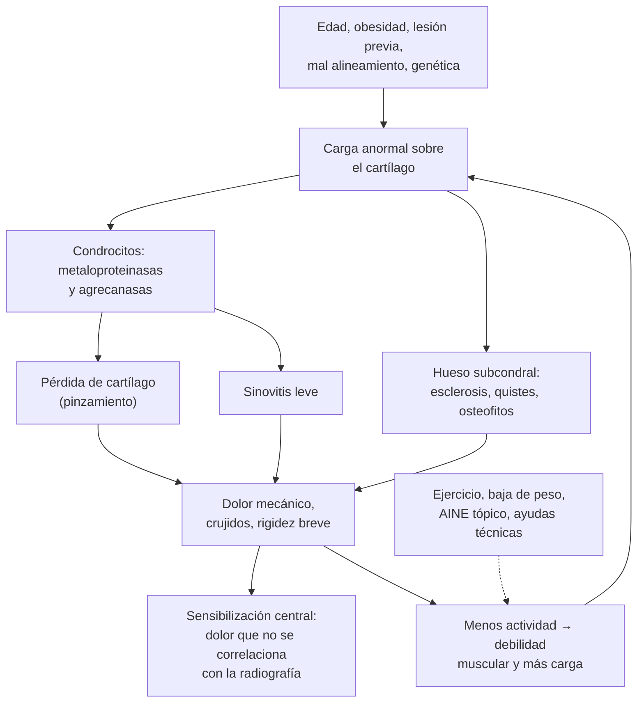
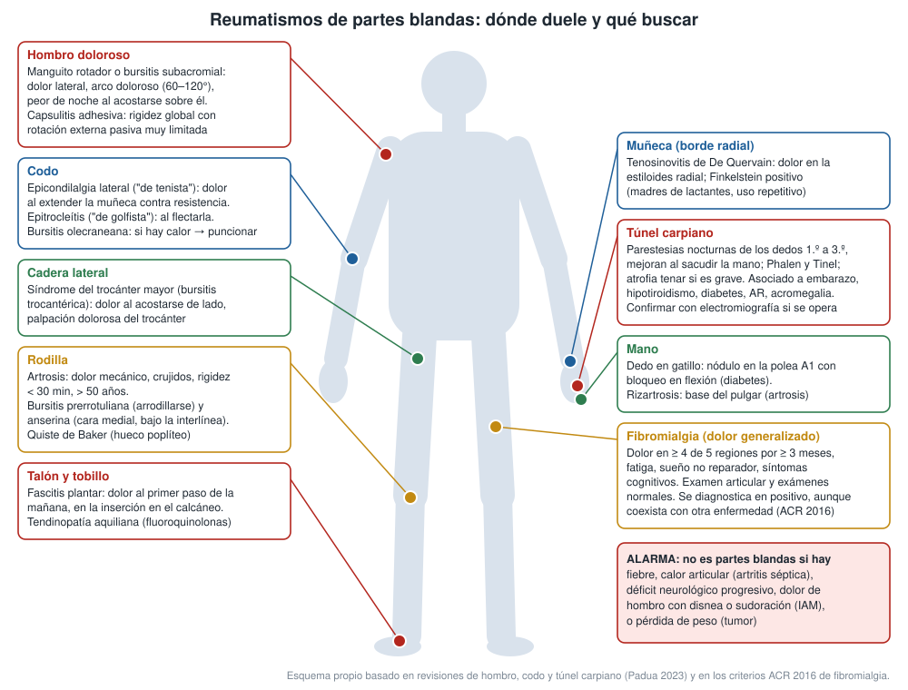

---
tags:
  - Reumatología
  - GES
---

# Artrosis, reumatismos de partes blandas, síndrome de túnel carpiano y fibromialgia

**Subespecialidad**
Reumatología · Traumatología · Fisiatría

**Guías principales**
OARSI 2019: artrosis de rodilla, cadera y poliarticular · ACR/Arthritis Foundation 2019: artrosis de mano, cadera y rodilla · NICE NG226 (2022): artrosis · EULAR 2018: artrosis de manos · MINSAL 2018: guía GES de artrosis de cadera y rodilla en personas de 55 años y más · ACR 2016: criterios de fibromialgia · EULAR 2016: tratamiento de la fibromialgia

**Otras fuentes**
GBD 2021: carga de la artrosis · Ensayo CSAW (descompresión subacromial, 2018) · Ensayo de infiltración en la epicondilalgia (Coombes 2013) · Revisión del síndrome de túnel carpiano (*Lancet Neurol* 2023)

**GES**
**Tratamiento médico de la artrosis de cadera y/o rodilla leve o moderada en personas de 55 años y más (GES 41)**: tratamiento en ≤ 24 horas desde la confirmación y especialista en ≤ 120 días desde la indicación. **Endoprótesis total de cadera en personas de 65 años y más con artrosis con limitación funcional severa (GES 12)**: cirugía en ≤ 240 días desde la confirmación. Copago: FONASA 0 %, isapre 20 %.

**EUNACOM**
1.11.1.004 Artrosis (específico, inicial, completo) · 1.11.1.011 Hombro doloroso (sospecha, inicial, completo) · 1.11.1.008 Epicondilalgia y epitroclealgia (sospecha, inicial, completo) · 1.11.1.024 Tendinitis y bursitis (específico, inicial, completo) · 1.11.1.023 Síndrome de túnel carpiano (específico, inicial, derivar) · 1.10.1.014 Neuropatías por atrapamiento (sospecha, inicial, no requiere) · 1.11.1.010 Fibromialgia (sospecha, inicial, derivar)

**Revisado**
Octubre 2026

!!! abstract "Resumen en 60 segundos"
    - La **artrosis** es la enfermedad articular más frecuente: **595 millones** de personas en el mundo (**7,6 %**). En Chile la tiene el **19 %** de los mayores de 55 años (rodilla **14,4 %**, cadera **9 %**; ENS 2016–2017).
    - **Clínica**: dolor **mecánico** (con la carga, cede con el reposo), **rigidez breve (< 30 min)**, crujidos, aumento de volumen **óseo**, sin calor.
        - Manos: nódulos de **Heberden** (IFD) y **Bouchard** (IFP), **rizartrosis**.
        - Cadera: dolor **inguinal** con **rotación interna limitada**.
        - El diagnóstico es **clínico** en mayores de 45 años con dolor de actividad y rigidez breve (NICE 2022).
    - **Tratamiento base** para todos: **educación**, **ejercicio** (fortalecimiento y aeróbico) y **bajar de peso** si hay sobrepeso.
        - Luego **AINE tópico** (rodilla y manos), **AINE oral** en la dosis menor y por poco tiempo, **infiltración con corticoides** en las crisis de rodilla.
        - **Paracetamol**: la guía GES chilena lo usa como primera línea; OARSI 2019 lo desaconseja por su poca eficacia.
        - **Evitar los opioides fuertes**, la glucosamina y la condroitina (cadera y rodilla).
        - **Prótesis** si el dolor es refractario y limita mucho (GES 12 para la cadera desde los 65 años).
    - **Hombro doloroso**: casi siempre es una **tendinopatía del manguito rotador** (arco doloroso). Se trata con **ejercicio**, AINE e infiltración subacromial; la **descompresión quirúrgica no es mejor que el placebo** (CSAW). La **capsulitis adhesiva** limita **toda** la movilidad, incluida la pasiva.
    - **Epicondilalgia**: autolimitada (~ 1 año). La **infiltración** alivia a corto plazo, pero **aumenta las recaídas** al año.
    - **Túnel carpiano**: parestesias **nocturnas** de los dedos 1.º a 3.º. Se trata con **férula nocturna** e infiltración; **cirugía** si es grave o hay atrofia o denervación.
    - **Bursitis** superficial **caliente**: **puncionar** para descartar una infección (*S. aureus*).
    - **Fibromialgia**: dolor **generalizado** ≥ 3 meses, fatiga y sueño no reparador, con examen y exámenes normales. Se trata con **ejercicio** (la única recomendación fuerte), educación, terapia cognitivo-conductual y fármacos en dosis bajas (amitriptilina, duloxetina, pregabalina). **No** usar opioides.

## Definición

| Término | Definición |
|---|---|
| **Artrosis (osteoartritis)** | Enfermedad de **toda la articulación**: pérdida del **cartílago**, remodelación y **esclerosis del hueso subcondral**, **osteofitos** y sinovitis leve, con dolor y limitación funcional |
| **Artrosis primaria y secundaria** | Primaria: sin causa local. Secundaria: trauma, displasia, artritis previa, hemocromatosis, condrocalcinosis, necrosis avascular, acromegalia |
| **Artrosis erosiva de manos** | Variante **inflamatoria** de las IFD e IFP con erosiones centrales ("alas de gaviota") |
| **Reumatismos de partes blandas** | Lesiones de las estructuras **periarticulares**: tendones (tendinopatía), vainas (tenosinovitis), bolsas serosas (bursitis), entesis, fascias y nervios atrapados |
| **Hombro doloroso** | Dolor de hombro de cualquier causa. Lo más frecuente es la **tendinopatía del manguito rotador** con o sin bursitis subacromial ("síndrome de pinzamiento") |
| **Capsulitis adhesiva (hombro congelado)** | Inflamación y **fibrosis de la cápsula** glenohumeral con pérdida de la movilidad **activa y pasiva**, sobre todo de la **rotación externa** |
| **Epicondilalgia lateral y epitroclealgia** | Tendinopatía de los extensores de la muñeca (epicóndilo lateral, "codo de tenista") o de los flexores y pronadores (epitróclea, "codo de golfista") |
| **Síndrome de túnel carpiano** | Compresión del **nervio mediano** en el carpo. Es la **neuropatía por atrapamiento más frecuente** |
| **Fibromialgia** | Síndrome de **dolor crónico generalizado** con fatiga, sueño no reparador y síntomas cognitivos, por **sensibilización central** (dolor nociplástico), sin daño tisular que lo explique |

## Epidemiología

### Mundial

- **Artrosis** (GBD 2021):
    - **595 millones** de personas en 2020 (**7,6 %** de la población), un **132 % más** de casos que en 1990.
    - Para 2050 se proyectan aumentos de **74,9 %** en la rodilla, **78,6 %** en la cadera y **48,6 %** en la mano.
    - Es la **séptima causa de años vividos con discapacidad** en los mayores de 70 años.
- Es más frecuente en **mujeres** (rodilla y mano), con la **edad** y con la **obesidad** (sobre todo la rodilla).
- El **túnel carpiano** es la neuropatía por atrapamiento más frecuente. Se asocia a la edad, el sexo femenino, la obesidad, el embarazo, la diabetes, el hipotiroidismo, la AR y el trabajo manual repetitivo (Padua 2023).

!!! chile "Datos nacionales"
    - **ENS 2016–2017**, en personas de **55 años y más** (guía GES 2018):
        - **Artrosis de rodilla 14,4 %** (~ **619.000** personas) y **de cadera 9 %** (~ 385.000).
        - El 4,6 % tiene ambas, por lo que la prevalencia total es de ~ **19 %**.
        - Más frecuente en FONASA que en isapres (cadera 10,3 % vs 2,7 %).
    - **GES 41** (55 años y más, artrosis de cadera o rodilla leve o moderada):
        - Garantiza el **tratamiento médico** desde la confirmación por un médico (≤ 24 horas) y la atención por **especialista** en ≤ 120 días desde la indicación.
        - Incluye medicamentos, infiltraciones y ayudas técnicas.
    - **GES 12** (65 años y más, artrosis de cadera con limitación funcional severa):
        - **Prótesis total** en ≤ 240 días desde la confirmación, primer control por especialista ≤ 40 días después de la cirugía.
        - Rehabilitación hospitalaria precoz en ≤ 24 horas y ambulatoria en ≤ 14 días.
    - La **guía GES 2018** **recomienda** el paracetamol como primera línea y **desaconseja** los AINE no selectivos como tratamiento **crónico**, la glucosamina, la condroitina, sus combinaciones y los insaponificables de palta y soya.
    - El dolor musculoesquelético crónico es una de las principales causas de **licencias médicas** en Chile. Ver [lumbago](lumbago-lumbociatica-y-cervicalgia.md).

## Etiología y factores de riesgo

- **Artrosis**:
    - **Sistémicos**: **edad**, **sexo femenino**, **obesidad** (carga mecánica e inflamación metabólica), genética, diabetes.
    - **Locales**: **lesión articular previa** (meniscos, ligamento cruzado anterior, fracturas articulares), **mal alineamiento** (genu varo o valgo), displasia de cadera, debilidad del cuádriceps, actividad laboral o deportiva de alta exigencia.
    - **Secundaria**: artritis inflamatoria o séptica previa, **condrocalcinosis**, **hemocromatosis** (MCF 2.ª y 3.ª), necrosis avascular, acromegalia, enfermedad de Paget.
- **Partes blandas**:
    - **Sobreuso** y movimientos **repetitivos**, el envejecimiento del tendón y la mala técnica.
    - **Diabetes**: capsulitis adhesiva, dedo en gatillo, túnel carpiano.
    - **Fármacos**: **fluoroquinolonas** (tendinopatía y rotura del Aquiles), estatinas, corticoides.
    - **Trauma** (rotura del manguito).
- **Túnel carpiano**: **embarazo**, **hipotiroidismo**, **diabetes**, **AR**, **acromegalia**, **amiloidosis** (por transtiretina: túnel carpiano bilateral años antes de la miocardiopatía), **hemodiálisis**, fracturas de muñeca, trabajo manual.
- **Fibromialgia**: predisposición genética, trauma físico o emocional, **estrés**, trastornos del sueño, depresión y ansiedad. Es más frecuente en **mujeres** y coexiste con frecuencia con enfermedades reumáticas inflamatorias.

## Fisiopatología

- **Artrosis**: desequilibrio entre la **destrucción** y la **reparación** del cartílago.
    - Los condrocitos sometidos a carga anormal producen **metaloproteinasas** y agrecanasas que degradan el colágeno tipo II y los proteoglicanos.
    - El hueso subcondral se **esclerosa** y forma **osteofitos** y quistes. La sinovial se inflama en forma leve.
    - El cartílago **no tiene nervios**: el dolor viene del hueso subcondral (edema óseo), la sinovial, la cápsula y la **sensibilización** central y periférica. Por eso el dolor **no se correlaciona bien con la radiografía**.
- **Tendinopatía**: no es una "tendinitis" inflamatoria clásica, sino una **degeneración** del tendón por carga repetida (fibras desorganizadas, neovasos). Por eso responde mejor al **ejercicio de carga progresiva** que al reposo o los corticoides a largo plazo.
- **Túnel carpiano**: aumenta la presión en el túnel (por edema, sinovitis o depósito), lo que causa isquemia y desmielinización del mediano, con parestesias que empeoran de noche por la flexión de la muñeca.
- **Fibromialgia**: **sensibilización central**. El sistema nervioso amplifica las señales dolorosas (más sustancia P y glutamato, menor inhibición descendente serotoninérgica y noradrenérgica). Por eso responden mejor los fármacos de **acción central** que los analgésicos periféricos.

## Clasificación

- **Artrosis según su localización**: rodilla (tibiofemoral, patelofemoral), cadera, manos (IFD, IFP, trapeciometacarpiana), columna, otras (hombro, tobillo: piensa en una causa secundaria).
- **Clasificación radiográfica de Kellgren-Lawrence** (0–4):

| Grado | Hallazgos |
|---|---|
| **0** | Normal |
| **1** | Osteofito dudoso, posible pinzamiento |
| **2** | Osteofitos definidos, pinzamiento posible |
| **3** | Osteofitos múltiples, **pinzamiento definido**, algo de esclerosis |
| **4** | Osteofitos grandes, **pinzamiento marcado**, esclerosis importante, deformidad |

- **GES**: artrosis "leve o moderada" (tratamiento médico) frente a artrosis con **limitación funcional severa** (cirugía).
- **Reumatismos de partes blandas según la región**: hombro, codo, muñeca y mano, cadera, rodilla, tobillo y pie (figura 1).
- **Fibromialgia (ACR 2016)**:
    - **Índice de dolor generalizado ≥ 7** y escala de gravedad de síntomas **≥ 5**, o índice 4–6 con gravedad ≥ 9.
    - **Dolor generalizado**: en ≥ 4 de 5 regiones.
    - Síntomas por **≥ 3 meses**.
    - El diagnóstico es **válido aunque coexista** con otra enfermedad.

<figure markdown>
{ loading=lazy }
<figcaption>Figura 1. Reumatismos de partes blandas según la región, con los signos que orientan al diagnóstico, y las señales de alarma que obligan a buscar otra causa. Esquema propio basado en la revisión de túnel carpiano de Padua et al. (2023) y en los criterios ACR 2016 de fibromialgia.</figcaption>
</figure>

## Clínica

### Artrosis

- **Dolor mecánico**: aparece con la **carga** y la actividad y cede con el reposo. En la artrosis avanzada también duele en reposo o de noche.
- **Rigidez matinal o tras la inactividad < 30 minutos** (fenómeno de "gel").
- **Crujidos**, **aumento de volumen óseo** (duro), limitación de la movilidad, deformidad (genu varo), **inestabilidad**.
- Puede haber un **derrame** no inflamatorio (rodilla), **sin calor** importante.
- **Rodilla**: dolor al subir o bajar escaleras y al levantarse. Crujidos, osteofitos palpables, derrame.
- **Cadera**: dolor en la **ingle** (o en el muslo anterior o la rodilla). **Rotación interna** limitada y dolorosa. Cojera.
- **Manos**: nódulos de **Heberden** (IFD) y **Bouchard** (IFP). La **rizartrosis** (base del pulgar) dificulta la pinza.

### Hombro doloroso

- **Tendinopatía del manguito rotador** (supraespinoso) y bursitis subacromial:
    - Dolor en la cara **lateral** del hombro y el deltoides, **peor de noche** al acostarse sobre él.
    - **Arco doloroso** entre los 60° y 120° de abducción.
    - Dolor con la abducción o la rotación contra resistencia (maniobras de Jobe y de Neer o Hawkins).
    - La movilidad **pasiva** está **conservada**.
- **Rotura del manguito**: **debilidad** real (no solo dolor). Si es aguda y traumática en un paciente activo, se deriva **precozmente** (posible reparación quirúrgica).
- **Capsulitis adhesiva**:
    - Más frecuente en mujeres de 40–60 años y en **diabéticos**.
    - Tres fases: dolorosa, rígida y de resolución, en 1–3 años.
    - Pérdida de la movilidad **activa y pasiva**, sobre todo de la **rotación externa**.
- **Dolor referido al hombro**: cervical (radiculopatía C5), **cardíaco** (IAM), diafragmático (absceso subfrénico, vesícula), **tumor de Pancoast**.

### Codo, muñeca y mano

- **Epicondilalgia lateral**: dolor en el **epicóndilo** al extender la muñeca o el dedo medio **contra resistencia** y al tomar objetos.
- **Epitroclealgia**: dolor en la epitróclea al **flectar** la muñeca y al pronar contra resistencia.
- **Bursitis olecraneana**: aumento de volumen **fluctuante** sobre el olécranon por roce o trauma. Si hay **calor, eritema** o celulitis, sospechar una **bursitis séptica**.
- **Tenosinovitis de De Quervain**: dolor en la **estiloides radial**. **Finkelstein** positivo (dolor al desviar la muñeca hacia cubital con el pulgar dentro del puño).
- **Dedo en gatillo**: nódulo palpable en la polea A1 con **bloqueo** en flexión.
- **Síndrome de túnel carpiano**:
    - **Parestesias** y dolor en los dedos **1.º a 3.º** y la mitad radial del 4.º, de predominio **nocturno**, que mejoran al **sacudir la mano**.
    - **Phalen** (flexión mantenida de la muñeca) y **Tinel** (percusión del túnel).
    - En los casos graves: hipoestesia constante y **atrofia tenar** con debilidad de la abducción del pulgar.
- **Otras neuropatías por atrapamiento**:
    - **Cubital en el codo**: parestesias del 4.º y 5.º dedos, debilidad de los interóseos.
    - **Peroneo** en la cabeza del peroné: **pie caído** tras cruzar las piernas, baja de peso, yeso.
    - **Meralgia parestésica** (cutáneo femoral lateral): ardor en la cara lateral del muslo, por obesidad o ropa ajustada.

### Cadera, rodilla y pie

- **Síndrome doloroso del trocánter mayor** (bursitis trocantérica, tendinopatía de los glúteos): dolor en la cara **lateral** de la cadera, al acostarse de lado y al subir escaleras. Dolor a la palpación del trocánter. Rotación interna conservada (a diferencia de la artrosis).
- **Bursitis prerrotuliana** ("rodilla de monja", por arrodillarse) y **anserina** (cara medial de la tibia, bajo la interlínea; frecuente con artrosis y obesidad).
- **Quiste de Baker**: masa en el hueco poplíteo. Si **se rompe**, simula una **TVP** (descartarla con ecografía).
- **Fascitis plantar**: dolor en la inserción de la fascia en el calcáneo, intenso en los **primeros pasos** de la mañana.
- **Tendinopatía aquiliana**: dolor en el tendón; riesgo de rotura con **fluoroquinolonas** y corticoides.

### Fibromialgia

- **Dolor difuso** crónico ("me duele todo"), **fatiga**, **sueño no reparador**, **dificultad cognitiva** ("niebla").
- Frecuentes: cefalea, colon irritable, síntomas urinarios, ansiedad y depresión.
- **Examen**: sensibilidad aumentada a la palpación en múltiples sitios, **sin sinovitis**, sin debilidad objetiva.

## Diagnóstico

!!! guia "Diagnóstico clínico de la artrosis (NICE 2022) y criterios ACR"
    - **NICE 2022**: diagnosticar la artrosis **clínicamente, sin imágenes**, si la persona:
        - Tiene **≥ 45 años**.
        - Tiene **dolor articular relacionado con la actividad**.
        - Tiene **rigidez matinal ausente o ≤ 30 minutos**.
    - **Criterios clínicos ACR de artrosis de rodilla** (sensibilidad 95 %, especificidad 69 %): dolor la mayor parte de los días del último mes + **≥ 3 de 6**: edad > 50 años, rigidez < 30 min, crujidos, sensibilidad ósea, aumento de volumen óseo, ausencia de calor local.
    - **Pedir imágenes o exámenes** solo si hay rasgos **atípicos**:
        - Rigidez prolongada.
        - Calor o derrame inflamatorio.
        - Progresión rápida, síntomas sistémicos.
        - Edad joven, articulación inusual (hombro, tobillo, MCF).
        - Sospecha de otra causa: fractura, necrosis avascular, tumor, artritis.

- **Partes blandas**: el diagnóstico es **clínico**, por la localización del dolor y las maniobras (figura 1). Las imágenes se reservan para la falta de respuesta, el trauma o la duda.
- **Túnel carpiano**:
    - El diagnóstico es **clínico**.
    - **Electromiografía y velocidad de conducción** si se plantea la **cirugía**, si es atípico o si hay dudas con una radiculopatía C6–C7 o una polineuropatía. La **ecografía** muestra un nervio mediano engrosado.
    - Buscar las **causas**: TSH, glicemia, embarazo y, según el caso, AR o acromegalia.
- **Fibromialgia**: el diagnóstico es **positivo** con los criterios ACR 2016, con **exámenes básicos normales** (hemograma, VHS o PCR, TSH, CK) para descartar otras causas. **No** pedir baterías de autoanticuerpos sin clínica (los ANA positivos de bajo título son frecuentes en la población sana).

## Laboratorio

- **Artrosis**: **no** se necesitan exámenes. La VHS y la PCR son **normales**. El **líquido sinovial** es **no inflamatorio** (claro, viscoso, **< 2.000 leucocitos/µL**). Si se punciona, buscar los cristales de pirofosfato (condrocalcinosis asociada).
- **Antes de los AINE crónicos**: creatinina (TFGe), hemograma, considerar la PA y el riesgo cardiovascular y digestivo.
- **Bursitis caliente**: **punción** con recuento celular, **Gram y cultivo** y cristales (gota).
- **Túnel carpiano**: TSH, glicemia o HbA1c; prueba de embarazo si corresponde.
- **Fibromialgia**: hemograma, VHS o PCR, TSH, CK, glicemia, creatinina, perfil hepático y vitamina D según la clínica.

## Imágenes

- **Radiografía** (solo si cambia el manejo): **pinzamiento asimétrico**, **osteofitos**, **esclerosis subcondral**, quistes.
    - Rodilla **con carga** (de pie).
    - Cadera: proyección AP de pelvis.
    - Manos: "alas de gaviota" en la artrosis erosiva.
    - La radiografía **no se correlaciona** bien con el dolor.
- **RM**: **no** se pide de rutina en la artrosis. Se usa si se sospecha una necrosis avascular, una fractura por estrés, un tumor o una lesión meniscal o ligamentosa en un candidato a cirugía.
- **Ecografía musculoesquelética**: manguito rotador, bursitis, tenosinovitis, derrame, quiste de Baker, nervio mediano. Guía las infiltraciones.
- **Hombro**: radiografía si hay trauma, se sospecha una artrosis glenohumeral o una calcificación, o no hay respuesta. Ecografía o RM si se sospecha una rotura en un candidato quirúrgico.

## Diagnóstico diferencial

| Condición | Claves |
|---|---|
| **Artritis inflamatoria** (AR, psoriásica) | Rigidez **> 30–60 min**, aumento de volumen **blando**, calor, MCF y muñecas, VHS o PCR altas. Ver [poliartritis](poliartritis-artritis-reumatoide-y-espondiloartritis.md) |
| **Gota y pseudogota** | Crisis agudas de dolor intenso con signos inflamatorios; cristales. Ver [monoartritis](monoartritis-gota-artritis-septica.md) |
| **Artritis séptica** | Monoartritis **caliente** con fiebre: **puncionar** |
| **Necrosis avascular de la cadera** | Corticoides, alcohol, anemia falciforme; radiografía inicial normal, **RM** |
| **Dolor referido** | La artrosis de **cadera** duele en la **rodilla**; la radiculopatía **L3–L4** duele en el muslo y la rodilla; el dolor cervical (C5) y el **cardíaco** se proyectan al hombro |
| **Polimialgia reumática** | > 50 años, rigidez de las **cinturas**, VHS muy alta |
| **Radiculopatía cervical C6–C7** | Dolor cervical irradiado, Spurling positivo, reflejos alterados; diferencial del túnel carpiano |
| **Polineuropatía** | Distal, simétrica, en guante y calcetín |
| **Hipotiroidismo, miopatías** | Debilidad, CK alta, TSH alta: diferenciales de la fibromialgia |
| **TVP** | Diferencial del quiste de Baker roto: ecografía Doppler |

## Tratamiento

### Artrosis

!!! guia "Tratamiento de la artrosis (OARSI 2019, ACR 2019, NICE 2022, GES 2018)"
    - **Para todos (pilares)**:
        - **Educación** y automanejo.
        - **Ejercicio** estructurado: fortalecimiento (cuádriceps, glúteos), aeróbico, equilibrio; tai chi.
        - **Bajar de peso** si hay sobrepeso: ≥ 5–10 % en la artrosis de rodilla.
    - **Ayudas**: **bastón** (en la mano **contraria** a la articulación afectada), ortesis de rodilla, **férula para la rizartrosis**, calzado adecuado.
    - **Fármacos**: escalonados según el dolor y las comorbilidades (ver la tabla).
    - **Infiltración intraarticular con corticoides** en las crisis de dolor de **rodilla** (y cadera, guiada por imagen). El alivio dura semanas. No más de 3–4 al año en la misma articulación.
    - **Cirugía**: **prótesis total** de rodilla o cadera si el dolor y la limitación son **refractarios** y afectan mucho la calidad de vida. La **artroscopía de lavado o desbridamiento no se recomienda** en la artrosis.

!!! dosis "Fármacos en la artrosis"
    | Fármaco | Dosis | Comentarios |
    |---|---|---|
    | **AINE tópico** | **Diclofenaco gel 1 %** 2–4 g c/6–8 h en la rodilla o la mano | **Primera línea** en la rodilla y la mano (OARSI 1A). Pocos efectos sistémicos: de elección en el adulto mayor |
    | **Paracetamol** | **1 g c/8 h** (máximo 3–4 g/día; 2–3 g/día en el adulto mayor, en la hepatopatía o el alcoholismo) | Primera línea en la guía **GES chilena**. Su eficacia es **pequeña**, y OARSI 2019 lo desaconseja condicionalmente |
    | **AINE oral** | **Naproxeno 250–500 mg c/12 h**, ibuprofeno 400 mg c/8 h, **celecoxib 100–200 mg/día** (si hay riesgo digestivo) | En la **dosis menor y por el menor tiempo**. **Evitarlos** en la ERC (TFGe < 30), la IC, la enfermedad cardiovascular, la úlcera o el sangrado digestivo, y con anticoagulantes. **IBP** si hay riesgo digestivo |
    | **Tramadol** | 50 mg c/8–12 h, subiendo lento (liberación prolongada mejor tolerada) | Si fallan los anteriores (GES: paracetamol + tramadol). Mareo, náuseas, constipación, caídas, convulsiones, síndrome serotoninérgico |
    | **Duloxetina** | 30 mg/día → **60 mg/día** | Si el dolor es crónico, hay sensibilización o coexiste una depresión (ACR condicional) |
    | **Capsaicina tópica** | 0,025–0,075 % c/6–8 h | Rodilla; ardor local inicial |
    | **Infiltración de corticoides** | Triamcinolona 40 mg o metilprednisolona 40–80 mg intraarticular | Crisis de dolor de rodilla. Hiperglicemia transitoria en los diabéticos |
    | **No recomendados** | **Opioides fuertes**, **glucosamina**, **condroitina** (cadera y rodilla), insaponificables de palta y soya; el **ácido hialurónico** tiene un beneficio dudoso (la guía GES sugiere no usarlo) | — |

### Hombro doloroso

- **Tendinopatía del manguito rotador**:
    - Educación, **modificar la actividad** (evitar elevar el brazo por sobre el hombro en forma repetida, sin inmovilizar).
    - **Kinesiología con ejercicios** de fortalecimiento progresivo del manguito y de los estabilizadores escapulares.
    - **AINE** por poco tiempo (oral o tópico).
    - **Infiltración subacromial** con corticoides: alivio de corto plazo para facilitar el ejercicio.
    - La **descompresión subacromial artroscópica** **no** fue mejor que una artroscopía placebo (CSAW, 2018).
- **Rotura traumática aguda del manguito** con debilidad en un paciente activo: **derivar a traumatología** precozmente.
- **Capsulitis adhesiva**: analgesia, **infiltración intraarticular** de corticoides en la fase dolorosa y **kinesiología**. Suele resolverse en **1–3 años**. Optimizar el control de la diabetes.

### Codo, muñeca y mano

- **Epicondilalgia lateral**:
    - Es **autolimitada**: la mayoría mejora en ~ 1 año.
    - Educación, modificar la carga, **ejercicios** (excéntricos o isométricos), órtesis (banda de contrafuerza), AINE tópico.
    - **Evitar las infiltraciones de corticoides de rutina**: en un ensayo aleatorizado, la infiltración **redujo la recuperación al año (83 % vs 96 %) y aumentó las recaídas (54 % vs 12 %)** respecto del placebo (Coombes 2013).
- **Bursitis olecraneana o prerrotuliana**:
    - **Aséptica**: protección del roce, compresión, AINE. Puncionar si es muy grande.
    - **Séptica** (calor, eritema, dolor, fiebre; líquido turbio con Gram o cultivo positivos): **drenaje** por punción y **antibióticos** contra *S. aureus* (cefazolina EV o cefadroxilo o flucloxacilina VO según la gravedad; vancomicina si hay riesgo de SARM). Ver [piel y partes blandas](../infectologia/infecciones-piel-partes-blandas.md).
- **De Quervain**: **férula** con el pulgar incluido, AINE e **infiltración** de la vaina con corticoides (muy efectiva). Cirugía si persiste.
- **Dedo en gatillo**: **infiltración** de la polea A1 con corticoides; cirugía (liberación) si recurre.

!!! dosis "Síndrome de túnel carpiano"
    - **Leve a moderado**:
        - **Férula nocturna** con la muñeca en posición **neutra**.
        - Modificar la actividad. Tratar la causa (hipotiroidismo, diabetes). En el embarazo suele resolverse tras el parto.
        - **Infiltración** del túnel con corticoides (alivio de semanas a meses); **corticoide oral** por poco tiempo en casos seleccionados.
        - Los AINE y los diuréticos **no** han mostrado beneficio.
    - **Derivar a cirugía** (liberación del ligamento transverso del carpo):
        - **Hipoestesia constante**, **atrofia tenar** o **debilidad**.
        - **Denervación** en la electromiografía.
        - Falla del tratamiento conservador.

### Fibromialgia (EULAR 2016)

- **Validar** los síntomas y **explicar** el diagnóstico (el dolor es real; no hay daño de los tejidos ni deformidad).
- **Ejercicio** aeróbico y de fortalecimiento **progresivo**: la **única** recomendación **fuerte**.
- **Higiene del sueño**. **Terapia cognitivo-conductual** si hay problemas de ánimo o de afrontamiento. Programas multimodales si la discapacidad es grave.
- **Fármacos** (recomendación débil, efecto modesto), para el dolor intenso o el mal sueño:
    - **Amitriptilina 10–25 mg** en la noche (subir lento hasta 25–50 mg).
    - **Duloxetina 30 → 60 mg/día**.
    - **Pregabalina 75 mg c/12 h** (hasta 150 mg c/12 h).
    - Ciclobenzaprina 5–10 mg en la noche.
    - Tramadol en casos seleccionados.
- **No usar**: **opioides fuertes**, **corticoides** y AINE (no son eficaces en la fibromialgia).
- **Derivar** (EUNACOM): si hay dudas diagnósticas, una enfermedad inflamatoria asociada, depresión grave o falta de respuesta.

## Complicaciones

- **Artrosis**: discapacidad, **caídas**, sedentarismo con aumento de peso y riesgo cardiovascular, depresión.
- **Iatrogenia**:
    - **AINE**: hemorragia digestiva, **falla renal**, hiperkalemia, HTA, IC descompensada, eventos cardiovasculares.
    - **Paracetamol** en dosis altas: hepatotoxicidad.
    - **Opioides** y tramadol: caídas, dependencia.
    - **Infiltraciones**: artritis séptica (rara), hiperglicemia, atrofia de la piel, rotura tendínea con infiltraciones repetidas.
- **Prótesis**: infección, tromboembolismo, luxación (cadera), aflojamiento.
- **Túnel carpiano no tratado**: **atrofia tenar** y pérdida **permanente** de la sensibilidad y la fuerza.
- **Capsulitis adhesiva**: rigidez residual.
- **Bursitis séptica no drenada**: celulitis, bacteriemia, osteomielitis.
- **Fibromialgia**: discapacidad, polifarmacia, exámenes y cirugías innecesarios, depresión.

## Pronóstico y seguimiento

- **Artrosis**: es **crónica**, con crisis y períodos estables. La progresión radiográfica es lenta y variable, y muchos pacientes mejoran el dolor y la función con ejercicio y baja de peso.
    - **Seguimiento** (GES 41): dolor, función, peso, adherencia al ejercicio y **efectos adversos** de los fármacos (función renal y PA con los AINE).
    - Derivar a traumatología si la limitación es severa y refractaria (GES 12 en la cadera desde los 65 años).
- **Tendinopatías y bursitis**: la mayoría mejora en semanas a meses con el manejo conservador. La epicondilalgia puede tardar hasta un año.
- **Túnel carpiano**: el leve puede mejorar con la férula. La cirugía tiene buenos resultados, pero la atrofia avanzada puede no recuperarse.
- **Fibromialgia**: crónica y fluctuante. El objetivo es **la función** y la calidad de vida, más que la ausencia total de dolor.

## Perlas para el internado

!!! perla "Para la sala y el turno"
    - **Rigidez < 30 min = mecánico** (artrosis); **> 1 hora = inflamatorio** (AR). Es la pregunta más útil.
    - El dolor de **cadera** se siente en la **ingle**; el dolor **lateral** del trocánter suele ser una bursitis o tendinopatía glútea. Y la artrosis de cadera puede consultar por dolor de **rodilla**.
    - En el adulto mayor con artrosis, **AINE tópico** antes que oral. Si usas uno oral: dosis baja, poco tiempo, IBP, y revisa la creatinina y la PA.
    - Una articulación con artrosis que de pronto se pone **roja y caliente** no es "artrosis": punciona (gota, pseudogota o **infección**).
    - **Bursitis olecraneana caliente** = punciona y cultiva antes de llamarla aséptica.
    - **Parestesias nocturnas de los dedos que despiertan y mejoran al sacudir la mano** = túnel carpiano. Pide la TSH y la glicemia.
    - Hombro doloroso izquierdo con **sudoración o disnea**: haz un **ECG**.
    - Quiste de Baker con la pantorrilla hinchada: descarta una **TVP** con ecografía.
    - **Fibromialgia**: no pidas ANA "por si acaso". Indica ejercicio y no opioides.
    - **Fluoroquinolonas** en un adulto mayor con corticoides: riesgo de **rotura del Aquiles**.

## Preguntas de repaso

??? repaso "1. Mujer de 66 años con IMC 32 y dolor en ambas rodillas al subir escaleras y al levantarse de la silla, de 3 años. Tiene rigidez de 10 minutos al despertar. Al examen: crujidos, osteofitos palpables, sin calor ni derrame. ¿Diagnóstico y manejo?"
    **Artrosis de rodilla bilateral** (diagnóstico clínico: > 45 años, dolor con la actividad, rigidez < 30 min, crujidos, aumento de volumen óseo, sin calor). **GES 41**.

    - **No** necesita exámenes ni radiografía para el diagnóstico. Radiografía de pie solo si cambia el manejo.
    - **Pilares**: educación, **ejercicio** (fortalecimiento del cuádriceps, aeróbico de bajo impacto) y **bajar de peso** (≥ 5–10 %).
    - **AINE tópico** (diclofenaco gel). Paracetamol según la guía GES. **AINE oral** por poco tiempo en las crisis, evaluando la función renal, la PA y el riesgo digestivo.
    - **Infiltración con corticoides** en una crisis de dolor.
    - **No** usar glucosamina, condroitina ni opioides fuertes.
    - Control y derivación si el dolor es refractario con limitación severa (prótesis).

??? repaso "2. Hombre de 52 años, pintor, con dolor en el hombro derecho de 2 meses que lo despierta al acostarse sobre ese lado. Al examen: arco doloroso entre 70° y 120°, dolor con la abducción contra resistencia, fuerza conservada, movilidad pasiva completa. ¿Qué tiene y qué haces?"
    **Tendinopatía del manguito rotador** (supraespinoso), con o sin bursitis subacromial: arco doloroso, dolor con la resistencia, **movilidad pasiva conservada** (no es una capsulitis) y **fuerza conservada** (rotura poco probable).

    - Educación y **modificar la actividad** (menos trabajo por sobre la cabeza), sin inmovilizar.
    - **Kinesiología con ejercicios** de fortalecimiento progresivo.
    - **AINE** por poco tiempo; **infiltración subacromial** si el dolor impide el ejercicio.
    - Ecografía si no mejora en 6–12 semanas. La cirugía de descompresión no es mejor que el placebo (CSAW).
    - Si el dolor es izquierdo y se acompaña de disnea o sudoración, primero un ECG.

??? repaso "3. Mujer de 54 años con diabetes tipo 2, con dolor de hombro izquierdo de 3 meses y cada vez menos movilidad: no puede peinarse ni abrocharse el sostén. Al examen, la rotación externa activa y pasiva está muy limitada. La radiografía es normal. ¿Diagnóstico?"
    **Capsulitis adhesiva (hombro congelado)**: pérdida de la movilidad **activa y pasiva**, sobre todo de la **rotación externa**, en una mujer diabética, con radiografía normal (descarta la artrosis glenohumeral y la luxación posterior).

    - Explicar la evolución en fases (dolorosa, rígida, de resolución) en **1–3 años**.
    - Analgesia (AINE), **infiltración intraarticular** de corticoides en la fase dolorosa y **kinesiología** suave.
    - Optimizar el control de la diabetes.
    - Derivar si no mejora (distensión capsular, liberación).

??? repaso "4. Mujer de 38 años, embarazada de 32 semanas, que despierta de noche con hormigueo en el pulgar, el índice y el medio de ambas manos, que mejora al sacudirlas. Phalen y Tinel positivos, sin atrofia. ¿Diagnóstico y manejo?"
    **Síndrome de túnel carpiano bilateral** asociado al **embarazo** (edema).

    - **Férula nocturna** con la muñeca en posición neutra y modificar la actividad.
    - Suele **mejorar tras el parto**. Si persiste o es muy sintomático, infiltración del túnel.
    - Revisar la TSH y la glicemia (diabetes gestacional).
    - Derivar a cirugía (y pedir electromiografía) si después del parto persiste con hipoestesia constante, atrofia tenar o debilidad.

??? repaso "5. Hombre de 45 años con dolor e inflamación sobre el codo derecho de 2 días. Trabaja apoyando los codos. Al examen hay una colección fluctuante sobre el olécranon, caliente y eritematosa, con celulitis alrededor y 37,9 °C. La movilidad del codo está conservada. ¿Qué haces?"
    Sospecha de **bursitis olecraneana séptica** (calor, eritema, celulitis, fiebre), con la articulación indemne (movilidad conservada).

    - **Punción** de la bursa: aspecto, recuento celular, **Gram, cultivo** y **cristales** (gota).
    - **Antibióticos** contra *S. aureus*: cefadroxilo o flucloxacilina VO si es leve; **cefazolina EV** si hay celulitis extensa o compromiso sistémico; **vancomicina** si hay riesgo de SARM.
    - Punciones repetidas o drenaje quirúrgico si no mejora.
    - Proteger del roce. Si la articulación duele con la movilidad, pensar en una **artritis séptica** del codo.

??? repaso "6. Mujer de 44 años con 2 años de dolor \"en todo el cuerpo\", cansancio, sueño no reparador y dificultad para concentrarse. El examen articular es normal, con dolor a la palpación en múltiples sitios. Hemograma, VHS, PCR, TSH y CK normales. Trae ANA 1/80 de una consulta previa. ¿Qué tiene y qué haces?"
    **Fibromialgia**: dolor **generalizado** por más de 3 meses con fatiga, sueño no reparador y síntomas cognitivos, con examen articular y exámenes básicos **normales** (ACR 2016).

    - Un **ANA 1/80** sin clínica de mesenquimopatía es frecuente en personas sanas y **no** cambia el diagnóstico. No sigas pidiendo autoanticuerpos sin síntomas o signos nuevos.
    - **Explicar y validar**. **Ejercicio aeróbico progresivo** (la intervención más eficaz) e higiene del sueño.
    - **Terapia cognitivo-conductual** si hay ansiedad, depresión o mal afrontamiento.
    - Fármacos en dosis bajas si el dolor o el sueño lo requieren: **amitriptilina 10–25 mg** en la noche, o duloxetina o pregabalina.
    - **No** indicar opioides, corticoides ni AINE crónicos.

## Referencias

1. GBD 2021 Osteoarthritis Collaborators. Global, regional, and national burden of osteoarthritis, 1990–2020 and projections to 2050: a systematic analysis for the Global Burden of Disease Study 2021. *Lancet Rheumatol.* 2023;5(9):e508–e522. doi:[10.1016/S2665-9913(23)00163-7](https://doi.org/10.1016/S2665-9913(23)00163-7)
2. Bannuru RR, Osani MC, Vaysbrot EE, et al. OARSI guidelines for the non-surgical management of knee, hip, and polyarticular osteoarthritis. *Osteoarthritis Cartilage.* 2019;27(11):1578–1589. doi:[10.1016/j.joca.2019.06.011](https://doi.org/10.1016/j.joca.2019.06.011)
3. Kolasinski SL, Neogi T, Hochberg MC, et al. 2019 American College of Rheumatology/Arthritis Foundation guideline for the management of osteoarthritis of the hand, hip, and knee. *Arthritis Care Res (Hoboken).* 2020;72(2):149–162. doi:[10.1002/acr.24131](https://doi.org/10.1002/acr.24131)
4. National Institute for Health and Care Excellence. Osteoarthritis in over 16s: diagnosis and management (NG226). 2022. [nice.org.uk](https://www.nice.org.uk/guidance/ng226)
5. Kloppenburg M, Kroon FP, Blanco FJ, et al. 2018 update of the EULAR recommendations for the management of hand osteoarthritis. *Ann Rheum Dis.* 2019;78(1):16–24. doi:[10.1136/annrheumdis-2018-213826](https://doi.org/10.1136/annrheumdis-2018-213826)
6. Ministerio de Salud de Chile. Resumen ejecutivo: guía de práctica clínica de tratamiento médico en personas de 55 años y más con artrosis de cadera y/o rodilla, leve o moderada. Santiago: MINSAL; 2018. [diprece.minsal.cl](https://diprece.minsal.cl/wp-content/uploads/2020/06/RE_FINAL_GPC-Artrosis-Cadera-y-Rodilla-mayores-55-an%CC%83os_2018_V1.pdf)
7. Superintendencia de Salud. Problema de salud 41: tratamiento médico en personas de 55 años y más con artrosis de cadera y/o rodilla, leve o moderada; y problema de salud 12: endoprótesis total de cadera en personas de 65 años y más (fichas GES). [GES 41](https://www.superdesalud.gob.cl/app/uploads/2024/03/articles-18834_archivo_fuente.pdf) · [GES 12](https://www.superdesalud.gob.cl/app/uploads/2024/03/articles-18800_archivo_fuente.pdf)
8. Beard DJ, Rees JL, Cook JA, et al. Arthroscopic subacromial decompression for subacromial shoulder pain (CSAW): a multicentre, pragmatic, parallel group, placebo-controlled, three-group, randomised surgical trial. *Lancet.* 2018;391(10118):329–338. doi:[10.1016/S0140-6736(17)32457-1](https://doi.org/10.1016/S0140-6736(17)32457-1)
9. Coombes BK, Bisset L, Brooks P, Khan A, Vicenzino B. Effect of corticosteroid injection, physiotherapy, or both on clinical outcomes in patients with unilateral lateral epicondylalgia: a randomized controlled trial. *JAMA.* 2013;309(5):461–469. doi:[10.1001/jama.2013.129](https://doi.org/10.1001/jama.2013.129)
10. Padua L, Cuccagna C, Giovannini S, et al. Carpal tunnel syndrome: updated evidence and new questions. *Lancet Neurol.* 2023;22(3):255–267. doi:[10.1016/S1474-4422(22)00432-X](https://doi.org/10.1016/S1474-4422(22)00432-X)
11. Wolfe F, Clauw DJ, Fitzcharles MA, et al. 2016 revisions to the 2010/2011 fibromyalgia diagnostic criteria. *Semin Arthritis Rheum.* 2016;46(3):319–329. doi:[10.1016/j.semarthrit.2016.08.012](https://doi.org/10.1016/j.semarthrit.2016.08.012)
12. Macfarlane GJ, Kronisch C, Dean LE, et al. EULAR revised recommendations for the management of fibromyalgia. *Ann Rheum Dis.* 2017;76(2):318–328. doi:[10.1136/annrheumdis-2016-209724](https://doi.org/10.1136/annrheumdis-2016-209724)
