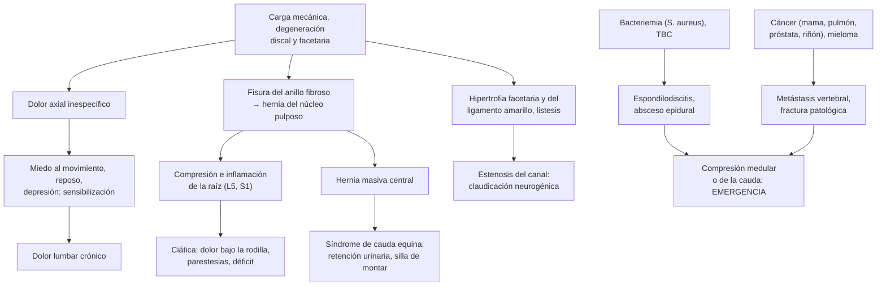
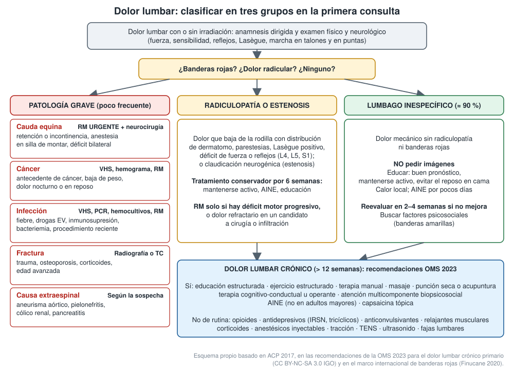

---
tags:
  - Reumatología
  - Neurología
  - Frecuente en sala
---

# Lumbago, lumbociática, cervicalgia y columna dolorosa (incluido el lumbago infeccioso y tumoral)

**Subespecialidad**
Reumatología · Neurología · Traumatología · Neurocirugía · Fisiatría

**Guías principales**
ACP 2017: tratamiento no invasivo del lumbago agudo, subagudo y crónico · OMS 2023: manejo no quirúrgico del dolor lumbar crónico primario · Marco internacional de banderas rojas (2020) · IDSA 2015: osteomielitis vertebral · AO Spine 2017: mielopatía cervical degenerativa

**Otras fuentes**
Serie *Lancet* sobre dolor lumbar (2018) · GBD 2021: dolor lumbar y cervicalgia · Revisión de ciática (*BMJ* 2019) · Ensayos PACE (paracetamol, 2014), PRECISE (pregabalina, 2017) y de prednisona oral en la radiculopatía (2015) · Dolor crónico en Chile (Bilbeny 2019)

**GES**
No. La compresión medular por cáncer y el politraumatizado grave con lesión medular se manejan dentro de sus propios problemas de salud GES.

**EUNACOM**
1.10.1.010 y 1.11.1.013 Lumbago mecánico (específico, completo, completo) · 1.11.1.005 Cervicalgia (específico, completo, completo) · 1.11.1.006 Columna dolorosa (específico, completo, completo) · 1.10.1.011 Lumbociáticas y cervicobraquialgias (sospecha, inicial, derivar) · 1.11.1.012 Lumbago infeccioso y tumoral (sospecha, inicial, derivar)

**Revisado**
Septiembre 2026

!!! abstract "Resumen en 60 segundos"
    - El dolor lumbar es la **primera causa de años vividos con discapacidad** en el mundo (619 millones de personas en 2020) y la **primera carga de enfermedad en Chile**.
    - En la primera consulta, **clasificar en tres grupos**:
        - **Lumbago inespecífico** (≈ 90 %): mecánico, sin causa identificable. **No requiere imágenes**.
        - **Radiculopatía** (lumbociática, casi siempre por **hernia del disco** L4-L5 o L5-S1) o **estenosis del canal** (claudicación neurogénica).
        - **Patología grave** (poco frecuente): **cauda equina**, **cáncer**, **infección**, **fractura** o causa **extraespinal** (aneurisma aórtico, riñón, páncreas).
    - **Banderas rojas**:
        - Retención urinaria o **anestesia en silla de montar** (cauda equina): **RM urgente**.
        - **Antecedente de cáncer**, baja de peso, dolor nocturno.
        - **Fiebre**, drogas EV, inmunosupresión, bacteriemia.
        - Trauma, osteoporosis, corticoides.
        - Déficit neurológico **progresivo**.
    - **Lumbago agudo inespecífico**: educar (buen pronóstico), **mantenerse activo**, calor local, **AINE** por pocos días o un relajante muscular por poco tiempo.
        - El **paracetamol no es mejor que el placebo** (PACE).
        - Evitar los opioides y el **reposo en cama**.
    - **Ciática**: tratamiento conservador por 6 semanas.
        - La **pregabalina no sirve** (PRECISE).
        - RM y derivación si hay **déficit motor progresivo**, dolor refractario o cauda equina (esta, **de urgencia**).
    - **Crónico** (> 12 semanas; OMS 2023): **ejercicio**, educación, terapia manual, **terapia cognitivo-conductual** y atención **multicomponente**. AINE salvo en adultos mayores. **No** usar de rutina opioides, antidepresivos, anticonvulsivantes, relajantes musculares, corticoides, fajas, TENS ni tracción.
    - **Lumbago infeccioso** (espondilodiscitis, absceso epidural, TBC) y **tumoral** (metástasis, mieloma): **VHS/PCR**, **RM** y **derivación**. La compresión medular es una **emergencia**.
    - **Cervicalgia**: mismo enfoque. Buscar la **mielopatía cervical** (torpeza de manos, marcha alterada, hiperreflexia, Hoffmann): **deriva a cirugía**.

## Definición

| Término | Definición |
|---|---|
| **Lumbago (dolor lumbar)** | Dolor entre el **reborde costal inferior** y los **pliegues glúteos**, con o sin irradiación a la extremidad inferior |
| **Agudo, subagudo y crónico** | **< 6 semanas**, **6–12 semanas** y **> 12 semanas** |
| **Lumbago inespecífico (mecánico)** | Dolor sin una causa específica identificable, que varía con la postura y la actividad y **mejora con el reposo relativo** |
| **Dolor lumbar crónico primario (OMS)** | Dolor lumbar de más de 3 meses, no atribuible a otra enfermedad, asociado a malestar emocional o limitación funcional |
| **Radiculopatía (lumbociática)** | Dolor, parestesias o déficit en el **territorio de una raíz** por compresión o inflamación. Típicamente se irradia **bajo la rodilla** |
| **Dolor referido somático** | Dolor que se irradia a la nalga o al muslo **sin pasar la rodilla** ni seguir un dermatomo, sin déficit neurológico |
| **Estenosis del canal lumbar** | Estrechez del canal o de los forámenes que causa **claudicación neurogénica**: dolor y debilidad en las piernas al caminar o estar de pie, que **mejoran al flectar el tronco** o sentarse |
| **Síndrome de cauda equina** | Compresión de las raíces lumbosacras bajo el cono medular: **retención urinaria** (o incontinencia por rebalse), **anestesia en silla de montar**, disfunción sexual y déficit en ambas piernas. **Emergencia quirúrgica** |
| **Cervicalgia** | Dolor en la región cervical posterior, con o sin irradiación al hombro o al brazo |
| **Cervicobraquialgia (radiculopatía cervical)** | Dolor irradiado al brazo con distribución de raíz (C5–C8) |
| **Mielopatía cervical** | Compresión de la **médula** cervical (espondilosis, hernia, osificación del ligamento): torpeza de manos, marcha inestable, signos de **primera motoneurona** |
| **Columna dolorosa** | Término general para el dolor axial de la columna (cervical, **dorsal** o lumbar). El dolor **dorsal** tiene más causas graves y extraespinales que el lumbar |

## Epidemiología

### Mundial

- **Dolor lumbar** (GBD 2021):
    - Afectó a **619 millones** de personas en 2020, y se proyectan **843 millones** en 2050.
    - Es la **primera causa de años vividos con discapacidad** en el mundo.
    - El **38,8 %** de esa discapacidad se atribuye a **factores ocupacionales**, **tabaquismo** e **IMC alto**.
- **Cervicalgia** (GBD 2021): **203 millones** de personas en 2020 y **269 millones** proyectados para 2050. Es más frecuente en mujeres y entre los 45 y 74 años.
- La mayoría de los episodios agudos **mejoran en semanas**, pero las **recurrencias** son frecuentes. La discapacidad se concentra en quienes evolucionan a dolor **persistente** (serie *Lancet* 2018).
- Las **imágenes** muestran degeneración en personas **sin dolor**. La degeneración discal está presente en el **37 %** de las personas asintomáticas de 20 años y en el **96 %** de las de 80 años. Las protrusiones discales van del 29 % al 43 % (Brinjikji 2015).

!!! chile "Datos nacionales"
    - **Dolor crónico no oncológico** (Bilbeny 2019):
        - Prevalencia de **32 %**, en su mayoría moderado a intenso y osteomuscular.
        - El **lumbago** es la causa más mencionada (**22,1 %**), seguido de la artrosis (16,1 %).
        - El lumbago crónico suma **más de 300.000 años vividos con discapacidad** y es la **primera carga de enfermedad en Chile**, por sobre la cardiopatía hipertensiva y la depresión.
        - El **24,4 %** de las personas con dolor crónico tuvo **licencia médica** por esa causa.
    - Chile tiene una incidencia de **tuberculosis** en aumento. La espondilitis tuberculosa (**mal de Pott**) debe estar en el diferencial del dolor dorsolumbar subagudo con síntomas generales. Ver [tuberculosis](../respiratorio/tuberculosis.md).
    - El lumbago **no es GES**. La mayoría se maneja en la **APS** con kinesiología. Se derivan la radiculopatía refractaria o con déficit y la sospecha de patología grave.

## Etiología

| Grupo | Causas | Claves |
|---|---|---|
| **Inespecífico (mecánico)** | Musculoligamentoso, facetario, discogénico, sacroilíaco | ≈ 90 %. Sin déficit ni banderas rojas |
| **Hernia del núcleo pulposo** | Más del 90 % en **L4-L5** y **L5-S1** | Adulto de 30–50 años; ciática que empeora al sentarse, toser o pujar |
| **Estenosis del canal lumbar** | Degeneración discal y facetaria, hipertrofia del ligamento amarillo, espondilolistesis | **> 60 años**; claudicación **neurogénica** que mejora al **flectar** (signo del "carro del supermercado") |
| **Espondilolisis y espondilolistesis** | Defecto de la *pars interarticularis*, degenerativa | Jóvenes deportistas (lisis), adultos mayores (degenerativa) |
| **Fractura vertebral** | **Osteoporótica** (por compresión), traumática, patológica | Edad avanzada, **corticoides**, trauma. Ver [osteoporosis](../endocrinologia/osteoporosis.md) |
| **Infección** | **Espondilodiscitis** (osteomielitis vertebral), **absceso epidural**, **TBC** (Pott), *Brucella* | *S. aureus* es la causa más frecuente. **Fiebre** (no siempre), drogas EV, diabetes, hemodiálisis, **bacteriemia** o endocarditis, procedimiento espinal |
| **Tumor** | **Metástasis** (mama, pulmón, próstata, riñón, tiroides), **mieloma múltiple**, linfoma; primarios (raros) | **> 50 años**, **antecedente de cáncer**, baja de peso, **dolor nocturno o en reposo**, que no mejora en 4–6 semanas |
| **Inflamatorio** | **Espondiloartritis axial** (espondilitis anquilosante), sacroileítis | **< 40–45 años**, inicio insidioso, **rigidez matinal**, mejora con el **ejercicio** y no con el reposo, despierta en la segunda mitad de la noche |
| **Visceral o referido** | **Aneurisma o disección aórtica**, pielonefritis, **cólico renal**, pancreatitis, úlcera penetrante, patología ginecológica, **herpes zóster** | Dolor que **no cambia con la postura**, síntomas sistémicos o del órgano |

- **Factores de riesgo del lumbago inespecífico**: trabajo físico pesado, levantar peso con torsión, sedentarismo, **tabaquismo**, **obesidad**, depresión y estrés laboral.
- **Factores de cronicidad ("banderas amarillas")**:
    - Creencias de daño y **miedo al movimiento** (kinesiofobia), catastrofismo.
    - Depresión y ansiedad.
    - Insatisfacción laboral, litigios o compensaciones.
    - Reposo prolongado y expectativa de curación pasiva.

## Fisiopatología

- **Lumbago inespecífico**: varias estructuras pueden generar dolor (disco, facetas, ligamentos, músculos, sacroilíacas), pero no hay una prueba que identifique cuál. El dolor persistente se asocia más a **sensibilización central** y a factores **psicosociales** que al daño estructural.
- **Hernia discal**:
    - El núcleo pulposo sale por una fisura del anillo fibroso y **comprime** e **inflama** la raíz (mediadores químicos).
    - Una hernia **posterolateral** L4-L5 comprime la raíz **L5**; una L5-S1 comprime la **S1** (la raíz que baja).
    - Muchas hernias **se reabsorben** en semanas a meses: por eso la mayoría mejora sin cirugía.
- **Estenosis**: al extender la columna (caminar, estar de pie) el canal se estrecha más y disminuye el flujo venoso de las raíces. **Flectar** amplía el canal y alivia el dolor.
- **Espondilodiscitis**: llega por **vía hematógena**, sobre todo al platillo vertebral de adultos. Destruye el **disco** y las vértebras vecinas y puede extenderse al espacio epidural (**absceso**) o al psoas.
- **Metástasis**: la **médula ósea vertebral** es muy vascularizada y recibe émbolos tumorales por el **plexo venoso de Batson** (próstata, mama). El cuerpo vertebral colapsado o el tumor epidural comprimen la médula o la cauda.

## Clasificación

- **Por duración**: agudo (< 6 semanas), subagudo (6–12) y **crónico** (> 12).
- **Por mecanismo** (triage de la primera consulta):
    1. **Inespecífico**.
    2. **Radicular** o por estenosis.
    3. **Patología específica grave**.
- **Por el tipo de dolor**:
    - **Mecánico**: empeora con la carga y la actividad y mejora con el reposo.
    - **Inflamatorio**: rigidez matinal, mejora con el ejercicio, dolor nocturno.
    - **No mecánico** (constante, nocturno, sin alivio): sospechar **tumor o infección**.
- **Por riesgo de cronicidad**: herramientas como **STarT Back** (bajo, medio o alto) orientan la intensidad del tratamiento (kinesiología, terapia psicológica).

## Clínica

- **Anamnesis**:
    - Inicio (esfuerzo, trauma), localización e irradiación (¿pasa la rodilla?), relación con la postura y la marcha.
    - **Dolor nocturno o en reposo**, rigidez matinal.
    - **Banderas rojas** y factores psicosociales.
    - Qué espera el paciente y qué impacto tiene en su trabajo.
- **Examen físico**:
    - Inspección, palpación, movilidad.
    - **Examen neurológico de las extremidades inferiores**: fuerza, sensibilidad y reflejos; marcha en talones (L5) y en puntas (S1).
    - **Lasègue** (elevación de la pierna recta, dolor irradiado entre 30° y 70°): **sensible** pero poco específico. El **Lasègue cruzado** (dolor en la pierna afectada al elevar la sana) es poco sensible pero **específico** de hernia.
    - **Sensibilidad perineal** y, si hay síntomas urinarios, **residuo posmiccional** y tono del esfínter anal.
    - **Pulsos** y masa pulsátil abdominal. Puño percusión renal. Piel (herpes zóster).

| Raíz | Dolor y sensibilidad | Debilidad | Reflejo |
|---|---|---|---|
| **L4** | Cara anterior del muslo y **medial de la pierna** | Extensión de la rodilla (cuádriceps) | **Rotuliano** ↓ |
| **L5** | Cara lateral de la pierna y **dorso del pie**, **ortejo mayor** | **Dorsiflexión del ortejo mayor** y del pie; marcha en **talones** | Ninguno confiable |
| **S1** | Cara posterior de la pierna, **borde lateral y planta del pie** | **Flexión plantar**; marcha en **puntas** | **Aquiliano** ↓ |
| **C5** | Hombro y cara lateral del brazo | Abducción del hombro (deltoides), flexión del codo | Bicipital ↓ |
| **C6** | Cara lateral del antebrazo, **pulgar** e índice | Extensión de la muñeca, flexión del codo | **Estiloradial** ↓ |
| **C7** | **Dedo medio** | **Extensión del codo** (tríceps), de la muñeca y de los dedos | **Tricipital** ↓ |
| **C8** | Borde cubital de la mano, **meñique** | Flexión de los dedos, músculos intrínsecos de la mano | — |

- **Cervicalgia**:
    - **Mecánica**: la más frecuente, por postura, estrés o esguince cervical por latigazo.
    - **Radiculopatía cervical**: dolor al brazo; la **maniobra de Spurling** (extensión, inclinación y compresión axial) reproduce el dolor radicular.
    - **Mielopatía cervical**: torpeza y parestesias de las **manos**, marcha inestable, **hiperreflexia**, **Hoffmann** y Babinski, **Lhermitte**, alteración esfinteriana tardía.
- **Dolor dorsal**: más a menudo **no mecánico**. Descartar las causas cardiovasculares (IAM, **disección aórtica**), pulmonares, el herpes zóster, las fracturas osteoporóticas y las **metástasis**.

## Diagnóstico

!!! alarma "Banderas rojas (marco internacional 2020)"
    | Sospecha | Banderas rojas | Conducta |
    |---|---|---|
    | **Síndrome de cauda equina** | **Retención urinaria** o incontinencia por rebalse, **anestesia en silla de montar**, disfunción sexual, **ciática bilateral**, déficit motor progresivo | **RM urgente** (el mismo día) y **neurocirugía** |
    | **Cáncer** | **Antecedente de cáncer** (el predictor más fuerte), baja de peso inexplicada, > 50 años, dolor **nocturno o en reposo**, que no mejora en 4–6 semanas | VHS, hemograma, calcio, electroforesis de proteínas, **RM** |
    | **Infección** | Fiebre, **drogas EV**, **inmunosupresión** o diabetes, **hemodiálisis**, **bacteriemia** o endocarditis, cirugía o infiltración espinal reciente, TBC | **VHS y PCR**, **hemocultivos**, **RM con gadolinio** |
    | **Fractura** | Trauma importante (o menor en un adulto mayor), **osteoporosis**, **corticoides**, edad > 70 años | **Radiografía** o TC |
    | **Compresión medular** | Déficit bilateral, nivel sensitivo, hiperreflexia, alteración de la marcha, síntomas esfinterianos | RM de toda la columna **urgente** |
    | **Espondiloartritis** | < 45 años, dolor > 3 meses, rigidez matinal > 30 min, mejora con el ejercicio, dolor en la segunda mitad de la noche | PCR, HLA-B27, RM de sacroilíacas; **reumatología** |
    | **Extraespinal** | Dolor que no cambia con la postura, **masa pulsátil**, hipotensión, fiebre y disuria, síntomas digestivos | Según la sospecha (**aneurisma aórtico**: ecografía o angio-TC urgente) |

    - Una bandera roja aislada tiene **bajo valor predictivo** (muchas son frecuentes en la población sin enfermedad grave). Se interpretan **en conjunto** y **se reevalúan** en cada control.

- **Lumbago inespecífico**: es un diagnóstico **clínico**. Anamnesis y examen normales, sin banderas rojas: **no requiere exámenes ni imágenes**.
- **Radiculopatía**: el diagnóstico también es **clínico**. La RM se reserva para quienes serían **candidatos a cirugía o infiltración** o para los que tienen déficit progresivo.
- **Estenosis**: clínica de claudicación neurogénica + RM (o TC) si se plantea una intervención. Diferenciarla de la **claudicación vascular** (pulsos, índice tobillo-brazo; esta mejora al detenerse, sin necesidad de flectar).

<figure markdown>
{ loading=lazy }
<figcaption>Figura 1. Triage del dolor lumbar en la primera consulta (patología grave, radiculopatía o estenosis, lumbago inespecífico) y recomendaciones para el dolor crónico. Esquema propio basado en ACP 2017, en la guía de la OMS 2023 para el dolor lumbar crónico primario (CC BY-NC-SA 3.0 IGO) y en el marco internacional de banderas rojas (Finucane et al., 2020).</figcaption>
</figure>

## Laboratorio

- **No se piden** en el lumbago inespecífico ni en la ciática típica.
- **Si hay banderas rojas**:
    - Hemograma, **VHS** y **PCR**: sensibles para infección y tumor. Normales hacen poco probable una espondilodiscitis.
    - **Hemocultivos** (dos juegos) si se sospecha infección, **antes** de los antibióticos.
    - Calcio, creatinina, fosfatasas alcalinas, **electroforesis de proteínas** y cadenas livianas (mieloma), **PSA** (metástasis de próstata).
    - PPD o IGRA si se sospecha TBC; serología de *Brucella* según la exposición.
    - **Orina completa** (pielonefritis, cólico renal).
- **Biopsia** vertebral guiada por imágenes: en la espondilodiscitis con **hemocultivos negativos**, idealmente antes de iniciar los antibióticos si el paciente está estable. También en la sospecha de tumor sin diagnóstico.
- **Espondiloartritis**: PCR y **HLA-B27**.

## Imágenes

- **Lumbago agudo sin banderas rojas**: **no pedir imágenes** en las primeras 6 semanas. No cambian el manejo, muestran hallazgos degenerativos **irrelevantes** (frecuentes en asintomáticos) y aumentan la ansiedad, la medicalización y las cirugías innecesarias.
- **Radiografía**: sospecha de **fractura** (trauma, osteoporosis). También sirve en la espondilolistesis y en la espondiloartritis avanzada (sacroilíacas).
- **RM** (el examen de elección):
    - **Urgente**: cauda equina, compresión medular, sospecha de **infección** o **tumor**, déficit neurológico progresivo.
    - **Programada**: radiculopatía que no mejora en 6 semanas en un **candidato a cirugía o infiltración**; estenosis antes de la cirugía; **sacroilíacas** si se sospecha espondiloartritis.
    - **Espondilodiscitis**: señal alterada en dos vértebras vecinas y en el **disco**, con o sin absceso epidural o del psoas. En la **TBC** el disco se respeta más, y hay abscesos grandes y compromiso de varios niveles.
    - **Metástasis**: lesiones en el cuerpo y el **pedículo** con el **disco respetado**.
- **TC**: fracturas complejas o si la RM está contraindicada (mielo-TC).
- **Cintigrafía ósea o PET-CT**: extensión de las metástasis.
- **Cervical**: radiografía si hay trauma (reglas canadienses o NEXUS); **RM** si hay radiculopatía refractaria o **mielopatía**.

## Diagnóstico diferencial

| Condición | Claves |
|---|---|
| **Aneurisma aórtico abdominal roto o disección** | Adulto mayor, fumador; dolor lumbar **intenso y súbito**, hipotensión, **masa pulsátil**. Ver [síndrome aórtico agudo](../cardiologia/sindrome-aortico-agudo.md) |
| **Cólico renal** | Dolor **cólico** en el flanco que se irradia a la ingle, inquietud, hematuria. Ver [urolitiasis](../nefrologia/urolitiasis-y-colico-renal.md) |
| **Pielonefritis** | Fiebre, disuria, puño percusión positiva. Ver [infección urinaria](../nefrologia/infeccion-urinaria.md) |
| **Pancreatitis, úlcera penetrante** | Dolor epigástrico que se irradia a la espalda, relación con la comida |
| **Herpes zóster** | Dolor **urente** en banda, unilateral, que **precede** a las vesículas |
| **Espondiloartritis axial** | Dolor **inflamatorio** en un adulto joven, rigidez matinal, entesitis, uveítis, psoriasis, enfermedad inflamatoria intestinal |
| **Cadera (artrosis, necrosis avascular)** | Dolor **inguinal**, rotación interna limitada y dolorosa |
| **Claudicación vascular** | Dolor en la pantorrilla que cede al **detenerse** (sin flectar), pulsos ausentes |
| **Polineuropatía** | Distal, simétrica y en "calcetín", sin dolor lumbar |
| **Fibromialgia** | Dolor **difuso** crónico, fatiga, sueño no reparador |
| **Síndrome de Guillain-Barré** | Dolor lumbar con **debilidad ascendente** y arreflexia. Ver [Guillain-Barré](../neurologia/debilidad-aguda-guillain-barre-y-mielopatias.md) |

## Tratamiento

### Lumbago agudo inespecífico

- **Educación**: es benigno, suele mejorar en semanas y el movimiento **no daña** la columna. **Mantenerse activo** y volver pronto al trabajo, adaptando las tareas.
- **Evitar el reposo en cama**: retrasa la recuperación.
- **No farmacológico**: **calor local** (evidencia moderada), masaje, acupuntura o manipulación espinal (ACP 2017).

!!! dosis "Fármacos en el lumbago agudo (ACP 2017)"
    | Fármaco | Dosis | Comentario |
    |---|---|---|
    | **Ibuprofeno** | **400–600 mg c/8 h** VO con comida, por **5–7 días** | Primera línea. Evitar si hay ERC, úlcera, IC o anticoagulación. En los adultos mayores, la dosis mínima por el menor tiempo |
    | **Naproxeno** | **250–500 mg c/12 h** VO | Alternativa |
    | **Diclofenaco** | **50 mg c/8–12 h** VO | Mayor riesgo cardiovascular |
    | **Ciclobenzaprina** (relajante muscular) | **5–10 mg c/8 h** o en la noche, por **≤ 1 semana** | Sedación, mareo, efecto anticolinérgico. **Evitarla en adultos mayores** |
    | **Paracetamol** | — | **No es mejor que el placebo** en el lumbago agudo (PACE, 2014) |
    | **Opioides** (incluido el tramadol) | — | **Evitarlos**: poco beneficio y riesgo de dependencia. Solo por pocos días en un dolor intenso que no responde |
    | **Corticoides sistémicos** | — | **No** en el lumbago inespecífico |

    - Agregar un **protector gástrico** (omeprazol 20 mg/día) si hay factores de riesgo gastrointestinal.

### Lumbociática (radiculopatía)

- **Tratamiento conservador por 6 semanas**: la mayoría mejora, porque muchas hernias **se reabsorben**. Actividad según tolerancia, **AINE** y educación; kinesiología.
- **Fármacos con poca o nula eficacia**:
    - **Pregabalina**: no fue mejor que el placebo (PRECISE, 2017).
    - **Gabapentina**: tampoco tiene evidencia de beneficio.
    - **Prednisona oral** (60 → 40 → 20 mg, 5 días cada una): mejoró **levemente la función**, pero **no el dolor** (JAMA 2015).
- **Infiltración epidural de corticoides**: alivio **de corto plazo** en casos seleccionados.
- **Cirugía (microdiscectomía)**:
    - **Urgente** en el **síndrome de cauda equina**.
    - **Preferente** si el déficit motor es **grave o progresivo**.
    - **Electiva** si el dolor radicular es **invalidante** y persiste > 6–12 semanas pese al tratamiento.
    - Logra un alivio **más rápido**, con resultados parecidos al tratamiento conservador a 1–2 años.
- **Derivar** (EUNACOM: sospecha, inicial, derivar):
    - **De urgencia**: cauda equina o déficit progresivo.
    - **Programada**: dolor refractario o déficit estable. A traumatología, neurocirugía o fisiatría.

### Estenosis del canal lumbar

- Kinesiología (ejercicios en **flexión**, bicicleta), AINE, control del peso.
- **Cirugía descompresiva** si la claudicación es invalidante pese al tratamiento, o si hay déficit progresivo.

### Dolor lumbar crónico

!!! guia "Dolor lumbar crónico primario (OMS 2023)"
    | Tipo | **Sí** se pueden ofrecer | **No** usar de rutina |
    |---|---|---|
    | **Educación** | Educación y consejo estructurados | — |
    | **Físicos** | **Ejercicio estructurado**, punción seca o acupuntura, **manipulación espinal**, masaje, ayudas técnicas para la movilidad | **Tracción**, **ultrasonido** terapéutico, **TENS**, **fajas**, cinturones y soportes lumbares |
    | **Psicológicos** | Terapia **operante**, **terapia cognitivo-conductual** | — |
    | **Fármacos** | **AINE** (**no** en adultos mayores), **capsaicina tópica** | **Opioides**, antidepresivos **IRSN** y **tricíclicos**, **anticonvulsivantes**, **relajantes musculares**, **corticoides**, anestésicos locales inyectables, fitofármacos (garra del diablo, sauce blanco) |
    | **Multicomponente** | **Atención biopsicosocial multicomponente** | Fármacos para bajar de peso |

    - Todas son recomendaciones **condicionales**, con evidencia de certeza moderada a muy baja. No hubo recomendación sobre el paracetamol ni sobre las benzodiacepinas.
    - La **ACP 2017** es algo más permisiva: acepta la **duloxetina** o el **tramadol** como segunda línea tras los AINE, y los opioides solo como último recurso.

- **Objetivo**: **funcionalidad** y participación (trabajo, actividades), no la desaparición completa del dolor.
- Abordar la **depresión**, el sueño, el **miedo al movimiento** y el trabajo.
- Derivar a una **unidad de dolor** o a rehabilitación multidisciplinaria si es refractario.

### Lumbago infeccioso (derivar; sospecha e inicio en el médico general)

- **Espondilodiscitis** (osteomielitis vertebral, IDSA 2015):
    - Pedir **hemocultivos**, VHS, PCR y **RM**.
    - Si el paciente está **estable** y los hemocultivos son negativos, hacer la **biopsia antes** de los antibióticos.
    - Si hay **sepsis** o **déficit neurológico**, iniciar los antibióticos **de inmediato**: cubrir *S. aureus*, **cloxacilina** EV (o **vancomicina** si se sospecha SARM) ± cobertura de gramnegativos según el riesgo.
    - Duración habitual: **6 semanas**.
    - Buscar la **endocarditis** (ecocardiograma) si hay bacteriemia por *S. aureus* o estreptococos. Ver [endocarditis](../infectologia/endocarditis-infecciosa.md).
- **Absceso epidural**:
    - Dolor, fiebre y **déficit neurológico**. La tríada completa es poco frecuente al inicio.
    - **RM urgente**, antibióticos y **cirugía** (drenaje) si hay déficit o compresión.
- **Espondilitis tuberculosa (Pott)**:
    - Curso **subagudo o crónico**, síntomas generales, cifosis, abscesos fríos.
    - Biopsia (cultivo y PCR para *M. tuberculosis*), tratamiento antituberculoso prolongado y ortopedia o neurocirugía.

### Lumbago tumoral (derivar)

- **Sospecha**: antecedente de cáncer, > 50 años, baja de peso, dolor nocturno o en reposo, anemia, hipercalcemia, VHS alta.
- **Sin déficit neurológico**: **RM** preferente, analgesia y **derivación** a oncología o traumatología.
- **Con déficit neurológico** (compresión medular metastásica):
    - **Dexametasona 16 mg** VO o EV y **RM de toda la columna urgente**.
    - Radioterapia o cirugía.
    - Ver [urgencias oncológicas](../hematologia/urgencias-oncologicas.md).
- **Mieloma**: anemia, hipercalcemia, falla renal, lesiones líticas, **componente monoclonal**.

### Cervicalgia y cervicobraquialgia

- **Mecánica**: educación, mantener la movilidad, **ejercicio** y terapia manual (kinesiología), calor, **AINE** por poco tiempo. Evitar el collar cervical prolongado.
- **Radiculopatía cervical**:
    - Tratamiento conservador por 6–12 semanas; la mayoría mejora.
    - RM y derivación si hay déficit **progresivo** o dolor refractario.
- **Mielopatía cervical degenerativa**:
    - **Derivar a cirugía** (neurocirugía o traumatología de columna).
    - La descompresión se recomienda en la mielopatía **moderada o grave**. En la **leve** se ofrece cirugía o un tratamiento conservador supervisado, y se opera si progresa (AO Spine 2017).
- **Esguince cervical por latigazo**: sin criterios de imagen (reglas canadienses o NEXUS), tratamiento activo y precoz; se evita la inmovilización.

## Complicaciones

- **Cronicidad** y **discapacidad**: licencias prolongadas, pérdida del trabajo, depresión.
- **Iatrogenia**:
    - AINE: hemorragia digestiva, falla renal, alza de la PA.
    - **Opioides**: dependencia, caídas, sobredosis.
    - Relajantes musculares: sedación, caídas.
    - Imágenes y **cirugías innecesarias**.
- **Síndrome de cauda equina tardío**: **retención urinaria**, incontinencia y disfunción sexual **permanentes**.
- **Paraplejia** por un absceso epidural o una compresión metastásica no reconocidos a tiempo.
- **Fracturas** vertebrales en cascada si no se trata la osteoporosis.

## Pronóstico y seguimiento

- **Lumbago agudo inespecífico**: la mayoría mejora en **semanas**. Las **recurrencias** son frecuentes, y una minoría evoluciona a dolor crónico (con más frecuencia si hay banderas amarillas).
- **Ciática por hernia discal**: la mayoría mejora en **6–12 semanas** con tratamiento conservador.
- **Seguimiento**:
    - **Reevaluar en 2–4 semanas** si no mejora; en cada control, repetir la búsqueda de **banderas rojas** y de déficit neurológico.
    - Si persiste más de **4–6 semanas**, replantear el diagnóstico (imágenes o exámenes según el caso) e intensificar la kinesiología y el abordaje psicosocial.
- **Prevención de recurrencias**: **ejercicio** regular, que es la única intervención con evidencia consistente. Además, educación, control del peso y dejar de fumar. Las **fajas** y las plantillas **no** previenen el lumbago.

## Perlas para el internado

!!! perla "Para la sala y el turno"
    - **Pregunta siempre por la orina** y la sensibilidad perineal en el lumbago con ciática. Si hay **retención**, mide el residuo y pide una **RM urgente**.
    - Lumbago en un **adulto mayor fumador** con hipotensión o dolor súbito e intenso: **aneurisma aórtico** hasta demostrar lo contrario.
    - Lumbago con **fiebre** en un paciente en **hemodiálisis**, diabético, con drogas EV o con bacteriemia por *S. aureus*: **espondilodiscitis** o **absceso epidural**. Pide VHS, PCR, hemocultivos y RM.
    - **Antecedente de cáncer + dolor dorsal nocturno** = metástasis. Si aparece **debilidad** en las piernas: **dexametasona** y **RM urgente**.
    - No pidas una **radiografía lumbar** para un lumbago agudo sin banderas rojas. La "discopatía" de la radiografía es **normal para la edad**.
    - El **paracetamol** no sirve para el lumbago agudo y la **pregabalina** no sirve para la ciática. Usa **AINE** por poco tiempo, actividad y educación.
    - Dolor lumbar en un **joven** con **rigidez matinal** que mejora con el ejercicio: **espondiloartritis**. Pide PCR y HLA-B27 y deriva a reumatología.
    - En la cervicalgia, busca la **mielopatía**: torpeza de manos, marcha inestable, **Hoffmann**, hiperreflexia.

## Preguntas de repaso

??? repaso "1. Hombre de 34 años, bodeguero, con dolor lumbar desde ayer tras levantar una caja. No se irradia, empeora al moverse y mejora al acostarse. Sin fiebre ni síntomas urinarios; examen neurológico normal. Pide una radiografía y 7 días de licencia en cama. ¿Qué haces?"
    **Lumbago agudo inespecífico (mecánico)** sin banderas rojas.

    - **No** pedir radiografía: no cambia el manejo y muestra hallazgos irrelevantes.
    - **Educar**: buen pronóstico. **Mantenerse activo**: el reposo en cama retrasa la recuperación.
    - **Calor local** e **ibuprofeno 400–600 mg c/8 h** con comida por 5–7 días; relajante muscular por pocos días si hay contractura intensa.
    - Licencia **breve** si la necesita, con vuelta precoz al trabajo y tareas adaptadas.
    - Reevaluar en 2–4 semanas si no mejora, o antes si aparecen banderas rojas.

??? repaso "2. Mujer de 41 años con dolor lumbar y dolor punzante por la cara posterior de la pierna izquierda hasta el borde lateral del pie, de 10 días. Lasègue positivo a 40°, debilidad para caminar en puntas, aquiliano izquierdo abolido e hipoestesia del borde lateral del pie. Sin síntomas urinarios. ¿Diagnóstico y manejo?"
    **Radiculopatía S1 izquierda** (lumbociática), probablemente por una **hernia L5-S1**.

    - **Tratamiento conservador por 6 semanas**: actividad según tolerancia, **AINE**, educación (muchas hernias se reabsorben) y kinesiología.
    - **No** usar pregabalina (sin beneficio). Los corticoides orales mejoran poco la función y no el dolor.
    - **No** pedir RM de entrada.
    - RM y derivación si el **déficit progresa**, si el dolor es invalidante y persiste > 6 semanas, o **de urgencia** si aparecen síntomas de **cauda equina**.

??? repaso "3. Hombre de 48 años con lumbociática derecha de 2 semanas. Hoy consulta porque no ha orinado en 12 horas y siente \"adormecida\" la zona entre las piernas. Examen: hipoestesia perineal, debilidad para la dorsiflexión de ambos pies, globo vesical. ¿Qué haces?"
    **Síndrome de cauda equina** (hernia discal central masiva probable): **emergencia quirúrgica**.

    - **Sonda vesical** y medición del residuo (retención).
    - **RM lumbar urgente** (el mismo día).
    - **Neurocirugía o traumatología de columna de inmediato** para la **descompresión quirúrgica** precoz: el retraso aumenta el riesgo de secuelas esfinterianas y sexuales permanentes.
    - Analgesia; no esperar la evolución.

??? repaso "4. Hombre de 62 años con DM2 en hemodiálisis por catéter, con dolor lumbar progresivo de 3 semanas, que no cede en reposo, y fiebre de 38,3 °C. Tiene dolor a la percusión de L3-L4. PCR 145 mg/L, VHS 95 mm/h. ¿Qué sospechas y qué haces?"
    **Espondilodiscitis** (osteomielitis vertebral) L3-L4, probablemente **hematógena por el catéter** (*S. aureus*), con riesgo de **absceso epidural**.

    - **Hemocultivos** (dos juegos, incluido uno del catéter) y **RM lumbar con gadolinio**.
    - Examen neurológico seriado.
    - **Hospitalizar**. Si está estable y sin déficit, con hemocultivos negativos: **biopsia** guiada antes de los antibióticos.
    - Si hay **sepsis** o **déficit**: antibióticos **de inmediato**, con cobertura de *S. aureus* (**vancomicina** en hemodiálisis mientras se descarta SARM), y neurocirugía si hay absceso con compresión.
    - **Ecocardiograma** (endocarditis) y manejo del catéter.
    - Duración habitual: **6 semanas**.

??? repaso "5. Mujer de 67 años con cáncer de mama operado hace 5 años, con dolor dorsal de 1 mes que la despierta en la noche. Desde hace 2 días nota las piernas débiles y le cuesta caminar. Tiene nivel sensitivo en T8 y reflejos exaltados en las extremidades inferiores. ¿Qué haces?"
    **Compresión medular metastásica** (probable metástasis vertebral dorsal de un cáncer de mama): **emergencia oncológica**.

    - **Dexametasona 16 mg** VO o EV de inmediato, con IBP.
    - **RM de toda la columna urgente** (hay lesiones en varios niveles con frecuencia).
    - Avisar a **neurocirugía** y a **radioterapia**: la descompresión o la radioterapia urgente preservan la marcha, y el pronóstico funcional depende de la **fuerza al inicio**.
    - Analgesia, tromboprofilaxis, manejo vesical e intestinal.
    - Calcio (hipercalcemia) y estudio de extensión.

??? repaso "6. Hombre de 27 años con dolor lumbar y glúteo alternante de 8 meses, que lo despierta en la madrugada, con rigidez matinal de 1 hora que mejora al hacer ejercicio y empeora con el reposo. Tuvo un episodio de ojo rojo y doloroso el año pasado. ¿Qué sospechas?"
    **Dolor lumbar inflamatorio**: sospecha de **espondiloartritis axial** (espondilitis anquilosante). Tiene < 40 años, inicio insidioso, rigidez matinal, mejora con el ejercicio y no con el reposo, dolor nocturno y probable **uveítis anterior**.

    - **PCR**, **HLA-B27** y **radiografía o RM de sacroilíacas**.
    - **AINE** en dosis plenas (buena respuesta, que además apoya el diagnóstico) y **ejercicio**.
    - **Derivar a reumatología**: si fallan los AINE puede requerir terapia biológica (anti-TNF o anti-IL-17).
    - Derivar a oftalmología si recurre el ojo rojo doloroso.

## Referencias

1. Qaseem A, Wilt TJ, McLean RM, et al. Noninvasive treatments for acute, subacute, and chronic low back pain: a clinical practice guideline from the American College of Physicians. *Ann Intern Med.* 2017;166(7):514–530. doi:[10.7326/M16-2367](https://doi.org/10.7326/M16-2367)
2. World Health Organization. WHO guideline for non-surgical management of chronic primary low back pain in adults in primary and community care settings. Ginebra: OMS; 2023. Licencia CC BY-NC-SA 3.0 IGO. [who.int](https://www.who.int/publications/i/item/9789240081789)
3. Briggs AM, Sumi Y, Banerjee A. The World Health Organization guideline for non-surgical management of chronic primary low back pain in adults: implications for equitable care and strengthening health systems globally. *Glob Health Res Policy.* 2025;10:26. doi:[10.1186/s41256-025-00426-w](https://doi.org/10.1186/s41256-025-00426-w)
4. GBD 2021 Low Back Pain Collaborators. Global, regional, and national burden of low back pain, 1990–2020, its attributable risk factors, and projections to 2050. *Lancet Rheumatol.* 2023;5(6):e316–e329. doi:[10.1016/S2665-9913(23)00098-X](https://doi.org/10.1016/S2665-9913(23)00098-X)
5. GBD 2021 Neck Pain Collaborators. Global, regional, and national burden of neck pain, 1990–2020, and projections to 2050. *Lancet Rheumatol.* 2024;6(3):e142–e155. doi:[10.1016/S2665-9913(23)00321-1](https://doi.org/10.1016/S2665-9913(23)00321-1)
6. Hartvigsen J, Hancock MJ, Kongsted A, et al. What low back pain is and why we need to pay attention. *Lancet.* 2018;391(10137):2356–2367. doi:[10.1016/S0140-6736(18)30480-X](https://doi.org/10.1016/S0140-6736(18)30480-X)
7. Foster NE, Anema JR, Cherkin D, et al. Prevention and treatment of low back pain: evidence, challenges, and promising directions. *Lancet.* 2018;391(10137):2368–2383. doi:[10.1016/S0140-6736(18)30489-6](https://doi.org/10.1016/S0140-6736(18)30489-6)
8. Finucane LM, Downie A, Mercer C, et al. International framework for red flags for potential serious spinal pathologies. *J Orthop Sports Phys Ther.* 2020;50(7):350–372. doi:[10.2519/jospt.2020.9971](https://doi.org/10.2519/jospt.2020.9971)
9. Jensen RK, Kongsted A, Kjaer P, Koes B. Diagnosis and treatment of sciatica. *BMJ.* 2019;367:l6273. doi:[10.1136/bmj.l6273](https://doi.org/10.1136/bmj.l6273)
10. Williams CM, Maher CG, Latimer J, et al. Efficacy of paracetamol for acute low-back pain: a double-blind, randomised controlled trial. *Lancet.* 2014;384(9954):1586–1596. doi:[10.1016/S0140-6736(14)60805-9](https://doi.org/10.1016/S0140-6736(14)60805-9)
11. Mathieson S, Maher CG, McLachlan AJ, et al. Trial of pregabalin for acute and chronic sciatica. *N Engl J Med.* 2017;376(12):1111–1120. doi:[10.1056/NEJMoa1614292](https://doi.org/10.1056/NEJMoa1614292)
12. Goldberg H, Firtch W, Tyburski M, et al. Oral steroids for acute radiculopathy due to a herniated lumbar disk: a randomized clinical trial. *JAMA.* 2015;313(19):1915–1923. doi:[10.1001/jama.2015.4468](https://doi.org/10.1001/jama.2015.4468)
13. Brinjikji W, Luetmer PH, Comstock B, et al. Systematic literature review of imaging features of spinal degeneration in asymptomatic populations. *AJNR Am J Neuroradiol.* 2015;36(4):811–816. doi:[10.3174/ajnr.A4173](https://doi.org/10.3174/ajnr.A4173)
14. Berbari EF, Kanj SS, Kowalski TJ, et al. 2015 Infectious Diseases Society of America (IDSA) clinical practice guidelines for the diagnosis and treatment of native vertebral osteomyelitis in adults. *Clin Infect Dis.* 2015;61(6):e26–e46. doi:[10.1093/cid/civ482](https://doi.org/10.1093/cid/civ482)
15. Darouiche RO. Spinal epidural abscess. *N Engl J Med.* 2006;355(19):2012–2020. doi:[10.1056/NEJMra055111](https://doi.org/10.1056/NEJMra055111)
16. Fehlings MG, Tetreault LA, Riew KD, et al. A clinical practice guideline for the management of patients with degenerative cervical myelopathy: recommendations for patients with mild, moderate, and severe disease and nonmyelopathic patients with evidence of cord compression. *Global Spine J.* 2017;7(3 Suppl):70S–83S. doi:[10.1177/2192568217701914](https://doi.org/10.1177/2192568217701914)
17. Sieper J, van der Heijde D, Landewé R, et al. New criteria for inflammatory back pain in patients with chronic back pain: a real patient exercise by experts from the Assessment of SpondyloArthritis international Society (ASAS). *Ann Rheum Dis.* 2009;68(6):784–788. doi:[10.1136/ard.2008.101501](https://doi.org/10.1136/ard.2008.101501)
18. Bilbeny N. Dolor crónico en Chile. *Rev Med Clin Condes.* 2019;30:397–406. doi:[10.1016/j.rmclc.2019.08.002](https://doi.org/10.1016/j.rmclc.2019.08.002)
