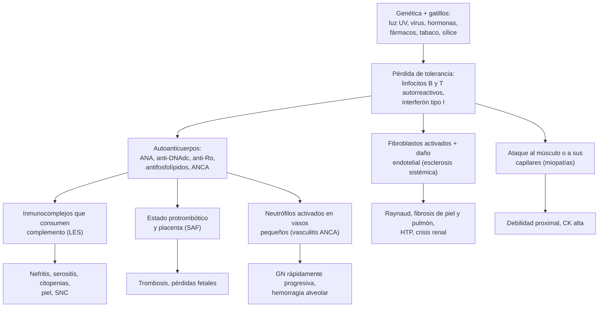
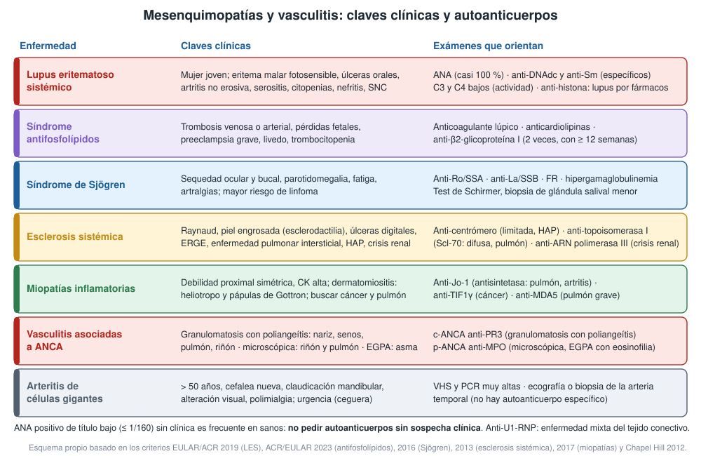

---
tags:
  - Reumatología
  - GES
---

# Lupus eritematoso sistémico, síndrome antifosfolípidos, Sjögren, esclerosis sistémica, miopatías inflamatorias y vasculitis

**Subespecialidad**
Reumatología · Nefrología · Dermatología

**Guías principales**
EULAR/ACR 2019: criterios de LES · EULAR 2023: tratamiento del LES · ACR/EULAR 2023: criterios del síndrome antifosfolípidos · EULAR 2019: tratamiento del síndrome antifosfolípidos · ACR/EULAR 2016: criterios de Sjögren · ACR/EULAR 2013: criterios de esclerosis sistémica · EULAR/ACR 2017: criterios de miopatías inflamatorias · Chapel Hill 2012: nomenclatura de las vasculitis · EULAR 2022: vasculitis asociadas a ANCA · EULAR 2025: polimialgia reumática y vasculitis de grandes vasos

**Otras fuentes**
Epidemiología global del LES (Tian 2023) · Registro nacional de lupus en Chile 2013–2024 (Vergara 2025) · Ensayo TRAPS (rivaroxabán en el síndrome antifosfolípidos, 2018)

**GES**
**Lupus eritematoso sistémico (GES 78)**, a cualquier edad: tratamiento desde la confirmación por el especialista, y confirmación de la **nefropatía lúpica** en ≤ 60 días desde la sospecha. Copago: FONASA 0 %, isapre 20 %. Las demás mesenquimopatías y las vasculitis no son GES.

**EUNACOM**
1.11.1.014 Lupus eritematoso sistémico · 1.11.1.021 Síndrome antifosfolípidos · 1.11.1.022 Síndrome de Sjögren · 1.11.1.009 Esclerosis sistémica progresiva · 1.11.1.020 Polimiositis y dermatomiositis · 1.11.1.025 Vasculitis sistémicas. Todas: sospecha, inicial, derivar

**Revisado**
Octubre 2026

!!! abstract "Resumen en 60 segundos"
    - Son enfermedades **autoinmunes sistémicas**. Al médico general le toca **sospecharlas**, pedir los exámenes iniciales, **reconocer las urgencias** y **derivar**.
    - **LES**:
        - Mujer joven (10:1) con **exantema malar** fotosensible, úlceras orales, **artritis no erosiva**, **serositis**, **citopenias** y **nefritis**.
        - **ANA ≥ 1/80** es obligatorio (criterios EULAR/ACR 2019, ≥ 10 puntos). **Anti-DNAdc** y **anti-Sm** son específicos; el **complemento bajo** marca actividad.
        - Tratamiento: **hidroxicloroquina para todos**, corticoides como puente (mantención ≤ 5 mg/día), inmunosupresores y biológicos. **GES 78**.
        - En Chile la prevalencia subió a **91 por 100.000** (2024).
    - **Síndrome antifosfolípidos**: **trombosis** (venosa o arterial) o **morbilidad obstétrica** + **anticuerpos antifosfolípidos** persistentes (≥ 12 semanas).
        - Trombosis: **warfarina** indefinida (INR 2–3).
        - **No** usar anticoagulantes orales directos si es **triple positivo** (TRAPS).
    - **Sjögren**: **sequedad** ocular y bucal, **anti-Ro/SSA**. Riesgo de **linfoma**.
    - **Esclerosis sistémica**: **Raynaud** + **piel engrosada**, úlceras digitales, ERGE, **pulmón intersticial**, **hipertensión pulmonar** y **crisis renal** (tratar con **IECA**).
    - **Miopatías inflamatorias**: **debilidad proximal** con **CK alta**. En la dermatomiositis, **heliotropo** y **pápulas de Gottron**, y hay que **buscar un cáncer**.
    - **Vasculitis**: púrpura palpable, mononeuritis múltiple, **glomerulonefritis rápidamente progresiva**, hemorragia alveolar.
        - **Arteritis de células gigantes**: > 50 años, cefalea nueva, claudicación mandibular, **alteración visual**. **Prednisona 40–60 mg de inmediato** (riesgo de ceguera) y derivar en 24 horas.
    - **No pidas autoanticuerpos sin sospecha clínica**: un ANA de título bajo es frecuente en personas sanas.

## Definición

| Enfermedad | Definición |
|---|---|
| **Lupus eritematoso sistémico (LES)** | Enfermedad autoinmune **multisistémica** con producción de **autoanticuerpos antinucleares** y depósito de inmunocomplejos, de curso crónico con brotes y remisiones |
| **Síndrome antifosfolípidos (SAF)** | Trombosis venosas, arteriales o microvasculares y/o **morbilidad obstétrica** con **anticuerpos antifosfolípidos persistentes**. Puede ser **primario** o **asociado** (sobre todo al LES) |
| **Síndrome de Sjögren** | Exocrinopatía autoinmune con infiltración linfocítica de las glándulas **lagrimales y salivales** (síndrome **seco**) y posible compromiso sistémico |
| **Esclerosis sistémica (esclerodermia)** | Enfermedad con **vasculopatía**, autoinmunidad y **fibrosis** de la piel y los órganos internos. **Limitada** (piel distal a codos y rodillas) o **difusa** (también proximal y tronco) |
| **Miopatías inflamatorias idiopáticas** | Inflamación autoinmune del músculo esquelético: **dermatomiositis**, polimiositis, **síndrome antisintetasa**, miopatía **necrotizante** inmunomediada y miositis por **cuerpos de inclusión** |
| **Vasculitis sistémicas** | Inflamación de la pared de los vasos que causa **isquemia** u **hemorragia** de los órganos. Se clasifican por el **tamaño del vaso** (Chapel Hill 2012) |
| **Fenómeno de Raynaud** | Palidez, cianosis y rubor de los dedos con el frío o el estrés. **Primario** (benigno, joven, capilaroscopía normal) o **secundario** (esclerosis sistémica, LES) |

## Epidemiología

### Mundial

- **LES** (Tian 2023):
    - Incidencia de **5,14 por 100.000** personas-año y prevalencia de **43,7 por 100.000** (**3,41 millones** de personas).
    - En las **mujeres**, la prevalencia es de **78,7 por 100.000** frente a 9,3 en los hombres.
    - Es más frecuente y más grave en poblaciones **no europeas** (afrodescendientes, asiáticas, hispanas).
- **Arteritis de células gigantes**: la vasculitis más frecuente en **mayores de 50 años**, sobre todo en el norte de Europa. Se asocia a la **polimialgia reumática**.
- La **esclerosis sistémica**, las miopatías inflamatorias y las vasculitis ANCA son **raras**, pero de alta morbimortalidad.

!!! chile "Datos nacionales"
    - **Registro nacional de lupus** (GES, 2013–2024; Vergara 2025):
        - Incidencia mediana de **7,1 por 100.000** beneficiarios al año.
        - Prevalencia de **26,7 por 100.000** (2013) a **91,3 por 100.000** (2024).
        - Relación hombre:mujer **1:10,6**. La mortalidad fue mayor en los **hombres** y en los mayores de 60 años.
    - **GES 78** (desde 2013): cubre el **tratamiento** del LES a cualquier edad tras la confirmación por el especialista, y la confirmación de la **nefropatía lúpica** en 60 días. Ver la nefritis lúpica en [síndromes glomerulares](../nefrologia/sindromes-glomerulares.md).
    - En una serie chilena de nefritis lúpica (Valdivia), la mayoría tenía lesiones **proliferativas** (clases III y IV). Ver la misma página.

## Etiología

- **Predisposición genética** (HLA, complemento, interferón tipo I) + **gatillos ambientales**:
    - **Luz ultravioleta** (LES), **infecciones** (virus de Epstein-Barr).
    - **Tabaco** y sílice (esclerosis sistémica, vasculitis ANCA).
    - **Hormonas** femeninas (LES), **embarazo** y puerperio.
- **Fármacos**:
    - **Lupus inducido**: hidralazina, procainamida, isoniazida, minociclina, anti-TNF. Típicamente con **anti-histona** y sin nefritis.
    - **Miopatía por estatinas** (anti-HMGCR).
    - **Vasculitis ANCA por propiltiouracilo**, hidralazina o levamisol (cocaína contaminada).
- **Infecciones**: **hepatitis C** (crioglobulinemia), **hepatitis B** (poliarteritis nodosa), VIH, endocarditis (simula una vasculitis).
- **Cáncer**: **dermatomiositis paraneoplásica** (ovario, pulmón, páncreas, estómago, colon, linfoma), vasculitis paraneoplásica.

## Fisiopatología

- **LES**:
    - Hay una falla en la **eliminación de los restos apoptóticos**. Los antígenos nucleares expuestos activan a las células dendríticas plasmocitoides, que producen **interferón tipo I**.
    - Se pierde la tolerancia de los linfocitos B, que producen **anticuerpos antinucleares**.
    - Se forman **inmunocomplejos** que se depositan en el riñón, la piel y las serosas, **consumen el complemento** (C3 y C4 bajos) e inflaman los tejidos.
    - Algunos anticuerpos actúan directamente: contra los glóbulos rojos (hemólisis) y las plaquetas.
- **SAF**: los anticuerpos contra la **β2-glicoproteína I** unida a fosfolípidos activan el endotelio, las plaquetas y el complemento, lo que crea un estado **protrombótico** y daña la **placenta**.
- **Esclerosis sistémica**: el **daño endotelial** (Raynaud) y la activación inmune llevan a la activación de los **fibroblastos** (TGF-β) con fibrosis de la piel y los órganos y **vasculopatía obliterante** (hipertensión pulmonar, crisis renal).
- **Miopatías**: en la **dermatomiositis**, el ataque es a los capilares por el complemento (atrofia perifascicular). En la polimiositis y los cuerpos de inclusión, a las fibras musculares por linfocitos T CD8. En la necrotizante, por anticuerpos.
- **Vasculitis ANCA**: los **ANCA** activan a los neutrófilos, que liberan enzimas y especies reactivas en la pared de los vasos pequeños. El resultado es una vasculitis **pauciinmune** (sin depósitos) con **glomerulonefritis necrotizante** y capilaritis pulmonar.

## Clasificación

!!! guia "Criterios de clasificación EULAR/ACR 2019 del LES"
    - **Criterio de entrada**: **ANA ≥ 1/80** alguna vez.
    - Se clasifica como LES con **≥ 10 puntos** y **≥ 1 criterio clínico**. En cada dominio cuenta solo el de mayor puntaje.

    | Dominio | Criterio (puntos) |
    |---|---|
    | **Constitucional** | Fiebre (2) |
    | **Hematológico** | Leucopenia (3) · trombocitopenia (4) · hemólisis autoinmune (4) |
    | **Neuropsiquiátrico** | Delirium (2) · psicosis (3) · convulsiones (5) |
    | **Mucocutáneo** | Alopecia no cicatricial (2) · úlceras orales (2) · lupus cutáneo subagudo o discoide (4) · **lupus cutáneo agudo** (eritema malar) (6) |
    | **Serosas** | Derrame pleural o pericárdico (5) · pericarditis aguda (6) |
    | **Musculoesquelético** | Compromiso articular (6) |
    | **Renal** | Proteinuria > 0,5 g/24 h (4) · nefritis clase II o V (8) · **nefritis clase III o IV** (10) |
    | **Antifosfolípidos** | Anticardiolipinas, anti-β2-glicoproteína I o anticoagulante lúpico (2) |
    | **Complemento** | C3 **o** C4 bajo (3) · C3 **y** C4 bajos (4) |
    | **Anticuerpos específicos** | **Anti-DNAdc** o **anti-Sm** (6) |

    - Sensibilidad **96,1 %** y especificidad **93,4 %** en la validación. Son criterios de clasificación, no de diagnóstico individual.

- **SAF (ACR/EULAR 2023)**:
    - **Entrada**: ≥ 1 anticuerpo antifosfolípido positivo dentro de los 3 años de un evento clínico.
    - Criterios **ponderados** en 6 dominios clínicos (tromboembolismo venoso, trombosis arterial, microvascular, obstétrico, valvular cardíaco, hematológico) y 2 de laboratorio.
    - Se clasifica con **≥ 3 puntos clínicos y ≥ 3 de laboratorio**. Especificidad **99 %** (vs 86 % de Sapporo).
- **Sjögren (ACR/EULAR 2016)**: **≥ 4 puntos** entre:
    - Sialoadenitis linfocítica focal en la biopsia de glándula salival menor (3).
    - **Anti-Ro/SSA** (3).
    - Tinción de la superficie ocular alterada (1).
    - **Schirmer ≤ 5 mm en 5 min** (1).
    - Flujo salival no estimulado ≤ 0,1 mL/min (1).
- **Esclerosis sistémica (ACR/EULAR 2013)**: el engrosamiento de la piel de los dedos **proximal a las MCF** basta (9 puntos). Si no, se suman: esclerodactilia, úlceras o cicatrices digitales, telangiectasias, capilaroscopía alterada, hipertensión pulmonar o enfermedad intersticial, **Raynaud** y autoanticuerpos (≥ 9 puntos).
- **Vasculitis (Chapel Hill 2012)**:
    - **Grandes vasos**: arteritis de células gigantes, **Takayasu**.
    - **Vasos medianos**: **poliarteritis nodosa**, Kawasaki.
    - **Vasos pequeños**:
        - **ANCA**: granulomatosis con poliangeítis (GPA), poliangeítis microscópica (MPA), granulomatosis eosinofílica con poliangeítis (EGPA).
        - **Por inmunocomplejos**: **vasculitis por IgA** (Schönlein-Henoch), **crioglobulinémica**, anti-membrana basal glomerular, urticarial hipocomplementémica.
    - **Vaso variable**: Behçet.
    - **Asociadas** a otras enfermedades (LES, AR) o a causas probables (hepatitis C y B, fármacos, cáncer).

<figure markdown>
{ loading=lazy }
<figcaption>Figura 1. Claves clínicas y exámenes que orientan en el LES, el síndrome antifosfolípidos, el Sjögren, la esclerosis sistémica, las miopatías inflamatorias, las vasculitis ANCA y la arteritis de células gigantes. Esquema propio basado en los criterios EULAR/ACR 2019 (LES), ACR/EULAR 2023 (antifosfolípidos), 2016 (Sjögren), 2013 (esclerosis sistémica), 2017 (miopatías) y Chapel Hill 2012.</figcaption>
</figure>

## Clínica

### Lupus eritematoso sistémico

- **Constitucional**: fatiga (la más frecuente), fiebre, baja de peso.
- **Piel y mucosas**: **eritema malar** en "alas de mariposa" (respeta los surcos nasolabiales), **fotosensibilidad**, lupus **discoide** (cicatricial), lupus cutáneo subagudo, **úlceras orales** indoloras, alopecia.
- **Articular**: **poliartralgias** o artritis **no erosiva** de las manos; deformidad reductible (Jaccoud).
- **Serosas**: **pleuritis**, **pericarditis**.
- **Hematológico**: **leucopenia** o **linfopenia**, **anemia hemolítica autoinmune** (Coombs positivo), **trombocitopenia**.
- **Renal** (**nefritis lúpica**): proteinuria, hematuria con cilindros, HTA, alza de la creatinina. Es la complicación que más define el pronóstico.
- **Neuropsiquiátrico**: convulsiones, psicosis, ACV (SAF), mielitis, neuropatía.
- **Otros**: Raynaud, **trombosis** (SAF asociado), endocarditis de Libman-Sacks, pulmón (neumonitis, hemorragia alveolar), **aterosclerosis acelerada**.

### Síndrome antifosfolípidos

- **Trombosis venosa** (la más frecuente: TVP y TEP, a veces en sitios inusuales como las venas hepáticas, renales o cerebrales) o **arterial** (**ACV o AIT en un joven**, IAM).
- **Morbilidad obstétrica**: **pérdidas fetales** después de las 10 semanas, abortos precoces recurrentes, **preeclampsia grave** o insuficiencia placentaria antes de las 34 semanas.
- Otras: **livedo reticularis**, **trombocitopenia**, valvulopatía, nefropatía microvascular.
- **SAF catastrófico**: trombosis de pequeños vasos en **≥ 3 órganos** en menos de 1 semana. Tiene alta mortalidad.

### Síndrome de Sjögren

- **Xeroftalmia** (arenilla, ardor) y **xerostomía** (necesita agua para tragar, **caries**), **parotidomegalia**, sequedad vaginal y cutánea.
- **Sistémico**: artralgias, fatiga, Raynaud, púrpura, neuropatía, enfermedad intersticial, acidosis tubular renal.
- **Linfoma** (MALT): mayor riesgo si hay parotidomegalia **persistente**, púrpura, **C4 bajo** o crioglobulinas.
- **Embarazo con anti-Ro**: riesgo de **bloqueo cardíaco congénito** y lupus neonatal.

### Esclerosis sistémica

- **Raynaud** (casi todos, a menudo años antes), dedos **edematosos** ("en salchicha") y luego **esclerodactilia**, **úlceras digitales**, calcinosis, **telangiectasias**, microstomía.
- **Digestivo**: **ERGE** y **disfagia** (hipomotilidad esofágica), sobrecrecimiento bacteriano, pseudoobstrucción.
- **Pulmón**: **enfermedad pulmonar intersticial** (difusa, anti-Scl-70) e **hipertensión arterial pulmonar** (limitada, anticentrómero). Son las **principales causas de muerte**.
- **Crisis renal esclerodérmica**: **HTA de inicio brusco** y **falla renal aguda**, a veces con anemia hemolítica microangiopática. Es más frecuente en la forma **difusa** precoz, con **anti-ARN polimerasa III** y con **corticoides** en dosis altas.

### Miopatías inflamatorias

- **Debilidad proximal y simétrica** (levantarse de la silla, subir escaleras, peinarse), de semanas a meses. Disfagia, debilidad de los músculos respiratorios.
- **Dermatomiositis**:
    - **Heliotropo** (eritema violáceo de los párpados) y **pápulas de Gottron** (sobre las MCF e IF).
    - Signo del "V" y del "chal", eritema periungueal.
    - **Asociada a cáncer** (sobre todo en los primeros 3 años; anti-TIF1γ, anti-NXP2).
- **Síndrome antisintetasa** (anti-Jo-1): enfermedad **intersticial**, artritis, **manos de mecánico**, Raynaud y fiebre.
- **Anti-MDA5**: dermatomiositis con poco compromiso muscular y **enfermedad intersticial rápidamente progresiva**.
- **Necrotizante inmunomediada**: CK muy alta, debilidad grave; asociada a las **estatinas** (anti-HMGCR).
- **Cuerpos de inclusión**: > 50 años, cuádriceps y flexores de los dedos, asimétrica, refractaria.

### Vasculitis

- **Síntomas generales**: fiebre, baja de peso, artralgias, mialgias, **VHS y PCR altas**.
- **Vasos pequeños**: **púrpura palpable**, **mononeuritis múltiple** (pie o mano caídos), **glomerulonefritis** (hematuria con cilindros, alza de la creatinina), **hemorragia alveolar** (hemoptisis, anemia, infiltrados).
    - **GPA**: sinusitis crónica, epistaxis y costras, **nariz en silla de montar**, nódulos pulmonares cavitados.
    - **EGPA**: **asma** de inicio tardío + **eosinofilia** + vasculitis.
    - **Vasculitis por IgA** en el adulto: púrpura en las extremidades inferiores, artritis, dolor abdominal y **nefritis** (a menudo más grave que en el niño).
- **Poliarteritis nodosa**: vasos medianos; HTA, mononeuritis, isquemia intestinal y testicular, livedo. **Sin** glomerulonefritis ni ANCA; se asocia a la hepatitis B.
- **Arteritis de células gigantes**:
    - **> 50 años**, **cefalea nueva** temporal, arteria temporal engrosada y dolorosa.
    - **Claudicación mandibular**, **alteración visual** (amaurosis fugaz, diplopía, **ceguera**).
    - Polimialgia reumática asociada, fiebre de origen desconocido.
- **Takayasu**: mujer **joven**, claudicación de los brazos, **pulsos asimétricos** o ausentes, **diferencia de PA** entre los brazos, soplos.

## Diagnóstico

!!! alarma "Urgencias reumatológicas: no esperar a la consulta del especialista"
    - **Arteritis de células gigantes** con síntomas visuales o alta sospecha: **prednisona 40–60 mg** (o metilprednisolona EV si hay pérdida visual) **antes** de la biopsia, y evaluación especializada **en 24 horas**.
    - **Glomerulonefritis rápidamente progresiva** (alza de la creatinina en días o semanas con sedimento activo): **hospitalizar**, pedir ANCA, anti-MBG, complemento y ANA, y planificar la **biopsia renal**. Ver [síndromes glomerulares](../nefrologia/sindromes-glomerulares.md).
    - **Hemorragia alveolar** (hemoptisis, caída de la hemoglobina, infiltrados, hipoxemia): UCI.
    - **Crisis renal esclerodérmica**: HTA brusca + falla renal → **IECA** (captopril) en dosis crecientes.
    - **SAF catastrófico**, **lupus con compromiso neurológico, hematológico grave o nefritis**.
    - **Miositis con disfagia o debilidad respiratoria**.

- **Sospecha**: un patrón **multisistémico** (piel, articulaciones, riñón, serosas, sangre, nervio) en una persona joven, en especial una mujer, o síntomas específicos (sequedad, Raynaud con cambios en la piel, debilidad proximal, púrpura palpable, cefalea con claudicación mandibular).
- **Exámenes iniciales** (en APS o en la sala):
    - **Hemograma** (citopenias, eosinofilia), **VHS, PCR**, **creatinina**.
    - **Orina completa** con **sedimento** (hematuria dismórfica, cilindros) y **razón proteinuria/creatinina**.
    - **Perfil hepático**, **CK** (miositis).
    - **ANA** (por inmunofluorescencia, con título y patrón) **solo si hay sospecha clínica**.
- **Según la sospecha** (o pedidos por el especialista):
    - **LES**: anti-DNAdc, anti-Sm, ENA (Ro, La, RNP), **C3 y C4**, Coombs directo, anticuerpos antifosfolípidos.
    - **SAF**: anticoagulante lúpico, anticardiolipinas IgG/IgM y anti-β2-glicoproteína I, **repetidos a las 12 semanas**. El anticoagulante lúpico se altera con los anticoagulantes.
    - **Sjögren**: anti-Ro/SSA, anti-La/SSB, FR, test de Schirmer, biopsia de glándula salival menor.
    - **Esclerosis sistémica**: anticentrómero, anti-Scl-70, anti-ARN polimerasa III, **capilaroscopía**, **espirometría con DLCO**, **TC de alta resolución**, **ecocardiograma** (presión pulmonar).
    - **Miopatías**: CK, aldolasa, **electromiografía**, **RM muscular** (edema), **biopsia muscular**, panel de miositis, TC de tórax, búsqueda de cáncer.
    - **Vasculitis**: **ANCA** (inmunofluorescencia + PR3 y MPO por ELISA), complemento, **crioglobulinas**, **hepatitis B y C**, VIH, hemocultivos (descartar endocarditis), radiografía o TC de tórax y senos, **biopsia** del órgano afectado (piel, riñón, nervio, arteria temporal). **Ecografía de arterias temporales** (signo del halo) en la arteritis de células gigantes.

## Laboratorio

| Examen | Interpretación |
|---|---|
| **ANA** | Sensible para el LES (casi 100 %) pero **poco específico**: positivo en otras mesenquimopatías, hepatitis autoinmune, tiroiditis, infecciones, fármacos y en **personas sanas** (títulos bajos, ≤ 1/160). Un ANA **negativo** prácticamente descarta el LES |
| **Anti-DNAdc** | Específico del LES; se correlaciona con la **actividad** y la **nefritis** |
| **Anti-Sm** | **Muy específico** del LES, poco sensible |
| **C3 y C4** | **Bajos** en el LES activo (sobre todo con nefritis) y en la crioglobulinemia |
| **Anti-Ro/SSA, anti-La/SSB** | Sjögren, LES cutáneo subagudo, **lupus neonatal** y bloqueo cardíaco congénito |
| **Anti-U1-RNP** | Enfermedad mixta del tejido conectivo |
| **Anti-histona** | Lupus inducido por fármacos |
| **Anticentrómero / anti-Scl-70 / anti-ARN pol III** | Esclerosis sistémica limitada / difusa con pulmón / crisis renal |
| **Anti-Jo-1, anti-MDA5, anti-TIF1γ, anti-HMGCR** | Antisintetasa / pulmón rápidamente progresivo / cáncer / miopatía por estatinas |
| **c-ANCA (PR3) / p-ANCA (MPO)** | GPA / MPA y EGPA. Un p-ANCA sin MPO es poco específico (enfermedad inflamatoria intestinal, hepatitis autoinmune) |
| **CK** | Alta en las miopatías (también suben la AST, la ALT y la LDH: no confundir con una hepatitis) |
| **VHS y PCR** | Muy altas en las vasculitis y la polimialgia. En el **LES**, la PCR suele ser **normal** en los brotes; si está alta, pensar en una **infección** o serositis |

## Imágenes

- **Radiografía de tórax**: derrame pleural (LES), infiltrados (neumonitis, hemorragia alveolar), nódulos cavitados (GPA).
- **TC de tórax de alta resolución**: enfermedad intersticial (esclerosis sistémica, antisintetasa, Sjögren).
- **Ecocardiograma**: derrame pericárdico, endocarditis de Libman-Sacks, **hipertensión pulmonar** (tamizaje anual en la esclerosis sistémica).
- **Ecografía Doppler de las arterias temporales y axilares** (signo del **halo**): de primera línea en la arteritis de células gigantes si hay un operador entrenado.
- **Angio-TC o angio-RM, PET-CT**: vasculitis de grandes vasos (Takayasu, aortitis).
- **RM muscular**: edema en la miositis activa; guía la biopsia.
- **Ecografía de glándulas salivales**: Sjögren.
- **Capilaroscopía**: Raynaud secundario (megacapilares, zonas avasculares).

## Diagnóstico diferencial

| Condición | Claves |
|---|---|
| **Infecciones** (endocarditis, VIH, hepatitis B y C, TBC, parvovirus) | Fiebre, hemocultivos, serologías. **La endocarditis simula una vasculitis** con púrpura, artritis, GN y FR positivo |
| **Fármacos** | Lupus inducido (anti-histona), vasculitis por propiltiouracilo, miopatía por estatinas |
| **Cáncer y linfoma** | Síntomas B, adenopatías, citopenias; síndromes paraneoplásicos |
| **Fibromialgia** | Dolor difuso **sin** inflamación, debilidad ni alteraciones de laboratorio; ANA de título bajo frecuente y sin significado |
| **Hipotiroidismo** | Fatiga, mialgias, CK alta, TSH alta |
| **Polimialgia reumática** | Rigidez de cinturas **sin debilidad** y con **CK normal** (a diferencia de la miositis) |
| **Raynaud primario** | Mujer joven, simétrico, sin úlceras ni cambios de la piel, capilaroscopía y ANA normales |
| **Microangiopatías trombóticas** (PTT, SHU) | Anemia hemolítica con esquistocitos y trombocitopenia; ADAMTS13. Ver [trombocitopenias](../hematologia/trombocitopenias.md) |
| **Émbolos de colesterol** | Tras un cateterismo, livedo, eosinofilia, falla renal, complemento bajo |

## Tratamiento

!!! guia "Tratamiento del LES (EULAR 2023)"
    - **Hidroxicloroquina para todos**, salvo contraindicación. Dosis objetivo **5 mg/kg de peso real al día** (habitualmente **200–400 mg/día**), con **control oftalmológico** (basal y anual desde los 5 años de uso).
        - Reduce los brotes, el daño, la trombosis y la mortalidad.
        - **Se mantiene en el embarazo**.
    - **Corticoides** como **puente** en los brotes. En la mantención, **≤ 5 mg/día** de prednisona, y retirarlos si es posible.
    - **Inmunosupresores precoces** (**metotrexato**, **azatioprina**, **micofenolato**) y/o **biológicos** (**belimumab**, **anifrolumab**) para controlar la enfermedad y ahorrar corticoides.
    - **Ciclofosfamida** en la enfermedad grave con riesgo de un órgano. **Rituximab** en la refractaria.
    - **Nefritis lúpica activa**: corticoides + **micofenolato** o **ciclofosfamida EV en dosis bajas**. Considerar agregar **belimumab** o un **inhibidor de la calcineurina** (voclosporina, tacrolimus). Ver [síndromes glomerulares](../nefrologia/sindromes-glomerulares.md).
    - **Prevención**:
        - Fotoprotección.
        - Vacunas (influenza, neumococo, zóster recombinante, COVID-19).
        - **Riesgo cardiovascular** (PA, lípidos, tabaco) y **osteoporosis** (calcio, vitamina D, densitometría).
        - **Planificación del embarazo**: enfermedad inactiva ≥ 6 meses; suspender el micofenolato, el metotrexato y la ciclofosfamida (teratogénicos) y cambiar a azatioprina; **aspirina** en dosis bajas desde la semana 12 (prevención de la preeclampsia).

!!! dosis "Síndrome antifosfolípidos (EULAR 2019)"
    | Situación | Tratamiento |
    |---|---|
    | **Primera trombosis venosa** | **Warfarina** (antagonista de la vitamina K) con **INR 2–3**, en general **indefinida** |
    | **Trombosis arterial** | Warfarina con INR 2–3 (o 3–4 o 2–3 + aspirina según el riesgo de sangrado y de recurrencia) |
    | **Anticoagulantes orales directos** | **Evitarlos** en el SAF **triple positivo** y en el SAF **arterial**. En TRAPS, el **rivaroxabán** tuvo más eventos que la warfarina (19 % vs 3 %; 12 % de trombosis arteriales vs 0 %) |
    | **SAF obstétrico** | **Aspirina** en dosis bajas + **heparina de bajo peso molecular** profiláctica durante el embarazo y el puerperio (dosis terapéutica si hubo trombosis previa) |
    | **Anticuerpos de alto riesgo sin eventos** | **Aspirina** en dosis bajas (prevención primaria) |
    | **SAF catastrófico** | **Anticoagulación + corticoides + recambio plasmático y/o inmunoglobulina EV**, en la UCI |

- **Sjögren**:
    - **Lágrimas artificiales** sin preservantes, **sustitutos de saliva**, higiene dental y controles odontológicos.
    - **Pilocarpina 5 mg c/6–8 h** si queda función glandular (sudoración, rubor).
    - **Hidroxicloroquina** para las artralgias y la fatiga. Inmunosupresores o rituximab si hay compromiso sistémico grave.
    - Vigilar la aparición de un **linfoma**.
- **Esclerosis sistémica** (especialista):
    - **Raynaud**: abrigo, dejar de fumar, **nifedipino** de liberación prolongada (30–60 mg/día) o amlodipino; sildenafil o iloprost en las úlceras digitales.
    - **ERGE**: IBP y procinéticos.
    - **Enfermedad intersticial**: micofenolato, **nintedanib**, tocilizumab.
    - **Hipertensión pulmonar**: terapias específicas.
    - **Crisis renal**: **IECA** (captopril) en dosis crecientes **aunque suba la creatinina**. **Evitar prednisona > 15 mg/día**.
- **Miopatías inflamatorias** (especialista):
    - **Prednisona 0,5–1 mg/kg/día** (máximo 60–80 mg) + un **ahorrador de corticoides** (metotrexato, azatioprina, micofenolato) desde el inicio.
    - **Inmunoglobulina EV** o rituximab si es grave o refractaria.
    - **Kinesiología**. **Buscar un cáncer** en la dermatomiositis (TC de tórax, abdomen y pelvis, mamografía, colonoscopía, marcadores según el caso).
    - **Suspender las estatinas** si se sospecha una miopatía necrotizante.
- **Vasculitis**:
    - **Arteritis de células gigantes** (EULAR 2025):
        - **Prednisona 40–60 mg/día** de inmediato ante una sospecha fuerte (no esperar la biopsia), y descenso gradual.
        - Si hay **pérdida visual**: metilprednisolona EV 0,25–1 g/día por 3 días.
        - Coadyuvantes para ahorrar corticoides: **tocilizumab** o upadacitinib (metotrexato como alternativa).
        - Derivación especializada en **24 horas**.
    - **Polimialgia reumática**: **prednisona 15–25 mg/día** con descenso lento.
    - **Vasculitis ANCA** (EULAR 2022, en la especialidad):
        - Inducción con **corticoides** (esquema reducido) + **rituximab** o **ciclofosfamida**.
        - **Recambio plasmático** en casos seleccionados (GN grave, hemorragia alveolar).
        - Mantención con **rituximab** o azatioprina.
        - El **avacopán** perdió su base de evidencia tras la **retractación del ensayo ADVOCATE (2026)**. Ver [síndromes glomerulares](../nefrologia/sindromes-glomerulares.md).
    - **Vasculitis por IgA del adulto**: tratamiento de soporte. Corticoides e inmunosupresores si hay compromiso renal o digestivo grave.
    - **Crioglobulinemia por hepatitis C**: **antivirales de acción directa** ± rituximab.

## Complicaciones

- **LES**:
    - **Nefritis** con evolución a ERC terminal.
    - **Infecciones** (la primera causa de muerte precoz, por la enfermedad y la inmunosupresión).
    - **Enfermedad cardiovascular** acelerada (la principal causa de muerte tardía).
    - Trombosis (SAF), daño neurológico, osteoporosis y necrosis avascular (corticoides).
    - **Retinopatía** por hidroxicloroquina; complicaciones del **embarazo** (preeclampsia, pérdida fetal, lupus neonatal).
- **SAF**: recurrencia trombótica, **ACV** en jóvenes, hipertensión pulmonar tromboembólica, pérdidas fetales, sangrado por la anticoagulación.
- **Sjögren**: **linfoma**, caries y pérdida dental, úlceras corneales.
- **Esclerosis sistémica**: **enfermedad intersticial** e **hipertensión pulmonar** (principales causas de muerte), crisis renal, úlceras y amputaciones digitales, desnutrición.
- **Miopatías**: neumonía aspirativa (disfagia), falla respiratoria, **cáncer** asociado, enfermedad intersticial.
- **Vasculitis**: **ceguera** (arteritis de células gigantes), **aneurismas** de la aorta (seguimiento con imágenes), ERC terminal, hemorragia alveolar, neuropatía, infecciones por la inmunosupresión.

## Pronóstico y seguimiento

- **LES**: la sobrevida ha mejorado mucho (más del 90 % a 10 años en muchas series), pero sigue siendo menor que la de la población general.
    - Peor pronóstico con **nefritis**, compromiso neurológico, SAF, sexo **masculino**, inicio precoz y bajo nivel socioeconómico.
    - **Seguimiento** (GES 78): actividad (anti-DNAdc, complemento, **orina completa** y proteinuria en cada control), daño, toxicidad de los fármacos, riesgo cardiovascular, vacunas y fondo de ojo.
- **SAF**: con anticoagulación adecuada, la recurrencia baja mucho. Controles del **INR** y del sangrado.
- **Esclerosis sistémica**: la forma **difusa** tiene peor pronóstico. Tamizaje **anual** con **espirometría y DLCO** y **ecocardiograma**.
- **Miopatías**: muchas responden, con recaídas frecuentes. La asociada a cáncer depende del tumor.
- **Vasculitis ANCA**: de ser mortal en pocos meses, hoy la mayoría logra la remisión con tratamiento, aunque las **recaídas** son frecuentes.
- **Arteritis de células gigantes**: buen pronóstico si se trata a tiempo. Las recaídas son frecuentes al bajar los corticoides. Vigilar los **aneurismas** aórticos.

## Perlas para el internado

!!! perla "Para la sala y el turno"
    - **No pidas ANA "de rutina"**. Pídelo con sospecha clínica, y un 1/80 aislado en una persona sin síntomas no es lupus.
    - Paciente con LES y **fiebre**: primero **infección** (inmunosuprimido), después brote. Una **PCR alta** apoya la infección o la serositis.
    - En el LES, revisa **en cada control** la **orina completa** y la proteinuria: la nefritis suele ser silenciosa.
    - **ACV o TVP en un joven**, o pérdidas fetales: piensa en el **SAF**. No inicies un **rivaroxabán** si es triple positivo.
    - **Cefalea nueva en > 50 años con VHS alta y claudicación mandibular**: prednisona **hoy**; la biopsia puede esperar días.
    - **Raynaud + dedos hinchados + reflujo**: esclerosis sistémica. Si aparece HTA brusca con falla renal: **IECA**, no corticoides en dosis altas.
    - **Debilidad proximal + transaminasas altas**: pide **CK** antes de pensar en el hígado.
    - **Dermatomiositis** = busca un **cáncer**.
    - Púrpura palpable + hematuria + hemoptisis: **vasculitis ANCA** (o anti-MBG). **Hospitaliza**.
    - Antes de llamar "vasculitis" a una púrpura con fiebre y soplo: **hemocultivos** (endocarditis).

## Preguntas de repaso

??? repaso "1. Mujer de 24 años con 2 meses de fatiga, artralgias de manos, úlceras orales indoloras y un eritema en mejillas y dorso nasal que empeora con el sol. Leucocitos 3.200/µL, plaquetas 98.000/µL. Orina: proteinuria 1+, hematíes 15 por campo. ¿Qué sospechas y qué pides?"
    **Lupus eritematoso sistémico** con compromiso mucocutáneo, articular, hematológico y probablemente **renal**.

    - **ANA** (entrada) y, si es positivo: **anti-DNAdc**, **anti-Sm**, **C3 y C4**, Coombs directo, anticuerpos antifosfolípidos, anti-Ro.
    - **Creatinina**, **razón proteinuria/creatinina**, sedimento urinario (hematíes dismórficos, cilindros). Con proteinuria > 0,5 g/día o sedimento activo: **biopsia renal** (nefritis lúpica; **GES 78**, confirmación en ≤ 60 días).
    - **Derivar a reumatología** (GES 78). Iniciar **hidroxicloroquina**, fotoprotección.
    - Si hay nefritis: el especialista indicará corticoides + micofenolato o ciclofosfamida.

??? repaso "2. Hombre de 34 años sin factores de riesgo con un ACV isquémico. Tuvo una TVP hace 2 años. TTPA prolongado que no corrige con plasma normal. ¿Qué sospechas y cómo se maneja?"
    **Síndrome antifosfolípidos** con trombosis venosa y arterial (el **anticoagulante lúpico** prolonga el TTPA in vitro, pero es protrombótico in vivo).

    - **Anticoagulante lúpico**, **anticardiolipinas** y **anti-β2-glicoproteína I**, y **repetirlos a las 12 semanas** (confirmar la persistencia). Buscar un LES asociado (ANA).
    - **Anticoagulación indefinida con warfarina** (INR 2–3, o más intensa según el riesgo, por ser arterial).
    - **No** usar anticoagulantes orales directos (en el triple positivo, el rivaroxabán tuvo más ACV e IAM que la warfarina en TRAPS).
    - Controlar los factores de riesgo vascular. Evitar los estrógenos.

??? repaso "3. Mujer de 72 años con cefalea temporal derecha nueva de 3 semanas, dolor al masticar, rigidez de hombros y caderas, y un episodio de visión borrosa del ojo derecho de 10 minutos. VHS 92 mm/h, PCR 85 mg/L. ¿Qué haces?"
    **Arteritis de células gigantes** con síntomas visuales (amaurosis fugaz) y polimialgia: **riesgo inminente de ceguera**.

    - **Corticoides de inmediato, sin esperar la biopsia**: con síntomas visuales, **metilprednisolona EV 0,25–1 g/día por 3 días**, o al menos **prednisona 40–60 mg/día**.
    - **Evaluación especializada y oftalmológica urgente** (en < 24 horas).
    - **Ecografía Doppler de las arterias temporales** (halo) o **biopsia** de la arteria temporal (sigue siendo útil hasta 1–2 semanas después de iniciar los corticoides).
    - El especialista considerará el **tocilizumab** para ahorrar corticoides. Indicar protección ósea (calcio, vitamina D, bisfosfonato) y gástrica.

??? repaso "4. Mujer de 48 años con fenómeno de Raynaud de 1 año, dedos hinchados que ahora están rígidos con piel brillante hasta el dorso de las manos, pirosis y disnea de esfuerzo. Crepitaciones bibasales. ¿Qué sospechas y qué estudias?"
    **Esclerosis sistémica**, probablemente **difusa** (piel proximal a las MCF), con ERGE y probable **enfermedad pulmonar intersticial**.

    - **ANA**, **anti-Scl-70**, anticentrómero, **anti-ARN polimerasa III**. **Capilaroscopía**.
    - **TC de tórax de alta resolución**, **espirometría con DLCO**, **ecocardiograma** (hipertensión pulmonar).
    - Controlar la **PA** y la **creatinina** con frecuencia (crisis renal). **Evitar los corticoides en dosis altas**.
    - Derivar a reumatología. Medidas para el Raynaud (abrigo, **nifedipino**), IBP.
    - Si aparece una HTA brusca con falla renal: **IECA** (captopril) de inmediato.

??? repaso "5. Mujer de 55 años con 2 meses de dificultad progresiva para levantarse de la silla y peinarse, y un eritema violáceo en los párpados y sobre los nudillos. CK 4.800 U/L, AST y ALT elevadas. ¿Diagnóstico y qué no debes olvidar?"
    **Dermatomiositis**: debilidad proximal simétrica, **CK alta**, **heliotropo** y **pápulas de Gottron**. Las transaminasas altas son de origen **muscular**.

    - **EMG**, **RM muscular**, **biopsia** (muscular o de piel), panel de miositis (anti-TIF1γ, anti-NXP2, anti-MDA5, anti-Jo-1).
    - Buscar **enfermedad intersticial** (TC de tórax, espirometría con DLCO) y **disfagia** (riesgo de aspiración).
    - **No olvidar la búsqueda de un cáncer**: TC de tórax, abdomen y pelvis, mamografía, evaluación ginecológica (ovario), colonoscopía según la edad.
    - Derivar a reumatología: **prednisona** + ahorrador de corticoides (metotrexato o azatioprina), kinesiología.

??? repaso "6. Hombre de 60 años con 1 mes de sinusitis con costras y epistaxis, tos con hemoptisis y baja de peso. Creatinina 3,1 mg/dL (era 0,9 hace 2 meses), orina con hematíes dismórficos y cilindros hemáticos. La radiografía de tórax muestra nódulos cavitados. ¿Qué sospechas y qué haces?"
    **Granulomatosis con poliangeítis** (vasculitis ANCA): vía aérea alta (senos, epistaxis), pulmón (nódulos cavitados, hemoptisis) y **glomerulonefritis rápidamente progresiva**.

    - **Hospitalizar**. **ANCA** (c-ANCA, anti-PR3), anti-MBG, complemento, ANA, crioglobulinas, hepatitis B y C, VIH, hemocultivos (descartar endocarditis), TC de tórax y de senos.
    - **Biopsia renal** (GN necrotizante pauciinmune) sin retrasar el tratamiento.
    - Interconsulta urgente a nefrología y reumatología. Si hay hemorragia alveolar con hipoxemia: UCI.
    - Inducción: **corticoides** (pulsos EV y luego esquema reducido) + **rituximab o ciclofosfamida**. **Recambio plasmático** en los casos seleccionados.

## Referencias

1. Aringer M, Costenbader K, Daikh D, et al. 2019 European League Against Rheumatism/American College of Rheumatology classification criteria for systemic lupus erythematosus. *Ann Rheum Dis.* 2019;78(9):1151–1159. doi:[10.1136/annrheumdis-2018-214819](https://doi.org/10.1136/annrheumdis-2018-214819)
2. Fanouriakis A, Kostopoulou M, Andersen J, et al. EULAR recommendations for the management of systemic lupus erythematosus: 2023 update. *Ann Rheum Dis.* 2024;83(1):15–29. doi:[10.1136/ard-2023-224762](https://doi.org/10.1136/ard-2023-224762)
3. Barbhaiya M, Zuily S, Naden R, et al. 2023 ACR/EULAR antiphospholipid syndrome classification criteria. *Ann Rheum Dis.* 2023;82(10):1258–1270. doi:[10.1136/ard-2023-224609](https://doi.org/10.1136/ard-2023-224609)
4. Tektonidou MG, Andreoli L, Limper M, et al. EULAR recommendations for the management of antiphospholipid syndrome in adults. *Ann Rheum Dis.* 2019;78(10):1296–1304. doi:[10.1136/annrheumdis-2019-215213](https://doi.org/10.1136/annrheumdis-2019-215213)
5. Pengo V, Denas G, Zoppellaro G, et al. Rivaroxaban vs warfarin in high-risk patients with antiphospholipid syndrome. *Blood.* 2018;132(13):1365–1371. doi:[10.1182/blood-2018-04-848333](https://doi.org/10.1182/blood-2018-04-848333)
6. Shiboski CH, Shiboski SC, Seror R, et al. 2016 American College of Rheumatology/European League Against Rheumatism classification criteria for primary Sjögren's syndrome. *Ann Rheum Dis.* 2017;76(1):9–16. doi:[10.1136/annrheumdis-2016-210571](https://doi.org/10.1136/annrheumdis-2016-210571)
7. van den Hoogen F, Khanna D, Fransen J, et al. 2013 classification criteria for systemic sclerosis: an American College of Rheumatology/European League Against Rheumatism collaborative initiative. *Ann Rheum Dis.* 2013;72(11):1747–1755. doi:[10.1136/annrheumdis-2013-204424](https://doi.org/10.1136/annrheumdis-2013-204424)
8. Lundberg IE, Tjärnlund A, Bottai M, et al. 2017 European League Against Rheumatism/American College of Rheumatology classification criteria for adult and juvenile idiopathic inflammatory myopathies and their major subgroups. *Ann Rheum Dis.* 2017;76(12):1955–1964. doi:[10.1136/annrheumdis-2017-211468](https://doi.org/10.1136/annrheumdis-2017-211468)
9. Jennette JC, Falk RJ, Bacon PA, et al. 2012 revised International Chapel Hill Consensus Conference nomenclature of vasculitides. *Arthritis Rheum.* 2013;65(1):1–11. doi:[10.1002/art.37715](https://doi.org/10.1002/art.37715)
10. Hellmich B, Sanchez-Alamo B, Schirmer JH, et al. EULAR recommendations for the management of ANCA-associated vasculitis: 2022 update. *Ann Rheum Dis.* 2024;83(1):30–47. doi:[10.1136/ard-2022-223764](https://doi.org/10.1136/ard-2022-223764)
11. Mukhtyar CB, Nikiphorou E, Bartoletti A, et al. 2025 EULAR recommendations for the management of polymyalgia rheumatica and primary large vessel vasculitis. *Ann Rheum Dis.* 2026. doi:[10.1016/j.ard.2026.06.009](https://doi.org/10.1016/j.ard.2026.06.009)
12. Tian J, Zhang D, Yao X, et al. Global epidemiology of systemic lupus erythematosus: a comprehensive systematic analysis and modelling study. *Ann Rheum Dis.* 2023;82(3):351–356. doi:[10.1136/ard-2022-223035](https://doi.org/10.1136/ard-2022-223035)
13. Vergara K, Ramirez P, Handrujovicz I, et al. National epidemiological analysis of lupus in Chile: a registry-based study from 2013 to 2024. *Lupus.* 2025;34(14):1509–1517. doi:[10.1177/09612033251390607](https://doi.org/10.1177/09612033251390607)
14. Superintendencia de Salud. Problema de salud 78: lupus eritematoso sistémico (ficha GES). [superdesalud.gob.cl](https://www.superdesalud.gob.cl/app/uploads/2024/03/articles-18922_archivo_fuente.pdf)
