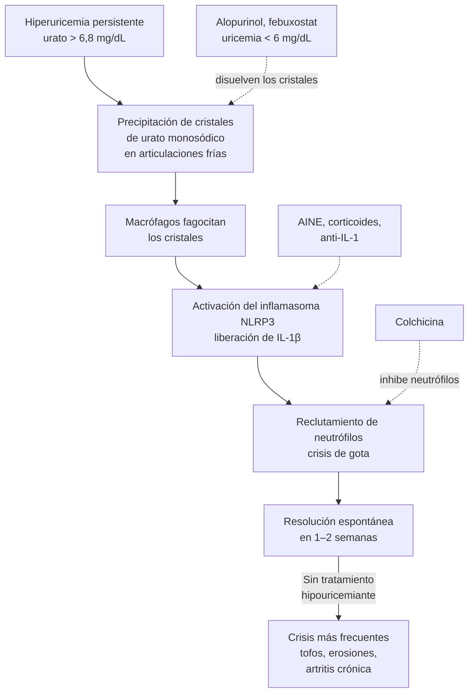

---
tags:
  - Reumatología
  - Urgencia
  - Frecuente en sala
---

# Monoartritis aguda: gota, artritis séptica y enfermedad por pirofosfato de calcio

**Subespecialidad**
Reumatología · Medicina interna · Medicina de urgencia · Traumatología

**Guías principales**
ACR 2020: manejo de la gota (*Arthritis Care Res*) · EULAR 2016: manejo de la gota · EULAR 2018: diagnóstico de la gota · Criterios de clasificación ACR/EULAR 2015 (gota) y 2023 (enfermedad por pirofosfato de calcio) · EULAR 2011: manejo de la enfermedad por pirofosfato de calcio

**Otras fuentes**
GBD 2021 Gout (*Lancet Rheumatol* 2024) · Revisión sistemática de la artritis séptica (*JAMA* 2007) y revisión del *Lancet* 2010 · Ensayos AGREE (colchicina en dosis bajas), CARES y FAST (febuxostat) y Gjika 2019 (duración de antibióticos)

**GES**
No

**EUNACOM**
1.11.1.015 Monoartritis (específico, inicial, derivar) · 1.11.2.002 Gota aguda (específico, completo, derivar) · 1.11.2.001 Artritis séptica (sospecha, inicial, derivar) · 1.11.1.007 Condrocalcinosis

**Revisado**
Septiembre 2026

!!! abstract "Resumen en 60 segundos"
    - **Monoartritis aguda = artritis séptica hasta demostrar lo contrario**. El examen clave es la **artrocentesis**: recuento celular, **Gram**, **cultivo** y **cristales**. Hazla **antes** del antibiótico.
    - **Líquido sinovial**:
        - **> 50.000 leucocitos/mm³** con **> 90 % de neutrófilos** sugiere una infección (> 100.000, muy probable).
        - Los **cristales no descartan** una infección concomitante.
    - **Gota**:
        - Artritis por **cristales de urato monosódico**: agujas con **birrefringencia negativa**.
        - Típica del **hombre** con obesidad, HTA, ERC, alcohol o diuréticos.
        - Ataca la **1.ª metatarsofalángica** (podagra), el tobillo o la rodilla, con dolor máximo en **< 24 h**.
        - La **uricemia puede ser normal** durante la crisis.
    - **Tratar la crisis** lo antes posible con **colchicina en dosis bajas**, **AINE** o **corticoides** (orales o intraarticulares). No suspender el alopurinol si ya lo usaba.
    - **Terapia hipouricemiante** (**alopurinol** en dosis creciente) si hay **tofos**, **daño radiológico** o **≥ 2 crisis al año**. Meta de **uricemia < 6 mg/dL**, con **profilaxis con colchicina** por 3–6 meses al iniciarla.
    - **Artritis séptica**:
        - Causada sobre todo por ***S. aureus***; **gonococo** en los jóvenes sexualmente activos.
        - Tratamiento: **drenaje articular** (punciones repetidas, artroscopía o cirugía) y **antibióticos EV** tras los cultivos.
        - Es una **urgencia**: destruye el cartílago en días.
    - **Enfermedad por pirofosfato de calcio (seudogota)**: adulto mayor, rodilla o muñeca, **condrocalcinosis** en la radiografía, cristales romboidales de **birrefringencia positiva débil**.

## Definición

- **Monoartritis**: inflamación de **una sola articulación** (dolor, aumento de volumen, calor, eritema, limitación funcional).
    - **Aguda**: < 6 semanas. Las causas principales son las **infecciones**, los **cristales** y el **trauma**.
    - **Crónica**: > 6 semanas. Causas: TB, hongos, artritis inflamatorias de inicio monoarticular, sinovitis villonodular, artrosis inflamatoria.
- **Oligoartritis**: 2–4 articulaciones; **poliartritis**: ≥ 5.
- **Gota**: enfermedad por **depósito de cristales de urato monosódico**, secundaria a una **hiperuricemia** persistente.
    - Evoluciona de la hiperuricemia asintomática a la **gota aguda** (crisis), al **período intercrítico** y a la **gota tofácea crónica**.
    - **Hiperuricemia**: urato sérico **> 6,8 mg/dL**, el límite de solubilidad a 37 °C.
- **Artritis séptica**: infección del espacio articular, habitualmente bacteriana.
- **Enfermedad por depósito de pirofosfato de calcio (EDPC)**: engloba la **condrocalcinosis** (calcificación del cartílago en la imagen, a menudo asintomática), la **artritis aguda por cristales de pirofosfato** (antes "seudogota") y la artropatía crónica.

## Epidemiología

### Mundial

- **Gota**:
    - **55,8 millones** de personas en el mundo en 2020 (prevalencia estandarizada de **659 por 100.000**), un aumento de **22,5 %** desde 1990.
    - Es **3,3 veces más frecuente en los hombres** y aumenta con la edad.
    - Se proyectan **95,8 millones** de casos en 2050 (GBD 2021).
    - El **IMC elevado** explica **~ 34 %** de la carga de la gota, y la **disfunción renal** otra parte importante.
    - Es la **artritis inflamatoria más frecuente** en los hombres. En las mujeres aparece tras la menopausia.
- **Artritis séptica**: incidencia de **~ 4–10 por 100.000** al año, mayor en los adultos mayores, con artritis reumatoide o con prótesis. **Mortalidad de 5–15 %**, y secuelas funcionales en un tercio.
- **EDPC**: la condrocalcinosis radiológica aumenta mucho con la edad (**~ 10–15 %** a los 65–75 años y **> 30 %** en los > 85 años). La mayoría es asintomática.

### Chile

!!! chile "Datos nacionales"
    - No hay estudios poblacionales recientes sobre la prevalencia de la gota en Chile. Sí hay una **alta prevalencia de sus factores de riesgo**: obesidad, síndrome metabólico, HTA, diabetes y ERC (ENS 2016–2017), además de un consumo de alcohol elevado.
    - La gota **no tiene GES**. El manejo de la crisis y del alopurinol se hace en la **APS**, con derivación a reumatología de los casos tofáceos, refractarios o con ERC avanzada.
    - El **alopurinol** y la **colchicina** están disponibles en la APS. El **febuxostat** está disponible en el mercado privado.
    - La **artritis séptica** se maneja en los servicios de urgencia y traumatología de los hospitales, y es una causa de consulta frecuente en los adultos mayores y los diabéticos.

## Etiología y factores de riesgo

### Causas de monoartritis aguda

| Grupo | Causas |
|---|---|
| **Infecciosa** | **Artritis séptica bacteriana** (*S. aureus*, estreptococos, **gonococo**, bacilos gramnegativos), infección de una **prótesis**, enfermedad de Lyme, micobacterias y hongos (crónica) |
| **Por cristales** | **Gota** (urato monosódico), **EDPC** (pirofosfato de calcio), hidroxiapatita (hombro de Milwaukee) |
| **Traumática** | **Hemartrosis** (fractura, lesión de ligamentos o meniscos, **anticoagulantes**, hemofilia), cuerpo extraño |
| **Inflamatoria** | Debut de una artritis reactiva, psoriática, espondiloartritis o artritis reumatoide; sarcoidosis (tobillos) |
| **Otras** | Artrosis descompensada, osteonecrosis, sinovitis villonodular pigmentada, tumores |

### Hiperuricemia y gota

- **Menor excreción renal de ácido úrico** (~ 90 %):
    - **ERC**.
    - **Diuréticos** (tiazidas, de asa).
    - **Aspirina en dosis bajas**, ciclosporina y tacrolimus, pirazinamida, etambutol.
    - Acidosis láctica o cetoacidosis (ayuno, alcohol).
    - Hipotiroidismo, **obesidad** y **resistencia a la insulina**.
    - Genética.
- **Mayor producción** (~ 10 %):
    - Dieta rica en **purinas** (carnes rojas, vísceras, mariscos).
    - **Alcohol** (sobre todo la **cerveza** y los destilados).
    - **Fructosa** (bebidas azucaradas).
    - **Lisis tumoral**, neoplasias mieloproliferativas, psoriasis extensa, hemólisis.
    - Defectos enzimáticos (raros).
- **Desencadenantes de una crisis**:
    - Cambios bruscos de la uricemia: **inicio de un hipouricemiante** o de un diurético.
    - Excesos de alcohol o de alimentos.
    - **Deshidratación**, **cirugía**, hospitalización, trauma.

### Artritis séptica

- **Factores de riesgo**:
    - **Artritis reumatoide** o daño articular previo.
    - **Prótesis articular**.
    - **Edad > 80 años**, **diabetes**.
    - **Inyección o cirugía articular reciente**.
    - **Infección de la piel**, **drogas EV**, inmunosupresión, hemodiálisis.
- **Gérmenes**:
    - ***S. aureus*** (**~ 50 %**; SARM según el riesgo).
    - **Estreptococos**.
    - ***Neisseria gonorrhoeae*** (jóvenes sexualmente activos: poliartralgias migratorias, **tenosinovitis** y **pústulas** cutáneas).
    - **Bacilos gramnegativos** (adultos mayores, drogas EV, inmunosupresión, ITU).
    - *S. epidermidis* (prótesis).

### Enfermedad por pirofosfato de calcio

- Asociada a la **edad**, la **artrosis**, el trauma o la cirugía articular previa.
- En los **< 60 años**, o si es poliarticular, buscar causas metabólicas: **hemocromatosis**, **hiperparatiroidismo**, **hipomagnesemia**, hipofosfatasia y formas familiares.

## Fisiopatología

- **Gota**:
    1. Con una uricemia > 6,8 mg/dL, el urato **precipita** en las articulaciones y los tejidos más **fríos** y con menor flujo (pie, 1.ª metatarsofalángica).
    2. Los **macrófagos** fagocitan los cristales y activan el **inflamasoma NLRP3**, que libera **IL-1β**.
    3. La IL-1β recluta **neutrófilos** e inicia una **inflamación intensa** que se autolimita en 1–2 semanas.
    4. La **colchicina** inhibe la función de los neutrófilos (los microtúbulos). Los **antagonistas de la IL-1** bloquean la vía final.
    5. **Hiperuricemia crónica**: formación de **tofos** (acúmulos de cristales con granulomas), **erosiones óseas** con "bordes colgantes", **nefropatía** y **litiasis** por ácido úrico.
    6. Sólo una minoría de las personas con hiperuricemia desarrolla gota. **La hiperuricemia asintomática no se trata** en general.
- **Artritis séptica**:
    1. Las bacterias llegan a la articulación por vía **hematógena** (la más frecuente), por **inoculación directa** (punción, cirugía, trauma) o por **contigüidad** (osteomielitis, celulitis).
    2. La respuesta inflamatoria (neutrófilos, proteasas, citoquinas) y las toxinas bacterianas **destruyen el cartílago en horas a días**.
    3. El aumento de la presión intraarticular produce **isquemia**.
    4. Por eso importan el **drenaje** y los antibióticos precoces.
- **EDPC**: los cristales de pirofosfato de calcio se forman en el cartílago (condrocalcinosis) y, al liberarse, desencadenan una inflamación similar a la de la gota.

*Figura 1. Fisiopatología de la gota y sitio de acción de los tratamientos. Esquema propio.*

## Clasificación

**Análisis del líquido sinovial**:

| Tipo | Aspecto | Leucocitos/mm³ | % neutrófilos | Ejemplos |
|---|---|---|---|---|
| **Normal** | Claro, viscoso | < 200 | < 25 % | — |
| **No inflamatorio** | Claro, amarillo | 200–2.000 | < 25 % | **Artrosis**, trauma |
| **Inflamatorio** | Turbio | **2.000–50.000** | > 50 % | **Gota**, **EDPC**, artritis reumatoide, espondiloartritis |
| **Séptico** | Purulento | **> 50.000** (a menudo > 100.000) | **> 90 %** | **Artritis séptica** (gota o EDPC muy intensas pueden superar las 50.000) |
| **Hemorrágico** | Sanguinolento | Variable | — | Trauma, anticoagulantes, hemofilia, sinovitis villonodular |

En la revisión del *JAMA* (Margaretten, 2007), un recuento **> 100.000** aumenta mucho la probabilidad de infección (razón de verosimilitud ~ 28), igual que > 50.000 (~ 7,7) y ≥ 90 % de neutrófilos (~ 3,4). Un recuento **< 25.000** la hace menos probable, pero **no la descarta**.

**Cristales en el microscopio de luz polarizada**:

| Cristal | Forma | Birrefringencia |
|---|---|---|
| **Urato monosódico** (gota) | **Agujas** | **Negativa fuerte**: amarillos cuando son paralelos al eje del compensador |
| **Pirofosfato de calcio** (EDPC) | **Romboidales** o bastones cortos | **Positiva débil**: azules cuando son paralelos al eje del compensador |

**Estadios de la gota**: hiperuricemia asintomática · **gota aguda** (crisis) · período **intercrítico** · **gota tofácea crónica**.

**Criterios de clasificación ACR/EULAR 2015 de la gota**:

- El **criterio suficiente** es la presencia de **cristales de urato** en el líquido sinovial o en un tofo.
- Si no hay cristales, se suman puntos por:
    - El patrón articular (1.ª metatarsofalángica).
    - Las características de la crisis (eritema, dolor intenso, curso con resolución).
    - Los **tofos**.
    - La **uricemia**.
    - La imagen (**doble contorno** en la ecografía, urato en la TC de doble energía, erosiones).

## Clínica

- **Crisis de gota**:
    - **Inicio brusco**, a menudo **nocturno**, con dolor **muy intenso** que llega al máximo en **< 24 h**. El paciente no tolera ni el roce de la sábana.
    - **Eritema** y calor marcados (puede parecer una celulitis), con **descamación** posterior.
    - **Podagra** (1.ª metatarsofalángica) en el **~ 50 %** de las primeras crisis; luego tobillo, mediopié, rodilla, muñeca, codo (bursitis olecraneana).
    - Puede haber **fiebre** baja y leucocitosis.
    - Se resuelve sola en **7–14 días**.
    - Con el tiempo, las crisis son **más frecuentes, más largas y poliarticulares**.
- **Gota tofácea crónica**: **tofos** (nódulos blanquecinos en el pabellón auricular, los codos, los dedos y el tendón de Aquiles), artritis crónica deformante y erosiones. Litiasis renal y nefropatía por urato.
- **Artritis séptica**:
    - **Monoartritis aguda** (**rodilla** en ~ 50 %, luego cadera, hombro, tobillo, muñeca) con **dolor intenso**, aumento de volumen, calor e **impotencia funcional** (dolor con cualquier movimiento pasivo).
    - **Fiebre** (en ~ 60 %; puede faltar en los adultos mayores e inmunosuprimidos).
    - **Gonocócica**: jóvenes sexualmente activos, con la tríada de **poliartralgias migratorias**, **tenosinovitis** (muñecas y manos) y **dermatitis** (pápulas o pústulas); o una monoartritis purulenta.
- **EDPC aguda**: adulto mayor con **monoartritis de rodilla o muñeca**, a menudo tras una **cirugía** o una enfermedad aguda, con fiebre posible. Se parece a una gota o a una artritis séptica.

<figure markdown>
{ loading=lazy width="520" }
<figcaption>Figura 2. Cristales de urato monosódico birrefringentes en un tofo de la bursa olecraneana, vistos con microscopía de luz polarizada y compensador rojo. Fuente: Towiwat P, Chhana A, Dalbeth N. The anatomical pathology of gout: a systematic literature review. <em>BMC Musculoskelet Disord.</em> 2019;20:140, figura 3. Licencia <a href="https://creativecommons.org/licenses/by/4.0/">CC BY 4.0</a>.</figcaption>
</figure>

!!! alarma "Signos de alarma en la monoartritis"
    - **Fiebre alta, calofríos o sepsis** con una articulación inflamada: **artritis séptica**. Artrocentesis, hemocultivos, antibiótico y drenaje **urgentes**.
    - **Prótesis articular** dolorosa e inflamada: infección de la prótesis. Derivar a traumatología **sin** dar antibióticos antes de las muestras si el paciente está estable.
    - **Líquido purulento** o con **> 50.000 leucocitos**: tratar como séptica aunque se vean cristales.
    - **Paciente anticoagulado** con una articulación a tensión: **hemartrosis**.
    - **Dolor de cadera** con fiebre en un adulto mayor: la artritis séptica de cadera es difícil de examinar; requiere imagen y punción guiada.

## Diagnóstico

**Paso 1. Anamnesis y examen**:

- Confirmar que es una **artritis** (derrame, dolor con la movilidad activa y **pasiva** en todo el rango), y no una **periartritis** (bursitis, tendinitis, celulitis: dolor sólo con ciertos movimientos).
- Preguntar por crisis previas, fármacos (diuréticos), alcohol, trauma, infecciones, conductas sexuales, prótesis, inyecciones.

**Paso 2. Artrocentesis** (antes de los antibióticos):

- **Aspecto**.
- **Recuento celular** con diferencial.
- **Gram y cultivo** (en frascos de hemocultivo para aumentar el rendimiento).
- **Cristales** en microscopía de luz polarizada.
- **No** puncionar a través de una piel con celulitis.

**Paso 3. Exámenes complementarios**:

- Hemograma, **PCR** o VHS.
- **Hemocultivos** (positivos en ~ 50 % de las artritis sépticas).
- Creatinina, **uricemia**, glicemia, pruebas hepáticas.
- En la sospecha de **gonococo**: PCR o cultivo de **uretra**, **cérvix**, recto y faringe, y tamizaje de otras ITS (VIH, sífilis).

**Paso 4. Uricemia**:

- Puede estar **normal o baja** durante la crisis de gota (~ 1/3 de los casos). Hay que **repetirla 2–4 semanas** después.
- Una **uricemia alta no confirma** la gota, porque la hiperuricemia asintomática es frecuente.

**Paso 5. Imagen** (ver más abajo).

- Si no se puede puncionar y el cuadro es típico (podagra en un hombre con factores de riesgo, crisis previas), el diagnóstico **clínico** de gota es razonable, según los criterios ACR/EULAR.
- Si hay **cualquier** duda de infección, hay que puncionar.

## Laboratorio

| Examen | Uso |
|---|---|
| **Líquido sinovial**: recuento, Gram, cultivo, cristales | **El examen clave** |
| **Hemograma, PCR, VHS** | Inflamación (elevados en la infección y en la crisis de gota) |
| **Hemocultivos** | Sospecha de artritis séptica |
| **Uricemia** | Diagnóstico de la gota (repetir fuera de la crisis) y **meta del tratamiento** (< 6 mg/dL) |
| **Creatinina y TFGe** | Dosis de colchicina, AINE y alopurinol; ERC como causa de hiperuricemia |
| **Glicemia, perfil lipídico, PA** | Comorbilidad metabólica y cardiovascular (la gota es un **marcador de riesgo cardiovascular**) |
| **Calcio, magnesio, fósforo, ferritina y saturación de transferrina, PTH** | EDPC en los < 60 años (hemocromatosis, hiperparatiroidismo, hipomagnesemia) |
| **PCR para gonococo y *Chlamydia*** | Artritis en un joven sexualmente activo |

## Imágenes

- **Radiografía**:
    - Normal al inicio de la gota y de la artritis séptica.
    - **Gota crónica**: **erosiones en "sacabocado"** con **bordes colgantes** y tofos; el espacio articular se conserva hasta tarde.
    - **EDPC**: **condrocalcinosis** (calcificación lineal del menisco de la rodilla, del fibrocartílago triangular de la muñeca y de la sínfisis púbica).
    - **Artritis séptica** avanzada: pinzamiento del espacio articular, erosiones, osteomielitis.
- **Ecografía articular**:
    - Derrame (guía de la punción).
    - **Signo del doble contorno** (depósito de urato sobre el cartílago): específico de la gota.
    - Tofos.
    - Depósitos de pirofosfato dentro del cartílago.
- **TC de doble energía**: identifica y cuantifica los depósitos de urato (útil si no se puede puncionar).
- **RM**: osteomielitis, abscesos periarticulares, cadera o sacroilíacas sépticas.

## Diagnóstico diferencial

| Cuadro | Claves |
|---|---|
| **Artritis séptica** | Fiebre, dolor con cualquier movimiento, factores de riesgo; líquido > 50.000 con > 90 % de neutrófilos, Gram o cultivo positivo |
| **Gota** | Hombre, podagra, crisis previas, factores de riesgo; **cristales en aguja con birrefringencia negativa** |
| **EDPC** | Adulto mayor, rodilla o muñeca; **condrocalcinosis**; cristales romboidales con birrefringencia positiva débil |
| **Celulitis o bursitis séptica** | Eritema y dolor superficiales; movilidad articular pasiva conservada |
| **Artritis reactiva** | Infección urinaria o intestinal previa (1–4 semanas), oligoartritis de las extremidades inferiores, entesitis, conjuntivitis, uretritis |
| **Hemartrosis** | Trauma, anticoagulantes, hemofilia; líquido sanguinolento |
| **Artrosis descompensada** | Líquido no inflamatorio; adulto mayor con artrosis conocida |
| **Fractura por estrés, osteonecrosis** | Radiografía o RM |

## Tratamiento

### Crisis de gota

!!! guia "ACR 2020 y EULAR 2016"
    - **Tratar la crisis lo antes posible**, idealmente en las primeras **12–24 h**, con **colchicina**, **AINE** o **corticoides** (orales, intraarticulares o intramusculares), según las comorbilidades. En las crisis graves o poliarticulares se pueden combinar.
    - **Colchicina en dosis bajas**: igual de eficaz que las dosis altas, con menos diarrea (AGREE).
    - **Hielo** local y reposo.
    - **Antagonistas de la IL-1** (anakinra, canakinumab) cuando los anteriores están contraindicados o no funcionan.
    - **No suspender** el alopurinol o el febuxostat durante una crisis si el paciente ya lo tomaba.

!!! dosis "Crisis de gota"
    - **Colchicina**:
        - **1 mg VO** al inicio y **0,5 mg una hora después** (en Chile, comprimidos de 0,5 mg; dosis equivalente a 1,2 mg + 0,6 mg de la ACR).
        - Luego **0,5 mg cada 12 h** (o cada 8 h) hasta que ceda la crisis.
        - **Ajustar o evitar** en la **ERC** (TFGe < 30) y la hepatopatía. Evitar con inhibidores potentes del CYP3A4 o de la glicoproteína P (**claritromicina**, azoles, ciclosporina, verapamilo, diltiazem): riesgo de toxicidad grave (miopatía, mielosupresión).
        - Efecto adverso principal: **diarrea**.
    - **AINE**:
        - **Naproxeno 500 mg cada 12 h**, **ibuprofeno 800 mg cada 8 h** o **indometacina 50 mg cada 8 h**, por 5–7 días.
        - **Evitar** en la ERC, la insuficiencia cardíaca, la cirrosis, la úlcera péptica o con anticoagulantes.
        - Agregar un IBP si hay riesgo digestivo.
    - **Corticoides**:
        - **Prednisona 30–40 mg/día** (~ 0,5 mg/kg) por **5 días** (o con disminución gradual en 7–10 días).
        - O **corticoide intraarticular** (por ejemplo, metilprednisolona 40 mg o triamcinolona en la rodilla) **tras descartar la infección**.
        - Son la opción de elección en la **ERC** y cuando hay contraindicación de AINE.

### Terapia hipouricemiante

!!! guia "ACR 2020"
    - **Indicaciones fuertes**: **≥ 1 tofo**, **daño radiológico** por gota, o **≥ 2 crisis al año**.
    - **Indicaciones condicionales**: más de una crisis previa con < 2 al año. Tras una primera crisis, si hay **ERC ≥ etapa 3**, uricemia **> 9 mg/dL** o **litiasis** renal.
    - **Estrategia "tratar hasta la meta"**: uricemia **< 6 mg/dL** (< 5 mg/dL en la gota tofácea).
    - **Alopurinol** es el fármaco de **primera línea**, incluso en la ERC moderada a grave. Se inicia en **dosis bajas** y se sube progresivamente.
    - Se puede **iniciar durante la crisis** (ACR 2020, recomendación condicional), con tratamiento antiinflamatorio concomitante.
    - **Profilaxis antiinflamatoria** al iniciar el hipouricemiante: **colchicina** (o AINE o prednisona en dosis bajas) por **3–6 meses**, porque la movilización del urato desencadena crisis.
    - **No** tratar la **hiperuricemia asintomática**.
    - **Estilo de vida**: limitar el **alcohol** (sobre todo la cerveza), las **purinas** (carnes rojas, vísceras, mariscos) y la **fructosa**; **bajar de peso**. Si es posible, cambiar la hidroclorotiazida por otro antihipertensivo (por ejemplo, **losartán**, que tiene un leve efecto uricosúrico). **No** suspender la aspirina cardioprotectora.

!!! dosis "Hipouricemiantes"
    - **Alopurinol**:
        - Iniciar con **100 mg/día** (**50 mg/día** en la ERC etapa ≥ 3).
        - Subir **100 mg cada 2–5 semanas** (50 mg en la ERC) según la uricemia, hasta la **meta** (dosis máxima de **800–900 mg/día**; se puede superar la "dosis renal" con subida lenta y monitoreo).
        - **Efecto adverso grave**: **síndrome de hipersensibilidad** (DRESS o Stevens-Johnson), más frecuente al inicio, con dosis iniciales altas, en la ERC y en los portadores del **HLA-B*58:01** (se tamiza en personas de ascendencia del sudeste asiático o afroamericana).
        - **Interacción**: **azatioprina** y mercaptopurina (mielotoxicidad grave).
    - **Febuxostat**: **40 mg/día**, hasta 80–120 mg/día. Es la alternativa en la intolerancia al alopurinol. En el ensayo **CARES** se asoció a **más mortalidad cardiovascular** que el alopurinol; en el ensayo **FAST** no se observó esa diferencia. La ACR recomienda cambiar a otro fármaco si el paciente tiene enfermedad cardiovascular.
    - **Uricosúricos** (probenecid, benzbromarona): segunda línea; no en la litiasis ni en la ERC avanzada.
    - **Pegloticasa** (infusión EV): gota tofácea refractaria (especialista).
    - **Profilaxis al iniciar**: **colchicina 0,5 mg cada 12–24 h** por **3–6 meses** (ajustada a la función renal).

### Artritis séptica

!!! dosis "Artritis séptica del adulto (articulación nativa)"
    1. **Artrocentesis** (y hemocultivos) **antes del antibiótico**.
    2. **Antibiótico EV empírico** según el Gram y el riesgo:
        - **Cocos grampositivos o Gram negativo, sin riesgo de SARM**: **cefazolina 2 g EV cada 8 h** o **cloxacilina 2 g EV cada 4–6 h**.
        - **Riesgo de SARM** (hospitalización, hemodiálisis, colonización, drogas EV): **vancomicina EV** (con niveles).
        - **Bacilos gramnegativos**, adultos mayores con ITU, inmunosuprimidos: **ceftriaxona 2 g/día** (o cefepime si hay riesgo de *Pseudomonas*).
        - **Gonococo**: **ceftriaxona 1 g/día EV** por 7 días, más el tratamiento de *Chlamydia* (doxiciclina) y de la pareja.
    3. **Drenaje articular**: **punciones repetidas** (diarias), **artroscopía** o **artrotomía**, según la articulación (la **cadera** requiere drenaje quirúrgico) y la respuesta.
    4. **Duración**: habitualmente **2–4 semanas** en total (EV y luego oral según la evolución). Un ensayo mostró que **2 semanas** tras el drenaje quirúrgico no fueron inferiores a 4 semanas en la artritis séptica de articulación nativa, sobre todo en las manos (Gjika, 2019). *S. aureus* con bacteriemia u osteomielitis requiere más tiempo.
    5. **Movilización precoz** asistida tras el control del dolor.
    - **Prótesis infectada**: derivar a traumatología (manejo quirúrgico y antibióticos prolongados).

### Enfermedad por pirofosfato de calcio

- **Crisis aguda** (EULAR 2011): **hielo**, reposo, **artrocentesis evacuadora** con **corticoide intraarticular** tras descartar la infección; o **colchicina** o **AINE** en dosis bajas, o prednisona.
- **No existe un tratamiento** que disuelva los cristales de pirofosfato: no se usan hipouricemiantes.
- **Profilaxis** en las crisis recurrentes: **colchicina 0,5–1 mg/día**.
- **Buscar y tratar la causa metabólica** en los jóvenes: hemocromatosis, hiperparatiroidismo, hipomagnesemia.

## Complicaciones

- **Gota**:
    - **Tofos**, artritis crónica con **destrucción articular**, deformidad.
    - **Litiasis renal** por ácido úrico, **nefropatía** crónica por urato.
    - Asociación con **enfermedad cardiovascular**, HTA, síndrome metabólico, diabetes y ERC.
- **Del tratamiento**:
    - **Toxicidad por colchicina**: diarrea; en dosis altas o con interacciones, miopatía, neuropatía y mielosupresión.
    - **AINE**: LRA, hemorragia digestiva, insuficiencia cardíaca.
    - **Alopurinol**: **síndrome de hipersensibilidad** (DRESS), interacción con la azatioprina.
- **Artritis séptica**:
    - **Destrucción del cartílago** y **artrosis secundaria**, anquilosis.
    - **Osteomielitis**, abscesos.
    - **Sepsis** y **muerte** (5–15 %; mayor en la poliarticular y en los adultos mayores).
    - Necrosis avascular de la cabeza femoral.
- **EDPC**: artropatía crónica destructiva, sobre todo en la rodilla y la muñeca.

## Pronóstico y seguimiento

- **Gota**:
    - Con una **uricemia sostenida < 6 mg/dL**, las crisis disminuyen y los tofos **se reabsorben** (en meses a años).
    - Sin tratamiento, la mayoría repite las crisis y muchos desarrollan tofos.
    - La **adherencia al alopurinol** es baja; hay que explicar que es un tratamiento **de por vida**.
- **Artritis séptica**: el pronóstico depende del **tiempo hasta el drenaje y los antibióticos**, del germen (*S. aureus* es peor), de la articulación previa y de la edad.
- **Perfil EUNACOM**:
    - **Gota aguda**: diagnóstico específico, **tratamiento completo** de la crisis y **derivación** para el manejo a largo plazo (según el caso).
    - **Monoartritis**: diagnóstico específico, tratamiento inicial y derivación.
    - **Artritis séptica**: sospecha, **tratamiento inicial** (artrocentesis, cultivos, antibiótico) y **derivación urgente** a traumatología.
- **Seguimiento de la gota**:
    - **Uricemia** cada **2–5 semanas** durante la subida del alopurinol, y luego cada 6–12 meses.
    - Función renal.
    - Control de los factores de riesgo cardiovascular.
    - Educación sobre la dieta y el alcohol.

## Perlas para el internado

!!! perla "Para la sala y el turno"
    - **Monoartritis aguda con fiebre = puncionar**. Pide Gram, cultivo, recuento y cristales **antes** de dar el antibiótico.
    - **Encontrar cristales no descarta una infección**: si el líquido es purulento o tiene > 50.000 leucocitos, trata como séptica hasta tener los cultivos.
    - **Uricemia normal no descarta una crisis de gota**, y una uricemia alta no la confirma.
    - **Crisis de gota en un hospitalizado** (poscirugía, diuréticos, ayuno): es frecuente. **Prednisona** si hay ERC o insuficiencia cardíaca.
    - **Colchicina + claritromicina** (o verapamilo, diltiazem, azoles) = riesgo de **intoxicación** por colchicina. Revisa las interacciones.
    - **No inicies el alopurinol con 300 mg** en un paciente con ERC: empieza con 50–100 mg y sube de a poco.
    - **Alopurinol + azatioprina** = mielosupresión grave.
    - **No suspendas el alopurinol** durante una crisis si el paciente ya lo tomaba.
    - Un **joven con poliartralgias migratorias, tenosinovitis y pústulas** = **gonococo diseminado**: ceftriaxona y tamizaje de ITS.
    - **Adulto mayor con monoartritis de rodilla** tras una cirugía o una neumonía: piensa en la **EDPC** (pide la radiografía), pero **puncionar sigue siendo obligatorio**.

## Preguntas de repaso

??? repaso "1. Hombre de 52 años, hipertenso con hidroclorotiazida, obeso, que despierta con dolor intenso, eritema y aumento de volumen de la 1.ª metatarsofalángica derecha tras un asado con cerveza. Afebril. ¿Qué tiene y cómo lo tratas?"
    **Crisis de gota** (podagra) con factores de riesgo (tiazida, obesidad, alcohol, purinas).

    - Si es posible, **puncionar** para ver los **cristales** de urato. Si es típico y no hay sospecha de infección, el diagnóstico clínico es razonable.
    - **Tratamiento de la crisis**: **colchicina 1 mg + 0,5 mg a la hora**, luego 0,5 mg cada 12 h; o **naproxeno** 500 mg cada 12 h (si la función renal es normal); o **prednisona 30–40 mg** por 5 días. Hielo y reposo.
    - Uricemia y creatinina, y repetir la uricemia a las 2–4 semanas.
    - Educación: alcohol, peso, dieta.
    - Considerar cambiar la tiazida por **losartán**.
    - Si repite ≥ 2 crisis al año o tiene tofos: **alopurinol** con profilaxis.

??? repaso "2. Mujer de 75 años, diabética, con artritis reumatoide, que consulta por dolor y aumento de volumen de la rodilla derecha de 2 días, con fiebre de 38,7 °C. ¿Qué haces?"
    Sospecha de **artritis séptica** (factores de riesgo: edad, diabetes, artritis reumatoide).

    1. **Artrocentesis** urgente: recuento celular, **Gram**, **cultivo** y cristales.
    2. **Hemocultivos**, hemograma, PCR y creatinina.
    3. Tras las muestras: **antibiótico EV empírico** (cefazolina o cloxacilina; vancomicina si hay riesgo de SARM; agregar ceftriaxona si el Gram muestra bacilos gramnegativos).
    4. **Derivación urgente a traumatología** para el **drenaje** (punciones repetidas o artroscopía).
    5. Ajustar según el cultivo, por 2–4 semanas en total.

??? repaso "3. Líquido sinovial de la rodilla: turbio, 85.000 leucocitos/mm³ con 92 % de neutrófilos, y se observan cristales en aguja con birrefringencia negativa. ¿Es una gota o una artritis séptica?"
    **Puede ser ambas**. Los cristales de urato confirman la gota, pero **no descartan una infección concomitante**. Con > 50.000 leucocitos y > 90 % de neutrófilos, hay que **tratar como una artritis séptica** (antibióticos y drenaje) hasta tener el **Gram y el cultivo**. Si el cultivo es negativo y el paciente mejora, se suspende el antibiótico y se trata la crisis de gota.

??? repaso "4. ¿Cuándo indicas alopurinol y cómo lo inicias?"
    **Indicaciones** (ACR 2020): **tofos**, **daño radiológico**, **≥ 2 crisis al año**. También se considera tras una primera crisis si hay ERC ≥ etapa 3, uricemia > 9 mg/dL o litiasis.

    **Cómo iniciarlo**:

    - **100 mg/día** (50 mg en la ERC).
    - **Subir 100 mg cada 2–5 semanas** según la uricemia, hasta una **meta < 6 mg/dL** (< 5 si hay tofos).
    - **Profilaxis con colchicina** 0,5 mg/día por 3–6 meses.
    - Advertir sobre el **exantema** (suspender y consultar).
    - Revisar las interacciones (azatioprina).
    - Se puede iniciar durante la crisis, con tratamiento antiinflamatorio.
    - Es un tratamiento **de por vida**.

??? repaso "5. Mujer de 80 años con monoartritis aguda de la rodilla dos días después de una cirugía de cadera. La radiografía muestra calcificación lineal de los meniscos. ¿Qué sospechas y qué haces?"
    **Artritis aguda por cristales de pirofosfato de calcio** (antes seudogota): adulta mayor, rodilla, posoperatorio, **condrocalcinosis** en la radiografía.

    - **Artrocentesis** obligatoria: **cristales romboidales con birrefringencia positiva débil**, y **Gram y cultivo** para descartar una infección (frecuente en el posoperatorio).
    - Tratamiento: evacuación del derrame con **corticoide intraarticular** (tras descartar la infección), o colchicina, o AINE en dosis bajas, o prednisona.
    - Hielo.
    - No se usan hipouricemiantes.

## Referencias

1. FitzGerald JD, Dalbeth N, Mikuls T, et al. 2020 American College of Rheumatology Guideline for the Management of Gout. *Arthritis Care Res (Hoboken).* 2020;72:744–760. doi:[10.1002/acr.24180](https://doi.org/10.1002/acr.24180)
2. Richette P, Doherty M, Pascual E, et al. 2016 updated EULAR evidence-based recommendations for the management of gout. *Ann Rheum Dis.* 2017;76:29–42. doi:[10.1136/annrheumdis-2016-209707](https://doi.org/10.1136/annrheumdis-2016-209707)
3. Richette P, Doherty M, Pascual E, et al. 2018 updated European League Against Rheumatism evidence-based recommendations for the diagnosis of gout. *Ann Rheum Dis.* 2020;79:31–38. doi:[10.1136/annrheumdis-2019-215315](https://doi.org/10.1136/annrheumdis-2019-215315)
4. Neogi T, Jansen TL, Dalbeth N, et al. 2015 Gout classification criteria: an American College of Rheumatology/European League Against Rheumatism collaborative initiative. *Ann Rheum Dis.* 2015;74:1789–1798. doi:[10.1136/annrheumdis-2015-208237](https://doi.org/10.1136/annrheumdis-2015-208237)
5. Abhishek A, Tedeschi SK, Pascart T, et al. The 2023 ACR/EULAR classification criteria for calcium pyrophosphate deposition disease. *Ann Rheum Dis.* 2023;82:1248–1257. doi:[10.1136/ard-2023-224575](https://doi.org/10.1136/ard-2023-224575)
6. Zhang W, Doherty M, Pascual E, et al. EULAR recommendations for calcium pyrophosphate deposition. Part II: management. *Ann Rheum Dis.* 2011;70:571–575. doi:[10.1136/ard.2010.139360](https://doi.org/10.1136/ard.2010.139360)
7. GBD 2021 Gout Collaborators. Global, regional, and national burden of gout, 1990–2020, and projections to 2050: a systematic analysis of the Global Burden of Disease Study 2021. *Lancet Rheumatol.* 2024;6:e507–e517. doi:[10.1016/S2665-9913(24)00117-6](https://doi.org/10.1016/S2665-9913(24)00117-6)
8. Terkeltaub RA, Furst DE, Bennett K, et al. High versus low dosing of oral colchicine for early acute gout flare: Twenty-four-hour outcome of the first multicenter, randomized, double-blind, placebo-controlled, parallel-group, dose-comparison colchicine study. *Arthritis Rheum.* 2010;62:1060–1068. doi:[10.1002/art.27327](https://doi.org/10.1002/art.27327)
9. White WB, Saag KG, Becker MA, et al. Cardiovascular Safety of Febuxostat or Allopurinol in Patients with Gout (CARES). *N Engl J Med.* 2018;378:1200–1210. doi:[10.1056/NEJMoa1710895](https://doi.org/10.1056/NEJMoa1710895)
10. Mackenzie IS, Ford I, Nuki G, et al. Long-term cardiovascular safety of febuxostat compared with allopurinol in patients with gout (FAST): a multicentre, prospective, randomised, open-label, non-inferiority trial. *Lancet.* 2020;396:1745–1757. doi:[10.1016/S0140-6736(20)32234-0](https://doi.org/10.1016/S0140-6736(20)32234-0)
11. Margaretten ME, Kohlwes J, Moore D, Bent S. Does this adult patient have septic arthritis? *JAMA.* 2007;297:1478–1488. doi:[10.1001/jama.297.13.1478](https://doi.org/10.1001/jama.297.13.1478)
12. Mathews CJ, Weston VC, Jones A, Field M, Coakley G. Bacterial septic arthritis in adults. *Lancet.* 2010;375:846–855. doi:[10.1016/S0140-6736(09)61595-6](https://doi.org/10.1016/S0140-6736(09)61595-6)
13. Gjika E, Beaulieu JY, Vakalopoulos K, et al. Two weeks versus four weeks of antibiotic therapy after surgical drainage for native joint bacterial arthritis: a prospective, randomised, non-inferiority trial. *Ann Rheum Dis.* 2019;78:1114–1121. doi:[10.1136/annrheumdis-2019-215116](https://doi.org/10.1136/annrheumdis-2019-215116)
14. Towiwat P, Chhana A, Dalbeth N. The anatomical pathology of gout: a systematic literature review. *BMC Musculoskelet Disord.* 2019;20:140. doi:[10.1186/s12891-019-2519-y](https://doi.org/10.1186/s12891-019-2519-y)
