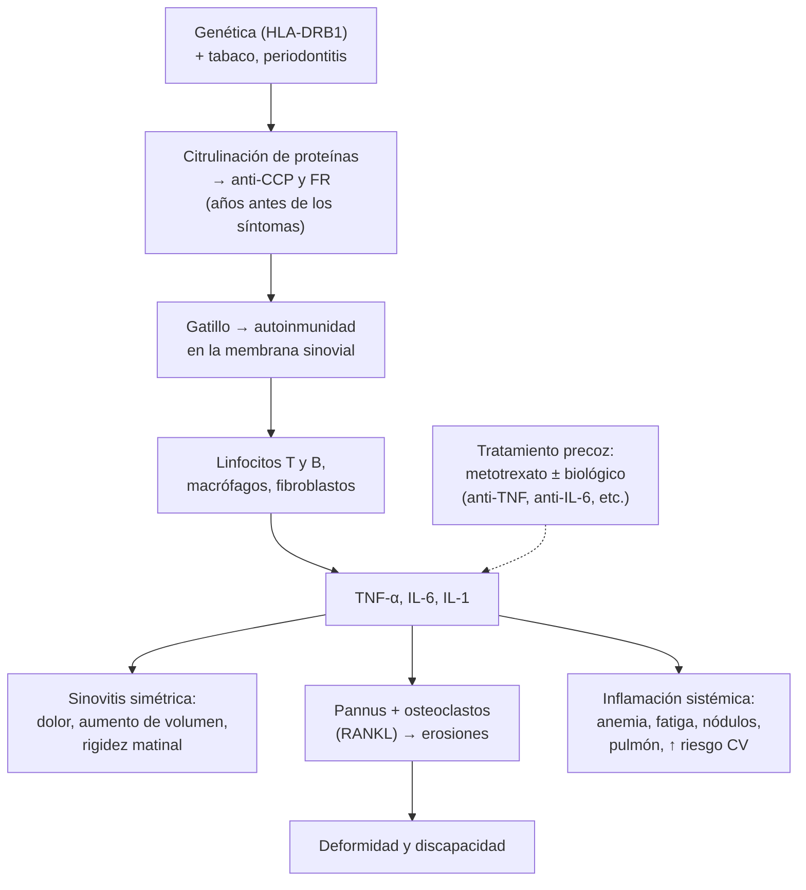
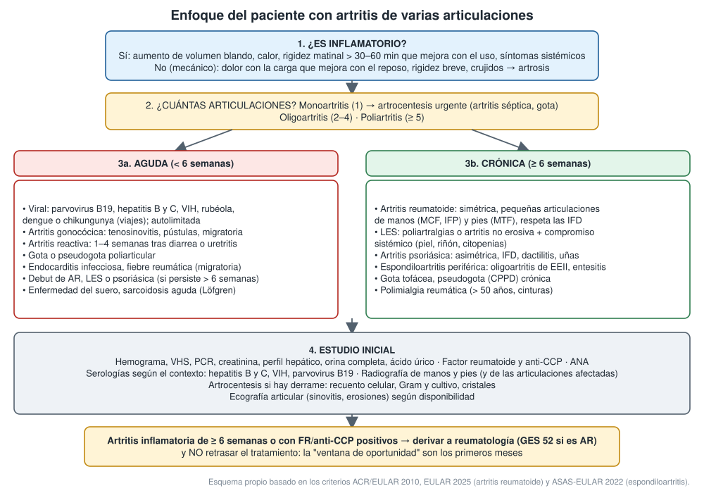

---
tags:
  - Reumatología
  - GES
---

# Poliartritis y oligoartritis: artritis reumatoide, espondiloartritis, artritis psoriásica y reactiva

**Subespecialidad**
Reumatología

**Guías principales**
EULAR 2025: tratamiento de la artritis reumatoide con FAME sintéticos y biológicos · Criterios de clasificación ACR/EULAR 2010 de artritis reumatoide · ACR 2021: tratamiento de la artritis reumatoide · ASAS-EULAR 2022: espondiloartritis axial · EULAR 2023: artritis psoriásica · Criterios CASPAR (2006) y ASAS (2009)

**Otras fuentes**
GBD 2021: carga de la artritis reumatoide · MINSAL: informe de evaluación de la artritis reumatoide refractaria (Ley Ricarte Soto)

**GES**
**Artritis reumatoide (GES 52)**, desde los 15 años: confirmación diagnóstica en **≤ 90 días** desde la sospecha, tratamiento **inmediato** desde la confirmación por el especialista y rehabilitación en ≤ 15 días. Copago: FONASA 0 %, isapre 20 %. Los **biológicos** para la AR **refractaria** están cubiertos por la **Ley Ricarte Soto** (Ley 20.850).

**EUNACOM**
1.11.1.019 Poliartritis (específico, inicial, derivar) · 1.11.1.016 Oligoartritis (específico, inicial, derivar) · 1.11.1.003 Artritis reumatoide (sospecha, inicial, derivar) · 1.11.1.001 Artritis psoriásica (sospecha, inicial, derivar) · 1.11.1.002 Artritis reactivas (específico, inicial, derivar) · 1.11.1.018 Pelviespondilopatías seronegativas (sospecha, inicial, derivar)

**Revisado**
Septiembre 2026

!!! abstract "Resumen en 60 segundos"
    - **Primera pregunta**: ¿es **inflamatorio**? Aumento de volumen blando, **rigidez matinal > 30–60 min** que mejora con el uso, síntomas sistémicos. Si no, es mecánico (artrosis).
    - **Segunda**: ¿cuántas articulaciones? **Mono** (1: artrocentesis urgente), **oligo** (2–4) o **poli** (≥ 5).
    - **Tercera**: ¿aguda (< 6 semanas: viral, reactiva, gonocócica, gota, endocarditis) o **crónica** (≥ 6 semanas: AR, LES, psoriásica, espondiloartritis)?
    - **Artritis reumatoide**:
        - **Poliartritis simétrica** de manos (MCF, IFP), muñecas y pies (MTF). **Respeta las IFD**.
        - **Factor reumatoide** y **anti-CCP** (el más específico). Criterios ACR/EULAR 2010 (≥ 6/10).
        - En Chile afecta al **0,46 %** de la población (GES 52).
    - **Tratamiento de la AR** (EULAR 2025): **metotrexato** desde el diagnóstico (15 → 20–25 mg **semanales** + ácido fólico) con **corticoides por poco tiempo**.
        - Meta: **remisión o baja actividad** (*treat-to-target*).
        - Si no hay respuesta a los 3–6 meses: agregar un **biológico** (Ley Ricarte Soto) o, sopesando los riesgos, un **inhibidor de JAK**.
    - **Espondiloartritis** (seronegativas, HLA-B27):
        - **Dolor lumbar inflamatorio**, **oligoartritis asimétrica de EEII**, **entesitis** (Aquiles), **dactilitis**, **uveítis anterior**, psoriasis, enfermedad inflamatoria intestinal.
        - Primera línea: **AINE** en dosis plenas + **ejercicio**.
    - **Artritis psoriásica**: asimétrica, **IFD**, **dactilitis**, compromiso ungueal.
    - **Artritis reactiva**: 1–4 semanas tras una **diarrea** o una **uretritis** (*Chlamydia*). Oligoartritis de EEII, conjuntivitis y uretritis.
    - **Derivar precozmente**: toda artritis inflamatoria que persiste > 6 semanas. La **"ventana de oportunidad"** son los primeros meses.

## Definición

| Término | Definición |
|---|---|
| **Artritis** | Inflamación articular con **aumento de volumen** (sinovitis o derrame), a veces con calor y rubor. Distinta de la **artralgia** (dolor sin inflamación) |
| **Monoartritis, oligoartritis y poliartritis** | Compromiso de **1**, **2–4** y **≥ 5** articulaciones |
| **Aguda y crónica** | **< 6 semanas** y **≥ 6 semanas** |
| **Artritis reumatoide (AR)** | Enfermedad **autoinmune**, sistémica y crónica, con **sinovitis poliarticular simétrica** que puede **erosionar** el cartílago y el hueso y causar deformidad y discapacidad |
| **Espondiloartritis (pelviespondilopatías seronegativas)** | Grupo de enfermedades inflamatorias con FR negativo, asociadas al **HLA-B27**, que afectan el **esqueleto axial** (sacroilíacas y columna), las **entesis** y las articulaciones periféricas. **Axial**: espondilitis anquilosante (radiográfica) y no radiográfica. **Periférica**: psoriásica, reactiva, asociada a enfermedad inflamatoria intestinal, indiferenciada |
| **Artritis psoriásica** | Artritis inflamatoria asociada a la **psoriasis** (actual, previa o familiar) |
| **Artritis reactiva** | Artritis **estéril** que aparece **1–4 semanas** después de una infección **intestinal** (*Salmonella*, *Shigella*, *Campylobacter*, *Yersinia*) o **genitourinaria** (*Chlamydia trachomatis*) |
| **Entesitis** | Inflamación de la inserción de tendones y ligamentos en el hueso (Aquiles, fascia plantar) |
| **Dactilitis** | Inflamación de todo un dedo ("dedo en salchicha") |

## Epidemiología

### Mundial

- **Artritis reumatoide** (GBD 2021):
    - **17,6 millones** de personas en 2020 (208,8 por 100.000, ajustado por edad), con una proyección de **31,7 millones** en 2050.
    - Es **2,45 veces** más frecuente en **mujeres**.
    - La mortalidad bajó **23,8 %** entre 1990 y 2020. El **tabaquismo** explica el **7,1 %** de su carga.
- La AR comienza con más frecuencia entre los **30 y 60 años**. Las espondiloartritis empiezan antes de los **40–45 años** y son algo más frecuentes en hombres (la espondilitis anquilosante).
- La **artritis psoriásica** afecta a una proporción importante de los pacientes con psoriasis, y en la mayoría la piel precede a la artritis.

!!! chile "Datos nacionales"
    - La prevalencia de la AR en Chile se estima en **0,46 %** (IC 95 % 0,24–0,8) de la población (MINSAL). Entre el **5 % y el 20 %** no responde a los FAME convencionales.
    - **GES 52**:
        - Garantiza desde los **15 años** la confirmación diagnóstica en **90 días**, el tratamiento **inmediato** tras la confirmación por el especialista y la **rehabilitación** en 15 días.
        - La **primera línea** (FAME convencionales) es GES.
    - **Ley Ricarte Soto** (Ley 20.850): cubre los **biológicos** (entre ellos abatacept, adalimumab, etanercept y rituximab) en la **AR refractaria** a los FAME convencionales, según el protocolo.
    - Antes de un biológico hay que descartar la **TBC latente**, que es relevante por la incidencia de tuberculosis en aumento en Chile. Ver [tuberculosis](../respiratorio/tuberculosis.md).

## Etiología

- **Artritis reumatoide**: **genética** (epítopo compartido **HLA-DRB1**) + **ambiente**.
    - El **tabaco** es el principal factor ambiental: induce la **citrulinación** de proteínas en el pulmón y la formación de **anticuerpos anti-péptidos citrulinados (anti-CCP)**.
    - Otros: periodontitis, obesidad y sexo femenino.
- **Espondiloartritis**: **HLA-B27** (presente en la mayoría de las espondilitis anquilosantes), microbiota intestinal y estrés mecánico en las entesis.
- **Artritis psoriásica**: genética (HLA-B27, HLA-C\*06), microtrauma (fenómeno de Köbner profundo) y eje IL-23/IL-17.
- **Artritis reactiva**: infección **intestinal** o **genitourinaria** en un huésped predispuesto (HLA-B27).

### Causas de poliartritis y oligoartritis

| Grupo | Causas |
|---|---|
| **Infecciosas** | **Virales** (parvovirus B19, hepatitis B y C, VIH, rubéola, arbovirus en viajeros), **gonocócica**, **endocarditis**, bacteriana poliarticular (rara, en inmunosuprimidos o con AR), Lyme (importada) |
| **Posinfecciosas** | **Artritis reactiva**, **fiebre reumática** (poliartritis **migratoria** de grandes articulaciones, respuesta rápida a la aspirina; ver [valvulopatías](../cardiologia/valvulopatias-y-soplos.md)) |
| **Por cristales** | **Gota** poliarticular o tofácea, **pseudogota** (CPPD). Ver [monoartritis y gota](monoartritis-gota-artritis-septica.md) |
| **Autoinmunes** | **Artritis reumatoide**, **LES**, **síndrome de Sjögren**, esclerosis sistémica, miopatías inflamatorias, vasculitis, **polimialgia reumática**, sarcoidosis (síndrome de Löfgren: eritema nudoso, adenopatías hiliares y artritis de tobillos) |
| **Espondiloartritis** | **Psoriásica**, **reactiva**, asociada a **enfermedad inflamatoria intestinal**, espondilitis anquilosante con compromiso periférico |
| **Otras** | Paraneoplásica, osteoartropatía hipertrófica, hemocromatosis (MCF 2.ª y 3.ª), artrosis erosiva (IFD, IFP; no es inflamatoria sistémica) |

## Fisiopatología

- **Artritis reumatoide**:
    - Años antes de los síntomas aparecen los **autoanticuerpos**: **factor reumatoide** (IgM contra la IgG) y **anti-CCP**.
    - Un gatillo lleva la autoinmunidad a la **membrana sinovial**. Los linfocitos T y B, los macrófagos y los fibroblastos sinoviales producen **TNF-α**, **IL-6** e IL-1.
    - La sinovial proliferada (**pannus**) invade el cartílago y el hueso, y la activación de los **osteoclastos** (RANKL) produce las **erosiones** marginales.
    - La inflamación sistémica explica la anemia de enfermedad crónica, la fatiga, el **aumento del riesgo cardiovascular** y las manifestaciones extraarticulares.
    - Cada citoquina y célula implicada es un **blanco terapéutico**: anti-TNF, anti-IL-6 (tocilizumab), anti-CD20 (rituximab), bloqueo de la coestimulación de linfocitos T (abatacept) e inhibidores de JAK.
- **Espondiloartritis**: la inflamación empieza en las **entesis** (no en la sinovial). Tiene un eje **IL-23/IL-17** y lleva a **neoformación ósea** (sindesmofitos y anquilosis, "columna en caña de bambú").
- **Artritis reactiva**: los antígenos bacterianos persisten en la sinovial y gatillan una respuesta inmune en personas predispuestas (HLA-B27).

## Clasificación

!!! guia "Criterios de clasificación ACR/EULAR 2010 de artritis reumatoide (≥ 6 de 10 puntos)"
    Se aplican a pacientes con **≥ 1 articulación con sinovitis** clínica que no se explica por otra enfermedad.

    | Dominio | Categoría | Puntos |
    |---|---|---|
    | **A. Articulaciones** | 1 articulación grande | 0 |
    | | 2–10 articulaciones grandes | 1 |
    | | 1–3 articulaciones pequeñas (con o sin grandes) | 2 |
    | | 4–10 articulaciones pequeñas (con o sin grandes) | 3 |
    | | > 10 articulaciones (al menos 1 pequeña) | 5 |
    | **B. Serología** | FR y anti-CCP negativos | 0 |
    | | FR **o** anti-CCP positivo bajo (≤ 3 veces el límite normal) | 2 |
    | | FR **o** anti-CCP positivo alto (> 3 veces el límite normal) | 3 |
    | **C. Reactantes de fase aguda** | PCR y VHS normales | 0 |
    | | PCR **o** VHS alterada | 1 |
    | **D. Duración de los síntomas** | < 6 semanas | 0 |
    | | ≥ 6 semanas | 1 |

    - **Pequeñas**: MCF, IFP, MTF 2.ª a 5.ª, IF del pulgar, muñecas. **Grandes**: hombros, codos, caderas, rodillas, tobillos.
    - También se clasifica como AR si hay **erosiones típicas**, aunque no se cumplan los puntos.
    - Son criterios de **clasificación**: no reemplazan el juicio clínico.

- **Espondiloartritis** (ASAS 2009):
    - **Axial**: dolor lumbar ≥ 3 meses con inicio < 45 años + **sacroileítis** en imagen + ≥ 1 rasgo de espondiloartritis, o **HLA-B27** + ≥ 2 rasgos.
    - **Periférica**: artritis, entesitis o dactilitis + rasgos de espondiloartritis.
- **Dolor lumbar inflamatorio** (ASAS, ≥ 4 de 5): inicio < 40 años, inicio insidioso, mejora con el ejercicio, no mejora con el reposo, dolor nocturno que mejora al levantarse.
- **Artritis psoriásica (CASPAR)**: enfermedad articular inflamatoria + **≥ 3 puntos** entre:
    - Psoriasis actual (2 puntos), antecedente personal o familiar de psoriasis (1).
    - Distrofia ungueal (1).
    - **FR negativo** (1).
    - **Dactilitis** (1).
    - Neoformación ósea yuxtaarticular en la radiografía (1).
- **Patrones de la artritis psoriásica**: oligoartritis asimétrica, poliartritis simétrica (parecida a la AR), predominio **IFD**, **mutilante** y axial.

## Clínica

### Artritis reumatoide

- **Articular**:
    - Poliartritis **simétrica** y aditiva de **MCF, IFP, muñecas** y **MTF** (el apretón lateral de MCF y MTF duele).
    - Rigidez matinal **> 1 hora**, fatiga.
    - **Respeta las IFD** y la columna lumbar. Puede afectar la **columna cervical** (**subluxación atlantoaxial**: cuidado en la intubación).
- **Deformidades tardías**: **desviación cubital**, **cuello de cisne**, **en ojal** (*boutonnière*), pulgar en Z, subluxación de las MTF.
- **Extraarticular** (más en la AR seropositiva y fumadora):
    - **Nódulos reumatoides** (codo).
    - **Pulmón**: enfermedad **intersticial**, nódulos, **pleuritis** con glucosa muy baja.
    - Pericarditis, **escleritis** y epiescleritis, **Sjögren secundario**, vasculitis reumatoide.
    - **Síndrome de Felty** (AR + esplenomegalia + neutropenia).
    - **Anemia** de enfermedad crónica.
    - **Aterosclerosis acelerada**, **osteoporosis**, túnel carpiano.

### Espondiloartritis y artritis psoriásica

- **Axial**: **dolor lumbar inflamatorio**, dolor glúteo alternante, rigidez matinal, pérdida de la movilidad (Schober), cifosis tardía. Ver [lumbago](lumbago-lumbociatica-y-cervicalgia.md).
- **Periférica**: **oligoartritis asimétrica** de **rodillas y tobillos**, **entesitis** (talón), **dactilitis**.
- **Extraarticular**:
    - **Uveítis anterior aguda** (ojo rojo, doloroso y fotofobia: **urgencia oftalmológica**).
    - **Psoriasis** (cuero cabelludo, ombligo, pliegue interglúteo) y **uñas** (*pitting*, onicólisis).
    - **Enfermedad inflamatoria intestinal**.
    - Insuficiencia aórtica y trastornos de la conducción (raros).

### Artritis reactiva

- **1–4 semanas** después de una **diarrea** o una **uretritis** o cervicitis.
- **Oligoartritis asimétrica de EEII**, entesitis, dactilitis.
- **Conjuntivitis** o uveítis, **uretritis**.
- Lesiones mucocutáneas: **queratodermia blenorrágica** (plantas), **balanitis circinada**, úlceras orales indoloras.
- La tríada artritis-uretritis-conjuntivitis (antes "síndrome de Reiter") es **incompleta** en la mayoría.

### Otras claves

- **Parvovirus B19**: adulto (a menudo madre o profesora de niños) con **poliartritis simétrica aguda de manos** que **simula una AR**. Es autolimitada; IgM positiva.
- **Hepatitis B**: artritis y **urticaria** en el pródromo, antes de la ictericia. **Hepatitis C**: artralgias, **crioglobulinemia**, FR positivo.
- **Artritis gonocócica**: adulto joven sexualmente activo con **tenosinovitis**, **pústulas** en las extremidades y poliartralgia **migratoria**, o monoartritis purulenta.
- **Polimialgia reumática**: **> 50 años**, dolor y **rigidez de las cinturas** escapular y pelviana, VHS y PCR **altas**, **respuesta espectacular a la prednisona en dosis bajas**. Buscar la **arteritis de células gigantes** (cefalea, claudicación mandibular, **alteración visual**: urgencia).

## Diagnóstico

- **Clínico**: patrón (número, simetría, articulaciones afectadas), duración, rasgos extraarticulares, antecedentes (psoriasis, diarrea o uretritis, viajes, fármacos).
- **Examen**: contar las articulaciones **inflamadas** (aumento de volumen) y **dolorosas**; buscar entesitis, dactilitis, psoriasis, uñas, nódulos, ojo rojo.
- **Artrocentesis** si hay derrame, sobre todo si hay fiebre o una articulación domina: recuento celular, **Gram y cultivo**, **cristales**.
- **AR**: diagnóstico **clínico** apoyado por el FR, el anti-CCP, los reactantes y la imagen (criterios ACR/EULAR 2010). Con FR y anti-CCP negativos también puede ser AR (seronegativa).
- **Espondiloartritis**: clínica + PCR + **HLA-B27** + imagen de **sacroilíacas** (radiografía; **RM** si la radiografía es normal y la sospecha es alta).

<figure markdown>
{ loading=lazy }
<figcaption>Figura 1. Enfoque de la artritis de varias articulaciones: ¿inflamatoria?, número de articulaciones, duración (aguda o crónica), causas por grupo, estudio inicial y derivación precoz. Esquema propio basado en los criterios ACR/EULAR 2010, las recomendaciones EULAR 2025 de artritis reumatoide y las ASAS-EULAR 2022 de espondiloartritis.</figcaption>
</figure>

## Laboratorio

| Examen | Utilidad |
|---|---|
| **Hemograma** | Anemia de enfermedad crónica, trombocitosis (inflamación), citopenias (LES, Felty) |
| **VHS y PCR** | Actividad inflamatoria (criterios y seguimiento); muy altas en la polimialgia |
| **Factor reumatoide** | Positivo en la mayoría de las AR, pero **poco específico**: también en el Sjögren, la hepatitis C, la endocarditis, la TBC, el adulto mayor sano |
| **Anti-CCP** | **Muy específico** de la AR; predice una enfermedad más **erosiva**. Puede ser positivo años antes de la artritis |
| **ANA** | Tamizaje del LES y otras mesenquimopatías (con títulos y patrón). Poco útil si es de título bajo sin clínica |
| **HLA-B27** | Apoya el diagnóstico de espondiloartritis; no es diagnóstico por sí solo |
| **Ácido úrico** | Gota (puede ser normal durante la crisis) |
| **Serologías** | Hepatitis B y C, VIH, parvovirus B19 (IgM); ASO en la sospecha de fiebre reumática |
| **Creatinina, perfil hepático, orina completa** | Compromiso renal (LES, vasculitis) y basales antes de los FAME |
| **Microbiología** | Hemocultivos (endocarditis, gonococo), PCR para gonococo y *Chlamydia* en orina o exudado, coprocultivo en la artritis reactiva |
| **Antes de un FAME o biológico** | Hepatitis B (HBsAg, anti-core), hepatitis C, VIH, **TBC latente** (PPD o IGRA), radiografía de tórax |

## Imágenes

- **Radiografía de manos y pies** (basal en toda poliartritis):
    - **AR**: aumento de partes blandas, **osteopenia yuxtaarticular**, **pinzamiento simétrico**, **erosiones marginales** (MCF, estiloides cubital, 5.ª MTF).
    - **Artritis psoriásica**: erosiones con **proliferación ósea**, compromiso de las IFD, imagen de "lápiz en copa".
    - **Gota**: erosiones "en sacabocado" con borde colgante.
    - **Artrosis**: osteofitos, esclerosis, pinzamiento asimétrico, **IFD** (Heberden) e IFP (Bouchard).
- **Ecografía articular**: sinovitis con Doppler, erosiones precoces, entesitis, derrame. Guía las punciones.
- **Sacroilíacas**: radiografía (sacroileítis bilateral en la espondilitis anquilosante). La **RM** muestra el **edema óseo** precoz.
- **Tórax**: radiografía basal (TBC antes de biológicos, pulmón reumatoide); **TC de alta resolución** si se sospecha una enfermedad intersticial.

## Diagnóstico diferencial

| Condición | Claves |
|---|---|
| **Artrosis de manos** | > 50 años, **IFD** e IFP con nódulos **duros** (Heberden, Bouchard), rigidez breve, reactantes normales |
| **Artritis viral** | Aguda, autolimitada (< 6 semanas), serología positiva |
| **LES** | Mujer joven, artritis **no erosiva** (a veces deformante reductible: Jaccoud), exantema, úlceras orales, citopenias, proteinuria, **ANA y anti-DNA** |
| **Gota o pseudogota poliarticular** | Tofos, cristales en el líquido, hiperuricemia, condrocalcinosis |
| **Polimialgia reumática** | > 50 años, **cinturas**, VHS muy alta, sin sinovitis periférica importante |
| **Fibromialgia** | Dolor **difuso** sin sinovitis, reactantes normales |
| **Hemocromatosis** | MCF 2.ª y 3.ª, ferritina y saturación de transferrina altas |
| **Endocarditis** | Fiebre, soplo, hemocultivos positivos, artritis o dolor lumbar |
| **Artritis séptica poliarticular** | Paciente con AR, inmunosuprimido o con bacteriemia por *S. aureus*: **puncionar** |

## Tratamiento

### Poliartritis u oligoartritis sin diagnóstico (lo que hace el médico general)

- **Monoartritis aguda**: **artrocentesis** para descartar una artritis séptica o por cristales. Ver [monoartritis](monoartritis-gota-artritis-septica.md).
- **Poliartritis aguda posiblemente viral**: **AINE** y reposo relativo, y control en 2–6 semanas. Si persiste **> 6 semanas**, estudio y derivación.
- **Artritis inflamatoria persistente** o con **FR o anti-CCP positivos**: **derivar a reumatología** (en la AR, activar el **GES 52**).
    - **AINE** para los síntomas mientras tanto.
    - **Evitar los corticoides sistémicos antes de la evaluación** si es posible: pueden enmascarar un linfoma o un LES y retrasar el diagnóstico. Si se usan, en dosis bajas y breves, conversados con el especialista.

### Artritis reumatoide (lo inicia el reumatólogo; el médico general lo conoce y lo vigila)

!!! guia "Estrategia de tratamiento de la AR (EULAR 2025)"
    - **Iniciar un FAME** apenas se hace el diagnóstico. El de elección es el **metotrexato**, idealmente con **corticoides por poco tiempo**, que se retiran lo antes posible.
    - **Tratar hacia el objetivo** (*treat-to-target*):
        - Meta: **remisión** o **baja actividad** (índices CDAI, SDAI o DAS28).
        - Controles cada **1–3 meses** mientras está activa. Debe mejorar a los **3 meses** y llegar a la meta a los **6 meses**.
    - Si la respuesta es **insuficiente a los 3–6 meses**: agregar un **FAME biológico**:
        - **Anti-TNF**: adalimumab, etanercept, certolizumab, golimumab, infliximab.
        - **Abatacept**, **rituximab**, **tocilizumab** o sarilumab.
        - Sopesando el riesgo **cardiovascular**, de **cáncer** y de **trombosis**, se puede considerar un **inhibidor de JAK** (tofacitinib, baricitinib, upadacitinib).
    - Si falla el primer biológico (o el JAK): cambiar a otro de la misma o de otra clase.
    - En **remisión sostenida** se puede **reducir** la dosis, con cautela: suspender suele llevar a una **recaída**.

!!! dosis "FAME convencionales y controles"
    | Fármaco | Dosis | Controles y precauciones |
    |---|---|---|
    | **Metotrexato** | **15 mg una vez por SEMANA** VO o SC; subir en 4–6 semanas a **20–25 mg/semana** | **Ácido fólico 5 mg/semana** (al día siguiente) o 1 mg/día. Hemograma, transaminasas y creatinina cada **4–8 semanas** al inicio, luego cada **3 meses**. **Teratogénico**: anticoncepción, y suspender 1–3 meses antes de la concepción. Evitar el **alcohol**. Reducir o evitar con TFGe < 30–45. Toxicidad: citopenias, hepatotoxicidad, **neumonitis**, úlceras orales |
    | **Leflunomida** | **20 mg/día** | Hepatotoxicidad, HTA, diarrea. **Teratogénica**: requiere lavado con colestiramina antes de un embarazo |
    | **Sulfasalazina** | 500 mg/día, subir hasta **2–3 g/día** | Hemograma y perfil hepático. Náuseas, rash, oligospermia reversible. Segura en el embarazo |
    | **Hidroxicloroquina** | **200–400 mg/día** (≤ 5 mg/kg/día de peso real) | **Control oftalmológico** (retinopatía): basal y anual desde los 5 años de uso. Segura en el embarazo. Útil en combinación |
    | **Corticoides** | Prednisona **≤ 7,5–10 mg/día** como puente, o infiltración intraarticular | Retirar lo antes posible (EULAR). Calcio, vitamina D y evaluar la osteoporosis |

    - **Antes de iniciar**: hemograma, perfil hepático, creatinina, **hepatitis B y C**, **VIH**, radiografía de tórax, prueba de embarazo. Antes de los biológicos, además, la **TBC latente** (PPD o IGRA).
    - **Vacunas**: influenza anual, **neumococo**, **hepatitis B** si es seronegativo, **herpes zóster recombinante** (sobre todo antes de un inhibidor de JAK), COVID-19. **Evitar las vacunas vivas** con biológicos o dosis altas de inmunosupresores.
    - **Error grave frecuente**: dar el metotrexato **diario** en vez de semanal (**toxicidad medular y mucosa potencialmente mortal**).

- **Otras medidas**: dejar de **fumar**, ejercicio y **terapia ocupacional** o kinesiología (GES: rehabilitación), control del **riesgo cardiovascular** (la AR lo aumenta) y de la **osteoporosis**, salud bucal.

### Espondiloartritis axial (ASAS-EULAR 2022)

- **Educación**, **ejercicio** regular y **kinesiología**; dejar de fumar.
- **AINE en dosis plenas** como primera línea: naproxeno 500 mg c/12 h, ibuprofeno 600–800 mg c/8 h, diclofenaco 50 mg c/8 h, o un inhibidor selectivo de la COX-2. Evaluar la respuesta a las 2–4 semanas y probar al menos **dos AINE** antes de declarar el fracaso.
- **No** usar corticoides sistémicos ni FAME convencionales en la enfermedad **axial**. La **sulfasalazina** sirve para la artritis **periférica**.
- **Actividad alta persistente** pese a los AINE (con PCR alta o inflamación en la RM): **biológico** (anti-TNF o **anti-IL-17**: secukinumab, ixekizumab) o **inhibidor de JAK**.
- **Uveítis**: derivar a oftalmología **el mismo día** (corticoides tópicos y midriáticos).

### Artritis psoriásica (EULAR 2023)

- **AINE** e **infiltraciones** con corticoides para los síntomas.
- **Poliartritis** o factores de mal pronóstico: **FAME convencional** (**metotrexato**, que también mejora la piel; leflunomida, sulfasalazina).
- **Respuesta insuficiente**: **biológico** (anti-TNF, anti-IL-17, anti-IL-23 o anti-IL-12/23) o **inhibidor de JAK**, según el dominio predominante (piel, entesis, axial).

### Artritis reactiva

- **AINE** en dosis plenas; **infiltración** con corticoides de las articulaciones grandes (descartada la infección).
- **Tratar la infección desencadenante si es genitourinaria**:
    - *Chlamydia*: **doxiciclina 100 mg c/12 h por 7 días** o azitromicina 1 g única dosis.
    - Tratar a la **pareja** y estudiar las otras ITS.
    - Los antibióticos **no** cambian el curso de la artritis posentérica.
- **Crónica** (> 6 meses): **sulfasalazina** o metotrexato (reumatología).

## Complicaciones

- **AR no tratada o mal controlada**: destrucción articular, **deformidad**, **discapacidad** laboral, **mayor mortalidad cardiovascular**, enfermedad **pulmonar intersticial**, **subluxación atlantoaxial** (mielopatía cervical), amiloidosis, linfoma.
- **Del tratamiento**:
    - **Infecciones**, incluida la **reactivación de la TBC** y de la **hepatitis B** con los biológicos, y el **herpes zóster** con los JAK.
    - Citopenias y hepatotoxicidad por el metotrexato; neumonitis.
    - **Osteoporosis** y diabetes por los corticoides.
    - Con los JAK: eventos cardiovasculares mayores, **tromboembolismo** y cáncer en pacientes de riesgo (mayores de 65 años, fumadores, con factores de riesgo).
- **Espondiloartritis**: **anquilosis**, fracturas vertebrales con traumas menores (columna rígida: **TC** ante todo trauma), uveítis recurrente, insuficiencia aórtica.
- **Artritis reactiva**: cronificación en una minoría, uveítis.

## Pronóstico y seguimiento

- **AR**: con el tratamiento **precoz y "hacia el objetivo"**, una gran proporción logra la remisión o la baja actividad, y la destrucción articular y la mortalidad han disminuido.
    - **Factores de mal pronóstico**: FR y **anti-CCP altos**, actividad alta, **erosiones precoces**, falla de dos FAME, tabaquismo.
    - **Seguimiento compartido** APS-reumatología:
        - Actividad de la enfermedad.
        - **Exámenes de toxicidad** del metotrexato (hemograma, transaminasas, creatinina).
        - Vacunas, riesgo cardiovascular, osteoporosis, infecciones.
- **Espondiloartritis**: curso variable, con exacerbaciones. El ejercicio y los biológicos mejoran la función.
- **Artritis reactiva**: la mayoría se resuelve en **3–12 meses**. Una minoría recae o se cronifica.
- **Artritis viral**: se resuelve en semanas, sin secuelas.

## Perlas para el internado

!!! perla "Para la sala y el turno"
    - **Rigidez matinal > 1 hora + aumento de volumen de MCF y muñecas simétrico** = AR hasta demostrar lo contrario. **Apretón lateral** de las MCF y MTF doloroso.
    - El **anti-CCP** es mucho más específico que el FR. Un FR positivo solo, en un adulto mayor sin sinovitis, **no** es AR.
    - **Metotrexato = una vez por SEMANA**. Revisa siempre la receta y la indicación en la sala.
    - Antes de un biológico: **TBC latente** y **hepatitis B**. En un paciente con biológico y **fiebre**, piensa en una infección oportunista y en la TBC.
    - Paciente con AR y **una** articulación mucho más inflamada que las demás, con fiebre: **artritis séptica** hasta demostrar lo contrario. **Puncionar**.
    - En la AR de larga data, antes de intubar, piensa en la **subluxación atlantoaxial**.
    - Joven con oligoartritis de rodilla y **ojo rojo doloroso**: espondiloartritis con **uveítis**. Oftalmología **hoy**.
    - Artritis + **uretritis** (o diarrea reciente) + **conjuntivitis** = artritis reactiva. Busca la *Chlamydia* y trata a la pareja.
    - **> 50 años con dolor de cinturas y VHS de 80**: polimialgia. Pregunta por **cefalea, claudicación mandibular y visión** (arteritis de células gigantes).

## Preguntas de repaso

??? repaso "1. Mujer de 42 años, fumadora, con 3 meses de dolor y aumento de volumen de ambas muñecas y de las MCF 2.ª y 3.ª de ambas manos, con rigidez matinal de 2 horas. VHS 48 mm/h, FR positivo alto, anti-CCP positivo. ¿Diagnóstico y conducta?"
    **Artritis reumatoide**. Puntaje ACR/EULAR 2010: 4–10 articulaciones pequeñas (3) + serología positiva alta (3) + VHS alterada (1) + ≥ 6 semanas (1) = **8/10**.

    - **Activar el GES 52** y **derivar a reumatología** (confirmación en ≤ 90 días), sin retrasar el tratamiento.
    - **Exámenes basales**: hemograma, creatinina, perfil hepático, hepatitis B y C, VIH, radiografía de tórax, **radiografía de manos y pies**, prueba de embarazo.
    - El reumatólogo iniciará **metotrexato 15 mg/semana** (subiendo a 20–25 mg) + **ácido fólico**, con **corticoides por poco tiempo**, y la controlará hasta la remisión o la baja actividad.
    - **Dejar de fumar**. Vacunas (influenza, neumococo, hepatitis B, zóster recombinante). Anticoncepción mientras use metotrexato.

??? repaso "2. Mujer de 35 años, profesora de enseñanza básica, con poliartritis simétrica de manos y muñecas de 10 días, febrícula y malestar. Hace 2 semanas hubo un brote de \"mejillas abofeteadas\" en su curso. ¿Qué sospechas?"
    **Artritis por parvovirus B19**: poliartritis aguda **simétrica** de manos que **simula una AR**, tras la exposición a niños con eritema infeccioso.

    - **IgM anti-parvovirus B19**. El FR puede ser transitoriamente positivo.
    - **AINE** y control. Suele resolverse en **2–6 semanas**, aunque a veces dura más.
    - Si persiste **> 6 semanas**: reevaluar como una artritis crónica (AR, LES).
    - Advertir del riesgo en el **embarazo** (hidrops fetal) si hay embarazadas expuestas.

??? repaso "3. Hombre de 26 años con 5 meses de dolor lumbar y glúteo que lo despierta en la madrugada y mejora al hacer ejercicio, más dolor en el talón derecho. PCR 25 mg/L. ¿Qué sospechas y qué haces?"
    **Espondiloartritis axial** con **entesitis** aquiliana: dolor lumbar **inflamatorio** en un joven, con PCR alta.

    - **HLA-B27** y **radiografía de sacroilíacas** (RM si la radiografía es normal).
    - Preguntar por psoriasis, diarrea crónica o sangre en las deposiciones (enfermedad inflamatoria intestinal), uveítis y antecedentes familiares.
    - **AINE en dosis plenas** (por ejemplo, naproxeno 500 mg c/12 h) por 2–4 semanas y **ejercicio**.
    - **Derivar a reumatología**: si persiste la actividad alta, biológico (anti-TNF o anti-IL-17).

??? repaso "4. Hombre de 24 años con artritis de la rodilla izquierda y del tobillo derecho, dolor en ambos talones, disuria y ojos rojos. Hace 3 semanas tuvo relaciones sexuales sin protección. La artrocentesis de la rodilla muestra 18.000 leucocitos/µL, Gram y cultivo negativos, sin cristales. ¿Diagnóstico y manejo?"
    **Artritis reactiva** posvenérea (probablemente por *Chlamydia trachomatis*): oligoartritis asimétrica de EEII, entesitis, **uretritis** y **conjuntivitis**, con líquido inflamatorio **estéril**.

    - **PCR para *Chlamydia* y gonococo** en orina; VIH, sífilis y hepatitis B; **HLA-B27** (pronóstico).
    - **Doxiciclina 100 mg c/12 h por 7 días** (o azitromicina 1 g única dosis). **Tratar a la pareja**.
    - **AINE en dosis plenas**; infiltración de la rodilla con corticoides (con el cultivo negativo).
    - Si hay dolor ocular o fotofobia (uveítis): oftalmología.
    - Si se cronifica (> 6 meses): reumatología (sulfasalazina).

??? repaso "5. Mujer de 50 años con psoriasis en placas de 15 años, que consulta por dolor y aumento de volumen de las IFD de varios dedos y un dedo del pie \"en salchicha\". Tiene uñas con piqueteado. FR negativo. ¿Diagnóstico?"
    **Artritis psoriásica**, con compromiso de las **IFD**, **dactilitis** y **distrofia ungueal**. CASPAR: psoriasis actual (2) + uñas (1) + FR negativo (1) + dactilitis (1) = 5 puntos (≥ 3).

    - **Radiografía de manos y pies** (erosiones con proliferación ósea, "lápiz en copa").
    - **Derivar a reumatología**. AINE para los síntomas; FAME (**metotrexato**, que ayuda también a la piel) si es poliarticular. Biológico si falla.
    - Diferencial: **artrosis erosiva** de las IFD (sin dactilitis, psoriasis ni uñas) y gota.

??? repaso "6. Paciente con AR en tratamiento que trae una receta de metotrexato 2,5 mg: \"1 comprimido cada 8 horas\". Consulta por úlceras orales dolorosas, fiebre y equimosis. Hemograma: leucocitos 1.100/µL, plaquetas 22.000/µL. ¿Qué pasó y qué haces?"
    **Toxicidad grave por metotrexato** por un **error de dosificación** (se indicó **diario** en vez de **semanal**): mucositis y **pancitopenia** con neutropenia febril.

    - **Hospitalizar**. **Suspender** el metotrexato. Hemocultivos y **antibióticos de amplio espectro** (neutropenia febril).
    - **Ácido folínico** (leucovorina) EV de inmediato; hidratación; creatinina y transaminasas.
    - Considerar factores estimulantes de colonias y transfusión de plaquetas si sangra.
    - Notificar el **evento adverso**. Educar: el metotrexato para la AR se toma **una vez por semana**.

## Referencias

1. Smolen JS, Edwards CJ, Konzett V, et al. EULAR recommendations for the management of rheumatoid arthritis with synthetic and biologic disease-modifying antirheumatic drugs: 2025 update. *Ann Rheum Dis.* 2026;85(6):991–1009. doi:[10.1016/j.ard.2026.01.023](https://doi.org/10.1016/j.ard.2026.01.023)
2. Aletaha D, Neogi T, Silman AJ, et al. 2010 rheumatoid arthritis classification criteria: an American College of Rheumatology/European League Against Rheumatism collaborative initiative. *Ann Rheum Dis.* 2010;69(9):1580–1588. doi:[10.1136/ard.2010.138461](https://doi.org/10.1136/ard.2010.138461)
3. Fraenkel L, Bathon JM, England BR, et al. 2021 American College of Rheumatology guideline for the treatment of rheumatoid arthritis. *Arthritis Care Res (Hoboken).* 2021;73(7):924–939. doi:[10.1002/acr.24596](https://doi.org/10.1002/acr.24596)
4. Ramiro S, Nikiphorou E, Sepriano A, et al. ASAS-EULAR recommendations for the management of axial spondyloarthritis: 2022 update. *Ann Rheum Dis.* 2023;82(1):19–34. doi:[10.1136/ard-2022-223296](https://doi.org/10.1136/ard-2022-223296)
5. Gossec L, Kerschbaumer A, Ferreira RJO, et al. EULAR recommendations for the management of psoriatic arthritis with pharmacological therapies: 2023 update. *Ann Rheum Dis.* 2024;83(6):706–719. doi:[10.1136/ard-2024-225531](https://doi.org/10.1136/ard-2024-225531)
6. Taylor W, Gladman D, Helliwell P, et al. Classification criteria for psoriatic arthritis: development of new criteria from a large international study. *Arthritis Rheum.* 2006;54(8):2665–2673. doi:[10.1002/art.21972](https://doi.org/10.1002/art.21972)
7. Sieper J, van der Heijde D, Landewé R, et al. New criteria for inflammatory back pain in patients with chronic back pain: a real patient exercise by experts from the Assessment of SpondyloArthritis international Society (ASAS). *Ann Rheum Dis.* 2009;68(6):784–788. doi:[10.1136/ard.2008.101501](https://doi.org/10.1136/ard.2008.101501)
8. Rudwaleit M, Landewé R, van der Heijde D, et al. The development of Assessment of SpondyloArthritis international Society classification criteria for axial spondyloarthritis (part I). *Ann Rheum Dis.* 2009;68(6):770–776. doi:[10.1136/ard.2009.108217](https://doi.org/10.1136/ard.2009.108217)
9. GBD 2021 Rheumatoid Arthritis Collaborators. Global, regional, and national burden of rheumatoid arthritis, 1990–2020, and projections to 2050: a systematic analysis of the Global Burden of Disease Study 2021. *Lancet Rheumatol.* 2023;5(10):e594–e610. doi:[10.1016/S2665-9913(23)00211-4](https://doi.org/10.1016/S2665-9913(23)00211-4)
10. Ministerio de Salud de Chile. Informe de evaluación científica basada en la evidencia disponible: artritis reumatoide refractaria (Ley 20.850). Santiago: MINSAL; 2018. [minsal.cl](https://www.minsal.cl/wp-content/uploads/2017/10/Informe-Artritis-Reumatoide.pdf)
11. Superintendencia de Salud. Problema de salud 52: artritis reumatoidea (ficha GES). [superdesalud.gob.cl](https://www.superdesalud.gob.cl/app/uploads/2024/03/articles-18845_archivo_fuente.pdf)
