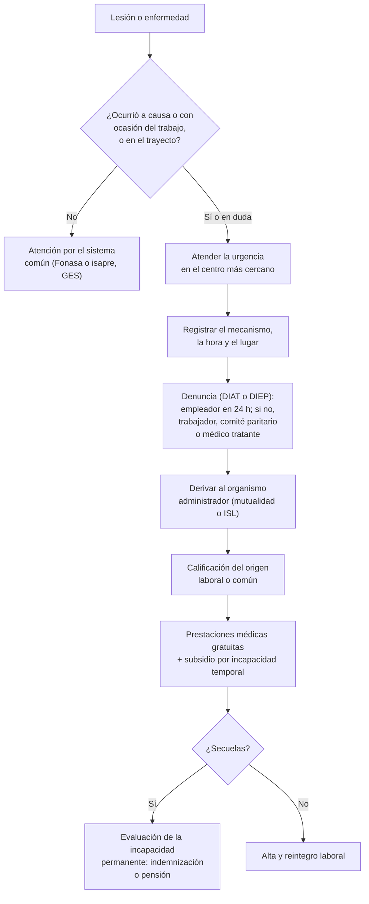

---
tags:
  - Traumatología
  - Frecuente en sala
---

# Accidentes del trabajo y enfermedades profesionales (Ley 16.744)

**Subespecialidad**
Medicina del trabajo · Traumatología · Salud pública

**Guías principales**
Ley 16.744 (1968): seguro social contra riesgos de accidentes del trabajo y enfermedades profesionales · Instrucciones de la Superintendencia de Seguridad Social (SUSESO)

**Otras fuentes**
Informe anual de seguridad y salud en el trabajo 2024 (SUSESO, 2025) · Instituto de Seguridad Laboral (ISL)

**GES**
No aplica: las lesiones y enfermedades laborales se cubren por el seguro de la **Ley 16.744**, no por el GES.

**EUNACOM**
4.02.3.001 Accidentes del trabajo (conocimiento general) · Salud pública: 6.02.3.001 Accidentes del trabajo

**Revisado**
Octubre 2026

!!! abstract "Resumen en 60 segundos"
    - **Ley 16.744**: seguro social **obligatorio** contra los accidentes del trabajo y las enfermedades profesionales.
        - Lo financia el **empleador** (cotización básica + adicional según el riesgo).
        - Lo administran las **mutualidades** (ACHS, Mutual de Seguridad, IST) y el **ISL**.
        - Lo fiscaliza la **SUSESO**.
    - **Accidente del trabajo**: toda lesión que una persona sufra **a causa o con ocasión del trabajo** y que le produzca incapacidad o muerte.
        - Incluye el **accidente de trayecto** (ida o regreso directo entre la casa y el trabajo, o entre dos trabajos).
    - **Enfermedad profesional**: causada de manera **directa** por el ejercicio de la profesión o el trabajo, y que produce incapacidad o muerte.
    - **Denuncia (DIAT o DIEP)**:
        - La hace el **empleador** de inmediato (plazo de **24 h**).
        - Si no la hace, pueden hacerla el **trabajador**, sus derechohabientes, el **comité paritario** o el **médico tratante**, o cualquier persona que conozca los hechos.
        - Una denuncia tardía **no quita** los beneficios.
    - **Prestaciones**:
        - **Médicas**: gratuitas, hasta la curación o mientras duren las secuelas.
        - **Económicas**: **subsidio** por la incapacidad temporal, **indemnización** o **pensión** por la incapacidad permanente, y pensiones de sobrevivencia.
    - **Rol del médico**:
        - Preguntar **siempre** por el mecanismo y si ocurrió en el trabajo o el trayecto, y **registrarlo**.
        - Atender la urgencia y **derivar al organismo administrador** con la denuncia.
    - **Chile 2024 (SUSESO)**:
        - **7,25 millones** de personas protegidas.
        - **Tasa de accidentabilidad de 2,5 por 100** trabajadores (mutualidades); la más alta en la **industria manufacturera** (3,5).
        - **154 muertes** por accidentes del trabajo y **133** de trayecto.

## Definición

- **Accidente del trabajo** (Ley 16.744, art. 5): toda lesión que una persona sufra **a causa o con ocasión** del trabajo y que le produzca **incapacidad o muerte**.
    - **A causa**: relación directa con las labores.
    - **Con ocasión**: relación indirecta (por ejemplo, durante la colación en el lugar de trabajo).
    - También son accidentes del trabajo:
        - Los ocurridos en el **trayecto directo**, de ida o regreso, entre la **habitación y el lugar de trabajo**, y entre **dos lugares de trabajo**.
        - Los sufridos por los dirigentes sindicales en el cumplimiento de su cometido.
- **Accidente de trayecto**: debe acreditarse con un **parte de Carabineros** u otro medio de prueba igualmente fehaciente.
- **No son accidentes del trabajo**: los debidos a una **fuerza mayor extraña** que no tenga relación con el trabajo, y los producidos **intencionalmente** por la víctima.
- **Enfermedad profesional** (art. 7): la causada de una manera **directa** por el ejercicio de la profesión o el trabajo que realiza una persona y que le produzca incapacidad o muerte. El reglamento enumera los agentes y las enfermedades; otras pueden calificarse caso a caso.
- **Organismos administradores**:
    - **Mutualidades de empleadores**: Asociación Chilena de Seguridad (ACHS), Mutual de Seguridad de la Cámara Chilena de la Construcción, Instituto de Seguridad del Trabajo (IST).
    - **Instituto de Seguridad Laboral (ISL)**: el organismo público, para los empleadores no adheridos a una mutualidad.
    - **Empresas con administración delegada** (grandes empresas autorizadas).
- **SUSESO**: Superintendencia de Seguridad Social, que fiscaliza el sistema y resuelve las apelaciones.

## Epidemiología

### Mundial

- Los accidentes y las enfermedades del trabajo son una causa importante de muerte, discapacidad y pérdida de días de trabajo en el mundo. Afectan más a los trabajadores **informales**, migrantes y de sectores como la construcción, la agricultura, la pesca, la minería y la manufactura.
- Las enfermedades profesionales tienen un período de latencia variable y se subdiagnostican, porque no se pregunta por la exposición laboral.

### Chile

!!! chile "Datos nacionales (Informe anual de seguridad y salud en el trabajo 2024, SUSESO)"
    - **Personas trabajadoras protegidas** por el seguro de la Ley 16.744 (mutualidades e ISL): **7.252.538** en 2024. En 2015 eran 5,65 millones.
        - Desde **2019** se incorporaron los **trabajadores independientes** que emiten boletas de honorarios (Ley 21.133).
    - **Tasa de accidentabilidad** por accidentes del trabajo en las mutualidades: **2,5 por 100** personas protegidas en 2024 (3,0 en 2019).
        - Por actividad, la más alta es la **industria manufacturera (3,5)**, seguida de **agricultura y pesca (3,3)** y **transporte (3,1)**.
        - Construcción y comercio están en 2,8, servicios en 2,0 y electricidad, gas y agua en 1,1.
    - **Accidentes fatales** en 2024: **154** por accidentes del **trabajo** (95 % hombres) y **133** de **trayecto**.
    - **Enfermedades profesionales** calificadas en las mutualidades en 2024 (sin COVID-19): **9118**.
        - **Salud mental: 6536 (~ 72 %)**, la primera causa.
        - **Musculoesqueléticas: 1470 (~ 16 %)**.
        - Audiológicas 332, dermatológicas 273, respiratorias 223 y otras 284.

## Etiología y factores de riesgo

| Factor | Ejemplos |
|---|---|
| **Del trabajo** | Máquinas sin protección, trabajo en altura, manejo manual de cargas, vehículos, sustancias peligrosas, turnos prolongados y nocturnos, alta exigencia y bajo control (riesgo psicosocial) |
| **Del trabajador** | Inexperiencia, falta de capacitación, fatiga, consumo de alcohol o drogas, falta de uso de los elementos de protección personal |
| **De la organización** | Falta de un sistema de gestión preventiva, de un comité paritario y de un departamento de prevención de riesgos |
| **Del trayecto** | Accidentes de tránsito, caídas en la vía pública, asaltos |

**Enfermedades profesionales frecuentes**

| Grupo | Ejemplos |
|---|---|
| **Musculoesqueléticas** | Tendinopatías del hombro, epicondilitis, **síndrome del túnel carpiano**, tenosinovitis de De Quervain, lumbago por manejo de cargas |
| **Salud mental** (la primera causa en Chile) | Trastornos adaptativos, depresión y ansiedad asociados a factores psicosociales (acoso laboral, sobrecarga) |
| **Respiratorias** | **Silicosis** (minería), asbestosis y mesotelioma (asbesto), asma ocupacional, neumonitis por hipersensibilidad (ver [enfermedades intersticiales](../respiratorio/enfermedades-intersticiales-farmacos-y-neumoconiosis.md)) |
| **Hipoacusia** | **Hipoacusia sensorioneural inducida por ruido** |
| **Dermatológicas** | Dermatitis de contacto irritativa o alérgica |
| **Infecciosas** | Tuberculosis y hepatitis B en el personal de salud, brucelosis, hantavirus en los trabajadores rurales |
| **Intoxicaciones** | Plaguicidas, metales pesados (plomo, mercurio, arsénico), solventes |

## Fisiopatología

- El accidente es el resultado de una **cadena de factores** (condiciones inseguras, actos inseguros, falla de la organización). La prevención actúa sobre esa cadena.
- **Jerarquía de los controles de riesgo**, de mayor a menor efectividad: **eliminación** → sustitución → **controles de ingeniería** → controles administrativos → **elementos de protección personal**.
- La enfermedad profesional resulta de una **exposición crónica** a un agente (ruido, sílice, posturas forzadas, carga psíquica), con un período de latencia que puede ser muy largo (mesotelioma, silicosis).

*Figura 1. Ruta de un accidente del trabajo en Chile. Esquema propio basado en la Ley 16.744 y las instrucciones de la SUSESO.*

## Clasificación

**Según el tipo de evento**

| Tipo | Definición |
|---|---|
| **Accidente del trabajo** | A causa o con ocasión del trabajo |
| **Accidente de trayecto** | En el trayecto directo entre la casa y el trabajo, o entre dos trabajos |
| **Enfermedad profesional** | Causada directamente por el trabajo |
| **Accidente grave** (instrucciones de la SUSESO) | Por ejemplo, el que obliga a maniobras de reanimación o de rescate, produce amputaciones, ocurre por una caída de altura o compromete un número importante de trabajadores. Obliga a **suspender las faenas** afectadas y a avisar a la Inspección del Trabajo y a la SEREMI de Salud |
| **Accidente fatal** | Con la muerte del trabajador; igual obligación de suspender y avisar |

**Según las consecuencias** (incapacidad)

| Incapacidad | Prestación económica (Ley 16.744) |
|---|---|
| **Temporal** | **Subsidio** mientras dure la incapacidad (licencia médica tipo 5 o 6) |
| **Permanente** entre **15 % y < 40 %** | **Indemnización** global (pago único) |
| **Permanente** entre **40 % y < 70 %** | **Pensión de invalidez parcial** |
| **Permanente ≥ 70 %** | **Pensión de invalidez total** |
| **Gran invalidez** (requiere de terceros para los actos básicos) | Pensión con un suplemento |
| **Muerte** | **Pensiones de sobrevivencia** (cónyuge o conviviente civil, hijos) y cuota mortuoria |

## Clínica

- Lo clínico depende de la lesión: heridas de la mano, fracturas, esguinces, lumbago, quemaduras, TEC, politraumatismos, intoxicaciones.
- **Elementos de la historia que siempre hay que registrar**:
    - **Fecha, hora y lugar** del accidente.
    - **Mecanismo** detallado y la tarea que realizaba.
    - Si ocurrió **en el trabajo** o **en el trayecto** (y cuál).
    - **Empleador** y organismo administrador (mutualidad o ISL), si el paciente lo conoce.
    - Testigos y uso de los elementos de protección personal.
- **Enfermedad profesional**: buscar la **exposición laboral** en toda anamnesis ("¿En qué trabaja? ¿Desde cuándo? ¿A qué está expuesto?"). Preguntar si hay compañeros con síntomas similares y si los síntomas mejoran los fines de semana o las vacaciones.

## Diagnóstico

!!! guia "Puntos clave (Ley 16.744 y SUSESO)"
    - El empleador debe **denunciar de inmediato** todo accidente o enfermedad que pueda causar incapacidad o muerte (art. 76). La SUSESO fija un plazo de **24 horas** para la DIAT.
    - Si el empleador no la hace en ese plazo, la denuncia la deben hacer el **trabajador**, sus derechohabientes, el **comité paritario** o el **médico tratante**. **Cualquier persona** que conozca los hechos puede hacerla.
    - Una **denuncia fuera de plazo no priva** al trabajador de los beneficios de la Ley 16.744.
    - La **calificación del origen** (laboral o común) la hace el organismo administrador. Si se rechaza, el trabajador puede **reclamar ante la SUSESO**.
    - Formularios: **DIAT** (accidente) y **DIEP** (enfermedad profesional).

## Laboratorio

- Según la lesión o la enfermedad sospechada.
- **Alcoholemia** y drogas cuando lo indique el protocolo del accidente (por ejemplo, en los accidentes de tránsito o los graves).
- **Exposición a sustancias**: niveles de **plomo** en sangre, **arsénico** en orina, colinesterasas (organofosforados), carboxihemoglobina (CO).
- **Exposición a fluidos biológicos** (personal de salud): serología basal de VIH, VHB y VHC del trabajador y de la fuente.

## Imágenes

- Según la lesión: radiografías (fracturas), TC (TEC, politraumatizado), ecografía (lesiones tendinosas).
- **Enfermedades profesionales respiratorias**: radiografía de tórax según la **clasificación de la OIT** (neumoconiosis) y TC.
- **Audiometría** (hipoacusia por ruido), en el marco de los programas de vigilancia.

## Diagnóstico diferencial

| Situación | Calificación |
|---|---|
| Lesión durante la jornada, en el lugar de trabajo, por la tarea | **Accidente del trabajo** |
| Lesión durante la colación en el lugar de trabajo | Habitualmente **accidente del trabajo** ("con ocasión") |
| Accidente de tránsito en el **trayecto directo** al trabajo | **Accidente de trayecto** (acreditar con el parte de Carabineros u otro medio) |
| Accidente en un **desvío** por motivos personales | Puede **no** ser de trayecto (se interrumpe el trayecto directo) |
| Lesión **autoinfligida intencionalmente** | **No** es un accidente del trabajo |
| Enfermedad común agravada por el trabajo (lumbago degenerativo) | El organismo administrador califica el origen |
| Hipoacusia en un trabajador expuesto a ruido | **Enfermedad profesional** si la exposición lo explica |

## Tratamiento

**Rol del médico general**

1. **Atender la urgencia** en cualquier centro de salud. En una urgencia vital no se exige la denuncia previa: el trabajador puede atenderse en el centro más cercano y luego es trasladado al organismo administrador.
2. **Registrar** el mecanismo y el carácter laboral o de trayecto.
3. **Orientar** al paciente para que su empleador emita la **DIAT** o hacer la denuncia si el empleador no la hizo.
4. **Derivar** al organismo administrador (mutualidad o ISL) para el tratamiento y el seguimiento.
5. La atención de urgencia de un accidente del trabajo la paga el **organismo administrador**, no el paciente.

**Prestaciones de la Ley 16.744**

| Tipo | Contenido |
|---|---|
| **Médicas** (gratuitas) | Atención médica, quirúrgica y dental; hospitalización; medicamentos; prótesis y órtesis; **rehabilitación** física y profesional; traslados. Hasta la curación completa o mientras duren los síntomas de las secuelas |
| **Económicas** | **Subsidio** por la incapacidad temporal; **indemnización**; **pensiones** de invalidez y de sobrevivencia; cuota mortuoria |
| **Preventivas** | Asesoría a las empresas, capacitación, **vigilancia de la salud** de los trabajadores expuestos (ruido, sílice, plaguicidas) |

!!! dosis "Obligaciones preventivas en la empresa (resumen)"
    | Elemento | Comentario |
    |---|---|
    | **Comité paritario de higiene y seguridad** | Obligatorio en las empresas con **más de 25 trabajadores** |
    | **Departamento de prevención de riesgos** | Obligatorio en las empresas con **más de 100 trabajadores** |
    | **Reglamento interno** de higiene y seguridad | Obligatorio |
    | **Derecho a saber** | Informar a los trabajadores de los riesgos y de las medidas preventivas |
    | **Elementos de protección personal** | Gratuitos para el trabajador |
    | **Accidente grave o fatal** | Suspender las faenas y avisar a la Inspección del Trabajo y a la SEREMI de Salud |

!!! alarma "Errores que perjudican al trabajador"
    - No preguntar ni registrar si la lesión ocurrió en el trabajo o el trayecto.
    - Atender un accidente del trabajo como una enfermedad común: se pierden el subsidio y las prestaciones de la Ley 16.744.
    - No sospechar el origen laboral de una enfermedad crónica (hipoacusia, silicosis, túnel carpiano, salud mental).

## Complicaciones

- **Secuelas** con incapacidad permanente: amputaciones (mano), rigidez articular, dolor crónico, lesiones neurológicas.
- **Muerte**: sobre todo en el transporte, la construcción, la minería y la agricultura, y en los **accidentes de trayecto** (tránsito).
- **Consecuencias psicosociales**: pérdida del empleo, dependencia económica, trastornos de salud mental (estrés postraumático).
- **Rechazo de la cobertura** por una mala calificación: el trabajador puede reclamar ante la SUSESO.

## Pronóstico y seguimiento

- El organismo administrador hace el **seguimiento** hasta el **alta médica y laboral**.
- La **incapacidad permanente** la evalúa la **COMPIN** (para los afiliados al ISL) o la comisión médica de la mutualidad. Las discrepancias se reclaman ante la **Comisión Médica de Reclamos (COMERE)** y luego ante la SUSESO.
- La **reincorporación laboral** progresiva y la **reeducación profesional** forman parte de la rehabilitación.

## Perlas para el internado

!!! perla "Para recordar en la sala"
    - **Siempre preguntar**: "¿Esto le pasó en el trabajo o camino al trabajo?" y **registrarlo**.
    - **Accidente del trabajo**: lesión **a causa o con ocasión** del trabajo. **Trayecto**: ida o regreso **directo** entre la casa y el trabajo (o entre dos trabajos).
    - **DIAT** la hace el **empleador** en 24 h; si no, el **trabajador**, el **comité paritario** o el **médico tratante**. La denuncia tardía **no quita** los beneficios.
    - Prestaciones **médicas gratuitas** + **subsidio**; incapacidad permanente: **15–40 %** indemnización, **40–70 %** pensión parcial, **≥ 70 %** pensión total.
    - Lo administran las **mutualidades** (ACHS, Mutual, IST) y el **ISL**; lo fiscaliza la **SUSESO**.
    - En toda enfermedad crónica, preguntar por la **exposición laboral**.

## Preguntas de repaso

??? repaso "1. Trabajador de la construcción que consulta en el SAPU por una herida de la mano con una sierra durante su jornada. ¿Qué hace además de tratar la herida?"
    - **Registrar** que es un **accidente del trabajo** (mecanismo, hora, lugar, tarea).
    - Orientar al paciente para que su **empleador emita la DIAT** (plazo de 24 h). Si no la emite, la puede hacer el trabajador o el **médico tratante**.
    - **Derivar** al **organismo administrador** (mutualidad o ISL) para el tratamiento, el subsidio y el seguimiento, que son **gratuitos**.

??? repaso "2. Trabajadora atropellada mientras caminaba directamente desde su casa al trabajo. ¿Está cubierta por la Ley 16.744?"
    - **Sí**: es un **accidente de trayecto** (ida directa entre la habitación y el lugar de trabajo).
    - Debe acreditarse con un **parte de Carabineros** u otro medio de prueba fehaciente.
    - Tiene derecho a las prestaciones médicas y económicas de la ley.

??? repaso "3. Operario de 50 años de una fábrica metalúrgica con hipoacusia bilateral progresiva y una muesca en 4000 Hz en la audiometría. ¿Qué debe hacer el médico?"
    - Sospechar una **hipoacusia sensorioneural inducida por ruido**: posible **enfermedad profesional**.
    - Preguntar por la exposición y el uso de protección auditiva.
    - Hacer la **denuncia de enfermedad profesional (DIEP)** y derivar al **organismo administrador** para la calificación, la evaluación de la incapacidad y la vigilancia de sus compañeros expuestos.

??? repaso "4. Un trabajador queda con una incapacidad permanente de 50 % tras un accidente laboral. ¿Qué prestación económica le corresponde?"
    - **Pensión de invalidez parcial** (incapacidad entre **40 % y < 70 %**).
    - Con menos de 40 % (y ≥ 15 %) le correspondería una **indemnización**; con 70 % o más, una **pensión de invalidez total**.

??? repaso "5. ¿Quién financia, administra y fiscaliza el seguro de la Ley 16.744?"
    - **Financia**: el **empleador** (cotización básica más una adicional diferenciada según el riesgo de la actividad).
    - **Administran**: las **mutualidades** de empleadores (ACHS, Mutual de Seguridad, IST), el **ISL** y las empresas con administración delegada.
    - **Fiscaliza**: la **Superintendencia de Seguridad Social (SUSESO)**.

## Referencias

1. Ley 16.744. Establece normas sobre accidentes del trabajo y enfermedades profesionales. *Diario Oficial*, 1 de febrero de 1968. [bcn.cl](https://www.bcn.cl/leychile/navegar?idNorma=28650)
2. Superintendencia de Seguridad Social. Informe anual de seguridad y salud en el trabajo 2024 (estadísticas de accidentabilidad 2024). Santiago: SUSESO; 2025. [suseso.gob.cl](https://www.suseso.gob.cl/619/w3-article-755198.html)
3. Instituto de Seguridad Laboral. Denuncia individual de accidente del trabajo (DIAT): díptico informativo. [isl.gob.cl](https://descuigatos.isl.gob.cl/wp-content/uploads/2019/03/Diptico_DIAT_Instituto_de_Seguridad_Laboral.pdf)
4. Superintendencia de Seguridad Social. Seguro de la Ley 16.744: preguntas frecuentes. [suseso.gob.cl](https://www.suseso.gob.cl/)
