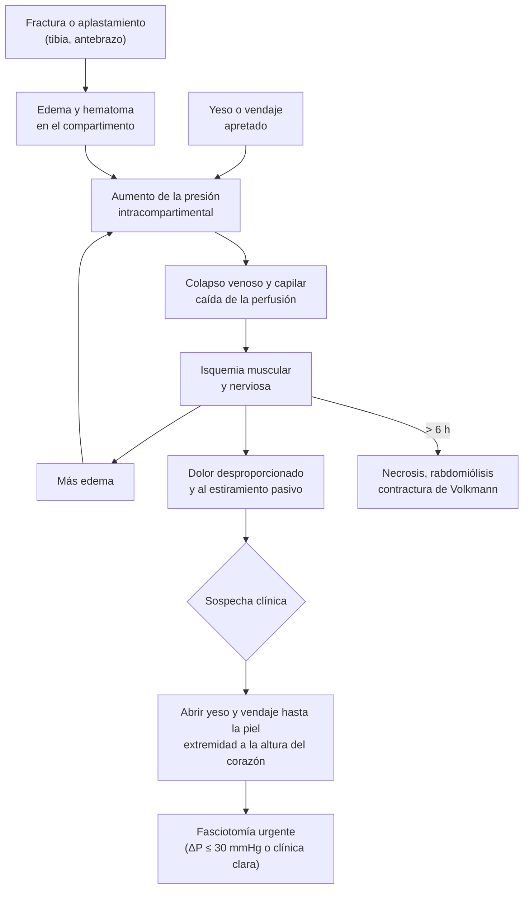

---
tags:
  - Traumatología
  - Urgencia
  - Frecuente en sala
---

# Complicaciones de los traumatismos (sistémicas y vasculares) y de la inmovilización con yeso

**Subespecialidad**
Traumatología y ortopedia · Urgencia

**Guías principales**
ACCP 2012: prevención del TEV en cirugía ortopédica (*Chest*) · Revisiones del síndrome compartimental agudo (*Int Orthop* 2019; *Medicine* 2019) y de la embolia grasa (*Malays Orthop J* 2021)

**Otras fuentes**
Ver [politraumatizado](../cirugia/trauma-y-shock/trauma-y-politraumatizado.md), [isquemia arterial aguda y trauma vascular](../cirugia/vascular/isquemia-arterial-aguda-y-trauma-vascular.md), [TEP](../respiratorio/tromboembolismo-pulmonar.md) y [osteomielitis](../infectologia/osteomielitis.md)

**GES**
No como problema propio. El **politraumatizado grave** es GES N.° 48.

**EUNACOM**
4.02.2.001 Complicaciones de los traumatismos: sistémicas y vasculares (específico, inicial, derivar) · 4.02.3.002 Complicaciones de la inmovilización con yeso (conocimiento general)

**Revisado**
Octubre 2026

!!! abstract "Resumen en 60 segundos"
    - **Síndrome compartimental agudo**: aumento de la presión en un compartimento osteofascial que produce isquemia. Es una **urgencia quirúrgica**.
        - Lo típico: fractura de **tibia** o antebrazo, o un **yeso apretado**.
        - Signo precoz: **dolor desproporcionado** que **aumenta con el estiramiento pasivo**.
        - Palidez, ausencia de pulso y parálisis son **tardíos**; **el pulso presente no lo descarta**.
        - Manejo: **abrir el yeso y el vendaje hasta la piel**, elevar a la altura del corazón y hacer una **fasciotomía** urgente (ΔP = PAD − presión del compartimento **≤ 30 mmHg**).
    - **Embolia grasa**: 24–72 h tras una fractura de **huesos largos** (fémur) o la pelvis.
        - Tríada: **hipoxemia**, **compromiso de conciencia** y **petequias** (axilas, cuello, conjuntivas).
        - Tratamiento de soporte. Se previene con la **fijación precoz** de las fracturas.
    - **TEV**: muy frecuente tras una fractura de cadera, pelvis o extremidad inferior y con la inmovilización. Usar **profilaxis** con HBPM (enoxaparina **40 mg SC al día**) según el riesgo.
    - **Lesión vascular**: buscar pulsos distales y el **índice tobillo-brazo** (ITB < 0,9 → angio-TC) en las luxaciones de **rodilla** y las fracturas supracondíleas. Los signos duros indican cirugía.
    - **Otras**:
        - **Rabdomiólisis**/síndrome de aplastamiento: hidratación precoz.
        - **Shock hemorrágico**: pelvis, fémur.
        - **Infección**: fracturas expuestas; dar antibióticos y la profilaxis del **tétanos**.
    - **Yeso**: puede causar compresión (síndrome compartimental, **úlceras por presión**, lesión del **nervio peroneo**), TEV, rigidez y atrofia.
        - Indicar **control a las 24 h**, **elevar** la extremidad y **consultar de inmediato** si hay dolor que aumenta, frialdad, cianosis o hormigueo.

## Definición

- **Complicaciones sistémicas**: afectan al organismo completo tras un traumatismo musculoesquelético: shock hemorrágico, embolia grasa, tromboembolismo venoso (TEV), rabdomiólisis, síndrome de respuesta inflamatoria y falla multiorgánica, infección (sepsis, tétanos).
- **Complicaciones vasculares**: lesión arterial (sección, trombosis por lesión de la íntima, compresión) o venosa que produce hemorragia o isquemia distal.
- **Complicaciones locales**: síndrome compartimental, lesión nerviosa, infección (osteomielitis), alteraciones de la consolidación (retardo, pseudoartrosis, consolidación viciosa), necrosis avascular, rigidez articular, síndrome de dolor regional complejo.
- **Síndrome compartimental agudo**: aumento de la presión dentro de un compartimento osteofascial cerrado que reduce la perfusión de los tejidos y produce isquemia muscular y nerviosa.
- **Embolia grasa**: paso de glóbulos de grasa a la circulación. El **síndrome de embolia grasa** es su expresión clínica (respiratoria, neurológica y cutánea).

## Epidemiología

### Mundial

- **Síndrome compartimental**:
    - Más frecuente en la **pierna** (fracturas de la **diáfisis y meseta tibial**), seguida del antebrazo, el muslo, el pie y la mano.
    - Las fracturas proximales de tibia de alta energía son las de mayor riesgo (Guo 2019).
    - Más frecuente en **hombres jóvenes** (gran masa muscular, traumatismos de alta energía).
- **Embolia grasa**: los émbolos de grasa son casi universales tras una fractura de huesos largos, pero el **síndrome clínico** es poco frecuente. En una serie de 10 años de un centro de trauma estadounidense fue de **0,9 %**, con una mortalidad de **7 %** (Bulger 1997, citado por Timon 2021).
- **TEV**: sin profilaxis, la trombosis venosa tras la cirugía de cadera es muy frecuente. Por eso la **profilaxis farmacológica** es estándar en la cirugía ortopédica mayor (ACCP 2012).

### Chile

!!! chile "Datos nacionales"
    - El **politraumatizado grave** (GES N.° 48) y el **TEC moderado o grave** (GES N.° 49) tienen garantía de atención en el servicio de urgencia y de traslado a un centro con capacidad resolutiva.
    - Los **accidentes de tránsito** y del **trabajo** son causas importantes de fracturas de alta energía en adultos jóvenes. Las del trabajo los cubre la **Ley 16.744**.
    - **GES N.° 36** (ayudas técnicas en ≥ 65 años): bastón, andador y silla de ruedas para el adulto mayor tras una fractura (ver [fractura de cadera](../geriatria/caidas-hipotension-ortostatica-y-fractura-de-cadera.md)).

## Etiología y factores de riesgo

| Complicación | Factores de riesgo |
|---|---|
| **Síndrome compartimental** | Fractura de **tibia** (diáfisis, meseta), antebrazo (radio y cúbito, supracondílea en el niño); **aplastamiento**; **yeso o vendaje apretado**; reperfusión tras isquemia; quemaduras circunferenciales; anticoagulación; posición prolongada (intoxicación, coma); ejercicio intenso |
| **Embolia grasa** | Fractura de **fémur** o de **varios huesos largos**, pelvis; enclavado endomedular; artroplastía; retraso en la fijación |
| **TEV** | Fractura de **cadera**, pelvis, extremidad inferior; **inmovilización** (yeso, reposo en cama); cirugía mayor; edad; obesidad; cáncer; TEV previo; anticonceptivos |
| **Lesión arterial** | **Luxación de rodilla** (arteria poplítea); fractura **supracondílea del húmero** (arteria braquial); fractura-luxación del codo; heridas penetrantes; fracturas de alta energía |
| **Rabdomiólisis y aplastamiento** | Atrapamiento prolongado (derrumbes, terremotos), isquemia prolongada, inmovilidad en el suelo (adulto mayor) |
| **Complicaciones del yeso** | Yeso **circular** sobre una extremidad **edematosa**; acolchado insuficiente; prominencias óseas (talón, maléolos, cabeza del peroné); pacientes que no comunican el dolor (niños, compromiso de conciencia, neuropatía diabética) |

## Fisiopatología

- **Síndrome compartimental**:
    1. Aumenta el contenido del compartimento (edema, hematoma) o se reduce su volumen (yeso, vendaje).
    2. Sube la presión.
    3. Cae la perfusión capilar: la presión venosa supera a la de perfusión.
    4. Se produce isquemia del músculo y del nervio, con más edema (círculo vicioso).
    - Tras **~ 6 horas** de isquemia aparece la necrosis muscular irreversible.
    - Secuela: la **contractura isquémica de Volkmann** (antebrazo en flexión, mano en garra).
- **Embolia grasa**: hay dos mecanismos.
    - **Mecánico**: glóbulos de grasa de la médula ósea entran a las venas y obstruyen los capilares pulmonares (y sistémicos, a través de shunts o de un foramen oval permeable).
    - **Bioquímico**: la lipasa libera ácidos grasos libres tóxicos para el endotelio, lo que produce un daño pulmonar tipo SDRA.
- **TEV**: la **tríada de Virchow** (estasia por inmovilidad, daño endotelial por el trauma y la cirugía, hipercoagulabilidad).

*Figura 1. Fisiopatología y manejo del síndrome compartimental agudo. Esquema propio.*

## Clasificación

| Momento | Sistémicas | Locales y vasculares |
|---|---|---|
| **Inmediatas** (horas) | **Shock hemorrágico** (pelvis, fémur: hasta 1,5–2 L) | **Lesión arterial**, lesión nerviosa, lesión de vísceras (vejiga, uretra en la pelvis) |
| **Precoces** (días) | **Embolia grasa** (24–72 h), **TEV**, rabdomiólisis, SDRA, falla multiorgánica, **infección** (tétanos, gangrena gaseosa), neumonía | **Síndrome compartimental**, infección de la herida, necrosis cutánea, flictenas |
| **Tardías** (semanas a meses) | Úlceras por presión, desacondicionamiento | **Retardo de consolidación** y **pseudoartrosis**, **consolidación viciosa**, **osteomielitis**, **necrosis avascular** (cabeza femoral, escafoides, astrágalo), **rigidez**, artrosis postraumática, **síndrome de dolor regional complejo**, miositis osificante |

## Clínica

**Síndrome compartimental**

- **Dolor desproporcionado** a la lesión, que no cede con analgesia habitual (aumento de la demanda de analgesia).
- **Dolor al estiramiento pasivo** de los músculos del compartimento (ej.: extender los dedos del pie para el compartimento posterior). Es muy específico (97 %) pero poco sensible (19 %) (McMillan 2019).
- Compartimento **tenso**, "leñoso" a la palpación.
- **Parestesias** (signo precoz de isquemia nerviosa): en la pierna, hipoestesia del **primer espacio interdigital** (nervio peroneo profundo, compartimento anterior).
- Signos **tardíos**: paresia, palidez y **ausencia de pulso**. El pulso distal suele estar **presente**, porque la presión del compartimento rara vez supera la presión arterial sistólica.
- Las clásicas "5 P" (dolor, palidez, parestesias, parálisis, ausencia de pulso) son en su mayoría **tardías** y poco fiables (Guo 2019; McMillan 2019).

**Embolia grasa** (24–72 h)

- **Respiratoria**: disnea, taquipnea, **hipoxemia** (lo más precoz y frecuente), infiltrados bilaterales.
- **Neurológica**: confusión, agitación, compromiso de conciencia, convulsiones, déficit focal.
- **Cutánea**: **petequias** en la cabeza, el cuello, la parte anterior del tórax, las **axilas** y las **conjuntivas** (aparecen tarde y desaparecen en días).
- Otros: fiebre, taquicardia, trombocitopenia, anemia, grasa en la retina.

**Lesión arterial**

- **Signos duros**: hemorragia pulsátil, **hematoma expansivo**, soplo o frémito, **ausencia de pulsos distales**, isquemia distal (6 P). Indican cirugía.
- **Signos blandos**: hematoma estable, pulso disminuido, déficit neurológico vecino, lesión cerca de un trayecto vascular. Indican medir el **ITB** y hacer imágenes.

**TEV**: edema asimétrico, dolor de pantorrilla, disnea súbita, taquicardia, hipoxemia (ver [TEP](../respiratorio/tromboembolismo-pulmonar.md)).

## Diagnóstico

!!! guia "Puntos clave"
    - El síndrome compartimental es un **diagnóstico clínico**. La **medición de la presión** del compartimento se usa en los casos dudosos o en el paciente que no puede comunicarse (intubado, sedado, con TEC). Se considera diagnóstica una **ΔP (presión arterial diastólica − presión del compartimento) ≤ 30 mmHg** (McMillan 2019).
    - La embolia grasa es un **diagnóstico de exclusión** con criterios clínicos (Gurd y Wilson: mayores = insuficiencia respiratoria, compromiso neurológico no explicado por un TEC, petequias). No hay un examen confirmatorio (Timon 2021).
    - En toda fractura o luxación: **examen neurovascular distal** antes y después de cualquier maniobra (reducción, yeso, tracción) y **registrarlo**.

## Laboratorio

| Examen | Hallazgo |
|---|---|
| **CK** | Muy elevada en la rabdomiólisis y la necrosis del compartimento (> 5 veces el valor normal; > 5000 U/L, riesgo de LRA) |
| **Creatinina, potasio, calcio, fósforo** | LRA, **hiperkalemia** (riesgo de arritmia), hipocalcemia en la rabdomiólisis |
| **Orina** | Hemoglobinuria en la cinta (orina oscura) sin glóbulos rojos en el sedimento = **mioglobinuria** |
| **Gases arteriales** | **Hipoxemia** en la embolia grasa y el TEP |
| **Hemograma** | Anemia (sangrado), **trombocitopenia** en la embolia grasa |
| **Dímero D** | Poco útil tras un trauma o una cirugía (casi siempre elevado) |
| **Lactato** | Hipoperfusión, shock |

## Imágenes

| Examen | Uso |
|---|---|
| **Radiografía de tórax** | Embolia grasa: infiltrados bilaterales ("tormenta de nieve"), puede ser normal al inicio |
| **TC de tórax** | Opacidades en vidrio esmerilado; descartar TEP (**angio-TC**) |
| **RM cerebral** | Embolia grasa cerebral: múltiples lesiones puntiformes ("cielo estrellado") en la secuencia de difusión |
| **Eco-Doppler venoso** | TVP de las extremidades |
| **ITB y angio-TC** | Lesión arterial con signos blandos; **ITB < 0,9** tras una luxación de rodilla → angio-TC |
| **Radiografía de la fractura** | Retardo de consolidación, pseudoartrosis, consolidación viciosa, necrosis avascular |

## Diagnóstico diferencial

| Cuadro | Diferencia |
|---|---|
| Síndrome compartimental vs. **lesión arterial** | En la lesión arterial **faltan los pulsos** desde el inicio; en el compartimental el pulso suele estar presente y el compartimento está tenso |
| Síndrome compartimental vs. **lesión nerviosa** | La lesión nerviosa produce déficit inmediato, sin dolor creciente ni compartimento tenso |
| Síndrome compartimental vs. **TVP** | La TVP produce edema difuso de la pierna, sin dolor al estiramiento pasivo ni déficit sensitivo |
| Embolia grasa vs. **TEP** | El TEP es súbito, con angio-TC positivo; la embolia grasa tiene petequias y compromiso neurológico, y aparece a las 24–72 h |
| Embolia grasa vs. **contusión pulmonar** | La contusión es inmediata y localizada, en relación con el impacto |
| Embolia grasa vs. **TEC** | El TEC da compromiso de conciencia desde el inicio y tiene hallazgos en la TC |
| Dolor bajo el yeso vs. **úlcera por presión** | La úlcera produce un dolor localizado sobre una prominencia ósea, ardor y mal olor o mancha en el yeso |

## Tratamiento

**Síndrome compartimental**

1. **Abrir el yeso** (bivalvar) y el **vendaje** hasta la piel. Esto reduce la presión de forma importante.
2. Poner la extremidad a la **altura del corazón**. **No elevarla**, porque disminuye la perfusión arterial.
3. Corregir la **hipotensión** (oxigenación y perfusión), suspender la compresión y evitar los bloqueos regionales que enmascaran el dolor.
4. Si no mejora o la clínica es clara: **fasciotomía urgente** de **todos** los compartimentos afectados (en la pierna, **4 compartimentos**). La herida se deja abierta y se cierra en un segundo tiempo.
5. Vigilar la **rabdomiólisis** (CK, potasio, creatinina) y la función renal.

**Embolia grasa**

- **Soporte**: oxígeno, ventilación mecánica protectora si hay SDRA, manejo de la hemodinamia.
- **Prevención**: **inmovilización precoz** de las fracturas y **fijación precoz** (en las primeras 24 h) de las fracturas de fémur en los pacientes estables.
- Los **corticoides** no tienen un beneficio demostrado como tratamiento de rutina.

**Lesión arterial**: ver [trauma vascular](../cirugia/vascular/isquemia-arterial-aguda-y-trauma-vascular.md). Reducir la luxación o alinear la fractura, revisar los pulsos y derivar de inmediato a cirugía vascular si hay signos duros (tiempo de isquemia caliente **< 6 h**).

**TEV**: ver [TEP](../respiratorio/tromboembolismo-pulmonar.md).

!!! dosis "Profilaxis y tratamientos habituales en adultos"
    | Fármaco o medida | Dosis | Comentario |
    |---|---|---|
    | **Enoxaparina** (profilaxis TEV) | **40 mg SC cada 24 h** | Fractura de cadera, pelvis o fémur, cirugía ortopédica mayor. Ajustar si la TFG es < 30 mL/min (**20 mg/día**). En la fractura de cadera, hasta **35 días** (ACCP 2012) |
    | **Heparina no fraccionada** (profilaxis) | **5000 UI SC cada 8–12 h** | Alternativa en la ERC grave |
    | Profilaxis con un yeso de la extremidad inferior | HBPM según el riesgo individual | No hay una indicación universal; considerar si hay factores de riesgo de TEV |
    | **Rabdomiólisis** | **Suero fisiológico** para lograr una diuresis de **~ 200–300 mL/h** | Iniciar precozmente; vigilar la sobrecarga de volumen y el potasio (ver [rabdomiólisis](../neurologia/debilidad-miastenia-y-miopatias.md)) |
    | **Tétanos** (fracturas expuestas, heridas) | Vacuna dT ± inmunoglobulina antitetánica **250–500 UI IM** | Según la vacunación previa y el tipo de herida (ver [tétanos](../infectologia/tetanos.md)) |

**Cuidados del yeso** (instrucciones al alta)

- **Elevar** la extremidad (sobre el nivel del corazón) las primeras **48–72 h** para disminuir el edema.
- **Mover los dedos** de forma activa y frecuente.
- No mojar el yeso; no introducir objetos para rascarse.
- **Control a las 24–48 h** para revisar la circulación y ajustar el yeso.
- **Consultar de inmediato** si:
    - Hay dolor que aumenta o no cede.
    - Los dedos están **fríos**, **pálidos** o **cianóticos**, o muy edematosos.
    - Aparece **hormigueo**, adormecimiento o incapacidad para mover los dedos.
    - Hay mal olor, una mancha o secreción en el yeso, o fiebre.

!!! alarma "Urgencia"
    - **Dolor desproporcionado bajo un yeso**: abrir el yeso **de inmediato** hasta la piel y reevaluar en 30–60 minutos. Si no mejora, avisar al traumatólogo para una **fasciotomía**.
    - **Extremidad sin pulso** tras una fractura o una luxación: reducir y alinear, y derivar de inmediato a cirugía vascular.
    - **Hipoxemia y confusión** a las 24–72 h de una fractura de fémur: sospechar una **embolia grasa** o un **TEP**.

## Complicaciones

**Complicaciones de la inmovilización con yeso**

| Complicación | Causa | Prevención y manejo |
|---|---|---|
| **Síndrome compartimental** | Yeso circular sobre una extremidad que sigue edematizándose | Yeso **bivalvado** o **férula** (valva) en el trauma agudo; elevación; control precoz |
| **Úlceras por presión** | Prominencias óseas (talón, maléolos, olécranon) mal acolchadas | Buen acolchado; consultar si hay dolor localizado o mancha |
| **Lesión nerviosa por compresión** | **Nervio peroneo común** en la cabeza del peroné (pie caído), nervio cubital en el codo | Acolchar la cabeza del peroné; examen neurológico |
| **TEV** | Inmovilización de la extremidad inferior | Movilización precoz; HBPM según el riesgo |
| **Rigidez articular y atrofia muscular** | Inmovilización prolongada | Inmovilizar solo las articulaciones necesarias y por el tiempo justo; kinesiterapia |
| **Dermatitis, maceración, infección de la piel** | Humedad, sudor | Mantener el yeso seco |
| **Pérdida de la reducción** | Yeso suelto cuando baja el edema | Control radiológico a los 7–10 días |
| **Síndrome de dolor regional complejo** | Dolor, edema y cambios vasomotores tras el trauma y la inmovilización (muñeca, tobillo) | Movilización precoz y analgesia; derivar |
| **Quemadura térmica** | Reacción exotérmica del fraguado con agua muy caliente o yeso muy grueso | Agua tibia |

**Complicaciones tardías de las fracturas**

- **Retardo de consolidación**: la fractura no consolida en el tiempo esperado.
- **Pseudoartrosis**: sin consolidación tras **6–9 meses**, sin progresión. Factores: tabaco, infección, inestabilidad, mala vascularización (escafoides, tibia distal), diabetes, AINE prolongados.
- **Consolidación viciosa**: consolida en mala posición (angulación, rotación, acortamiento).
- **Necrosis avascular**: cabeza femoral (fractura del cuello femoral, luxación de cadera), **polo proximal del escafoides**, astrágalo.
- **Artrosis postraumática**: fracturas articulares con incongruencia.

## Pronóstico y seguimiento

- El **síndrome compartimental** tratado con fasciotomía precoz tiene un buen pronóstico funcional. El retraso deja una **contractura de Volkmann**, déficit neurológico, infección o amputación, y puede causar insuficiencia renal por rabdomiólisis.
- La **embolia grasa** suele ser autolimitada, con una mortalidad baja en las series clínicas (**~ 7 %** en Bulger 1997), aunque las formas fulminantes son graves.
- Seguimiento: control clínico y radiológico de la fractura, kinesiterapia, vigilancia de la consolidación y de las secuelas.

## Perlas para el internado

!!! perla "Para recordar en la sala"
    - **El dolor que no calza con la lesión es síndrome compartimental hasta demostrar lo contrario**. **El pulso presente no lo descarta**.
    - **Dolor bajo el yeso = abrir el yeso hasta la piel**, no subir los analgésicos.
    - En el síndrome compartimental, la extremidad va a la **altura del corazón**, **no elevada**.
    - **Embolia grasa**: fractura de fémur + 24–72 h + **hipoxemia, confusión y petequias** axilares o conjuntivales.
    - Luxación de **rodilla** = buscar lesión de la **arteria poplítea** (ITB) aunque los pulsos estén presentes.
    - Toda fractura: **examen neurovascular antes y después** de cualquier maniobra, y **registrarlo**.
    - **Yeso largo de pierna**: acolchar la **cabeza del peroné** (nervio peroneo común: pie caído).
    - Fractura de cadera o pelvis: **profilaxis de TEV**.

## Preguntas de repaso

??? repaso "1. Hombre de 25 años con una fractura de la diáfisis tibial inmovilizada con un yeso circular hace 6 horas. Consulta por dolor intenso que no cede con morfina y que aumenta al extender los dedos del pie. Tiene pulso pedio presente. ¿Qué tiene y qué hace?"
    - **Síndrome compartimental agudo** de la pierna: dolor desproporcionado y al estiramiento pasivo. El pulso presente **no lo descarta**.
    - **Abrir el yeso** (bivalvar) y el vendaje **hasta la piel**, dejar la pierna a la **altura del corazón** y reevaluar.
    - Avisar al traumatólogo. Si no mejora o la clínica es clara (o la **ΔP es ≤ 30 mmHg**), está indicada una **fasciotomía urgente** de los 4 compartimentos.

??? repaso "2. Paciente de 22 años con una fractura de la diáfisis femoral por un accidente de moto, en tracción esperando cirugía. A las 36 horas presenta disnea, saturación de 85 %, confusión y petequias en las axilas. ¿Cuál es el diagnóstico?"
    - **Síndrome de embolia grasa**: fractura de un hueso largo, 24–72 h, tríada de **hipoxemia**, **compromiso neurológico** y **petequias**.
    - Descartar un **TEP** (angio-TC) y un TEC.
    - Tratamiento de **soporte** (oxígeno, ventilación si es necesaria). La **fijación precoz** de la fractura de fémur disminuye su riesgo.

??? repaso "3. Joven con una luxación de rodilla reducida en el servicio de urgencia, con pulsos pedios palpables. ¿Puede darse de alta?"
    - **No**. La luxación de rodilla tiene un alto riesgo de **lesión de la arteria poplítea** (lesión de la íntima con trombosis tardía), incluso con pulsos presentes.
    - Medir el **ITB**: si es **< 0,9**, hacer una **angio-TC**. Hospitalizar y vigilar los pulsos de forma seriada.

??? repaso "4. ¿Qué instrucciones le da a un paciente al que le acaban de poner un yeso antebraquial por una fractura de muñeca?"
    - **Elevar** la mano sobre el nivel del corazón las primeras 48–72 h y **mover los dedos**.
    - Mantener el yeso seco y no introducir objetos.
    - **Control a las 24–48 h** y control radiológico a los 7–10 días.
    - **Consultar de inmediato** si hay dolor que aumenta, dedos fríos, pálidos o cianóticos, hormigueo, imposibilidad de mover los dedos, o mal olor o secreción.

??? repaso "5. Paciente con un yeso largo de pierna que al retirarlo no puede levantar la punta del pie y tiene hipoestesia del dorso del pie. ¿Qué pasó?"
    - Lesión por **compresión del nervio peroneo común** en la **cabeza del peroné** (pie caído).
    - Se previene acolchando bien esa zona. Requiere evaluación neurológica, una órtesis antiequino y kinesiterapia; la mayoría se recupera si la compresión fue breve.

??? repaso "6. Adulto mayor operado de una fractura de cadera. ¿Qué profilaxis de TEV indica y por cuánto tiempo?"
    - **HBPM**: **enoxaparina 40 mg SC cada 24 h** (20 mg si la TFG es < 30 mL/min), junto con la **movilización precoz**.
    - Duración: un mínimo de **10–14 días** y, de preferencia, hasta **35 días** (ACCP 2012).

## Referencias

1. McMillan TE, Gardner WT, Schmidt AH, Johnstone AJ. Diagnosing acute compartment syndrome—where have we got to? *Int Orthop.* 2019;43(11):2429–2435. doi:[10.1007/s00264-019-04386-y](https://doi.org/10.1007/s00264-019-04386-y)
2. Guo J, Yin Y, Jin L, et al. Acute compartment syndrome: cause, diagnosis, and new viewpoint. *Medicine (Baltimore).* 2019;98(27):e16260. doi:[10.1097/MD.0000000000016260](https://doi.org/10.1097/MD.0000000000016260)
3. Timon C, Keady C, Murphy CG. Fat embolism syndrome – a qualitative review of its incidence, presentation, pathogenesis and management. *Malays Orthop J.* 2021;15(1):1–11. doi:[10.5704/MOJ.2103.001](https://doi.org/10.5704/MOJ.2103.001)
4. Falck-Ytter Y, Francis CW, Johanson NA, et al. Prevention of VTE in orthopedic surgery patients: Antithrombotic Therapy and Prevention of Thrombosis, 9th ed: American College of Chest Physicians Evidence-Based Clinical Practice Guidelines. *Chest.* 2012;141(2 Suppl):e278S–e325S. doi:[10.1378/chest.11-2404](https://doi.org/10.1378/chest.11-2404)
5. Superintendencia de Salud. Garantías Explícitas en Salud (GES): politraumatizado grave y ayudas técnicas. [superdesalud.gob.cl](https://www.superdesalud.gob.cl/)
