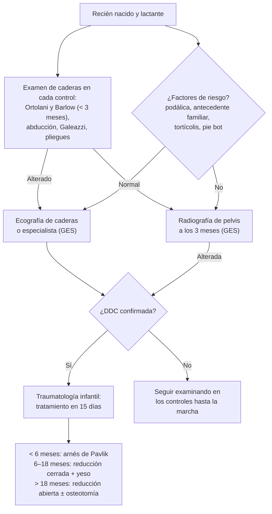

---
tags:
  - Traumatología
  - GES
---

# Displasia del desarrollo de la cadera (displasia luxante de caderas) y su pesquisa precoz

**Subespecialidad**
Ortopedia infantil · Pediatría

**Guías principales**
Academia Americana de Pediatría 2016: evaluación y derivación de la displasia de cadera en lactantes (*Pediatrics*) · Consenso intersocietario italiano 2020 para el diagnóstico precoz (*Ital J Pediatr*)

**Otras fuentes**
Revisión de la etiología, el diagnóstico y el manejo (*Cureus* 2023) · Garantía GES N.° 65 (Superintendencia de Salud)

**GES**
Sí: **displasia luxante de caderas** (N.° 65). **Radiografía de pelvis a los 3 meses** para todos los lactantes (en 30 días desde la indicación); antes de los 3 meses, **ecografía** o especialista si hay factores de riesgo o un examen alterado; confirmación en 30 días y tratamiento ortopédico en 15 días.

**EUNACOM**
4.02.1.002 Displasia congénita de cadera (específico, inicial, derivar) · 4.02.3.006 Prevención de displasia de cadera (diagnóstico precoz) · Pediatría: 2.01.1.092 Displasia de caderas (específico, inicial, derivar)

**Revisado**
Octubre 2026

!!! abstract "Resumen en 60 segundos"
    - **Displasia del desarrollo de la cadera (DDC)**: espectro que va desde un acetábulo poco profundo (displasia) hasta una cadera inestable o **luxada**.
    - **Factores de riesgo**:
        - **Sexo femenino**, **presentación podálica** y **antecedente familiar**.
        - Primer hijo y oligohidroamnios.
        - Otras malformaciones posturales: tortícolis, pie bot, metatarso aducto.
        - Envolver al lactante con las piernas juntas y estiradas.
    - **Examen físico**: en cada control del lactante, hasta que camine.
        - Recién nacido (hasta ~ 3 meses): **Ortolani** (reduce una cadera luxada, "clunk") y **Barlow** (luxa una cadera luxable).
        - Después de los 3 meses: **limitación de la abducción**, **Galeazzi** (rodillas a distinta altura), asimetría de pliegues.
        - Cuando camina: **cojera**, marcha de Trendelenburg.
    - **Pesquisa en Chile (GES N.° 65)**:
        - **Radiografía de pelvis a los 3 meses** para todos.
        - **Ecografía** antes de los 3 meses si hay factores de riesgo o un examen alterado.
    - **Radiografía**: líneas de **Hilgenreiner** y **Perkins**, **índice acetabular** aumentado (> 30° a los 3 meses), quiebre de la línea de **Shenton**, núcleo femoral fuera del cuadrante inferomedial.
    - **Tratamiento**:
        - **< 6 meses**: **arnés de Pavlik** (éxito de ~ 95 % en la displasia y ~ 80 % en la luxación).
        - **6–18 meses**: reducción cerrada y yeso pelvipédico.
        - **Mayores**: reducción abierta y osteotomías.
        - **Cuanto antes, mejor**.
    - **Prevención**: pesquisa precoz y **no envolver** al lactante con las piernas en extensión ("**pañal ancho**", piernas en flexión y abducción).

## Definición

- **Displasia del desarrollo de la cadera (DDC)**: alteración del desarrollo de la articulación coxofemoral en la que la cabeza femoral y el acetábulo no tienen una relación normal. Antes se llamaba "displasia congénita" o "luxación congénita". El término "del desarrollo" refleja que puede aparecer o empeorar **después del nacimiento**.
- **Espectro**:
    - **Displasia acetabular**: acetábulo poco profundo, con la cabeza en su lugar.
    - **Cadera inestable (luxable)**: la cabeza está reducida, pero sale con una maniobra (Barlow).
    - **Subluxación**: contacto parcial.
    - **Luxación**: la cabeza está fuera del acetábulo; **reductible** (Ortolani) o **irreductible**.
- **Luxación teratológica**: forma prenatal, rígida e irreductible, asociada a enfermedades neuromusculares o sindrómicas (artrogriposis, mielomeningocele).

## Epidemiología

### Mundial

- La **inestabilidad de la cadera** es frecuente en los recién nacidos (**1–1,5 %**). Cerca del **90 %** de las inestabilidades leves se resuelven espontáneamente en los primeros 2 meses (Bakarman 2023).
- La incidencia de las formas graves (luxación completa), sin un programa de diagnóstico precoz, era de **~ 0,13 %** de los recién nacidos (Agostiniani 2020).
- Es **mucho más frecuente en las niñas** (hasta 4–8 veces).
- Afecta más la **cadera izquierda**, por la posición intrauterina habitual con el muslo izquierdo apoyado contra el sacro materno.
- Es más frecuente en las poblaciones que **envuelven a los lactantes** con las piernas en extensión.
- La DDC no tratada es una causa importante de **artrosis precoz** de la cadera y de prótesis de cadera en los adultos jóvenes.

### Chile

!!! chile "Datos nacionales"
    - **GES N.° 65: displasia luxante de caderas** (Superintendencia de Salud):
        - **Radiografía de caderas a los 3 meses** para todos los lactantes, dentro de **30 días** desde la indicación.
        - En los **menores de 3 meses** con **factores de riesgo** o un **examen físico alterado**: **ecografía de caderas** o evaluación por un especialista.
        - En los **menores de 1 año** con una sospecha por la radiografía o la ecografía: **confirmación por un especialista** en **30 días**.
        - **Tratamiento ortopédico** en **15 días** desde la confirmación.
    - El examen de las caderas es parte de los **controles de salud del niño sano** en la APS.
    - Chile usa la **radiografía universal a los 3 meses** como pesquisa. En otros países se usan la ecografía universal o la selectiva, sin un consenso internacional (Agostiniani 2020).

## Etiología y factores de riesgo

| Factor | Comentario |
|---|---|
| **Sexo femenino** | La relaxina materna aumenta la laxitud ligamentosa |
| **Presentación podálica** | Uno de los factores más importantes; las caderas quedan en flexión con las rodillas extendidas |
| **Antecedente familiar** de primer grado | Componente genético |
| **Primer hijo**, oligohidroamnios, embarazo múltiple, macrosomía | Menos espacio intrauterino |
| **Otras malformaciones "por empaquetamiento"** | **Tortícolis congénita**, **pie bot**, **metatarso aducto** |
| **Envolver al lactante** con las piernas juntas y extendidas | Factor posnatal modificable |

- La mayoría de los niños con DDC que requieren tratamiento **no tienen factores de riesgo** aparte del sexo femenino (Bakarman 2023). Por eso el **examen físico es para todos**.

## Fisiopatología

- La cadera se desarrolla correctamente si la **cabeza femoral está centrada** en el acetábulo: la presión de la cabeza estimula el crecimiento del acetábulo y viceversa.
- Al nacer, la **laxitud ligamentosa** (hormonas maternas) y la posición intrauterina pueden dejar la cabeza inestable.
    - Si la cabeza sale del acetábulo, este no se profundiza y se rellena de tejido fibroadiposo (pulvinar).
    - El ligamento redondo se elonga y la cápsula se estrecha en "**reloj de arena**", mientras el psoas se interpone.
    - Con el tiempo, la luxación se vuelve **irreductible**.
- La **posición en flexión y abducción** (la del arnés de Pavlik o del lactante cargado a horcajadas) **centra la cabeza** y permite que el acetábulo se desarrolle. La posición en **extensión y aducción** (envolver con las piernas estiradas) favorece la luxación.
- La capacidad de remodelación del acetábulo es **máxima en los primeros meses** y disminuye con la edad. Por eso el **diagnóstico precoz** es clave.

*Figura 1. Pesquisa y manejo de la displasia del desarrollo de la cadera en Chile. Esquema propio basado en la garantía GES N.° 65.*

## Clasificación

| Grupo | Descripción |
|---|---|
| **Displasia acetabular** | Acetábulo poco profundo; índice acetabular aumentado; cabeza centrada |
| **Cadera inestable (luxable)** | Barlow positivo |
| **Subluxación** | Contacto parcial entre la cabeza y el acetábulo |
| **Luxación reductible** | Ortolani positivo |
| **Luxación irreductible** | No se reduce con el Ortolani; limitación de la abducción |
| **Teratológica** | Prenatal, asociada a síndromes o enfermedades neuromusculares |

- **Ecografía (método de Graf)**: mide el **ángulo alfa** (techo óseo; normal **≥ 60°**) y el ángulo beta (techo cartilaginoso). Clasifica las caderas en tipos I (normal) a IV (luxada).

## Clínica

**Recién nacido y lactante menor de 3 meses**

- **Maniobra de Ortolani**: con la cadera en flexión de 90°, se **abduce** y se empuja el trocánter mayor hacia adelante. Se siente un "**clunk**" cuando la cabeza **luxada se reduce**.
- **Maniobra de Barlow**: con la cadera en flexión y **aducción**, se empuja el muslo hacia atrás. La cabeza **sale** del acetábulo: cadera **luxable**.
- Un "**click**" (chasquido fino) sin desplazamiento suele ser benigno (ligamentos, tendones). Lo patológico es el "clunk" del desplazamiento.

<figure markdown>
{ loading=lazy }
<figcaption>Figura 2. Maniobras de Ortolani (A: reduce una cadera luxada con la abducción) y de Barlow (B: luxa una cadera inestable con la aducción y presión posterior). Bakarman K, Alsiddiky AM, Zamzam M, et al. <em>Cureus.</em> 2023. Licencia CC BY 3.0.</figcaption>
</figure>

**Lactante mayor de 3 meses** (Ortolani y Barlow se negativizan al aparecer la rigidez)

- **Limitación de la abducción** (el signo más confiable): abducción < 60° con las caderas en flexión, o asimetría entre ambos lados.
- **Signo de Galeazzi**: con el niño en decúbito supino y las caderas y rodillas flexionadas, una **rodilla queda más baja** (acortamiento del muslo). No sirve en las luxaciones **bilaterales**.
- **Asimetría de los pliegues** del muslo y glúteos (poco específica).

**Niño que camina**

- **Cojera** (marcha de **Trendelenburg**) en la luxación unilateral.
- **Marcha de pato** e **hiperlordosis lumbar** en la bilateral.
- Acortamiento de la extremidad, signo de Trendelenburg positivo.

## Diagnóstico

!!! guia "Puntos clave (AAP 2016; consenso italiano 2020; GES N.° 65)"
    - **Examen físico de las caderas en todos los controles** desde el nacimiento hasta que el niño camine.
    - **Ecografía** de caderas, la técnica de elección en los **menores de 4–6 meses** (cuando la cabeza aún es cartilaginosa). Hacerla después de las **4–6 semanas** de vida, porque antes muestra muchas inmadureces que se resuelven solas. Indicada si el examen está alterado o hay factores de riesgo (presentación podálica, antecedente familiar).
    - **Radiografía de pelvis** desde los **3–4 meses**, cuando aparece el núcleo de osificación de la cabeza femoral. En Chile se hace a **todos los lactantes a los 3 meses** (GES).
    - Un examen alterado o una imagen alterada deben **derivarse a traumatología infantil**.

## Laboratorio

- No se requieren exámenes de laboratorio. El diagnóstico es clínico y por imágenes.

## Imágenes

**Radiografía AP de pelvis** (desde los 3 meses)

| Referencia | Normal | Displasia o luxación |
|---|---|---|
| **Línea de Hilgenreiner** (horizontal por los cartílagos trirradiados) y **de Perkins** (vertical por el borde lateral del techo acetabular) | El núcleo de la cabeza (o el pico metafisario) está en el **cuadrante inferomedial** | La cabeza está en un cuadrante **superior o lateral** |
| **Índice acetabular** (ángulo entre la línea de Hilgenreiner y el techo acetabular) | **< 30°** a los 3 meses; disminuye con la edad | **Aumentado** (techo oblicuo) |
| **Línea de Shenton** (arco entre el cuello femoral y la rama superior del pubis) | **Continua** | **Interrumpida** |
| **Núcleo de osificación** de la cabeza | Simétrico | **Más pequeño** o tardío en el lado afectado |

<figure markdown>
{ loading=lazy }
<figcaption>Figura 3. Líneas y ángulos radiográficos de la displasia de cadera: línea de Hilgenreiner, línea de Perkins, índice acetabular y línea de Shenton. Bakarman K, Alsiddiky AM, Zamzam M, et al. <em>Cureus.</em> 2023. Licencia CC BY 3.0.</figcaption>
</figure>

**Ecografía** (método de **Graf**): ángulo **alfa ≥ 60°** = cadera madura. Es útil hasta los 4–6 meses y para seguir el tratamiento con el arnés.

## Diagnóstico diferencial

| Cuadro | Diferencia |
|---|---|
| **Click benigno** de la cadera | Chasquido sin desplazamiento; Ortolani y Barlow negativos |
| **Inmadurez fisiológica** en la ecografía | Lactante < 6 semanas; se normaliza en el control |
| **Luxación teratológica** | Rígida, prenatal, con otras malformaciones (artrogriposis, mielomeningocele) |
| **Coxa vara congénita** | Ángulo cervicodiafisario disminuido en la radiografía; cojera indolora |
| **Diferencia de longitud de las extremidades** por otras causas | Hemihipertrofia, deficiencia femoral focal proximal |
| **Artritis séptica de la cadera** del lactante | Fiebre, irritabilidad, pseudoparálisis; urgencia (puede luxar la cadera) |
| **Parálisis cerebral** | Luxación progresiva por la espasticidad, en un niño mayor |

## Tratamiento

| Edad | Tratamiento | Comentario |
|---|---|---|
| **Recién nacido con inestabilidad leve** | Observación y **ecografía de control** a las 4–6 semanas | La mayoría se estabiliza sola |
| **< 6 meses** | **Arnés de Pavlik**: mantiene las caderas en **flexión (~ 100°) y abducción** | Éxito de **~ 95 %** en la displasia o subluxación y de **~ 80 %** en la luxación (Bakarman 2023). Control ecográfico seriado; uso por varias semanas a meses |
| **6–18 meses** o fracaso del Pavlik | **Reducción cerrada** bajo anestesia (± tenotomía de los aductores) + **yeso pelvipédico** (en "posición humana") | Artrografía para confirmar la reducción |
| **> 18 meses** o reducción cerrada fallida | **Reducción abierta** ± **osteotomías** (pelvianas: Salter, Pemberton; femorales) | Peor pronóstico cuanto más tarde |
| **Displasia acetabular residual** (niño mayor, adolescente, adulto joven) | Osteotomías periacetabulares | Prevenir la artrosis precoz |

- **Lo que hace el médico general**:
    - Examinar las caderas en cada control y **pedir la radiografía a los 3 meses** (GES).
    - Pedir la **ecografía** precoz en los niños con factores de riesgo o un examen alterado.
    - **Derivar** con la sospecha.
    - Educar sobre la **posición correcta** de las caderas.
- El **doble o triple pañal** **no es un tratamiento** de la DDC. Se usaba como medida posicional, pero no reemplaza el estudio ni el tratamiento ortopédico.

!!! dosis "Prevención y educación a los padres"
    | Medida | Indicación |
    |---|---|
    | **No envolver** al lactante con las piernas juntas y estiradas | Dejar las caderas libres en **flexión y abducción** ("posición de rana") |
    | **Portabebés** ergonómicos | Que sostengan los muslos con las caderas en flexión y abducción (posición en "M") |
    | **Controles de salud** | Examen de las caderas en cada control y radiografía a los 3 meses (GES N.° 65) |
    | **Arnés de Pavlik** | Usarlo **las 24 horas** según lo indicado; no retirarlo sin indicación; revisar la piel y los pliegues |

!!! alarma "Derivar"
    - **Ortolani o Barlow positivo**, limitación de la abducción, Galeazzi positivo.
    - **Radiografía o ecografía alterada**.
    - **Niño que camina con cojera** o marcha de pato no explicada.
    - Lactante con **fiebre y dolor** a la movilización de la cadera: **artritis séptica** (urgencia).

## Complicaciones

- **Necrosis avascular** de la cabeza femoral: la complicación más temida del tratamiento, por una abducción forzada o una reducción a presión.
- **Parálisis del nervio femoral** con el arnés de Pavlik (flexión excesiva).
- **Displasia residual**, **reluxación**.
- Sin tratamiento:
    - **Cojera**, dismetría, dolor.
    - Hiperlordosis lumbar y lumbalgia.
    - **Artrosis precoz** de la cadera, que suele requerir una prótesis en un adulto joven.

## Pronóstico y seguimiento

- **Diagnóstico y tratamiento precoces** (en los primeros meses): la gran mayoría logra una cadera normal con el arnés de Pavlik.
- El diagnóstico tardío (después del año, o cuando el niño ya camina) requiere cirugía y tiene más secuelas.
- **Seguimiento** por traumatología infantil hasta la madurez esquelética, con radiografías periódicas (displasia residual).

## Perlas para el internado

!!! perla "Para recordar en la sala"
    - **Ortolani reduce** ("clunk" de entrada); **Barlow luxa**. Sirven hasta los ~ 3 meses.
    - Después de los 3 meses, el mejor signo es la **limitación de la abducción**.
    - **Galeazzi** (rodilla más baja) no sirve en la luxación bilateral.
    - **Niña + podálica + antecedente familiar** = alto riesgo: **ecografía precoz** (después de las 4–6 semanas).
    - **GES N.° 65**: **radiografía de pelvis a los 3 meses** para todos los lactantes.
    - **< 6 meses = arnés de Pavlik**. Cuanto más tarde se diagnostica, más invasivo es el tratamiento.
    - **No envolver** al lactante con las piernas estiradas: caderas en **flexión y abducción**.

## Preguntas de repaso

??? repaso "1. Recién nacida de término, de presentación podálica, con una madre que tuvo displasia de cadera. El examen de caderas es normal. ¿Qué indica?"
    - Tiene **factores de riesgo** importantes (sexo femenino, presentación podálica, antecedente familiar).
    - Aunque el examen sea normal, corresponde una **ecografía de caderas** precoz (idealmente después de las **4–6 semanas** de vida), cubierta por el **GES N.° 65** en los menores de 3 meses con factores de riesgo.
    - Seguir examinando las caderas en cada control y pedir la radiografía a los 3 meses si corresponde.

??? repaso "2. Al examinar a un recién nacido, con la cadera en flexión y aducción y una presión hacia atrás, siente que la cabeza femoral sale del acetábulo. ¿Qué maniobra es y qué significa?"
    - **Maniobra de Barlow positiva**: la cadera es **luxable** (inestable).
    - Derivar a traumatología infantil y pedir una ecografía. Muchas inestabilidades leves se resuelven solas, pero se controlan y pueden requerir un **arnés de Pavlik**.

??? repaso "3. Lactante de 5 meses con limitación de la abducción de la cadera izquierda y la rodilla izquierda más baja al flexionar ambas caderas. ¿Qué sospecha y qué hace?"
    - **Luxación de la cadera izquierda** (limitación de la abducción, **Galeazzi positivo**). A esta edad, Ortolani y Barlow suelen ser negativos.
    - **Radiografía de pelvis** (cabeza fuera del cuadrante inferomedial, índice acetabular aumentado, Shenton interrumpida) y **derivación** a traumatología infantil (GES N.° 65).
    - A los 5 meses aún puede tratarse con un **arnés de Pavlik**. Si falla, se hace una reducción cerrada.

??? repaso "4. ¿Qué evalúa la radiografía de pelvis a los 3 meses?"
    - La relación de la cabeza femoral con las líneas de **Hilgenreiner** y **Perkins**: debe estar en el **cuadrante inferomedial**.
    - El **índice acetabular** (normal **< 30°** a los 3 meses).
    - La continuidad de la **línea de Shenton**.
    - La simetría de los **núcleos de osificación**.

??? repaso "5. Niña de 2 años que cojea desde que empezó a caminar, sin dolor ni fiebre. ¿Qué diagnóstico no debe olvidar?"
    - **Displasia del desarrollo de la cadera no diagnosticada** (luxación unilateral): marcha de Trendelenburg, acortamiento, limitación de la abducción.
    - Pedir una **radiografía de pelvis** y derivar. A esta edad, el tratamiento es **quirúrgico** (reducción abierta ± osteotomía) y el pronóstico es peor que con el diagnóstico precoz.

??? repaso "6. ¿Qué recomendaciones de prevención le da a una madre en el control del recién nacido?"
    - **No envolver** al bebé con las piernas juntas y estiradas. Dejar las caderas libres en **flexión y abducción**.
    - Usar portabebés que mantengan las caderas en flexión y abducción (posición en "M").
    - Asistir a los **controles de salud** y hacer la **radiografía de caderas a los 3 meses** (GES N.° 65).

## Referencias

1. Shaw BA, Segal LS; Section on Orthopaedics. Evaluation and referral for developmental dysplasia of the hip in infants. *Pediatrics.* 2016;138(6):e20163107. doi:[10.1542/peds.2016-3107](https://doi.org/10.1542/peds.2016-3107)
2. Agostiniani R, Atti G, Bonforte S, et al. Recommendations for early diagnosis of developmental dysplasia of the hip (DDH): working group intersociety consensus document. *Ital J Pediatr.* 2020;46(1):150. doi:[10.1186/s13052-020-00908-2](https://doi.org/10.1186/s13052-020-00908-2)
3. Bakarman K, Alsiddiky AM, Zamzam M, et al. Developmental dysplasia of the hip (DDH): etiology, diagnosis, and management. *Cureus.* 2023;15(8):e43207. doi:[10.7759/cureus.43207](https://doi.org/10.7759/cureus.43207)
4. Superintendencia de Salud. Problema de salud 65: displasia luxante de caderas. [superdesalud.gob.cl](https://www.superdesalud.gob.cl/orientacion-en-salud/displasia-luxante-de-caderas/)
