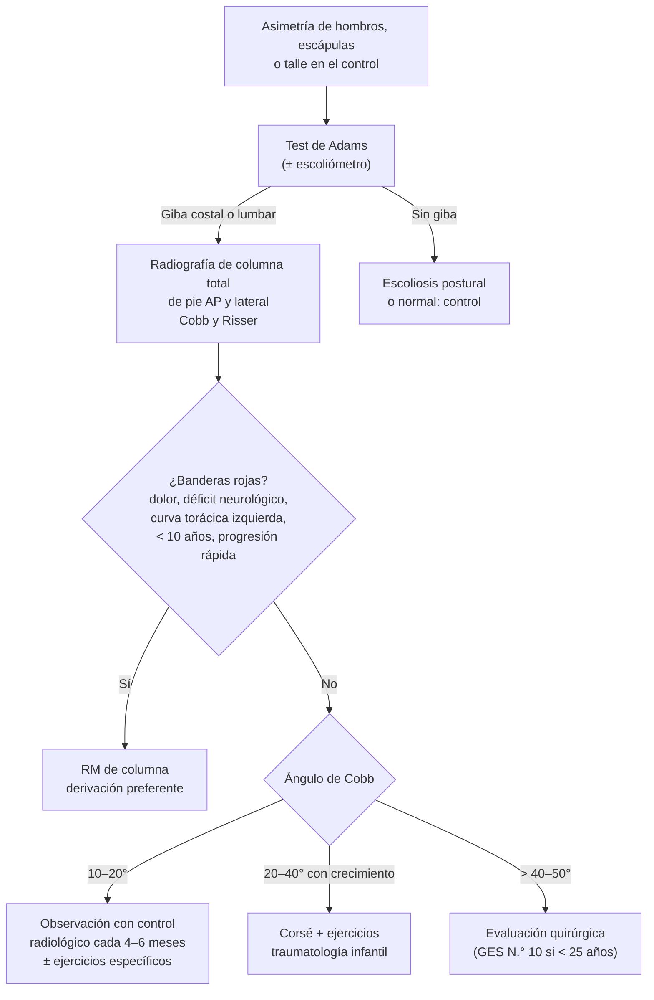

---
tags:
  - Traumatología
  - GES
---

# Escoliosis, pie plano y otras alteraciones de la columna y de los pies en el niño

**Subespecialidad**
Ortopedia infantil · Pediatría

**Guías principales**
SOSORT 2016: tratamiento ortopédico y de rehabilitación de la escoliosis idiopática (*Scoliosis Spinal Disord* 2018) · Ensayo BrAIST del corsé (*N Engl J Med* 2013) · MINSAL 2019: recomendaciones GES de tratamiento quirúrgico de la escoliosis

**Otras fuentes**
Revisión sistemática de las plantillas en el pie plano flexible infantil (*PLoS One* 2018) · Factores de riesgo del pie plano infantil (*Int J Environ Res Public Health* 2022) · Ver [displasia de cadera](displasia-del-desarrollo-de-cadera.md) y [lumbago](../reumatologia/lumbago-lumbociatica-y-cervicalgia.md)

**GES**
Sí: **tratamiento quirúrgico de la escoliosis en personas menores de 25 años** (N.° 10), con confirmación diagnóstica e indicación quirúrgica. El pie plano no tiene garantía GES.

**EUNACOM**
4.02.1.003 Escoliosis y deformidades vertebrales (sospecha, inicial, derivar) · 4.02.1.007 Pie plano (específico, inicial, derivar) · Pediatría: 2.01.1.091 Alteraciones de los pies (específico, inicial, derivar) y 2.01.1.094 Patología de columna

**Revisado**
Octubre 2026

!!! abstract "Resumen en 60 segundos"
    - **Escoliosis**: curvatura lateral de la columna con **rotación vertebral**; **ángulo de Cobb ≥ 10°** en la radiografía.
        - La más frecuente es la **idiopática del adolescente**: niñas, 10–16 años, prevalencia de **2–3 %**.
    - **Pesquisa en el examen**:
        - Asimetría de los hombros, las escápulas y el talle.
        - **Test de Adams**: inclinación hacia adelante → **giba costal**; medir con el escoliómetro.
        - Derivar con una **radiografía de columna total de pie** (AP y lateral).
    - **Banderas rojas** (escoliosis secundaria):
        - **Dolor** importante o nocturno.
        - **Déficit neurológico**.
        - Curva **torácica izquierda**.
        - Progresión rápida o inicio antes de los 10 años.
        - Manchas café con leche.
        - → **RM**.
    - **Tratamiento según el Cobb y la madurez (Risser)**:
        - **< 20–25°**: observación y ejercicios específicos.
        - **20–40°** en crecimiento: **corsé** (BrAIST: éxito de **72 %** frente a **48 %** con observación).
        - **> 45–50°**: **cirugía** (artrodesis). **GES N.° 10** en los menores de 25 años.
    - **Pie plano flexible** (el arco **reaparece** al ponerse en puntillas):
        - **Fisiológico** en los niños pequeños; mejora con el crecimiento.
        - Si es **asintomático**: no requiere tratamiento ni plantillas.
    - **Pie plano rígido o doloroso** (coalición tarsiana, astrágalo vertical, neurológico): **derivar**.
    - **Otras alteraciones de los pies del lactante**:
        - **Metatarso aducto** flexible: se corrige solo.
        - **Pie bot** (equino-varo-aducto rígido): **Ponseti** precoz.
        - **Pie calcáneo-valgo**: posicional, benigno.

## Definición

- **Escoliosis**: deformidad **tridimensional** de la columna, con una curvatura en el plano coronal de **≥ 10° de Cobb** y **rotación vertebral** (SOSORT 2016).
    - **Estructural**: rígida, con rotación; no se corrige con la inclinación.
    - **No estructural (postural)**: por dismetría de las extremidades, dolor o contractura; se corrige al tratar la causa y al sentarse.
- **Cifosis de Scheuermann**: hipercifosis torácica rígida del adolescente (> 45°) por acuñamiento de ≥ 3 vértebras consecutivas.
- **Espondilolisis**: defecto de la **pars interarticularis** (habitualmente L5). **Espondilolistesis**: deslizamiento de una vértebra sobre la inferior.
- **Pie plano**: disminución o ausencia del **arco longitudinal medial** con el pie en carga, habitualmente con valgo del talón.
    - **Flexible**: el arco reaparece sin carga, en puntillas o con la extensión del primer dedo (test de **Jack**).
    - **Rígido**: el arco no reaparece.
- **Metatarso aducto**: desviación medial del antepié, con el retropié normal.
- **Pie bot (pie equino-varo-aducto congénito)**: deformidad rígida con equino, varo del retropié, aducto y cavo.

## Epidemiología

### Mundial

- **Escoliosis**:
    - **80 %** son **idiopáticas**; el resto son congénitas, neuromusculares o sindrómicas (SOSORT 2016).
    - La **idiopática del adolescente** (Cobb > 10°) tiene una prevalencia de **2–3 %**.
    - Las curvas leves son igual de frecuentes en ambos sexos, pero las **progresivas** predominan claramente en las **niñas** (~ 7:1 en las curvas > 30°).
    - **~ 10 %** de los casos diagnosticados requieren un tratamiento conservador y una fracción menor, cirugía (SOSORT 2016).
- **Pie plano**:
    - **Fisiológico** en los **lactantes y preescolares**: el arco se desarrolla durante la primera década.
    - Se asocia a una **menor edad**, al **sexo masculino**, a la **obesidad** y a la laxitud ligamentosa (Xu 2022).
- **Pie bot**: ~ 1 por 1000 recién nacidos; más en los hombres; bilateral en la mitad.

### Chile

!!! chile "Datos nacionales"
    - **GES N.° 10: tratamiento quirúrgico de la escoliosis en personas menores de 25 años**, con confirmación diagnóstica e indicación quirúrgica.
        - Cubre las formas congénita, idiopática, neuromuscular y la cifoescoliosis.
        - El tratamiento debe iniciarse dentro de los plazos de la garantía, y el primer control se hace tras el alta.
    - Las **recomendaciones GES del MINSAL (2019)** sugieren la **cirugía** en los adolescentes con escoliosis idiopática de **40–44°** y madurez esquelética (recomendación condicional, certeza muy baja). También sugieren el **corsé** en las curvas de **20–40°** con crecimiento pendiente.
    - El examen de la columna y de los pies forma parte de los **controles de salud del niño y del adolescente** en la APS.

## Etiología y factores de riesgo

| Tipo de escoliosis | Causa | Clave |
|---|---|---|
| **Idiopática** (80 %) | Multifactorial (genética, crecimiento) | Infantil (< 3 años), juvenil (3–10 años), **del adolescente** (> 10 años, la más frecuente) |
| **Congénita** | Malformaciones vertebrales (hemivértebras, barras) | Asociada a malformaciones **renales y cardíacas** |
| **Neuromuscular** | Parálisis cerebral, distrofia muscular de Duchenne, atrofia muscular espinal, mielomeningocele | Curvas largas en "C", progresivas, compromiso respiratorio |
| **Sindrómica** | **Neurofibromatosis**, **Marfan**, Ehlers-Danlos | Manchas café con leche, hiperlaxitud |
| **Secundaria a lesiones** | **Tumores** (osteoma osteoide), **siringomielia**, Chiari, médula anclada | **Dolor**, curva **torácica izquierda**, déficit neurológico |

| Alteración del pie | Causa |
|---|---|
| **Pie plano flexible** | Fisiológico, laxitud ligamentosa, obesidad, tendón de Aquiles corto |
| **Pie plano rígido** | **Coalición tarsiana** (calcaneonavicular, astragalocalcánea), **astrágalo vertical congénito**, artritis, neuromuscular |
| **Metatarso aducto** | Posición intrauterina |
| **Pie bot** | Idiopático (multifactorial) o asociado a enfermedades neuromusculares (mielomeningocele, artrogriposis) |
| **Pie cavo** | Neurológico hasta demostrar lo contrario (**Charcot-Marie-Tooth**, ataxia de Friedreich, médula anclada) |

## Fisiopatología

- **Escoliosis idiopática**: la curva **progresa durante el crecimiento**, sobre todo en el **estirón puberal**.
    - El riesgo de progresión depende de la **magnitud** de la curva y del **crecimiento restante**: menor edad, premenarquia, **Risser 0–1** (madurez ósea de la cresta ilíaca).
    - Tras la madurez esquelética, las curvas de **> 30–50°** pueden seguir progresando en la adultez.
    - Las curvas torácicas grandes (> 70–90°) comprometen la **función pulmonar**.
- **Pie plano flexible**: el arco medial depende de los ligamentos, los músculos (tibial posterior) y la forma ósea. En los niños pequeños, la laxitud ligamentosa y la almohadilla grasa plantar hacen que el pie parezca plano. El arco se forma de manera espontánea hasta los ~ 10 años.

*Figura 1. Enfoque de la escoliosis en el niño y el adolescente. Esquema propio basado en SOSORT 2016 y en las recomendaciones GES del MINSAL.*

## Clasificación

**Escoliosis idiopática según la edad de inicio**

| Tipo | Edad | Características |
|---|---|---|
| **Infantil** | < 3 años | Más en los hombres; muchas se resuelven solas, otras progresan |
| **Juvenil** | 3–10 años | Alto riesgo de progresión; requiere RM |
| **Del adolescente** | > 10 años | La más frecuente; niñas; curva **torácica derecha** típica |

**Signo de Risser** (osificación de la apófisis de la cresta ilíaca): **0** (sin osificar, mucho crecimiento restante) a **5** (fusionada, crecimiento terminado).

**Pie plano**

| Tipo | Clínica | Conducta |
|---|---|---|
| **Flexible asintomático** | El arco reaparece en puntillas o con el test de Jack; sin dolor | **Tranquilizar**; no requiere tratamiento |
| **Flexible sintomático** | Dolor, fatiga, callosidades | Plantillas, elongación del tríceps sural; derivar si persiste |
| **Flexible con tendón de Aquiles corto** | Dorsiflexión limitada | Elongación; derivar |
| **Rígido** | El arco no reaparece; movilidad subastragalina limitada; dolor | **Derivar** (coalición tarsiana, astrágalo vertical) |

## Clínica

**Escoliosis**

- Habitualmente **indolora**. El motivo de consulta es estético (asimetría notada por los padres o en el colegio).
- **Signos**:
    - **Hombros** a distinta altura.
    - **Escápula prominente**.
    - **Asimetría del talle** (triángulo entre el brazo y el tronco).
    - Pelvis oblicua.
    - Desplazamiento lateral del tronco (la plomada desde C7 no cae en el pliegue interglúteo).
- **Test de Adams**: con el paciente inclinado hacia adelante, con las rodillas extendidas y los brazos colgando, se ve la **giba costal** (rotación vertebral). El **escoliómetro** la cuantifica: **≥ 5–7°** justifica una radiografía.
    - El test de Adams solo tiene un valor predictivo positivo bajo para el tamizaje escolar; se recomienda complementarlo con mediciones objetivas (SOSORT 2016).
- **Buscar siempre**:
    - Dismetría de las extremidades inferiores.
    - **Examen neurológico** (reflejos, incluidos los **abdominales**, fuerza, sensibilidad).
    - **Manchas café con leche** y neurofibromas.
    - Hiperlaxitud (Marfan).
    - **Pie cavo**.
    - Lesiones cutáneas lumbosacras (disrafia).

**Otras patologías de la columna del niño**

- **Cifosis de Scheuermann**: dorso curvo rígido del adolescente, que no se corrige al extenderse; puede doler.
- **Espondilolisis**: **lumbalgia** en un adolescente **deportista** (gimnasia, fútbol), que aumenta con la **hiperextensión**.
- **Lumbalgia en el niño**: es menos frecuente que en el adulto y tiene **más causas orgánicas** (espondilolisis, infección, tumor). Estudiar si es persistente, nocturna o con signos sistémicos.

**Pie plano**

- Arco medial ausente en carga, con **talón en valgo**.
- **Flexibilidad**: el arco **reaparece** al ponerse en **puntillas** (el talón pasa a varo) o con el **test de Jack** (extensión del primer dedo).
- **Pie plano rígido**: el arco no reaparece, la movilidad subastragalina está limitada y hay dolor en el adolescente (**coalición tarsiana**) o espasmo de los peroneos.

**Pie del lactante**

- **Metatarso aducto**: el antepié está desviado hacia medial ("pie en frijol"), con un borde lateral convexo y el talón normal. Si se corrige pasivamente, es **flexible**.
- **Pie bot**: equino (no hace dorsiflexión), varo del talón, aducto y cavo; **rígido** (no se corrige pasivamente).
- **Pie calcáneo-valgo**: dorso del pie apoyado contra la tibia por la posición intrauterina; flexible, se corrige solo.

## Diagnóstico

!!! guia "Puntos clave (SOSORT 2016)"
    - La escoliosis se confirma con un **ángulo de Cobb ≥ 10°** en la **radiografía de columna total de pie** (AP y lateral) y **rotación vertebral**.
    - El **signo de Risser** y el estado puberal (menarquia) estiman el crecimiento restante y el riesgo de progresión.
    - La **RM** está indicada si hay banderas rojas: dolor importante, déficit neurológico, **curva torácica izquierda**, inicio juvenil o infantil, progresión rápida o una curva atípica.
    - El **pie plano flexible asintomático** no requiere radiografías. Se estudia con imágenes (radiografía con carga, TC) el pie rígido o doloroso.

## Laboratorio

- No se requieren exámenes de laboratorio.
- **Pruebas de función pulmonar** en las escoliosis torácicas graves y neuromusculares (evaluación prequirúrgica).
- **Estudio genético o neurológico** en las escoliosis sindrómicas o neuromusculares.

## Imágenes

| Examen | Indicación |
|---|---|
| **Radiografía de columna total de pie AP y lateral** | Escoliosis: ángulo de Cobb, signo de Risser, cifosis, espondilolistesis |
| **RM de columna** | Banderas rojas, escoliosis juvenil o infantil, congénita (malformaciones medulares asociadas) |
| **TC** | Malformaciones vertebrales congénitas, espondilolisis, coalición tarsiana |
| **Ecografía renal y ecocardiograma** | Escoliosis congénita (malformaciones asociadas) |
| **Radiografía de pies con carga** | Pie plano rígido o doloroso, pie cavo, pie bot en el seguimiento |

- Las radiografías seriadas de la escoliosis exponen a radiación. Se espacian según el riesgo y se usan técnicas de baja dosis cuando estén disponibles.

## Diagnóstico diferencial

| Cuadro | Diferencia |
|---|---|
| **Escoliosis postural** | Se corrige al inclinarse (sin giba) o al compensar una dismetría con un alza |
| **Dismetría de las extremidades** | La curva desaparece al sentarse o con un alza |
| **Escoliosis antiálgica** | Dolor agudo (hernia discal, osteoma osteoide, infección); curva sin rotación |
| **Escoliosis secundaria** a un tumor o siringomielia | Dolor nocturno, curva torácica izquierda, déficit neurológico |
| **Cifosis postural** vs. **Scheuermann** | La postural se corrige al extenderse; la de Scheuermann es rígida |
| **Pie plano flexible** vs. **rígido** | El flexible recupera el arco en puntillas |
| **Metatarso aducto** vs. **pie bot** | El metatarso aducto tiene el talón y el tobillo normales y es flexible |

## Tratamiento

**Escoliosis idiopática del adolescente** (SOSORT 2016; BrAIST 2013)

| Situación | Tratamiento |
|---|---|
| **Cobb 10–20°** | **Observación**: control clínico y radiológico cada 4–6 meses durante el crecimiento; **ejercicios específicos** para la escoliosis según el riesgo |
| **Cobb 20–40°** con crecimiento pendiente (Risser 0–2) | **Corsé** (12–23 horas al día según el tipo) + ejercicios. El corsé **reduce la progresión** de las curvas de alto riesgo hasta el umbral quirúrgico: éxito de **72 %** frente a **48 %** con observación, y **más horas de uso, más beneficio** (BrAIST) |
| **Cobb > 40–50°** o progresión pese al corsé | **Cirugía**: artrodesis vertebral posterior con instrumentación. **GES N.° 10** en los menores de 25 años |
| **Madurez esquelética** (Risser 4–5) con curva < 30° | Habitualmente sin tratamiento; control en la adultez si es mayor |

- El **deporte** se recomienda; no empeora la escoliosis.
- Las mochilas, la postura al sentarse y el uso de pantallas **no causan** escoliosis.
- **Lo que hace el médico general**: pesquisar en los controles, pedir la radiografía y **derivar** a traumatología infantil (ver la figura 1).

**Pie plano**

- **Flexible asintomático**: **no requiere tratamiento**.
    - **Tranquilizar** a los padres: es habitual y mejora con el crecimiento.
    - Fomentar la actividad física y caminar descalzo en superficies irregulares.
    - Controlar el **peso**.
    - Las **plantillas** no han demostrado cambiar la evolución del arco. La evidencia de su efectividad sigue siendo incierta (Dars 2018).
- **Flexible sintomático**: plantillas para el alivio del dolor, **elongación del tríceps sural**, calzado adecuado. Derivar si no mejora.
- **Rígido o doloroso**: **derivar** a traumatología infantil (coalición tarsiana: cirugía si es sintomática).

**Pie del lactante**

- **Metatarso aducto flexible**: observación; la mayoría se corrige sola en el primer año. Si es rígido o persiste: yesos seriados o derivar.
- **Pie bot**: **derivar precozmente** para el **método de Ponseti**:
    - **Yesos seriados** semanales.
    - **Tenotomía percutánea del tendón de Aquiles** en la mayoría.
    - **Órtesis de abducción** (botas con barra) por varios años para evitar la recidiva.
- **Pie calcáneo-valgo**: observación y ejercicios de elongación; se resuelve en semanas.

!!! dosis "Educación a los padres y al paciente"
    | Situación | Mensaje |
    |---|---|
    | **Escoliosis en observación** | Hacer controles con radiografía según la indicación, sobre todo durante el estirón; hacer deporte |
    | **Corsé** | Usarlo **las horas indicadas** (la efectividad depende del tiempo de uso); cuidar la piel |
    | **Pie plano flexible del preescolar** | Es normal; no necesita plantillas ni zapatos especiales |
    | **Pie bot en tratamiento** | Cumplir con los yesos y con la órtesis de abducción para evitar la recidiva |

!!! alarma "Derivar de forma preferente"
    - **Escoliosis con dolor importante o nocturno**, **déficit neurológico** o **curva torácica izquierda** (descartar un tumor, una siringomielia o una médula anclada).
    - Escoliosis en un niño **menor de 10 años** o con una progresión rápida.
    - **Pie cavo** progresivo (descartar una enfermedad neurológica).
    - **Pie plano rígido** o doloroso.
    - **Pie bot** (lo antes posible tras el nacimiento).

## Complicaciones

- **Escoliosis no tratada**:
    - Deformidad estética e impacto psicosocial.
    - **Progresión en la adultez** de las curvas > 30–50°.
    - Lumbalgia.
    - Si es grave (curvas torácicas > 70–90°), **compromiso respiratorio**.
- **Tratamiento de la escoliosis**:
    - Corsé: alteraciones de la piel e impacto psicológico.
    - Cirugía: infección, déficit neurológico, falla de la instrumentación, **reoperación**. El MINSAL estima un riesgo de reoperación de ~ 29 % a 10–20 años.
- **Pie bot**: **recidiva** si no se usa la órtesis.
- **Pie plano rígido**: dolor crónico, artrosis del tarso.

## Pronóstico y seguimiento

- La **escoliosis idiopática** detectada precozmente y tratada con corsé evita la cirugía en una proporción importante de los casos. Las curvas pequeñas en pacientes maduros tienen un buen pronóstico.
- El **pie plano flexible infantil** se resuelve o queda asintomático en la gran mayoría.
- El **pie bot** tratado con el método de Ponseti logra pies funcionales en la gran mayoría.
- Seguimiento en traumatología infantil hasta el término del crecimiento.

## Perlas para el internado

!!! perla "Para recordar en la sala"
    - **Escoliosis = Cobb ≥ 10° + rotación**. El **test de Adams** busca la giba costal.
    - Escoliosis **dolorosa**, **torácica izquierda** o con **déficit neurológico** = **RM** (puede ser secundaria).
    - **Corsé en las curvas de 20–40° con crecimiento pendiente**; cirugía si es > 45–50°. **GES N.° 10** en los menores de 25 años.
    - Las mochilas y la postura **no causan** escoliosis.
    - **Pie plano flexible asintomático** del niño = **normal**: no requiere plantillas.
    - **Pie plano rígido** o **pie cavo** = derivar (coalición tarsiana; Charcot-Marie-Tooth).
    - **Pie bot** = derivar al nacer para el **Ponseti**.

## Preguntas de repaso

??? repaso "1. Niña de 12 años, premenárquica, con un hombro derecho más alto. En el test de Adams tiene una giba costal derecha. ¿Qué hace?"
    - Sospecha de una **escoliosis idiopática del adolescente**.
    - Pedir una **radiografía de columna total de pie** (AP y lateral) para medir el **ángulo de Cobb** y el **signo de Risser**.
    - Hacer un examen neurológico y buscar banderas rojas.
    - Derivar a traumatología infantil. Está en una edad de **alto riesgo de progresión** (premenarquia, estirón puberal).

??? repaso "2. La radiografía muestra un Cobb de 28° y un Risser 0. ¿Cuál es el tratamiento?"
    - **Corsé** (más ejercicios específicos para la escoliosis), por la curva de 20–40° con mucho crecimiento restante.
    - El ensayo **BrAIST** mostró que el corsé reduce la progresión hasta el umbral quirúrgico, con más beneficio con más horas de uso.

??? repaso "3. Adolescente de 14 años con escoliosis, dolor dorsal nocturno que cede con AINE y una curva torácica izquierda. ¿Qué sospecha?"
    - **Escoliosis secundaria** (banderas rojas: **dolor**, sobre todo nocturno, y una **curva torácica izquierda**).
    - Considerar un **osteoma osteoide** vertebral (dolor nocturno que cede con AINE), un tumor o una siringomielia.
    - Pedir una **RM** (o TC) de columna y derivar de forma preferente.

??? repaso "4. Madre consulta porque su hijo de 3 años tiene los "pies planos". El arco aparece cuando se pone en puntillas, no tiene dolor y juega normalmente. ¿Qué le indica?"
    - **Pie plano flexible fisiológico**: el arco se forma durante la infancia.
    - **No requiere tratamiento** ni plantillas: la evidencia de su efectividad es incierta.
    - Tranquilizar, fomentar la actividad física y controlar el peso. Derivar solo si aparece dolor o rigidez.

??? repaso "5. Recién nacido con el pie en equino y varo, rígido, que no se corrige con la manipulación. ¿Qué es y qué hace?"
    - **Pie bot** (pie equino-varo-aducto congénito).
    - **Derivar precozmente** a traumatología infantil para el **método de Ponseti**: yesos seriados, tenotomía del tendón de Aquiles y órtesis de abducción.
    - Buscar otras alteraciones (examen de caderas, columna y examen neurológico).

## Referencias

1. Negrini S, Donzelli S, Aulisa AG, et al. 2016 SOSORT guidelines: orthopaedic and rehabilitation treatment of idiopathic scoliosis during growth. *Scoliosis Spinal Disord.* 2018;13:3. doi:[10.1186/s13013-017-0145-8](https://doi.org/10.1186/s13013-017-0145-8)
2. Weinstein SL, Dolan LA, Wright JG, Dobbs MB. Effects of bracing in adolescents with idiopathic scoliosis. *N Engl J Med.* 2013;369(16):1512–1521. doi:[10.1056/NEJMoa1307337](https://doi.org/10.1056/NEJMoa1307337)
3. Ministerio de Salud de Chile. Recomendaciones GRADE: tratamiento quirúrgico de escoliosis en personas menores de 25 años (2019). [diprece.minsal.cl](https://diprece.minsal.cl/garantias-explicitas-en-salud-auge-o-ges/tratamiento-quirurgico-de-escoliosis-en-personas-menores-de-25-anos/recomendaciones-grade/etd4-2019)
4. Dars S, Uden H, Banwell HA, Kumar S. The effectiveness of non-surgical intervention (foot orthoses) for paediatric flexible pes planus: a systematic review: update. *PLoS One.* 2018;13(2):e0193060. doi:[10.1371/journal.pone.0193060](https://doi.org/10.1371/journal.pone.0193060)
5. Xu L, Gu H, Zhang Y, et al. Risk factors of flatfoot in children: a systematic review and meta-analysis. *Int J Environ Res Public Health.* 2022;19(14):8247. doi:[10.3390/ijerph19148247](https://doi.org/10.3390/ijerph19148247)
