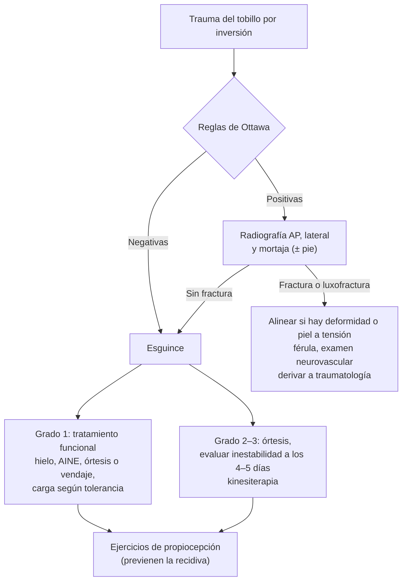
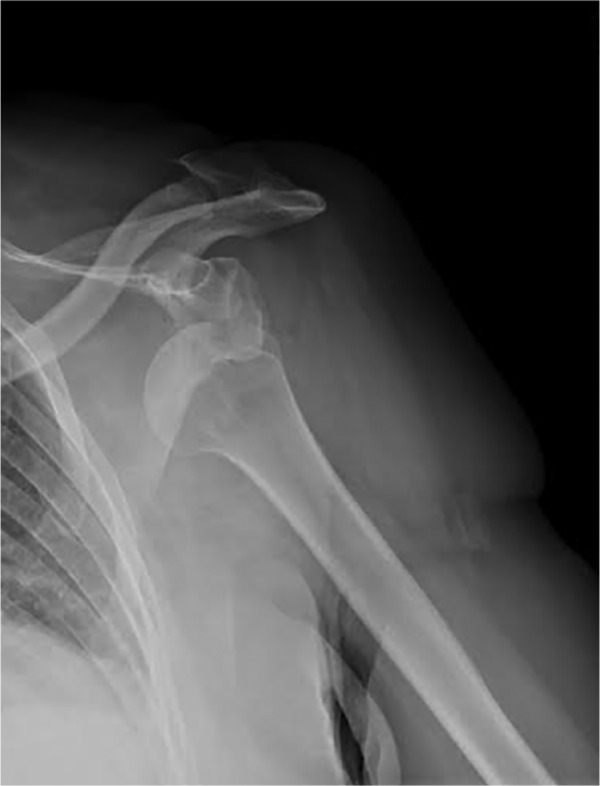

---
tags:
  - Traumatología
  - Urgencia
  - Frecuente en sala
---

# Esguinces, luxación del hombro, luxofractura del tobillo y lesiones de partes blandas

**Subespecialidad**
Traumatología y ortopedia · Medicina deportiva · Urgencia

**Guías principales**
Guía del esguince de tobillo basada en la evidencia (*Br J Sports Med* 2018) · Reglas de Ottawa para el tobillo (revisión sistemática, *BMJ* 2003) y la rodilla (*JAMA* 1996)

**Otras fuentes**
Manejo del primer episodio de luxación traumática del hombro (*EFORT Open Rev* 2017) · Revisión de las luxofracturas del tobillo (*Front Surg* 2022) · Ver [fracturas de diáfisis y metáfisis](fracturas-de-diafisis-y-metafisis-y-fracturas-expuestas.md) y [complicaciones de los traumatismos](complicaciones-de-los-traumatismos-y-del-yeso.md)

**GES**
No.

**EUNACOM**
4.02.2.003 Esguince grado 1 (acromioclavicular, dedos, rodilla y tobillo) (específico, completo, completo) · 4.02.2.011 Lesiones de partes blandas (específico, completo, completo) · 4.02.2.012 Luxación del hombro (específico, completo, derivar) · 4.02.2.013 Luxofractura del tobillo (sospecha, inicial, derivar)

**Revisado**
Octubre 2026

!!! abstract "Resumen en 60 segundos"
    - **Esguince**: lesión de un ligamento por un movimiento forzado.
        - **Grado 1**: distensión sin inestabilidad. **Grado 2**: rotura parcial. **Grado 3**: rotura completa con inestabilidad.
        - El grado 1 lo **trata y controla el médico general**.
    - **Tobillo** (el más frecuente; ligamento **peroneoastragalino anterior**, por inversión):
        - **Reglas de Ottawa** para decidir la radiografía.
        - **Tratamiento funcional**: protección breve, hielo, **AINE**, **órtesis o vendaje funcional**, carga precoz según la tolerancia y **ejercicios de propiocepción** (previenen la recidiva).
        - **No inmovilizar** con yeso el grado 1.
    - **Rodilla, dedos y acromioclavicular grado 1**: analgesia, protección breve (rodillera, **sindactilia** de los dedos, **cabestrillo**) y movilización precoz.
    - **Contusiones, hematomas y desgarros**: protección, hielo, compresión y elevación las primeras 48–72 h, luego **carga y movilización progresivas**.
        - En el **hematoma del cuádriceps**: **flexionar la rodilla**, no masajear (riesgo de **miositis osificante**).
    - **Luxación del hombro**: **anterior en > 90 %**. Mecanismo: abducción y rotación externa.
        - Signos: hombro en **charretera**, brazo en abducción y rotación externa.
        - Antes de reducir: **examinar el nervio axilar** (sensibilidad del deltoides) y tomar una **radiografía** (descartar fractura).
        - Reducir con analgesia (rotación externa, Cunningham, FARES), radiografía de control, **cabestrillo** y derivar.
        - **Recurrencia muy alta en los jóvenes**.
    - **Luxofractura del tobillo**: deformidad, dolor maleolar. Si la piel está tensa o hay compromiso vascular, **reducir de inmediato** con tracción.
        - Después: **férula**, radiografía y derivar (suele ser quirúrgica).

## Definición

- **Esguince**: lesión de un **ligamento** por un movimiento que supera su rango fisiológico, sin pérdida de la congruencia articular.

| Grado | Lesión | Clínica | Estabilidad |
|---|---|---|---|
| **1 (leve)** | Distensión, microrroturas | Dolor y aumento de volumen leves; puede cargar peso | **Estable** |
| **2 (moderado)** | Rotura **parcial** | Dolor, equimosis y aumento de volumen moderados; carga difícil | Laxitud leve o moderada |
| **3 (grave)** | Rotura **completa** | Dolor intenso (a veces menor que el grado 2), equimosis extensa; no carga | **Inestable** |

- **Luxación**: pérdida **completa** y mantenida del contacto entre las superficies articulares. **Subluxación**: pérdida parcial.
- **Luxofractura**: luxación asociada a una fractura (en el tobillo: luxación de la articulación tibioastragalina con fractura de uno o más maléolos).
- **Contusión**: lesión por un golpe directo, sin solución de continuidad de la piel.
- **Hematoma**: colección de sangre en los tejidos (subcutáneo, intramuscular, intermuscular).
- **Desgarro muscular**: rotura de fibras musculares por una contracción excéntrica o una elongación brusca (isquiotibiales, gemelos, cuádriceps, aductores).

## Epidemiología

### Mundial

- El **esguince de tobillo** es una de las **lesiones musculoesqueléticas más frecuentes**, sobre todo en los deportes con saltos y cambios de dirección.
    - Una proporción importante de los pacientes queda con **síntomas persistentes o inestabilidad crónica**, sobre todo si no hace rehabilitación.
    - El principal factor de riesgo de un nuevo esguince es haber tenido uno **previo**.
- El **hombro** es la articulación grande que **más se luxa**. La luxación **anterior** es la gran mayoría.
- La **recurrencia** tras un primer episodio de luxación del hombro es muy alta en los **jóvenes**: en la literatura se informan cifras de **85–92 %** (Boffano 2017). Disminuye mucho con la edad.
- **Luxación posterior** del hombro: rara (2–4 %). Típica de las **convulsiones** y la **electrocución**; se omite con frecuencia.
- **Fracturas del tobillo**: muy frecuentes; las luxofracturas se deben a mecanismos de mayor energía (Cao 2022).

### Chile

!!! chile "Datos nacionales"
    - No hay estadísticas nacionales publicadas de buena calidad sobre la incidencia de los esguinces y las luxaciones.
    - Las lesiones ocurridas en el **trabajo** o en el **trayecto** se atienden y financian por la **Ley 16.744** (mutualidades o ISL). El médico debe registrar el mecanismo y derivar al organismo administrador.
    - Ninguna de estas lesiones tiene garantía GES propia. En el adulto mayor, una luxación o fractura por caída puede requerir **ayudas técnicas** (GES N.° 36).

## Etiología y factores de riesgo

| Lesión | Mecanismo | Factores de riesgo |
|---|---|---|
| **Esguince de tobillo** | **Inversión** con flexión plantar (ligamento **peroneoastragalino anterior**, luego el **calcaneoperoneo**). La eversión (ligamento deltoideo) es rara | Esguince previo, deportes con saltos (básquetbol, vóleibol, fútbol), mala propiocepción, terreno irregular |
| **Esguince de rodilla** | Valgo forzado (**ligamento colateral medial**), varo (lateral), rotación con el pie fijo (cruzado anterior) | Deportes de contacto, esquí |
| **Esguince de dedos** | Hiperextensión o desviación lateral (pelotazo) | Deportes con balón |
| **Esguince acromioclavicular** | **Caída directa sobre el hombro** con el brazo en aducción | Ciclismo, rugby, fútbol |
| **Luxación anterior del hombro** | **Abducción + rotación externa** forzadas (o caída con la mano extendida) | Hombres jóvenes, deportes de contacto, hiperlaxitud, luxación previa |
| **Luxación posterior del hombro** | Contracción muscular violenta (**convulsión**, **electrocución**) o golpe anterior | Epilepsia, alcohol |
| **Luxofractura del tobillo** | Rotación o abducción y aducción forzadas con el pie fijo; alta energía | Obesidad, osteoporosis, diabetes (peor pronóstico) |
| **Desgarro muscular** | Contracción **excéntrica** (sprint), elongación | Desgarro previo, fatiga, mal calentamiento, déficit de elongación |

## Fisiopatología

- El ligamento sana en fases: **inflamatoria** (días), **proliferativa** (semanas) y de **remodelación** (meses).
    - La **carga y el movimiento controlados** orientan las fibras de colágeno y mejoran su resistencia. Por eso el **tratamiento funcional** es mejor que la inmovilización prolongada en los esguinces.
    - La lesión de los **mecanorreceptores** del ligamento altera la **propiocepción**. Esto explica la inestabilidad funcional y la recidiva; se previene con ejercicios de equilibrio.
- **Luxación anterior del hombro**: la cabeza humeral sale por delante de la glena y desgarra el complejo capsulolabral anterior (**lesión de Bankart**). Al chocar con el borde de la glena se impacta la cara posterolateral de la cabeza (**lesión de Hill-Sachs**). Estas lesiones explican la **recurrencia** (Boffano 2017).
- **Luxofractura del tobillo**: el astrágalo se desplaza fuera de la mortaja y la piel medial queda a tensión. Si no se reduce pronto, se produce **necrosis cutánea**, compromiso vascular y daño del cartílago.

*Figura 1. Enfoque del trauma de tobillo. Esquema propio basado en las reglas de Ottawa y en Vuurberg 2018.*

## Clasificación

**Esguince acromioclavicular (Rockwood)**

| Tipo | Lesión | Manejo |
|---|---|---|
| **I** | Distensión acromioclavicular; coracoclaviculares intactos | **Cabestrillo** 1–2 semanas, analgesia, movilización precoz |
| **II** | Rotura acromioclavicular; coracoclaviculares distendidos; leve ascenso de la clavícula | Conservador |
| **III** | Rotura de ambos; clavícula elevada (**signo de la tecla**) | Habitualmente conservador; cirugía en casos seleccionados |
| **IV–VI** | Desplazamiento posterior, muy superior o inferior | **Quirúrgico** |

**Fracturas del tobillo: clasificación de Danis-Weber** (según el nivel de la fractura del peroné respecto de la sindesmosis)

| Tipo | Nivel | Sindesmosis | Manejo habitual |
|---|---|---|---|
| **A** | **Bajo** la sindesmosis | Intacta | Generalmente **estable**: ortopédico |
| **B** | **A nivel** de la sindesmosis | Puede estar lesionada | Depende de la estabilidad (lesión del lado medial) |
| **C** | **Sobre** la sindesmosis | **Rota** | **Inestable**: quirúrgico |

- **Bimaleolar** o **trimaleolar** (maléolo posterior) y las **luxofracturas**: inestables, casi siempre quirúrgicas.
- La clasificación de **Lauge-Hansen** describe el mecanismo (supinación-rotación externa, la más frecuente; pronación-rotación externa; supinación-aducción; pronación-abducción) (Cao 2022).

## Clínica

**Esguince de tobillo**

- Inversión con un "chasquido", dolor, aumento de volumen y equimosis **anterolaterales** (delante y bajo el maléolo lateral).
- Dolor a la palpación del ligamento **peroneoastragalino anterior**.
- **Cajón anterior** positivo en los grados 2–3. Se evalúa mejor a los **4–5 días**, cuando bajan el dolor y el edema (Vuurberg 2018).

**Otros esguinces**

- **Rodilla (colateral medial)**: dolor medial, dolor al **estrés en valgo** a 30° de flexión; sin bostezo en el grado 1.
- **Dedos**: dolor y aumento de volumen de la interfalángica proximal, estable al estrés lateral. Descartar una fractura (radiografía) y una lesión tendinosa (dedo en martillo: no extiende la falange distal).
- **Acromioclavicular**: dolor localizado en la articulación acromioclavicular, dolor con la aducción cruzada del brazo; sin deformidad en el tipo I.

**Lesiones de partes blandas**

- **Contusión**: dolor y aumento de volumen local, sin deformidad ni impotencia funcional importante.
- **Hematoma muscular**: aumento de volumen tenso y doloroso. En el **cuádriceps** limita la flexión de la rodilla.
- **Desgarro**: **dolor súbito "como una pedrada"** durante el esfuerzo, impotencia funcional, equimosis tardía, a veces un defecto palpable.

**Luxación anterior del hombro**

- Dolor intenso; el paciente sujeta el brazo afectado con la otra mano.
- Brazo en **abducción leve y rotación externa**; no puede rotarlo hacia adentro.
- **Signo de la charretera**: pérdida del contorno redondeado del deltoides, con el acromion prominente.
- La cabeza humeral es palpable por delante, bajo la coracoides.
- **Nervio axilar**: buscar la **hipoestesia de la cara lateral del hombro** (región "del parche del sargento") **antes y después** de la reducción.

**Luxación posterior del hombro**: brazo en **aducción y rotación interna fija**; no puede rotarlo hacia afuera. Ocurre tras una convulsión o una electrocución.

**Luxofractura del tobillo**: deformidad evidente (pie desplazado lateral o posteriormente), dolor maleolar, imposibilidad de cargar peso, **piel medial tensa y pálida**, y riesgo de compromiso vascular y nervioso.

<figure markdown>
{ loading=lazy }
<figcaption>Figura 2. Luxofractura anterior del hombro antes de la reducción: la cabeza humeral está fuera de la glena, en posición subcoracoídea, con una fractura asociada. La radiografía previa a la reducción permite detectar estas fracturas. Boffano M, Mortera S, Piana R. <em>EFORT Open Rev.</em> 2017. Licencia CC BY-NC 4.0.</figcaption>
</figure>

## Diagnóstico

!!! guia "Reglas de Ottawa (radiografía en el trauma agudo)"
    **Tobillo**: pedir una radiografía del tobillo si hay **dolor en la zona maleolar** y **cualquiera** de estos signos:

    - Dolor a la palpación de los **6 cm distales del borde posterior** o de la punta del **maléolo lateral**.
    - Dolor a la palpación de los **6 cm distales del borde posterior** o de la punta del **maléolo medial**.
    - **Incapacidad de dar 4 pasos** (cargar peso) inmediatamente después del trauma y en la urgencia.

    **Pie**: pedir una radiografía del pie si hay dolor en el mediopié y dolor en la **base del 5.º metatarsiano** o en el **escafoides (navicular)**, o incapacidad de dar 4 pasos.

    **Rodilla**: pedir una radiografía si hay **cualquiera** de estos:

    - Edad **≥ 55 años**.
    - Dolor aislado en la **rótula**.
    - Dolor en la **cabeza del peroné**.
    - **Incapacidad de flexionar a 90°**.
    - Incapacidad de dar 4 pasos.

    - Las reglas de Ottawa para el tobillo tienen una **sensibilidad cercana al 100 %** para excluir una fractura (Bachmann 2003). Su uso evita muchas radiografías innecesarias.

- **Luxación del hombro**: radiografía **AP verdadera** y **lateral de escápula (en Y) o axial** **antes** de reducir (fracturas del troquíter o del cuello humeral) y **después** (confirmar la reducción y descartar fracturas iatrogénicas).
    - En la **luxación posterior**, la AP puede parecer casi normal ("signo de la bombilla": cabeza en rotación interna). La proyección **axial o en Y** es indispensable.

## Laboratorio

- No se requieren exámenes de laboratorio en estas lesiones aisladas.
- **CK** en los traumatismos musculares extensos o por aplastamiento (rabdomiólisis).
- **Pruebas de coagulación** si hay hematomas desproporcionados o en el paciente anticoagulado.

## Imágenes

| Examen | Indicación |
|---|---|
| **Radiografía** | Según las reglas de Ottawa; luxaciones (antes y después de reducir); luxofracturas; dedos (fracturas por avulsión) |
| **Radiografía acromioclavicular comparativa** | Clasificar el esguince acromioclavicular (desplazamiento de la clavícula) |
| **Ecografía** | Desgarros musculares, hematomas, lesiones tendinosas (manguito rotador tras una luxación en el adulto mayor) |
| **RM** | Lesiones ligamentosas de la rodilla (cruzados, meniscos), inestabilidad crónica, lesiones osteocondrales del astrágalo, lesiones de Bankart en los recurrentes |
| **TC** | Planificación de las fracturas articulares del tobillo (maléolo posterior, pilón) |

## Diagnóstico diferencial

| Cuadro | Claves |
|---|---|
| **Fractura del tobillo** | Dolor óseo maleolar (Ottawa); deformidad |
| **Fractura de la base del 5.º metatarsiano** | Mismo mecanismo de inversión; dolor en la base del 5.º metatarsiano (Ottawa del pie) |
| **Rotura del tendón de Aquiles** | Dolor posterior ("patada"), **Thompson positivo** (no hay flexión plantar al comprimir la pantorrilla) |
| **Lesión de la sindesmosis** ("esguince alto") | Dolor sobre el tobillo, dolor con la rotación externa y la compresión de la pierna; recuperación más lenta |
| **Lesión del ligamento cruzado anterior** | Chasquido, **hemartrosis** precoz, inestabilidad; Lachman positivo |
| **Fractura de clavícula distal** | Radiografía |
| **Rotura del manguito rotador** tras una luxación | Adulto **> 40 años** que no puede elevar el brazo tras la reducción |
| **Desgarro vs. síndrome compartimental** | En el compartimental el dolor aumenta y hay dolor al estiramiento pasivo y compartimento tenso |
| **Hematoma vs. TVP** | Antecedente de golpe; eco-Doppler si hay dudas |

## Tratamiento

**Esguince de tobillo grado 1–2** (Vuurberg 2018)

- **Primeros días**: protección relativa, **hielo** 15–20 min varias veces al día, **elevación** y compresión.
- **AINE** por un período breve para el dolor y el edema (ej.: ibuprofeno 400 mg cada 8 h por 3–5 días), o paracetamol. Usarlos con cautela: tienen efectos adversos y podrían retrasar la cicatrización del ligamento (Vuurberg 2018).
- **Tratamiento funcional** con **órtesis semirrígida** (tobillera con soporte lateral) o **vendaje funcional**, mejor que la inmovilización rígida. **Carga precoz según la tolerancia**.
- Si el dolor es intenso, un período breve de inmovilización (< 10 días) puede aliviarlo, pero sin prolongarlo.
- **Ejercicios supervisados** de movilidad, fuerza y **propiocepción** (tabla de equilibrio), preferibles a las terapias pasivas. Ayudan a recuperar la estabilidad funcional y deben continuar varias semanas.
- **Prevención de la recidiva**: ejercicios y **órtesis de tobillo** en los deportes de riesgo (Vuurberg 2018).
- Retorno deportivo gradual, con una órtesis o un vendaje en los deportes de riesgo durante meses.

**Otros esguinces grado 1**

| Lesión | Tratamiento |
|---|---|
| **Rodilla (colateral medial)** | Hielo, AINE, rodillera, carga según la tolerancia, ejercicios de cuádriceps |
| **Dedos** | **Sindactilia** (vendar el dedo con el vecino) por 1–3 semanas, hielo, movilización precoz |
| **Acromioclavicular I–II** | **Cabestrillo** 1–2 semanas, hielo, analgesia, movilización progresiva |

**Contusiones, hematomas y desgarros**

- **Primeras 48–72 h**: protección, **hielo**, **compresión**, **elevación**; analgesia (paracetamol; AINE en un período breve).
- Luego: **carga y movilización progresivas** guiadas por el dolor, y elongación suave.
- **Hematoma del cuádriceps**: mantener la **rodilla en flexión** las primeras 24 h; **no masajear ni aplicar calor** (riesgo de **miositis osificante**).
- **Desgarro muscular**: reposo relativo, kinesiterapia progresiva; retorno al deporte en semanas según el grado.
- **Drenaje** de los hematomas grandes, a tensión o con riesgo de necrosis cutánea (derivar).

**Luxación anterior del hombro**

1. **Analgesia** (opioide IV) ± sedación procedimental o **bloqueo intraarticular** con lidocaína.
2. **Examen neurovascular** (nervio axilar) y **radiografía** previa.
3. **Reducción cerrada** con una técnica suave:
    - **Rotación externa** (paciente en decúbito supino, codo a 90° pegado al cuerpo; rotar externamente de forma lenta).
    - **Cunningham** (masaje de los músculos del brazo con el paciente sentado).
    - **FARES** (tracción con movimientos oscilatorios en abducción progresiva).
    - **Tracción-contratracción** con una sábana.
    - **Evitar Kocher** en los adultos mayores (riesgo de fractura).
4. **Examen neurovascular y radiografía de control**.
5. **Cabestrillo** por 1–3 semanas (más corto en el adulto mayor, por la rigidez), analgesia y **kinesiterapia**.
6. **Derivar a traumatología**: evaluar la estabilización quirúrgica (reparación de Bankart artroscópica, Latarjet) en los jóvenes deportistas o con luxaciones recurrentes. En los mayores de 40 años, descartar una **rotura del manguito rotador**.

**Luxofractura del tobillo**

1. **Analgesia**.
2. Si hay **deformidad con la piel a tensión o isquemia**: **reducción inmediata** con tracción longitudinal y realineamiento, **sin esperar la radiografía**.
3. **Férula** posterior (en "U" o en "L") bien acolchada; **elevación**.
4. **Radiografía** y **examen neurovascular** de control.
5. **Derivar** a traumatología: las bimaleolares, trimaleolares y Weber C son **quirúrgicas** (reducción abierta y fijación interna).

!!! dosis "Analgesia habitual en adultos"
    | Fármaco | Dosis | Comentario |
    |---|---|---|
    | **Ibuprofeno** | **400 mg VO cada 8 h** por 3–5 días | Con las comidas; evitar en la ERC, la úlcera péptica y la anticoagulación |
    | **Naproxeno** | **550 mg VO cada 12 h** | Alternativa |
    | **Paracetamol** | **1 g VO cada 6–8 h** (máximo 4 g/día) | Si los AINE están contraindicados |
    | **Morfina** (reducción de una luxación) | **0,05–0,1 mg/kg IV** en bolos | Con monitorización y naloxona disponible |
    | **Lidocaína intraarticular** (hombro) | **10–20 mL al 1 %** | Alternativa a la sedación para reducir |

!!! alarma "Derivar o avisar de inmediato"
    - **Luxofractura del tobillo** con la piel a tensión o un pie sin pulso: **reducir** y derivar.
    - **Luxación del hombro** irreductible, con fractura asociada o **déficit neurovascular**.
    - **Luxación de la rodilla** (riesgo de lesión de la arteria poplítea).
    - **Esguince** con **inestabilidad** franca (grado 3), hemartrosis importante o bloqueo articular.

## Complicaciones

- **Esguince de tobillo**: **inestabilidad crónica** y esguinces recurrentes, dolor persistente, lesiones osteocondrales del astrágalo no diagnosticadas.
- **Luxación del hombro**: **recurrencia** (jóvenes), **lesión del nervio axilar** (habitualmente una neuropraxia), **rotura del manguito rotador** (> 40 años), fractura del troquíter, lesión del plexo braquial o la arteria axilar (raras, más en los adultos mayores), rigidez.
- **Luxofractura del tobillo**: **necrosis cutánea**, lesión neurovascular, **síndrome compartimental**, infección posquirúrgica, pérdida de la reducción, **artrosis postraumática**.
- **Hematoma y contusión muscular**: **miositis osificante**, síndrome compartimental (raro), rerotura.

## Pronóstico y seguimiento

- **Esguince grado 1**: buena recuperación en **1–3 semanas**. Grado 2: 3–6 semanas. Grado 3: hasta meses.
- **Control** del esguince en **1–2 semanas** para evaluar la evolución. Reevaluar la estabilidad a los 4–5 días si había dudas, y derivar si persiste la inestabilidad o el dolor después de 6 semanas.
- **Luxación del hombro**: el pronóstico depende de la edad. En los jóvenes, la recurrencia es la regla sin estabilización. En los adultos mayores, el problema es la rigidez y las lesiones del manguito.
- **Luxofractura del tobillo**: con una reducción anatómica, el pronóstico funcional es bueno. La incongruencia residual lleva a la artrosis.

## Perlas para el internado

!!! perla "Para recordar en la sala"
    - **Ottawa del tobillo**: dolor maleolar + dolor óseo en los **6 cm posteriores o la punta** de algún maléolo, o **no puede dar 4 pasos** = radiografía.
    - **Esguince de tobillo grado 1–2**: **tratamiento funcional** (órtesis, carga precoz, propiocepción). **No usar yeso.**
    - **Luxación del hombro**: **examinar el nervio axilar** y tomar una **radiografía antes y después** de reducir.
    - **Luxación posterior del hombro**: **convulsión o electrocución** + brazo en **rotación interna fija**. La AP puede engañar: pedir una **axial**.
    - **> 40 años con luxación de hombro** que no levanta el brazo tras reducir: **rotura del manguito**.
    - **Luxofractura del tobillo con la piel a tensión**: **reducir antes de la radiografía**.
    - **Hematoma del cuádriceps**: rodilla en **flexión**, **sin masaje ni calor**.

## Preguntas de repaso

??? repaso "1. Joven de 20 años con un esguince de tobillo por inversión jugando básquetbol. Tiene dolor anterolateral, puede caminar 4 pasos y no tiene dolor óseo maleolar ni en la base del 5.º metatarsiano. ¿Pide radiografía y cómo lo trata?"
    - **No requiere radiografía**: las reglas de Ottawa son negativas.
    - Probable **esguince grado 1–2** del ligamento peroneoastragalino anterior.
    - **Tratamiento funcional**: hielo, elevación, **AINE** por 3–5 días, **órtesis semirrígida** o vendaje funcional, **carga según la tolerancia** y **ejercicios de propiocepción** para prevenir la recidiva.
    - Control en 1–2 semanas.

??? repaso "2. Hombre de 25 años que se cayó esquiando con el brazo en abducción. Tiene el hombro en charretera y el brazo en rotación externa. ¿Qué hace antes de reducir?"
    - Sospechar una **luxación anterior del hombro**.
    - **Examinar el nervio axilar** (sensibilidad de la cara lateral del hombro) y los pulsos, y **registrarlo**.
    - Tomar una **radiografía AP y axial o en Y** para descartar fracturas.
    - Dar **analgesia** y luego reducir (rotación externa, Cunningham o FARES). Hacer una radiografía de control, poner un cabestrillo y derivar (alto riesgo de recurrencia a su edad).

??? repaso "3. Paciente epiléptico que tras una crisis tiene el hombro doloroso con el brazo en aducción y rotación interna, sin poder rotarlo hacia afuera. La radiografía AP parece casi normal. ¿Qué debe sospechar?"
    - **Luxación posterior del hombro**: típica de las **convulsiones** y la electrocución; se omite con frecuencia.
    - La AP puede mostrar el "signo de la bombilla". Pedir una **radiografía axial o en Y** o una TC.
    - Derivar a traumatología para la reducción (a menudo bajo anestesia) y la evaluación de una lesión de Hill-Sachs invertida.

??? repaso "4. Mujer de 60 años con el tobillo deformado tras una caída, con el pie desplazado hacia lateral y la piel del maléolo medial tensa y pálida. ¿Qué hace?"
    - **Luxofractura del tobillo** con riesgo de **necrosis cutánea**.
    - **Analgesia** y **reducción inmediata** con tracción longitudinal y realineamiento, **sin esperar la radiografía**.
    - **Férula** acolchada, elevación, **examen neurovascular** y radiografía de control.
    - **Derivar** a traumatología: es una lesión inestable que requiere cirugía.

??? repaso "5. Futbolista con un golpe de rodilla en el muslo, con un aumento de volumen doloroso en el cuádriceps y dificultad para flexionar la rodilla. ¿Qué indica y qué debe evitar?"
    - **Hematoma (contusión) del cuádriceps**.
    - **Hielo**, compresión, reposo relativo y la **rodilla en flexión** las primeras 24 h, luego una movilización progresiva.
    - **Evitar el masaje y el calor** por el riesgo de **miositis osificante**. Vigilar un síndrome compartimental si el dolor aumenta.

??? repaso "6. Ciclista que cae sobre el hombro. Tiene dolor en la articulación acromioclavicular sin deformidad, y la radiografía no muestra desplazamiento. ¿Cómo lo maneja?"
    - **Esguince acromioclavicular tipo I** (Rockwood).
    - **Cabestrillo** por 1–2 semanas, hielo, **analgesia** y movilización progresiva precoz. Lo maneja el médico general.

## Referencias

1. Vuurberg G, Hoorntje A, Wink LM, et al. Diagnosis, treatment and prevention of ankle sprains: update of an evidence-based clinical guideline. *Br J Sports Med.* 2018;52(15):956. doi:[10.1136/bjsports-2017-098106](https://doi.org/10.1136/bjsports-2017-098106)
2. Bachmann LM, Kolb E, Koller MT, et al. Accuracy of Ottawa ankle rules to exclude fractures of the ankle and mid-foot: systematic review. *BMJ.* 2003;326(7386):417. doi:[10.1136/bmj.326.7386.417](https://doi.org/10.1136/bmj.326.7386.417)
3. Stiell IG, Greenberg GH, Wells GA, et al. Prospective validation of a decision rule for the use of radiography in acute knee injuries. *JAMA.* 1996;275(8):611–615. [PubMed](https://pubmed.ncbi.nlm.nih.gov/8594242/)
4. Boffano M, Mortera S, Piana R. Management of the first episode of traumatic shoulder dislocation. *EFORT Open Rev.* 2017;2(2):35–40. doi:[10.1302/2058-5241.2.160018](https://doi.org/10.1302/2058-5241.2.160018)
5. Cao MM, Zhang YW, Hu SY, Rui YF. A systematic review of ankle fracture-dislocations: recent update and future prospects. *Front Surg.* 2022;9:965814. doi:[10.3389/fsurg.2022.965814](https://doi.org/10.3389/fsurg.2022.965814)
