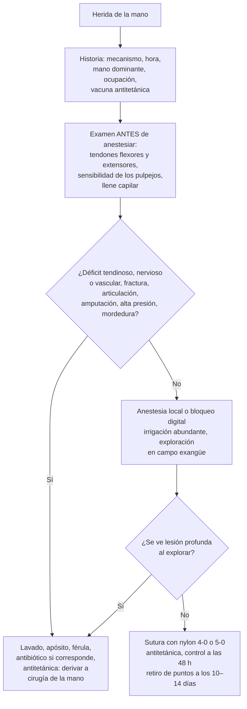

---
tags:
  - Traumatología
  - Urgencia
  - Frecuente en sala
---

# Fractura de la muñeca, heridas de la mano y lesiones de los nervios periféricos

**Subespecialidad**
Traumatología y ortopedia · Cirugía de la mano · Urgencia

**Guías principales**
Metaanálisis del tratamiento quirúrgico frente al conservador de la fractura del radio distal (*JAMA Netw Open* 2020) · Ensayo SMaRT: RM inmediata en la sospecha de fractura del escafoides (*Bone Joint J* 2019)

**Otras fuentes**
Clasificaciones de Seddon (1943) y Sunderland (1951) de las lesiones nerviosas · Ver [heridas menores y mordeduras](../cirugia/piel-partes-blandas-y-quemaduras/heridas-menores-mordeduras-y-onicocriptosis.md), [neuropatías periféricas](../neurologia/neuropatias-perifericas-y-sindromes-sensitivos.md), [osteoporosis](../endocrinologia/osteoporosis.md) y [tétanos](../infectologia/tetanos.md)

**GES**
No.

**EUNACOM**
4.02.2.005 Fractura de la muñeca (específico, inicial, derivar) · 4.02.2.009 Heridas de la mano no complicadas (específico, completo, completo) · 4.02.2.010 Lesiones de los nervios periféricos (específico, inicial, derivar)

**Revisado**
Octubre 2026

!!! abstract "Resumen en 60 segundos"
    - **Fractura del radio distal**: la fractura más frecuente de la extremidad superior. Tiene dos poblaciones: **mujeres mayores** con osteoporosis (caída de su altura) y **jóvenes** con trauma de alta energía.
        - **Colles**: desplazamiento **dorsal**, deformidad en "**dorso de tenedor**". **Smith**: desplazamiento volar.
        - **Manejo inicial**: examen del **nervio mediano**, radiografía, **reducción cerrada** con anestesia del foco si está desplazada, **valva o yeso antebraquial** y control radiológico a los 7–10 días.
        - En los **≥ 60 años**, la cirugía no mejora la función a mediano plazo frente al yeso (Ochen 2020).
        - Toda fractura de muñeca por una caída de baja energía es una **fractura por fragilidad**: estudiar la **osteoporosis**.
    - **Fractura del escafoides**: caída con la mano en extensión, en un **adulto joven**, con **dolor en la tabaquera anatómica**.
        - La radiografía inicial puede ser **normal**: inmovilizar y **repetir la radiografía en 10–14 días** o pedir una **RM**.
        - Riesgos: **pseudoartrosis** y **necrosis avascular** del polo proximal.
    - **Herida de la mano**: antes de anestesiar, examinar los **tendones** (flexor profundo y superficial de cada dedo, extensores), los **nervios** (sensibilidad de los pulpejos) y la **circulación**.
        - **No complicada** (piel y subcutáneo): irrigar, explorar, suturar con **nylon 4-0 o 5-0**, profilaxis antitetánica, retirar los puntos a los **10–14 días**.
        - **Derivar**: lesión de tendón, nervio, articulación o hueso, amputación, **inyección a alta presión** y **mordeduras** (no cerrar).
    - **Lesión de un nervio periférico** (Seddon):
        - **Neuropraxia**: bloqueo de la conducción; recupera en semanas.
        - **Axonotmesis**: lesión del axón con la vaina indemne; regenera ~ **1 mm/día**.
        - **Neurotmesis**: sección completa; requiere **cirugía**.
        - **Herida cortante con déficit** → exploración y reparación precoz. **Trauma cerrado** → observar y hacer una electromiografía a las 3–4 semanas.

## Definición

- **Fractura del radio distal**: fractura en los 3 cm distales del radio, extraarticular o articular.
    - **Colles**: extraarticular, con desplazamiento **dorsal** del fragmento distal (caída con la mano en extensión).
    - **Smith**: desplazamiento **volar** ("Colles invertida"; caída con la muñeca en flexión).
    - **Barton**: fractura articular del **reborde** dorsal o volar del radio, con subluxación del carpo.
    - **Chauffeur**: fractura de la apófisis estiloides radial.
- **Fractura del escafoides**: fractura del hueso escafoides del carpo, el que se fractura con más frecuencia (cintura, polo proximal o distal).
- **Herida de la mano no complicada**: herida que compromete solo la **piel y el tejido subcutáneo**, sin lesión de tendones, nervios, vasos, articulaciones ni huesos, y sin pérdida de sustancia importante.
- **Lesión de un nervio periférico**: interrupción de la función de un nervio por compresión, tracción, contusión o sección.

## Epidemiología

### Mundial

- La **fractura del radio distal** es una de las fracturas más frecuentes del adulto.
    - En el metaanálisis de Ochen (2020), con **2254 pacientes**, el **81 %** eran **mujeres**, con una edad media de **67 años**.
    - En las mujeres posmenopáusicas, suele ser la **primera fractura por fragilidad** y anuncia el riesgo de una fractura de cadera o vertebral.
- La **fractura del escafoides** es la fractura más frecuente del **carpo**. Es típica de los hombres jóvenes y activos.
    - Con frecuencia **no se ve en la radiografía inicial**. Por eso hay un sobretratamiento (inmovilizar a muchos sin fractura) y también diagnósticos tardíos (Rua 2019).
- Las **heridas de la mano** son una de las consultas traumáticas más frecuentes en urgencia. Muchas son **accidentes laborales** (herramientas, máquinas, cuchillos).

### Chile

!!! chile "Datos nacionales"
    - Las heridas de la mano y las fracturas de muñeca ocurridas en el **trabajo** o en el **trayecto** se atienden por la **Ley 16.744** (mutualidades o ISL), que cubre la atención, la rehabilitación y los subsidios.
    - En la mujer posmenopáusica, la fractura de muñeca por fragilidad debe gatillar el estudio y el tratamiento de la **osteoporosis** (ver [osteoporosis](../endocrinologia/osteoporosis.md)). El GES no cubre la osteoporosis ni la fractura de muñeca.

## Etiología y factores de riesgo

| Lesión | Mecanismo | Factores de riesgo |
|---|---|---|
| **Radio distal** | **Caída con la mano extendida** (baja energía en los mayores; alta energía en los jóvenes) | **Osteoporosis**, sexo femenino, edad, caídas |
| **Escafoides** | Caída con la mano en **hiperextensión** y desviación radial | Hombres jóvenes, deportes |
| **Herida de la mano** | Cuchillos, vidrio, herramientas, sierras, máquinas, **mordeduras**, inyección a presión | Trabajo manual, alcohol, agresiones |
| **Nervio radial** | Fractura de la diáfisis humeral; compresión ("parálisis del sábado") | |
| **Nervio mediano** | Herida de la muñeca, fractura del radio distal (síndrome del túnel carpiano agudo), fractura supracondílea en el niño | |
| **Nervio cubital** | Herida de la muñeca o del codo, fractura del codo | |
| **Nervio axilar** | **Luxación del hombro**, fractura del cuello humeral | |
| **Nervio peroneo común** | **Fractura del cuello del peroné**, yeso apretado, luxación de la rodilla | |
| **Nervio ciático** | **Luxación posterior de la cadera**, fractura del acetábulo | |

## Fisiopatología

- **Radio distal**: la carga axial sobre la mano en extensión comprime el hueso metafisario (osteoporótico en los mayores). El fragmento distal se desplaza hacia dorsal y se acorta, con pérdida de la inclinación radial.
- **Escafoides**: su irrigación entra por el polo **distal** y llega al proximal en forma **retrógrada**. Por eso las fracturas de la **cintura** y del **polo proximal** tienen riesgo de **necrosis avascular** y **pseudoartrosis**.
- **Nervio periférico**:
    - En la **neuropraxia**, una desmielinización focal bloquea la conducción sin dañar el axón.
    - En la **axonotmesis**, el axón se interrumpe y el segmento distal sufre una **degeneración walleriana** (por eso la electromiografía se altera a las **3–4 semanas**). El axón regenera por la vaina de tejido conectivo a ~ **1 mm/día** (~ 2,5 cm al mes).
    - En la **neurotmesis**, el nervio está seccionado. Sin reparación, la regeneración es desordenada (neuroma).

*Figura 1. Manejo de la herida de la mano en la urgencia. Esquema propio.*

## Clasificación

**Clasificación de las lesiones nerviosas**

| Seddon | Sunderland | Lesión | Pronóstico | Manejo |
|---|---|---|---|---|
| **Neuropraxia** | I | Bloqueo de la conducción (desmielinización focal), axón indemne | Recuperación **completa** en días a semanas | Observación |
| **Axonotmesis** | II | Sección del axón, endoneuro indemne | Buena recuperación (regeneración ~ 1 mm/día) | Observación |
| | III | Axón y endoneuro | Recuperación incompleta | Observación; cirugía si no hay progresión |
| | IV | Axón, endoneuro y perineuro (solo el epineuro indemne) | Mala sin cirugía (neuroma en continuidad) | Cirugía |
| **Neurotmesis** | V | **Sección completa** del nervio | Nula sin cirugía | **Reparación quirúrgica** |

**Criterios de una reducción aceptable de la fractura del radio distal** (orientativos)

| Parámetro | Normal | Aceptable |
|---|---|---|
| **Inclinación volar** (radiografía lateral) | ~ 11° | Hasta **neutro** (0°) o una leve angulación dorsal |
| **Inclinación radial** (AP) | ~ 22° | > 15° |
| **Altura radial** (AP) | ~ 11 mm | Acortamiento < 3–5 mm |
| **Escalón articular** | 0 | **< 2 mm** |

- En los **adultos mayores** de baja demanda se toleran desplazamientos mayores, porque el resultado funcional es similar con un tratamiento conservador.

## Clínica

**Fractura del radio distal**

- Dolor, aumento de volumen e impotencia funcional de la muñeca tras una caída.
- **Colles**: deformidad en "**dorso de tenedor**" (lateral) y en "**bayoneta**" (AP).
- Examinar el **nervio mediano** (sensibilidad del pulpejo del índice; parestesias crecientes = **síndrome del túnel carpiano agudo**), la circulación y la piel (fractura expuesta).

**Fractura del escafoides**

- Dolor en la muñeca radial tras una caída con la mano en extensión; puede tener poca deformidad y movilidad conservada ("esguince de muñeca").
- **Dolor en la tabaquera anatómica**, dolor en el **tubérculo del escafoides** (volar) y dolor a la **compresión axial del pulgar**.

**Herida de la mano: examen sistemático antes de anestesiar**

| Estructura | Cómo examinar |
|---|---|
| **Flexor profundo** (FDP) | Flexión de la **interfalángica distal** con la proximal bloqueada |
| **Flexor superficial** (FDS) | Flexión de la **interfalángica proximal** con los otros dedos sujetos en extensión |
| **Extensores** | Extensión activa de cada articulación contra resistencia (una sección parcial puede conservar la extensión, pero con dolor) |
| **Nervios digitales** | Sensibilidad de los bordes radial y cubital de cada pulpejo; **discriminación de 2 puntos** (normal < 6 mm); ausencia de sudoración |
| **Mediano** | Sensibilidad del pulpejo del índice; **oposición** del pulgar |
| **Cubital** | Sensibilidad del pulpejo del meñique; **abducción** de los dedos (interóseos); signo de Froment |
| **Radial** | Sensibilidad del dorso del primer espacio; extensión de la muñeca y los dedos |
| **Circulación** | Color, temperatura, **llene capilar** de cada dedo; test de Allen |
| **Postura en cascada** | Con la mano relajada, los dedos están cada vez más flexionados hacia el meñique. **Un dedo extendido** fuera de la cascada sugiere una **sección de los flexores** |

**Lesiones de nervios periféricos: cuadros típicos**

| Nervio | Déficit motor | Déficit sensitivo |
|---|---|---|
| **Radial** (diáfisis humeral) | **Mano caída**: no extiende la muñeca ni las metacarpofalángicas | Dorso del primer espacio interdigital |
| **Mediano** (muñeca) | Pérdida de la **oposición** del pulgar; en las lesiones altas, "**mano de predicador**" (no flexiona el pulgar, el índice ni el medio) | Pulpejos del pulgar, índice, medio y la mitad radial del anular |
| **Cubital** | **Mano en garra** (4.º y 5.º dedos), atrofia de los interóseos, **Froment** positivo | Meñique y la mitad cubital del anular |
| **Axilar** | Debilidad de la **abducción** (deltoides) | Cara lateral del hombro |
| **Peroneo común** | **Pie caído** (no hace dorsiflexión ni eversión), marcha en "steppage" | Dorso del pie y cara lateral de la pierna |
| **Ciático** | Pie caído + debilidad de la flexión de la rodilla | Pierna y pie (excepto la cara medial) |

## Diagnóstico

!!! guia "Puntos clave"
    - **Muñeca**: radiografía **AP y lateral** (y serie de **escafoides** si hay dolor en la tabaquera).
    - **Sospecha clínica de fractura del escafoides con radiografía normal**: **inmovilizar** (valva con el pulgar incluido) y **repetir la radiografía a los 10–14 días**, o pedir una **RM** precoz. En el ensayo SMaRT, la RM inmediata redujo las inmovilizaciones y las consultas innecesarias sin aumentar los costos (Rua 2019).
    - **Herida de la mano**: el examen motor y sensitivo se hace **antes de la anestesia local**. La exploración se hace con **buena luz**, **campo exangüe** (torniquete digital) y movilizando los dedos, porque el extremo del tendón puede retraerse fuera de la herida.
    - **Lesión nerviosa**: el diagnóstico es **clínico**. La **electromiografía** sirve a partir de las **3–4 semanas** (antes no muestra la degeneración walleriana) para distinguir la neuropraxia de la axonotmesis y seguir la recuperación.

## Laboratorio

- Habitualmente no se requieren exámenes de laboratorio.
- **Fractura de muñeca por fragilidad**: estudio de la **osteoporosis** (densitometría, calcio, fósforo, 25-OH vitamina D, creatinina, TSH; ver [osteoporosis](../endocrinologia/osteoporosis.md)).
- **Glicemia** si hay una herida infectada o se sospecha una diabetes (cicatrización, infección).

## Imágenes

| Examen | Indicación |
|---|---|
| **Radiografía de la muñeca** AP y lateral | Toda sospecha de fractura de muñeca; control tras la reducción y a los 7–10 días |
| **Serie de escafoides** (AP, lateral, oblicuas, AP con desviación cubital) | Dolor en la tabaquera anatómica |
| **RM** | Sospecha de fractura del escafoides con radiografía normal; lesiones ligamentosas del carpo |
| **TC** | Fracturas articulares complejas del radio distal; consolidación del escafoides |
| **Radiografía de la mano** | Herida por aplastamiento o con sospecha de fractura o **cuerpo extraño** radiopaco (vidrio, metal) |
| **Ecografía** | Cuerpos extraños radiolúcidos (madera), lesiones tendinosas |
| **Electromiografía** | Lesión nerviosa: a partir de las 3–4 semanas y luego seriada |

## Diagnóstico diferencial

| Cuadro | Diferencia |
|---|---|
| **Esguince de muñeca** | Diagnóstico de exclusión: **no llamar "esguince" a un dolor en la tabaquera anatómica** sin descartar el escafoides |
| **Lesión ligamentosa escafolunar** | Ensanchamiento del espacio escafolunar (> 3 mm) en la radiografía |
| **Luxación perilunar** | Trauma de alta energía; pérdida de la alineación del carpo en la lateral; síntomas del mediano |
| **Tenosinovitis de De Quervain** | Sin trauma; dolor en el primer compartimento extensor; **Finkelstein** positivo |
| **Lesión nerviosa vs. lesión tendinosa** | En la lesión nerviosa la sensibilidad está alterada y el músculo está débil; en la tendinosa la sensibilidad está indemne y falta un movimiento específico |
| **Neuropraxia vs. sección nerviosa** | Herida cortante en el trayecto del nervio = sección hasta demostrar lo contrario; trauma cerrado = probable neuropraxia |
| **Mononeuropatía no traumática** | Atrapamiento (túnel carpiano, túnel cubital), diabetes, vasculitis (ver [neuropatías periféricas](../neurologia/neuropatias-perifericas-y-sindromes-sensitivos.md)) |

## Tratamiento

**Fractura del radio distal**

1. **Analgesia**, retirar los anillos, **elevar**.
2. **No desplazada o estable**: **valva** o yeso **antebraquial** por **~ 4–6 semanas**.
3. **Desplazada**: **reducción cerrada** con anestesia del foco (bloqueo del hematoma con **lidocaína al 1–2 %, 5–10 mL**) o con anestesia regional. Se hace con tracción, se exagera la deformidad y luego se corrige (flexión palmar y desviación cubital en la Colles). Después, valva o yeso **braquiopalmar** o antebraquial bien moldeado y una **radiografía de control**.
4. **Control radiológico a los 7–10 días** (pérdida de la reducción).
5. **Cirugía** (placa volar bloqueada, agujas, fijador externo) en las fracturas **inestables**, **articulares** desplazadas, con pérdida de la reducción o abiertas, sobre todo en los **jóvenes** activos.
    - En los **≥ 60 años**, la cirugía no mejora la función a mediano plazo frente al tratamiento ortopédico (Ochen 2020).
6. **Movilizar los dedos** desde el primer día y hacer kinesiterapia al retirar el yeso.
7. Estudiar y tratar la **osteoporosis** en las fracturas por fragilidad.

**Fractura del escafoides**

- **Sospecha con radiografía normal**: valva antebraquial que incluya el pulgar; reevaluar en 10–14 días con una radiografía o una RM.
- **Fractura no desplazada de la cintura**: **yeso** antebraquial (con o sin el pulgar) por **6–12 semanas**, con control de la consolidación (TC).
- **Desplazada o del polo proximal**: **cirugía** (tornillo de compresión). Derivar.

**Herida de la mano no complicada**

1. **Examen** motor, sensitivo y vascular **antes** de anestesiar, y **registrarlo**.
2. **Anestesia local** o **bloqueo digital** con lidocaína al 1–2 %.
3. **Irrigación** abundante con suero fisiológico y retiro de los cuerpos extraños.
4. **Exploración** en un campo exangüe, movilizando los dedos en todo su rango.
5. **Sutura** con **nylon 4-0** (palma y dorso) o **5-0** (dedos), con puntos simples. Evitar el tejido subcutáneo (los puntos profundos aumentan el riesgo de infección).
6. **Profilaxis antitetánica** según la vacunación.
7. **Apósito** y elevación; **férula** si la herida está sobre una articulación.
8. **Control a las 48 h** (infección) y **retiro de los puntos a los 10–14 días**.
9. **Antibiótico profiláctico**: no de rutina en las heridas limpias. Sí en las **mordeduras** (amoxicilina-ácido clavulánico), las heridas muy contaminadas, las fracturas expuestas y los pacientes inmunosuprimidos (ver [heridas menores y mordeduras](../cirugia/piel-partes-blandas-y-quemaduras/heridas-menores-mordeduras-y-onicocriptosis.md)).

**Situaciones especiales de la mano**

- **Hematoma subungueal** doloroso: **trepanación** de la uña.
- **Amputación de un dedo**: limpiar el muñón y cubrirlo con una gasa húmeda. **Envolver el segmento amputado en una gasa húmeda con suero**, ponerlo en una **bolsa cerrada** y esta **sobre hielo** (nunca en contacto directo con el hielo). Derivar de inmediato para evaluar el reimplante.
- **Herida por inyección a alta presión** (pintura, grasa, solventes): una puerta de entrada pequeña esconde un daño extenso. Es una **urgencia quirúrgica** con riesgo de amputación (Vitale 2019).
- **Mordedura sobre los nudillos** ("puñetazo contra los dientes"): riesgo de artritis séptica de la metacarpofalángica. No suturar; antibiótico y derivar.

**Lesión de un nervio periférico**

| Situación | Conducta |
|---|---|
| **Herida cortante** con déficit en el territorio de un nervio | **Exploración y reparación quirúrgica precoz** (sutura epineural) por un cirujano de la mano o un cirujano plástico |
| **Trauma cerrado** o tracción (ej.: radial en la fractura humeral) | **Observación**, órtesis (férula de muñeca, antiequino), **kinesiterapia** para mantener la movilidad. **Electromiografía a las 3–4 semanas**; explorar si no hay recuperación clínica ni eléctrica a los **3–6 meses** |
| **Déficit nuevo tras una maniobra** (reducción, yeso) | Retirar la compresión; considerar la exploración |
| **Compresión por un yeso** | Abrir el yeso, acolchar, observar |

!!! dosis "Fármacos habituales (adultos)"
    | Fármaco | Dosis | Uso |
    |---|---|---|
    | **Lidocaína al 1–2 %** (bloqueo digital o del hematoma) | Bloqueo digital: **2–3 mL** a cada lado de la base del dedo. Hematoma: **5–10 mL**. Máximo **4,5 mg/kg** sin epinefrina | Anestesia para suturar o reducir |
    | **Amoxicilina-ácido clavulánico** | **875/125 mg VO cada 12 h** por **3–5 días** (profilaxis) | Mordeduras, heridas muy contaminadas de la mano |
    | **Cefazolina** | **2 g IV** | Fractura expuesta de la mano o la muñeca |
    | **Ibuprofeno** | **400 mg VO cada 8 h** | Dolor |
    | **Vacuna dT ± inmunoglobulina antitetánica** | Según la vacunación previa | Toda herida (ver [tétanos](../infectologia/tetanos.md)) |

!!! alarma "Derivar a cirugía de la mano o traumatología"
    - **Sección de un tendón** (flexor o extensor) o de un **nervio**.
    - **Compromiso vascular** de un dedo (frío, pálido, sin llene capilar).
    - **Amputación** o pérdida de sustancia.
    - **Inyección a alta presión**.
    - **Herida articular**, **fractura expuesta**, mordedura sobre una articulación.
    - Fractura de muñeca **inestable**, articular, irreductible o con **síntomas del mediano** progresivos.
    - **Fractura del escafoides** confirmada o del polo proximal.

## Complicaciones

- **Radio distal**:
    - **Consolidación viciosa** (dolor y limitación de la pronosupinación).
    - **Síndrome de dolor regional complejo** (dolor, edema y cambios vasomotores desproporcionados).
    - **Síndrome del túnel carpiano agudo**.
    - **Rotura tardía del extensor largo del pulgar** (semanas después de una fractura no desplazada).
    - Rigidez y artrosis.
- **Escafoides**: **pseudoartrosis**, **necrosis avascular** del polo proximal y artrosis del carpo (colapso avanzado).
- **Herida de la mano**: **infección** (celulitis, tenosinovitis de los flexores: signos de **Kanavel**), lesiones tendinosas o nerviosas no diagnosticadas, cicatriz retráctil, rigidez, **neuroma** doloroso.
- **Lesión nerviosa**: recuperación incompleta, **neuroma**, dolor neuropático, atrofia muscular y contracturas articulares si no se hace kinesiterapia.

## Pronóstico y seguimiento

- **Radio distal**: la mayoría recupera una función útil en 3–6 meses. En los adultos mayores, el resultado funcional se correlaciona poco con la imagen radiológica.
- **Escafoides**: tratado a tiempo, consolida en la gran mayoría. El diagnóstico tardío aumenta el riesgo de pseudoartrosis.
- **Lesión nerviosa**: la **neuropraxia** se recupera por completo. En la **axonotmesis**, la recuperación depende de la distancia hasta el músculo (~ 1 mm/día). En la **neurotmesis** reparada, el resultado es mejor en los jóvenes, en las lesiones distales y en las reparadas precozmente.
- **Herida de la mano**: control a las 48 h y retiro de los puntos a los 10–14 días. Indicar ejercicios de movilidad de los dedos.

## Perlas para el internado

!!! perla "Para recordar en la sala"
    - **Colles = "dorso de tenedor"**: reducir, inmovilizar, **control a los 7–10 días** y **estudiar la osteoporosis**.
    - **Dolor en la tabaquera anatómica = fractura del escafoides** hasta demostrar lo contrario, **aunque la radiografía sea normal**.
    - En una herida de la mano, **examinar tendones y nervios antes de anestesiar**.
    - **Un dedo extendido fuera de la cascada** = sección de los flexores.
    - **Flexor profundo**: dobla la punta del dedo. **Flexor superficial**: dobla la interfalángica proximal con los otros dedos en extensión.
    - **Parte amputada**: gasa húmeda, bolsa y **hielo alrededor**, nunca en contacto directo.
    - **Inyección a alta presión** = urgencia quirúrgica, aunque la herida sea mínima.
    - **Seddon**: neuropraxia (se recupera sola), axonotmesis (~ 1 mm/día), neurotmesis (cirugía). Electromiografía a las **3–4 semanas**.

## Preguntas de repaso

??? repaso "1. Mujer de 68 años que cae de su altura y presenta una deformidad en "dorso de tenedor" de la muñeca. La radiografía muestra una fractura extraarticular del radio distal con desplazamiento dorsal. ¿Qué hace?"
    - **Fractura de Colles**.
    - Examinar el **nervio mediano** y la piel. Dar analgesia y hacer una **reducción cerrada** con bloqueo del hematoma (lidocaína).
    - Inmovilizar con una **valva o yeso** y tomar una radiografía de control. Controlar a los **7–10 días**.
    - Derivar a traumatología. A su edad, el tratamiento ortopédico tiene resultados funcionales similares a la cirugía.
    - Es una **fractura por fragilidad**: solicitar una **densitometría** y tratar la **osteoporosis**.

??? repaso "2. Hombre de 22 años con dolor en la muñeca tras una caída en bicicleta, con dolor en la tabaquera anatómica y una radiografía normal. ¿Cómo lo maneja?"
    - Sospecha de **fractura del escafoides** con una radiografía inicial normal (frecuente).
    - **Inmovilizar** con una valva antebraquial que incluya el pulgar.
    - **Repetir la radiografía a los 10–14 días** o pedir una **RM** precoz.
    - El riesgo de no tratarla es una **pseudoartrosis** o una **necrosis avascular** del polo proximal.

??? repaso "3. Paciente con una herida cortante con un cuchillo en la cara palmar de la falange proximal del dedo índice. Al examen no puede flexionar la interfalángica distal y tiene hipoestesia del borde radial del pulpejo. ¿Qué lesiones tiene y qué hace?"
    - Sección del **flexor profundo** (no flexiona la interfalángica distal) y del **nervio digital radial** del índice.
    - **No es una herida no complicada**: lavar, poner un apósito estéril y una férula, dar la **profilaxis antitetánica** y **derivar a cirugía de la mano** para la reparación primaria del tendón y el nervio.

??? repaso "4. Herida de 2 cm en el dorso de la mano con un vidrio, con la movilidad y la sensibilidad indemnes y sin cuerpo extraño en la radiografía. ¿Cómo la trata?"
    - **Herida de la mano no complicada**.
    - Anestesia local, **irrigación abundante**, exploración (descartar una lesión del extensor movilizando los dedos), **sutura con nylon 4-0** con puntos simples.
    - **Profilaxis antitetánica** según la vacunación. No necesita antibiótico.
    - **Control a las 48 h** y **retiro de los puntos a los 10–14 días**.

??? repaso "5. Paciente con una fractura de la diáfisis humeral que no puede extender la muñeca. La lesión estaba presente desde el ingreso. ¿Cuál es el manejo de la lesión nerviosa?"
    - **Lesión del nervio radial**, probablemente una **neuropraxia** o una axonotmesis (trauma cerrado).
    - **Observación**, una **órtesis de muñeca** en extensión y **kinesiterapia** para evitar las contracturas.
    - **Electromiografía a las 3–4 semanas**. Explorar quirúrgicamente si no hay recuperación clínica ni eléctrica a los 3–6 meses.

??? repaso "6. Trabajador que se amputa la punta del dedo medio con una sierra. ¿Cómo transporta la parte amputada?"
    - Limpiar el segmento con suero y **envolverlo en una gasa húmeda con suero**.
    - Ponerlo en una **bolsa plástica cerrada** y la bolsa **sobre hielo con agua**, **sin contacto directo** con el hielo (la congelación lo daña).
    - Cubrir el muñón con un apósito húmedo y compresivo, elevar, dar analgesia, la **profilaxis antitetánica** y antibióticos, y **derivar de inmediato**. Notificar como **accidente del trabajo** (Ley 16.744).

## Referencias

1. Ochen Y, Peek J, van der Velde D, et al. Operative vs nonoperative treatment of distal radius fractures in adults: a systematic review and meta-analysis. *JAMA Netw Open.* 2020;3(4):e203497. doi:[10.1001/jamanetworkopen.2020.3497](https://doi.org/10.1001/jamanetworkopen.2020.3497)
2. Rua T, Malhotra B, Vijayanathan S, et al. Clinical and cost implications of using immediate MRI in the management of patients with a suspected scaphoid fracture and negative radiographs: results from the SMaRT trial. *Bone Joint J.* 2019;101-B(8):984–994. doi:[10.1302/0301-620X.101B8.BJJ-2018-1590.R1](https://doi.org/10.1302/0301-620X.101B8.BJJ-2018-1590.R1)
3. Seddon HJ. Three types of nerve injury. *Brain.* 1943;66(4):237–288. doi:[10.1093/brain/66.4.237](https://doi.org/10.1093/brain/66.4.237)
4. Sunderland S. A classification of peripheral nerve injuries producing loss of function. *Brain.* 1951;74(4):491–516. doi:[10.1093/brain/74.4.491](https://doi.org/10.1093/brain/74.4.491)
5. Vitale E, Ledda C, Adani R, et al. Management of high-pressure injection hand injuries: a multicentric, retrospective, observational study. *J Clin Med.* 2019;8(11):2000. doi:[10.3390/jcm8112000](https://doi.org/10.3390/jcm8112000)
