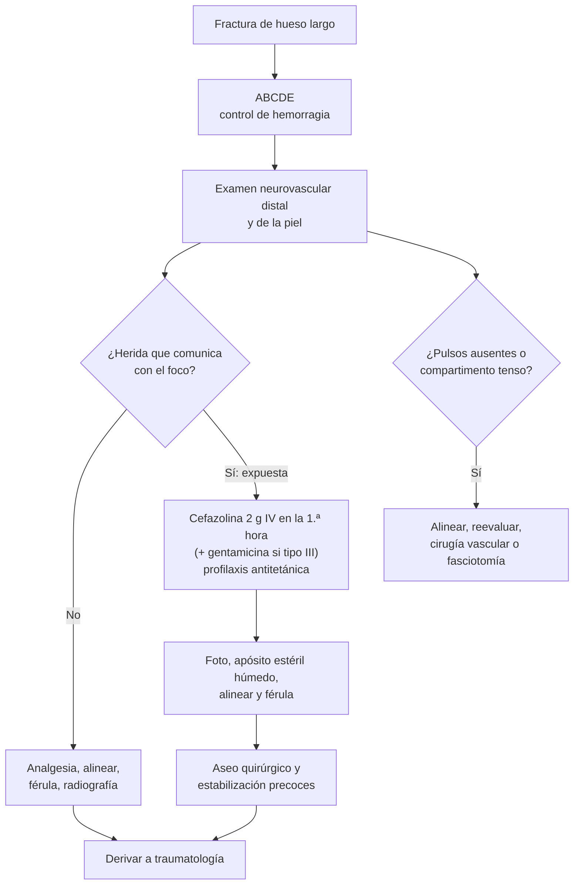

---
tags:
  - Traumatología
  - Urgencia
---

# Fracturas de diáfisis y metáfisis, y fracturas expuestas

**Subespecialidad**
Traumatología y ortopedia · Urgencia

**Guías principales**
EAST 2011: profilaxis antibiótica en fracturas expuestas (*J Trauma*) · Clasificación de Gustilo y Anderson (1976 y 1984) · Principios del manejo de las fracturas expuestas (*Chin J Traumatol* 2018)

**Otras fuentes**
Estudio OPEN de epidemiología de las fracturas expuestas en el Reino Unido (*Bone Jt Open* 2022) · Ver [complicaciones de los traumatismos y del yeso](complicaciones-de-los-traumatismos-y-del-yeso.md), [politraumatizado](../cirugia/trauma-y-shock/trauma-y-politraumatizado.md) y [tétanos](../infectologia/tetanos.md)

**GES**
No como problema propio. El **politraumatizado grave** es GES N.° 48.

**EUNACOM**
4.02.2.007 Fracturas de diáfisis y metáfisis (específico, inicial, derivar) · 4.02.2.008 Fracturas expuestas (específico, inicial, derivar)

**Revisado**
Octubre 2026

!!! abstract "Resumen en 60 segundos"
    - **Sospecha**: dolor, impotencia funcional, deformidad, crepitación, movilidad anormal, equimosis.
    - **Primero el ABCDE**: la fractura de **fémur** puede sangrar **1–1,5 L** y la de **pelvis** más.
    - **Examen neurovascular distal** antes y después de cualquier maniobra.
    - **Radiografía**: **2 proyecciones** ortogonales que incluyan las **articulaciones proximal y distal**.
    - **Manejo inicial**: analgesia, **alinear** con tracción suave e **inmovilizar** con una **férula** (no un yeso circular en el trauma agudo). Incluir la articulación de arriba y la de abajo, y derivar.
    - **Diáfisis con complicaciones típicas**:
        - **Húmero**: lesión del **nervio radial** (mano caída).
        - **Fémur**: sangrado, embolia grasa; fijación precoz.
        - **Tibia**: la fractura expuesta más frecuente y **síndrome compartimental**.
        - **Antebrazo**: lesiones de **Monteggia** y **Galeazzi**.
    - **Fractura expuesta** = comunicación del foco con el exterior. Es una **urgencia**:
        1. **Antibiótico IV en la primera hora**: **cefazolina 2 g IV**. En el tipo III, agregar **gentamicina**; si hay contaminación fecal o con tierra de cultivo, **penicilina en dosis altas**.
        2. Profilaxis del **tétanos**.
        3. Foto de la herida, **apósito estéril húmedo**, alinear y **férula**.
        4. **Aseo quirúrgico** y estabilización precoces.
    - **Gustilo y Anderson**: **I** herida < 1 cm limpia; **II** 1–10 cm; **III** > 10 cm, alta energía o contaminación (IIIA cobertura posible, **IIIB** requiere colgajo, **IIIC** lesión arterial que requiere reparación).

## Definición

- **Fractura**: pérdida de la continuidad de un hueso.
- **Diáfisis**: porción central (tubular) de un hueso largo, de hueso cortical.
- **Metáfisis**: zona ensanchada entre la diáfisis y la epífisis, de hueso esponjoso. En el niño contiene la **fisis** (cartílago de crecimiento) en su límite con la epífisis.
- **Fractura cerrada**: piel indemne o sin comunicación con el foco.
- **Fractura expuesta (abierta)**: el foco de fractura o su hematoma **se comunica con el exterior** a través de una herida de la piel o las mucosas. Toda herida en el mismo segmento de una fractura se considera **expuesta hasta demostrar lo contrario**.
- **Fractura patológica**: ocurre en un hueso debilitado (metástasis, tumor, osteoporosis grave) con un trauma mínimo.
- **Fractura por estrés (fatiga)**: por cargas repetidas en un hueso normal (metatarsianos, tibia en deportistas o reclutas).

## Epidemiología

### Mundial

- Las fracturas de la **diáfisis tibial** son las fracturas de huesos largos más frecuentes y las que con más frecuencia son **expuestas**, por la escasa cobertura de partes blandas de su cara anteromedial.
- **Estudio OPEN** (Reino Unido, 51 centros, 1175 pacientes con fracturas expuestas; Hadfield 2022):
    - Edad mediana de **47 años**; **61 %** hombres.
    - **51 %** de las fracturas fueron de la **pierna**.
    - Mecanismos: **vehículos o colisiones (39 %)**, con una edad mediana de 35 años, y **caídas de menos de 2 m (35 %)**, con una edad mediana de 66 años.
    - Hay dos poblaciones: **jóvenes con trauma de alta energía** y **adultos mayores frágiles con trauma de baja energía**.
- Las fracturas metafisarias de baja energía (radio distal, húmero proximal, meseta tibial, cadera) son típicas del **adulto mayor con osteoporosis**.

### Chile

!!! chile "Datos nacionales"
    - El **politraumatizado grave** tiene garantía **GES N.° 48** (atención en urgencia y traslado a un centro con capacidad resolutiva).
    - Los **accidentes de tránsito** (motos, atropellos) y **del trabajo** son causas frecuentes de fracturas diafisarias y expuestas en adultos jóvenes. Las del trabajo los cubre la **Ley 16.744** a través de las mutualidades y el ISL.
    - Las fracturas por fragilidad del adulto mayor aumentan con el envejecimiento de la población (ver [osteoporosis](../endocrinologia/osteoporosis.md) y [fractura de cadera](../geriatria/caidas-hipotension-ortostatica-y-fractura-de-cadera.md)).

## Etiología y factores de riesgo

| Mecanismo | Patrón de fractura |
|---|---|
| **Directo** (golpe, atropello, aplastamiento) | **Transversa**, **conminuta**, con más daño de partes blandas (más expuestas) |
| **Indirecto por torsión** (pie fijo, cuerpo que gira) | **Espiroidea** |
| **Indirecto por flexión** | **Oblicua** corta, con un tercer fragmento en "ala de mariposa" |
| **Compresión axial** (caída de altura) | **Aplastamiento** de la metáfisis (meseta tibial, calcáneo, vértebras) |
| **Tracción** (contracción muscular) | **Avulsión** (tuberosidades, espinas ilíacas) |
| **Baja energía en un hueso frágil** | Fractura por fragilidad o **patológica** |

**Factores de riesgo de infección en las fracturas expuestas**: grado de Gustilo (III), contaminación (tierra de cultivo, agua estancada, heces), **retraso del antibiótico**, tabaquismo, diabetes, desnutrición, lesión vascular.

## Fisiopatología

- **Consolidación secundaria** (fracturas no fijadas en forma rígida):
    1. **Hematoma e inflamación** (días).
    2. **Callo blando** fibrocartilaginoso (semanas).
    3. **Callo duro** óseo (6–12 semanas).
    4. **Remodelación** (meses a años).
- **Consolidación primaria** (fijación rígida con compresión, placas): sin callo visible.
- El hueso **metafisario** (esponjoso, muy vascularizado) consolida **más rápido** que el **diafisario** (cortical). La tibia tarda **4–5 meses**; el radio distal, **6 semanas**.
- **Fractura expuesta**: la herida contamina el foco. El **tejido desvitalizado** y el hematoma son un medio de cultivo. La infección es más probable cuanto mayor es la energía, la contaminación y el tiempo hasta el antibiótico y el aseo quirúrgico. La lesión de las partes blandas también compromete la vascularización del hueso (retardo de consolidación, pseudoartrosis).

*Figura 1. Manejo inicial de una fractura de hueso largo en la urgencia. Esquema propio.*

## Clasificación

**Descripción de una fractura** (lo que hay que informar al traumatólogo):

| Elemento | Opciones |
|---|---|
| Hueso y **segmento** | Epífisis, **metáfisis**, **diáfisis** (tercio proximal, medio, distal) |
| **Piel** | **Cerrada** o **expuesta** (Gustilo) |
| **Rasgo** | Transverso, oblicuo, **espiroideo**, **conminuto** (≥ 3 fragmentos), segmentario, en tallo verde o en rodete (niños) |
| **Desplazamiento** | Angulación, traslación, **acortamiento**, **rotación** |
| **Compromiso articular** | Extraarticular o **intraarticular** (peor pronóstico, requiere una reducción anatómica) |
| **Lesiones asociadas** | Neurovasculares, síndrome compartimental, luxación |

**Clasificación de Gustilo y Anderson** (fracturas expuestas; se define en el pabellón tras el aseo)

| Tipo | Herida | Energía, contaminación y partes blandas | Riesgo de infección |
|---|---|---|---|
| **I** | **< 1 cm**, limpia | Baja energía; fractura simple; generalmente "de adentro hacia afuera" | Bajo |
| **II** | **1–10 cm** | Daño moderado de partes blandas, sin colgajos extensos | Intermedio |
| **IIIA** | **> 10 cm** o cualquier tamaño con alta energía | Daño extenso pero con **cobertura ósea adecuada**; incluye fracturas conminutas, por arma de fuego y **contaminación grosera** (campo, agua) | Alto |
| **IIIB** | Igual | **Pérdida de partes blandas** con hueso expuesto: requiere **colgajo** para la cobertura | Muy alto |
| **IIIC** | Igual | **Lesión arterial que requiere reparación** | Muy alto; riesgo de amputación |

## Clínica

- **Síntomas**: dolor intenso, **impotencia funcional**, deformidad.
- **Signos**: aumento de volumen, equimosis, **deformidad** (angulación, acortamiento, rotación), **movilidad anormal** y **crepitación** (no buscarlas activamente: duelen y dañan los tejidos).
- **Herida** en el segmento fracturado: expuesta. Puede ser una herida puntiforme "de adentro hacia afuera" o una pérdida extensa de partes blandas.
- **Fracturas diafisarias específicas**:

| Fractura | Clave clínica |
|---|---|
| **Diáfisis humeral** | Lesión del **nervio radial** (surco espiral, tercio medio-distal): **mano caída**, sin extensión de la muñeca ni de los dedos, hipoestesia del dorso del primer espacio. La mayoría es una neuropraxia que se recupera |
| **Antebrazo (radio y cúbito)** | **Monteggia**: fractura del **cúbito** proximal + luxación de la **cabeza del radio**. **Galeazzi**: fractura del **radio** distal + luxación **radiocubital distal**. Riesgo de síndrome compartimental |
| **Diáfisis femoral** | Alta energía en el joven; **sangrado de 1–1,5 L**, embolia grasa, lesiones asociadas (cadera, rodilla). Muslo acortado y en rotación externa |
| **Diáfisis tibial** | La **más frecuentemente expuesta**; **síndrome compartimental**; retardo de consolidación y pseudoartrosis |
| **Húmero proximal** | Adulto mayor con caída; equimosis braquial extensa; lesión del nervio axilar (hipoestesia del deltoides) |
| **Meseta tibial** (metáfisis) | Compresión axial; hemartrosis, rodilla aumentada de volumen; síndrome compartimental |

## Diagnóstico

!!! guia "Puntos clave"
    - **Radiografía con la regla de los dos**: **2 proyecciones** (AP y lateral), **2 articulaciones** (proximal y distal) y, si hay duda, **2 extremidades** (comparar en el niño) o **2 momentos** (repetir en las fracturas ocultas como la del escafoides).
    - El diagnóstico de **fractura expuesta** es **clínico**: herida en el segmento fracturado. No explorar la herida con instrumentos en la urgencia.
    - La clasificación de **Gustilo** definitiva se hace en el **pabellón**, tras el aseo y el debridamiento (Gustilo 1976 y 1984).

## Laboratorio

| Examen | Uso |
|---|---|
| **Hemograma y grupo-Rh** | Fracturas de fémur o pelvis, politraumatizado; preparar la transfusión |
| **Pruebas de coagulación** | Antes de la cirugía; en el paciente anticoagulado |
| **Creatinina y electrolitos** | Antes de dar aminoglucósidos y de la cirugía; rabdomiólisis |
| **CK** | Aplastamiento, sospecha de síndrome compartimental |
| **Lactato** | Hipoperfusión en el politraumatizado |
| **Calcio, fósforo, PTH, electroforesis de proteínas** | **Fractura patológica** sin causa clara (descartar metástasis o mieloma) |

## Imágenes

| Examen | Indicación |
|---|---|
| **Radiografía** AP y lateral con las articulaciones vecinas | Todas las fracturas |
| **TC** | Fracturas **articulares** (meseta tibial, pilón, calcáneo, pelvis) para la planificación quirúrgica; politraumatizado |
| **ITB y angio-TC** | Sospecha de lesión arterial (signos blandos, luxación de rodilla, ITB < 0,9) |
| **RM** | Fracturas ocultas (escafoides, cuello femoral), fracturas por estrés, lesiones ligamentosas asociadas |
| **Radiografía de control** | Tras la reducción o el yeso; a los 7–10 días (pérdida de la reducción) y luego durante la consolidación |

## Diagnóstico diferencial

| Cuadro | Diferencia |
|---|---|
| **Contusión** | Sin deformidad ni crepitación; radiografía normal |
| **Esguince** | Dolor en un ligamento, sin dolor óseo; reglas de Ottawa (tobillo y rodilla) |
| **Luxación** | Pérdida de la congruencia articular; deformidad en la articulación, no en la diáfisis |
| **Fractura patológica** | Trauma mínimo, dolor previo, lesión lítica o blástica en la radiografía |
| **Fractura por estrés** | Dolor progresivo con la actividad, sin trauma; radiografía inicial normal |
| **Maltrato** | Fracturas múltiples en distintos estados de consolidación, inconsistentes con el mecanismo (niños, adultos mayores) |

## Tratamiento

**Manejo inicial de toda fractura** (en la urgencia)

1. **ABCDE** y control de la hemorragia (presión directa; torniquete si es una hemorragia exanguinante de una extremidad).
2. **Analgesia** (ver [manejo del dolor](../cirugia/anestesia-y-perioperatorio/manejo-del-dolor.md)).
3. **Examen neurovascular** y de la piel, y **registrarlo**.
4. **Alinear** con una **tracción suave** en el eje si hay una deformidad grosera o compromiso vascular.
5. **Inmovilizar** con una **férula** (valva de yeso, férula de tracción en el fémur) que incluya la articulación proximal y la distal. **Evitar el yeso circular** en el trauma agudo.
6. **Repetir el examen neurovascular** y tomar la **radiografía**.
7. **Derivar** a traumatología.

**Tratamiento definitivo** (traumatólogo)

- **Ortopédico** (yeso, órtesis): fracturas estables, sin desplazamiento o reducibles (ej.: diáfisis humeral con órtesis funcional).
- **Quirúrgico**:
    - **Clavo endomedular**: diáfisis de **fémur** y **tibia** (estándar).
    - **Placas y tornillos**: antebrazo (reducción anatómica), fracturas articulares y metafisarias.
    - **Fijador externo**: fracturas expuestas graves, control de daños en el politraumatizado, gran daño de partes blandas.
- **Rehabilitación** precoz (kinesiterapia).

**Fractura expuesta**

1. **Antibiótico IV lo antes posible** (idealmente en la **primera hora**).
2. **Profilaxis antitetánica** según la vacunación (ver [tétanos](../infectologia/tetanos.md)).
3. **Manejo de la herida en la urgencia** (Diwan 2018):
    - Retirar la contaminación grosera visible.
    - **Fotografiar** la herida, para no destaparla repetidamente.
    - Cubrir con un **apósito estéril húmedo** con suero fisiológico.
    - **No explorar** la herida ni hacer aseos ni suturas en la urgencia.
4. **Alinear** la fractura y poner una **férula**.
5. **Aseo quirúrgico y debridamiento** en el pabellón, de forma **precoz**, por un equipo experimentado. La "regla de las 6 horas" ya no es estricta; hay urgencia inmediata si hay contaminación grosera, lesión vascular o síndrome compartimental.
6. **Estabilización** (fijador externo o interna) y **cobertura de las partes blandas** precoz. Los mejores resultados se obtienen cuando la reconstrucción se completa en **48–72 h** (Diwan 2018).

!!! dosis "Antibióticos en la fractura expuesta (adultos; EAST 2011)"
    | Situación | Esquema | Duración |
    |---|---|---|
    | **Todas** (cobertura de grampositivos) | **Cefazolina 2 g IV** (**3 g** si pesa ≥ 120 kg) cada 8 h | **Tipo I y II**: hasta **24 h** tras el cierre de la herida |
    | **Tipo III** (agregar gramnegativos) | Cefazolina + **gentamicina 5 mg/kg IV cada 24 h** (ajustar a la función renal) | Hasta **72 h** desde la lesión o **24 h** tras la cobertura de las partes blandas (lo que ocurra primero) |
    | **Contaminación fecal, de tierra de cultivo o agua estancada** (riesgo de *Clostridium*) | Agregar **penicilina G en dosis altas** (ej.: 4 millones de UI IV cada 4 h) | Igual que la anterior |
    | **Alergia grave a betalactámicos** | **Clindamicina 900 mg IV cada 8 h** (± gentamicina en el tipo III) | Igual |

    - Lo más importante es la **precocidad**: dar el antibiótico **en la urgencia**, sin esperar el pabellón.
    - **Tétanos**: vacuna dT si no tiene el refuerzo al día; **inmunoglobulina antitetánica 250–500 UI IM** si la vacunación es incompleta o desconocida (herida de alto riesgo).

!!! alarma "Derivar de inmediato o avisar al traumatólogo"
    - Fractura **expuesta** (después de dar el antibiótico y la profilaxis antitetánica).
    - Extremidad **sin pulsos** o con isquemia tras alinear.
    - **Síndrome compartimental**: dolor desproporcionado o al estiramiento pasivo.
    - **Déficit neurológico** nuevo tras una maniobra.
    - Fractura de **fémur** o de **pelvis** con inestabilidad hemodinámica.

## Complicaciones

- **Inmediatas**: **shock hemorrágico** (fémur, pelvis), **lesión vascular** (arteria braquial en la supracondílea, poplítea en la luxación de rodilla), **lesión nerviosa** (**radial** en la diáfisis humeral, **peroneo** en la fractura del cuello del peroné).
- **Precoces**: **síndrome compartimental** (tibia, antebrazo), **embolia grasa** (fémur), **TEV**, **infección** de la fractura expuesta, gangrena gaseosa, tétanos.
- **Tardías**: **osteomielitis** crónica (ver [osteomielitis](../infectologia/osteomielitis.md)), **retardo de consolidación**, **pseudoartrosis** (tibia, sobre todo expuesta), **consolidación viciosa**, rigidez, acortamiento, artrosis postraumática, amputación (IIIC).
- Ver [complicaciones de los traumatismos y del yeso](complicaciones-de-los-traumatismos-y-del-yeso.md).

## Pronóstico y seguimiento

- **Riesgo de infección según Gustilo**: aumenta del tipo I (bajo) al tipo III (alto), sobre todo IIIB y IIIC (Gustilo 1984).
- Las fracturas expuestas de tibia tipo III tienen tasas altas de pseudoartrosis, infección y reintervención, y una recuperación funcional prolongada.
- **Tiempos aproximados de consolidación en el adulto**: radio distal **6 semanas**; diáfisis humeral **8–12 semanas**; diáfisis femoral **12–16 semanas**; diáfisis tibial **16–20 semanas** (más en las expuestas).
- Seguimiento: control radiológico seriado, kinesiterapia y retorno progresivo a la carga según la indicación del traumatólogo.

## Perlas para el internado

!!! perla "Para recordar en la sala"
    - **Herida en el segmento de una fractura = fractura expuesta** hasta demostrar lo contrario.
    - En la expuesta, el **antibiótico va en la urgencia** (cefazolina 2 g IV), no en el pabellón. Agregar gentamicina en el tipo III y penicilina si hay contaminación con tierra o heces.
    - **No explorar ni suturar** la herida de una fractura expuesta en la urgencia: **foto, apósito estéril húmedo y férula**.
    - **Regla de los dos** en la radiografía: 2 proyecciones y 2 articulaciones.
    - **Diáfisis humeral → nervio radial** (mano caída); **tibia → compartimental**; **fémur → sangrado y embolia grasa**.
    - **Monteggia**: cúbito roto + cabeza del radio luxada. **Galeazzi**: radio roto + radiocubital distal luxada.
    - Fractura con un **trauma mínimo** = pensar en una **fractura patológica**.

## Preguntas de repaso

??? repaso "1. Motociclista de 28 años con una herida de 3 cm en la cara anterior de la pierna, por la que se ve el hueso, y deformidad. Está estable. ¿Qué hace en la urgencia?"
    - **Fractura expuesta de tibia** (probablemente Gustilo II; se clasifica en el pabellón).
    - **Cefazolina 2 g IV** inmediata y **profilaxis antitetánica** según la vacunación.
    - Retirar la contaminación grosera, **fotografiar** y cubrir con un **apósito estéril húmedo**. Alinear, poner una **férula** y hacer un **examen neurovascular** antes y después.
    - Radiografía y derivación para el **aseo quirúrgico y la estabilización** precoces. Vigilar el **síndrome compartimental**.

??? repaso "2. Agricultor con una fractura expuesta de pierna con una herida de 15 cm contaminada con tierra. ¿Qué antibióticos indica?"
    - Es una **Gustilo III** (herida > 10 cm, contaminación grosera).
    - **Cefazolina** + **gentamicina** (gramnegativos) + **penicilina G en dosis altas** (*Clostridium*, por la tierra de cultivo).
    - Duración: hasta 72 h desde la lesión o 24 h tras la cobertura de las partes blandas.
    - Además: profilaxis antitetánica (vacuna + inmunoglobulina si la vacunación es incompleta o desconocida).

??? repaso "3. Paciente con una fractura de la diáfisis humeral que no puede extender la muñeca ni los dedos. ¿Qué nervio está lesionado y cuál es el pronóstico?"
    - **Nervio radial** (surco espiral del húmero): **mano caída**, hipoestesia del dorso del primer espacio interdigital.
    - La mayoría es una **neuropraxia** que se recupera espontáneamente en semanas a meses. Se usa una órtesis para la muñeca y se hace un seguimiento clínico (± electromiografía).
    - Si la lesión aparece **después** de una maniobra de reducción, se evalúa una exploración quirúrgica.

??? repaso "4. Joven con una fractura de la diáfisis del cúbito proximal tras un golpe con un palo al protegerse la cabeza. ¿Qué debe buscar en la radiografía?"
    - Una **luxación de la cabeza del radio** (**lesión de Monteggia**).
    - Por eso la radiografía del antebrazo debe incluir el **codo** y la **muñeca** (regla de los dos).
    - Su manejo es quirúrgico en el adulto.

??? repaso "5. ¿Qué significa una fractura Gustilo IIIB y una IIIC?"
    - **IIIB**: fractura expuesta de alta energía con **pérdida de partes blandas** y hueso expuesto, que requiere un **colgajo** para la cobertura.
    - **IIIC**: fractura expuesta con una **lesión arterial que requiere reparación**. Tiene el mayor riesgo de amputación.

??? repaso "6. Mujer de 72 años con una fractura de la diáfisis femoral tras tropezar en su casa. La radiografía muestra una lesión lítica en el foco. ¿Qué sospecha y qué estudia?"
    - **Fractura patológica**: trauma mínimo en un hueso con una lesión lítica.
    - Sospechar **metástasis** (mama, pulmón, riñón, tiroides, próstata) o un **mieloma múltiple**.
    - Estudiar con hemograma, calcio, creatinina, **electroforesis de proteínas**, TC de tórax, abdomen y pelvis, y biopsia. Derivar a traumatología y oncología.

## Referencias

1. Gustilo RB, Anderson JT. Prevention of infection in the treatment of one thousand and twenty-five open fractures of long bones: retrospective and prospective analyses. *J Bone Joint Surg Am.* 1976;58(4):453–458. doi:[10.2106/00004623-197658040-00004](https://doi.org/10.2106/00004623-197658040-00004)
2. Gustilo RB, Mendoza RM, Williams DN. Problems in the management of type III (severe) open fractures: a new classification of type III open fractures. *J Trauma.* 1984;24(8):742–746. doi:[10.1097/00005373-198408000-00009](https://doi.org/10.1097/00005373-198408000-00009)
3. Hoff WS, Bonadies JA, Cachecho R, Dorlac WC. East Practice Management Guidelines Work Group: update to practice management guidelines for prophylactic antibiotic use in open fractures. *J Trauma.* 2011;70(3):751–754. doi:[10.1097/TA.0b013e31820930e5](https://doi.org/10.1097/TA.0b013e31820930e5)
4. Diwan A, Eberlin KR, Smith RM. The principles and practice of open fracture care, 2018. *Chin J Traumatol.* 2018;21(4):187–192. doi:[10.1016/j.cjtee.2018.01.002](https://doi.org/10.1016/j.cjtee.2018.01.002)
5. Hadfield JN, Omogbehin TS, Brookes C, et al. The Open-Fracture Patient Evaluation Nationwide (OPEN) study: epidemiology of open fracture care in the UK. *Bone Jt Open.* 2022;3(10):746–752. doi:[10.1302/2633-1462.310.BJO-2022-0079.R1](https://doi.org/10.1302/2633-1462.310.BJO-2022-0079.R1)
