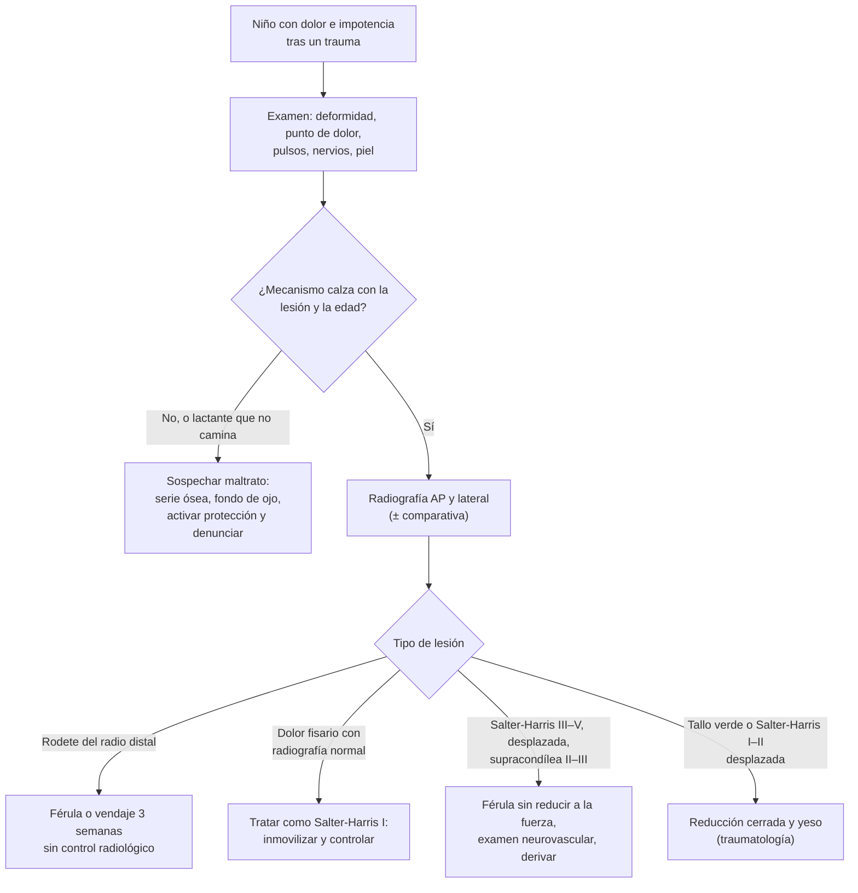

---
tags:
  - Traumatología
  - Urgencia
  - Frecuente en sala
---

# Fracturas y disyunciones epifisarias del niño

**Subespecialidad**
Ortopedia infantil · Urgencia pediátrica

**Guías principales**
Clasificación de Salter y Harris (*J Bone Joint Surg Am* 1963) · Revisión del manejo de la fractura supracondílea del húmero (*EFORT Open Rev* 2018) · Ensayo FORCE de las fracturas en rodete de la muñeca (*Lancet* 2022)

**Otras fuentes**
Ver [fracturas de diáfisis y metáfisis](fracturas-de-diafisis-y-metafisis-y-fracturas-expuestas.md), [complicaciones de los traumatismos y del yeso](complicaciones-de-los-traumatismos-y-del-yeso.md) y [osteomielitis](../infectologia/osteomielitis.md)

**GES**
No. El **politraumatizado grave** (N.° 48) incluye a los niños.

**EUNACOM**
4.02.2.002 Disyunción-fractura del niño (sospecha, completo, completo) · Pediatría: 2.01.2.009 Fracturas (específico, inicial, derivar)

**Revisado**
Octubre 2026

!!! abstract "Resumen en 60 segundos"
    - El hueso del niño es **más elástico**, tiene un **periostio grueso** y una **fisis** (cartílago de crecimiento) que es su **punto débil**. Esto explica:
        - Las fracturas **en rodete (torus)**, **en tallo verde** y la **deformación plástica**.
        - Las **lesiones fisarias (disyunciones)**.
        - Una gran **capacidad de remodelación**.
    - **Salter-Harris**:
        - **I**: a través de la fisis (radiografía a veces normal).
        - **II**: fisis + fragmento metafisario (la **más frecuente**).
        - **III**: fisis + epífisis (intraarticular).
        - **IV**: metáfisis, fisis y epífisis.
        - **V**: compresión.
        - Los tipos **III–V** requieren una **reducción anatómica**: riesgo de **detención del crecimiento**.
    - **Dolor sobre la fisis con radiografía normal** = tratar como un **Salter-Harris I** (inmovilizar y controlar).
    - **Fractura en rodete** del radio distal: estable; basta con una **férula o vendaje** removible por ~ 3 semanas (FORCE 2022).
    - **Fractura supracondílea del húmero** (niños de 5–7 años, caída con el brazo extendido): la fractura de **codo** más frecuente.
        - Examinar el **pulso radial** y los **nervios** (interóseo anterior: signo del "OK"; radial; cubital).
        - **Gartland I**: yeso. **II–III**: reducción y **agujas percutáneas**.
        - Complicaciones: **lesión de la arteria braquial**, **síndrome compartimental** (contractura de Volkmann), **cúbito varo**.
    - **Pronación dolorosa** ("codo de niñera"; preescolar al que tiraron del brazo): no mueve el brazo, sin deformidad. Se trata con una **maniobra de supinación-flexión o hiperpronación**, sin radiografía.
    - **Sospechar maltrato**:
        - Fracturas en **lactantes que no caminan**.
        - Fracturas de **costillas posteriores** o **metafisarias "en asa de balde"**.
        - Fracturas múltiples en distintas etapas de consolidación.
        - Mecanismo que **no calza**.

## Definición

- **Fisis (cartílago de crecimiento)**: placa cartilaginosa entre la **epífisis** y la **metáfisis**, responsable del crecimiento longitudinal del hueso. Es **más débil que los ligamentos** en el niño: por eso un mecanismo que en el adulto produce un esguince en el niño produce una lesión fisaria.
- **Disyunción epifisaria (lesión fisaria)**: fractura que compromete la fisis. Se clasifica según **Salter y Harris**.
- **Fractura en rodete (torus o "buckle")**: compresión de la cortical metafisaria, que se abomba sin romperse del todo. Es **estable**.
- **Fractura en tallo verde**: rotura de la cortical del lado de la convexidad con la cortical cóncava indemne (deformada).
- **Deformación plástica**: el hueso se curva sin una línea de fractura visible (cúbito, peroné).
- **Pronación dolorosa** (subluxación de la cabeza del radio): el **ligamento anular** se desliza sobre la cabeza del radio por una **tracción** del brazo en extensión y pronación.

## Epidemiología

### Mundial

- Las fracturas son muy frecuentes en la infancia. Las de la **extremidad superior** predominan (radio distal, codo, clavícula).
- La **fractura del radio distal** (incluidas las en rodete) es la fractura más frecuente del niño.
    - En el ensayo **FORCE** se aleatorizaron **965 niños** con fracturas en rodete del radio distal.
    - El dolor y la función con el **vendaje** fueron **equivalentes** a los de la inmovilización rígida (Perry 2022).
- La **fractura supracondílea del húmero** representa el **55–80 %** de las fracturas del codo en los niños y hasta **dos tercios** de las lesiones del codo que requieren hospitalización. Es típica de los niños de **5–7 años** por caídas desde la altura (juegos, camas elásticas) (Vaquero-Picado 2018).
- Las **lesiones fisarias** son frecuentes. El tipo **II de Salter-Harris** es el más común.
- La **pronación dolorosa** es la lesión del codo más frecuente en los **preescolares** (1–4 años).

### Chile

!!! chile "Datos nacionales"
    - No hay estadísticas nacionales publicadas de buena calidad sobre las fracturas infantiles.
    - Ante la sospecha de **maltrato infantil**, el médico tiene la obligación de **denunciar** (Código Procesal Penal) y de activar la red de protección (OPD, Tribunales de Familia). Ver el capítulo de pediatría.
    - El **politraumatizado grave** pediátrico tiene garantía **GES N.° 48** y el **TEC moderado o grave**, **GES N.° 49**.

## Etiología y factores de riesgo

| Lesión | Mecanismo típico |
|---|---|
| **Fractura en rodete del radio distal** | Caída con la mano extendida (baja energía) |
| **Fractura supracondílea del húmero** (en extensión, ~ 95 %) | **Caída con el brazo extendido** desde la altura (juegos, camas elásticas) |
| **Fractura de clavícula** | Caída sobre el hombro; también en el **parto** (recién nacido macrosómico) |
| **Lesiones fisarias** | Caídas, deportes, torsión (tobillo, radio distal, falanges) |
| **Pronación dolorosa** | **Tracción** del brazo extendido (levantar al niño de la mano, tironear) |
| **Fractura del fémur** en el lactante | **Maltrato** hasta demostrar lo contrario si no camina |
| **Fractura de "los primeros pasos"** (espiroidea de la tibia, en el niño que empieza a caminar) | Torsión con el pie fijo; baja energía |

## Fisiopatología

- **Hueso infantil**: más poroso y elástico, con un **periostio grueso y activo**.
    - Absorbe energía deformándose: rodete, tallo verde, deformación plástica.
    - El periostio intacto ayuda a la **reducción** y estabiliza la fractura.
    - La **consolidación es rápida** (la mitad del tiempo que en el adulto).
    - Hay una gran **capacidad de remodelación**, sobre todo cuanto más **joven** es el niño, más **cerca de la fisis** está la fractura y más en el **plano de movimiento** de la articulación vecina. **La rotación no se remodela.**
- **Fisis**:
    - La zona débil es la **zona hipertrófica** (de células que se hipertrofian y calcifican). Las fracturas tipo I y II la atraviesan sin dañar la capa germinal, por eso tienen buen pronóstico.
    - Los tipos **III y IV** cruzan la capa germinal y la superficie articular. El tipo **V** la aplasta.
    - Puede formarse un **puente óseo** que detiene el crecimiento: **acortamiento** o **deformidad angular**.
- **Supracondílea**: la zona supracondílea es delgada en el niño de 5–7 años y la hiperextensión del codo concentra la fuerza allí. El fragmento distal se desplaza hacia **posterior** y puede **lesionar la arteria braquial y el nervio mediano** (sobre todo el interóseo anterior) o el **radial**.

<figure markdown>
{ loading=lazy }
<figcaption>Figura 1. Clasificación de Salter-Harris de las lesiones fisarias. Esquema propio basado en Salter y Harris (1963).</figcaption>
</figure>

*Figura 2. Enfoque del niño con una sospecha de fractura. Esquema propio.*

## Clasificación

**Salter-Harris** (lesiones fisarias)

| Tipo | Trazo | Frecuencia | Pronóstico y manejo |
|---|---|---|---|
| **I** | **A través de la fisis** (separación) | Frecuente en los niños pequeños | Buen pronóstico; la radiografía puede ser **normal** (solo dolor sobre la fisis). Inmovilización |
| **II** | Fisis + **fragmento metafisario** (signo de Thurston-Holland) | **La más frecuente** | Buen pronóstico; reducción cerrada y yeso |
| **III** | Fisis + **epífisis** (intraarticular) | Menos frecuente | Requiere una **reducción anatómica** (a menudo quirúrgica) |
| **IV** | **Metáfisis + fisis + epífisis** | Menos frecuente | **Reducción anatómica** quirúrgica; riesgo de puente óseo |
| **V** | **Compresión** de la fisis | Rara; diagnóstico retrospectivo | Mal pronóstico: **detención del crecimiento** |

**Fractura supracondílea del húmero en extensión (Gartland)**

| Tipo | Descripción | Tratamiento |
|---|---|---|
| **I** | **No desplazada** (puede verse solo el signo de la almohadilla grasa posterior) | **Yeso** braquiopalmar con el codo a ~ 90° por 3 semanas |
| **II** | Desplazada con la **cortical posterior indemne** (bisagra) | Reducción cerrada y **agujas percutáneas** (la mayoría) |
| **III** | **Completamente desplazada** | **Reducción cerrada y agujas percutáneas** (estándar) |
| **IV** | Inestable en flexión y extensión (se diagnostica en el pabellón) | Igual, con técnicas especiales |

- La **reducción cerrada y la fijación percutánea con agujas** es el estándar de oro de las fracturas desplazadas (Vaquero-Picado 2018).

## Clínica

- **Dolor localizado** en un punto óseo, **aumento de volumen**, impotencia funcional, deformidad. El niño pequeño puede solo **no usar la extremidad** o **no querer caminar**.
- **Lesión fisaria**: dolor a la palpación **sobre la fisis** (no sobre el ligamento) tras un "esguince". En el niño, un "esguince de tobillo" con dolor sobre la fisis distal del peroné es un **Salter-Harris I** hasta demostrar lo contrario.
- **Fractura supracondílea**:
    - Codo muy aumentado de volumen, deformidad en "**S**".
    - **Arruga cutánea** en la fosa antecubital (signo de alta energía: el fragmento atravesó el braquial anterior).
    - **Examen neurovascular** obligatorio:
        - **Pulso radial**, color y llene capilar ("mano rosada sin pulso" frente a "mano pálida sin pulso").
        - **Interóseo anterior**: flexión de la interfalángica distal del índice y del pulgar ("**OK**").
        - **Radial**: extensión del pulgar.
        - **Cubital**: separación de los dedos.
- **Pronación dolorosa**:
    - Niño de **1–4 años**, tras una tracción del brazo.
    - **Llora y luego no usa el brazo**, que mantiene en extensión y **pronación**, colgando junto al cuerpo.
    - Sin aumento de volumen, deformidad ni dolor óseo importante.
- **Fractura de clavícula del recién nacido**: crepitación, Moro asimétrico, pseudoparálisis.

## Diagnóstico

!!! guia "Puntos clave"
    - **Radiografía AP y lateral**. La **comparativa** del lado sano ayuda a interpretar las fisis y los núcleos de osificación, sobre todo en el codo.
    - **Codo**: la **almohadilla grasa posterior** visible es un signo de una **fractura oculta**. La **línea humeral anterior** debe cruzar el **tercio medio del capitellum** en la lateral; en la supracondílea en extensión pasa por delante (Vaquero-Picado 2018).
    - **Dolor sobre la fisis con una radiografía normal**: se trata como un **Salter-Harris I** (inmovilización y control clínico en 1–2 semanas).
    - La **pronación dolorosa típica no requiere radiografía**. Se hace si el mecanismo es atípico, hay aumento de volumen o la maniobra no resuelve el cuadro.
    - **Maltrato**: ante una sospecha en un menor de 2 años, solicitar una **serie ósea** completa (y otros estudios según la edad).

## Laboratorio

- Habitualmente no se requieren exámenes de laboratorio.
- **Fracturas con un trauma mínimo o repetidas**: estudiar un **raquitismo** (calcio, fósforo, fosfatasa alcalina, 25-OH vitamina D, PTH), una **osteogénesis imperfecta** (escleras azules, antecedentes familiares) o una **lesión patológica** (quiste óseo, tumor).
- **Fiebre con dolor óseo y cojera**: hemograma, PCR y VHS para descartar una **osteomielitis o artritis séptica** (ver [osteomielitis](../infectologia/osteomielitis.md)).

## Imágenes

| Examen | Uso |
|---|---|
| **Radiografía AP y lateral** (± comparativa) | Todas las sospechas de fractura |
| **Radiografía de control** | Fracturas reducidas (pérdida de la reducción); no es necesaria en las fracturas en rodete |
| **Serie ósea** | Sospecha de maltrato en < 2 años |
| **TC** | Fracturas fisarias articulares complejas (fractura triplanar del tobillo, tipo III–IV) |
| **RM** | Lesiones fisarias ocultas, puentes óseos fisarios (secuela) |
| **Ecografía** | Codo en lactantes (epífisis no osificadas), derrames articulares |

## Diagnóstico diferencial

| Cuadro | Diferencia |
|---|---|
| **Esguince** vs. **Salter-Harris I** | En el niño, el dolor sobre la **fisis** indica una lesión fisaria; los esguinces son menos frecuentes antes del cierre fisario |
| **Pronación dolorosa** vs. **fractura** | La pronación dolorosa no tiene aumento de volumen, deformidad ni mecanismo de caída, y se resuelve con la maniobra |
| **Fractura** vs. **osteomielitis o artritis séptica** | Fiebre, PCR alta, sin trauma claro; urgencia |
| **Fractura accidental** vs. **maltrato** | Mecanismo inconsistente, retraso en la consulta, lactante que no camina, fracturas múltiples o de distinta antigüedad, costillas posteriores, metafisarias en "asa de balde" |
| **Fractura patológica** | Quiste óseo simple (húmero proximal), tumor, osteogénesis imperfecta |
| **Leucemia** | Dolor óseo difuso, nocturno, con citopenias y visceromegalias |

## Tratamiento

**Principios**

1. **Analgesia** (paracetamol, ibuprofeno; opioides si el dolor es intenso). Considerar el **fentanilo intranasal** en la urgencia pediátrica si está disponible.
2. **Examen neurovascular** antes y después de cualquier maniobra.
3. **Inmovilización** con una **férula** que incluya la articulación proximal y la distal. No hacer **reducciones forzadas ni repetidas** de las lesiones fisarias (dañan la fisis).
4. **Derivar** a traumatología infantil las fracturas desplazadas, las fisarias tipo III–V, las supracondíleas II–IV, las expuestas y las que tienen compromiso neurovascular.
5. **Control** del crecimiento en las lesiones fisarias (radiografías a los 6–12 meses).

**Manejo por lesión**

| Lesión | Tratamiento |
|---|---|
| **Fractura en rodete del radio distal** | **Férula removible o vendaje** por ~ **3 semanas**; **sin control radiológico** (FORCE 2022) |
| **Tallo verde del antebrazo** | Reducción cerrada (completar la fractura si la angulación es importante) y yeso braquiopalmar |
| **Salter-Harris I–II no desplazada** | Yeso o férula por 3–4 semanas |
| **Salter-Harris I–II desplazada** | Reducción cerrada **suave** y yeso; control radiológico |
| **Salter-Harris III–IV** | **Reducción anatómica** (habitualmente quirúrgica) |
| **Supracondílea Gartland I** | Yeso braquiopalmar con el codo a ~ 90° por 3 semanas |
| **Supracondílea Gartland II–III** | Reducción cerrada y **agujas percutáneas**; codo a ~ 70° tras la fijación |
| **Supracondílea con mano pálida sin pulso** | **Reducción urgente**; si sigue sin perfusión tras la reducción, explorar la arteria braquial |
| **Fractura de clavícula** | **Cabestrillo** por 2–3 semanas (en el recién nacido, fijar la manga al cuerpo); consolida con un callo palpable |
| **Fractura de "los primeros pasos"** | Yeso o bota por 3–4 semanas |
| **Pronación dolorosa** | **Hiperpronación** del antebrazo (más efectiva) o **supinación con flexión del codo**, sintiendo un "clic" sobre la cabeza del radio. El niño usa el brazo en minutos. Educar a los padres (no levantarlo de las manos) |

!!! dosis "Analgesia pediátrica habitual"
    | Fármaco | Dosis | Máximo |
    |---|---|---|
    | **Paracetamol** | **15 mg/kg** VO cada 6 h | 60–75 mg/kg/día (4 g/día) |
    | **Ibuprofeno** | **10 mg/kg** VO cada 6–8 h | 40 mg/kg/día (2,4 g/día) |
    | **Fentanilo intranasal** | **1,5 µg/kg** (dosis única; se puede repetir 0,5–1 µg/kg) | Monitorizar la saturación |
    | **Morfina IV** | **0,1 mg/kg** | Con monitorización |

!!! alarma "Urgencia o derivación inmediata"
    - **Supracondílea con la mano pálida y sin pulso**, o con un **dolor creciente** que no cede (**síndrome compartimental** del antebrazo: riesgo de **contractura de Volkmann**).
    - **Fractura expuesta**.
    - **Déficit neurológico**.
    - **Sospecha de maltrato**: hospitalizar para proteger al niño, estudiar, notificar y denunciar.

## Complicaciones

- **Lesiones fisarias**: **detención del crecimiento** por un puente óseo, con **dismetría** o una **deformidad angular** (más en los tipos III–V y en la fisis femoral distal y tibial proximal).
- **Fractura supracondílea**:
    - **Lesión vascular** (arteria braquial) y **síndrome compartimental** (contractura isquémica de **Volkmann**).
    - **Lesiones nerviosas**: el interóseo anterior y el radial, la mayoría neuropraxias; el cubital, por las agujas mediales.
    - **Cúbito varo** ("deformidad en culata de fusil"): consolidación viciosa por la rotación interna del fragmento distal.
- **Consolidación viciosa**: la rotación no se remodela.
- **Refractura** del antebrazo tras retirar el yeso.
- **Sobrecrecimiento** del fémur (fracturas diafisarias en los niños pequeños).

## Pronóstico y seguimiento

- La mayoría de las fracturas infantiles **consolidan rápido** y **remodelan** bien, con excelentes resultados.
- Las **lesiones fisarias** requieren un **seguimiento** del crecimiento por **6–12 meses** o más (según la fisis y la edad) para detectar un puente óseo.
- La **supracondílea** tratada a tiempo tiene un buen pronóstico. La rigidez es rara y suele reflejar una consolidación viciosa (Vaquero-Picado 2018).
- La **pronación dolorosa** puede **recidivar** hasta los 5 años; luego es rara.

## Perlas para el internado

!!! perla "Para recordar en la sala"
    - En el niño, la **fisis es más débil que el ligamento**: un "esguince" con **dolor sobre la fisis** es un **Salter-Harris I**.
    - **Salter-Harris**: tipo II el más frecuente; los tipos **III–V** amenazan el crecimiento y requieren una reducción anatómica.
    - **Fractura en rodete**: férula o vendaje por 3 semanas, **sin radiografía de control**.
    - **Supracondílea**: buscar el **pulso radial** y hacer el "**OK**" (interóseo anterior). Cuidado con el **compartimental**.
    - **Almohadilla grasa posterior** visible en el codo = **fractura oculta**.
    - **Pronación dolorosa**: tracción del brazo + brazo en pronación colgando: **hiperpronación** y listo, **sin radiografía**.
    - **Lactante que no camina con una fractura = maltrato** hasta demostrar lo contrario.

## Preguntas de repaso

??? repaso "1. Niño de 6 años que cayó de un columpio con el brazo extendido. Tiene el codo deformado y muy aumentado de volumen. ¿Qué evalúa primero y qué sospecha?"
    - **Fractura supracondílea del húmero** en extensión (la fractura de codo más frecuente en esta edad).
    - Evaluar el **pulso radial**, el color y el llene capilar, y los **nervios**: interóseo anterior (**"OK"**), radial (extensión del pulgar) y cubital (separación de los dedos).
    - Analgesia, **férula** en la posición en que está (sin forzar la flexión), radiografía y **derivación urgente** a traumatología infantil. Probable Gartland III: reducción cerrada y agujas.
    - Vigilar el **síndrome compartimental** del antebrazo.

??? repaso "2. Niña de 2 años que, tras ser levantada de la mano por su madre, llora y no mueve el brazo, que mantiene extendido y en pronación. No hay aumento de volumen. ¿Qué hace?"
    - **Pronación dolorosa** (subluxación de la cabeza del radio).
    - **No requiere radiografía** si el cuadro es típico.
    - **Maniobra de hiperpronación** (o supinación con flexión del codo), sintiendo el clic; la niña usa el brazo en minutos.
    - Educar para no levantarla ni tironearla de las manos (puede recidivar).

??? repaso "3. Niño de 9 años con un traumatismo de tobillo por inversión, con dolor a la palpación sobre la fisis distal del peroné y una radiografía normal. ¿Cuál es el diagnóstico y el manejo?"
    - **Lesión fisaria Salter-Harris I** del peroné distal (en el niño, la fisis es más débil que el ligamento).
    - **Inmovilizar** (bota o férula) por 3–4 semanas y controlar clínicamente.

??? repaso "4. Niño de 8 años con una caída sobre la mano y una radiografía con abombamiento de la cortical metafisaria del radio distal, sin otras alteraciones. ¿Cuál es el tratamiento?"
    - **Fractura en rodete (torus)**: estable.
    - **Férula removible o vendaje** por ~ 3 semanas, **sin control radiológico**. El ensayo FORCE mostró que el vendaje es equivalente a la inmovilización rígida en el dolor y la función.

??? repaso "5. Lactante de 4 meses llevado a la urgencia por aumento de volumen del muslo. La madre dice que "se le dobló la pierna en la cama". La radiografía muestra una fractura del fémur. ¿Qué debe hacer?"
    - Un lactante que **no camina** con una fractura del fémur y un mecanismo que **no calza** = **sospecha de maltrato infantil**.
    - Manejar la fractura (analgesia, inmovilización), **hospitalizar** para proteger al niño y hacer una **serie ósea**, un fondo de ojo y una evaluación integral.
    - **Denunciar** y activar la red de protección. Registrar con cuidado la historia y los hallazgos.

??? repaso "6. ¿Por qué las lesiones Salter-Harris III y IV requieren una reducción anatómica?"
    - Porque **cruzan la capa germinal de la fisis** y la **superficie articular**.
    - Una reducción imperfecta favorece la formación de un **puente óseo** (detención del crecimiento, deformidad angular, dismetría) y una **artrosis** postraumática.

## Referencias

1. Salter RB, Harris WR. Injuries involving the epiphyseal plate. *J Bone Joint Surg Am.* 1963;45(3):587–622. doi:[10.2106/00004623-196345030-00019](https://doi.org/10.2106/00004623-196345030-00019)
2. Vaquero-Picado A, González-Morán G, Moraleda L. Management of supracondylar fractures of the humerus in children. *EFORT Open Rev.* 2018;3(10):526–540. doi:[10.1302/2058-5241.3.170049](https://doi.org/10.1302/2058-5241.3.170049)
3. Perry DC, Achten J, Knight R, et al. Immobilisation of torus fractures of the wrist in children (FORCE): a randomised controlled equivalence trial in the UK. *Lancet.* 2022;400(10345):39–47. doi:[10.1016/S0140-6736(22)01015-7](https://doi.org/10.1016/S0140-6736(22)01015-7)
