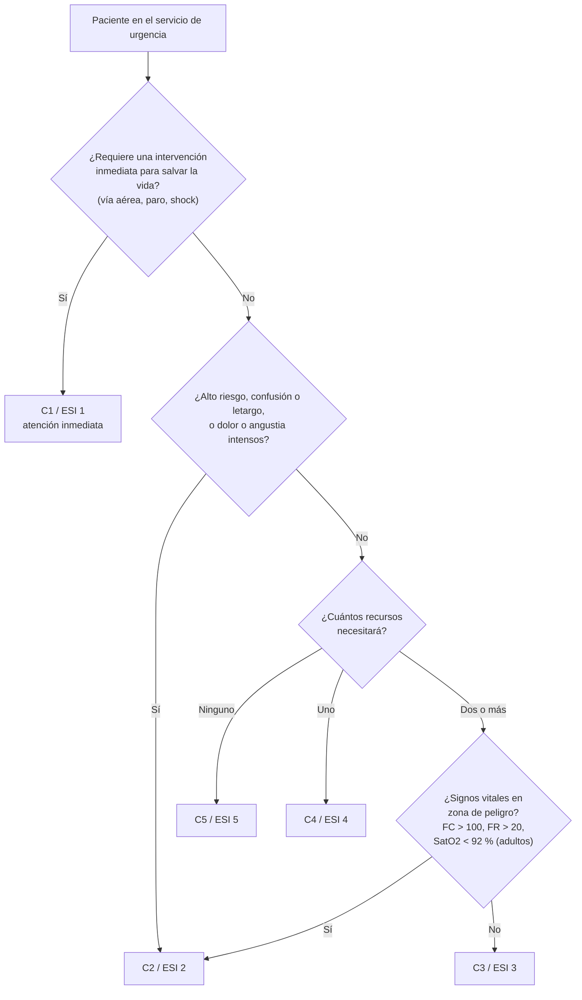

---
tags:
  - Traumatología
  - Urgencia
---

# Triage: categorización en el servicio de urgencia y en las catástrofes

**Subespecialidad**
Medicina de urgencia · Gestión clínica · Desastres

**Guías principales**
Índice de Severidad de Emergencia (ESI), manual de implementación, versión 4 · Sistema de triage de Manchester · Triage START y SALT en las víctimas múltiples

**Otras fuentes**
Revisión sistemática del desempeño de los sistemas de triage (*BMJ Open* 2019) · Exactitud y confiabilidad del ESI (*Ann Emerg Med* 2018) · Ver [politraumatizado y catástrofes](../cirugia/trauma-y-shock/trauma-y-politraumatizado.md)

**GES**
No aplica. Muchas garantías GES de urgencia (politraumatizado, TEC, infarto, ACV) dependen de una categorización correcta.

**EUNACOM**
4.02.3.007 Triage (conocimiento general)

**Revisado**
Octubre 2026

!!! abstract "Resumen en 60 segundos"
    - **Triage**: clasificar a los pacientes según la **urgencia** (no según el orden de llegada), para atender primero a quien más lo necesita cuando la demanda supera los recursos.
    - **En el servicio de urgencia en Chile** se categoriza en **5 niveles (C1 a C5)**, habitualmente con el **ESI** (Índice de Severidad de Emergencia):
        - **C1**: necesita una **intervención inmediata para salvar la vida** (paro, intubación, shock).
        - **C2**: **alto riesgo**, confusión, letargo o desorientación, o **dolor o angustia intensos** (dolor torácico típico, déficit neurológico agudo).
        - **C3 a C5**: según el **número de recursos** que se anticipa que necesitará (**≥ 2** = C3; **1** = C4; **ninguno** = C5).
        - Un C3 con **signos vitales en zona de peligro** se puede subir a C2.
    - **Manchester**: 5 colores con tiempos objetivo (rojo inmediato, naranja 10 min, amarillo 60 min, verde 120 min, azul 240 min).
    - **Catástrofes y víctimas múltiples**: **START** en los adultos (JumpSTART en los niños).
        - **Verde**: camina.
        - **Negro**: no respira tras abrir la vía aérea.
        - **Rojo**: FR > 30, llene capilar > 2 s o no obedece órdenes.
        - **Amarillo**: el resto.
    - El triage es **dinámico**: **reevaluar** a los pacientes en espera.
    - Ningún sistema es perfecto: tienen una validez **moderada a buena** con mucha variabilidad (Zachariasse 2019). La concordancia del ESI con el estándar fue de solo **59 %** en un estudio multinacional (Mistry 2018).

## Definición

- **Triage** (del francés *trier*, "seleccionar"): proceso de **clasificación** de los pacientes según la **gravedad y la urgencia** de su condición, para priorizar la atención y asignar los recursos de forma eficiente.
- **Urgencia**: situación que requiere atención rápida, pero sin un riesgo vital inmediato.
- **Emergencia**: situación con un **riesgo vital** que requiere atención inmediata.
- **Categorización**: término usado en Chile para el triage del servicio de urgencia (C1 a C5).
- **Triage de víctimas en masa** (catástrofe): cambia el objetivo de **"lo mejor para cada paciente"** a **"lo mejor para el mayor número de pacientes"** con los recursos disponibles.
- **Sobretriage**: asignar una prioridad mayor que la necesaria (consume recursos). **Infratriage**: asignar una prioridad menor que la real (**peligroso**: retrasa la atención de un paciente grave).

## Epidemiología

### Mundial

- Hay **decenas de sistemas** de triage. En una revisión sistemática se identificaron **33 sistemas** en 66 estudios.
    - Los más estudiados son la **escala canadiense (CTAS)**, el **ESI** y el **sistema de Manchester (MTS)**.
    - Su validez para identificar a los pacientes de alta y baja urgencia es **moderada a buena**, pero muy **variable** (Zachariasse 2019).
- En un estudio multinacional con escenarios estandarizados, la **exactitud** del ESI asignado por enfermeras fue de **59 %**, con una confiabilidad modesta (Mistry 2018).
    - Fue peor en los **casos de alta y baja gravedad** (44 % y 54 %) y en los **niños** (47 %) que en los adultos (66 %).

### Chile

!!! chile "Datos nacionales"
    - Los servicios de urgencia de la red pública usan una **categorización en 5 niveles (C1 a C5)**, y muchos hospitales han adoptado el **ESI** como herramienta. Los **C4 y C5** (baja complejidad) pueden derivarse a la **atención primaria de urgencia** (SAPU, SAR).
    - En **septiembre de 2026**, un informe de la **Contraloría** detectó **2417 pacientes C1** y **140 620 pacientes C2** atendidos **fuera de los tiempos máximos** de su categoría, algunos con esperas de hasta 73 horas.
        - La ministra de Salud planteó que parte del problema podría deberse a errores de registro y de clasificación.
        - Se ordenaron sumarios y la revisión de los casos.
    - El triage prehospitalario y de catástrofes lo realiza el **SAMU** (131), según el sistema de despacho y los protocolos de víctimas múltiples.

## Etiología y factores de riesgo

**Factores que llevan al error de triage**

| Factor | Ejemplo |
|---|---|
| **Presentaciones atípicas** | Infarto en **mujeres, adultos mayores y diabéticos** (disnea, malestar, sin dolor típico) |
| **Pacientes que no comunican bien** | Niños pequeños, adultos mayores con demencia, barreras idiomáticas (migrantes), intoxicados |
| **Signos vitales no medidos o mal interpretados** | Taquicardia o hipoxemia no consideradas; betabloqueo que enmascara la taquicardia |
| **Sobrecarga del servicio** | Hacinamiento, falta de camas, fatiga del personal |
| **Sesgos** | "Paciente consultador frecuente", alcohol, salud mental |
| **Falta de reevaluación** | Pacientes que empeoran en la sala de espera |

## Fisiopatología

- El triage se basa en el principio de que el **tiempo es crítico** en algunas patologías ("tiempo es músculo", "tiempo es cerebro") y en que los **recursos son limitados**.
- El **ESI** combina dos ejes:
    1. **Gravedad** (¿necesita una intervención inmediata para salvar la vida? ¿Es una situación de alto riesgo?).
    2. **Recursos** que se anticipa que necesitará (exámenes de laboratorio, imágenes, medicamentos parenterales, procedimientos, interconsultas).
    - Así distribuye los pacientes estables de manera eficiente.
- El **triage de catástrofes (START)** usa criterios fisiológicos simples (marcha, respiración, perfusión, estado mental) que se evalúan en **menos de 60 segundos** por víctima y que puede aplicar personal no médico.

*Figura 1. Algoritmo del Índice de Severidad de Emergencia (ESI) aplicado a la categorización C1–C5. Esquema propio basado en el manual del ESI (versión 4).*

## Clasificación

**Categorización en el servicio de urgencia (ESI / C1–C5)**

| Nivel | Criterio | Ejemplos |
|---|---|---|
| **C1 (ESI 1)** | Necesita una **intervención inmediata para salvar la vida** | Paro cardiorrespiratorio, apnea, intubación inminente, shock, inconsciente (sin respuesta), hipoglicemia con compromiso de conciencia, convulsión activa |
| **C2 (ESI 2)** | **Alto riesgo**, confusión, letargo o desorientación nuevos, o **dolor o angustia intensos** (≥ 7/10) | Dolor torácico sugerente de SCA, **déficit neurológico agudo** (código ACV), sepsis probable, ideación suicida activa, fractura expuesta, dolor abdominal intenso en el adulto mayor |
| **C3 (ESI 3)** | Estable, necesita **≥ 2 recursos** | Dolor abdominal que requiere laboratorio e imágenes, neumonía estable, fractura que requiere radiografía y reducción |
| **C4 (ESI 4)** | Estable, necesita **1 recurso** | Herida que requiere sutura, esguince que requiere radiografía, ITU baja con examen de orina |
| **C5 (ESI 5)** | Estable, **sin recursos** | Receta, resfrío común, control de una herida, certificado |

- **Cuentan como recursos**: laboratorio, ECG, imágenes, medicamentos **IV o IM**, nebulizaciones, interconsulta a un especialista, procedimientos (sutura, sonda Foley, reducción).
- **No cuentan**: anamnesis y examen físico, medicamentos orales, vacuna antitetánica, receta, apósitos simples, muletas o férulas.

**Sistema de Manchester** (prioridades y tiempos objetivo hasta la atención médica)

| Color | Prioridad | Tiempo objetivo |
|---|---|---|
| **Rojo** | Inmediata | 0 min |
| **Naranja** | Muy urgente | 10 min |
| **Amarillo** | Urgente | 60 min |
| **Verde** | Estándar | 120 min |
| **Azul** | No urgente | 240 min |

**Triage de víctimas múltiples (START, adultos)**

| Color | Criterio | Conducta |
|---|---|---|
| **Verde** (leve, "puede esperar") | **Camina** | Área de lesionados leves |
| **Negro** (fallecido o expectante) | **No respira** tras abrir la vía aérea | Sin reanimación |
| **Rojo** (inmediato) | **FR > 30**, **llene capilar > 2 s** (o sin pulso radial) o **no obedece órdenes simples** | Atención y evacuación prioritaria |
| **Amarillo** (diferido) | No camina, pero no cumple los criterios rojos | Atención después de los rojos |

- Las únicas intervenciones que se permiten durante el START son **abrir la vía aérea** y **controlar las hemorragias** exanguinantes.
- **JumpSTART** adapta los criterios a los niños (FR < 15 o > 45; 5 ventilaciones de rescate si no respira y tiene pulso).
- **SALT** (*sort, assess, lifesaving interventions, treatment/transport*) es una propuesta de estándar nacional en los EE. UU. que integra intervenciones salvadoras (ver [politraumatizado y catástrofes](../cirugia/trauma-y-shock/trauma-y-politraumatizado.md)).

## Clínica

- El triage se hace en **pocos minutos**:
    - **Motivo de consulta** y aspecto general ("¿se ve enfermo?").
    - **Signos vitales**: PA, FC, FR, SatO2, temperatura, **glicemia capilar** si corresponde, dolor (escala 0–10), **Glasgow**.
    - **Factores de riesgo** y antecedentes relevantes (edad, embarazo, anticoagulación, inmunosupresión).
- **Señales de alto riesgo (C2)** que no deben esperar:
    - **Dolor torácico** sugerente de isquemia: **ECG en < 10 minutos**.
    - **Déficit neurológico agudo** dentro de la ventana terapéutica (código ACV).
    - **Sospecha de sepsis** (fiebre con hipotensión, taquicardia, alteración de conciencia).
    - **Disnea** con hipoxemia.
    - **Hemorragia** digestiva con inestabilidad.
    - Embarazada con sangrado o dolor abdominal.
    - Riesgo suicida o agitación psicomotora.
    - Lactante febril menor de 3 meses.

## Diagnóstico

!!! guia "Puntos clave (manual del ESI, versión 4; Zachariasse 2019)"
    - La categorización la hace un **profesional entrenado** (habitualmente enfermería) con un **algoritmo validado** y los **signos vitales**.
    - El triage **no es un diagnóstico**: es una **priorización**.
    - Es un proceso **dinámico**: los pacientes en espera deben **reevaluarse** periódicamente y **recategorizarse** si cambian.
    - Ningún sistema es perfecto; la validez es moderada a buena y muy variable. Ante la duda, **sobretriage** es más seguro que el infratriage.

## Laboratorio

- **Glicemia capilar** en el triage: compromiso de conciencia, diabéticos, convulsiones.
- **ECG** en los primeros **10 minutos** en el dolor torácico (forma parte del triage del SCA).
- **Test de embarazo** en mujeres en edad fértil según el motivo (dolor abdominal, sangrado).
- Algunos servicios aplican **protocolos de inicio en el triage** (exámenes solicitados por enfermería según protocolos), que reducen los tiempos.

## Imágenes

- No forman parte del triage propiamente tal. La **anticipación** de las imágenes (radiografía, TC) cuenta como un **recurso** para categorizar con el ESI.
- **Ecografía FAST** en la sala de reanimación del politraumatizado (C1–C2).

## Diagnóstico diferencial

| Concepto | Diferencia |
|---|---|
| **Triage de urgencia** (ESI, Manchester) | Prioriza para **cada paciente**; los recursos son suficientes |
| **Triage de catástrofe** (START, SALT) | Prioriza para el **mayor número de pacientes**; los recursos son insuficientes; se aceptan pacientes "expectantes" |
| **Triage telefónico o prehospitalario** (despacho del SAMU) | Prioriza el envío de los recursos móviles |
| **Triage de dolor torácico, ACV o trauma** | Activación de **códigos** específicos (ECG en 10 min, código ACV, equipo de trauma) |

## Tratamiento

**Organización del triage en el servicio de urgencia**

1. **Recepción y triage inmediato** de todos los pacientes al llegar (antes de los trámites administrativos).
2. **C1**: directo a la **sala de reanimación**, con el equipo completo.
3. **C2**: atención **muy precoz** en un box; iniciar las medidas (ECG, oxígeno, analgesia, código ACV o sepsis).
4. **C3**: atención en orden con las **reevaluaciones** periódicas de los signos vitales.
5. **C4 y C5**: área de baja complejidad (*fast track*) o derivación a la **APS de urgencia** (SAPU, SAR) según los protocolos locales.
6. **Reevaluación**: si el paciente empeora en la espera, **recategorizar**.
7. **Registro** de la hora de llegada, la hora del triage y la hora de la atención médica (indicadores de calidad).

**Catástrofe con víctimas múltiples**

1. **Seguridad** de la escena y del equipo; activación del plan de catástrofe del hospital.
2. **Triage START** en terreno: tarjetas de colores.
3. Intervenciones salvadoras mínimas (vía aérea, control de hemorragias).
4. **Evacuación** según la prioridad (rojos primero) y la capacidad de los hospitales.
5. **Retriage** en el hospital y de forma repetida.

!!! dosis "Acciones que no esperan al médico (protocolos desde el triage)"
    | Situación | Acción en el triage |
    |---|---|
    | **Dolor torácico** | **ECG en < 10 min** y mostrarlo al médico |
    | **Déficit neurológico agudo** | Glicemia capilar, hora de inicio, activar el **código ACV** |
    | **Sospecha de sepsis** | Signos vitales, lactato, hemocultivos según protocolo, aviso inmediato |
    | **Dolor intenso** | Analgesia según el protocolo de enfermería (paracetamol, AINE) |
    | **Fractura con deformidad** | Inmovilización provisoria, hielo, analgesia |
    | **Fiebre en el niño** | Antipirético según el peso; aislar si hay exantema |

!!! alarma "Nunca dejar en espera"
    - Compromiso de la **vía aérea**, de la **respiración** o de la **circulación**.
    - **Dolor torácico** sin ECG.
    - **Déficit neurológico agudo** dentro de la ventana terapéutica.
    - **Riesgo suicida** o agitación con riesgo para sí o para otros.
    - **Embarazada** con sangrado o dolor abdominal.
    - **Lactante febril** menor de 3 meses o con mal aspecto.

## Complicaciones

- **Infratriage**:
    - Retraso de la atención de pacientes graves (infarto, ACV, sepsis).
    - **Muertes en la sala de espera**.
    - Responsabilidad legal.
- **Sobretriage**: saturación de las áreas críticas y retraso para otros pacientes.
- **Hacinamiento**: aumenta los tiempos de espera y los errores, y se asocia a una mayor mortalidad.
- **Fuga** de pacientes sin atención.

## Pronóstico y seguimiento

- La calidad del triage se mide con **indicadores**:
    - Tiempo puerta-triage y tiempo triage-atención médica según la categoría.
    - Tasas de sobretriage e infratriage.
    - Pacientes que se van sin atención.
- **Auditorías** de los casos mal categorizados y **capacitación** continua del personal.

## Perlas para el internado

!!! perla "Para recordar en la sala"
    - **Triage = priorizar por la gravedad, no por el orden de llegada**.
    - **ESI**: C1 = salvar la vida ya; C2 = alto riesgo o dolor intenso; **C3–C5 según los recursos** (≥ 2, 1, 0).
    - Un C3 con **FC > 100, FR > 20 o SatO2 < 92 %** puede pasar a C2.
    - **Dolor torácico = ECG en 10 minutos**, desde el triage.
    - **START**: camina = verde; no respira tras abrir la vía aérea = negro; **FR > 30, llene > 2 s o no obedece = rojo**; el resto = amarillo.
    - El triage es **dinámico**: **reevaluar** a quienes esperan.
    - Los adultos mayores, las mujeres y los diabéticos con un infarto pueden no tener dolor típico: **cuidado con el infratriage**.

## Preguntas de repaso

??? repaso "1. Hombre de 58 años que llega caminando a la urgencia con dolor opresivo retroesternal de 30 minutos, sudoroso. ¿Cuál es su categoría y qué se hace en el triage?"
    - **C2 (ESI 2)**: **situación de alto riesgo** (sospecha de síndrome coronario agudo), aunque esté estable.
    - En el triage: **ECG en menos de 10 minutos** y mostrarlo de inmediato al médico; signos vitales y saturación.

??? repaso "2. Joven de 25 años con un esguince de tobillo, que camina con dificultad y tiene dolor maleolar óseo. Signos vitales normales. ¿Qué categoría ESI le asigna?"
    - Está estable y necesita **un recurso** (la radiografía): **C4 (ESI 4)**.
    - Las muletas o la férula no cuentan como recurso.

??? repaso "3. Mujer de 70 años con dolor abdominal difuso de 1 día, FC de 110 lpm y FR de 24, que requerirá laboratorio y TC. ¿Qué categoría corresponde?"
    - Necesita **≥ 2 recursos** (laboratorio e imágenes): sería un **C3**.
    - Pero tiene **signos vitales en zona de peligro** (FC > 100, FR > 20): se debe considerar subirla a **C2**.
    - Además, el dolor abdominal en el adulto mayor es una situación de alto riesgo.

??? repaso "4. En un accidente con múltiples víctimas, un adulto no camina, respira con una FR de 24, tiene pulso radial con un llene capilar de 1,5 s y obedece órdenes. ¿Qué color le asigna con el START?"
    - **Amarillo** (diferido): no camina, pero no cumple ningún criterio rojo (FR ≤ 30, llene capilar ≤ 2 s, obedece órdenes).

??? repaso "5. En el mismo accidente, una víctima no respira. Al abrir la vía aérea, comienza a respirar con una FR de 34. ¿Qué color le asigna?"
    - **Rojo** (inmediato): respira después de abrir la vía aérea y tiene una **FR > 30**.
    - Si no hubiera respirado tras abrir la vía aérea, sería **negro**.

??? repaso "6. ¿Qué es el infratriage y por qué es más peligroso que el sobretriage?"
    - **Infratriage**: asignar una prioridad **menor** que la real. Retrasa la atención de un paciente grave, que puede morir o tener secuelas en la espera.
    - El **sobretriage** consume recursos, pero no pone en riesgo directo al paciente. Por eso, ante la duda, se prefiere categorizar más alto y **reevaluar**.

## Referencias

1. Gilboy N, Tanabe P, Travers D, Rosenau AM. Emergency Severity Index (ESI): a triage tool for emergency department care, version 4. Implementation handbook. Rockville: Agency for Healthcare Research and Quality. [ahrq.gov](https://www.ahrq.gov/)
2. Zachariasse JM, van der Hagen V, Seiger N, et al. Performance of triage systems in emergency care: a systematic review and meta-analysis. *BMJ Open.* 2019;9(5):e026471. doi:[10.1136/bmjopen-2018-026471](https://doi.org/10.1136/bmjopen-2018-026471)
3. Mistry B, Stewart De Ramirez S, Kelen G, et al. Accuracy and reliability of emergency department triage using the Emergency Severity Index: an international multicenter assessment. *Ann Emerg Med.* 2018;71(5):581–587.e3. doi:[10.1016/j.annemergmed.2017.09.036](https://doi.org/10.1016/j.annemergmed.2017.09.036)
4. Lerner EB, Schwartz RB, Coule PL, et al. Mass casualty triage: an evaluation of the data and development of a proposed national guideline. *Disaster Med Public Health Prep.* 2008;2(Suppl 1):S25–S34. doi:[10.1097/DMP.0b013e318182194e](https://doi.org/10.1097/DMP.0b013e318182194e)
5. Mackway-Jones K, Marsden J, Windle J, eds. Emergency triage: Manchester Triage Group. Chichester: Wiley-Blackwell. [Wiley](https://www.wiley.com/)
6. El Dínamo. Ministra Chomali cuestiona informe de Contraloría por largas esperas de pacientes en riesgo vital (15 de septiembre de 2026). [eldinamo.cl](https://www.eldinamo.cl/pais/2026/09/15/ministra-chomali-cuestiona-informe-de-contraloria-por-largas-esperas-de-pacientes-en-riesgo-vital/)
