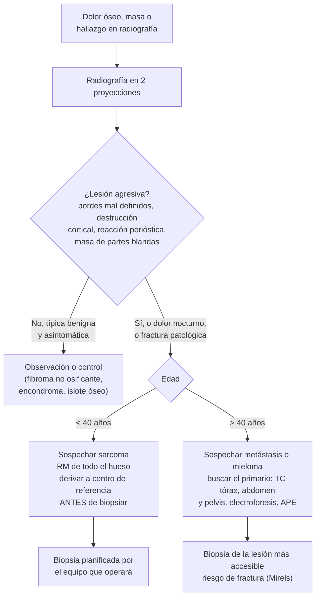
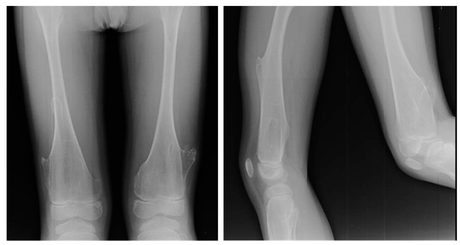
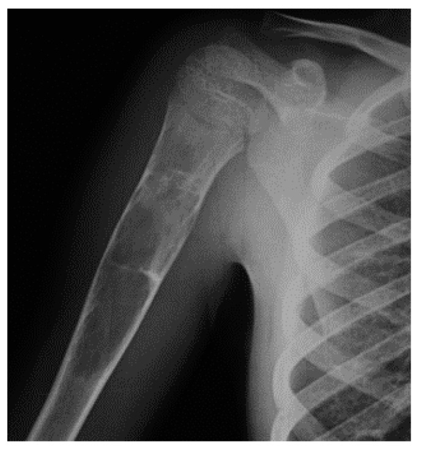

---
tags:
  - Traumatología
  - GES
---

# Tumores óseos (benignos, malignos primarios y metástasis óseas)

**Subespecialidad**
Traumatología y ortopedia oncológica · Oncología

**Guías principales**
ESMO–EURACAN–GENTURIS–ERN PaedCan 2021: sarcomas óseos (*Ann Oncol*) · Sociedad de Radiología Esquelética 2022: lesiones óseas incidentales (*Skeletal Radiol*)

**Otras fuentes**
Revisión de los tumores óseos benignos (*J Clin Med* 2022) · Revisión del osteosarcoma (*SICOT J* 2018) · Puntaje de Mirels (1989) · Ver [mieloma múltiple](../hematologia/gammapatias-monoclonales-y-mieloma-multiple.md), [tumores de partes blandas](../cirugia/piel-partes-blandas-y-quemaduras/tumores-de-partes-blandas.md) y [urgencias oncológicas](../hematologia/urgencias-oncologicas.md)

**GES**
Sí: **osteosarcoma en personas de 15 años y más** (N.° 73). Confirmación y etapificación en **60 días** desde la sospecha; tratamiento en **30 días** desde la indicación. En los menores de 15 años, los sarcomas óseos están en el GES **cáncer en personas menores de 15 años**.

**EUNACOM**
4.02.1.009 Tumores óseos (sospecha, inicial, derivar)

**Revisado**
Octubre 2026

!!! abstract "Resumen en 60 segundos"
    - En el **adulto**, una lesión ósea destructiva es casi siempre una **metástasis** o un **mieloma**, no un tumor primario.
        - Las metástasis óseas vienen de **mama, próstata, pulmón, riñón y tiroides**.
    - **Tumores primarios malignos** (sarcomas): raros, en **niños, adolescentes y adultos jóvenes**.
        - **Osteosarcoma**: metáfisis alrededor de la **rodilla**; triángulo de **Codman**, "sol naciente".
        - **Sarcoma de Ewing**: diáfisis, pelvis; "piel de cebolla"; fiebre.
        - **Condrosarcoma**: adultos, pelvis y fémur proximal.
    - **Benignos frecuentes**:
        - **Osteocondroma**: el más frecuente.
        - **Fibroma no osificante**: hallazgo incidental en niños.
        - **Encondroma** (falanges).
        - **Quiste óseo simple**: húmero proximal, fractura patológica.
        - **Osteoma osteoide**: **dolor nocturno que cede con AINE**.
        - **Tumor de células gigantes**: epífisis del adulto joven.
    - **Banderas rojas**:
        - **Dolor nocturno o de reposo**, persistente.
        - **Masa** creciente.
        - **Fractura patológica**.
        - Lesión **agresiva** en la radiografía: bordes mal definidos, destrucción cortical, **reacción perióstica**, masa de partes blandas.
    - **Conducta**: radiografía en 2 proyecciones y derivar a un centro de referencia **antes de cualquier biopsia**. La biopsia la hace o planifica **el equipo que operará**.
    - **Metástasis**: evaluar el **riesgo de fractura** (puntaje de **Mirels**, ≥ 9 = fijación profiláctica). Manejar el **dolor** (radioterapia), la **hipercalcemia** y la **compresión medular**.

## Definición

- **Tumor óseo primario**: neoplasia que se origina en las células del hueso (osteoblastos, condrocitos, fibroblastos, células de la médula ósea).
    - **Benigno**: no metastiza; puede ser localmente agresivo (tumor de células gigantes).
    - **Maligno (sarcoma óseo)**: osteosarcoma, sarcoma de Ewing, condrosarcoma, cordoma, entre otros.
- **Lesión pseudotumoral**: lesión no neoplásica que se parece a un tumor (quiste óseo simple, quiste óseo aneurismático, displasia fibrosa, fibroma no osificante).
- **Metástasis ósea**: implante de un cáncer de otro origen. Es la **lesión maligna ósea más frecuente** en el adulto.
- **Fractura patológica**: fractura en un hueso debilitado por una lesión, con un trauma mínimo o nulo.

## Epidemiología

### Mundial

- Los **sarcomas óseos** son **raros**: menos del 0,2 % de los cánceres. Se manejan en centros de referencia multidisciplinarios (ESMO 2021).
- **Osteosarcoma**: el sarcoma óseo primario más frecuente.
    - Distribución **bimodal**: adolescentes (estirón puberal) y adultos mayores, sobre una enfermedad de Paget o un hueso irradiado.
    - **~ 80 %** se ubican en la **metáfisis** de los huesos largos (Misaghi 2018), sobre todo el **fémur distal** y la **tibia proximal**.
    - El sitio más frecuente de metástasis es el **pulmón**.
- **Sarcoma de Ewing**: segundo sarcoma óseo en niños y adolescentes.
- **Condrosarcoma**: el sarcoma óseo más frecuente en el **adulto**.
- **Metástasis óseas**: mucho más frecuentes que los tumores primarios en el adulto. Son muy frecuentes en el cáncer de **mama** y **próstata** avanzados.
- **Osteocondroma**: el tumor óseo **benigno** más frecuente (De Salvo 2022).

### Chile

!!! chile "Datos nacionales"
    - **GES N.° 73**: osteosarcoma en personas de **15 años y más**.
        - Desde la **sospecha**: confirmación y etapificación en **60 días**.
        - Tratamiento primario y adyuvante en **30 días**.
        - Garantiza también la rehabilitación y el seguimiento.
    - Los sarcomas óseos de los **menores de 15 años** se cubren en el GES **cáncer en personas menores de 15 años**, a través del Programa Infantil Nacional de Drogas Antineoplásicas (PINDA).
    - El **mieloma múltiple** (GES N.° 84) y los cánceres que dan metástasis óseas (mama, próstata, pulmón, renal) también tienen garantías GES (ver [epidemiología del cáncer](../cirugia/anestesia-y-perioperatorio/epidemiologia-del-cancer.md)).

## Etiología y factores de riesgo

| Factor | Tumor asociado |
|---|---|
| **Edad**: < 20 años | Osteosarcoma, Ewing, osteocondroma, quiste óseo simple, fibroma no osificante, osteoma osteoide |
| **Edad**: 20–40 años | Tumor de células gigantes |
| **Edad**: > 40 años | **Metástasis**, **mieloma**, condrosarcoma, linfoma |
| **Radioterapia previa** | Osteosarcoma secundario |
| **Enfermedad de Paget** | Osteosarcoma en el adulto mayor |
| **Síndromes genéticos** | **Li-Fraumeni** (*TP53*) y **retinoblastoma hereditario** (*RB1*): osteosarcoma. **Osteocondromatosis múltiple hereditaria** (*EXT1/EXT2*) y **enfermedad de Ollier**: condrosarcoma |
| **Cáncer conocido** | Metástasis: **mama, próstata, pulmón, riñón, tiroides** |

## Fisiopatología

- **Patrón de crecimiento**:
    - Las lesiones **benignas** crecen lento. El hueso alcanza a **reaccionar**: borde escleroso, bien definido, sin reacción perióstica.
    - Las **malignas** crecen rápido. Destruyen la cortical y levantan el periostio, que forma hueso nuevo en capas o espículas (triángulo de Codman, "sol naciente", "piel de cebolla").
- **Localización** según la célula de origen y la edad:
    - **Epífisis**: tumor de células gigantes, condroblastoma.
    - **Metáfisis**: osteosarcoma, osteocondroma, quiste óseo simple, fibroma no osificante (zonas de crecimiento activo).
    - **Diáfisis**: Ewing, linfoma, displasia fibrosa.
- **Metástasis óseas**: llegan por vía hematógena a la médula roja (columna, pelvis, costillas, fémur y húmero proximales).
    - **Líticas**: riñón, tiroides, pulmón, mieloma.
    - **Blásticas**: próstata.
    - **Mixtas**: mama.
    - La lisis produce dolor, **hipercalcemia** y fracturas patológicas.

*Figura 1. Enfoque de una lesión ósea. Esquema propio.*

## Clasificación

**Tumores y lesiones óseas más importantes**

| Lesión | Edad | Localización | Radiografía | Clave |
|---|---|---|---|---|
| **Osteocondroma** (exostosis) | 10–30 años | Metáfisis de la rodilla, húmero proximal | Excrecencia ósea en continuidad con la cortical y la médula, que "se aleja" de la articulación | El **benigno más frecuente**; masa dura indolora; malignización rara (más en la forma múltiple) |
| **Fibroma no osificante** | Niños y adolescentes | Metáfisis del fémur distal o la tibia | Lesión lítica **cortical**, excéntrica, con borde escleroso festoneado | Hallazgo **incidental**; involuciona; no requiere tratamiento |
| **Encondroma** | 20–50 años | **Falanges de la mano**, húmero, fémur | Lítica central con **calcificaciones en "anillos y arcos"** (matriz condral) | Fractura patológica del dedo; enfermedad de Ollier (múltiples) |
| **Quiste óseo simple** | 5–15 años | **Húmero proximal**, fémur proximal | Lítica central, metafisaria; signo del "**fragmento caído**" tras una fractura | Se diagnostica por una **fractura patológica** |
| **Osteoma osteoide** | 10–30 años | Fémur proximal, tibia | **Nido** radiolúcido < 1,5–2 cm con esclerosis alrededor (mejor en la TC) | **Dolor nocturno que cede con AINE** |
| **Tumor de células gigantes** | **20–40 años** (fisis cerrada) | **Epífisis**: fémur distal, tibia proximal, radio distal | Lítica excéntrica, epifisaria, hasta el hueso subcondral, sin borde escleroso | Benigno **localmente agresivo**; recurre; metástasis pulmonares raras |
| **Osteosarcoma** | **10–25 años** y > 60 años | **Metáfisis** de la rodilla (fémur distal, tibia proximal), húmero proximal | Lesión mixta lítica-blástica, destrucción cortical, **triángulo de Codman**, espículas en "**sol naciente**", masa de partes blandas | Dolor y masa; **metástasis pulmonares**; GES N.° 73 |
| **Sarcoma de Ewing** | 5–20 años | **Diáfisis** de huesos largos, **pelvis**, costillas | Lítica permeativa ("apolillada"), reacción perióstica en "**piel de cebolla**", gran masa de partes blandas | **Fiebre**, VHS y leucocitos altos (simula una **osteomielitis**); translocación *EWSR1* |
| **Condrosarcoma** | **> 40 años** | **Pelvis**, fémur proximal, húmero, costillas | Lítica con calcificaciones condrales, festoneado endóstico profundo, engrosamiento cortical | Dolor en un encondroma conocido = sospechar malignización |
| **Metástasis** | **> 40 años** | Columna, pelvis, costillas, fémur y húmero proximales | Líticas, blásticas o mixtas; múltiples | Cáncer conocido o no; hipercalcemia |
| **Mieloma múltiple** | > 50 años | Cráneo, columna, pelvis, costillas | Lesiones líticas en "**sacabocado**" | Anemia, hipercalcemia, insuficiencia renal, componente M (ver [mieloma](../hematologia/gammapatias-monoclonales-y-mieloma-multiple.md)) |

**Puntaje de Mirels** (riesgo de fractura patológica en las metástasis de huesos largos)

| Variable | 1 punto | 2 puntos | 3 puntos |
|---|---|---|---|
| **Localización** | Extremidad superior | Extremidad inferior | **Peritrocantérea** |
| **Dolor** | Leve | Moderado | **Funcional** (con la carga) |
| **Tipo de lesión** | Blástica | Mixta | **Lítica** |
| **Tamaño** (fracción del diámetro) | < 1/3 | 1/3–2/3 | **> 2/3** |

- **≤ 7**: bajo riesgo; radioterapia y observación. **8**: zona gris. **≥ 9**: alto riesgo; **fijación profiláctica** antes de la radioterapia (Mirels 1989).

## Clínica

- **Dolor**: el síntoma más frecuente.
    - **Nocturno**, de **reposo**, progresivo, que no cede con el reposo: sospechar malignidad.
    - En el niño, no atribuir un dolor persistente de rodilla a "dolores de crecimiento" (los dolores de crecimiento son bilaterales, nocturnos y no limitan la actividad).
    - Dolor nocturno que cede con **AINE**: **osteoma osteoide**.
- **Masa** palpable, dura, a veces con calor local y circulación colateral (sarcoma).
- **Fractura patológica** con un trauma mínimo.
- **Síntomas sistémicos**: fiebre, baja de peso (Ewing, metástasis, mieloma).
- **Metástasis**:
    - Dolor óseo en un paciente con cáncer.
    - **Hipercalcemia**: poliuria, constipación, confusión.
    - **Compresión medular**: dolor dorsal, debilidad de las piernas, nivel sensitivo, retención urinaria.
- **Lesiones benignas**: muchas son **asintomáticas** y se encuentran por casualidad.

## Diagnóstico

!!! guia "Puntos clave (ESMO 2021; Sociedad de Radiología Esquelética 2022)"
    - Toda lesión ósea sospechosa de sarcoma debe **derivarse a un centro de referencia de sarcomas antes de la biopsia**. La biopsia la debe hacer o planificar **el equipo que hará la cirugía definitiva**: un trayecto mal ubicado puede contaminar compartimentos y obligar a una amputación.
    - La **radiografía simple** es el primer examen y el más útil para caracterizar la lesión. La **RM de todo el hueso** define la extensión local; la **TC de tórax**, las metástasis pulmonares.
    - Muchas lesiones incidentales tienen rasgos típicamente benignos y **no requieren más estudio** (islote óseo, fibroma no osificante, lipoma intraóseo). Las lesiones con **rasgos preocupantes** (destrucción cortical, reacción perióstica, masa de partes blandas, dolor) requieren estudio.
    - En el **adulto > 40 años** con una lesión lítica nueva, primero hay que buscar un **cáncer primario** y un **mieloma**.

## Laboratorio

| Examen | Utilidad |
|---|---|
| **Hemograma, VHS, PCR** | Ewing (leucocitosis, VHS alta), osteomielitis; anemia en el mieloma o las metástasis |
| **Fosfatasa alcalina** | Alta en el osteosarcoma (marcador pronóstico), las metástasis blásticas y la enfermedad de Paget |
| **LDH** | Pronóstico en el osteosarcoma y el Ewing |
| **Calcio, creatinina** | **Hipercalcemia** en las metástasis y el mieloma |
| **Electroforesis de proteínas y cadenas livianas libres en suero** | **Mieloma** |
| **APE** | Metástasis blásticas en el hombre (próstata) |
| **Biopsia** (con aguja gruesa o abierta) | **Confirma el diagnóstico**; en el centro de referencia |

## Imágenes

| Examen | Uso |
|---|---|
| **Radiografía** (2 proyecciones) | Primer examen: localización, bordes, matriz, reacción perióstica, destrucción cortical |
| **RM** con contraste de **todo el hueso** | Extensión local del sarcoma (médula, partes blandas, lesiones salteadas), planificación quirúrgica |
| **TC** | Detalle cortical; **nido** del osteoma osteoide; **TC de tórax** para las metástasis pulmonares |
| **Cintigrama óseo** | Lesiones múltiples (metástasis blásticas); **poco útil en el mieloma** (lesiones "frías") |
| **PET-CT** | Etapificación del sarcoma (Ewing) y de las metástasis |

<figure markdown>
{ loading=lazy }
<figcaption>Figura 2. Osteocondromas múltiples en las metáfisis de la rodilla: excrecencias óseas en continuidad con la cortical y la médula del hueso, que se dirigen en sentido contrario a la articulación. De Salvo S, Pavone V, Coco S, et al. <em>J Clin Med.</em> 2022. Licencia CC BY 4.0.</figcaption>
</figure>

<figure markdown>
{ loading=lazy }
<figcaption>Figura 3. Quiste óseo simple (unicameral) en el húmero proximal de un niño: lesión lítica central, metafisaria, bien delimitada, que adelgaza la cortical y predispone a una fractura patológica. De Salvo S, Pavone V, Coco S, et al. <em>J Clin Med.</em> 2022. Licencia CC BY 4.0.</figcaption>
</figure>

## Diagnóstico diferencial

| Cuadro | Diferencia con un tumor |
|---|---|
| **Osteomielitis** | Fiebre, PCR alta, factores de riesgo; puede ser idéntica al **Ewing** en la radiografía: la biopsia con cultivo aclara (ver [osteomielitis](../infectologia/osteomielitis.md)) |
| **Fractura por estrés** | Antecedente de carga repetida; callo perióstico ordenado; la RM muestra la línea de fractura |
| **Miositis osificante** | Antecedente de trauma; la calcificación madura desde la **periferia** hacia el centro (el osteosarcoma lo hace al revés) |
| **Displasia fibrosa** | Lesión en "**vidrio esmerilado**", deformidad en "cayado de pastor" del fémur |
| **Enfermedad de Paget** | Adulto mayor; engrosamiento cortical y trabecular, hueso agrandado, fosfatasa alcalina alta |
| **Infarto óseo** | Calcificación serpiginosa en la médula; corticoides, drepanocitosis |
| **Dolores de crecimiento** | Niños de 3–12 años, bilaterales, nocturnos, en los muslos o las pantorrillas, sin cojera ni signos; el examen es normal |

## Tratamiento

**Lo que hace el médico general**

1. **Sospechar** con las banderas rojas.
2. Pedir una **radiografía** en 2 proyecciones.
3. **Derivar** de forma preferente a traumatología oncológica (centro de referencia de sarcomas) con la sospecha **GES** si corresponde.
4. **No biopsiar** ni operar en un centro que no hará el tratamiento definitivo.
5. **Analgesia**; **descarga** (bastones) si hay riesgo de fractura en una extremidad inferior.
6. En el **adulto con una lesión lítica**: buscar el primario y el mieloma mientras deriva.

**Tratamiento por tipo** (especialista)

| Lesión | Tratamiento |
|---|---|
| **Fibroma no osificante, encondroma asintomático, islote óseo** | **Observación** |
| **Osteocondroma** sintomático (compresión, roce) | Resección |
| **Quiste óseo simple** | Observación o infiltración, curetaje e injerto; tratar la fractura patológica |
| **Osteoma osteoide** | **AINE**; ablación por radiofrecuencia guiada por TC |
| **Tumor de células gigantes** | **Curetaje extendido** con adyuvante local e injerto o cemento; denosumab en casos irresecables |
| **Osteosarcoma** | **Quimioterapia neoadyuvante** (MAP: metotrexato en dosis altas, doxorrubicina, cisplatino) → **cirugía con márgenes amplios** (cirugía de **preservación de la extremidad** cuando es posible) → quimioterapia adyuvante (ESMO 2021) |
| **Sarcoma de Ewing** | Quimioterapia multiagente + control local con **cirugía y/o radioterapia** (es radiosensible) |
| **Condrosarcoma** | **Cirugía** con márgenes amplios (resistente a la quimioterapia y la radioterapia) |
| **Metástasis óseas** | Tratamiento del cáncer de base; **radioterapia** paliativa del dolor; **fijación profiláctica** si Mirels ≥ 9; **bifosfonatos** (ácido zoledrónico) o **denosumab** para prevenir los eventos esqueléticos |

!!! dosis "Fármacos de apoyo en la enfermedad ósea metastásica (adultos)"
    | Fármaco | Dosis | Comentario |
    |---|---|---|
    | **Ácido zoledrónico** | **4 mg IV** en 15 min, cada 3–4 semanas (luego cada 12 semanas) | Ajustar a la función renal; también trata la **hipercalcemia** |
    | **Denosumab** | **120 mg SC** cada 4 semanas | Con calcio y vitamina D; riesgo de **hipocalcemia** |
    | **Analgesia** | Escalera de la OMS; opioides según la intensidad | Dolor oncológico: GES N.° 4 (ver [manejo del dolor](../cirugia/anestesia-y-perioperatorio/manejo-del-dolor.md)) |
    | **Dexametasona** (compresión medular) | **10 mg IV** en bolo, luego **4 mg cada 6 h** | Más radioterapia o cirugía urgente (ver [urgencias oncológicas](../hematologia/urgencias-oncologicas.md)) |

    - Ambos fármacos (bifosfonatos y denosumab) se asocian a **osteonecrosis de los maxilares**: hacer una evaluación dental antes de iniciarlos.

!!! alarma "Derivar de forma urgente"
    - **Dolor dorsal** con debilidad de las piernas, nivel sensitivo o retención urinaria en un paciente con cáncer: **compresión medular**.
    - **Hipercalcemia** sintomática.
    - **Fractura patológica** o lesión con un riesgo alto de fractura (Mirels ≥ 9).
    - Niño o adolescente con **dolor óseo persistente nocturno** o **masa** junto a la rodilla o el hombro.

## Complicaciones

- **Fractura patológica**: fémur proximal (metástasis), húmero proximal (quiste óseo simple), falanges (encondroma).
- **Compresión medular** (metástasis vertebrales) e **hipercalcemia** (ver [urgencias oncológicas](../hematologia/urgencias-oncologicas.md)).
- **Metástasis pulmonares** (osteosarcoma, Ewing).
- **Malignización**: osteocondroma (osteocondromatosis múltiple) o encondroma (Ollier) → condrosarcoma.
- **Recurrencia local**: tumor de células gigantes, condrosarcoma con márgenes insuficientes.
- **Biopsia mal planificada**: contaminación de los compartimentos, pérdida de la opción de preservar la extremidad.

## Pronóstico y seguimiento

- **Osteosarcoma localizado**: la quimioterapia y la cirugía logran una **sobrevida a 5 años de alrededor de 60–70 %**. Con metástasis al diagnóstico, el pronóstico es mucho peor. Una buena **respuesta histológica** a la quimioterapia neoadyuvante es un factor pronóstico favorable.
- **Ewing localizado**: sobrevida similar; peor si hay metástasis o un tumor pélvico.
- **Metástasis óseas**: el pronóstico depende del primario. Es mejor en la mama y la próstata (años) que en el pulmón (meses).
- **Seguimiento**: imágenes de la zona tratada y **TC de tórax** periódicas durante años, más los efectos tardíos de la quimioterapia (cardiotoxicidad por antraciclinas, ototoxicidad y nefrotoxicidad por cisplatino, infertilidad).

## Perlas para el internado

!!! perla "Para recordar en la sala"
    - **Adulto + lesión lítica = metástasis o mieloma** hasta demostrar lo contrario. Pensar en las 5 que van al hueso: **mama, próstata, pulmón, riñón, tiroides**.
    - **Adolescente + dolor de rodilla nocturno o masa = osteosarcoma** hasta demostrar lo contrario: radiografía y derivar.
    - **Osteosarcoma**: metáfisis, Codman, "sol naciente". **Ewing**: diáfisis, "piel de cebolla", fiebre (simula una osteomielitis).
    - **Dolor nocturno que cede con aspirina o AINE**: **osteoma osteoide**.
    - **Epífisis + adulto joven**: **tumor de células gigantes**.
    - **No biopsiar** una sospecha de sarcoma fuera del centro que la va a operar.
    - **Mieloma**: el cintigrama óseo puede ser **normal**; pedir radiografías, TC o RM y la electroforesis.
    - **Mirels ≥ 9** = fijación profiláctica.

## Preguntas de repaso

??? repaso "1. Adolescente de 15 años con dolor en la rodilla derecha de 2 meses, que lo despierta en la noche, y aumento de volumen en el fémur distal. ¿Qué sospecha y qué hace?"
    - **Osteosarcoma** (edad, metáfisis de la rodilla, dolor nocturno, masa).
    - **Radiografía** del fémur en 2 proyecciones: buscar destrucción cortical, **triángulo de Codman** y espículas en "sol naciente".
    - **Derivar** a un centro de referencia de sarcomas, **sin biopsiar** antes.
    - Si tiene 15 años o más, es **GES N.° 73** (confirmación y etapificación en 60 días).

??? repaso "2. Mujer de 65 años con dolor en el muslo al caminar y una lesión lítica que ocupa más de 2/3 del diámetro del fémur proximal (peritrocantérea). ¿Qué hace?"
    - Sospechar una **metástasis** (o un mieloma). Buscar el primario: examen de mamas, **mamografía**, TC de tórax, abdomen y pelvis, **electroforesis de proteínas**, calcio y creatinina.
    - **Puntaje de Mirels**: peritrocantérea (3) + dolor funcional (3) + lítica (3) + > 2/3 (3) = **12**: **alto riesgo de fractura**.
    - **Descarga** inmediata y derivar para una **fijación profiláctica**, seguida de radioterapia.

??? repaso "3. Niño de 10 años que se fracturó el húmero proximal al lanzar una pelota. La radiografía muestra una lesión lítica central, metafisaria, bien delimitada. ¿Qué es?"
    - **Fractura patológica sobre un quiste óseo simple** (unicameral): lesión benigna típica del húmero proximal en niños. Puede verse el signo del "fragmento caído".
    - Se trata la fractura (muchas veces con un manejo ortopédico) y se deriva a traumatología para el manejo del quiste.

??? repaso "4. Joven de 18 años con dolor nocturno en la pierna que cede notablemente con ibuprofeno. ¿Cuál es el diagnóstico más probable y cómo lo confirma?"
    - **Osteoma osteoide**.
    - La **TC** muestra el **nido** radiolúcido (< 1,5–2 cm) con esclerosis alrededor.
    - Tratamiento: AINE o **ablación por radiofrecuencia** guiada por TC.

??? repaso "5. Niño de 8 años con fiebre, dolor y aumento de volumen en el muslo, VHS alta y una lesión diafisaria permeativa con reacción perióstica en "piel de cebolla". ¿Qué dos diagnósticos debe distinguir?"
    - **Sarcoma de Ewing** y **osteomielitis**: pueden ser clínica y radiológicamente indistinguibles.
    - Se distinguen con la **biopsia** (histología y cultivo) en un centro de referencia.

??? repaso "6. Hallazgo incidental en un adolescente de una lesión lítica cortical, excéntrica, con borde escleroso festoneado en la metáfisis tibial, asintomática. ¿Qué hace?"
    - Es típica de un **fibroma no osificante**: lesión benigna y frecuente que involuciona con el crecimiento.
    - **No requiere biopsia ni tratamiento**. Basta con una observación o un control clínico; se deriva solo si es grande (riesgo de fractura) o sintomática.

## Referencias

1. Strauss SJ, Frezza AM, Abecassis N, et al. Bone sarcomas: ESMO–EURACAN–GENTURIS–ERN PaedCan Clinical Practice Guideline for diagnosis, treatment and follow-up. *Ann Oncol.* 2021;32(12):1520–1536. doi:[10.1016/j.annonc.2021.08.1995](https://doi.org/10.1016/j.annonc.2021.08.1995)
2. Chang CY, Garner HW, Ahlawat S, et al. Society of Skeletal Radiology – white paper. Guidelines for the diagnostic management of incidental solitary bone lesions on CT and MRI in adults: bone reporting and data system (Bone-RADS). *Skeletal Radiol.* 2022;51(9):1743–1764. doi:[10.1007/s00256-022-04022-8](https://doi.org/10.1007/s00256-022-04022-8)
3. De Salvo S, Pavone V, Coco S, et al. Benign bone tumors: an overview of what we know today. *J Clin Med.* 2022;11(3):699. doi:[10.3390/jcm11030699](https://doi.org/10.3390/jcm11030699)
4. Misaghi A, Goldin A, Awad M, Kulidjian AA. Osteosarcoma: a comprehensive review. *SICOT J.* 2018;4:12. doi:[10.1051/sicotj/2017028](https://doi.org/10.1051/sicotj/2017028)
5. Mirels H. Metastatic disease in long bones: a proposed scoring system for diagnosing impending pathologic fractures. *Clin Orthop Relat Res.* 1989;(249):256–264. [PubMed](https://pubmed.ncbi.nlm.nih.gov/2684463/)
6. Superintendencia de Salud. Problema de salud 73: osteosarcoma en personas de 15 años y más. [superdesalud.gob.cl](https://www.superdesalud.gob.cl/orientacion-en-salud/osteosarcoma-en-personas-de-15-anos-y-mas/)
